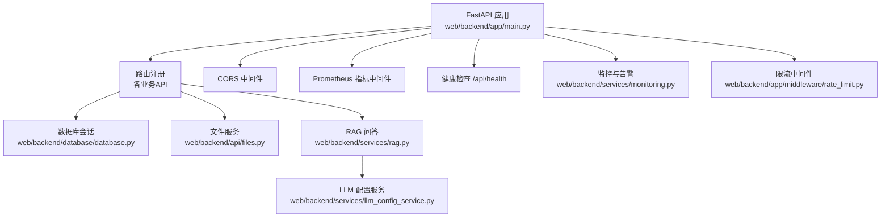
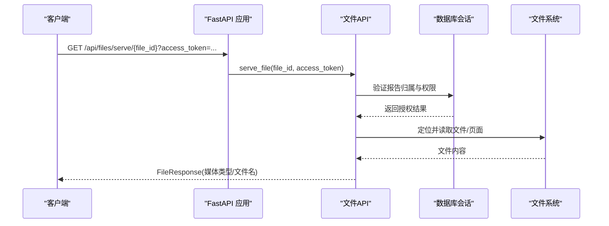
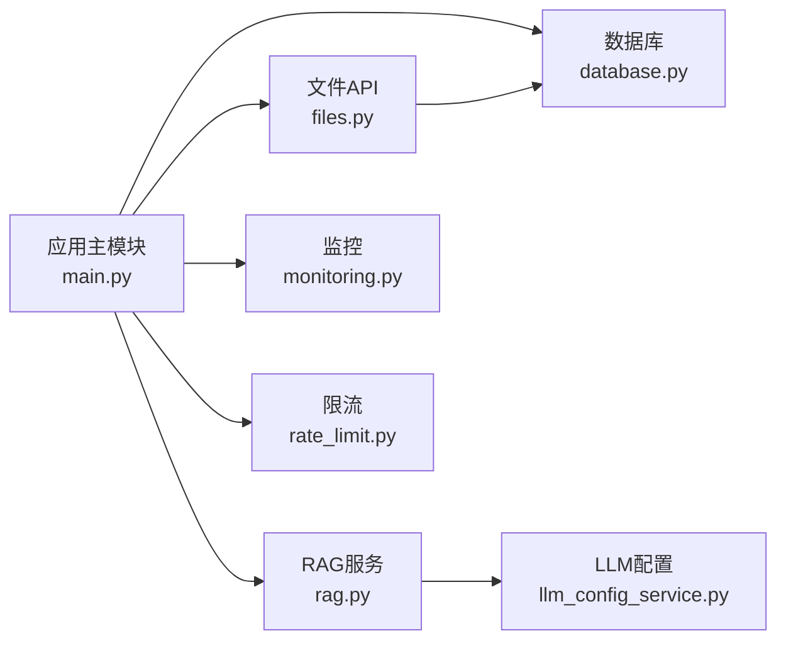

# 运行时错误

<cite>
**本文引用的文件**
- [web/backend/app/main.py](file://web/backend/app/main.py)
- [web/backend/database/database.py](file://web/backend/database/database.py)
- [web/backend/api/files.py](file://web/backend/api/files.py)
- [web/backend/services/rag.py](file://web/backend/services/rag.py)
- [web/backend/services/llm_config_service.py](file://web/backend/services/llm_config_service.py)
- [web/backend/services/monitoring.py](file://web/backend/services/monitoring.py)
- [web/backend/app/middleware/rate_limit.py](file://web/backend/app/middleware/rate_limit.py)
- [src/settings/logging.py](file://src/settings/logging.py)
- [src/utils/logger.py](file://src/utils/logger.py)
- [src/exceptions.py](file://src/exceptions.py)
- [web/backend/exceptions.py](file://web/backend/exceptions.py)
</cite>

## 目录
1. [简介](#简介)
2. [项目结构](#项目结构)
3. [核心组件](#核心组件)
4. [架构总览](#架构总览)
5. [详细组件分析](#详细组件分析)
6. [依赖关系分析](#依赖关系分析)
7. [性能注意事项](#性能注意事项)
8. [故障排查指南](#故障排查指南)
9. [结论](#结论)
10. [附录](#附录)

## 简介
本文件面向Subskin后端服务的运维与研发人员，聚焦“运行时错误”的排查与解决。覆盖以下典型场景：
- 后端服务启动失败（数据库、LLM配置、迁移）
- API接口调用异常（鉴权、限流、权限校验）
- 数据库操作错误（连接池、锁竞争、SQL异常）
- 文件上传下载失败（路径校验、权限、预览）
- AI服务调用超时或失败（RAG、Embedding、模型测试）
并提供日志分析技巧、堆栈跟踪解读、内存泄漏检测、性能瓶颈识别方法，以及错误代码对照表、调试工具推荐和问题复现步骤。

## 项目结构
后端基于FastAPI构建，关键入口在应用主模块中完成路由注册、中间件挂载、监控初始化、数据库表结构保障等；数据库连接通过SQLAlchemy管理；AI能力由RAG服务封装；文件读写集中在文件API；日志与监控分别由logging与Sentry/Prometheus提供。

**图表来源**
- [web/backend/app/main.py:264-337](file://web/backend/app/main.py#L264-L337)
- [web/backend/database/database.py:17-33](file://web/backend/database/database.py#L17-L33)
- [web/backend/api/files.py:293-331](file://web/backend/api/files.py#L293-L331)
- [web/backend/services/rag.py:354-384](file://web/backend/services/rag.py#L354-L384)
- [web/backend/services/llm_config_service.py:215-270](file://web/backend/services/llm_config_service.py#L215-L270)
- [web/backend/services/monitoring.py:28-63](file://web/backend/services/monitoring.py#L28-L63)
- [web/backend/app/middleware/rate_limit.py:10-36](file://web/backend/app/middleware/rate_limit.py#L10-L36)

**章节来源**
- [web/backend/app/main.py:264-337](file://web/backend/app/main.py#L264-L337)

## 核心组件
- 应用生命周期与启动流程：加载环境变量、创建数据库表、确保字段存在、注册路由、初始化监控与LLM配置、清理临时文件。
- 数据库连接：SQLite使用NullPool避免并发阻塞，设置写锁等待时间；其他数据库启用预检。
- 文件服务：统一鉴权、路径安全校验、访问控制策略（按bucket）、PDF分页预览、HTML查看器。
- RAG服务：关键词检索与向量检索混合，嵌入生成失败回退，相似度计算维度不匹配保护。
- LLM配置服务：多供应商支持、API Key加密存储、默认模块初始化、密钥重加密迁移、配置测试。
- 监控与告警：Sentry集成过滤敏感信息，Prometheus指标收集与健康检查。
- 限流：读/写/聊天三类令牌桶限流，防止滥用与成本失控。

**章节来源**
- [web/backend/app/main.py:74-191](file://web/backend/app/main.py#L74-L191)
- [web/backend/database/database.py:17-33](file://web/backend/database/database.py#L17-L33)
- [web/backend/api/files.py:51-227](file://web/backend/api/files.py#L51-L227)
- [web/backend/services/rag.py:456-522](file://web/backend/services/rag.py#L456-L522)
- [web/backend/services/llm_config_service.py:272-340](file://web/backend/services/llm_config_service.py#L272-L340)
- [web/backend/services/monitoring.py:28-63](file://web/backend/services/monitoring.py#L28-L63)
- [web/backend/app/middleware/rate_limit.py:10-36](file://web/backend/app/middleware/rate_limit.py#L10-L36)

## 架构总览
下图展示一次“体检报告文件在线预览”的典型请求链路，包括鉴权、权限校验、文件读取与响应。

**图表来源**
- [web/backend/api/files.py:293-331](file://web/backend/api/files.py#L293-L331)
- [web/backend/api/files.py:235-290](file://web/backend/api/files.py#L235-L290)
- [web/backend/database/database.py:38-45](file://web/backend/database/database.py#L38-L45)

**章节来源**
- [web/backend/api/files.py:293-331](file://web/backend/api/files.py#L293-L331)

## 详细组件分析

### 后端服务启动失败
常见问题与定位要点：
- 数据库表/列缺失导致下游API崩溃：启动时执行ensure_*函数，若失败会记录异常日志，便于快速定位。
- LLM模块未初始化或密钥迁移失败：启动阶段初始化默认模块并重加密旧密钥，失败会记录错误日志。
- 监控初始化失败：Sentry/Prometheus未安装或未配置时降级处理，不影响服务启动。

建议排查步骤：
- 检查启动日志中的异常堆栈，关注ensure_*与LLM初始化相关错误。
- 确认数据库连接字符串与权限正确，SQLite需保证data目录可写。
- 确认环境变量（如SENTRY_DSN、PROMETHEUS_ENABLED、LLM_ENCRYPTION_KEY）是否配置。

**章节来源**
- [web/backend/app/main.py:74-191](file://web/backend/app/main.py#L74-L191)
- [web/backend/services/llm_config_service.py:272-340](file://web/backend/services/llm_config_service.py#L272-L340)
- [web/backend/services/monitoring.py:28-63](file://web/backend/services/monitoring.py#L28-L63)

### API接口调用异常
常见错误与原因：
- 鉴权失败：缺少有效token或短时效文件访问令牌过期，返回401。
- 权限不足：访问受限bucket或资源不属于当前用户，返回403。
- 资源不存在：文件/报告ID不存在，返回404。
- 限流触发：读/写/聊天超过阈值，返回429。
- 服务器内部错误：未知异常捕获后返回500。

建议排查步骤：
- 根据HTTP状态码定位问题域（鉴权、权限、资源、限流、服务端）。
- 结合日志查看具体抛出点与上下文参数（user_id、file_path、access_token）。
- 对聊天接口注意用户级限流，避免单用户高频请求被拒。

**章节来源**
- [web/backend/api/files.py:72-94](file://web/backend/api/files.py#L72-L94)
- [web/backend/api/files.py:138-227](file://web/backend/api/files.py#L138-L227)
- [web/backend/app/middleware/rate_limit.py:39-96](file://web/backend/app/middleware/rate_limit.py#L39-L96)
- [web/backend/api/files.py:293-331](file://web/backend/api/files.py#L293-L331)

### 数据库操作错误
典型问题：
- SQLite写锁竞争导致“database is locked”：已调整timeout至15秒，但仍可能在高并发写入时出现。
- 连接池耗尽导致服务冻结：SQLite使用NullPool避免队列池耗尽；其他数据库启用pre_ping。
- 表/列缺失导致查询失败：启动时ensure_*函数负责补齐，失败会记录异常。

建议排查步骤：
- 观察数据库错误日志，确认是否为锁竞争或连接池问题。
- 评估并发写入峰值，必要时引入队列或分片。
- 检查数据库版本与迁移脚本一致性。

**章节来源**
- [web/backend/database/database.py:17-33](file://web/backend/database/database.py#L17-L33)
- [web/backend/app/main.py:74-191](file://web/backend/app/main.py#L74-L191)

### 文件上传下载失败
常见问题：
- 路径遍历防护：解析路径后校验相对性，非法路径返回403。
- 权限校验：不同bucket有严格的所有者/公开规则，越权访问返回403。
- PDF分页预览：页码不存在或命名不一致时返回404。
- 媒体类型猜测失败：无法推断类型时使用octet-stream。

建议排查步骤：
- 检查上传目录结构与文件名规范（包含user_id前缀）。
- 确认访问令牌与用户身份一致。
- 对PDF预览，检查page目录是否存在对应页码图片。

**章节来源**
- [web/backend/api/files.py:51-69](file://web/backend/api/files.py#L51-L69)
- [web/backend/api/files.py:138-227](file://web/backend/api/files.py#L138-L227)
- [web/backend/api/files.py:341-370](file://web/backend/api/files.py#L341-L370)
- [web/backend/api/files.py:258-290](file://web/backend/api/files.py#L258-L290)

### AI服务调用超时或失败
常见问题：
- 未配置LLM API Key：embedding或chat调用直接报错。
- 嵌入生成失败：自动回退到关键词搜索，避免阻断问答流程。
- 维度不匹配：cosine_similarity检测到维度不一致时返回0并记录警告，避免错误排序。
- 模型测试失败：配置测试接口返回错误详情，便于定位provider/base_url/model问题。

建议排查步骤：
- 检查LLM模块配置是否激活，API Key是否解密成功。
- 查看embedding调用日志，确认provider与base_url是否正确。
- 对维度不匹配，检查文档embedding是否与查询embedding维度一致。
- 使用配置测试接口验证连通性与模型可用性。

**章节来源**
- [web/backend/services/rag.py:354-384](file://web/backend/services/rag.py#L354-L384)
- [web/backend/services/rag.py:387-401](file://web/backend/services/rag.py#L387-L401)
- [web/backend/services/rag.py:456-522](file://web/backend/services/rag.py#L456-L522)
- [web/backend/services/llm_config_service.py:472-517](file://web/backend/services/llm_config_service.py#L472-L517)

## 依赖关系分析
- 应用主模块依赖数据库、文件API、RAG服务、监控与限流中间件。
- RAG服务依赖LLM配置服务获取provider、model、base_url与api_key。
- 文件API依赖数据库会话进行权限校验，依赖文件系统提供实际数据。
- 监控模块可选依赖sentry-sdk与prometheus-client，未安装时降级。

**图表来源**
- [web/backend/app/main.py:264-337](file://web/backend/app/main.py#L264-L337)
- [web/backend/services/rag.py:456-522](file://web/backend/services/rag.py#L456-L522)
- [web/backend/services/llm_config_service.py:215-270](file://web/backend/services/llm_config_service.py#L215-L270)
- [web/backend/api/files.py:293-331](file://web/backend/api/files.py#L293-L331)
- [web/backend/database/database.py:17-33](file://web/backend/database/database.py#L17-L33)

**章节来源**
- [web/backend/app/main.py:264-337](file://web/backend/app/main.py#L264-L337)

## 性能注意事项
- SQLite并发写入：使用NullPool与timeout降低锁竞争影响；高并发场景考虑分库或消息队列削峰。
- 向量检索维度不匹配：提前校验维度，避免无效相似计算与错误排序。
- Prometheus指标：仅采集路由模板端点，避免高基数导致指标爆炸。
- 限流策略：聊天接口按用户ID限流，防止单用户无限流式请求造成成本飙升。

[本节为通用指导，无需特定文件引用]

## 故障排查指南

### 错误日志分析技巧
- 统一日志格式：控制台与文件输出，支持定时轮转，便于长期留存与分析。
- 关键日志位置：
  - 启动阶段：ensure_*与LLM初始化异常。
  - 文件服务：Serve医疗报告失败、权限校验失败。
  - RAG服务：embedding失败、维度不匹配、关键词回退。
  - 监控：Sentry事件过滤敏感信息，Prometheus指标延迟初始化。

**章节来源**
- [src/utils/logger.py:19-80](file://src/utils/logger.py#L19-L80)
- [src/settings/logging.py:14-43](file://src/settings/logging.py#L14-L43)
- [web/backend/api/files.py:312-317](file://web/backend/api/files.py#L312-L317)
- [web/backend/services/rag.py:376-384](file://web/backend/services/rag.py#L376-L384)
- [web/backend/services/monitoring.py:66-77](file://web/backend/services/monitoring.py#L66-L77)

### 堆栈跟踪解读
- 优先定位抛出HTTPException的位置，确认状态码与detail信息。
- 对于服务内部异常，查看logger.error记录的完整堆栈，定位具体函数与行号。
- 对RAG与LLM调用，关注异常类型（网络、认证、超时），并结合配置测试接口验证。

**章节来源**
- [web/backend/api/files.py:312-317](file://web/backend/api/files.py#L312-L317)
- [web/backend/services/llm_config_service.py:472-517](file://web/backend/services/llm_config_service.py#L472-L517)

### 内存泄漏检测
- 观察进程内存增长趋势，结合Prometheus指标判断是否由长连接或大对象未释放引起。
- 文件上传路径避免重复创建目录与文件句柄泄露。
- 数据库会话使用yield模式确保关闭，避免连接泄漏。

**章节来源**
- [web/backend/database/database.py:38-45](file://web/backend/database/database.py#L38-L45)
- [web/backend/api/files.py:479-503](file://web/backend/api/files.py#L479-L503)

### 性能瓶颈识别
- 使用Prometheus指标分析热点端点耗时与QPS，定位慢查询与外部调用瓶颈。
- RAG向量检索失败时回退关键词检索，避免长时间阻塞。
- 文件预览对PDF分页渲染，注意IO与内存占用。

**章节来源**
- [web/backend/services/monitoring.py:96-172](file://web/backend/services/monitoring.py#L96-L172)
- [web/backend/services/rag.py:456-522](file://web/backend/services/rag.py#L456-L522)
- [web/backend/api/files.py:341-370](file://web/backend/api/files.py#L341-L370)

### 错误代码对照表
- 400 请求错误：参数校验失败或业务规则拒绝（如RAG主题过滤）。
- 401 未授权：缺少或无效token（API或文件访问令牌）。
- 403 禁止访问：路径越权或资源不属于当前用户。
- 404 资源不存在：文件/报告ID不存在或页码缺失。
- 429 请求过多：触达读/写/聊天限流阈值。
- 500 服务器内部错误：未知异常或服务暂时不可用。

**章节来源**
- [web/backend/api/files.py:55-69](file://web/backend/api/files.py#L55-L69)
- [web/backend/api/files.py:72-94](file://web/backend/api/files.py#L72-L94)
- [web/backend/api/files.py:138-227](file://web/backend/api/files.py#L138-L227)
- [web/backend/app/middleware/rate_limit.py:39-96](file://web/backend/app/middleware/rate_limit.py#L39-L96)
- [web/backend/api/files.py:293-331](file://web/backend/api/files.py#L293-L331)

### 调试工具推荐
- pdb：用于断点调试Python代码，定位异常抛出点。
- logging：统一日志格式与轮转，便于生产环境追踪。
- Sentry：集中错误上报与堆栈分析，过滤敏感信息。
- Prometheus：指标采集与可视化，识别性能瓶颈。

**章节来源**
- [src/utils/logger.py:19-80](file://src/utils/logger.py#L19-L80)
- [web/backend/services/monitoring.py:28-63](file://web/backend/services/monitoring.py#L28-L63)
- [web/backend/services/monitoring.py:96-172](file://web/backend/services/monitoring.py#L96-L172)

### 问题复现步骤
- 启动失败：检查.env与数据库连接，查看启动日志中的ensure_*与LLM初始化异常。
- API异常：构造最小请求（含必要token），观察HTTP状态码与日志detail。
- 数据库错误：模拟高并发写入，观察锁竞争与连接池行为。
- 文件上传下载：上传小文件并尝试预览，检查路径与权限逻辑。
- AI调用超时：使用配置测试接口验证provider连通性，逐步缩小问题范围。

**章节来源**
- [web/backend/app/main.py:74-191](file://web/backend/app/main.py#L74-L191)
- [web/backend/api/files.py:479-503](file://web/backend/api/files.py#L479-L503)
- [web/backend/services/llm_config_service.py:472-517](file://web/backend/services/llm_config_service.py#L472-L517)

## 结论
通过统一的日志、监控与限流机制，Subskin后端能够较快地定位与修复运行时错误。重点在于：
- 启动阶段确保数据库与LLM配置就绪。
- 文件服务严格鉴权与路径安全。
- RAG服务具备健壮的回退与维度校验。
- 监控与限流帮助识别性能瓶颈与滥用行为。
建议在生产环境持续完善日志与指标，定期演练故障复现与恢复流程。

[本节为总结性内容，无需特定文件引用]

## 附录

### 自定义异常体系
- 爬虫层异常：基类与派生类用于区分API错误、速率限制、缓存错误。
- 业务层异常：凭证冲突、凭证不存在等，便于API层转换为HTTP响应。

**章节来源**
- [src/exceptions.py:13-39](file://src/exceptions.py#L13-L39)
- [web/backend/exceptions.py:4-20](file://web/backend/exceptions.py#L4-L20)

### 日志配置与使用
- 基础日志配置：按级别输出到控制台，支持文件轮转。
- 便捷获取Logger：统一格式化与处理器管理。

**章节来源**
- [src/settings/logging.py:14-43](file://src/settings/logging.py#L14-L43)
- [src/utils/logger.py:19-80](file://src/utils/logger.py#L19-L80)