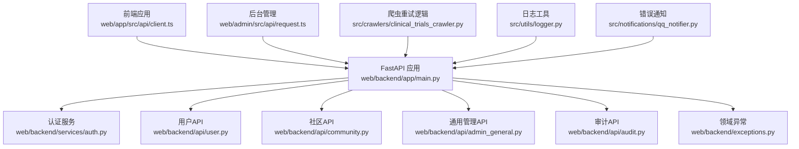
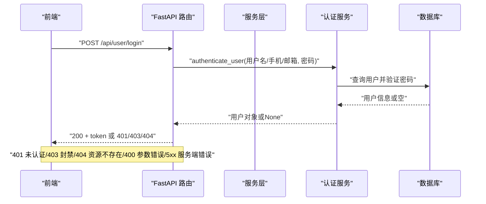
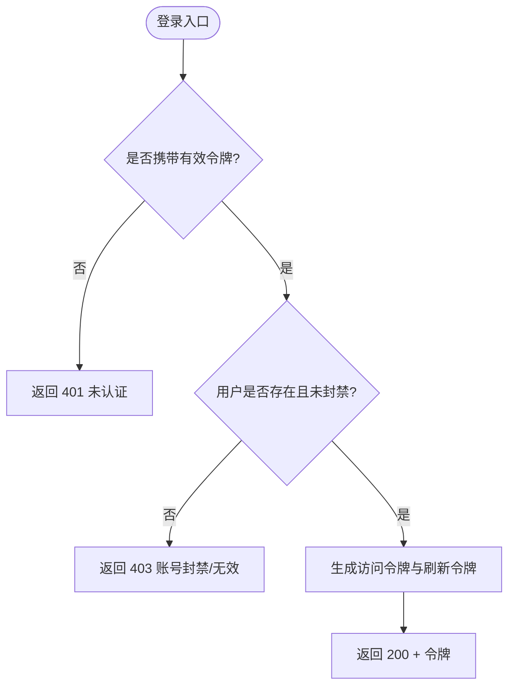
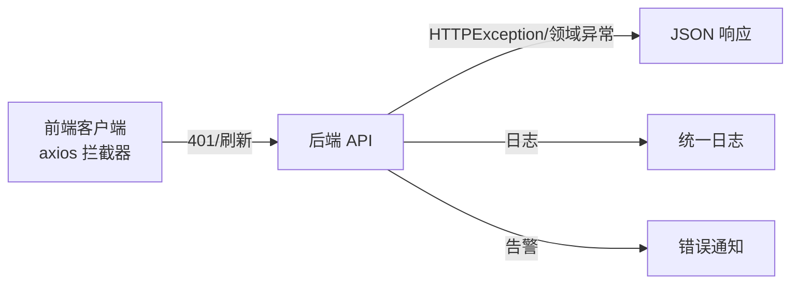

# 错误码对照表

<cite>
**本文引用的文件**
- [web/backend/app/main.py](file://web/backend/app/main.py)
- [web/backend/api/user.py](file://web/backend/api/user.py)
- [web/backend/services/auth.py](file://web/backend/services/auth.py)
- [web/backend/exceptions.py](file://web/backend/exceptions.py)
- [web/backend/api/admin_general.py](file://web/backend/api/admin_general.py)
- [web/backend/api/community.py](file://web/backend/api/community.py)
- [web/backend/api/audit.py](file://web/backend/api/audit.py)
- [src/exceptions.py](file://src/exceptions.py)
- [src/crawlers/clinical_trials_crawler.py](file://src/crawlers/clinical_trials_crawler.py)
- [src/utils/logger.py](file://src/utils/logger.py)
- [src/notifications/qq_notifier.py](file://src/notifications/qq_notifier.py)
- [web/app/src/api/client.ts](file://web/app/src/api/client.ts)
- [web/admin/src/api/request.ts](file://web/admin/src/api/request.ts)
- [web/app/src/composables/useToast.ts](file://web/app/src/composables/useToast.ts)
</cite>

## 目录
1. [简介](#简介)
2. [项目结构](#项目结构)
3. [核心组件](#核心组件)
4. [架构总览](#架构总览)
5. [详细组件分析](#详细组件分析)
6. [依赖关系分析](#依赖关系分析)
7. [性能与稳定性考虑](#性能与稳定性考虑)
8. [故障诊断指南](#故障诊断指南)
9. [结论](#结论)
10. [附录：前端错误处理规范与日志格式](#附录：前端错误处理规范与日志格式)

## 简介
本手册面向 Subskin 项目的开发与运维人员，系统化梳理后端 HTTP 状态码、业务异常、系统异常的分类、触发条件与处理方法；同时给出前端错误处理规范、统一日志格式、用户友好提示文案建议，以及常见错误的调试技巧与预防措施。目标是让前后端在错误处理上保持一致性、可观测性与可维护性。

## 项目结构
Subskin 后端基于 FastAPI，路由集中在 web/backend/api，认证与令牌在 services/auth，领域异常定义在 web/backend/exceptions，爬虫相关异常在 src/exceptions。前端包含主应用与后台管理两个客户端，分别通过 axios 拦截器统一处理 401 刷新与全局提示。

**图表来源**
- [web/backend/app/main.py:264-319](file://web/backend/app/main.py#L264-L319)
- [web/backend/services/auth.py:153-200](file://web/backend/services/auth.py#L153-L200)
- [web/backend/api/user.py:16-79](file://web/backend/api/user.py#L16-L79)
- [web/backend/api/community.py:228-234](file://web/backend/api/community.py#L228-L234)
- [web/backend/api/admin_general.py:152-189](file://web/backend/api/admin_general.py#L152-L189)
- [web/backend/api/audit.py:80-98](file://web/backend/api/audit.py#L80-L98)
- [web/backend/exceptions.py:4-20](file://web/backend/exceptions.py#L4-L20)
- [src/crawlers/clinical_trials_crawler.py:163-199](file://src/crawlers/clinical_trials_crawler.py#L163-L199)
- [src/utils/logger.py:1-16](file://src/utils/logger.py#L1-L16)
- [src/notifications/qq_notifier.py:283-318](file://src/notifications/qq_notifier.py#L283-L318)

**章节来源**
- [web/backend/app/main.py:264-319](file://web/backend/app/main.py#L264-L319)

## 核心组件
- 认证与令牌：JWT 访问令牌与刷新令牌，支持管理员长时令牌与文件专用短命令牌。封禁账号在 get_current_user 层返回明确 403 消息，便于前端展示原因。
- 领域异常：SubSkinException 基类及凭证冲突/不存在等具体异常，供服务层抛出并由 API 层转换为 HTTP 响应。
- 爬虫异常：CrawlerError 及其子类（APIError、RateLimitError、CacheError），用于外部 API 调用失败与限流场景。
- 管理接口：通用管理操作（如服务重启、任务执行）使用明确的 400/404/500/504 状态码与中文 detail。
- 社区与内容：封禁/禁言、权限不足、资源不存在等场景使用 401/403/404/400/500 区分语义。
- 审计接口：资源不存在与参数校验失败使用 404/400。

**章节来源**
- [web/backend/services/auth.py:153-200](file://web/backend/services/auth.py#L153-L200)
- [web/backend/exceptions.py:4-20](file://web/backend/exceptions.py#L4-L20)
- [src/exceptions.py:13-39](file://src/exceptions.py#L13-L39)
- [web/backend/api/admin_general.py:152-189](file://web/backend/api/admin_general.py#L152-L189)
- [web/backend/api/community.py:228-234](file://web/backend/api/community.py#L228-L234)
- [web/backend/api/audit.py:80-98](file://web/backend/api/audit.py#L80-L98)

## 架构总览
下图展示了典型请求的错误路径：前端发起请求，后端路由进入 API 层，必要时调用服务层进行认证或业务校验，遇到异常时抛出 HTTPException 或领域异常，最终由 FastAPI 返回标准 JSON 响应。

**图表来源**
- [web/backend/services/auth.py:153-200](file://web/backend/services/auth.py#L153-L200)
- [web/backend/api/user.py:16-79](file://web/backend/api/user.py#L16-L79)

## 详细组件分析

### 认证与授权错误
- 401 未认证：缺少有效访问令牌或令牌过期。前端在 401 且无刷新令牌时清理本地状态并刷新页面；有刷新令牌则尝试刷新后重试。
- 403 账号封禁：get_current_user 层对封禁账号返回带原因的 403，便于前端展示“账号已被封禁：原因”。
- 404 资源不存在：手机号/邮箱登录时若未注册，应返回 401 而非 404（避免误导客户端重试）。当前审计接口存在 404 示例。
- 400 参数错误：注册信息无效、参数范围不合法等。
- 422 请求体校验失败：Pydantic 校验失败（如必填字段缺失）。

**图表来源**
- [web/backend/services/auth.py:153-200](file://web/backend/services/auth.py#L153-L200)
- [web/backend/api/user.py:16-79](file://web/backend/api/user.py#L16-L79)

**章节来源**
- [web/backend/services/auth.py:153-200](file://web/backend/services/auth.py#L153-L200)
- [web/backend/api/user.py:16-79](file://web/backend/api/user.py#L16-L79)
- [web/backend/api/audit.py:80-98](file://web/backend/api/audit.py#L80-L98)

### 社区与内容错误
- 403 账号封禁/禁言：发布或评论前检查账号状态，封禁直接拒绝，禁言显示剩余时间。
- 401 私密内容：未登录访问私密帖子返回 401。
- 404 资源不存在：帖子不存在或无权删除。
- 400 参数非法：月份必须在 1-12 之间等。
- 500 服务器错误：删除失败等内部错误。

**章节来源**
- [web/backend/api/community.py:228-234](file://web/backend/api/community.py#L228-L234)
- [web/backend/api/community.py:316-316](file://web/backend/api/community.py#L316-L316)
- [web/backend/api/community.py:408-408](file://web/backend/api/community.py#L408-L408)
- [web/backend/api/community.py:457-457](file://web/backend/api/community.py#L457-L457)
- [web/backend/api/community.py:525-527](file://web/backend/api/community.py#L525-L527)

### 管理接口错误
- 400 无效操作/不支持的服务：仅允许的操作或服务类型。
- 404 资源不存在：标注记录不存在等。
- 500 执行失败：向量化任务执行失败等。
- 504 操作超时：系统命令执行超时。

**章节来源**
- [web/backend/api/admin_general.py:152-189](file://web/backend/api/admin_general.py#L152-L189)
- [patch_backend.py:177-177](file://patch_backend.py#L177-L177)

### 爬虫与外部 API 错误
- 连接/超时错误：ConnectionError/Timeout 捕获并记录警告，按退避策略重试。
- 429 限流：触发重试与指数退避。
- 非 4xx（除 429）：可重试；其他 4xx 直接抛出，不再重试。
- 全部失败：抛出 APIError 并附带最后错误信息。

**章节来源**
- [src/crawlers/clinical_trials_crawler.py:163-199](file://src/crawlers/clinical_trials_crawler.py#L163-L199)
- [src/exceptions.py:13-39](file://src/exceptions.py#L13-L39)

### 领域异常与服务层错误
- CredentialConflictError：凭证冲突（已绑定同类型凭证/凭证已绑定其他账号）。
- CredentialNotFoundError：凭证不存在。
- 这些异常在服务层抛出，API 层根据上下文转换为合适的 HTTP 状态码与用户可读消息。

**章节来源**
- [web/backend/exceptions.py:4-20](file://web/backend/exceptions.py#L4-L20)

## 依赖关系分析
- 前端 axios 拦截器负责：
  - 自动附加 Bearer 令牌。
  - 401 时优先尝试刷新令牌，失败则清理本地状态并刷新页面。
  - 上传文件时移除 Content-Type 以避免 422。
- 后端 FastAPI 应用集中注册路由，并在启动时初始化监控与 LLM 配置。
- 日志工具提供统一格式，便于错误追踪。
- 错误通知模块将严重错误格式化并推送。

**图表来源**
- [web/app/src/api/client.ts:11-84](file://web/app/src/api/client.ts#L11-L84)
- [web/admin/src/api/request.ts:8-29](file://web/admin/src/api/request.ts#L8-L29)
- [web/backend/app/main.py:321-333](file://web/backend/app/main.py#L321-L333)
- [src/utils/logger.py:1-16](file://src/utils/logger.py#L1-L16)
- [src/notifications/qq_notifier.py:283-318](file://src/notifications/qq_notifier.py#L283-L318)

**章节来源**
- [web/app/src/api/client.ts:11-84](file://web/app/src/api/client.ts#L11-L84)
- [web/admin/src/api/request.ts:8-29](file://web/admin/src/api/request.ts#L8-L29)
- [web/backend/app/main.py:321-333](file://web/backend/app/main.py#L321-L333)
- [src/utils/logger.py:1-16](file://src/utils/logger.py#L1-L16)
- [src/notifications/qq_notifier.py:283-318](file://src/notifications/qq_notifier.py#L283-L318)

## 性能与稳定性考虑
- 爬虫重试与退避：对 429 与网络异常采用指数退避，避免雪崩。
- 并发刷新令牌：前端使用单例刷新承诺去重，减少重复刷新风暴。
- 健康检查：提供 /api/health 用于快速探测服务可用性。
- 监控集成：Sentry 与 Prometheus 中间件可选启用，便于错误追踪与指标采集。

**章节来源**
- [src/crawlers/clinical_trials_crawler.py:163-199](file://src/crawlers/clinical_trials_crawler.py#L163-L199)
- [web/app/src/api/client.ts:24-42](file://web/app/src/api/client.ts#L24-L42)
- [web/backend/app/main.py:345-349](file://web/backend/app/main.py#L345-L349)
- [web/backend/app/main.py:321-327](file://web/backend/app/main.py#L321-L327)

## 故障诊断指南
- 常见问题定位步骤：
  1. 确认前端是否携带有效令牌（Authorization 头）。
  2. 检查后端日志中的 HTTPException 与领域异常堆栈。
  3. 对于 401，优先排查刷新令牌流程与本地状态清理。
  4. 对于 403，查看账号状态与封禁原因。
  5. 对于 404，核对资源 ID 与权限。
  6. 对于 400/422，检查请求体结构与参数范围。
  7. 对于 5xx，查看服务层异常与外部依赖（数据库、LLM、短信/邮件服务）。
- 调试技巧：
  - 使用健康检查端点验证服务存活。
  - 开启 Prometheus 指标观察错误率与延迟。
  - 利用统一日志格式快速检索错误时间与模块。
  - 对爬虫错误关注重试次数与退避间隔。
- 预防措施：
  - 统一使用 HTTPException 与领域异常，避免裸 Exception。
  - 对外错误消息保持用户友好，内部细节记录到日志。
  - 对敏感信息脱敏后再输出。
  - 对关键路径增加重试与熔断策略。

**章节来源**
- [web/backend/app/main.py:345-349](file://web/backend/app/main.py#L345-L349)
- [src/utils/logger.py:1-16](file://src/utils/logger.py#L1-L16)
- [src/crawlers/clinical_trials_crawler.py:163-199](file://src/crawlers/clinical_trials_crawler.py#L163-L199)

## 结论
Subskin 在后端通过 FastAPI 的 HTTPException 与领域异常体系实现了清晰的错误分类与响应；前端通过 axios 拦截器统一处理认证与刷新流程。结合统一日志与错误通知，形成了端到端的错误可观测性。建议在后续迭代中持续完善错误码映射、用户提示文案与监控告警，以提升用户体验与运维效率。

## 附录：前端错误处理规范与日志格式

### 前端错误处理规范
- 401 未认证：
  - 无刷新令牌：清理本地状态并刷新页面。
  - 有刷新令牌：单例刷新后重试原请求。
- 403 封禁：展示封禁原因，引导用户联系客服或等待解封。
- 404 资源不存在：提示资源不存在或已失效。
- 400/422 参数错误：高亮表单字段并提示修正。
- 5xx 服务器错误：提示稍后重试，并记录错误信息。
- 上传文件：移除 Content-Type 以避免 422。

**章节来源**
- [web/app/src/api/client.ts:11-84](file://web/app/src/api/client.ts#L11-L84)
- [web/admin/src/api/request.ts:8-29](file://web/admin/src/api/request.ts#L8-L29)

### 后端异常抛出标准
- 认证失败：401 未认证。
- 账号封禁：403 并附带原因。
- 资源不存在：404。
- 参数错误：400/422。
- 外部依赖失败：500/504，并记录详细日志。
- 领域异常：在服务层抛出，API 层转换为用户可读消息。

**章节来源**
- [web/backend/services/auth.py:153-200](file://web/backend/services/auth.py#L153-L200)
- [web/backend/api/admin_general.py:152-189](file://web/backend/api/admin_general.py#L152-L189)
- [web/backend/exceptions.py:4-20](file://web/backend/exceptions.py#L4-L20)

### 错误日志格式定义
- 统一格式：时间 | 级别 | 模块 | 消息。
- 爬虫错误：记录重试次数与退避间隔。
- 通知消息：包含错误类型、详情与截断的堆栈，便于快速定位。

**章节来源**
- [src/utils/logger.py:1-16](file://src/utils/logger.py#L1-L16)
- [src/notifications/qq_notifier.py:283-318](file://src/notifications/qq_notifier.py#L283-L318)

### 用户友好提示文案建议
- 认证失败：“登录已过期，请重新登录。”
- 账号封禁：“您的账号已被封禁，原因：{reason}。请联系客服。”
- 资源不存在：“该资源不存在或已失效。”
- 参数错误：“请检查输入是否正确。”
- 服务器错误：“服务暂时不可用，请稍后重试。”

[本节为概念性指导，无需引用具体代码文件]