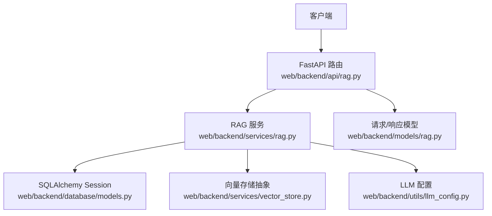
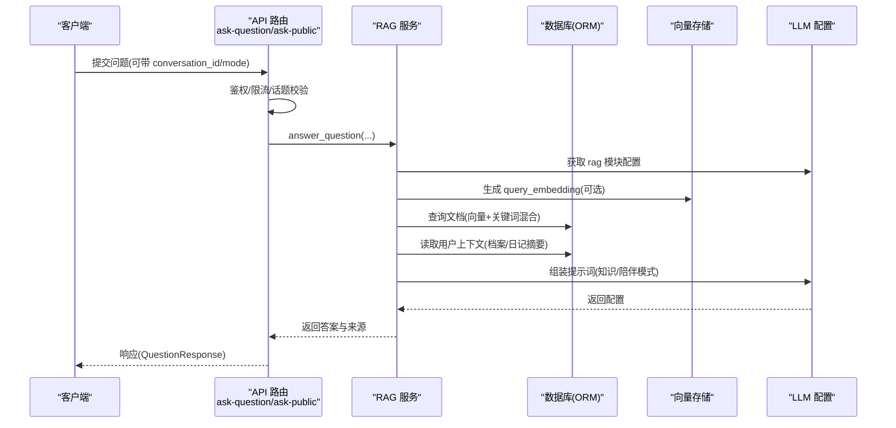
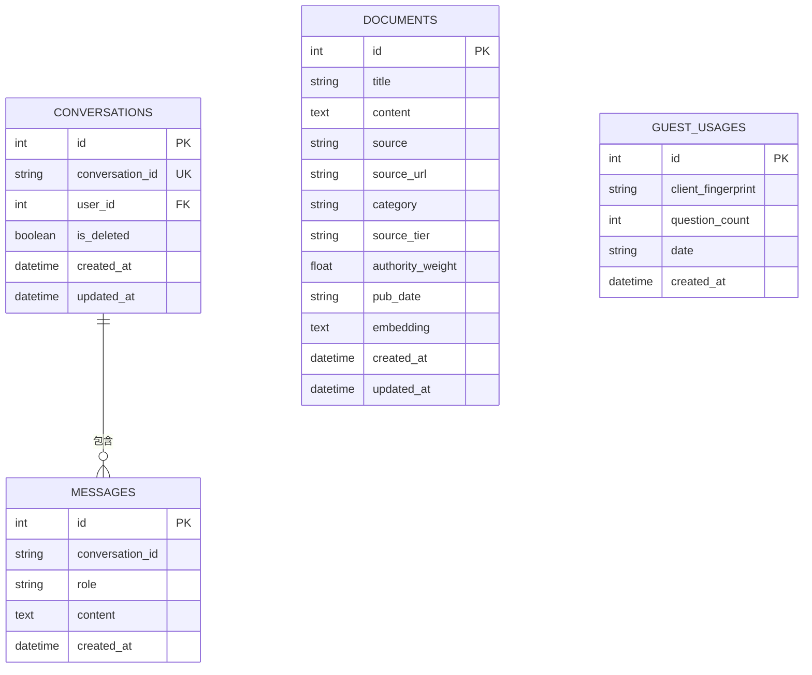
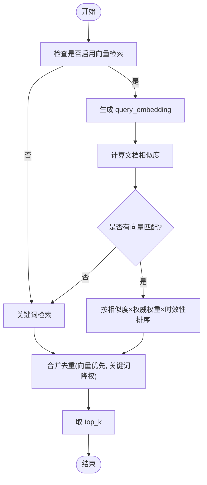
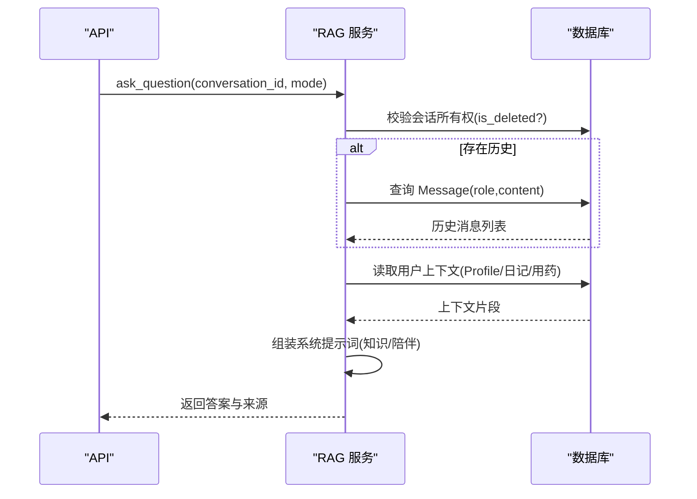
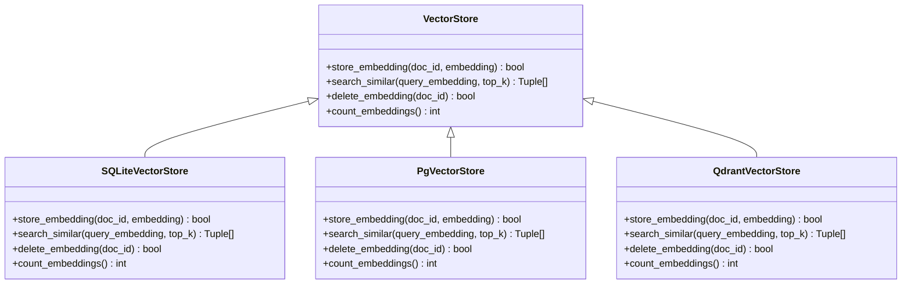
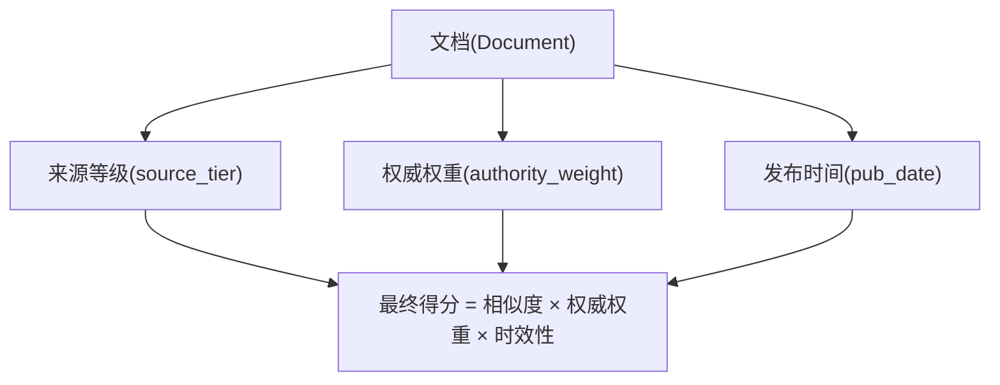
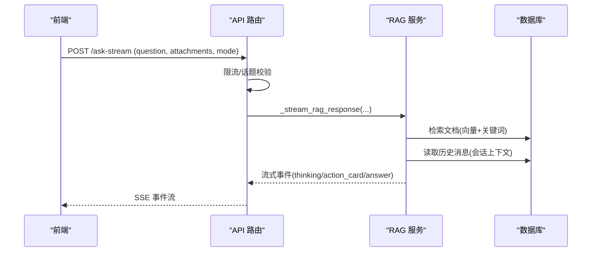
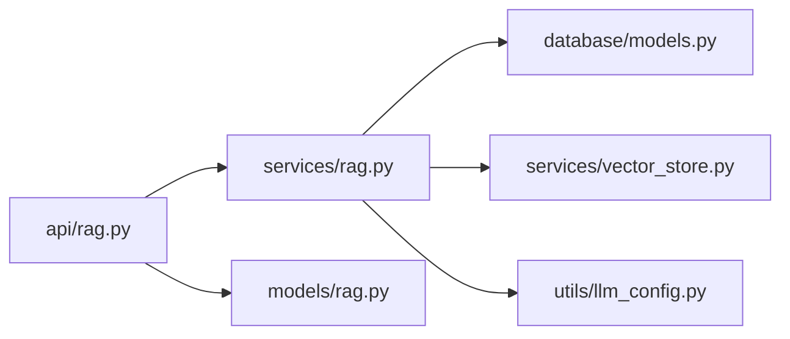

# AI助手数据模型

<cite>
**本文引用的文件**
- [web/backend/database/models.py](file://web/backend/database/models.py)
- [web/backend/models/rag.py](file://web/backend/models/rag.py)
- [web/backend/services/rag.py](file://web/backend/services/rag.py)
- [web/backend/api/rag.py](file://web/backend/api/rag.py)
- [web/backend/services/vector_store.py](file://web/backend/services/vector_store.py)
- [web/backend/utils/llm_config.py](file://web/backend/utils/llm_config.py)
</cite>

## 目录
1. [简介](#简介)
2. [项目结构](#项目结构)
3. [核心组件](#核心组件)
4. [架构总览](#架构总览)
5. [详细组件分析](#详细组件分析)
6. [依赖关系分析](#依赖关系分析)
7. [性能考虑](#性能考虑)
8. [故障排查指南](#故障排查指南)
9. [结论](#结论)
10. [附录](#附录)

## 简介
本技术文档聚焦 Subskin AI 助手的数据模型与检索增强生成（RAG）方案，覆盖对话历史、消息记录、知识库文档等核心实体；阐述向量嵌入存储、文档分类与权重管理；解释多轮对话状态管理与上下文保持机制；给出向量搜索与语义匹配的数据访问模式；并提供缓存与索引优化等性能策略。

## 项目结构
AI 助手相关代码主要分布在后端模块：
- API 层：暴露问答、流式回答、临时上传、确认动作等接口
- 服务层：实现 RAG 检索、提示词构建、用户上下文聚合、相似度计算等
- 数据模型层：定义数据库 ORM 模型（对话、消息、文档等）
- 向量存储层：抽象 SQLite/pgvector/Qdrant 多种后端
- LLM 配置：统一读取各提供商的 chat/vision/embedding 配置

图表来源
- [web/backend/api/rag.py:246-330](file://web/backend/api/rag.py#L246-L330)
- [web/backend/services/rag.py:456-522](file://web/backend/services/rag.py#L456-L522)
- [web/backend/database/models.py:255-297](file://web/backend/database/models.py#L255-L297)
- [web/backend/services/vector_store.py:25-110](file://web/backend/services/vector_store.py#L25-L110)
- [web/backend/utils/llm_config.py:8-108](file://web/backend/utils/llm_config.py#L8-L108)

章节来源
- [web/backend/api/rag.py:246-330](file://web/backend/api/rag.py#L246-L330)
- [web/backend/services/rag.py:456-522](file://web/backend/services/rag.py#L456-L522)
- [web/backend/database/models.py:255-297](file://web/backend/database/models.py#L255-L297)
- [web/backend/services/vector_store.py:25-110](file://web/backend/services/vector_store.py#L25-L110)
- [web/backend/utils/llm_config.py:8-108](file://web/backend/utils/llm_config.py#L8-L108)

## 核心组件
- 对话与会话控制
  - 会话：Conversation（会话标识、归属用户、软删除标记）
  - 消息：Message（角色、内容、时间戳）
  - 访客配额：GuestUsage（按客户端指纹统计每日提问次数）
- 知识库文档
  - Document（标题、正文、来源、分类、来源等级、权威权重、发布时间、文本嵌入）
- 向量存储
  - VectorStore 抽象及 SQLite/pgvector/Qdrant 实现
- LLM 配置
  - get_llm_config 支持 dashscope/volcengine/openai 等多提供商，含 embedding 模型与维度

章节来源
- [web/backend/database/models.py:227-297](file://web/backend/database/models.py#L227-L297)
- [web/backend/database/models.py:255-272](file://web/backend/database/models.py#L255-L272)
- [web/backend/services/vector_store.py:25-110](file://web/backend/services/vector_store.py#L25-L110)
- [web/backend/utils/llm_config.py:8-108](file://web/backend/utils/llm_config.py#L8-L108)

## 架构总览
RAG 问答流程从 API 进入，进行权限与限流校验，随后在服务层执行检索增强：优先向量检索，回退关键词检索；结合用户上下文与系统提示词调用 LLM；最终返回答案与来源，并持久化对话历史。

图表来源
- [web/backend/api/rag.py:246-330](file://web/backend/api/rag.py#L246-L330)
- [web/backend/services/rag.py:456-522](file://web/backend/services/rag.py#L456-L522)
- [web/backend/utils/llm_config.py:111-135](file://web/backend/utils/llm_config.py#L111-L135)

## 详细组件分析

### 数据模型设计
- 对话与会话
  - Conversation：会话级元数据，唯一 conversation_id，关联 user_id，支持 is_deleted 软删除
  - Message：单条消息，role(user/assistant)，content，created_at
  - GuestUsage：访客每日使用量，client_fingerprint + date 复合键
- 知识库文档
  - Document：title/content/source/source_url/category/source_tier/authority_weight/pub_date/embedding
- IM 相关（非 RAG 主路径）
  - ImConversation/ImMessage 用于私聊/群聊，与 AI 助手对话隔离

图表来源
- [web/backend/database/models.py:255-297](file://web/backend/database/models.py#L255-L297)
- [web/backend/database/models.py:227-237](file://web/backend/database/models.py#L227-L237)

章节来源
- [web/backend/database/models.py:227-297](file://web/backend/database/models.py#L227-L297)

### RAG 检索增强生成
- 向量检索
  - 通过 get_embedding 调用 LLM 提供商 embedding 接口，得到 query_embedding
  - 使用 cosine_similarity 计算相似度，结合权威权重与时效性加权
  - 若向量不可用或无匹配，回退到关键词搜索
- 关键词检索
  - 提取中英文关键词，基于 title+content 简单匹配，按命中比例打分
- 混合排序
  - 向量结果与关键词结果合并去重，向量命中优先，关键词结果降权后补充
- 提示词与模式
  - 智能问答模式：强调医学知识准确性、来源优先级、拒绝诊断、隐私保护
  - 知心陪伴模式：情绪支持、危机干预、去医疗化

图表来源
- [web/backend/services/rag.py:354-401](file://web/backend/services/rag.py#L354-L401)
- [web/backend/services/rag.py:433-522](file://web/backend/services/rag.py#L433-L522)

章节来源
- [web/backend/services/rag.py:354-401](file://web/backend/services/rag.py#L354-L401)
- [web/backend/services/rag.py:433-522](file://web/backend/services/rag.py#L433-L522)

### 多轮对话状态管理与上下文保持
- 会话所有权校验
  - _assert_conversation_ownership 确保用户只能操作自己的会话；未认领的访客会话首次登录即认领；已删除会话禁止读写
- 历史加载
  - 根据 conversation_id 按时间顺序加载 Message 列表，构造 role/content 序列注入提示词
- 用户上下文聚合
  - build_user_context 聚合 PatientProfile（病型/病程）、近14天日记摘要、活跃用药提醒、最近治疗事件，限制长度避免超出上下文窗口
- 安全与合规
  - 访客话题过滤（白癜风/皮肤健康），但自杀/自残意图强制放行以提供危机资源
  - 严格隐私保护，不泄露其他用户信息

图表来源
- [web/backend/api/rag.py:188-225](file://web/backend/api/rag.py#L188-L225)
- [web/backend/api/rag.py:775-794](file://web/backend/api/rag.py#L775-L794)
- [web/backend/services/rag.py:757-800](file://web/backend/services/rag.py#L757-L800)

章节来源
- [web/backend/api/rag.py:188-225](file://web/backend/api/rag.py#L188-L225)
- [web/backend/api/rag.py:775-794](file://web/backend/api/rag.py#L775-L794)
- [web/backend/services/rag.py:757-800](file://web/backend/services/rag.py#L757-L800)

### 向量搜索与语义匹配的数据访问模式
- 存储
  - SQLiteVectorStore：embedding 以 JSON 文本存储在 Document.embedding，内存中计算余弦相似度
  - PgVectorStore：预留 pgvector 原生向量类型与 HNSW/IVFFlat 索引（当前回退至 SQLite）
  - QdrantVectorStore：独立向量库，支持集合自动创建与点插入/搜索/删除
- 查询
  - search_similar(query_embedding, top_k) 返回 (doc_id, similarity)
  - 当 VECTOR_STORE_BACKEND=sqlite 时，默认使用 SQLite 实现
- 维度一致性
  - cosine_similarity 在维度不一致时返回 0 并记录警告，避免错误排名

图表来源
- [web/backend/services/vector_store.py:25-110](file://web/backend/services/vector_store.py#L25-L110)
- [web/backend/services/vector_store.py:112-155](file://web/backend/services/vector_store.py#L112-L155)
- [web/backend/services/vector_store.py:157-243](file://web/backend/services/vector_store.py#L157-L243)

章节来源
- [web/backend/services/vector_store.py:25-110](file://web/backend/services/vector_store.py#L25-L110)
- [web/backend/services/vector_store.py:112-155](file://web/backend/services/vector_store.py#L112-L155)
- [web/backend/services/vector_store.py:157-243](file://web/backend/services/vector_store.py#L157-L243)

### 文档分类与权重管理
- 分类字段
  - Document.category 用于业务分类（如疾病机制、治疗方案、护理经验等）
- 来源等级与权威权重
  - source_tier：S/A/B/C/D 四级，提示词中规定引用优先级
  - authority_weight：数值权重，参与最终得分计算
- 时效性加权
  - 基于 pub_date 计算近期文章加分，旧文适度降权

图表来源
- [web/backend/database/models.py:255-272](file://web/backend/database/models.py#L255-L272)
- [web/backend/services/rag.py:404-430](file://web/backend/services/rag.py#L404-L430)

章节来源
- [web/backend/database/models.py:255-272](file://web/backend/database/models.py#L255-L272)
- [web/backend/services/rag.py:404-430](file://web/backend/services/rag.py#L404-L430)

### API 与数据模型
- 请求/响应模型
  - QuestionRequest/QuestionRequestWithAttachments：问题、会话ID、附件、模式
  - Source：来源标题、URL、片段、来源等级、名称、权威权重
  - QuestionResponse：答案、来源列表、剩余配额、访客标记
  - TempUploadResponse/ConfirmActionRequest/ConfirmActionResponse：临时上传与动作确认
- 路由
  - /ask、/ask-public：同步问答
  - /ask-stream、/ask-public-stream：流式 SSE 回答
  - /upload-temp：临时文件上传
  - /confirm-action：保存 VASI/体检报告/日记草稿

图表来源
- [web/backend/models/rag.py:8-62](file://web/backend/models/rag.py#L8-L62)
- [web/backend/api/rag.py:534-630](file://web/backend/api/rag.py#L534-L630)

章节来源
- [web/backend/models/rag.py:8-62](file://web/backend/models/rag.py#L8-L62)
- [web/backend/api/rag.py:534-630](file://web/backend/api/rag.py#L534-L630)

## 依赖关系分析
- API 依赖服务层：路由调用 answer_question/_stream_rag_response
- 服务层依赖数据库模型：ORM 查询 Conversation/Message/Document/User/PatientProfile/DiaryEntry
- 服务层依赖向量存储：SQLite/pgvector/Qdrant 抽象
- 服务层依赖 LLM 配置：get_llm_config("rag") 获取 embedding/chat/vision 参数
- 外部依赖：OpenAI SDK（兼容 dashscope/volcengine 等）

图表来源
- [web/backend/api/rag.py:246-330](file://web/backend/api/rag.py#L246-L330)
- [web/backend/services/rag.py:18-31](file://web/backend/services/rag.py#L18-L31)
- [web/backend/services/vector_store.py:245-266](file://web/backend/services/vector_store.py#L245-L266)
- [web/backend/utils/llm_config.py:111-135](file://web/backend/utils/llm_config.py#L111-L135)

章节来源
- [web/backend/api/rag.py:246-330](file://web/backend/api/rag.py#L246-L330)
- [web/backend/services/rag.py:18-31](file://web/backend/services/rag.py#L18-L31)
- [web/backend/services/vector_store.py:245-266](file://web/backend/services/vector_store.py#L245-L266)
- [web/backend/utils/llm_config.py:111-135](file://web/backend/utils/llm_config.py#L111-L135)

## 性能考虑
- 向量检索开关与回退
  - 环境变量 RAG_USE_VECTOR 控制是否启用向量检索；失败或无配置时回退关键词检索
- 相似度计算优化
  - 维度不一致直接返回 0，避免无效比较；仅保留正相似度结果
- 混合检索合并
  - 向量命中优先，关键词结果降权 0.8 后补充，保证新文档即时可检索
- 上下文长度控制
  - USER_CONTEXT_MAX_CHARS 限制用户上下文块大小，防止超出 LLM 上下文窗口
- 并发与限流
  - 登录用户按 user_id 限速；访客按客户端指纹每日限额；SSE 流式输出减少首包延迟
- 存储后端选择
  - 小规模数据使用 SQLite；大规模建议升级 pgvector 或 Qdrant，利用原生向量索引提升检索性能

章节来源
- [web/backend/services/rag.py:456-522](file://web/backend/services/rag.py#L456-L522)
- [web/backend/services/rag.py:387-401](file://web/backend/services/rag.py#L387-L401)
- [web/backend/api/rag.py:228-243](file://web/backend/api/rag.py#L228-L243)
- [web/backend/services/vector_store.py:245-266](file://web/backend/services/vector_store.py#L245-L266)

## 故障排查指南
- 未配置 LLM API Key
  - 现象：get_embedding 抛出异常，触发关键词检索回退
  - 处理：设置 DASHSCOPE_API_KEY/VOLCENGINE_API_KEY/OPENAI_API_KEY 等
- 向量维度不匹配
  - 现象：cosine_similarity 日志警告并返回 0，该文档被跳过
  - 处理：统一 embedding 维度（VECTOR_STORE_DIMENSION），重新向量化文档
- 会话无权访问
  - 现象：HTTP 403/404，软删除会话不可读
  - 处理：确认 conversation_id 归属与 is_deleted 状态
- 访客配额耗尽
  - 现象：HTTP 429，提示免费次数用完
  - 处理：等待次日重置或引导登录使用
- 临时文件权限校验失败
  - 现象：拒绝访问他人 temp 文件或缺失 .meta 元数据
  - 处理：确保上传与解析在同一用户上下文，且 .meta 写入成功

章节来源
- [web/backend/services/rag.py:354-384](file://web/backend/services/rag.py#L354-L384)
- [web/backend/services/rag.py:387-401](file://web/backend/services/rag.py#L387-L401)
- [web/backend/api/rag.py:188-225](file://web/backend/api/rag.py#L188-L225)
- [web/backend/api/rag.py:136-163](file://web/backend/api/rag.py#L136-L163)
- [web/backend/api/rag.py:686-712](file://web/backend/api/rag.py#L686-L712)

## 结论
Subskin AI 助手采用“向量检索 + 关键词回退”的混合 RAG 方案，结合用户上下文与严格的提示词约束，提供准确、安全、可追溯的智能问答体验。通过灵活的向量存储后端与完善的权限/限流机制，系统在中小规模场景下具备良好性能与可扩展性。未来可通过 pgvector/Qdrant 与更精细的索引策略进一步提升检索效率与吞吐能力。

## 附录
- 关键环境变量
  - RAG_USE_VECTOR：是否启用向量检索
  - VECTOR_STORE_BACKEND：sqlite/pgvector/qdrant
  - VECTOR_STORE_DIMENSION：向量维度
  - QDRANT_URL/QDRANT_COLLECTION：Qdrant 地址与集合名
  - DASHSCOPE_* / VOLCENGINE_* / OPENAI_*：各提供商 API Key、Base URL、模型名
- 推荐实践
  - 定期向量化新增文档，确保向量索引及时更新
  - 对高权威来源（S/A）设置更高 authority_weight
  - 监控 cosine_similarity 维度不匹配日志，统一 embedding 维度
  - 为高频问答建立缓存层（如 Redis），降低 LLM 调用成本