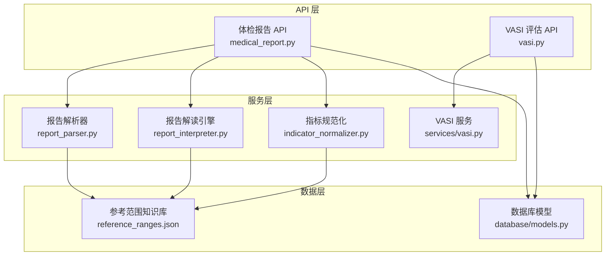
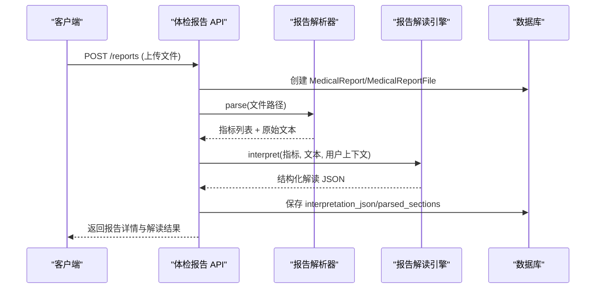
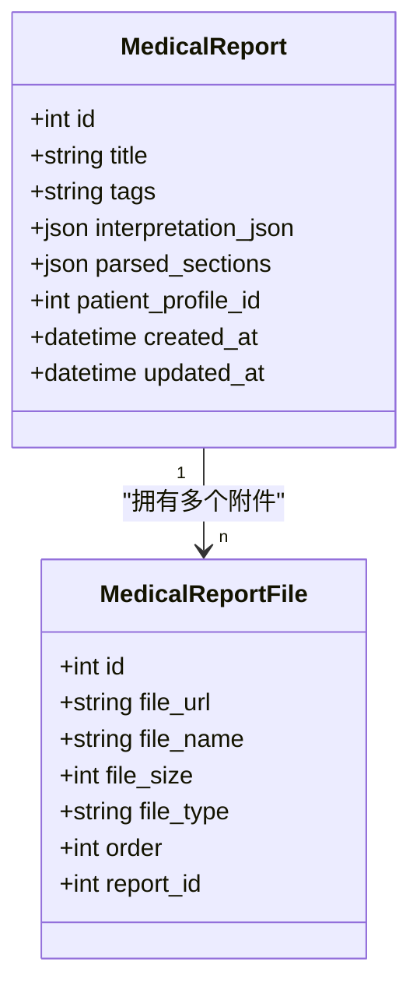
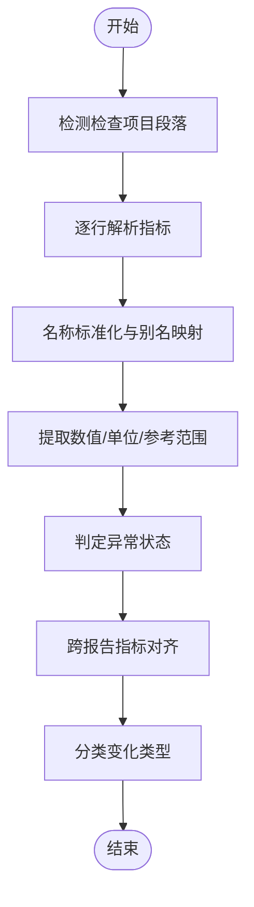
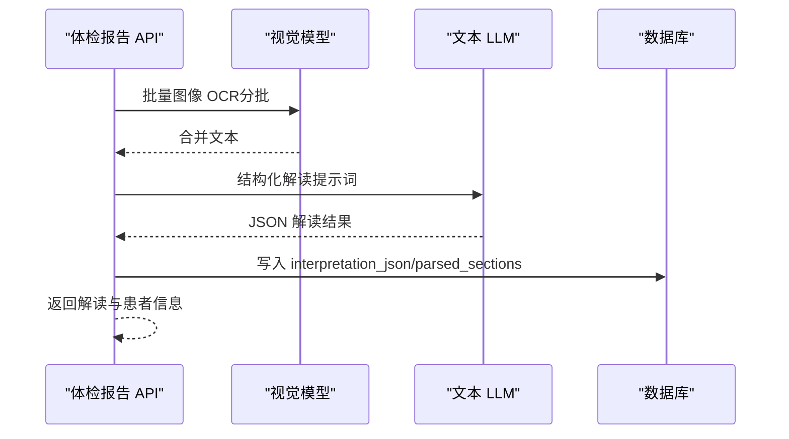
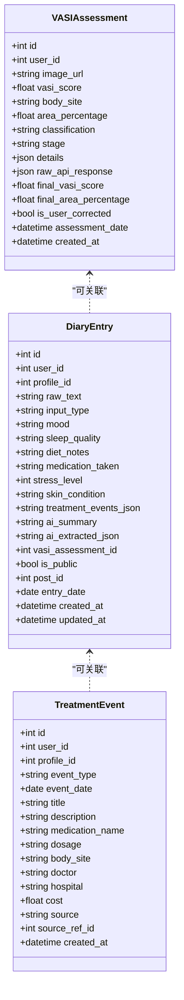
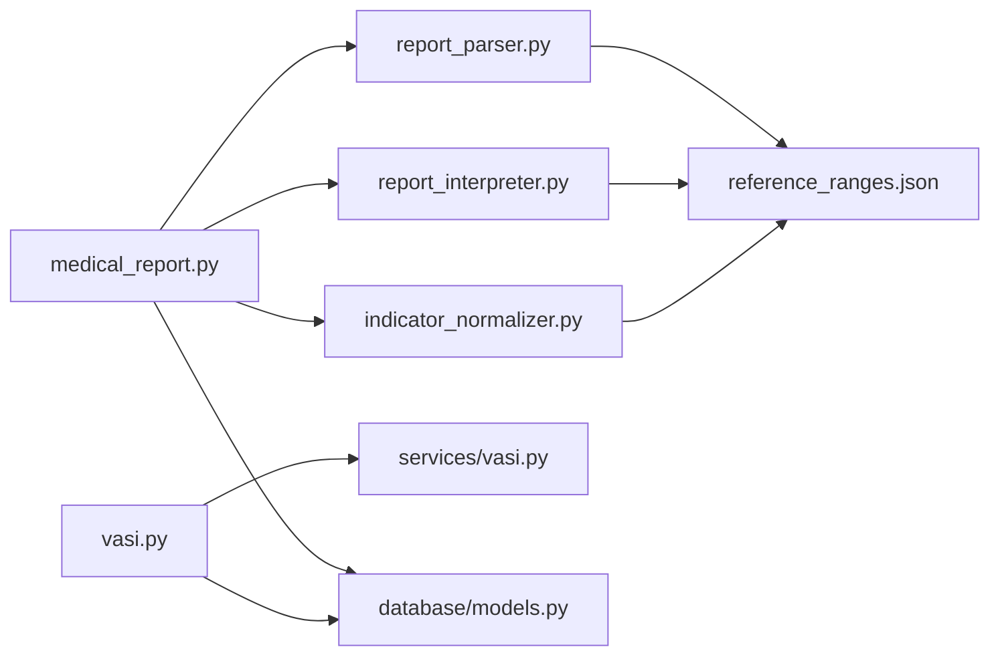

# 医疗数据模型

<cite>
**本文引用的文件**   
- [medical_report.py](file://web/backend/api/medical_report.py)
- [vasi.py](file://web/backend/api/vasi.py)
- [report_parser.py](file://web/backend/services/medical/report_parser.py)
- [indicator_normalizer.py](file://web/backend/services/medical/indicator_normalizer.py)
- [report_interpreter.py](file://web/backend/services/medical/report_interpreter.py)
- [models.py](file://web/backend/database/models.py)
- [reference_ranges.json](file://data/medical_knowledge/reference_ranges.json)
- [api/models.py](file://web/backend/api/models.py)
</cite>

## 目录
1. [引言](#引言)
2. [项目结构](#项目结构)
3. [核心组件](#核心组件)
4. [架构总览](#架构总览)
5. [详细组件分析](#详细组件分析)
6. [依赖关系分析](#依赖关系分析)
7. [性能考量](#性能考量)
8. [故障排查指南](#故障排查指南)
9. [结论](#结论)
10. [附录](#附录)

## 引言
本技术文档围绕 Subskin 的医疗功能数据模型展开，重点覆盖体检报告（MedicalReport）、VASI 评估记录与健康追踪等医疗相关实体的设计与实现。文档详细说明医疗数据的结构化存储方案，包括检验指标解析、异常值标记与健康趋势分析；阐述隐私保护机制与数据安全策略；给出医疗数据的查询与分析接口设计；并讨论数据标准化与互操作性考虑。目标是帮助开发者与产品人员快速理解系统的数据流、处理逻辑与扩展点。

## 项目结构
医疗数据相关的代码主要分布在后端 API、服务层、数据库模型与知识库中：
- API 层：提供体检报告上传、解读、对比、分页查询等 REST 接口；提供 VASI 评估、历史、趋势、轮廓修正等接口。
- 服务层：包含报告解析器（PDF/图像 OCR）、指标规范化、LLM 解读引擎、比较计算、VASI 评估流程等。
- 数据库模型：定义用户、患者档案、体检报告、报告附件、VASI 评估、日记与治疗事件等实体。
- 知识库：参考范围与指标别名映射，支撑指标标准化与异常判定。

**图表来源** 
- [medical_report.py:1-120](file://web/backend/api/medical_report.py#L1-L120)
- [vasi.py:1-120](file://web/backend/api/vasi.py#L1-L120)
- [report_parser.py:164-217](file://web/backend/services/medical/report_parser.py#L164-L217)
- [indicator_normalizer.py:1-187](file://web/backend/services/medical/indicator_normalizer.py#L1-L187)
- [report_interpreter.py:18-61](file://web/backend/services/medical/report_interpreter.py#L18-L61)
- [models.py:581-620](file://web/backend/database/models.py#L581-L620)
- [reference_ranges.json:1-51](file://data/medical_knowledge/reference_ranges.json#L1-L51)

**章节来源**
- [medical_report.py:1-120](file://web/backend/api/medical_report.py#L1-L120)
- [vasi.py:1-120](file://web/backend/api/vasi.py#L1-L120)
- [models.py:581-620](file://web/backend/database/models.py#L581-L620)

## 核心组件
- 体检报告（MedicalReport）与附件（MedicalReportFile）：支持多文件上传、PDF 页面转换、OCR/文本提取、结构化解读、指标对齐与对比。
- VASI 评估（VASIAssessment）：支持图片上传、质量检查、分割与评分、用户修正、历史与趋势统计。
- 健康追踪（DiaryEntry、TreatmentEvent）：对话式记录、AI 结构化提取、治疗事件抽取与关联。
- 指标解析与规范化：基于规则与知识库的多源指标识别、单位与参考范围归一化、异常状态判定。
- LLM 解读引擎：面向白友的可读性总结、按检查项目分类的风险等级标注、建议生成与对比叙事。

**章节来源**
- [models.py:581-620](file://web/backend/database/models.py#L581-L620)
- [models.py:1160-1231](file://web/backend/database/models.py#L1160-L1231)
- [report_parser.py:209-267](file://web/backend/services/medical/report_parser.py#L209-L267)
- [indicator_normalizer.py:313-356](file://web/backend/services/medical/indicator_normalizer.py#L313-L356)
- [report_interpreter.py:18-61](file://web/backend/services/medical/report_interpreter.py#L18-L61)

## 架构总览
体检报告与 VASI 评估两条主线在 API 层暴露接口，服务层完成数据处理与 AI 调用，数据层持久化实体与元数据。报告解读采用“解析 + 解读”的两阶段模式：先通过解析器提取指标与原始文本，再由 LLM 进行结构化解读与风险分级；对比流程将多份报告的指标对齐后计算变化类型并生成叙事。

**图表来源** 
- [medical_report.py:214-276](file://web/backend/api/medical_report.py#L214-L276)
- [report_parser.py:209-267](file://web/backend/services/medical/report_parser.py#L209-L267)
- [report_interpreter.py:18-61](file://web/backend/services/medical/report_interpreter.py#L18-L61)
- [models.py:581-620](file://web/backend/database/models.py#L581-L620)

## 详细组件分析

### 体检报告（MedicalReport）数据模型与接口
- 数据模型
  - MedicalReport：标题、标签、解读结果 JSON、已解析段落、患者档案关联 ID、时间戳等。
  - MedicalReportFile：报告附件 URL、文件名、大小、类型、顺序。
- 接口能力
  - 列表/详情/删除：分页查询、权限校验（user_id）。
  - 上传与自动 PDF 转页：支持多文件上传，后台将 PDF 转换为逐页 PNG 便于浏览器查看。
  - 解读触发：优先使用解析器提取指标与文本；若无有效内容则走视觉两阶段 OCR（分批发送图像至视觉模型），再交由文本 LLM 做全量结构化解读。
  - 对比接口：对多份报告指标对齐后计算变化类型，生成对比摘要与叙事。
  - 患者档案关联：支持从解读结果或表单参数回填 patient_profile_id 与 extracted_patient_info。

**图表来源** 
- [models.py:581-620](file://web/backend/database/models.py#L581-L620)

**章节来源**
- [medical_report.py:185-276](file://web/backend/api/medical_report.py#L185-L276)
- [medical_report.py:278-328](file://web/backend/api/medical_report.py#L278-L328)
- [medical_report.py:426-504](file://web/backend/api/medical_report.py#L426-L504)
- [models.py:581-620](file://web/backend/database/models.py#L581-L620)

### 指标解析与异常值标记
- 解析流程
  - PDF：优先用 PyMuPDF 提取文本，其次尝试 pdfplumber 表格提取。
  - 图像：PaddleOCR 中文 OCR，输出行文本。
  - 行级解析：正则匹配数值、单位、参考范围；结合 section 头部识别（血常规、肝功能等）归类。
  - 指标标准化：别名映射到 canonical_name，统一单位族与面板分类。
- 异常判定
  - 根据参考范围与数值判断 normal/high/low/critical。
  - 支持大跨度变化检测（相对基线或参考范围宽度）。
- 对比与趋势
  - 指标对齐：跨报告按 canonical_name 对齐，缺失值占位。
  - 变化类型：newly_abnormal/resolved_abnormal/persistent_abnormal/large_delta/unchanged_stable/not_measured。
  - 高亮项：非稳定变化指标用于前端高亮展示。

**图表来源** 
- [report_parser.py:164-217](file://web/backend/services/medical/report_parser.py#L164-L217)
- [report_parser.py:285-333](file://web/backend/services/medical/report_parser.py#L285-L333)
- [indicator_normalizer.py:313-356](file://web/backend/services/medical/indicator_normalizer.py#L313-L356)
- [indicator_normalizer.py:385-404](file://web/backend/services/medical/indicator_normalizer.py#L385-L404)

**章节来源**
- [report_parser.py:209-267](file://web/backend/services/medical/report_parser.py#L209-L267)
- [report_parser.py:285-333](file://web/backend/services/medical/report_parser.py#L285-L333)
- [indicator_normalizer.py:313-356](file://web/backend/services/medical/indicator_normalizer.py#L313-L356)
- [indicator_normalizer.py:385-404](file://web/backend/services/medical/indicator_normalizer.py#L385-L404)
- [reference_ranges.json:1-51](file://data/medical_knowledge/reference_ranges.json#L1-L51)

### 报告解读引擎（LLM 驱动）
- 输入：指标列表、原始文本、用户上下文（年龄/性别）。
- 输出：风险等级、总体总结、各检查项目分段（section）及红黄绿风险、异常项深度解读、建议、患者信息抽取、免责声明。
- 视觉模式：两阶段 OCR（分批图像）+ 全文结构化解读，避免单页限制。
- 鲁棒性：JSON 截断恢复、失败回退、模型元数据记录。

**图表来源** 
- [medical_report.py:506-574](file://web/backend/api/medical_report.py#L506-L574)
- [report_interpreter.py:117-213](file://web/backend/services/medical/report_interpreter.py#L117-L213)
- [report_interpreter.py:287-374](file://web/backend/services/medical/report_interpreter.py#L287-L374)

**章节来源**
- [report_interpreter.py:18-61](file://web/backend/services/medical/report_interpreter.py#L18-L61)
- [report_interpreter.py:117-213](file://web/backend/services/medical/report_interpreter.py#L117-L213)
- [report_interpreter.py:287-374](file://web/backend/services/medical/report_interpreter.py#L287-L374)

### VASI 评估记录与健康追踪
- VASI 评估
  - 接口：创建评估、确认草稿、放弃草稿、获取历史与趋势、提交轮廓修正、照片质量检查。
  - 流程：图片上传与校验 → 预处理与质量检查 → 分割与评分 → 可选用户修正 → 计算最终面积百分比与 VASI 分数 → 持久化。
  - 反馈与自进化：记录 Dice 与面积误差，作为训练样本；可选 RL 学习器在线更新策略。
- 健康追踪
  - 日记条目（DiaryEntry）：原始输入、AI 结构化字段（情绪、睡眠、饮食、用药、压力、皮肤状况）、关联 VASI 评估。
  - 治疗事件（TreatmentEvent）：事件类型、日期、结构化字段（药品名、剂量、部位、医生、医院、费用）、来源与引用。

**图表来源** 
- [models.py:1160-1231](file://web/backend/database/models.py#L1160-L1231)
- [vasi.py:45-165](file://web/backend/api/vasi.py#L45-L165)
- [vasi.py:204-257](file://web/backend/api/vasi.py#L204-L257)
- [vasi.py:448-473](file://web/backend/api/vasi.py#L448-L473)

**章节来源**
- [vasi.py:45-165](file://web/backend/api/vasi.py#L45-L165)
- [vasi.py:204-257](file://web/backend/api/vasi.py#L204-L257)
- [vasi.py:448-473](file://web/backend/api/vasi.py#L448-L473)
- [models.py:1160-1231](file://web/backend/database/models.py#L1160-L1231)

### 数据标准化与互操作性
- 指标别名与单位族：通过 CANONICAL_INDICATORS 与 reference_ranges.json 建立统一映射，支持中英文别名与单位族归一化。
- 参考范围：按类别（血常规、肝功能、肾功能、血脂、血糖、甲状腺）维护 ref_min/ref_max，支撑异常判定与临床意义说明。
- 结构化输出：解读结果与对比结果均遵循固定 schema_version，便于前后端一致消费与未来演进。

**章节来源**
- [indicator_normalizer.py:1-187](file://web/backend/services/medical/indicator_normalizer.py#L1-L187)
- [reference_ranges.json:1-51](file://data/medical_knowledge/reference_ranges.json#L1-L51)
- [report_interpreter.py:95-105](file://web/backend/services/medical/report_interpreter.py#L95-L105)

## 依赖关系分析
- API 与服务层耦合：体检报告 API 依赖解析器、解读引擎与指标规范化；VASI API 依赖评估服务与公式计算。
- 数据层依赖：所有实体通过 SQLAlchemy ORM 管理，外键约束保证一致性（如 report_file → report，diary → vasi_assessment）。
- 外部依赖：OpenAI 兼容 SDK（文本与视觉模型）、PyMuPDF/pdfplumber（PDF 文本与表格）、PaddleOCR（图像 OCR）。

**图表来源** 
- [medical_report.py:1-120](file://web/backend/api/medical_report.py#L1-L120)
- [vasi.py:1-120](file://web/backend/api/vasi.py#L1-L120)
- [report_parser.py:1-10](file://web/backend/services/medical/report_parser.py#L1-L10)
- [report_interpreter.py:1-12](file://web/backend/services/medical/report_interpreter.py#L1-L12)
- [indicator_normalizer.py:1-10](file://web/backend/services/medical/indicator_normalizer.py#L1-L10)
- [models.py:581-620](file://web/backend/database/models.py#L581-L620)

**章节来源**
- [medical_report.py:1-120](file://web/backend/api/medical_report.py#L1-L120)
- [vasi.py:1-120](file://web/backend/api/vasi.py#L1-L120)
- [models.py:581-620](file://web/backend/database/models.py#L581-L620)

## 性能考量
- 批处理与分片：视觉 OCR 以 8 页为一批，避免上下文超限；PDF 转页按需生成，避免重复转换。
- 缓存与幂等：PDF 页面目录存在即跳过转换；解读结果已存在时直接返回，减少重复 LLM 调用。
- 资源限制：图片上传大小上限（VASI 质量检查 20MB），防止内存耗尽。
- 异步与线程池：耗时任务（如 prepare_image、predict_by_points）通过 to_thread 执行，避免阻塞请求。

[本节为通用指导，不直接分析具体文件]

## 故障排查指南
- 报告解读失败
  - 现象：无法提取有效数据或 LLM 返回不可解析 JSON。
  - 排查：检查文件是否存在与可读；确认 OCR 是否成功；查看 LLM 配置与响应恢复逻辑。
- 对比接口报错
  - 现象：缺少可对比指标或未解读的报告。
  - 排查：确保所选报告均有 interpretation_json 与 parsed_indicators；至少两份报告。
- VASI 评估错误
  - 现象：图片格式非法或服务不可用。
  - 排查：验证 MIME 与魔数；检查质量检查与分割服务可用性；确认精度模式与文件大小。

**章节来源**
- [medical_report.py:426-504](file://web/backend/api/medical_report.py#L426-L504)
- [medical_report.py:278-328](file://web/backend/api/medical_report.py#L278-L328)
- [vasi.py:511-542](file://web/backend/api/vasi.py#L511-L542)
- [report_interpreter.py:414-468](file://web/backend/services/medical/report_interpreter.py#L414-L468)

## 结论
Subskin 的医疗数据模型以结构化存储为核心，结合规则解析与 LLM 解读，实现了体检报告的高效处理与可视化对比；VASI 评估与健康追踪形成闭环，支持用户修正与趋势分析。系统在隐私与安全方面通过用户隔离、权限校验与资源限制保障数据安全；在标准化与互操作性上通过指标别名、单位族与参考范围统一，提升跨报告与跨系统的兼容性。

[本节为总结，不直接分析具体文件]

## 附录
- 隐私保护机制
  - 用户隔离：所有查询与写入均基于 current_user.id 过滤，确保数据可见性边界。
  - 敏感字段：解读结果中的患者信息抽取仅用于内部关联与展示，不对外公开。
  - 访问控制：文件与报告删除需校验所有权；PDF 页面访问通过父报告归属验证。
- 数据安全策略
  - 输入校验：图片魔数与 MIME 校验、大小限制、类型白名单。
  - 日志与审计：关键操作记录日志，便于问题定位与合规审计。
  - 降级与回退：LLM 不可用时返回空结果或回退策略，避免服务中断。

**章节来源**
- [medical_report.py:185-212](file://web/backend/api/medical_report.py#L185-L212)
- [medical_report.py:697-728](file://web/backend/api/medical_report.py#L697-L728)
- [vasi.py:511-542](file://web/backend/api/vasi.py#L511-L542)