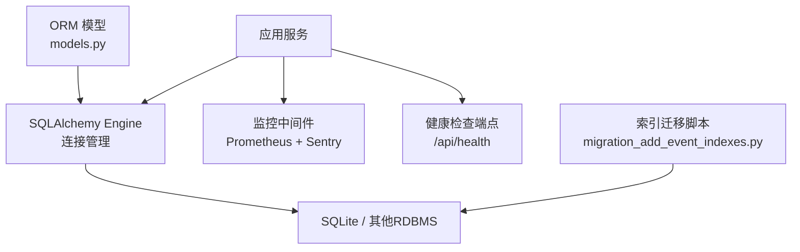
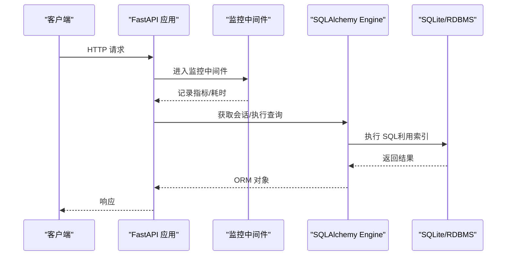
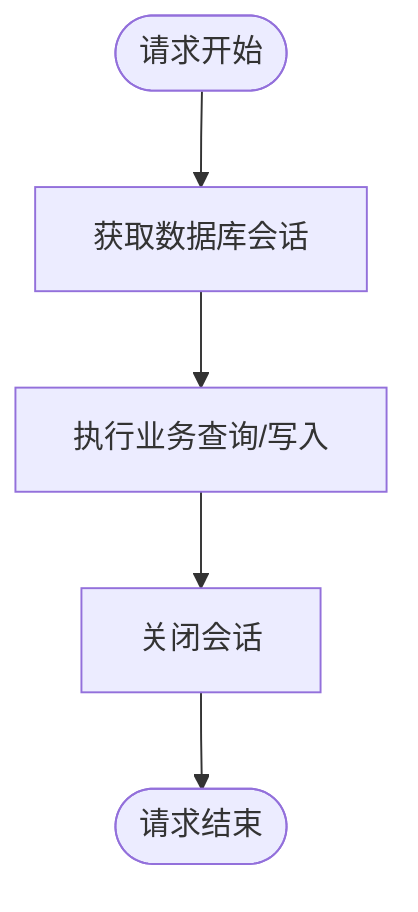
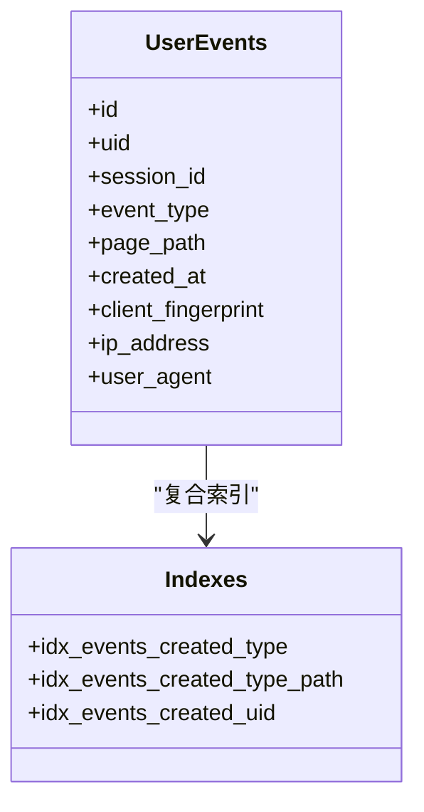
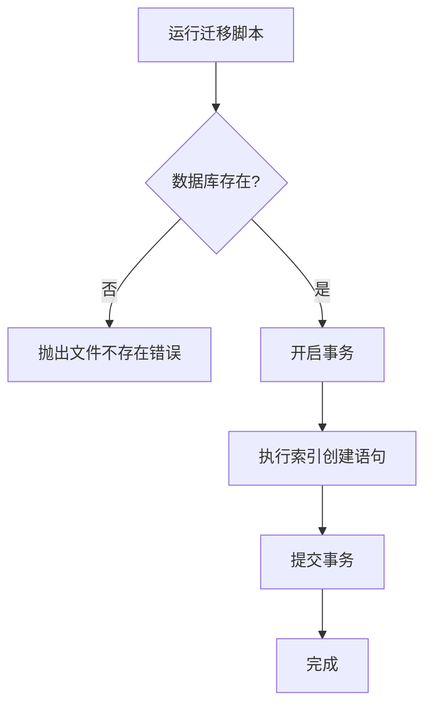
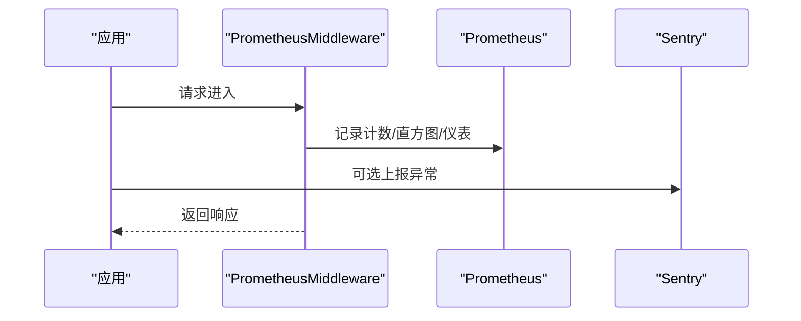
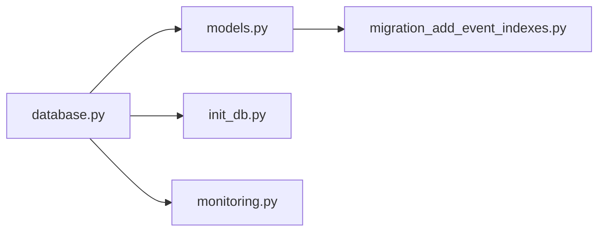

# 性能优化与索引策略

<cite>
**本文引用的文件**
- [web/backend/database/database.py](file://web/backend/database/database.py)
- [web/backend/database/models.py](file://web/backend/database/models.py)
- [web/backend/database/init_db.py](file://web/backend/database/init_db.py)
- [web/backend/database/migration_add_event_indexes.py](file://web/backend/database/migration_add_event_indexes.py)
- [configs/web_config.yaml](file://configs/web_config.yaml)
- [web/backend/services/monitoring.py](file://web/backend/services/monitoring.py)
- [docs/design/photo-upload-and-ai-kb-architecture.md](file://docs/design/photo-upload-and-ai-kb-architecture.md)
</cite>

## 目录
1. [简介](#简介)
2. [项目结构](#项目结构)
3. [核心组件](#核心组件)
4. [架构总览](#架构总览)
5. [详细组件分析](#详细组件分析)
6. [依赖关系分析](#依赖关系分析)
7. [性能考量](#性能考量)
8. [故障排查指南](#故障排查指南)
9. [结论](#结论)
10. [附录](#附录)

## 简介
本技术文档聚焦 Subskin 项目的数据库性能优化，围绕以下目标展开：
- 索引设计策略：复合索引、部分索引（条件索引）和函数索引的应用场景与落地建议。
- 查询优化技巧：EXPLAIN 分析、慢查询日志分析与执行计划优化方法。
- 连接池配置、事务隔离级别与锁机制选择。
- 大数据量下的分库分表方案与读写分离策略。
- 监控指标收集与性能调优工具使用方法。

本项目当前使用 SQLite 作为默认数据库引擎，并通过 SQLAlchemy 管理连接与会话；同时提供 Prometheus 监控与健康检查能力，具备向更复杂数据库迁移的基础设施。

## 项目结构
与数据库性能相关的关键位置：
- 数据库连接与会话：web/backend/database/database.py
- ORM 模型与索引定义：web/backend/database/models.py
- 初始化与种子数据：web/backend/database/init_db.py
- 增量索引迁移脚本：web/backend/database/migration_add_event_indexes.py
- 应用级配置（含数据库连接池参数占位）：configs/web_config.yaml
- 监控与指标采集：web/backend/services/monitoring.py
- 设计文档中的索引与查询优化指引：docs/design/photo-upload-and-ai-kb-architecture.md

图表来源
- [web/backend/database/database.py:1-46](file://web/backend/database/database.py#L1-L46)
- [web/backend/database/models.py:1-200](file://web/backend/database/models.py#L1-L200)
- [web/backend/database/migration_add_event_indexes.py:1-31](file://web/backend/database/migration_add_event_indexes.py#L1-L31)
- [web/backend/services/monitoring.py:96-203](file://web/backend/services/monitoring.py#L96-L203)

章节来源
- [web/backend/database/database.py:1-46](file://web/backend/database/database.py#L1-L46)
- [web/backend/database/models.py:1-200](file://web/backend/database/models.py#L1-L200)
- [web/backend/database/migration_add_event_indexes.py:1-31](file://web/backend/database/migration_add_event_indexes.py#L1-L31)
- [configs/web_config.yaml:61-78](file://configs/web_config.yaml#L61-L78)
- [web/backend/services/monitoring.py:96-203](file://web/backend/services/monitoring.py#L96-L203)

## 核心组件
- 数据库连接与会话
  - 使用 SQLAlchemy 创建引擎与会话工厂，针对 SQLite 使用 NullPool 避免并发下连接耗尽问题，并设置写锁超时以缓解 database is locked。
  - 非 SQLite 路径启用 pool_pre_ping 提升连接健壮性。
- ORM 模型与索引
  - 在模型中通过 Column(index=True) 与 __table_args__ Index(...) 声明单列与复合索引，覆盖高频查询路径。
  - 事件追踪表 user_events 定义了多个复合索引以支持按时间、类型、页面路径、用户维度的聚合查询。
- 索引迁移
  - 提供独立迁移脚本为现有表添加必要索引，确保生产环境可增量演进。
- 监控与健康检查
  - 集成 Prometheus 指标采集与 Sentry 错误追踪，暴露 /metrics 与 /api/health 端点用于观测与诊断。

章节来源
- [web/backend/database/database.py:19-33](file://web/backend/database/database.py#L19-L33)
- [web/backend/database/models.py:203-225](file://web/backend/database/models.py#L203-L225)
- [web/backend/database/migration_add_event_indexes.py:11-26](file://web/backend/database/migration_add_event_indexes.py#L11-L26)
- [web/backend/services/monitoring.py:96-203](file://web/backend/services/monitoring.py#L96-L203)

## 架构总览
下图展示了请求从进入应用到数据库访问、监控采集的完整链路，以及索引对查询路径的影响。

图表来源
- [web/backend/services/monitoring.py:141-172](file://web/backend/services/monitoring.py#L141-L172)
- [web/backend/database/database.py:38-46](file://web/backend/database/database.py#L38-L46)
- [web/backend/database/models.py:203-225](file://web/backend/database/models.py#L203-L225)

## 详细组件分析

### 连接池与会话管理
- SQLite 专用优化
  - 使用 NullPool：按需创建连接、用完即关，避免 QueuePool 在高并发突发时耗尽导致服务冻结。
  - 设置 connect_args timeout=15，缓解写锁竞争导致的 database is locked 异常。
- 通用 RDBMS 路径
  - 启用 pool_pre_ping 检测连接有效性，降低死连接风险。
- 会话生命周期
  - 通过 get_db 生成器模式提供会话，确保请求结束后关闭，避免资源泄漏。

图表来源
- [web/backend/database/database.py:19-33](file://web/backend/database/database.py#L19-L33)
- [web/backend/database/database.py:38-46](file://web/backend/database/database.py#L38-L46)

章节来源
- [web/backend/database/database.py:19-33](file://web/backend/database/database.py#L19-L33)
- [web/backend/database/database.py:38-46](file://web/backend/database/database.py#L38-L46)

### 索引设计与查询优化
- 单列索引
  - 常用过滤字段如 users.user_status、posts.category_id、posts.moderation_status 等已加 index=True，加速点查与范围扫描。
- 复合索引
  - user_events 表定义多组复合索引：(created_at, event_type)、(created_at, event_type, page_path)、(created_at, uid)，支撑按时间窗口+事件类型的聚合与筛选。
  - 百科文章与修订表也定义了复合索引以优化分类与状态查询。
- 部分索引（条件索引）建议
  - 对于大表中仅少量行需要被频繁查询的场景（例如未审核内容、过期令牌），可在目标数据库上创建 WHERE 条件的部分索引以减少索引体积与写入开销。
- 函数索引建议
  - 当查询基于函数表达式（如 LOWER(name)、DATE(created_at)）且无法直接命中普通索引时，可考虑函数索引以提升匹配效率。
- 查询优化实践
  - 优先使用 EXPLAIN/EXPLAIN ANALYZE 分析执行计划，识别全表扫描与低效连接。
  - 将高频查询改写为利用复合索引前缀的形式，避免索引失效。
  - 分页采用游标或基于主键的范围分页，减少深翻页成本。

图表来源
- [web/backend/database/models.py:203-225](file://web/backend/database/models.py#L203-L225)

章节来源
- [web/backend/database/models.py:203-225](file://web/backend/database/models.py#L203-L225)
- [web/backend/database/models.py:650-689](file://web/backend/database/models.py#L650-L689)
- [docs/design/photo-upload-and-ai-kb-architecture.md:348-368](file://docs/design/photo-upload-and-ai-kb-architecture.md#L348-L368)

### 迁移与索引维护
- 增量索引迁移
  - 通过 migration_add_event_indexes.py 为 user_events 表添加复合索引，保证生产环境可安全演进。
- 初始化与种子数据
  - init_db.py 负责建表与初始管理员、社区分类等基础数据注入。

图表来源
- [web/backend/database/migration_add_event_indexes.py:18-26](file://web/backend/database/migration_add_event_indexes.py#L18-L26)

章节来源
- [web/backend/database/migration_add_event_indexes.py:1-31](file://web/backend/database/migration_add_event_indexes.py#L1-31)
- [web/backend/database/init_db.py:20-46](file://web/backend/database/init_db.py#L20-L46)

### 监控与指标采集
- Prometheus 指标
  - 中间件记录 http_requests_total、http_request_duration_seconds、http_requests_in_progress，便于定位慢接口与峰值。
- Sentry 错误追踪
  - 集成 FastAPI/Starlette/SQLAlchemy 集成，自动捕获异常与上下文，支持过滤敏感信息。
- 健康检查
  - /api/health 检查数据库连通性与磁盘空间，辅助自动化运维。

图表来源
- [web/backend/services/monitoring.py:96-203](file://web/backend/services/monitoring.py#L96-L203)
- [web/backend/services/monitoring.py:208-240](file://web/backend/services/monitoring.py#L208-L240)

章节来源
- [web/backend/services/monitoring.py:96-203](file://web/backend/services/monitoring.py#L96-L203)
- [web/backend/services/monitoring.py:208-240](file://web/backend/services/monitoring.py#L208-L240)

## 依赖关系分析
- 模块耦合
  - database.py 提供 engine 与 SessionLocal，被 models.py、init_db.py、monitoring.py 引用。
  - models.py 集中定义表结构与索引，被迁移脚本与业务服务间接依赖。
  - monitoring.py 通过 engine.connect() 进行健康检查，不侵入业务逻辑。
- 外部依赖
  - SQLAlchemy、prometheus-client、sentry-sdk（可选）。
- 潜在循环依赖
  - 当前结构清晰，未见循环导入；建议在新增模块时保持单向依赖。

图表来源
- [web/backend/database/database.py:1-46](file://web/backend/database/database.py#L1-L46)
- [web/backend/database/models.py:1-200](file://web/backend/database/models.py#L1-L200)
- [web/backend/database/init_db.py:1-46](file://web/backend/database/init_db.py#L1-L46)
- [web/backend/database/migration_add_event_indexes.py:1-31](file://web/backend/database/migration_add_event_indexes.py#L1-L31)
- [web/backend/services/monitoring.py:208-240](file://web/backend/services/monitoring.py#L208-L240)

章节来源
- [web/backend/database/database.py:1-46](file://web/backend/database/database.py#L1-L46)
- [web/backend/database/models.py:1-200](file://web/backend/database/models.py#L1-L200)
- [web/backend/database/init_db.py:1-46](file://web/backend/database/init_db.py#L1-L46)
- [web/backend/database/migration_add_event_indexes.py:1-31](file://web/backend/database/migration_add_event_indexes.py#L1-L31)
- [web/backend/services/monitoring.py:208-240](file://web/backend/services/monitoring.py#L208-L240)

## 性能考量
- 连接池与锁
  - SQLite 使用 NullPool 与合理超时，避免并发写锁争用导致的全局阻塞。
  - 非 SQLite 路径启用 pool_pre_ping，增强连接可用性。
- 索引策略
  - 高频查询字段建立单列索引；组合条件查询建立复合索引，注意前缀匹配原则。
  - 对大表中的子集高频查询，建议引入部分索引以降低维护成本。
  - 对函数表达式查询，评估函数索引的收益与维护代价。
- 查询优化
  - 使用 EXPLAIN/EXPLAIN ANALYZE 分析执行计划，消除全表扫描与不必要的排序/连接。
  - 分页采用游标或基于主键的范围分页，避免深翻页。
  - 只读查询尽量走只读副本（未来扩展至 PostgreSQL/MySQL 时）。
- 事务与隔离级别
  - 当前 SQLite 默认隔离级别适合单机场景；若迁移到强一致数据库，可按业务需求选择 READ COMMITTED/REPEATABLE READ/READ UNCOMMITTED，并结合乐观锁/悲观锁控制冲突。
- 分库分表与读写分离
  - 当数据量增长到单库瓶颈时，可考虑：
    - 水平分表：按用户 ID 哈希或时间范围分片，降低单表规模。
    - 读写分离：主库写、从库读，结合连接路由与缓存层。
    - 冷热分离：历史数据归档至冷存储，热数据保留高性能存储。
- 监控与告警
  - 通过 Prometheus 指标观察 QPS、延迟分布与并发数，结合 Sentry 快速定位异常。
  - 健康检查端点用于容器编排与负载均衡的健康探测。

[本节为通用性能指导，不直接分析具体代码文件]

## 故障排查指南
- 常见问题定位
  - 连接耗尽/服务冻结：确认是否误用 QueuePool 于 SQLite；应使用 NullPool 并设置合理超时。
  - database is locked：提高写锁等待超时，或在写入密集时段限流。
  - 慢查询：通过 EXPLAIN 分析执行计划，补充或调整索引；避免 SELECT * 与大表全扫描。
  - 高错误率：启用 Sentry 并查看堆栈与上下文；结合 Prometheus 指标定位热点接口。
- 健康检查与指标
  - 调用 /api/health 验证数据库连通性与磁盘空间。
  - 抓取 /metrics 观察 http_requests_total、http_request_duration_seconds、http_requests_in_progress。

章节来源
- [web/backend/database/database.py:19-33](file://web/backend/database/database.py#L19-L33)
- [web/backend/services/monitoring.py:208-240](file://web/backend/services/monitoring.py#L208-L240)
- [web/backend/services/monitoring.py:96-203](file://web/backend/services/monitoring.py#L96-L203)

## 结论
Subskin 当前以 SQLite 为核心数据库，通过 NullPool 与合理的超时设置有效规避了并发写锁带来的性能陷阱；ORM 层已为关键表建立了必要的单列与复合索引，并在迁移脚本中提供了增量索引管理能力。配合 Prometheus 与 Sentry 的监控体系，能够快速发现与定位性能瓶颈。面向未来数据规模增长，建议逐步引入部分索引、函数索引、分库分表与读写分离策略，并通过 EXPLAIN 与慢查询日志持续优化执行计划，保障系统在高并发与大数据量下的稳定与高效。

[本节为总结性内容，不直接分析具体代码文件]

## 附录
- 配置项参考
  - 数据库连接池参数（pool_size、max_overflow、pool_recycle）已在配置文件中预留，待切换至支持连接池的数据库时可生效。
- 设计文档中的索引与查询优化要点
  - 复合索引、EXPLAIN ANALYZE、分页与缓存策略等建议可作为后续优化的行动清单。

章节来源
- [configs/web_config.yaml:61-78](file://configs/web_config.yaml#L61-L78)
- [docs/design/photo-upload-and-ai-kb-architecture.md:348-368](file://docs/design/photo-upload-and-ai-kb-architecture.md#L348-L368)