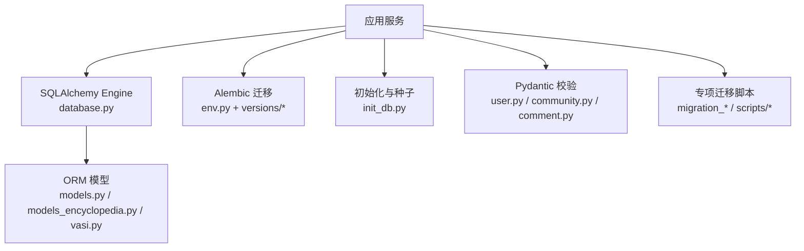
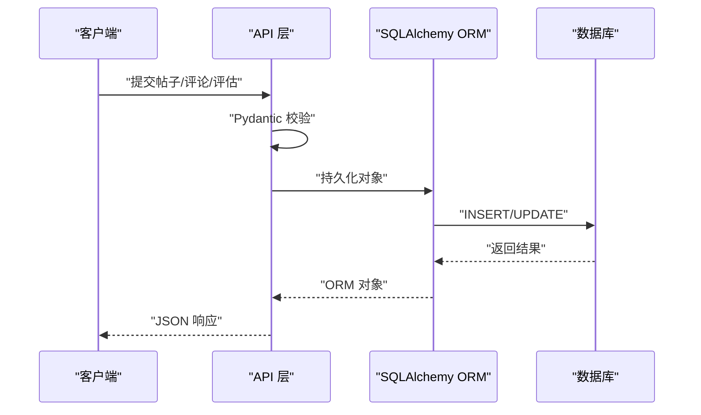
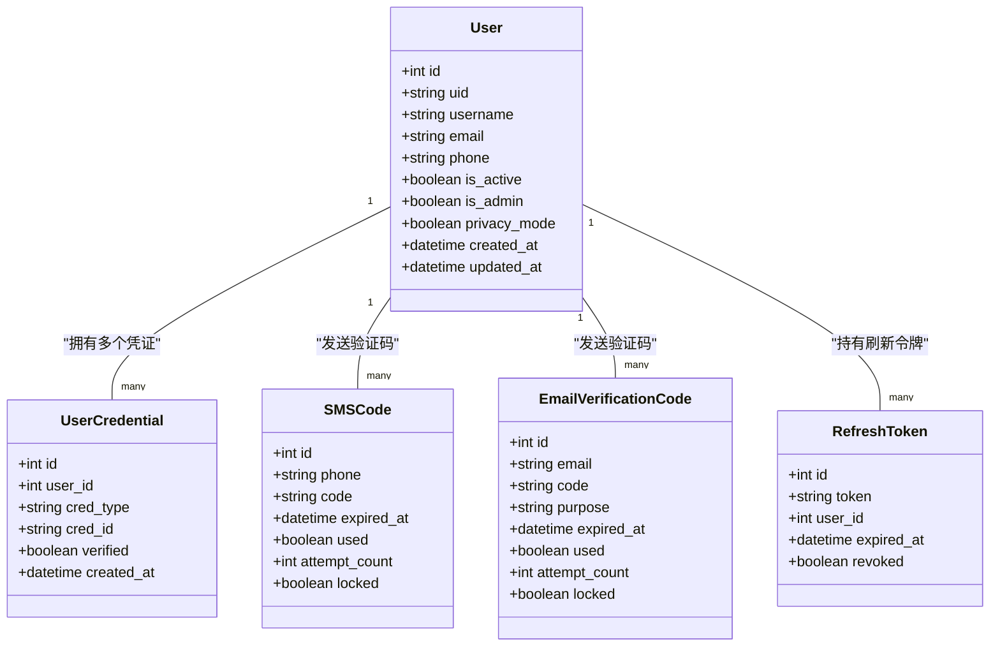
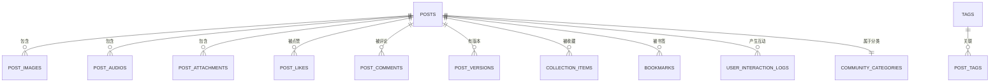
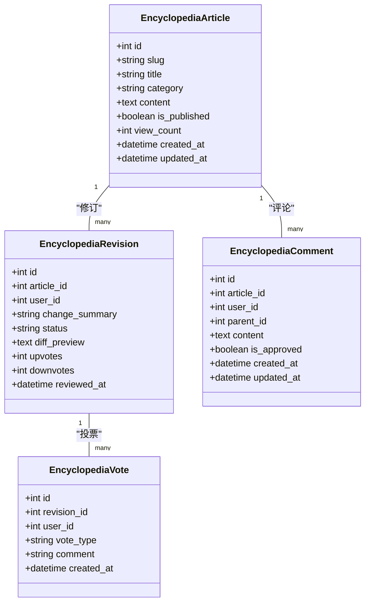
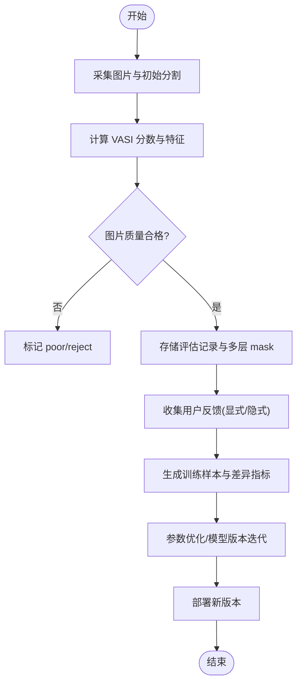
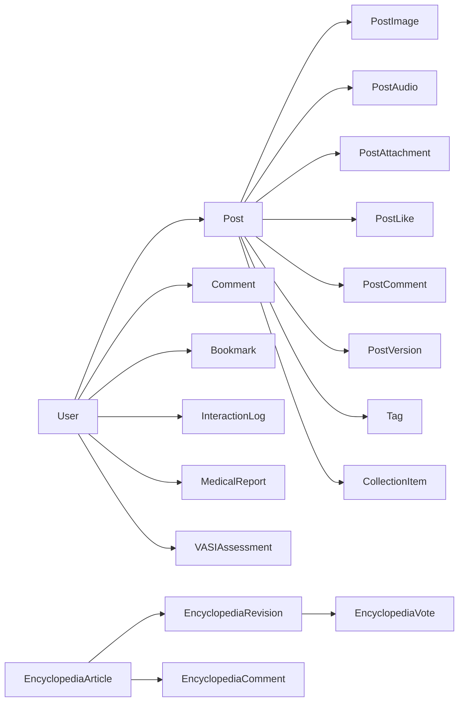

# 数据库设计

<cite>
**本文引用的文件**
- [database.py](file://web/backend/database/database.py)
- [models.py](file://web/backend/database/models.py)
- [models_encyclopedia.py](file://web/backend/database/models_encyclopedia.py)
- [user.py](file://web/backend/models/user.py)
- [community.py](file://web/backend/models/community.py)
- [vasi.py](file://web/backend/models/vasi.py)
- [comment.py](file://web/backend/models/comment.py)
- [init_db.py](file://web/backend/database/init_db.py)
- [001_baseline.py](file://web/backend/alembic/versions/001_baseline.py)
- [002_add_diary_type.py](file://web/backend/alembic/versions/002_add_diary_type.py)
- [env.py](file://web/backend/alembic/env.py)
- [migration_add_event_indexes.py](file://web/backend/database/migration_add_event_indexes.py)
- [migration_add_treatment_share.py](file://scripts/migration_add_treatment_share.py)
- [migrate_credentials.py](file://web/backend/database/migrate_credentials.py)
- [web_config.yaml](file://configs/web_config.yaml)
</cite>

## 目录
1. [简介](#简介)
2. [项目结构](#项目结构)
3. [核心组件](#核心组件)
4. [架构总览](#架构总览)
5. [详细组件分析](#详细组件分析)
6. [依赖关系分析](#依赖关系分析)
7. [性能与索引优化](#性能与索引优化)
8. [事务、并发与一致性](#事务并发与一致性)
9. [迁移管理与版本控制](#迁移管理与版本控制)
10. [备份与恢复策略](#备份与恢复策略)
11. [故障排查指南](#故障排查指南)
12. [结论](#结论)

## 简介
本技术文档围绕 Subskin 的数据库设计展开，聚焦 SQLAlchemy ORM 模型、实体关系映射、索引与约束、数据完整性、迁移管理、版本控制、备份恢复与性能调优。重点覆盖用户模型、内容（社区帖子）、评估记录（VASI）、百科协作、审计日志等核心数据域，并提供查询优化技巧、事务处理模式与并发控制策略。

## 项目结构
- 数据库连接与引擎配置位于 database.py，默认使用 SQLite 并针对并发场景采用 NullPool；非 SQLite 使用 pool_pre_ping。
- ORM 模型集中在 models.py，包含用户、凭证、评论、知识库文档、对话消息、社区分类与帖子、收藏、书签、交互日志、体检报告、百科文章/修订/评论/投票、关注关系等。
- 百科相关模型在 models_encyclopedia.py 中作为补充定义。
- VASI 评估与自进化反馈模型在 vasi.py 中定义，含自动列添加逻辑。
- Pydantic 请求/响应模型在 user.py、community.py、comment.py 中用于 API 层校验与序列化。
- Alembic 迁移脚本位于 alembic/versions，env.py 负责加载模型元数据并执行迁移。
- 初始化脚本 init_db.py 负责建表、创建管理员与种子数据。
- 专项迁移脚本：事件索引、治疗分享字段、历史凭证迁移等。

**图表来源**
- [database.py:1-46](file://web/backend/database/database.py#L1-L46)
- [models.py:1-1277](file://web/backend/database/models.py#L1-L1277)
- [models_encyclopedia.py:1-134](file://web/backend/database/models_encyclopedia.py#L1-L134)
- [vasi.py:1-328](file://web/backend/models/vasi.py#L1-L328)
- [env.py:1-84](file://web/backend/alembic/env.py#L1-L84)
- [init_db.py:1-146](file://web/backend/database/init_db.py#L1-L146)

**章节来源**
- [database.py:1-46](file://web/backend/database/database.py#L1-L46)
- [models.py:1-1277](file://web/backend/database/models.py#L1-L1277)
- [models_encyclopedia.py:1-134](file://web/backend/database/models_encyclopedia.py#L1-L134)
- [vasi.py:1-328](file://web/backend/models/vasi.py#L1-L328)
- [env.py:1-84](file://web/backend/alembic/env.py#L1-L84)
- [init_db.py:1-146](file://web/backend/database/init_db.py#L1-L146)

## 核心组件
- 用户与认证
  - 用户主表、登录凭证、短信/邮箱验证码、OAuth 状态、刷新令牌。
  - 支持社交登录、手机号/邮箱绑定、密码重置、权限与隐私控制。
- 社区内容
  - 分类、帖子、图片/音频/附件、标签、点赞、评论、收藏、书签、版本历史、互动日志。
  - 结构化治疗经验分享 JSON，支持关联 VASI 评估快照。
- 百科协作
  - 文章、修订、评论、投票，支持审核流与差异摘要。
- 评估记录（VASI）
  - 评估结果、图像质量标注、反馈信号、训练样本、模型版本追踪。
- 医疗报告
  - 报告主表与附件，AI 解读与解析结果以 JSON 存储。
- 审计日志
  - 不可篡改的操作记录，支持撤销标记与范围控制。

**章节来源**
- [models.py:30-86](file://web/backend/database/models.py#L30-L86)
- [models.py:88-153](file://web/backend/database/models.py#L88-L153)
- [models.py:156-180](file://web/backend/database/models.py#L156-L180)
- [models.py:239-579](file://web/backend/database/models.py#L239-L579)
- [models.py:581-648](file://web/backend/database/models.py#L581-L648)
- [models.py:650-784](file://web/backend/database/models.py#L650-L784)
- [models_encyclopedia.py:18-134](file://web/backend/database/models_encyclopedia.py#L18-L134)
- [vasi.py:26-125](file://web/backend/models/vasi.py#L26-L125)
- [vasi.py:179-283](file://web/backend/models/vasi.py#L179-L283)

## 架构总览
系统通过 FastAPI 服务调用 SQLAlchemy ORM 访问数据库，Alembic 管理迁移，Pydantic 进行请求/响应校验。SQLite 环境下使用 NullPool 避免连接池耗尽导致的阻塞；生产环境可切换至 PostgreSQL/MySQL 并通过环境变量配置连接参数。

**图表来源**
- [user.py:10-138](file://web/backend/models/user.py#L10-L138)
- [community.py:88-175](file://web/backend/models/community.py#L88-L175)
- [database.py:1-46](file://web/backend/database/database.py#L1-L46)

**章节来源**
- [user.py:10-138](file://web/backend/models/user.py#L10-L138)
- [community.py:88-175](file://web/backend/models/community.py#L88-L175)
- [database.py:1-46](file://web/backend/database/database.py#L1-L46)

## 详细组件分析

### 用户与认证模型
- 用户主表包含身份、社交 ID、隐私开关、默认患者档案引用、行为状态与违规计数等。
- 登录凭证表支持多类型凭证（手机/邮箱/第三方），唯一约束防止重复绑定。
- 验证码表（短信/邮箱）具备过期、尝试次数与锁定机制。
- OAuth 状态表用于 CSRF 防护，刷新令牌表用于会话续期。

**图表来源**
- [models.py:88-153](file://web/backend/database/models.py#L88-L153)
- [models.py:156-180](file://web/backend/database/models.py#L156-L180)
- [models.py:30-86](file://web/backend/database/models.py#L30-L86)

**章节来源**
- [models.py:88-153](file://web/backend/database/models.py#L88-L153)
- [models.py:156-180](file://web/backend/database/models.py#L156-L180)
- [models.py:30-86](file://web/backend/database/models.py#L30-L86)

### 社区内容与互动模型
- 帖子模型支持多种内容类型、视频封面、阅读数、停留时间、城市与地理坐标、匿名发布、审核状态等。
- 图片/音频/附件独立表，便于扩展与排序。
- 标签与帖子多对多，防重约束保证唯一性。
- 点赞表含复合唯一约束，防止并发重复点赞。
- 收藏与书签提供个人知识组织与快速收藏能力。
- 版本历史记录编辑轨迹，支持回滚与对比。
- 互动日志为推荐算法提供点击、阅读结束、点赞、收藏、评论、分享等行为数据。

**图表来源**
- [models.py:299-579](file://web/backend/database/models.py#L299-L579)

**章节来源**
- [models.py:299-579](file://web/backend/database/models.py#L299-L579)

### 百科协作模型
- 文章主表支持分类、发布状态、浏览量、排序权重。
- 修订记录包含变更说明、差异预览、审核状态、投票统计。
- 评论支持父子回复，便于讨论。
- 投票表限制用户对同一修订仅一次投票，确保公平性。

**图表来源**
- [models.py:650-784](file://web/backend/database/models.py#L650-L784)
- [models_encyclopedia.py:18-134](file://web/backend/database/models_encyclopedia.py#L18-L134)

**章节来源**
- [models.py:650-784](file://web/backend/database/models.py#L650-L784)
- [models_encyclopedia.py:18-134](file://web/backend/database/models_encyclopedia.py#L18-L134)

### VASI 评估与自进化模型
- 评估记录包含评分、部位、面积百分比、分型、阶段、原始响应、置信度、预处理标志、参考对象检测、比例因子、最终分数与区域百分比、去色素水平、用户修正标志、多层 mask 数据、状态、轮廓差异指标等。
- 图片质量标注表用于筛选高质量样本。
- 反馈信号表记录显式与隐式反馈，支撑 RL 奖励信号。
- 训练样本表存储去重后的高质量样本，含 AI/用户/管理员标注与差异分析。
- 模型版本表追踪每次进化的变更与部署状态。

**图表来源**
- [vasi.py:26-125](file://web/backend/models/vasi.py#L26-L125)
- [vasi.py:179-283](file://web/backend/models/vasi.py#L179-L283)

**章节来源**
- [vasi.py:26-125](file://web/backend/models/vasi.py#L26-L125)
- [vasi.py:179-283](file://web/backend/models/vasi.py#L179-L283)

### 医疗报告与审计日志
- 医疗报告主表存储标题、标签、AI 解读 JSON、解析分区 JSON、提取的患者信息 JSON。
- 报告附件表记录文件 URL、名称、大小、类型与顺序。
- 审计日志表记录操作者、动作、目标类型与 ID、范围、详情、是否可撤销、撤销时间与 IP，确保隐私授权可追溯。

**章节来源**
- [models.py:581-648](file://web/backend/database/models.py#L581-L648)

## 依赖关系分析
- 模型间通过外键与关系建立强耦合：用户与评论、帖子、收藏、书签、互动日志、医疗报告、VASI 评估等。
- 多对多关系通过中间表实现（如 post_tags、collection_items）。
- 唯一约束保障业务一致性：点赞、收藏、标签、投票、凭证类型+ID 组合等。
- 索引覆盖高频查询路径：时间戳、用户 ID、事件类型、页面路径、UID、分类、发布状态等。

**图表来源**
- [models.py:88-784](file://web/backend/database/models.py#L88-L784)

**章节来源**
- [models.py:88-784](file://web/backend/database/models.py#L88-L784)

## 性能与索引优化
- 事件分析索引：为 user_events 表创建按时间与事件类型的复合索引，提升趋势分析与用户旅程查询效率。
- 帖子日记类型索引：通过迁移为 posts.diary_type 添加索引，加速日记类内容检索。
- 互动日志索引：按用户与帖子、创建时间建立索引，支持推荐算法批量读取。
- 百科索引：文章分类、发布状态、修订状态、用户、评论父级等索引，提升协作与审核查询性能。
- 连接池与超时：SQLite 使用 NullPool 与 timeout=15，避免写锁竞争导致的服务冻结；非 SQLite 启用 pool_pre_ping 保持连接健康。

**章节来源**
- [migration_add_event_indexes.py:1-31](file://web/backend/database/migration_add_event_indexes.py#L1-L31)
- [002_add_diary_type.py:22-34](file://web/backend/alembic/versions/002_add_diary_type.py#L22-L34)
- [models.py:203-225](file://web/backend/database/models.py#L203-L225)
- [models.py:562-579](file://web/backend/database/models.py#L562-L579)
- [models.py:650-784](file://web/backend/database/models.py#L650-L784)
- [database.py:19-33](file://web/backend/database/database.py#L19-L33)

## 事务、并发与一致性
- 点赞并发保护：post_likes 表使用 (post_id, user_id) 唯一约束，防止并发重复插入导致计数膨胀。
- 收藏与书签：collection_items 与 bookmarks 同样使用复合唯一约束，确保一对一关系。
- 凭证唯一性：user_credentials 使用 (cred_type, cred_id) 唯一约束，避免重复绑定。
- 会话与令牌：refresh_tokens 与 oauth_states 使用唯一 token/state，结合过期与撤销字段保障安全。
- 事务边界：API 层通常在一个请求内开启事务，提交或回滚后关闭会话；RAG 流式回答失败时回退访客配额，体现异常回滚策略。

**章节来源**
- [models.py:393-412](file://web/backend/database/models.py#L393-L412)
- [models.py:508-526](file://web/backend/database/models.py#L508-L526)
- [models.py:546-560](file://web/backend/database/models.py#L546-L560)
- [models.py:156-180](file://web/backend/database/models.py#L156-L180)
- [models.py:61-86](file://web/backend/database/models.py#L61-L86)
- [rag.py:817-861](file://web/backend/api/rag.py#L817-L861)

## 迁移管理与版本控制
- Alembic 基线迁移 001_baseline 作为现有 schema 的起点，后续迁移基于此链式演进。
- 迁移 002_add_diary_type 为 posts 表添加 diary_type 字段并创建索引。
- env.py 导入 Base 与 models 模块，确保 autogenerate 能识别所有模型。
- 专项迁移脚本：
  - 事件索引迁移：为 user_events 添加复合索引。
  - 治疗分享字段迁移：为 posts 添加 treatment_share_json 字段（SQLite ADD COLUMN）。
  - 凭证迁移：将旧版用户数据迁移到新的凭证表结构。
- 初始化脚本：
  - init_db.py 创建所有表、管理员账户与社区分类种子数据。

**章节来源**
- [001_baseline.py:1-47](file://web/backend/alembic/versions/001_baseline.py#L1-L47)
- [002_add_diary_type.py:1-34](file://web/backend/alembic/versions/002_add_diary_type.py#L1-L34)
- [env.py:1-84](file://web/backend/alembic/env.py#L1-L84)
- [migration_add_event_indexes.py:1-31](file://web/backend/database/migration_add_event_indexes.py#L1-L31)
- [migration_add_treatment_share.py:1-47](file://scripts/migration_add_treatment_share.py#L1-L47)
- [migrate_credentials.py:99-140](file://web/backend/database/migrate_credentials.py#L99-L140)
- [init_db.py:1-146](file://web/backend/database/init_db.py#L1-L146)

## 备份与恢复策略
- SQLite 单文件数据库：直接复制 data/subskin.db 进行冷备；建议在低峰期进行，避免写锁冲突。
- 增量备份：结合文件系统快照或定期导出关键表（用户、帖子、评估、报告）为 SQL/CSV，便于恢复与审计。
- 恢复流程：停止服务 → 替换数据库文件 → 启动服务 → 运行 init_db.py 确保表结构与种子数据一致 → 验证关键数据。
- 生产环境建议：迁移至 PostgreSQL/MySQL，启用 WAL、定时全量与增量备份、跨地域复制与灾难恢复演练。

[本节为通用指导，不直接分析具体文件]

## 故障排查指南
- 连接池耗尽与服务冻结：SQLite 下已切换 NullPool 并设置 timeout=15，若仍出现“database is locked”，检查并发写入热点与长事务。
- 索引缺失导致慢查询：确认事件索引、日记类型索引、互动日志索引是否已执行；必要时手动运行迁移脚本。
- 并发重复点赞/收藏：检查唯一约束是否存在；若数据不一致，清理重复行并修复计数。
- 凭证迁移失败：核对 users 表字段可用性，确保 migrate_credentials.py 正确执行。
- RAG 流式失败：查看日志与访客配额回退逻辑，确认数据库会话关闭与异常分支处理。

**章节来源**
- [database.py:19-33](file://web/backend/database/database.py#L19-L33)
- [migration_add_event_indexes.py:1-31](file://web/backend/database/migration_add_event_indexes.py#L1-L31)
- [002_add_diary_type.py:22-34](file://web/backend/alembic/versions/002_add_diary_type.py#L22-L34)
- [models.py:393-412](file://web/backend/database/models.py#L393-L412)
- [migrate_credentials.py:99-140](file://web/backend/database/migrate_credentials.py#L99-L140)
- [rag.py:817-861](file://web/backend/api/rag.py#L817-L861)

## 结论
Subskin 的数据库设计以 SQLAlchemy ORM 为核心，围绕用户、社区内容、评估记录与百科协作构建完整的数据模型体系。通过合理的索引与唯一约束保障查询性能与数据一致性；借助 Alembic 与专项迁移脚本实现平滑的版本演进；在 SQLite 环境下针对并发场景做了连接池与超时优化。未来在生产环境中建议迁移至关系型数据库并完善备份恢复与监控告警体系，进一步提升稳定性与可扩展性。