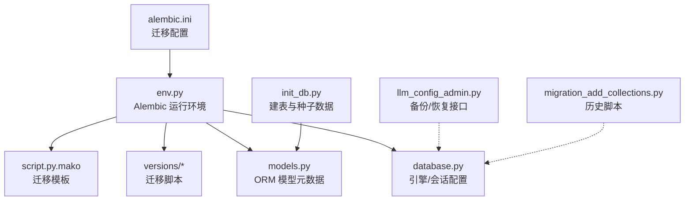
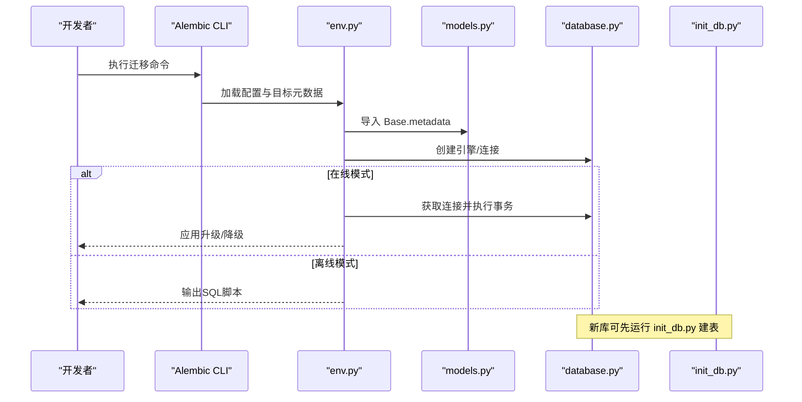
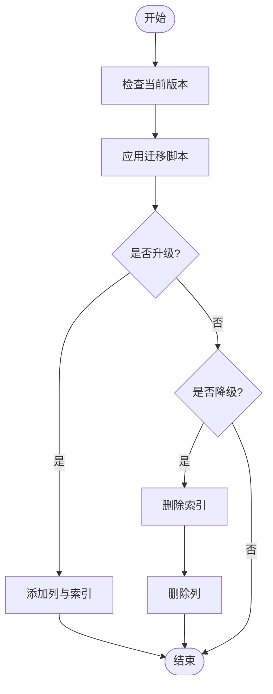
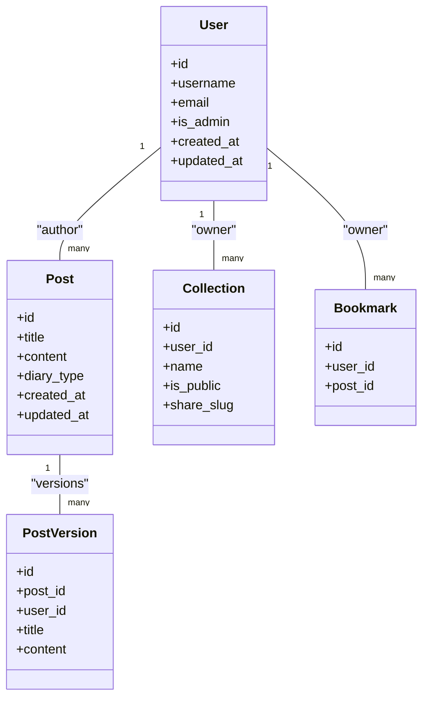
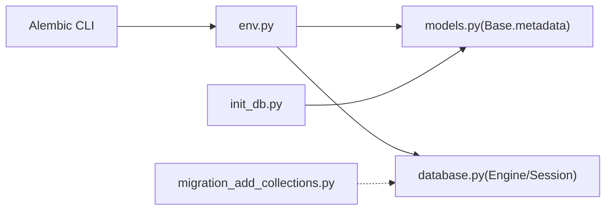

# 数据库迁移管理

<cite>
**本文引用的文件**
- [alembic.ini](file://web/backend/alembic.ini)
- [env.py](file://web/backend/alembic/env.py)
- [script.py.mako](file://web/backend/alembic/script.py.mako)
- [001_baseline.py](file://web/backend/alembic/versions/001_baseline.py)
- [002_add_diary_type.py](file://web/backend/alembic/versions/002_add_diary_type.py)
- [database.py](file://web/backend/database/database.py)
- [init_db.py](file://web/backend/database/init_db.py)
- [models.py](file://web/backend/database/models.py)
- [llm_config_admin.py](file://web/backend/api/llm_config_admin.py)
- [migration_add_collections.py](file://scripts/migration_add_collections.py)
</cite>

## 目录
1. [简介](#简介)
2. [项目结构](#项目结构)
3. [核心组件](#核心组件)
4. [架构总览](#架构总览)
5. [详细组件分析](#详细组件分析)
6. [依赖关系分析](#依赖关系分析)
7. [性能考量](#性能考量)
8. [故障排查指南](#故障排查指南)
9. [结论](#结论)
10. [附录：命令与最佳实践](#附录命令与最佳实践)

## 简介
本文件面向 Subskin 项目的数据库迁移管理，聚焦 Alembic 迁移框架的使用、版本控制策略、回滚机制以及生产环境变更流程。文档涵盖迁移文件命名规范、数据迁移脚本编写、向后兼容性保证、零停机部署策略、备份恢复与灾难恢复方案，并提供常用命令示例与常见问题解决方案，帮助团队在生产环境中安全、可控地演进数据库结构。

## 项目结构
Subskin 后端使用 Alembic 进行数据库迁移管理，迁移配置位于 web/backend/alembic 目录；模型定义位于 web/backend/database/models.py；数据库连接与引擎配置在 web/backend/database/database.py；初始化脚本在 web/backend/database/init_db.py。此外，项目还保留了一些历史遗留的独立迁移脚本（如 scripts/migration_add_collections.py），用于一次性或早期数据表创建。

**图示来源**
- [alembic.ini:1-150](file://web/backend/alembic.ini#L1-L150)
- [env.py:1-84](file://web/backend/alembic/env.py#L1-L84)
- [script.py.mako:1-29](file://web/backend/alembic/script.py.mako#L1-L29)
- [models.py:1-800](file://web/backend/database/models.py#L1-L800)
- [database.py:1-46](file://web/backend/database/database.py#L1-L46)
- [init_db.py:1-146](file://web/backend/database/init_db.py#L1-L146)
- [llm_config_admin.py:250-335](file://web/backend/api/llm_config_admin.py#L250-L335)
- [migration_add_collections.py:1-109](file://scripts/migration_add_collections.py#L1-L109)

**章节来源**
- [alembic.ini:1-150](file://web/backend/alembic.ini#L1-L150)
- [env.py:1-84](file://web/backend/alembic/env.py#L1-L84)
- [database.py:1-46](file://web/backend/database/database.py#L1-L46)
- [init_db.py:1-146](file://web/backend/database/init_db.py#L1-L146)
- [models.py:1-800](file://web/backend/database/models.py#L1-L800)

## 核心组件
- Alembic 配置与运行环境
  - alembic.ini：定义迁移脚本路径、日志级别、数据库 URL 等。
  - env.py：加载模型元数据、提供离线/在线迁移执行入口。
  - script.py.mako：生成迁移文件的模板，包含 revision 标识与 upgrade/downgrade 骨架。
- 迁移脚本
  - versions/001_baseline.py：基线迁移，标记现有数据库状态为 Alembic 起点。
  - versions/002_add_diary_type.py：为 posts 表添加 diary_type 列并建立索引。
- ORM 模型与数据库连接
  - models.py：集中定义所有表的 SQLAlchemy 模型，供 Alembic 自动检测差异。
  - database.py：配置 SQLite/PostgreSQL 引擎、连接池与会话。
- 初始化与种子数据
  - init_db.py：创建表结构与初始管理员账户、社区分类等种子数据。
- 备份与恢复
  - llm_config_admin.py：提供 LLM 配置的备份与恢复接口（非数据库结构备份）。
- 历史迁移脚本
  - migration_add_collections.py：一次性创建 collections/bookmarks/post_versions 等表。

**章节来源**
- [alembic.ini:1-150](file://web/backend/alembic.ini#L1-L150)
- [env.py:1-84](file://web/backend/alembic/env.py#L1-L84)
- [script.py.mako:1-29](file://web/backend/alembic/script.py.mako#L1-L29)
- [001_baseline.py:1-47](file://web/backend/alembic/versions/001_baseline.py#L1-L47)
- [002_add_diary_type.py:1-34](file://web/backend/alembic/versions/002_add_diary_type.py#L1-L34)
- [models.py:1-800](file://web/backend/database/models.py#L1-L800)
- [database.py:1-46](file://web/backend/database/database.py#L1-L46)
- [init_db.py:1-146](file://web/backend/database/init_db.py#L1-L146)
- [llm_config_admin.py:250-335](file://web/backend/api/llm_config_admin.py#L250-L335)
- [migration_add_collections.py:1-109](file://scripts/migration_add_collections.py#L1-L109)

## 架构总览
下图展示了 Alembic 迁移执行时各组件的交互关系：env.py 读取 alembic.ini 配置，导入模型元数据，根据是否离线模式选择执行方式；迁移脚本通过 op 调用 SQL 变更；数据库引擎由 database.py 提供；新库可通过 init_db.py 建表。

**图示来源**
- [env.py:1-84](file://web/backend/alembic/env.py#L1-L84)
- [alembic.ini:1-150](file://web/backend/alembic.ini#L1-L150)
- [models.py:1-800](file://web/backend/database/models.py#L1-L800)
- [database.py:1-46](file://web/backend/database/database.py#L1-L46)
- [init_db.py:1-146](file://web/backend/database/init_db.py#L1-L146)

## 详细组件分析

### Alembic 配置与环境
- alembic.ini
  - 指定迁移脚本目录、日志级别、数据库 URL（默认 SQLite 文件路径）。
  - 支持多版本目录与路径分隔符配置。
- env.py
  - 将项目根目录加入 sys.path，确保模型可被导入。
  - 设置 target_metadata 为 Base.metadata，使自动生成功能可用。
  - 提供 run_migrations_offline 与 run_migrations_online 两种执行路径。
- script.py.mako
  - 生成迁移文件模板，包含 revision、down_revision、upgrade、downgrade 方法。

**章节来源**
- [alembic.ini:1-150](file://web/backend/alembic.ini#L1-L150)
- [env.py:1-84](file://web/backend/alembic/env.py#L1-L84)
- [script.py.mako:1-29](file://web/backend/alembic/script.py.mako#L1-L29)

### 迁移脚本与版本控制
- 001_baseline.py
  - 作为 Alembic 的基线版本，不执行实际变更；用于对已有数据库打桩。
  - 注释说明对新库使用 upgrade head，对已有库使用 stamp 标记起点。
- 002_add_diary_type.py
  - 为 posts 表新增 diary_type 列并建立索引，使用 batch_alter_table 兼容 SQLite。
  - downgrade 中删除索引与列，实现可回滚。

**图示来源**
- [002_add_diary_type.py:1-34](file://web/backend/alembic/versions/002_add_diary_type.py#L1-L34)

**章节来源**
- [001_baseline.py:1-47](file://web/backend/alembic/versions/001_baseline.py#L1-L47)
- [002_add_diary_type.py:1-34](file://web/backend/alembic/versions/002_add_diary_type.py#L1-L34)

### ORM 模型与数据库连接
- models.py
  - 集中定义用户、帖子、收藏、书签、版本历史、百科文章等模型。
  - 通过 Index、UniqueConstraint 等约束保障数据一致性与查询性能。
- database.py
  - SQLite 使用 NullPool，避免并发写锁导致的线程阻塞问题。
  - 提供 get_db 会话注入函数，便于 FastAPI 等框架集成。

**图示来源**
- [models.py:1-800](file://web/backend/database/models.py#L1-L800)

**章节来源**
- [models.py:1-800](file://web/backend/database/models.py#L1-L800)
- [database.py:1-46](file://web/backend/database/database.py#L1-L46)

### 初始化与种子数据
- init_db.py
  - 使用 Base.metadata.create_all 创建表结构。
  - 创建管理员账户与社区分类种子数据，支持环境变量覆盖默认值。

**章节来源**
- [init_db.py:1-146](file://web/backend/database/init_db.py#L1-L146)

### 备份与恢复（配置级）
- llm_config_admin.py
  - 提供备份接口：导出模块配置并掩码敏感字段。
  - 提供恢复接口：从备份文件更新模块配置，兼容明文与加密密钥。
  - 注意：该备份为应用配置备份，非数据库结构/数据备份。

**章节来源**
- [llm_config_admin.py:250-335](file://web/backend/api/llm_config_admin.py#L250-L335)

### 历史迁移脚本
- migration_add_collections.py
  - 直接操作 SQLite 数据库，创建 collections、collection_items、post_versions、bookmarks 表及索引。
  - 适用于早期一次性建表场景，建议逐步迁移至 Alembic 统一管理。

**章节来源**
- [migration_add_collections.py:1-109](file://scripts/migration_add_collections.py#L1-L109)

## 依赖关系分析
- Alembic 依赖 env.py 提供的目标元数据与执行上下文。
- env.py 依赖 models.py 中的 Base.metadata 以识别模型变更。
- database.py 提供引擎与会话，影响迁移执行的连接行为。
- init_db.py 与 Alembic 并行存在：新库可先用 init_db.py 建表，再用 Alembic 管理后续变更。
- 历史脚本与 Alembic 并存：应逐步整合到 Alembic 版本链中，避免版本漂移。

**图示来源**
- [env.py:1-84](file://web/backend/alembic/env.py#L1-L84)
- [models.py:1-800](file://web/backend/database/models.py#L1-L800)
- [database.py:1-46](file://web/backend/database/database.py#L1-L46)
- [init_db.py:1-146](file://web/backend/database/init_db.py#L1-L146)
- [migration_add_collections.py:1-109](file://scripts/migration_add_collections.py#L1-L109)

**章节来源**
- [env.py:1-84](file://web/backend/alembic/env.py#L1-L84)
- [models.py:1-800](file://web/backend/database/models.py#L1-L800)
- [database.py:1-46](file://web/backend/database/database.py#L1-L46)
- [init_db.py:1-146](file://web/backend/database/init_db.py#L1-L146)
- [migration_add_collections.py:1-109](file://scripts/migration_add_collections.py#L1-L109)

## 性能考量
- SQLite 连接池：database.py 使用 NullPool，避免在高并发下因连接池耗尽导致服务冻结。
- 写锁竞争：SQLite 写操作可能触发“database is locked”，可通过超时参数缓解。
- 索引设计：迁移脚本中为新列建立索引（如 posts.diary_type），提升查询性能。
- 批量变更：使用 batch_alter_table 兼容 SQLite 的 ALTER 限制，减少迁移失败风险。

[本节为通用指导，无需特定文件引用]

## 故障排查指南
- 迁移无法识别模型变更
  - 确认 env.py 已正确导入 models 并设置 target_metadata。
  - 检查 alembic.ini 的 script_location 与 prepend_sys_path。
- SQLite 写锁错误
  - 调整 connect_args 中的 timeout，避免频繁锁定。
  - 避免在同一进程内并发写入同一数据库文件。
- 版本不一致
  - 使用 alembic current 查看当前版本，必要时使用 alembic stamp 对齐基线。
- 历史脚本与 Alembic 冲突
  - 将历史脚本逻辑合并到 Alembic 迁移中，避免重复建表或字段。

**章节来源**
- [env.py:1-84](file://web/backend/alembic/env.py#L1-L84)
- [alembic.ini:1-150](file://web/backend/alembic.ini#L1-L150)
- [database.py:1-46](file://web/backend/database/database.py#L1-L46)
- [001_baseline.py:1-47](file://web/backend/alembic/versions/001_baseline.py#L1-L47)

## 结论
Subskin 项目通过 Alembic 实现了结构化的数据库迁移管理，结合 ORM 模型与配置化环境，支持在线/离线迁移与回滚。基线迁移与增量迁移清晰分离，便于团队协作与版本控制。对于生产环境，建议遵循“先代码后迁移、小步快跑、可回滚”的原则，配合备份与恢复策略，确保数据安全与服务稳定。历史脚本应逐步迁移至 Alembic，统一版本管理。

[本节为总结性内容，无需特定文件引用]

## 附录：命令与最佳实践

### 常用命令示例
- 生成迁移文件
  - alembic revision --autogenerate -m "描述变更"
- 应用迁移
  - alembic upgrade head
- 查看当前版本
  - alembic current
- 回滚迁移
  - alembic downgrade -1
- 基线对齐（已有数据库）
  - alembic stamp 001_baseline

### 迁移文件命名规范
- 采用数字前缀加语义化名称，如 001_baseline、002_add_diary_type。
- 保持顺序递增，确保版本链清晰。
- 每个迁移文件需实现 upgrade 与 downgrade，保证可回滚。

### 版本控制策略
- 将 Alembic 迁移脚本纳入版本控制系统，提交时附带变更说明。
- 基线迁移用于标记现有数据库状态，后续变更基于基线演进。
- 分支开发时避免并行修改同一表结构，必要时合并迁移。

### 回滚机制
- 每个迁移必须实现 downgrade，删除索引与列等操作需成对出现。
- 生产回滚前先在测试环境验证，确保数据一致性。
- 对不可回滚的变更（如删除列），需在迁移中记录并评估风险。

### 生产环境变更流程
- 代码先行：先发布支持新字段的应用代码，再执行迁移。
- 数据迁移脚本：对大表变更分批处理，避免长时间锁表。
- 向后兼容：新增字段默认允许 NULL，逐步填充数据后再设为 NOT NULL。
- 零停机部署：分阶段灰度发布，监控错误率与性能指标。

### 数据备份与灾难恢复
- 应用配置备份：使用 llm_config_admin.py 的备份/恢复接口，定期导出配置。
- 数据库备份：对 SQLite 文件进行定期快照；对 PostgreSQL 使用 pg_dump 等工具。
- 灾难恢复：制定恢复演练计划，确保备份可用且恢复时间满足 SLA。

[本节为通用指导，无需特定文件引用]