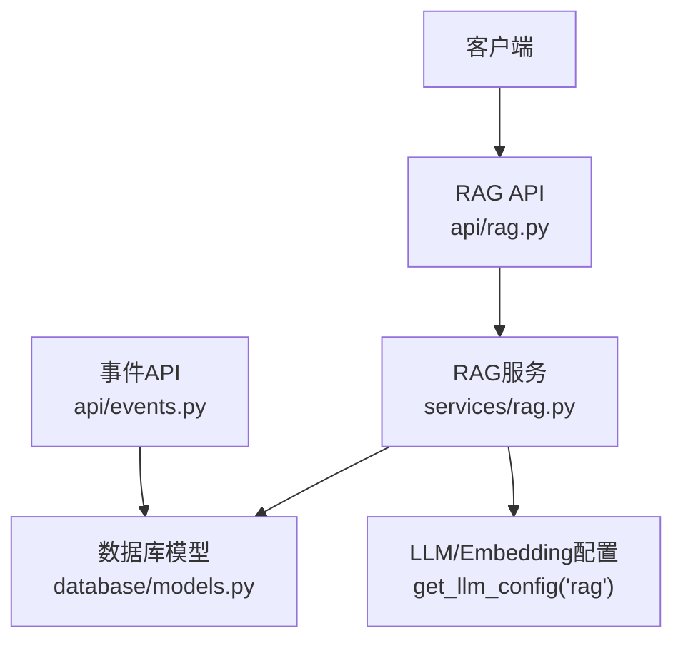
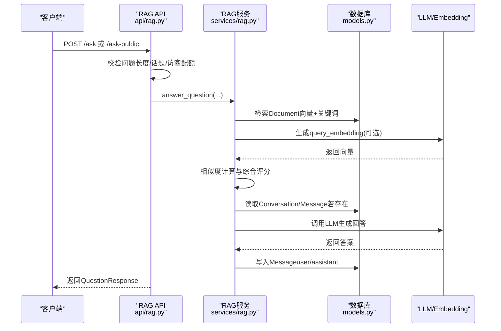
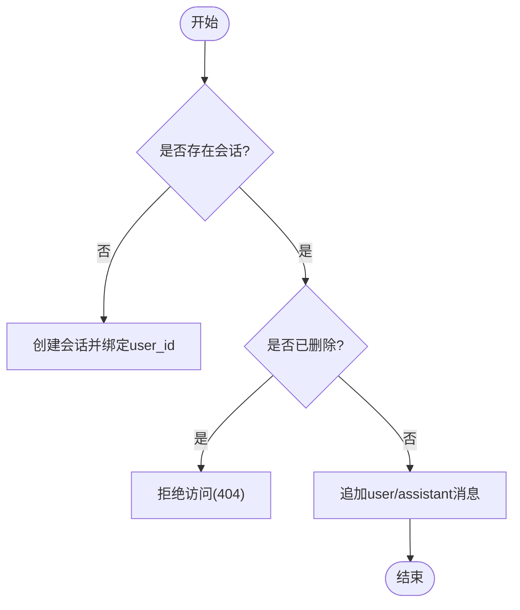
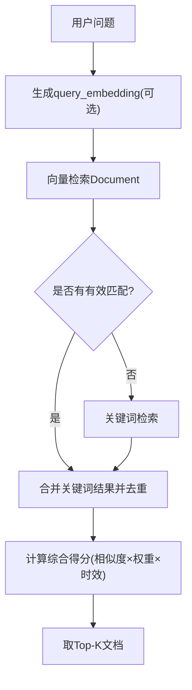
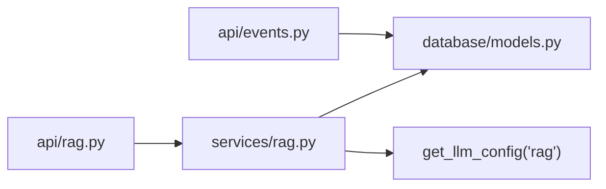

# AI问答模型

<cite>
**本文引用的文件**
- [web/backend/database/models.py](file://web/backend/database/models.py)
- [web/backend/services/rag.py](file://web/backend/services/rag.py)
- [web/backend/api/rag.py](file://web/backend/api/rag.py)
- [web/backend/models/rag.py](file://web/backend/models/rag.py)
- [web/backend/api/events.py](file://web/backend/api/events.py)
</cite>

## 目录
1. [简介](#简介)
2. [项目结构](#项目结构)
3. [核心数据模型](#核心数据模型)
4. [架构总览](#架构总览)
5. [详细组件分析](#详细组件分析)
6. [依赖关系分析](#依赖关系分析)
7. [性能与检索优化](#性能与检索优化)
8. [故障排查指南](#故障排查指南)
9. [结论](#结论)

## 简介
本文件面向Subskin AI问答系统的数据模型，聚焦以下目标：
- 知识库文档模型（Document）的字段设计与用途：标题、内容、来源、分类、权重、发布时间、嵌入向量等。
- 多轮对话历史（Conversation + Message）的管理机制与会话归属控制。
- 单条消息（Message）的角色区分（user/assistant）与时间戳管理。
- 嵌入向量（embedding）存储与RAG检索流程（向量+关键词混合检索）。
- 用户行为事件追踪（UserEvent）与访客使用量追踪（GuestUsage）的数据采集机制。
- 提供ORM模型定义示例路径，展示JSON字段处理与全文搜索优化思路。

## 项目结构
AI问答相关代码主要分布在后端模块中：
- 数据库模型定义位于 database/models.py，包含 Document、Conversation、Message、UserEvent、GuestUsage 等。
- RAG服务逻辑在 services/rag.py，负责检索、相似度计算、提示词构建、用户上下文聚合等。
- API层在 api/rag.py，暴露提问、流式回答、访客配额、临时上传等接口，并实现会话所有权校验与访客限流。
- Pydantic请求/响应模型在 models/rag.py，用于API契约。
- 事件追踪API在 api/events.py，提供单条与批量事件上报。

**图表来源**
- [web/backend/api/rag.py:246-330](file://web/backend/api/rag.py#L246-L330)
- [web/backend/services/rag.py:456-523](file://web/backend/services/rag.py#L456-L523)
- [web/backend/database/models.py:255-297](file://web/backend/database/models.py#L255-L297)
- [web/backend/api/events.py:40-112](file://web/backend/api/events.py#L40-L112)

**章节来源**
- [web/backend/database/models.py:255-297](file://web/backend/database/models.py#L255-L297)
- [web/backend/services/rag.py:456-523](file://web/backend/services/rag.py#L456-L523)
- [web/backend/api/rag.py:246-330](file://web/backend/api/rag.py#L246-L330)
- [web/backend/api/events.py:40-112](file://web/backend/api/events.py#L40-L112)

## 核心数据模型
本节梳理AI问答相关的核心ORM模型及其职责。

### 知识库文档模型（Document）
- 作用：RAG检索的知识单元，支持标题、正文、来源、分类、权威等级、权重、发布时间、嵌入向量等。
- 关键字段说明：
  - title/content/source/source_url/category：文档元数据与正文，便于关键词匹配与展示。
  - source_tier/authority_weight：来源等级与权威权重，参与最终评分。
  - pub_date：发布时间，用于时效性加权。
  - embedding：以文本形式存储的向量数组（JSON），供向量检索使用。
  - created_at/updated_at：审计与更新追踪。
- 索引与查询：按content非空过滤；结合关键词与向量进行混合检索。

**章节来源**
- [web/backend/database/models.py:255-272](file://web/backend/database/models.py#L255-L272)

### 对话历史模型（Conversation）
- 作用：多轮对话的容器，关联用户与会话ID，支持软删除标记。
- 关键字段：
  - conversation_id：唯一会话标识，用于消息分组。
  - user_id：会话所有者，用于权限校验。
  - is_deleted：软删除标志，防止已删除会话被读取或追加。
  - created_at/updated_at：生命周期追踪。

**章节来源**
- [web/backend/database/models.py:274-285](file://web/backend/database/models.py#L274-L285)

### 单条消息模型（Message）
- 作用：记录每轮对话中的单条消息，支持角色区分与时间排序。
- 关键字段：
  - conversation_id：所属会话。
  - role：消息角色（如user/assistant），用于构建对话上下文。
  - content：消息正文。
  - created_at：时间戳，用于顺序回放与上下文组装。

**章节来源**
- [web/backend/database/models.py:287-297](file://web/backend/database/models.py#L287-L297)

### 用户行为事件模型（UserEvent）
- 作用：采集前端交互事件，用于分析与推荐。
- 关键字段：
  - uid/session_id/event_type：事件主体与类型。
  - element_id/page_path/element_text：触发元素与页面路径。
  - extra_data：扩展字段（JSON字符串）。
  - client_fingerprint/ip_address/user_agent：设备与环境信息。
  - created_at：事件时间。
- 索引：针对created_at、event_type、page_path、uid建立复合索引，提升分析查询效率。

**章节来源**
- [web/backend/database/models.py:203-225](file://web/backend/database/models.py#L203-L225)
- [web/backend/api/events.py:40-112](file://web/backend/api/events.py#L40-L112)

### 访客使用量模型（GuestUsage）
- 作用：按客户端指纹统计每日免费提问次数，实施配额限制。
- 关键字段：
  - client_fingerprint：客户端指纹，作为配额维度。
  - question_count：当日已用次数。
  - date：日期（YYYY-MM-DD），按天分桶。
  - created_at：记录创建时间。

**章节来源**
- [web/backend/database/models.py:227-237](file://web/backend/database/models.py#L227-L237)
- [web/backend/api/rag.py:136-163](file://web/backend/api/rag.py#L136-L163)

## 架构总览
RAG问答流程从API到服务再到数据库，形成“检索—生成—回写”的闭环。

**图表来源**
- [web/backend/api/rag.py:246-330](file://web/backend/api/rag.py#L246-L330)
- [web/backend/services/rag.py:456-523](file://web/backend/services/rag.py#L456-L523)
- [web/backend/database/models.py:274-297](file://web/backend/database/models.py#L274-L297)

## 详细组件分析

### 知识库文档模型（Document）设计
- 字段职责：
  - 标题与内容：用于关键词匹配与片段展示。
  - 来源与URL：溯源与引用。
  - 分类：便于后续按主题筛选。
  - 来源等级与权威权重：影响最终排序。
  - 发布时间：时效性加权。
  - 嵌入向量：JSON格式浮点数组，用于余弦相似度检索。
- 复杂度与优化：
  - 关键词检索对长文本线性扫描，适合小规模知识库；大规模可引入全文索引。
  - 向量检索需保证维度一致，否则相似度为0并跳过该文档。
  - 最终得分=基础相似度×权威权重×时效系数。

**章节来源**
- [web/backend/database/models.py:255-272](file://web/backend/database/models.py#L255-L272)
- [web/backend/services/rag.py:422-431](file://web/backend/services/rag.py#L422-L431)
- [web/backend/services/rag.py:481-500](file://web/backend/services/rag.py#L481-L500)

### 多轮对话管理机制（Conversation + Message）
- 会话创建与归属：
  - 首次访问时可能不存在conversation_id，由API在服务中创建并绑定user_id。
  - 会话所有权校验：已登录用户只能操作自己的会话；未认领的访客会话可被登录后接管。
- 消息追加与回放：
  - 每次回答后写入assistant消息；用户输入写入user消息。
  - 通过created_at排序回放历史，构建LLM上下文。
- 软删除保护：
  - is_deleted=true的会话不可读不可写，避免数据泄露。

**图表来源**
- [web/backend/api/rag.py:188-226](file://web/backend/api/rag.py#L188-L226)
- [web/backend/api/rag.py:775-794](file://web/backend/api/rag.py#L775-L794)

**章节来源**
- [web/backend/database/models.py:274-297](file://web/backend/database/models.py#L274-L297)
- [web/backend/api/rag.py:188-226](file://web/backend/api/rag.py#L188-L226)
- [web/backend/api/rag.py:775-794](file://web/backend/api/rag.py#L775-L794)

### 单条消息模型（Message）与时间戳管理
- 角色区分：
  - role=user表示用户输入；role=assistant表示AI回复。
- 时间戳：
  - created_at用于消息顺序回放与上下文拼接。
- 上下文构建：
  - 按会话ID查询并按时间排序，转换为角色-内容列表注入LLM。

**章节来源**
- [web/backend/database/models.py:287-297](file://web/backend/database/models.py#L287-L297)
- [web/backend/api/rag.py:775-785](file://web/backend/api/rag.py#L775-L785)

### 嵌入向量存储与RAG检索
- 向量生成：
  - 通过LLM配置的embedding模型生成向量，支持dimensions参数。
  - 失败时降级为关键词检索。
- 相似度计算：
  - 余弦相似度，维度不匹配时返回0并跳过该文档。
- 混合检索：
  - 优先向量检索，若无有效结果则回退关键词检索。
  - 合并去重并按综合得分排序。

**图表来源**
- [web/backend/services/rag.py:354-384](file://web/backend/services/rag.py#L354-L384)
- [web/backend/services/rag.py:387-401](file://web/backend/services/rag.py#L387-L401)
- [web/backend/services/rag.py:456-523](file://web/backend/services/rag.py#L456-L523)

**章节来源**
- [web/backend/services/rag.py:354-401](file://web/backend/services/rag.py#L354-L401)
- [web/backend/services/rag.py:456-523](file://web/backend/services/rag.py#L456-L523)

### 用户行为事件追踪（UserEvent）
- 采集入口：
  - 单条上报：POST /track。
  - 批量上报：POST /track/batch，限制单次最多50条。
- 字段处理：
  - extra_data序列化为JSON字符串存储。
  - IP地址脱敏存储，UA截断防过大。
- 索引优化：
  - 针对created_at、event_type、page_path、uid建立复合索引，提升分析查询效率。

**章节来源**
- [web/backend/api/events.py:40-112](file://web/backend/api/events.py#L40-L112)
- [web/backend/database/models.py:203-225](file://web/backend/database/models.py#L203-L225)

### 访客使用量追踪（GuestUsage）
- 配额控制：
  - 基于client_fingerprint与date分桶统计question_count。
  - 超过限额返回429并提示剩余次数。
- 增量与退款：
  - 成功回答后计数+1；流式失败时可尝试退款（best-effort）。

**章节来源**
- [web/backend/api/rag.py:136-163](file://web/backend/api/rag.py#L136-L163)
- [web/backend/api/rag.py:333-342](file://web/backend/api/rag.py#L333-L342)

## 依赖关系分析
- API层依赖：
  - api/rag.py依赖services/rag.py的核心函数（answer_question、search_documents等）。
  - api/events.py依赖database/models.py的UserEvent模型。
- 服务层依赖：
  - services/rag.py依赖database/models.py的Document、Conversation、Message等。
  - 通过get_llm_config("rag")获取LLM/Embedding配置。
- 数据层：
  - database/models.py定义所有ORM模型，提供SQLAlchemy映射。

**图表来源**
- [web/backend/api/rag.py:246-330](file://web/backend/api/rag.py#L246-L330)
- [web/backend/services/rag.py:456-523](file://web/backend/services/rag.py#L456-L523)
- [web/backend/api/events.py:40-112](file://web/backend/api/events.py#L40-L112)

**章节来源**
- [web/backend/api/rag.py:246-330](file://web/backend/api/rag.py#L246-L330)
- [web/backend/services/rag.py:456-523](file://web/backend/services/rag.py#L456-L523)
- [web/backend/api/events.py:40-112](file://web/backend/api/events.py#L40-L112)

## 性能与检索优化
- 混合检索策略：
  - 向量检索优先，无有效匹配时回退关键词检索，确保新入库文档立即可见。
- 相似度计算健壮性：
  - 维度不匹配时返回0并跳过，避免错误排名。
- 综合评分：
  - 基础相似度×权威权重×时效系数，平衡相关性、权威性与新鲜度。
- 索引建议：
  - 对documents.content建立全文索引以提升关键词检索性能。
  - 对messages.created_at、conversations.conversation_id建立索引以加速回放。
  - 对user_events.created_at、event_type、page_path、uid建立复合索引以加速分析。

[本节为通用性能建议，不直接分析具体文件]

## 故障排查指南
- 访客配额耗尽：
  - 现象：返回429并提示今日免费次数用完。
  - 排查：检查guest_usages表中对应fingerprint与date的记录。
- 向量检索失败：
  - 现象：日志提示维度不匹配或embedding解析失败。
  - 排查：确认embedding字段为合法JSON数组且维度与query一致。
- 会话无权访问：
  - 现象：403或404错误。
  - 排查：确认会话is_deleted状态与user_id归属。

**章节来源**
- [web/backend/api/rag.py:136-163](file://web/backend/api/rag.py#L136-L163)
- [web/backend/services/rag.py:387-401](file://web/backend/services/rag.py#L387-L401)
- [web/backend/api/rag.py:188-226](file://web/backend/api/rag.py#L188-L226)

## 结论
Subskin AI问答系统通过清晰的ORM模型与分层架构实现了稳健的RAG能力：
- Document模型承载知识单元，支持多维度元数据与向量存储。
- Conversation与Message构成多轮对话骨架，具备会话归属与软删除保护。
- UserEvent与GuestUsage提供行为追踪与配额控制，保障系统安全与公平。
- 混合检索策略兼顾准确性与可用性，结合权威权重与时效性提升回答质量。

[本节为总结性内容，不直接分析具体文件]