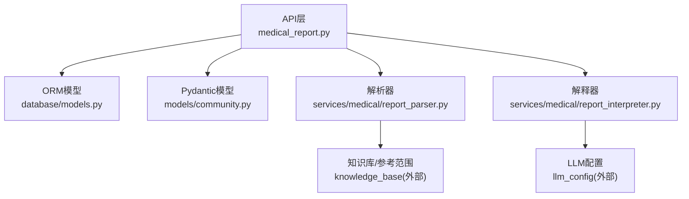
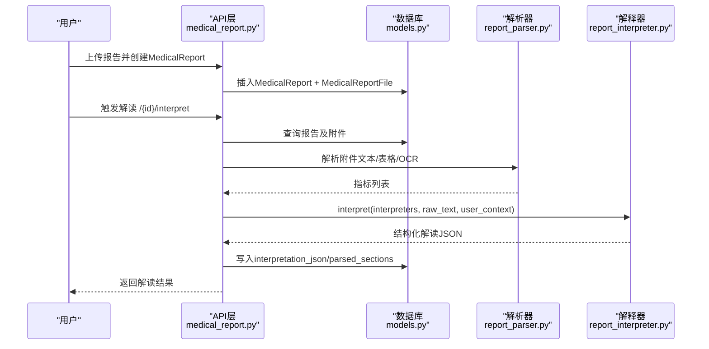
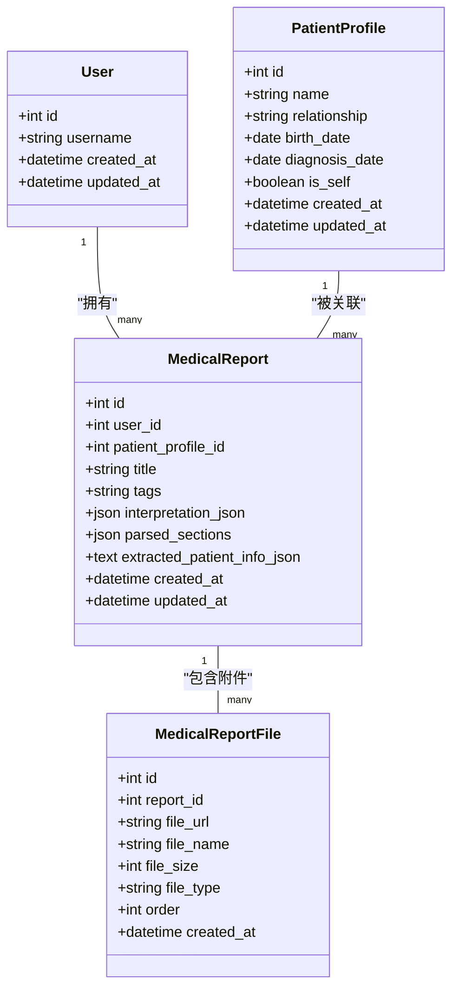
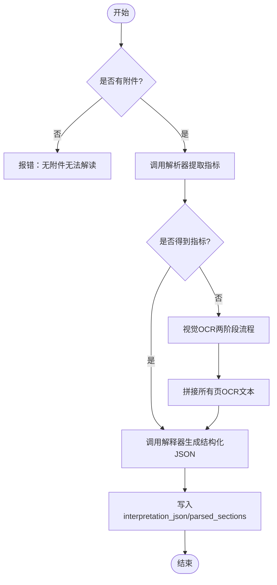
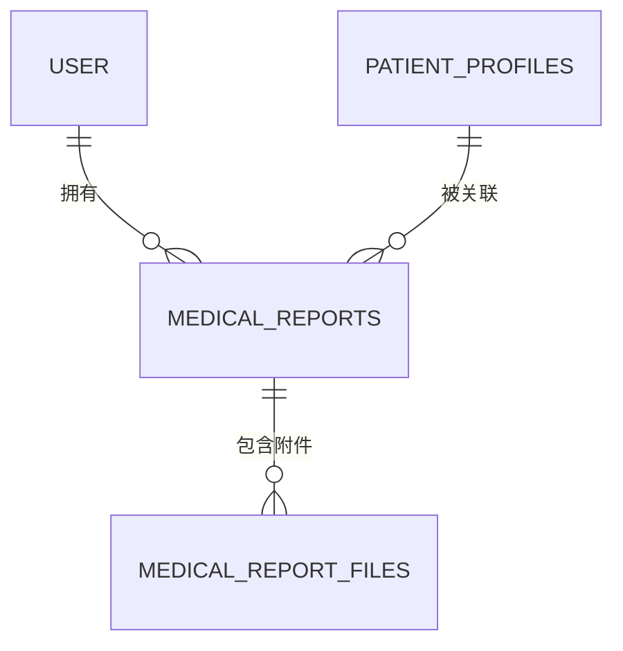
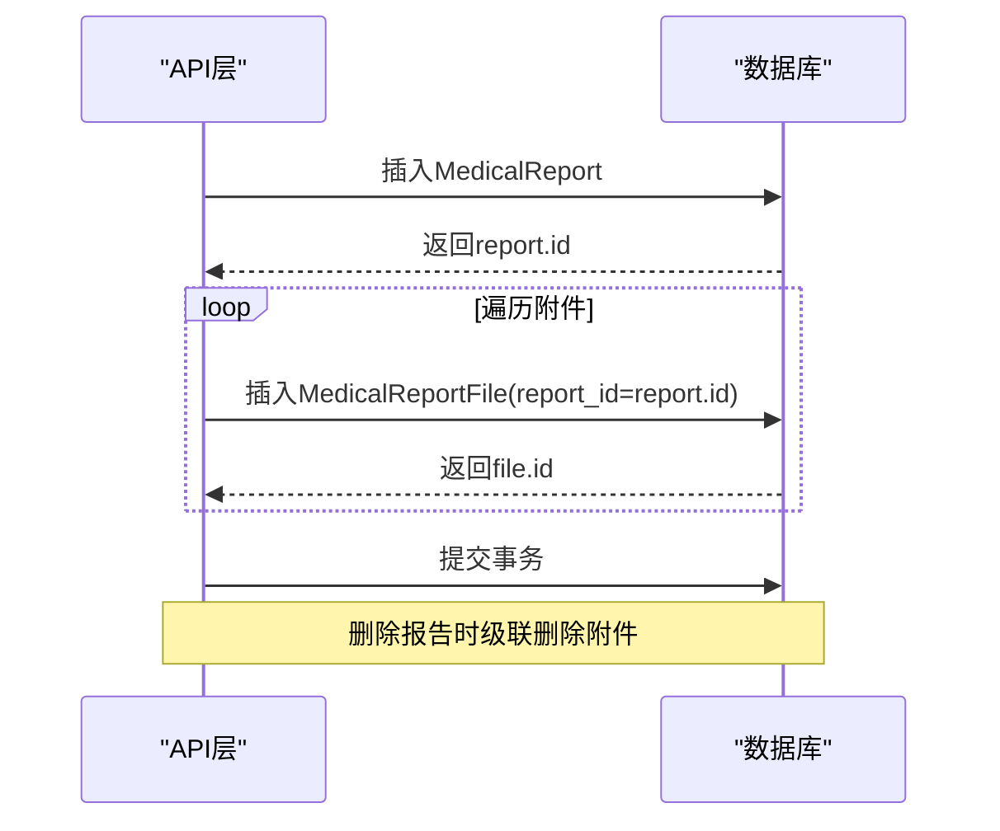
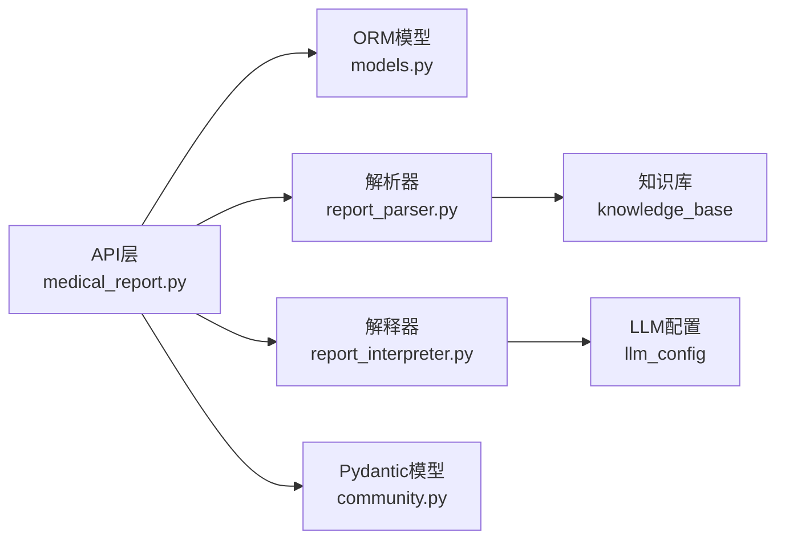

# 体检报告模型

<cite>
**本文引用的文件**
- [models.py](file://web/backend/database/models.py)
- [medical_report.py](file://web/backend/api/medical_report.py)
- [community.py](file://web/backend/models/community.py)
- [report_parser.py](file://web/backend/services/medical/report_parser.py)
- [report_interpreter.py](file://web/backend/services/medical/report_interpreter.py)
</cite>

## 目录
1. [简介](#简介)
2. [项目结构](#项目结构)
3. [核心组件](#核心组件)
4. [架构总览](#架构总览)
5. [详细组件分析](#详细组件分析)
6. [依赖关系分析](#依赖关系分析)
7. [性能考虑](#性能考虑)
8. [故障排查指南](#故障排查指南)
9. [结论](#结论)
10. [附录](#附录)

## 简介
本文件面向Subskin体检报告系统的数据模型与解析流程，重点说明：
- MedicalReport体检报告主表设计：标题、标签、AI解读结果JSON、结构化分区数据等字段。
- MedicalReportFile报告附件模型的文件管理功能。
- 与User用户和PatientProfile患者档案的关联关系。
- 报告解析结果的JSON结构设计，支持指标提取和风险识别。
- ORM关系映射示例，展示报告与附件的一对多关系和数据完整性保证。

## 项目结构
体检报告相关代码主要分布在以下模块：
- 数据库ORM模型定义：web/backend/database/models.py
- API路由与业务编排：web/backend/api/medical_report.py
- Pydantic响应模型（API契约）：web/backend/models/community.py
- 报告解析器（文本/表格/OCR）：web/backend/services/medical/report_parser.py
- 报告解释器（LLM解读、分段、对比）：web/backend/services/medical/report_interpreter.py

**图表来源**
- [medical_report.py:1-120](file://web/backend/api/medical_report.py#L1-L120)
- [models.py:581-622](file://web/backend/database/models.py#L581-L622)
- [community.py:317-427](file://web/backend/models/community.py#L317-L427)
- [report_parser.py:164-306](file://web/backend/services/medical/report_parser.py#L164-L306)
- [report_interpreter.py:18-61](file://web/backend/services/medical/report_interpreter.py#L18-L61)

**章节来源**
- [models.py:581-622](file://web/backend/database/models.py#L581-L622)
- [medical_report.py:185-276](file://web/backend/api/medical_report.py#L185-L276)
- [community.py:317-427](file://web/backend/models/community.py#L317-L427)

## 核心组件
- MedicalReport（体检报告主表）
  - 关键字段：id、user_id、patient_profile_id、title、tags、interpretation_json、parsed_sections、extracted_patient_info_json、created_at、updated_at
  - 作用：承载报告元信息、AI解读结果、结构化分区数据以及从报告中抽取的患者基本信息。
- MedicalReportFile（报告附件）
  - 关键字段：id、report_id、file_url、file_name、file_size、file_type、order、created_at
  - 作用：存储报告原始文件或PDF页面图片，支持顺序与类型记录。
- User（用户）与PatientProfile（患者档案）
  - 关系：MedicalReport.user_id → User.id；MedicalReport.patient_profile_id → PatientProfile.id；User.default_report_profile_id → PatientProfile.id
  - 作用：明确报告归属与默认患者档案绑定。

**章节来源**
- [models.py:88-153](file://web/backend/database/models.py#L88-L153)
- [models.py:182-200](file://web/backend/database/models.py#L182-L200)
- [models.py:581-622](file://web/backend/database/models.py#L581-L622)

## 架构总览
体检报告从上传到解读的整体流程如下：
- 用户上传报告并创建MedicalReport，同时保存多个MedicalReportFile。
- 触发解读时，先尝试文本/表格解析，若失败则走视觉OCR两阶段流程。
- 解析器输出指标列表；解释器生成结构化解读JSON（含风险等级、异常项、建议、分区等）。
- 结果持久化到MedicalReport.interpretation_json与parsed_sections，并可回写extracted_patient_info_json。

**图表来源**
- [medical_report.py:426-503](file://web/backend/api/medical_report.py#L426-L503)
- [report_parser.py:209-306](file://web/backend/services/medical/report_parser.py#L209-L306)
- [report_interpreter.py:18-61](file://web/backend/services/medical/report_interpreter.py#L18-L61)
- [models.py:581-622](file://web/backend/database/models.py#L581-L622)

## 详细组件分析

### MedicalReport 与 MedicalReportFile 数据模型
- MedicalReport
  - 字段：id、user_id、patient_profile_id、title、tags、interpretation_json(JSON)、parsed_sections(JSON)、extracted_patient_info_json(Text)、created_at、updated_at
  - 关系：
    - 一对多：files = relationship("MedicalReportFile", backref="report", cascade="all, delete-orphan")
    - 一对一/可选：patient_profile = relationship("PatientProfile", foreign_keys=[patient_profile_id])
    - 反向：user = relationship("User", backref="medical_reports")
- MedicalReportFile
  - 字段：id、report_id(FK→medical_reports.id)、file_url、file_name、file_size、file_type、order、created_at
  - 索引：report_id为索引列，便于按报告快速检索附件

**图表来源**
- [models.py:88-153](file://web/backend/database/models.py#L88-L153)
- [models.py:182-200](file://web/backend/database/models.py#L182-L200)
- [models.py:581-622](file://web/backend/database/models.py#L581-L622)

**章节来源**
- [models.py:581-622](file://web/backend/database/models.py#L581-L622)

### 报告解析与结构化JSON设计
- 解析器（report_parser.py）
  - 支持PDF文本/表格提取、图像OCR、多指标行解析、单位与参考范围提取、状态判定（normal/high/low/unknown）。
  - 输出指标列表，包含名称、值、单位、参考范围、状态、所属检查分区等。
- 解释器（report_interpreter.py）
  - 将指标与原始文本输入LLM，产出结构化JSON：risk_level、summary、parsed_indicators、abnormal_items、sections、recommendations、disclaimer、extracted_patient_info等。
  - 支持“全量文本”解读模式，按检查项目分类输出sections，每个section包含indicators与abnormal_items，并以红/黄/绿标注风险。
- API层（medical_report.py）
  - 在触发解读时，优先使用解析器提取指标；若无有效指标，则进入视觉OCR两阶段流程（先OCR全文，再交由文本LLM进行结构化分析）。
  - 将结果写入interpretation_json与parsed_sections，并在首次成功时回写extracted_patient_info_json。

**图表来源**
- [medical_report.py:426-503](file://web/backend/api/medical_report.py#L426-L503)
- [report_parser.py:209-306](file://web/backend/services/medical/report_parser.py#L209-L306)
- [report_interpreter.py:18-61](file://web/backend/services/medical/report_interpreter.py#L18-L61)

**章节来源**
- [report_parser.py:164-306](file://web/backend/services/medical/report_parser.py#L164-L306)
- [report_interpreter.py:18-61](file://web/backend/services/medical/report_interpreter.py#L18-L61)
- [medical_report.py:426-503](file://web/backend/api/medical_report.py#L426-L503)

### 与User与PatientProfile的关联
- 报告归属：MedicalReport.user_id → User.id，确保报告仅属于当前登录用户。
- 患者档案：MedicalReport.patient_profile_id → PatientProfile.id，用于将报告与具体患者档案关联。
- 默认档案：User.default_report_profile_id → PatientProfile.id，作为新建报告时的默认患者档案选择。
- 数据一致性：通过外键约束与ORM关系，保障删除级联与引用完整性。

**图表来源**
- [models.py:88-153](file://web/backend/database/models.py#L88-L153)
- [models.py:182-200](file://web/backend/database/models.py#L182-L200)
- [models.py:581-622](file://web/backend/database/models.py#L581-L622)

**章节来源**
- [models.py:88-153](file://web/backend/database/models.py#L88-L153)
- [models.py:182-200](file://web/backend/database/models.py#L182-L200)
- [models.py:581-622](file://web/backend/database/models.py#L581-L622)

### ORM关系映射与数据完整性示例
- 一对多关系：MedicalReport.files → MedicalReportFile.report_id
  - 使用cascade="all, delete-orphan"确保删除报告时自动清理其附件。
- 外键约束：
  - MedicalReport.user_id → users.id
  - MedicalReport.patient_profile_id → patient_profiles.id
  - MedicalReportFile.report_id → medical_reports.id
- 索引优化：
  - MedicalReport.user_id、MedicalReportFile.report_id建立索引，提升查询性能。

**图表来源**
- [medical_report.py:214-276](file://web/backend/api/medical_report.py#L214-L276)
- [models.py:581-622](file://web/backend/database/models.py#L581-L622)

**章节来源**
- [medical_report.py:214-276](file://web/backend/api/medical_report.py#L214-L276)
- [models.py:581-622](file://web/backend/database/models.py#L581-L622)

### API响应模型与数据结构
- MedicalReportResponse
  - 字段：id、title、tags、files、interpretation_json、parsed_sections、patient_profile_id、extracted_patient_info_json、created_at、updated_at
- MedicalReportFileResponse
  - 字段：id、file_url、file_name、file_size、file_type、order
- InterpretationResult
  - 字段：risk_level、summary、parsed_indicators、abnormal_items、sections、recommendations、disclaimer、schema_version、parser_version、llm_model、generated_at、extracted_patient_info

这些Pydantic模型定义了前后端交互的数据契约，确保字段类型与校验规则一致。

**章节来源**
- [community.py:317-427](file://web/backend/models/community.py#L317-L427)

## 依赖关系分析
- API层依赖：
  - database.models：ORM模型（MedicalReport、MedicalReportFile、User、PatientProfile）
  - services.medical.report_parser：解析器（文本/表格/OCR）
  - services.medical.report_interpreter：解释器（LLM解读、分段、对比）
  - models.community：Pydantic响应模型
- 外部依赖：
  - LLM配置（provider、api_key、base_url、vision_model、chat_model）
  - PDF处理库（如PyMuPDF/pdfplumber）
  - OCR引擎（如PaddleOCR）

**图表来源**
- [medical_report.py:1-120](file://web/backend/api/medical_report.py#L1-L120)
- [report_parser.py:164-306](file://web/backend/services/medical/report_parser.py#L164-L306)
- [report_interpreter.py:18-61](file://web/backend/services/medical/report_interpreter.py#L18-L61)
- [community.py:317-427](file://web/backend/models/community.py#L317-L427)

**章节来源**
- [medical_report.py:1-120](file://web/backend/api/medical_report.py#L1-L120)
- [report_parser.py:164-306](file://web/backend/services/medical/report_parser.py#L164-L306)
- [report_interpreter.py:18-61](file://web/backend/services/medical/report_interpreter.py#L18-L61)
- [community.py:317-427](file://web/backend/models/community.py#L317-L427)

## 性能考虑
- 解析阶段
  - PDF文本/表格优先，避免不必要的OCR开销。
  - OCR分批次发送（每批8页），控制上下文长度与请求成本。
- 解读阶段
  - 短文本直接走轻量提示；长文本采用分段解读，降低token消耗。
  - JSON恢复机制应对截断响应，提高鲁棒性。
- 存储与查询
  - 对user_id、report_id建立索引，提升列表与详情查询效率。
  - PDF转PNG页面缓存，减少重复转换。

[本节提供通用指导，不直接分析具体文件]

## 故障排查指南
- 常见错误
  - 无附件：触发解读时报错，需先上传报告文件。
  - 无法提取指标：确认文件内容清晰，必要时启用视觉OCR流程。
  - LLM未配置：无法使用视觉或文本解读，需检查LLM配置。
- 定位方法
  - 查看日志中关于文件路径、OCR批次、LLM调用的警告/错误。
  - 检查数据库中的interpretation_json与parsed_sections是否为空。
  - 验证附件是否存在且可访问（data/uploads路径）。

**章节来源**
- [medical_report.py:426-503](file://web/backend/api/medical_report.py#L426-L503)
- [report_parser.py:209-306](file://web/backend/services/medical/report_parser.py#L209-L306)
- [report_interpreter.py:414-468](file://web/backend/services/medical/report_interpreter.py#L414-L468)

## 结论
本系统通过清晰的ORM模型与分层服务，实现了体检报告的上传、解析、解读与结构化存储。MedicalReport与MedicalReportFile构成报告与附件的核心数据骨架；与User、PatientProfile的关联确保了数据归属与患者维度管理。解析器与解释器协同工作，既支持传统文本/表格解析，也具备视觉OCR能力，最终输出标准化的JSON结构，便于前端展示与后续分析。

[本节总结整体发现，不直接分析具体文件]

## 附录
- 关键接口路径（参考API层）
  - GET /api/medical-reports/：列出报告
  - POST /api/medical-reports/：创建报告并上传附件
  - GET /api/medical-reports/{id}：获取报告详情
  - POST /api/medical-reports/{id}/interpret：触发解读
  - GET /api/medical-reports/{id}/interpretation：获取解读结果
  - DELETE /api/medical-reports/{id}：删除报告
  - GET /api/medical-reports/files/{file_id}/pages：获取PDF分页图片

**章节来源**
- [medical_report.py:185-276](file://web/backend/api/medical_report.py#L185-L276)
- [medical_report.py:330-380](file://web/backend/api/medical_report.py#L330-L380)
- [medical_report.py:382-503](file://web/backend/api/medical_report.py#L382-L503)
- [medical_report.py:697-728](file://web/backend/api/medical_report.py#L697-L728)