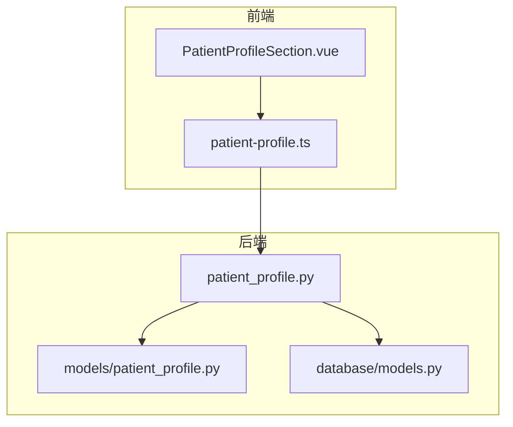
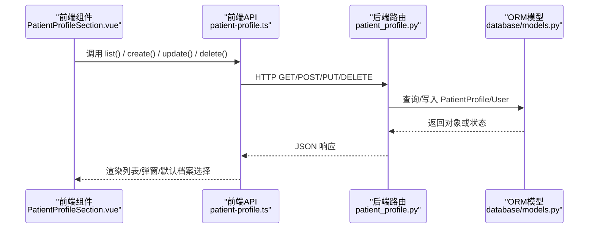
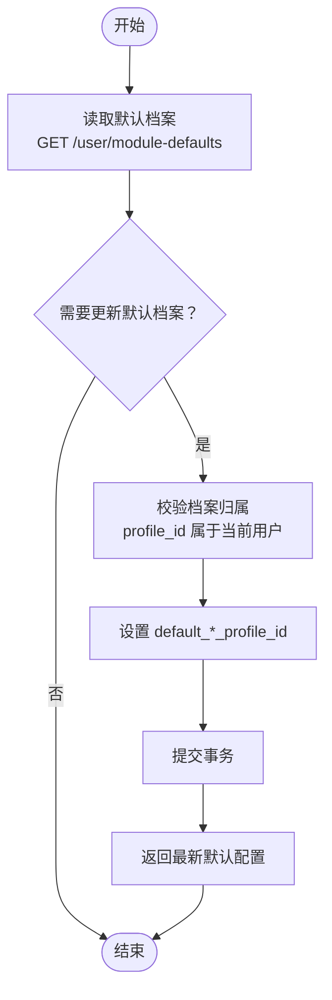
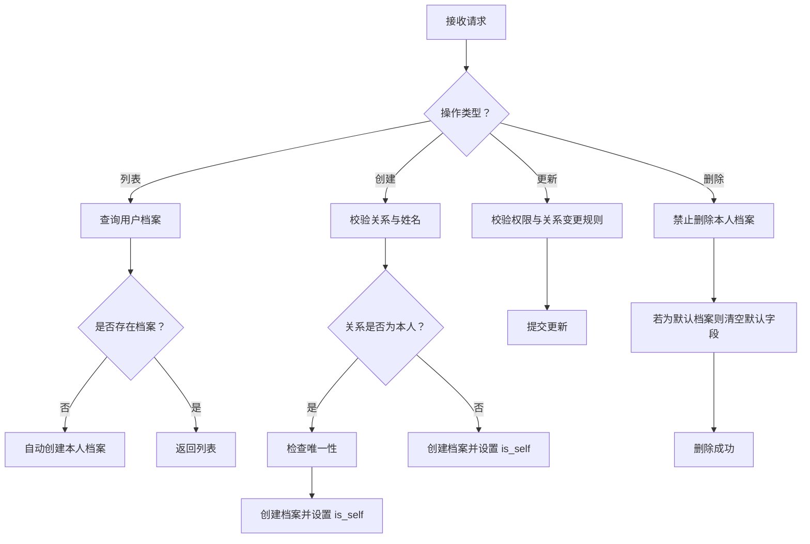
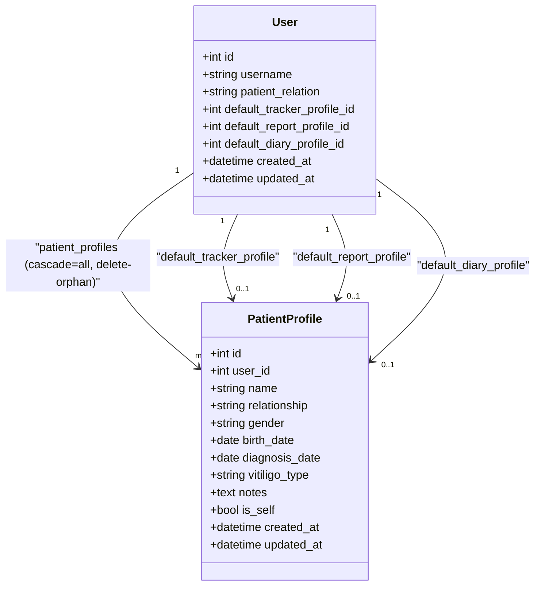
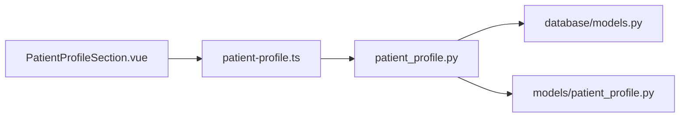

# 患者档案模型

<cite>
**本文引用的文件**   
- [web/backend/database/models.py](file://web/backend/database/models.py)
- [web/backend/models/patient_profile.py](file://web/backend/models/patient_profile.py)
- [web/backend/api/patient_profile.py](file://web/backend/api/patient_profile.py)
- [web/app/src/api/patient-profile.ts](file://web/app/src/api/patient-profile.ts)
- [web/app/src/components/profile/PatientProfileSection.vue](file://web/app/src/components/profile/PatientProfileSection.vue)
- [web/backend/api/user.py](file://web/backend/api/user.py)
</cite>

## 目录
1. [引言](#引言)
2. [项目结构](#项目结构)
3. [核心组件](#核心组件)
4. [架构总览](#架构总览)
5. [详细组件分析](#详细组件分析)
6. [依赖关系分析](#依赖关系分析)
7. [性能考虑](#性能考虑)
8. [故障排查指南](#故障排查指南)
9. [结论](#结论)
10. [附录](#附录)

## 引言
本文件为 Subskin 患者档案系统的数据模型文档，聚焦 PatientProfile 患者档案模型的设计与实现。内容涵盖：
- 医疗相关字段设计（姓名、性别、出生日期、诊断日期、白癜风类型等）
- 与 User 用户的关联关系及多患者档案管理
- 默认患者档案设置（default_tracker_profile_id、default_report_profile_id、default_diary_profile_id）的业务逻辑
- 患者关系类型（本人、父母、孩子、伴侣、朋友、其他）的定义与使用场景
- ORM 关系映射与级联删除策略，以及数据完整性保证

## 项目结构
围绕患者档案的核心代码分布在后端 API、ORM 模型、Pydantic 校验模型以及前端 API 与组件中：
- 数据库 ORM 模型定义在 models.py，包含 User 与 PatientProfile 的表结构与关系
- Pydantic 模型用于请求/响应校验与序列化
- FastAPI 路由提供 CRUD 接口与默认模块配置接口
- 前端通过 TypeScript API 封装调用，并在 Vue 组件中完成用户交互与默认档案选择

图表来源
- [web/app/src/api/patient-profile.ts](file://web/app/src/api/patient-profile.ts)
- [web/app/src/components/profile/PatientProfileSection.vue](file://web/app/src/components/profile/PatientProfileSection.vue)
- [web/backend/api/patient_profile.py](file://web/backend/api/patient_profile.py)
- [web/backend/models/patient_profile.py](file://web/backend/models/patient_profile.py)
- [web/backend/database/models.py](file://web/backend/database/models.py)

章节来源
- [web/backend/database/models.py:88-201](file://web/backend/database/models.py#L88-L201)
- [web/backend/models/patient_profile.py:7-47](file://web/backend/models/patient_profile.py#L7-L47)
- [web/backend/api/patient_profile.py:1-297](file://web/backend/api/patient_profile.py#L1-L297)
- [web/app/src/api/patient-profile.ts:1-52](file://web/app/src/api/patient-profile.ts#L1-L52)
- [web/app/src/components/profile/PatientProfileSection.vue:1-337](file://web/app/src/components/profile/PatientProfileSection.vue#L1-L337)

## 核心组件
- 数据库 ORM 模型
  - User：用户主表，包含 patient_relation（用户与白友的关系）与三个默认患者档案外键
  - PatientProfile：患者档案表，包含医疗相关字段与 is_self 标识
- Pydantic 模型
  - PatientProfileCreate/Update/Response：创建、更新、响应的结构化校验与序列化
  - ModuleDefaults：模块默认档案配置（测评、体检解读、日记）
- API 路由
  - 列表、创建、更新、删除患者档案
  - 获取与更新用户模块默认档案
  - 自动创建“本人”档案与唯一性约束
- 前端
  - TypeScript API 封装与类型定义
  - Vue 组件负责表单输入、默认档案选择与保存

章节来源
- [web/backend/database/models.py:88-201](file://web/backend/database/models.py#L88-L201)
- [web/backend/models/patient_profile.py:7-47](file://web/backend/models/patient_profile.py#L7-L47)
- [web/backend/api/patient_profile.py:102-297](file://web/backend/api/patient_profile.py#L102-L297)
- [web/app/src/api/patient-profile.ts:1-52](file://web/app/src/api/patient-profile.ts#L1-L52)
- [web/app/src/components/profile/PatientProfileSection.vue:152-214](file://web/app/src/components/profile/PatientProfileSection.vue#L152-L214)

## 架构总览
下图展示从前端到后端的完整调用链，包括默认档案配置与患者档案管理的核心流程。

图表来源
- [web/app/src/components/profile/PatientProfileSection.vue:103-154](file://web/app/src/components/profile/PatientProfileSection.vue#L103-L154)
- [web/app/src/api/patient-profile.ts:22-51](file://web/app/src/api/patient-profile.ts#L22-L51)
- [web/backend/api/patient_profile.py:102-297](file://web/backend/api/patient_profile.py#L102-L297)
- [web/backend/database/models.py:138-201](file://web/backend/database/models.py#L138-L201)

## 详细组件分析

### 数据模型与字段设计
- PatientProfile（患者档案）
  - 字段：id、user_id、name、relationship、gender、birth_date、diagnosis_date、vitiligo_type、notes、is_self、created_at、updated_at
  - 业务含义：
    - name：患者姓名（必填）
    - relationship：与白友关系（必填，枚举值由 API 层校验）
    - gender：性别（可选）
    - birth_date：出生日期（可选）
    - diagnosis_date：确诊日期（可选）
    - vitiligo_type：白癜风类型（可选）
    - notes：备注（可选）
    - is_self：是否本人档案（布尔，辅助判断）
- User（用户）
  - 字段：基础信息 + patient_relation（用户与白友的关系）+ 三个默认档案外键
  - 默认档案外键：
    - default_tracker_profile_id：测评默认档案
    - default_report_profile_id：体检解读默认档案
    - default_diary_profile_id：日记默认档案

章节来源
- [web/backend/database/models.py:182-201](file://web/backend/database/models.py#L182-L201)
- [web/backend/database/models.py:115-127](file://web/backend/database/models.py#L115-L127)

### 关系类型与使用场景
- 患者关系类型（档案层面）：本人、父母、孩子、伴侣、朋友、其他
  - 由 ALLOWED_RELATIONSHIPS 在白名单校验，确保一致性
  - 本人档案具有特殊语义：is_self=True，且每个用户仅允许一个本人档案
- 用户关系类型（用户层面）：本人、父母、孩子、伴侣、朋友、医护人员、其他、患者父母、患者伴侣、患者朋友
  - 由 user.py 中的 allowed 集合校验，用于用户个人关系描述

章节来源
- [web/backend/api/patient_profile.py:18-35](file://web/backend/api/patient_profile.py#L18-L35)
- [web/backend/api/user.py:297-318](file://web/backend/api/user.py#L297-L318)
- [web/app/src/components/profile/PatientProfileSection.vue:241-255](file://web/app/src/components/profile/PatientProfileSection.vue#L241-L255)

### 默认患者档案设置（ModuleDefaults）
- 读取默认档案：GET /user/module-defaults
  - 返回 tracker_profile_id、report_profile_id、diary_profile_id
- 更新默认档案：PUT /user/module-defaults
  - 校验请求的 profile_id 必须属于当前用户
  - 更新成功后刷新并返回最新默认配置
- 删除默认档案引用：当删除被设为默认的档案时，对应字段会被清空

图表来源
- [web/backend/api/patient_profile.py:254-297](file://web/backend/api/patient_profile.py#L254-L297)
- [web/backend/models/patient_profile.py:43-47](file://web/backend/models/patient_profile.py#L43-L47)

章节来源
- [web/backend/api/patient_profile.py:254-297](file://web/backend/api/patient_profile.py#L254-L297)
- [web/backend/models/patient_profile.py:43-47](file://web/backend/models/patient_profile.py#L43-L47)

### 患者档案 CRUD 与业务规则
- 列表：GET /patient-profiles/
  - 若用户无档案，自动创建一个“本人”档案（名称为用户名，relationship=本人，is_self=True）
- 创建：POST /patient-profiles/
  - 校验 relationship 白名单；若为“本人”，确保唯一性
  - 根据 relationship 设置 is_self
- 更新：PUT /patient-profiles/{profile_id}
  - 禁止将“本人”档案修改为非本人关系
  - 若改为“本人”，需再次校验唯一性（排除自身）
- 删除：DELETE /patient-profiles/{profile_id}
  - 禁止删除“本人”档案
  - 若该档案被设为默认，则相应默认字段置空

图表来源
- [web/backend/api/patient_profile.py:102-252](file://web/backend/api/patient_profile.py#L102-L252)

章节来源
- [web/backend/api/patient_profile.py:102-252](file://web/backend/api/patient_profile.py#L102-L252)

### ORM 关系映射与级联删除
- User.patient_profiles：一对多关系，cascade="all, delete-orphan"
  - 删除用户时，其所有患者档案将被级联删除
- User.default_*_profile：三处单向外键指向 PatientProfile，使用 post_update=True 避免插入顺序问题
- PatientProfile.user：反向关系 back_populates="patient_profiles"

图表来源
- [web/backend/database/models.py:138-154](file://web/backend/database/models.py#L138-L154)
- [web/backend/database/models.py:182-201](file://web/backend/database/models.py#L182-L201)

章节来源
- [web/backend/database/models.py:138-154](file://web/backend/database/models.py#L138-L154)
- [web/backend/database/models.py:182-201](file://web/backend/database/models.py#L182-L201)

### 前端交互与默认档案选择
- TypeScript API 封装了 list/create/update/delete/getModuleDefaults/setModuleDefaults
- Vue 组件提供：
  - 档案列表展示与编辑弹窗
  - 默认档案下拉选择（测评、体检解读、日记）
  - 实时保存默认配置并触发刷新

章节来源
- [web/app/src/api/patient-profile.ts:22-51](file://web/app/src/api/patient-profile.ts#L22-L51)
- [web/app/src/components/profile/PatientProfileSection.vue:152-214](file://web/app/src/components/profile/PatientProfileSection.vue#L152-L214)

## 依赖关系分析
- 前端依赖
  - PatientProfileSection.vue 依赖 patient-profile.ts 提供的 API
  - patient-profile.ts 依赖 apiClient（统一 HTTP 客户端）
- 后端依赖
  - patient_profile.py 依赖 database/models.py（ORM）、models/patient_profile.py（Pydantic）
  - 认证依赖 services/auth.get_current_user
- 数据完整性
  - 外键约束保证 user_id 与 profile_id 的有效性
  - 业务层校验确保关系类型与唯一性

图表来源
- [web/app/src/components/profile/PatientProfileSection.vue:1-337](file://web/app/src/components/profile/PatientProfileSection.vue#L1-L337)
- [web/app/src/api/patient-profile.ts:1-52](file://web/app/src/api/patient-profile.ts#L1-L52)
- [web/backend/api/patient_profile.py:1-297](file://web/backend/api/patient_profile.py#L1-L297)
- [web/backend/database/models.py:138-201](file://web/backend/database/models.py#L138-L201)
- [web/backend/models/patient_profile.py:7-47](file://web/backend/models/patient_profile.py#L7-L47)

章节来源
- [web/backend/api/patient_profile.py:1-297](file://web/backend/api/patient_profile.py#L1-L297)
- [web/backend/database/models.py:138-201](file://web/backend/database/models.py#L138-L201)
- [web/backend/models/patient_profile.py:7-47](file://web/backend/models/patient_profile.py#L7-L47)
- [web/app/src/api/patient-profile.ts:1-52](file://web/app/src/api/patient-profile.ts#L1-L52)
- [web/app/src/components/profile/PatientProfileSection.vue:1-337](file://web/app/src/components/profile/PatientProfileSection.vue#L1-L337)

## 性能考虑
- 列表接口按 created_at 与 id 排序，适合分页扩展
- 默认档案配置更新采用单条事务提交，减少锁竞争
- 建议对常用查询添加索引（如 user_id、relationship、is_self），以提升检索效率

[本节为通用指导，不直接分析具体文件]

## 故障排查指南
- 常见错误
  - relationship 不在白名单：检查传入值是否符合“本人/父母/孩子/伴侣/朋友/其他”
  - 重复本人档案：确保同一用户仅有一个本人档案
  - 删除本人档案：禁止删除，需先转移默认引用再删除非本人档案
  - 默认档案不属于当前用户：更新前需校验 ownership
- 定位方法
  - 查看 API 返回 detail 字段
  - 检查数据库外键与业务层校验逻辑

章节来源
- [web/backend/api/patient_profile.py:28-62](file://web/backend/api/patient_profile.py#L28-L62)
- [web/backend/api/patient_profile.py:214-252](file://web/backend/api/patient_profile.py#L214-L252)
- [web/backend/api/patient_profile.py:266-289](file://web/backend/api/patient_profile.py#L266-L289)

## 结论
Subskin 的患者档案模型以清晰的 ORM 设计与严格的 API 层校验，实现了多患者档案管理与默认模块配置。通过 cascade 删除与外键约束保障数据完整性，结合前端友好的交互体验，满足临床与日常跟踪需求。建议在后续迭代中完善索引与分页，提升大规模数据下的性能表现。

[本节为总结，不直接分析具体文件]

## 附录
- 字段字典
  - PatientProfile：id、user_id、name、relationship、gender、birth_date、diagnosis_date、vitiligo_type、notes、is_self、created_at、updated_at
  - User：基础字段 + patient_relation + default_tracker_profile_id + default_report_profile_id + default_diary_profile_id
- 关系类型
  - 档案层面：本人、父母、孩子、伴侣、朋友、其他
  - 用户层面：本人、父母、孩子、伴侣、朋友、医护人员、其他、患者父母、患者伴侣、患者朋友

章节来源
- [web/backend/database/models.py:115-127](file://web/backend/database/models.py#L115-L127)
- [web/backend/database/models.py:182-201](file://web/backend/database/models.py#L182-L201)
- [web/backend/api/user.py:297-318](file://web/backend/api/user.py#L297-L318)
- [web/backend/api/patient_profile.py:18-35](file://web/backend/api/patient_profile.py#L18-L35)