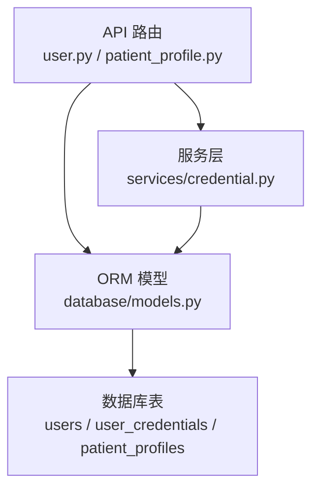
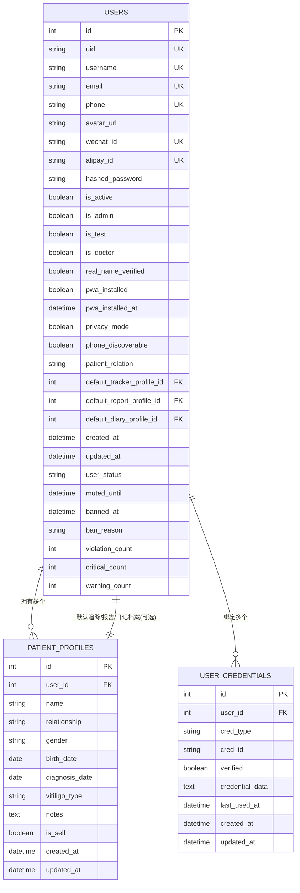
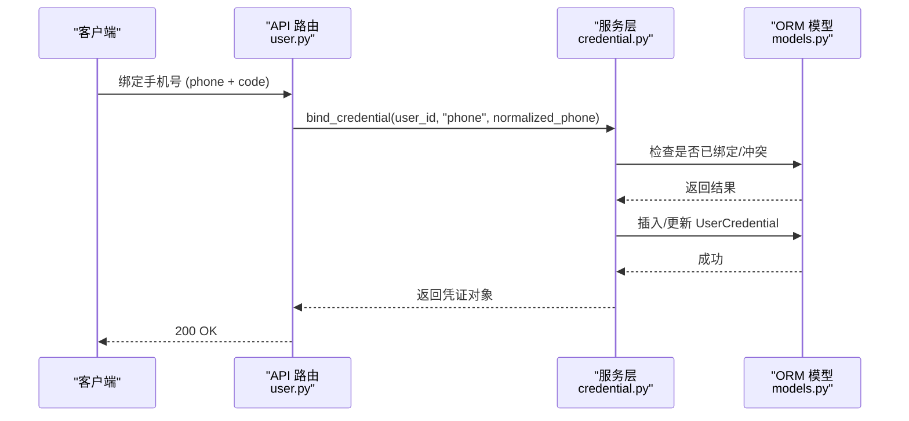
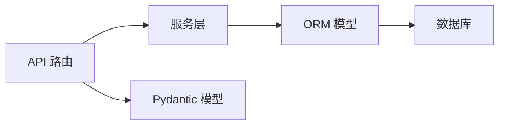

# 核心数据模型

<cite>
**本文引用的文件**
- [web/backend/database/models.py](file://web/backend/database/models.py)
- [web/backend/models/user.py](file://web/backend/models/user.py)
- [web/backend/models/patient_profile.py](file://web/backend/models/patient_profile.py)
- [web/backend/services/credential.py](file://web/backend/services/credential.py)
- [web/backend/api/user.py](file://web/backend/api/user.py)
- [web/backend/api/patient_profile.py](file://web/backend/api/patient_profile.py)
</cite>

## 目录
1. [简介](#简介)
2. [项目结构](#项目结构)
3. [核心组件](#核心组件)
4. [架构总览](#架构总览)
5. [详细组件分析](#详细组件分析)
6. [依赖关系分析](#依赖关系分析)
7. [性能与索引](#性能与索引)
8. [故障排查指南](#故障排查指南)
9. [结论](#结论)
10. [附录：SQLAlchemy ORM 示例](#附录sqlalchemy-orm-示例)

## 简介
本技术文档聚焦 Subskin 后端的核心数据模型，围绕用户体系（User）、患者档案（PatientProfile）与登录凭证（UserCredential）展开。内容涵盖字段定义、数据类型选择、约束条件与业务规则；实体关系映射（一对一、一对多、多对多）的实现方式；以及数据验证与完整性约束的设计考量。同时提供基于 SQLAlchemy ORM 的建模思路与代码片段路径，便于读者快速定位实现细节。

## 项目结构
- 数据库 ORM 模型集中定义在 web/backend/database/models.py，包含 User、UserCredential、PatientProfile 等核心表及关联关系。
- Pydantic 请求/响应模型位于 web/backend/models/user.py 与 web/backend/models/patient_profile.py，用于 API 层输入校验与输出序列化。
- 业务服务封装了凭证绑定、查找、解绑、验证等逻辑，位于 web/backend/services/credential.py。
- API 路由在 web/backend/api/user.py 与 web/backend/api/patient_profile.py 中调用上述模型与服务，完成认证、资料更新、患者档案管理等流程。

图表来源
- [web/backend/api/user.py:1-200](file://web/backend/api/user.py#L1-L200)
- [web/backend/api/patient_profile.py:1-200](file://web/backend/api/patient_profile.py#L1-L200)
- [web/backend/database/models.py:88-200](file://web/backend/database/models.py#L88-L200)
- [web/backend/services/credential.py:37-151](file://web/backend/services/credential.py#L37-L151)

章节来源
- [web/backend/database/models.py:88-200](file://web/backend/database/models.py#L88-L200)
- [web/backend/models/user.py:10-138](file://web/backend/models/user.py#L10-L138)
- [web/backend/models/patient_profile.py:7-46](file://web/backend/models/patient_profile.py#L7-L46)
- [web/backend/services/credential.py:37-151](file://web/backend/services/credential.py#L37-L151)
- [web/backend/api/user.py:1-200](file://web/backend/api/user.py#L1-L200)
- [web/backend/api/patient_profile.py:1-200](file://web/backend/api/patient_profile.py#L1-L200)

## 核心组件
- 用户模型（User）：承载账号基础信息、权限标识、隐私控制、默认患者档案引用、行为状态等。
- 患者档案（PatientProfile）：记录患者基本信息、诊断时间、分型、备注等，支持“本人”唯一性约束与模块默认档案设置。
- 用户凭证（UserCredential）：统一存储多种登录凭证（手机号、邮箱、微信、支付宝、密码），支持唯一性与级联删除。

章节来源
- [web/backend/database/models.py:88-200](file://web/backend/database/models.py#L88-L200)

## 架构总览
下图展示核心实体之间的关系：用户与患者档案为一对多；用户与凭证为一对多；用户通过外键指向默认患者档案（一对一）。

图表来源
- [web/backend/database/models.py:88-200](file://web/backend/database/models.py#L88-L200)

## 详细组件分析

### 用户模型（User）
- 字段要点
  - 身份与联系：username、email、phone、wechat_id、alipay_id 均具备唯一性约束，避免重复注册与冲突。
  - 安全与权限：hashed_password（社交登录可无）、is_admin、is_doctor、real_name_verified、is_test。
  - 隐私与可见性：privacy_mode、phone_discoverable 控制用户可见范围。
  - 默认患者档案：default_tracker_profile_id、default_report_profile_id、default_diary_profile_id 分别指向 PatientProfile，表示各模块默认使用的档案。
  - 行为状态：user_status、muted_until、banned_at、ban_reason、violation_count、critical_count、warning_count。
  - 时间戳：created_at、updated_at。
- 关系映射
  - 一对多：comments、patient_profiles（级联删除孤儿）。
  - 一对一（可选）：default_tracker_profile、default_report_profile、default_diary_profile（post_update=True 以避免循环写入问题）。
- 业务规则
  - 用户名、邮箱、手机号、第三方ID全局唯一。
  - 默认患者档案需存在且属于当前用户（由 API 层校验）。
  - 隐私模式影响手机号发现能力。

章节来源
- [web/backend/database/models.py:88-154](file://web/backend/database/models.py#L88-L154)
- [web/backend/api/patient_profile.py:260-296](file://web/backend/api/patient_profile.py#L260-L296)

### 患者档案（PatientProfile）
- 字段要点
  - 基本信息：name、relationship（允许值在 API 层校验）、gender、birth_date、diagnosis_date、vitiligo_type、notes。
  - 标记：is_self 表示是否为“本人”档案。
  - 时间戳：created_at、updated_at。
- 关系映射
  - 多对一：user_id 指向 User。
  - 被引用：作为 User 的默认档案（一对一可选）。
- 业务规则
  - “本人”档案唯一性：每个用户最多一个 relationship="本人" 的档案。
  - 本人档案不可删除。
  - 创建时自动为首次用户生成“本人”档案（若不存在）。
  - 更新时禁止将“本人”档案修改为非“本人”。

章节来源
- [web/backend/database/models.py:182-200](file://web/backend/database/models.py#L182-L200)
- [web/backend/api/patient_profile.py:28-62](file://web/backend/api/patient_profile.py#L28-L62)
- [web/backend/api/patient_profile.py:118-142](file://web/backend/api/patient_profile.py#L118-L142)
- [web/backend/api/patient_profile.py:145-211](file://web/backend/api/patient_profile.py#L145-L211)
- [web/backend/api/patient_profile.py:214-230](file://web/backend/api/patient_profile.py#L214-L230)

### 用户凭证（UserCredential）
- 字段要点
  - 凭证类型与标识：cred_type（phone/email/wechat/alipay/password）、cred_id（标准化后的唯一值）。
  - 验证状态：verified。
  - 附加数据：credential_data（如密码哈希 JSON）。
  - 使用痕迹：last_used_at。
  - 时间戳：created_at、updated_at。
- 关系映射
  - 多对一：user_id 指向 User，删除用户时级联删除凭证（ondelete="CASCADE"）。
  - 唯一约束：(cred_type, cred_id) 组合唯一，防止重复绑定。
  - 索引：按 user_id、cred_type+cred_id 建立索引以加速查询。
- 业务规则
  - 同一用户不允许重复绑定相同类型的凭证。
  - 同一凭证（如手机号）不能绑定到不同用户。
  - 解绑时需保证至少保留一个凭证。
  - 密码凭证采用 JSON 存储哈希，避免明文。

章节来源
- [web/backend/database/models.py:156-180](file://web/backend/database/models.py#L156-L180)
- [web/backend/services/credential.py:13-24](file://web/backend/services/credential.py#L13-L24)
- [web/backend/services/credential.py:37-102](file://web/backend/services/credential.py#L37-L102)
- [web/backend/services/credential.py:105-151](file://web/backend/services/credential.py#L105-L151)
- [web/backend/api/user.py:135-174](file://web/backend/api/user.py#L135-L174)

### 实体关系与数据流
- 用户与患者档案：一对多（User.patient_profiles），并支持三个可选的一对一默认档案引用。
- 用户与凭证：一对多（User.credentials），支持多种登录方式与统一验证流程。
- 数据流示例（绑定手机号）：

图表来源
- [web/backend/api/user.py:135-174](file://web/backend/api/user.py#L135-L174)
- [web/backend/services/credential.py:63-102](file://web/backend/services/credential.py#L63-L102)
- [web/backend/database/models.py:156-180](file://web/backend/database/models.py#L156-L180)

## 依赖关系分析
- 耦合度
  - API 层依赖 Pydantic 模型进行输入校验，再调用服务层与 ORM 模型。
  - 服务层封装复杂业务规则（如凭证唯一性、解绑保护），降低 API 复杂度。
  - ORM 模型负责持久化与关系映射，保持高内聚。
- 直接/间接依赖
  - API -> 服务 -> ORM -> 数据库。
  - 模型间通过外键与 relationship 建立强一致性约束。
- 外部集成点
  - 短信验证码、邮箱验证码、OAuth（微信/支付宝）通过 UserCredential 统一管理。
  - 审计日志、通知、社区等功能通过其他模型扩展，但核心用户体系保持稳定。

图表来源
- [web/backend/api/user.py:1-200](file://web/backend/api/user.py#L1-L200)
- [web/backend/services/credential.py:37-151](file://web/backend/services/credential.py#L37-L151)
- [web/backend/database/models.py:88-200](file://web/backend/database/models.py#L88-L200)
- [web/backend/models/user.py:10-138](file://web/backend/models/user.py#L10-L138)

章节来源
- [web/backend/api/user.py:1-200](file://web/backend/api/user.py#L1-L200)
- [web/backend/services/credential.py:37-151](file://web/backend/services/credential.py#L37-L151)
- [web/backend/database/models.py:88-200](file://web/backend/database/models.py#L88-L200)
- [web/backend/models/user.py:10-138](file://web/backend/models/user.py#L10-L138)

## 性能与索引
- 索引设计
  - users：id、uid、username、email、phone、wechat_id、alipay_id、user_status 等常用查询字段均有索引或唯一约束。
  - user_credentials：idx_cred_user（user_id）、idx_cred_lookup（cred_type, cred_id）提升凭证查找效率。
  - patient_profiles：user_id 索引加速按用户查询档案列表。
- 查询优化建议
  - 批量获取用户档案时使用 order_by(created_at, id) 稳定排序。
  - 凭证查找优先使用 (cred_type, cred_id) 联合索引。
- 写操作注意
  - 默认档案设置涉及 post_update=True，避免循环写入导致的死锁风险。
  - 级联删除需谨慎，确保业务层先处理依赖数据（如评论、日志）。

章节来源
- [web/backend/database/models.py:88-200](file://web/backend/database/models.py#L88-L200)

## 故障排查指南
- 凭证冲突
  - 现象：绑定手机号/邮箱时报错“已绑定其他账号”或“您已绑定该凭证”。
  - 排查：检查 user_credentials 表中是否存在相同 cred_type+cred_id；确认 normalize 逻辑（邮箱小写、去空格）。
  - 参考路径：[web/backend/services/credential.py:63-102](file://web/backend/services/credential.py#L63-L102)
- 本人档案限制
  - 现象：尝试删除或修改“本人”档案失败。
  - 排查：确认 relationship 是否为“本人”，is_self 是否为 True；API 层有明确保护。
  - 参考路径：[web/backend/api/patient_profile.py:145-211](file://web/backend/api/patient_profile.py#L145-L211), [web/backend/api/patient_profile.py:214-230](file://web/backend/api/patient_profile.py#L214-L230)
- 默认档案设置失败
  - 现象：设置默认档案时报错“必须属于当前用户”。
  - 排查：确认 requested_ids 中的档案归属；API 层会校验 ownership。
  - 参考路径：[web/backend/api/patient_profile.py:260-296](file://web/backend/api/patient_profile.py#L260-L296)
- 登录同步字段缺失
  - 现象：登录后用户信息缺少 phone/email/wechat/alipay。
  - 排查：检查 _sync_legacy_user_fields 是否执行；确认 credentials 表数据正确。
  - 参考路径：[web/backend/api/user.py:135-174](file://web/backend/api/user.py#L135-L174)

章节来源
- [web/backend/services/credential.py:63-102](file://web/backend/services/credential.py#L63-L102)
- [web/backend/api/patient_profile.py:145-230](file://web/backend/api/patient_profile.py#L145-L230)
- [web/backend/api/patient_profile.py:260-296](file://web/backend/api/patient_profile.py#L260-L296)
- [web/backend/api/user.py:135-174](file://web/backend/api/user.py#L135-L174)

## 结论
Subskin 的核心数据模型以 User、PatientProfile、UserCredential 为中心，采用清晰的 ORM 关系映射与严格的约束设计，支撑多登录方式、隐私控制、患者档案管理等功能。通过服务层封装业务规则，API 层专注请求处理，整体架构内聚且可扩展。建议在后续迭代中继续强化索引策略、完善异常处理与审计追踪，以提升系统稳定性与可维护性。

## 附录：SQLAlchemy ORM 示例
以下为关键模型的 SQLAlchemy 定义路径与说明，便于快速定位实现细节：
- 用户模型（User）
  - 定义位置：[web/backend/database/models.py:88-154](file://web/backend/database/models.py#L88-L154)
  - 关键点：唯一约束、外键关系、级联删除、默认档案引用。
- 患者档案（PatientProfile）
  - 定义位置：[web/backend/database/models.py:182-200](file://web/backend/database/models.py#L182-L200)
  - 关键点：用户关联、字段校验、业务规则（本人唯一性）。
- 用户凭证（UserCredential）
  - 定义位置：[web/backend/database/models.py:156-180](file://web/backend/database/models.py#L156-L180)
  - 关键点：唯一约束、索引、级联删除、JSON 数据存储。
- 服务层凭证管理
  - 定义位置：[web/backend/services/credential.py:37-151](file://web/backend/services/credential.py#L37-L151)
  - 关键点：绑定、解绑、验证、冲突检测。
- API 层患者档案操作
  - 定义位置：[web/backend/api/patient_profile.py:102-211](file://web/backend/api/patient_profile.py#L102-L211)
  - 关键点：创建、更新、删除、默认档案设置。
- API 层用户认证与凭证同步
  - 定义位置：[web/backend/api/user.py:89-174](file://web/backend/api/user.py#L89-L174)
  - 关键点：登录响应、字段同步、密码凭证 upsert。

章节来源
- [web/backend/database/models.py:88-200](file://web/backend/database/models.py#L88-L200)
- [web/backend/services/credential.py:37-151](file://web/backend/services/credential.py#L37-L151)
- [web/backend/api/patient_profile.py:102-211](file://web/backend/api/patient_profile.py#L102-L211)
- [web/backend/api/user.py:89-174](file://web/backend/api/user.py#L89-L174)