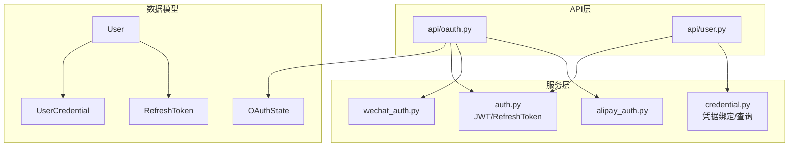
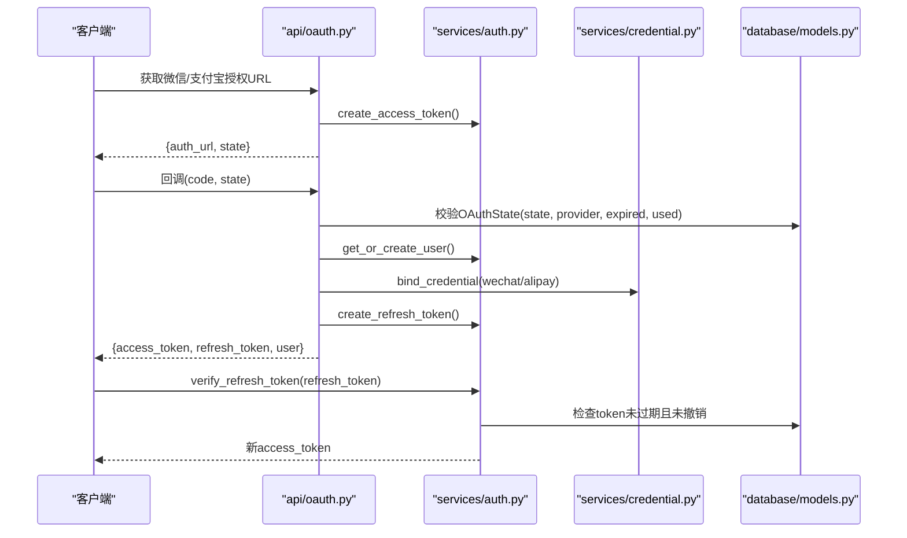
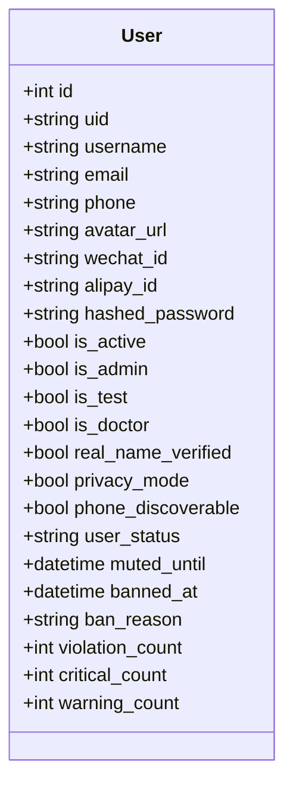
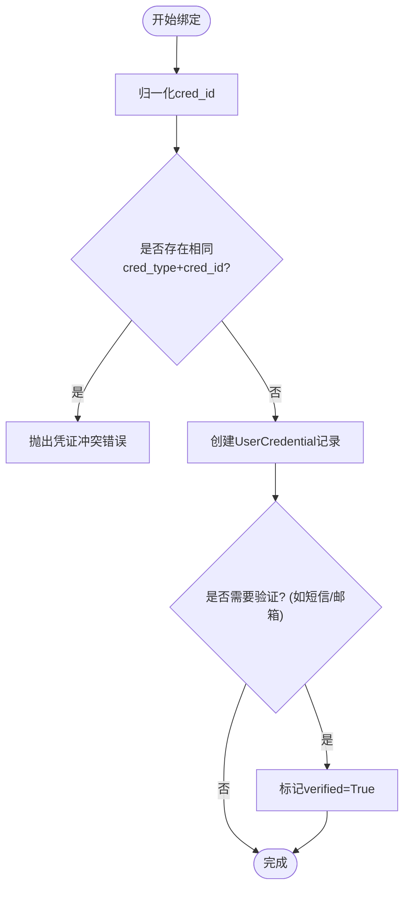
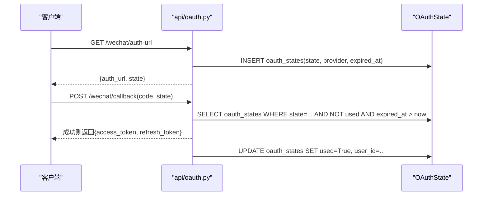
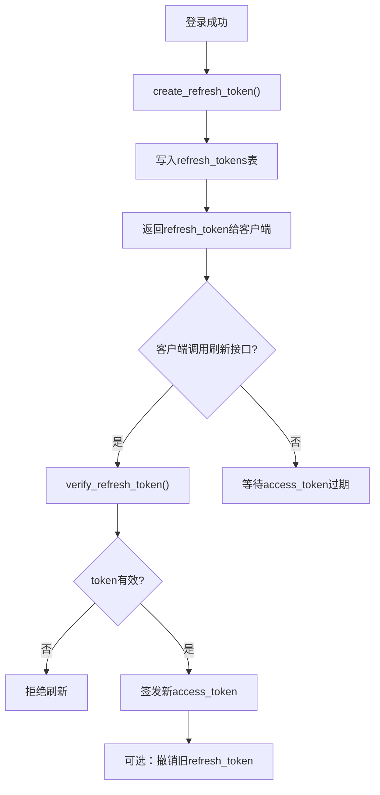
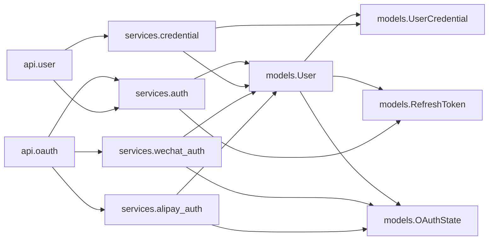

# 用户认证模型

<cite>
**本文引用的文件**   
- [web/backend/database/models.py](file://web/backend/database/models.py)
- [web/backend/models/user.py](file://web/backend/models/user.py)
- [web/backend/services/auth.py](file://web/backend/services/auth.py)
- [web/backend/services/credential.py](file://web/backend/services/credential.py)
- [web/backend/api/oauth.py](file://web/backend/api/oauth.py)
- [web/backend/services/wechat_auth.py](file://web/backend/services/wechat_auth.py)
- [web/backend/services/alipay_auth.py](file://web/backend/services/alipay_auth.py)
- [web/backend/database/migration_auth_v2.py](file://web/backend/database/migration_auth_v2.py)
</cite>

## 目录
1. [简介](#简介)
2. [项目结构](#项目结构)
3. [核心组件](#核心组件)
4. [架构总览](#架构总览)
5. [详细组件分析](#详细组件分析)
6. [依赖关系分析](#依赖关系分析)
7. [性能与索引优化](#性能与索引优化)
8. [故障排查指南](#故障排查指南)
9. [结论](#结论)

## 简介
本文件面向Subskin后端用户认证系统的数据模型，聚焦以下目标：
- 深入解析User用户模型的核心字段设计（uid、用户名、邮箱、手机号等）
- 详解UserCredential用户凭证模型，支持密码、微信、支付宝等多登录方式
- 解释OAuthState OAuth状态参数的CSRF防护机制
- 阐述RefreshToken刷新令牌的生命周期管理与安全策略
- 说明用户状态管理字段（is_active、is_admin、user_status等）的业务含义与使用场景
- 提供SQLAlchemy ORM示例（外键关系、索引、约束）的参考路径

## 项目结构
认证相关数据模型集中在数据库ORM定义中，并通过服务层与API层协同工作：
- 数据模型：users、user_credentials、oauth_states、refresh_tokens 等表
- 服务层：JWT签发与校验、刷新令牌管理、凭据绑定与查找、第三方登录流程
- API层：统一的用户认证接口、第三方扫码登录回调与状态轮询

图表来源
- [web/backend/database/models.py:88-180](file://web/backend/database/models.py#L88-L180)
- [web/backend/services/auth.py:96-151](file://web/backend/services/auth.py#L96-L151)
- [web/backend/services/credential.py:37-102](file://web/backend/services/credential.py#L37-L102)
- [web/backend/api/oauth.py:25-36](file://web/backend/api/oauth.py#L25-L36)

章节来源
- [web/backend/database/models.py:88-180](file://web/backend/database/models.py#L88-L180)
- [web/backend/services/auth.py:96-151](file://web/backend/services/auth.py#L96-L151)
- [web/backend/services/credential.py:37-102](file://web/backend/services/credential.py#L37-L102)
- [web/backend/api/oauth.py:25-36](file://web/backend/api/oauth.py#L25-L36)

## 核心组件
本节对四个关键数据模型进行概览性说明，并给出它们在系统中的职责边界。

- User（用户主表）
  - 唯一标识：uid（全局唯一，用于跨平台或匿名追踪）
  - 基础信息：username、email、phone、avatar_url、wechat_id、alipay_id
  - 安全字段：hashed_password（社交登录可为空）
  - 状态控制：is_active、is_admin、is_test、is_doctor、real_name_verified
  - 隐私与可见性：privacy_mode、phone_discoverable
  - 行为与风控：user_status（normal/muted/banned）、muted_until、banned_at、ban_reason、violation_count/critical_count/warning_count
  - 关联：PatientProfile默认档案、评论、帖子等

- UserCredential（用户凭证）
  - 多登录方式：password、phone、email、wechat、alipay
  - 存储结构：cred_type + cred_id（规范化后唯一），verified标记，credential_data（如密码哈希）
  - 时间戳：last_used_at、created_at、updated_at

- OAuthState（OAuth状态参数）
  - 防CSRF：state唯一、provider区分、过期时间、used标记、关联user_id

- RefreshToken（刷新令牌）
  - 安全存储：token唯一、user_id外键、expired_at、revoked标记
  - 生命周期：创建、验证、撤销、清理

章节来源
- [web/backend/database/models.py:88-180](file://web/backend/database/models.py#L88-L180)
- [web/backend/database/models.py:61-86](file://web/backend/database/models.py#L61-L86)

## 架构总览
下图展示用户认证与第三方登录的整体交互流程，包括JWT访问令牌与刷新令牌的生成、校验与撤销，以及OAuth状态的CSRF防护。

图表来源
- [web/backend/api/oauth.py:25-36](file://web/backend/api/oauth.py#L25-L36)
- [web/backend/services/auth.py:96-151](file://web/backend/services/auth.py#L96-L151)
- [web/backend/services/credential.py:63-102](file://web/backend/services/credential.py#L63-L102)
- [web/backend/database/models.py:61-86](file://web/backend/database/models.py#L61-L86)

## 详细组件分析

### User 用户模型
- 字段设计要点
  - uid：全局唯一标识，便于跨端追踪与匿名化；在注册时通过工具函数生成
  - username/email/phone：登录与识别的关键字段，均具备唯一性与索引
  - wechat_id/alipay_id：第三方平台ID，用于快速匹配或自动注册
  - hashed_password：社交登录用户可为空，密码型登录需存在
  - is_active/is_admin：账号激活与管理员权限控制
  - user_status：业务状态机（normal/muted/banned），配合封禁时间与原因字段
  - privacy_mode/phone_discoverable：隐私模式与手机号可发现性控制

- 外键与关系
  - default_tracker_profile_id/default_report_profile_id/default_diary_profile_id：指向PatientProfile的默认档案
  - comments/posts等关系由其他模块引用

- 索引与约束
  - 关键字段（uid、username、email、phone、wechat_id、alipay_id）均设置唯一索引
  - user_status建立索引以支持风控查询

图表来源
- [web/backend/database/models.py:88-154](file://web/backend/database/models.py#L88-L154)

章节来源
- [web/backend/database/models.py:88-154](file://web/backend/database/models.py#L88-L154)

### UserCredential 用户凭证模型
- 设计目标
  - 统一存储多种登录凭证（password、phone、email、wechat、alipay）
  - 通过cred_type+cred_id组合保证唯一性，避免重复绑定
  - verified标记表示凭证是否已验证（如短信验证码通过后置为True）
  - credential_data用于存储敏感数据（如密码哈希），按类型序列化

- 绑定与查找逻辑
  - 归一化处理：email小写、password使用“password:{user_id}”作为cred_id
  - 冲突检测：同一cred_type+cred_id仅允许绑定到单一用户
  - 解绑保护：至少保留一个凭证，防止用户被锁死

- 索引与约束
  - UniqueConstraint("cred_type", "cred_id")确保唯一性
  - Index("idx_cred_user")加速按用户查询
  - Index("idx_cred_lookup")加速按凭证类型与值查找

图表来源
- [web/backend/services/credential.py:63-102](file://web/backend/services/credential.py#L63-L102)
- [web/backend/database/models.py:156-180](file://web/backend/database/models.py#L156-L180)

章节来源
- [web/backend/services/credential.py:37-102](file://web/backend/services/credential.py#L37-L102)
- [web/backend/database/models.py:156-180](file://web/backend/database/models.py#L156-L180)

### OAuthState OAuth状态参数模型（CSRF防护）
- 设计目标
  - 为第三方登录流程生成一次性state，防止CSRF攻击
  - 记录provider（wechat/alipay）、过期时间、used标记、关联user_id
  - 回调时校验state有效性（存在、未过期、未使用）

- 使用流程
  - 生成授权URL时创建state并入库
  - 回调时校验state，成功后标记used并关联user_id
  - 支持状态轮询接口返回登录结果

图表来源
- [web/backend/api/oauth.py:39-76](file://web/backend/api/oauth.py#L39-L76)
- [web/backend/database/models.py:61-74](file://web/backend/database/models.py#L61-L74)

章节来源
- [web/backend/api/oauth.py:39-76](file://web/backend/api/oauth.py#L39-L76)
- [web/backend/database/models.py:61-74](file://web/backend/database/models.py#L61-L74)

### RefreshToken 刷新令牌模型
- 设计目标
  - 安全存储刷新令牌，支持短期访问令牌失效后的续期
  - 支持撤销（单条或批量）与过期清理，防止数据库膨胀

- 生命周期
  - 创建：生成随机token，设置expired_at（普通用户7天，管理员更长）
  - 验证：检查token存在、未撤销、未过期
  - 撤销：单条撤销或按用户批量撤销
  - 清理：定时任务删除过期或已撤销的token

图表来源
- [web/backend/services/auth.py:96-151](file://web/backend/services/auth.py#L96-L151)
- [web/backend/database/models.py:75-86](file://web/backend/database/models.py#L75-L86)

章节来源
- [web/backend/services/auth.py:96-151](file://web/backend/services/auth.py#L96-L151)
- [web/backend/database/models.py:75-86](file://web/backend/database/models.py#L75-L86)

### 用户状态管理字段（is_active、is_admin、user_status等）
- is_active：账号激活状态，非激活用户无法登录或访问受保护资源
- is_admin：管理员权限，影响令牌过期策略（管理员令牌更长时间）
- user_status：业务状态机
  - normal：正常
  - muted：暂时静音（muted_until限制）
  - banned：封禁（banned_at、ban_reason记录）
- 风控计数：violation_count、critical_count、warning_count用于累积违规次数

使用场景
- 登录鉴权：get_current_user()会检查is_active与user_status
- 文件访问：verify_file_access_token()同样检查活跃与封禁状态
- 审计与风控：结合user_status与计数字段实现精细化管控

章节来源
- [web/backend/services/auth.py:179-221](file://web/backend/services/auth.py#L179-L221)
- [web/backend/services/auth.py:77-94](file://web/backend/services/auth.py#L77-L94)
- [web/backend/database/models.py:130-137](file://web/backend/database/models.py#L130-L137)

## 依赖关系分析
- 模型间依赖
  - UserCredential.user_id → users.id（级联删除）
  - RefreshToken.user_id → users.id
  - OAuthState.user_id → users.id（登录后关联）
- 服务层依赖
  - auth.py依赖models.py中的User与RefreshToken
  - credential.py依赖models.py中的User与UserCredential
  - wechat_auth.py/alipay_auth.py依赖models.py中的User与OAuthState，并通过credential.py绑定第三方凭证
- API层依赖
  - api/oauth.py协调第三方登录流程，调用auth.py与credential.py
  - api/user.py处理密码/短信/邮箱登录及刷新令牌

图表来源
- [web/backend/database/models.py:88-180](file://web/backend/database/models.py#L88-L180)
- [web/backend/services/auth.py:96-151](file://web/backend/services/auth.py#L96-L151)
- [web/backend/services/credential.py:37-102](file://web/backend/services/credential.py#L37-L102)
- [web/backend/services/wechat_auth.py:115-151](file://web/backend/services/wechat_auth.py#L115-L151)
- [web/backend/services/alipay_auth.py:149-189](file://web/backend/services/alipay_auth.py#L149-L189)
- [web/backend/api/oauth.py:25-36](file://web/backend/api/oauth.py#L25-L36)

章节来源
- [web/backend/database/models.py:88-180](file://web/backend/database/models.py#L88-L180)
- [web/backend/services/auth.py:96-151](file://web/backend/services/auth.py#L96-L151)
- [web/backend/services/credential.py:37-102](file://web/backend/services/credential.py#L37-L102)
- [web/backend/services/wechat_auth.py:115-151](file://web/backend/services/wechat_auth.py#L115-L151)
- [web/backend/services/alipay_auth.py:149-189](file://web/backend/services/alipay_auth.py#L149-L189)
- [web/backend/api/oauth.py:25-36](file://web/backend/api/oauth.py#L25-L36)

## 性能与索引优化
- 用户表索引
  - uid、username、email、phone、wechat_id、alipay_id均设置唯一索引，提升查找与去重性能
  - user_status建立索引，支持风控查询与统计
- 凭证表索引
  - idx_cred_user：按用户查询其所有凭证
  - idx_cred_lookup：按cred_type+cred_id快速定位凭证
- 刷新令牌表索引
  - token唯一索引，支持快速验证
  - user_id索引，支持批量撤销与清理
- 过期清理
  - 定时任务清理过期或已撤销的refresh_tokens，防止数据库膨胀

章节来源
- [web/backend/database/models.py:88-180](file://web/backend/database/models.py#L88-L180)
- [web/backend/database/models.py:75-86](file://web/backend/database/models.py#L75-L86)
- [web/backend/services/auth.py:285-309](file://web/backend/services/auth.py#L285-L309)

## 故障排查指南
- 登录失败
  - 检查User.hashed_password是否存在（密码登录必需）
  - 检查User.is_active与user_status（非激活或被封禁将拒绝登录）
- 第三方登录异常
  - 确认OAuthState.state有效（未过期、未使用）
  - 检查第三方配置（WECHAT_APP_ID、ALIPAY_APP_ID等环境变量）
- 刷新令牌问题
  - 检查refresh_tokens.token是否存在、未撤销、未过期
  - 使用revoke_all_user_tokens()清理用户所有活跃令牌
- 凭证冲突
  - 同一cred_type+cred_id只能绑定到一个用户，出现冲突需先解绑或更换凭证

章节来源
- [web/backend/services/auth.py:179-221](file://web/backend/services/auth.py#L179-L221)
- [web/backend/api/oauth.py:47-76](file://web/backend/api/oauth.py#L47-L76)
- [web/backend/services/credential.py:63-102](file://web/backend/services/credential.py#L63-L102)

## 结论
Subskin用户认证系统通过清晰的数据模型设计与服务层协作，实现了：
- 多登录方式支持（密码、短信、邮箱、微信、支付宝）
- 安全的JWT与刷新令牌机制
- 完善的CSRF防护（OAuthState）
- 灵活的用户状态管理与风控能力
- 合理的索引与约束优化，保障性能与一致性

建议在生产环境中：
- 定期清理过期refresh_tokens
- 监控第三方登录成功率与异常
- 根据业务需求调整令牌过期策略与用户状态流转