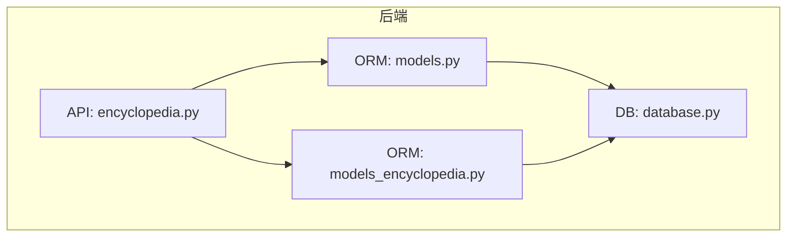
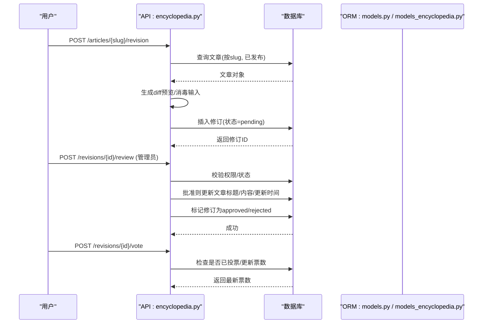
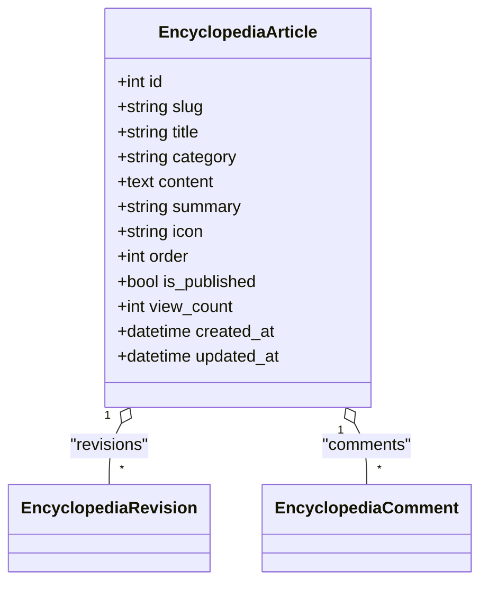
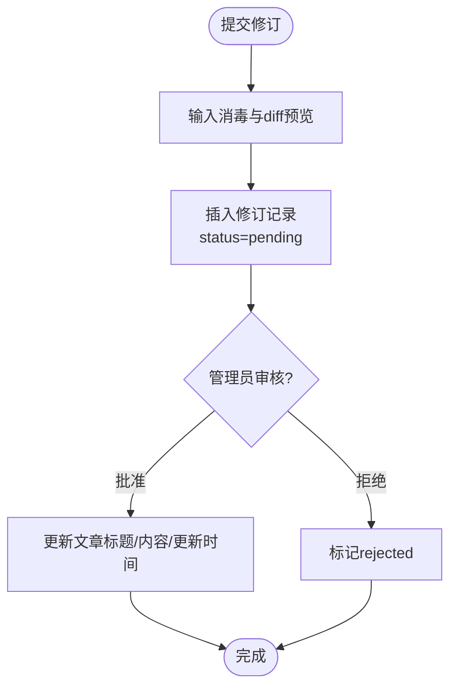
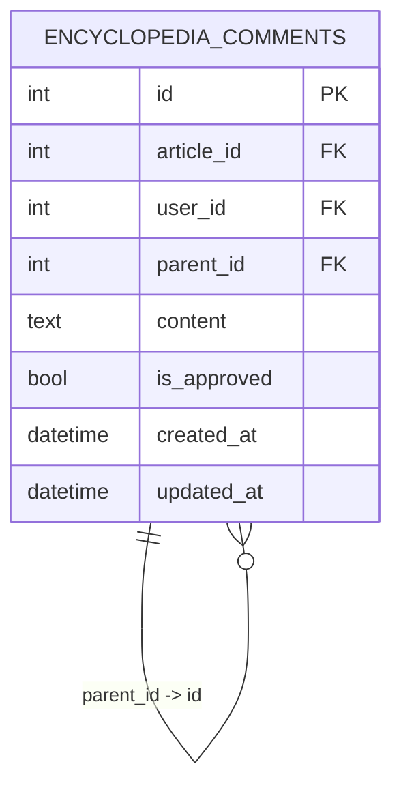
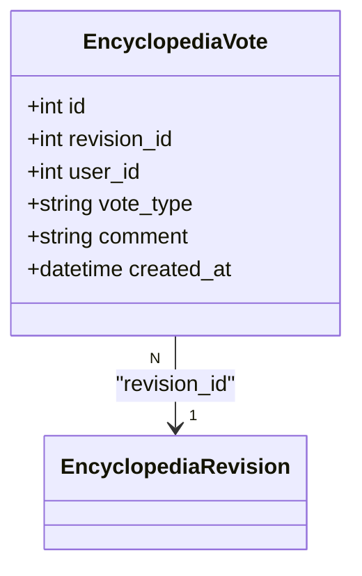
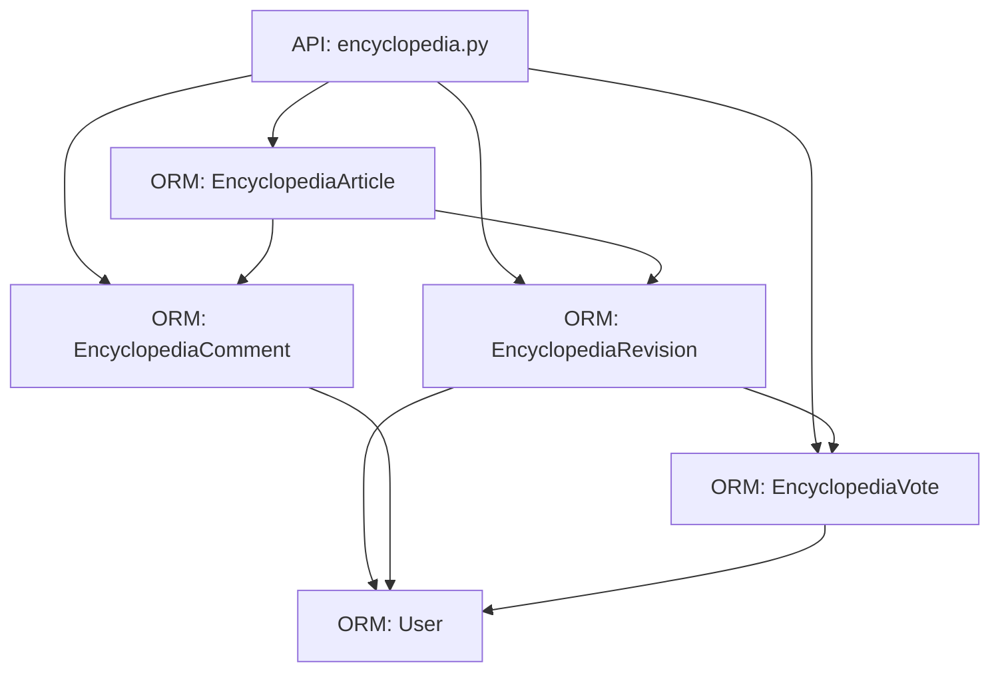

# 百科知识模型

<cite>
**本文引用的文件**
- [models_encyclopedia.py](file://web/backend/database/models_encyclopedia.py)
- [models.py](file://web/backend/database/models.py)
- [encyclopedia.py](file://web/backend/api/encyclopedia.py)
- [database.py](file://web/backend/database/database.py)
</cite>

## 目录
1. [简介](#简介)
2. [项目结构](#项目结构)
3. [核心组件](#核心组件)
4. [架构总览](#架构总览)
5. [详细组件分析](#详细组件分析)
6. [依赖关系分析](#依赖关系分析)
7. [性能与索引优化](#性能与索引优化)
8. [故障排查指南](#故障排查指南)
9. [结论](#结论)

## 简介
本文件为 Subskin 百科知识系统的“百科数据模型”权威文档，聚焦以下目标：
- 百科文章主表 EncyclopediaArticle 的字段设计与用途（slug、标题、分类、内容、摘要等）
- 修订记录 EncyclopediaRevision 的版本管理机制与审核流程
- 评论讨论 EncyclopediaComment 的树形回复结构
- 投票评估 EncyclopediaVote 的用户反馈机制
- 审核状态与权限控制（管理员操作）
- ORM 关系映射与完整关系链（文章-修订-评论-投票）
- 索引优化策略与查询性能考量

## 项目结构
与百科模型相关的代码主要位于后端数据库模型与 API 层：
- 数据模型定义：web/backend/database/models_encyclopedia.py（独立模块）与 web/backend/database/models.py（聚合模型）
- API 路由与服务逻辑：web/backend/api/encyclopedia.py
- 数据库连接配置：web/backend/database/database.py



图表来源
- [encyclopedia.py:1-50](file://web/backend/api/encyclopedia.py#L1-L50)
- [models.py:650-784](file://web/backend/database/models.py#L650-L784)
- [models_encyclopedia.py:18-134](file://web/backend/database/models_encyclopedia.py#L18-L134)
- [database.py:1-46](file://web/backend/database/database.py#L1-L46)

章节来源
- [models_encyclopedia.py:18-134](file://web/backend/database/models_encyclopedia.py#L18-L134)
- [models.py:650-784](file://web/backend/database/models.py#L650-L784)
- [encyclopedia.py:1-586](file://web/backend/api/encyclopedia.py#L1-L586)
- [database.py:1-46](file://web/backend/database/database.py#L1-L46)

## 核心组件
- EncyclopediaArticle：百科文章主表，承载 slug、标题、分类、内容、摘要、图标、排序、发布状态、浏览量等。
- EncyclopediaRevision：修订记录，保存每次提交的版本信息、变更说明、差异预览、审核状态、审核人及时间、投票统计等。
- EncyclopediaComment：评论/讨论，支持父评论与子回复的树形结构，具备审核开关。
- EncyclopediaVote：对修订进行投票评估，限制用户每修订仅一次有效投票，并维护上/下票数。

章节来源
- [models_encyclopedia.py:18-134](file://web/backend/database/models_encyclopedia.py#L18-L134)
- [models.py:650-784](file://web/backend/database/models.py#L650-L784)

## 架构总览
百科功能通过 FastAPI 暴露 REST 接口，调用 SQLAlchemy ORM 访问数据库。核心流程包括：
- 文章列表与详情：按分类聚合、按 slug 获取详情并增加浏览计数
- 修订提交：生成 diff 预览，落库待审
- 修订审核：管理员批准或拒绝，批准后同步更新文章内容
- 回滚：管理员创建回滚修订并恢复文章到指定版本
- 投票：用户对修订进行 up/down 投票，支持切换与取消
- 评论：树形结构展示，默认仅显示已审核评论



图表来源
- [encyclopedia.py:227-362](file://web/backend/api/encyclopedia.py#L227-L362)
- [encyclopedia.py:409-469](file://web/backend/api/encyclopedia.py#L409-L469)
- [models.py:650-784](file://web/backend/database/models.py#L650-L784)

## 详细组件分析

### 百科文章主表 EncyclopediaArticle
- 唯一标识：slug（唯一且可索引），用于 URL 路径
- 基础信息：title、category、icon、order
- 内容：content（Markdown）、summary（摘要）
- 状态与统计：is_published（发布状态）、view_count（浏览量）
- 时间戳：created_at、updated_at
- 关系：一对多关联 revisions、comments



图表来源
- [models.py:650-677](file://web/backend/database/models.py#L650-L677)
- [models_encyclopedia.py:18-42](file://web/backend/database/models_encyclopedia.py#L18-L42)

章节来源
- [models.py:650-677](file://web/backend/database/models.py#L650-L677)
- [models_encyclopedia.py:18-42](file://web/backend/database/models_encyclopedia.py#L18-L42)

### 修订记录 EncyclopediaRevision（版本管理与审核）
- 版本信息：title、content、change_summary、diff_preview
- 变更类型：change_type（suggest/approved/rejected/rollback）
- 审核状态：status（pending/approved/rejected），reviewed_at、reviewed_by、review_comment
- 投票统计：upvotes、downvotes
- 关系：属于某篇文章 article_id；作者 user_id；审核者 reviewed_by；一对多 votes



图表来源
- [encyclopedia.py:227-362](file://web/backend/api/encyclopedia.py#L227-L362)
- [models.py:680-722](file://web/backend/database/models.py#L680-L722)

章节来源
- [models.py:680-722](file://web/backend/database/models.py#L680-L722)
- [encyclopedia.py:227-362](file://web/backend/api/encyclopedia.py#L227-L362)

### 评论讨论 EncyclopediaComment（树形回复）
- 层级结构：parent_id 指向父评论，形成树形回复
- 审核控制：is_approved 控制是否可见
- 关系：属于某篇文章 article_id；作者 user_id；自引用 parent_comment/replies



图表来源
- [models.py:725-759](file://web/backend/database/models.py#L725-L759)
- [models_encyclopedia.py:91-114](file://web/backend/database/models_encyclopedia.py#L91-L114)

章节来源
- [models.py:725-759](file://web/backend/database/models.py#L725-L759)
- [models_encyclopedia.py:91-114](file://web/backend/database/models_encyclopedia.py#L91-L114)

### 投票评估 EncyclopediaVote（用户反馈）
- 约束：同一用户对同一修订仅能有一次有效投票（唯一约束）
- 字段：revision_id、user_id、vote_type（up/down）、comment
- 关系：属于某修订 revision_id；投票人 voter



图表来源
- [models.py:762-784](file://web/backend/database/models.py#L762-L784)
- [models_encyclopedia.py:116-134](file://web/backend/database/models_encyclopedia.py#L116-L134)

章节来源
- [models.py:762-784](file://web/backend/database/models.py#L762-L784)
- [models_encyclopedia.py:116-134](file://web/backend/database/models_encyclopedia.py#L116-L134)

### 权限控制与审核流程
- 审核接口需要管理员权限（current_user.is_admin），否则返回 403
- 仅 pending 状态的修订可被审核；批准后同步更新文章标题与内容，并记录审核时间与审核人
- 回滚操作同样需要管理员权限，会创建一条 change_type=rollback 的修订并恢复文章内容

章节来源
- [encyclopedia.py:311-404](file://web/backend/api/encyclopedia.py#L311-L404)
- [models.py:88-137](file://web/backend/database/models.py#L88-L137)

### ORM 关系映射与完整关系链
- 文章 → 修订：EncyclopediaArticle.revisions 一对多
- 文章 → 评论：EncyclopediaArticle.comments 一对多
- 修订 → 投票：EncyclopediaRevision.votes 一对多
- 评论 → 评论：自引用 parent_comment/replies 实现树形结构
- 用户 → 修订作者/审核者/投票人：User 与多个模型的多向关系

```mermaid
graph LR
Article["EncyclopediaArticle"] --> Rev["EncyclopediaRevision"]
Article --> Comment["EncyclopediaComment"]
Rev --> Vote["EncyclopediaVote"]
Comment --> Comment : "parent_id -> id"
```

图表来源
- [models.py:650-784](file://web/backend/database/models.py#L650-L784)
- [models_encyclopedia.py:18-134](file://web/backend/database/models_encyclopedia.py#L18-L134)

## 依赖关系分析
- API 层依赖 ORM 模型与数据库会话
- 模型之间通过外键与 relationship 建立强一致性关系
- 用户模型提供权限判断（is_admin）与身份关联



图表来源
- [encyclopedia.py:14-22](file://web/backend/api/encyclopedia.py#L14-L22)
- [models.py:88-137](file://web/backend/database/models.py#L88-L137)
- [models.py:650-784](file://web/backend/database/models.py#L650-L784)

章节来源
- [encyclopedia.py:14-22](file://web/backend/api/encyclopedia.py#L14-L22)
- [models.py:88-137](file://web/backend/database/models.py#L88-L137)
- [models.py:650-784](file://web/backend/database/models.py#L650-L784)

## 性能与索引优化
- 文章表索引
  - 分类索引：idx_enc_articles_category（category）
  - 发布状态索引：idx_enc_articles_published（is_published）
  - slug 唯一索引：便于按 URL 快速定位文章
- 修订表索引
  - 文章维度：idx_enc_rev_article（article_id）
  - 审核状态：idx_enc_rev_status（status）
  - 作者维度：idx_enc_rev_user（user_id）
  - 复合索引：idx_enc_rev_article_status（article_id, status）
- 评论表索引
  - 文章维度：idx_enc_comment_article（article_id）
  - 回复维度：idx_enc_comment_parent（parent_id）
  - 作者维度：idx_enc_comment_user（user_id）
- 投票表索引与约束
  - 唯一约束：uq_enc_vote_revision_user（revision_id, user_id）防止重复投票
  - 索引：idx_enc_vote_revision（revision_id）加速按修订统计票数
- 查询优化建议
  - 列表页按分类+排序字段查询，利用 category/order/title 组合排序
  - 详情页读取后递增 view_count，注意在高并发场景下的写竞争（SQLite 使用 NullPool 与超时配置缓解锁争用）
  - 评论树构建时仅加载 is_approved=True 的顶级评论与回复，减少不必要的数据传输
  - 审核接口在批准时批量更新文章字段，避免多次 I/O

章节来源
- [models.py:650-784](file://web/backend/database/models.py#L650-L784)
- [models_encyclopedia.py:21-25](file://web/backend/database/models_encyclopedia.py#L21-L25)
- [models_encyclopedia.py:48-53](file://web/backend/database/models_encyclopedia.py#L48-L53)
- [models_encyclopedia.py:95-99](file://web/backend/database/models_encyclopedia.py#L95-L99)
- [models_encyclopedia.py:120-123](file://web/backend/database/models_encyclopedia.py#L120-L123)
- [database.py:17-33](file://web/backend/database/database.py#L17-L33)

## 故障排查指南
- 404 文章不存在：检查 slug 是否正确，以及 is_published 是否为 True
- 403 权限不足：审核与回滚接口需管理员权限，确认 current_user.is_admin
- 修订已被处理：仅 pending 状态可审核，非 pending 将返回错误
- 评论未显示：新评论默认 is_approved=False，需审核通过后在前端可见
- SQLite 锁等待：在高并发写入时可能触发 database is locked，当前配置已设置 timeout=15 与 NullPool，必要时考虑迁移至 PostgreSQL/MySQL

章节来源
- [encyclopedia.py:150-157](file://web/backend/api/encyclopedia.py#L150-L157)
- [encyclopedia.py:311-331](file://web/backend/api/encyclopedia.py#L311-L331)
- [encyclopedia.py:520-555](file://web/backend/api/encyclopedia.py#L520-L555)
- [database.py:17-33](file://web/backend/database/database.py#L17-L33)

## 结论
Subskin 百科知识系统的数据模型以清晰的实体划分与严格的索引设计支撑了文章、修订、评论、投票的核心能力。通过审核流程与权限控制保障内容质量，结合树形评论与投票机制促进社区协作。建议在后续演进中持续优化索引与查询，并在高并发场景下评估数据库引擎与连接池策略。