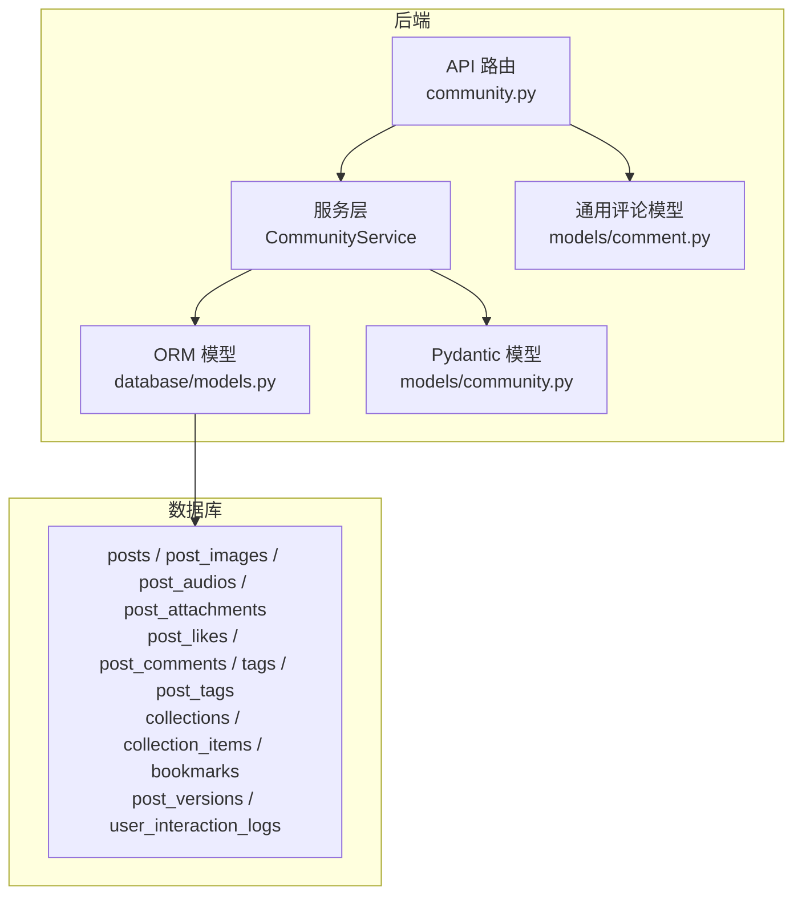
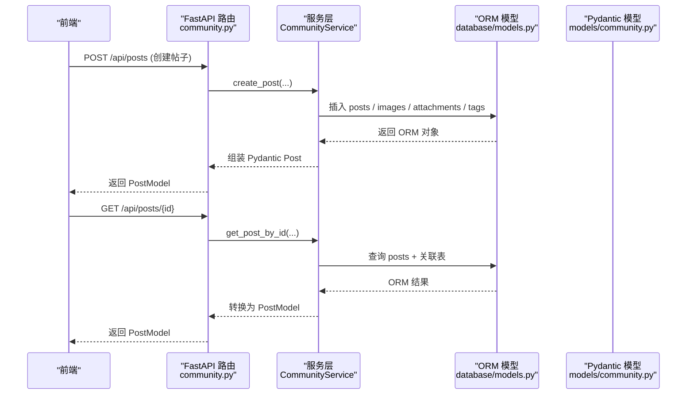
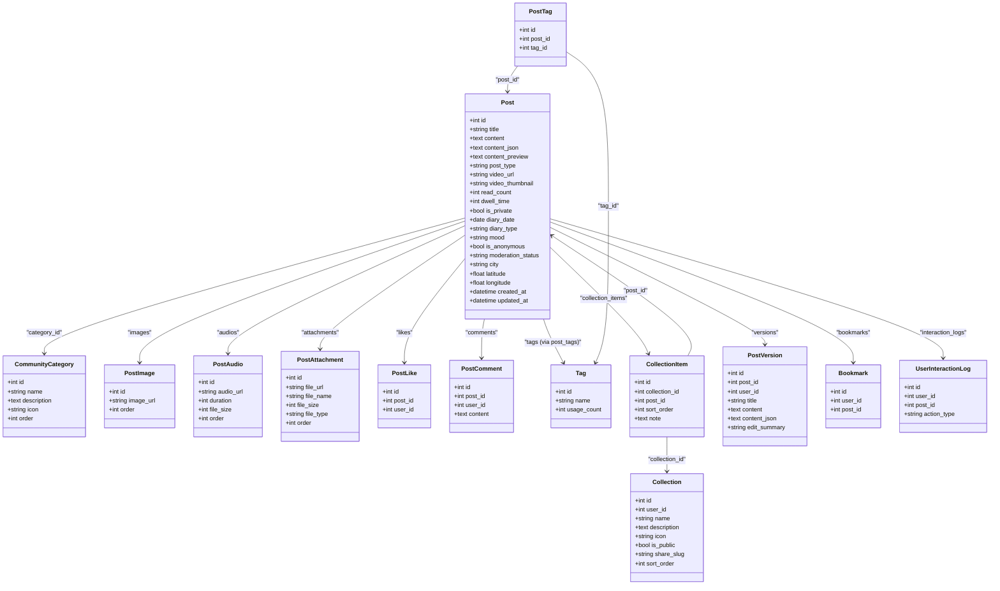
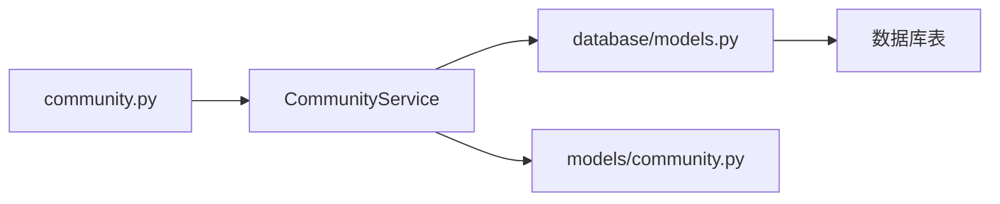

# 社区内容模型

<cite>
**本文引用的文件**
- [web/backend/database/models.py](file://web/backend/database/models.py)
- [web/backend/models/community.py](file://web/backend/models/community.py)
- [web/backend/api/community.py](file://web/backend/api/community.py)
- [web/backend/models/comment.py](file://web/backend/models/comment.py)
</cite>

## 目录
1. [引言](#引言)
2. [项目结构](#项目结构)
3. [核心组件](#核心组件)
4. [架构总览](#架构总览)
5. [详细组件分析](#详细组件分析)
6. [依赖关系分析](#依赖关系分析)
7. [性能考量](#性能考量)
8. [故障排查指南](#故障排查指南)
9. [结论](#结论)
10. [附录：ORM 关系与查询示例](#附录orm-关系与查询示例)

## 引言
本文件面向 Subskin 社区内容系统的数据模型，聚焦帖子（Post）及其关联的评论、点赞、标签、收藏、版本控制等核心能力。文档从 ORM 模型、Pydantic 数据模型、API 层交互三个维度展开，给出字段说明、类型系统与媒体附件管理、分类组织、多对多关系实现、版本历史机制，以及复杂关联查询与级联操作的 ORM 映射示例，帮助读者快速理解并正确使用该子系统。

## 项目结构
社区内容相关代码主要分布在以下位置：
- 数据库 ORM 模型：定义表结构与关系映射
- Pydantic 模型：用于 API 请求/响应校验与序列化
- API 路由：对外暴露接口，调用服务层完成业务逻辑

图表来源
- [web/backend/api/community.py](file://web/backend/api/community.py)
- [web/backend/database/models.py](file://web/backend/database/models.py)
- [web/backend/models/community.py](file://web/backend/models/community.py)
- [web/backend/models/comment.py](file://web/backend/models/comment.py)

章节来源
- [web/backend/database/models.py](file://web/backend/database/models.py)
- [web/backend/models/community.py](file://web/backend/models/community.py)
- [web/backend/api/community.py](file://web/backend/api/community.py)
- [web/backend/models/comment.py](file://web/backend/models/comment.py)

## 核心组件
- 帖子 Post：标题、HTML 内容、结构化 JSON 内容、预览文本、类型（image/video/text/long/treatment）、视频封面、阅读数、停留时长、分类、私密性、草稿过期、日记日期/类型/心情、匿名发布、审核状态、城市与经纬度、时间戳等
- 媒体附件：图片 PostImage、音频 PostAudio、文件 PostAttachment，均通过外键关联到 Post，支持排序与元信息
- 分类 CommunityCategory：名称、描述、图标、排序
- 评论 PostComment：内容、作者、时间
- 点赞 PostLike：用户与帖子的唯一约束，防止重复点赞
- 标签 Tag 与关联表 PostTag：多对多关系，去重约束
- 收藏 Collection 与条目 CollectionItem：个人收藏夹与帖子多对多，含排序与备注
- 书签 Bookmark：用户快速收藏
- 版本控制 PostVersion：记录每次编辑的历史快照
- 互动日志 UserInteractionLog：推荐算法数据源

章节来源
- [web/backend/database/models.py](file://web/backend/database/models.py)
- [web/backend/models/community.py](file://web/backend/models/community.py)

## 架构总览
社区内容系统的典型调用链：前端发起请求 → FastAPI 路由接收 → 服务层处理业务 → ORM 读写数据库 → 返回 Pydantic 模型给前端。

图表来源
- [web/backend/api/community.py](file://web/backend/api/community.py)
- [web/backend/database/models.py](file://web/backend/database/models.py)
- [web/backend/models/community.py](file://web/backend/models/community.py)

## 详细组件分析

### 帖子 Post 模型
- 字段要点
  - 标题 title、内容 content（HTML）、结构化内容 content_json（Tiptap JSON）、预览 content_preview（前若干字）
  - 类型 post_type：image/video/text/long/treatment；视频字段 video_url、video_thumbnail
  - 统计 read_count、dwell_time
  - 分类 category_id（外键），私密 is_private，草稿过期 draft_expires_at
  - 日记 diary_date、diary_type、mood
  - 匿名 is_anonymous（已移除匿名发布，保留字段）
  - 审核 moderation_status、城市 city、经纬度 latitude/longitude
  - 时间 created_at、updated_at
- 关系
  - 作者 author（User）
  - 分类 category（CommunityCategory）
  - 媒体 images、audios、attachments（一对多）
  - 互动 likes、comments（一对多）
  - 标签 tags（多对多 via post_tags）
  - 版本 versions（一对多）
  - 收藏 collection_items（一对多）
  - 书签 bookmarks（一对多）
  - 互动日志 interaction_logs（一对多）

图表来源
- [web/backend/database/models.py](file://web/backend/database/models.py)

章节来源
- [web/backend/database/models.py](file://web/backend/database/models.py)

### 帖子类型系统与媒体附件
- 类型系统
  - image：以图片为主
  - video：包含 video_url、video_thumbnail
  - text：纯文本
  - long：长文
  - treatment：结构化治疗经验分享（treatment_share_json）
- 媒体附件
  - 图片 PostImage：image_url、order
  - 音频 PostAudio：audio_url、duration、file_size、order
  - 文件 PostAttachment：file_url、file_name、file_size、file_type、order
- 上传接口
  - 图片上传 /upload
  - 音频上传 /upload/audio
  - 文件上传 /upload/file

章节来源
- [web/backend/database/models.py](file://web/backend/database/models.py)
- [web/backend/api/community.py](file://web/backend/api/community.py)

### 分类 CommunityCategory
- 字段：name、description、icon、order
- 用途：为帖子提供分类组织，便于列表筛选与展示

章节来源
- [web/backend/database/models.py](file://web/backend/database/models.py)

### 评论系统 PostComment
- 字段：content、post_id、user_id、created_at、updated_at
- 关系：属于 Post，作者为 User
- API：新增评论、列出评论

章节来源
- [web/backend/database/models.py](file://web/backend/database/models.py)
- [web/backend/api/community.py](file://web/backend/api/community.py)
- [web/backend/models/comment.py](file://web/backend/models/comment.py)

### 点赞系统 PostLike
- 字段：post_id、user_id、created_at
- 约束：(post_id, user_id) 唯一，避免并发重复点赞
- API：切换点赞状态，返回是否已点赞与当前点赞数

章节来源
- [web/backend/database/models.py](file://web/backend/database/models.py)
- [web/backend/api/community.py](file://web/backend/api/community.py)

### 标签系统 Tag 与 PostTag
- Tag：name、usage_count
- PostTag：post_id、tag_id，唯一约束保证同一帖子不重复打相同标签
- API：更新帖子标签、获取热门标签、搜索标签

章节来源
- [web/backend/database/models.py](file://web/backend/database/models.py)
- [web/backend/api/community.py](file://web/backend/api/community.py)

### 收藏系统 Collection 与 CollectionItem
- Collection：用户私有或公开的知识库文件夹，支持分享 slug
- CollectionItem：集合与帖子的多对多，支持排序与备注
- 约束：(collection_id, post_id) 唯一，避免重复添加

章节来源
- [web/backend/database/models.py](file://web/backend/database/models.py)
- [web/backend/models/community.py](file://web/backend/models/community.py)
- [web/backend/api/community.py](file://web/backend/api/community.py)

### 版本控制 PostVersion
- 字段：post_id、user_id（编辑者）、title、content、content_json、edit_summary、created_at
- 用途：记录每次编辑的历史快照，支持回溯与对比

章节来源
- [web/backend/database/models.py](file://web/backend/database/models.py)
- [web/backend/models/community.py](file://web/backend/models/community.py)

### 书签 Bookmark 与互动日志 UserInteractionLog
- Bookmark：用户快速收藏，(user_id, post_id) 唯一
- UserInteractionLog：记录 click/read_end/like/bookmark/comment/share/skip 等行为，供推荐算法使用

章节来源
- [web/backend/database/models.py](file://web/backend/database/models.py)

## 依赖关系分析
- API 层依赖服务层，服务层依赖 ORM 模型与 Pydantic 模型
- 帖子与多类实体存在一对多或多对多关系，需通过外键与中间表维护一致性
- 点赞与收藏采用唯一约束保障幂等性与数据一致性

图表来源
- [web/backend/api/community.py](file://web/backend/api/community.py)
- [web/backend/database/models.py](file://web/backend/database/models.py)
- [web/backend/models/community.py](file://web/backend/models/community.py)

章节来源
- [web/backend/api/community.py](file://web/backend/api/community.py)
- [web/backend/database/models.py](file://web/backend/database/models.py)
- [web/backend/models/community.py](file://web/backend/models/community.py)

## 性能考量
- 列表接口批量转换：避免 N+1 查询，统一在服务层将 ORM 对象转换为 Pydantic 模型
- 索引优化：对常用查询字段建立索引（如 user_id、category_id、created_at、action_type 等）
- 并发安全：点赞与收藏使用唯一约束防止重复写入
- 异步与线程池：外部调用（如 IP 定位、内容审核）放入线程池，避免阻塞事件循环

章节来源
- [web/backend/api/community.py](file://web/backend/api/community.py)
- [web/backend/database/models.py](file://web/backend/database/models.py)

## 故障排查指南
- 403 权限错误：账号被封禁或禁言时无法发布/评论
- 404 未找到：帖子不存在或无权操作
- 上传失败：检查文件大小、类型与服务端限制
- 审核标记：包含夸大宣传词汇会被标记 flagged，进入审核流程
- 审计日志：关键操作会记录审计日志，便于追踪

章节来源
- [web/backend/api/community.py](file://web/backend/api/community.py)

## 结论
Subskin 社区内容系统围绕 Post 构建了完善的媒体、标签、评论、点赞、收藏、版本控制与互动日志体系。通过清晰的 ORM 关系与 Pydantic 模型，配合 API 层的严格校验与服务层的高效处理，实现了可扩展、可维护且高性能的内容管理能力。

## 附录：ORM 关系与查询示例
以下为常见复杂关联查询与级联操作的示例（以 SQLAlchemy 风格描述，具体实现位于服务层）：

- 查询某分类下的热门帖子（含作者、标签、图片、点赞数、是否已点赞）
  - 步骤：按分类过滤 → 关联作者与标签 → 聚合点赞计数 → 计算当前用户是否点赞 → 返回 Pydantic 模型
  - 参考路径：[web/backend/api/community.py](file://web/backend/api/community.py)

- 更新帖子标签（多对多）
  - 步骤：解析 tag_names → 查找或创建 Tag → 同步 PostTag 关联 → 去重约束生效
  - 参考路径：[web/backend/api/community.py](file://web/backend/api/community.py)

- 切换点赞（幂等）
  - 步骤：根据 (post_id, user_id) 唯一约束判断是否存在 → 存在则删除，不存在则插入 → 返回最新点赞数
  - 参考路径：[web/backend/database/models.py](file://web/backend/database/models.py), [web/backend/api/community.py](file://web/backend/api/community.py)

- 添加收藏条目（多对多）
  - 步骤：校验 (collection_id, post_id) 唯一 → 插入 CollectionItem → 返回条目详情
  - 参考路径：[web/backend/database/models.py](file://web/backend/database/models.py), [web/backend/models/community.py](file://web/backend/models/community.py)

- 版本历史（级联保存）
  - 步骤：更新 Post 后，生成 PostVersion 快照（标题、内容、JSON、编辑摘要）
  - 参考路径：[web/backend/database/models.py](file://web/backend/database/models.py), [web/backend/models/community.py](file://web/backend/models/community.py)

章节来源
- [web/backend/database/models.py](file://web/backend/database/models.py)
- [web/backend/models/community.py](file://web/backend/models/community.py)
- [web/backend/api/community.py](file://web/backend/api/community.py)