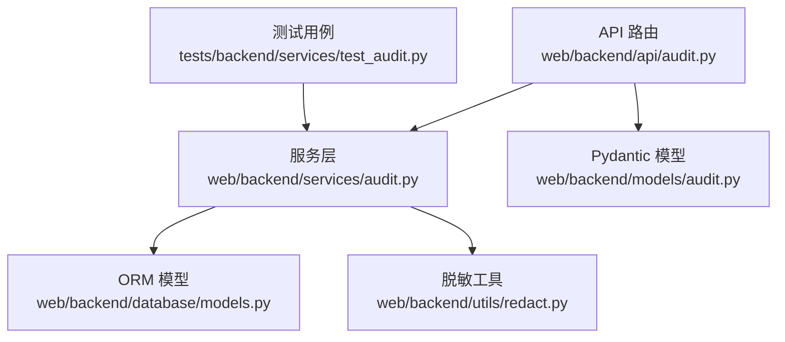
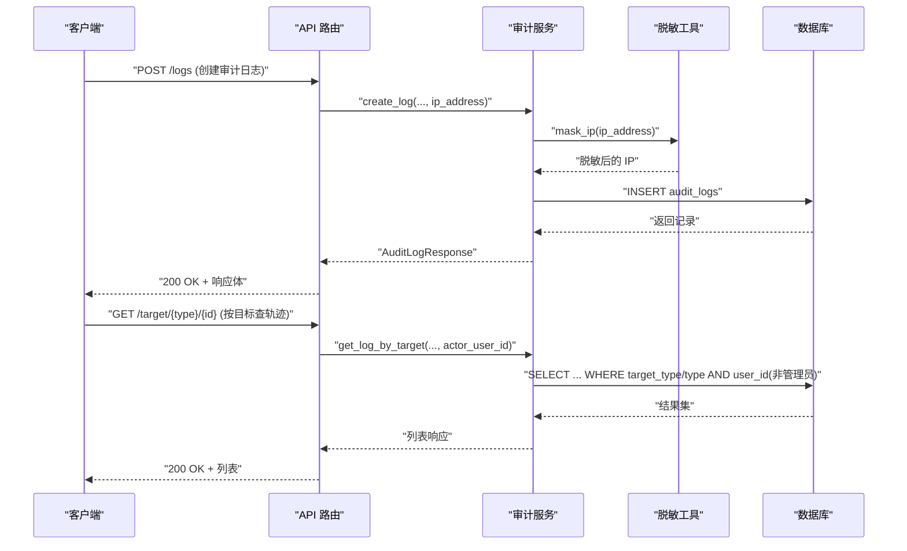
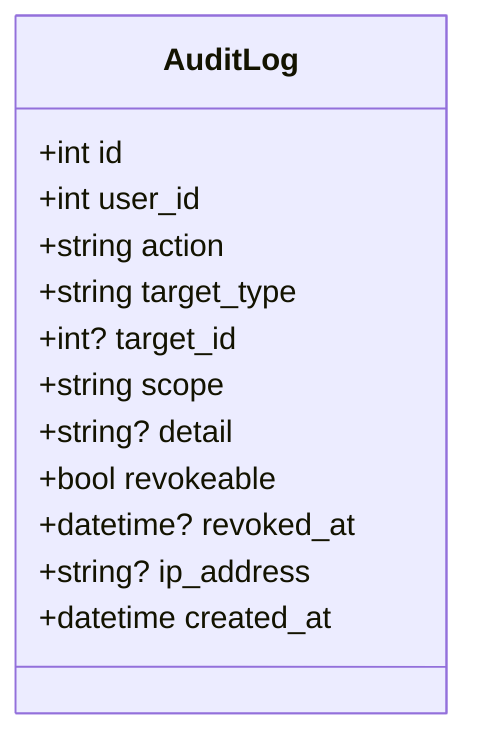
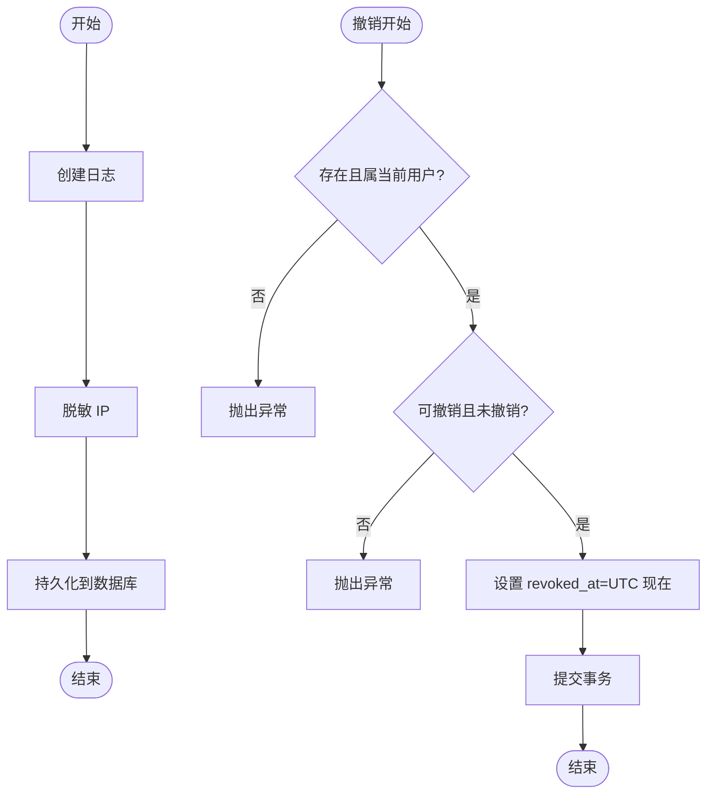
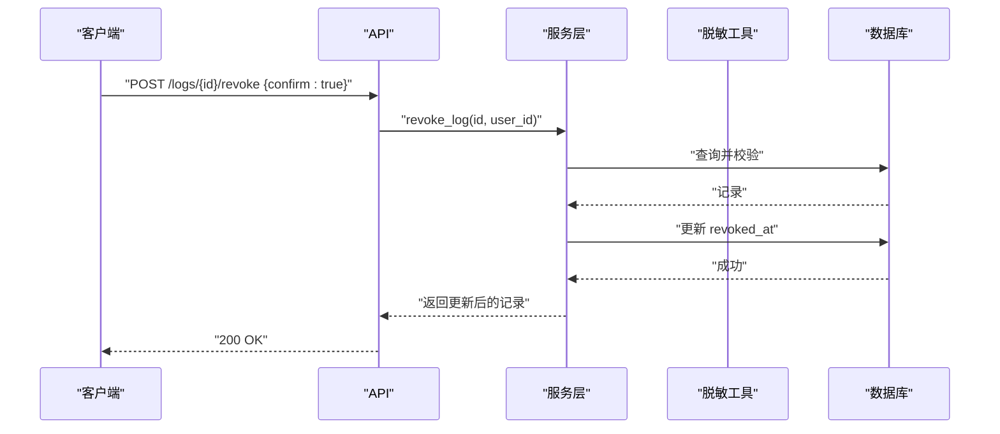
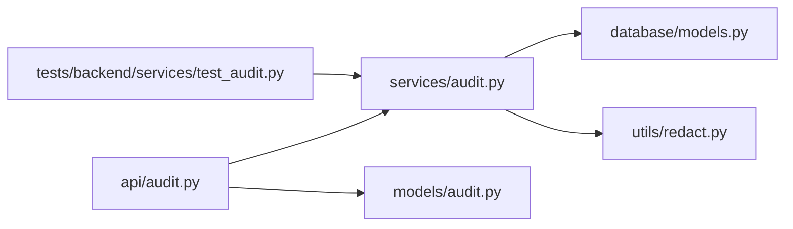

# 系统审计模型

<cite>
**本文引用的文件**
- [web/backend/database/models.py](file://web/backend/database/models.py)
- [web/backend/services/audit.py](file://web/backend/services/audit.py)
- [web/backend/api/audit.py](file://web/backend/api/audit.py)
- [web/backend/models/audit.py](file://web/backend/models/audit.py)
- [web/backend/utils/redact.py](file://web/backend/utils/redact.py)
- [tests/backend/services/test_audit.py](file://tests/backend/services/test_audit.py)
</cite>

## 目录
1. [简介](#简介)
2. [项目结构](#项目结构)
3. [核心组件](#核心组件)
4. [架构总览](#架构总览)
5. [详细组件分析](#详细组件分析)
6. [依赖关系分析](#依赖关系分析)
7. [性能与可扩展性](#性能与可扩展性)
8. [故障排查指南](#故障排查指南)
9. [结论](#结论)
10. [附录：查询与分析示例](#附录：查询与分析示例)

## 简介
本文件聚焦 Subskin 系统的“审计功能”数据模型与实现，围绕 AuditLog 审计日志模型展开，覆盖以下要点：
- 用户操作记录、目标对象类型、权限范围、撤销机制等字段设计
- 不可篡改记录的存储策略与时间戳管理（UTC 时间）
- IP 地址脱敏存储与用户代理信息记录现状
- 撤销操作的审计追踪与权限控制验证
- ORM 模型定义与查询分析、报表生成支持

该审计体系用于记录用户对敏感资源的关键授权与公开行为，确保隐私授权可追溯、可审计。

## 项目结构
审计相关代码主要分布在以下模块：
- 数据库 ORM 模型：web/backend/database/models.py
- 服务层：web/backend/services/audit.py
- API 路由：web/backend/api/audit.py
- Pydantic 请求/响应模型：web/backend/models/audit.py
- 数据脱敏工具：web/backend/utils/redact.py
- 单元测试：tests/backend/services/test_audit.py

图表来源
- [web/backend/api/audit.py:1-124](file://web/backend/api/audit.py#L1-L124)
- [web/backend/services/audit.py:1-136](file://web/backend/services/audit.py#L1-L136)
- [web/backend/database/models.py:623-648](file://web/backend/database/models.py#L623-L648)
- [web/backend/utils/redact.py:1-53](file://web/backend/utils/redact.py#L1-L53)
- [web/backend/models/audit.py:1-58](file://web/backend/models/audit.py#L1-L58)
- [tests/backend/services/test_audit.py:1-60](file://tests/backend/services/test_audit.py#L1-L60)

章节来源
- [web/backend/api/audit.py:1-124](file://web/backend/api/audit.py#L1-L124)
- [web/backend/services/audit.py:1-136](file://web/backend/services/audit.py#L1-L136)
- [web/backend/database/models.py:623-648](file://web/backend/database/models.py#L623-L648)
- [web/backend/utils/redact.py:1-53](file://web/backend/utils/redact.py#L1-L53)
- [web/backend/models/audit.py:1-58](file://web/backend/models/audit.py#L1-L58)
- [tests/backend/services/test_audit.py:1-60](file://tests/backend/services/test_audit.py#L1-L60)

## 核心组件
- 审计日志 ORM 模型（AuditLog）：定义表结构与字段约束，包含操作类型、目标类型/ID、权限范围、是否可撤销、撤销时间、IP 脱敏、创建时间等。
- 服务层（AuditLogService）：封装创建、撤销、按用户/目标查询等操作；统一写入时进行 IP 脱敏；提供便捷类方法 log() 供调用方使用。
- API 路由（audit.py）：暴露创建、列表、详情、撤销、按目标查看审计轨迹的接口；非管理员仅能查看自身对目标的审计轨迹，防止 IDOR。
- Pydantic 模型：定义请求体与响应体，明确字段含义与限制。
- 脱敏工具：对 IP 地址进行前两段保留、后两段掩码处理。

章节来源
- [web/backend/database/models.py:623-648](file://web/backend/database/models.py#L623-L648)
- [web/backend/services/audit.py:1-136](file://web/backend/services/audit.py#L1-L136)
- [web/backend/api/audit.py:1-124](file://web/backend/api/audit.py#L1-L124)
- [web/backend/models/audit.py:1-58](file://web/backend/models/audit.py#L1-L58)
- [web/backend/utils/redact.py:1-53](file://web/backend/utils/redact.py#L1-L53)

## 架构总览
审计流程从 API 入口进入，经服务层落库，关键安全点包括：
- 写入时强制 IP 脱敏
- 撤销操作需校验“可撤销”与“未撤销”状态
- 按目标查询时，非管理员仅能看到自己的操作，避免越权枚举

图表来源
- [web/backend/api/audit.py:33-124](file://web/backend/api/audit.py#L33-L124)
- [web/backend/services/audit.py:15-92](file://web/backend/services/audit.py#L15-L92)
- [web/backend/utils/redact.py:46-53](file://web/backend/utils/redact.py#L46-L53)
- [web/backend/database/models.py:623-648](file://web/backend/database/models.py#L623-L648)

## 详细组件分析

### 审计日志 ORM 模型（AuditLog）
- 表名：audit_logs
- 关键字段
  - id：主键，自增
  - user_id：外键关联 users.id，索引
  - action：操作类型（如 share/publish/revoke/delete/export），长度限制，索引
  - target_type：目标类型（post/comment/assessment/collection）
  - target_id：目标对象 ID（可为空）
  - scope：权限范围（public/followers/specific_users/private），默认 public
  - detail：JSON 格式详细信息（文本）
  - revokeable：是否可撤销（布尔，默认 True）
  - revoked_at：撤销时间（可为空）
  - ip_address：操作者 IP（脱敏后存储，最大长度 45）
  - created_at：创建时间（UTC，默认当前时间，索引）
- 设计要点
  - 不可删除：通过“标记撤销”而非物理删除保证审计不可篡改
  - 时间戳：统一 UTC 时间，便于跨时区一致性与排序
  - 索引：user_id、action、created_at 等常用查询维度已建立索引

图表来源
- [web/backend/database/models.py:623-648](file://web/backend/database/models.py#L623-L648)

章节来源
- [web/backend/database/models.py:623-648](file://web/backend/database/models.py#L623-L648)

### 服务层（AuditLogService）
- 创建日志 create_log
  - 接收 user_id、action、target_type、target_id、scope、detail、revokeable、ip_address
  - 写入前对 ip_address 执行 mask_ip 脱敏
  - 提交事务并刷新实体
- 撤销日志 revoke_log
  - 校验日志存在且属于当前用户
  - 校验 revokeable 为真且尚未撤销
  - 设置 revoked_at 为当前 UTC 时间
- 查询接口
  - get_user_logs：按用户分页倒序查询
  - get_log_detail：按 ID 与用户获取详情
  - get_log_by_target：按目标类型与 ID 查询审计轨迹，支持可选 actor_user_id 过滤（非管理员仅看自己）
- 便捷方法 log
  - 将调用方常用的 actor_id/details 映射到内部参数
  - 自动将 details 序列化为 JSON 字符串
  - 自动转换 target_id 为整数（若可能）

图表来源
- [web/backend/services/audit.py:15-53](file://web/backend/services/audit.py#L15-L53)
- [web/backend/utils/redact.py:46-53](file://web/backend/utils/redact.py#L46-L53)

章节来源
- [web/backend/services/audit.py:15-92](file://web/backend/services/audit.py#L15-L92)
- [web/backend/utils/redact.py:46-53](file://web/backend/utils/redact.py#L46-L53)

### API 路由（audit.py）
- POST /logs：创建审计日志，自动从请求中取 client.host 作为 IP 传入服务层
- GET /logs：分页列出当前用户的审计日志
- GET /logs/{log_id}：获取指定日志详情（需归属当前用户）
- POST /logs/{log_id}/revoke：撤销日志，需 confirm=true
- GET /target/{target_type}/{target_id}：按目标查看审计轨迹，非管理员仅看到自己的操作（防 IDOR）

图表来源
- [web/backend/api/audit.py:84-99](file://web/backend/api/audit.py#L84-L99)
- [web/backend/services/audit.py:41-53](file://web/backend/services/audit.py#L41-L53)

章节来源
- [web/backend/api/audit.py:33-124](file://web/backend/api/audit.py#L33-L124)

### Pydantic 模型（models/audit.py）
- AuditLogCreate：创建请求体，限定 action/target_type/scope/detail/revokeable
- AuditLogResponse：响应体，不包含 ip_address（L3 数据不对外暴露）
- AuditLogRevokeRequest：撤销请求体，需要 confirm 确认
- AuditLogListResponse：列表响应，包含 total 与 items

章节来源
- [web/backend/models/audit.py:6-58](file://web/backend/models/audit.py#L6-L58)

### 数据脱敏（utils/redact.py）
- mask_ip：对 IPv4 仅保留前两组，后两组替换为星号；IPv6 或非法格式统一返回 "***.***"
- 其他脱敏函数（手机号、邮箱、姓名）可用于其他 L3 数据场景

章节来源
- [web/backend/utils/redact.py:1-53](file://web/backend/utils/redact.py#L1-L53)

### 测试用例（test_audit.py）
- 验证便捷方法 log 的参数映射（actor_id/details → user_id/detail）
- 验证 IP 在存储时被脱敏
- 验证按目标查询时的 IDOR 防护：非管理员仅能看到自己的操作

章节来源
- [tests/backend/services/test_audit.py:1-60](file://tests/backend/services/test_audit.py#L1-L60)

## 依赖关系分析
- API 依赖服务层与 Pydantic 模型
- 服务层依赖 ORM 模型与脱敏工具
- 测试依赖服务层以验证行为

图表来源
- [web/backend/api/audit.py:1-124](file://web/backend/api/audit.py#L1-L124)
- [web/backend/services/audit.py:1-136](file://web/backend/services/audit.py#L1-L136)
- [web/backend/database/models.py:623-648](file://web/backend/database/models.py#L623-L648)
- [web/backend/utils/redact.py:1-53](file://web/backend/utils/redact.py#L1-L53)
- [web/backend/models/audit.py:1-58](file://web/backend/models/audit.py#L1-L58)
- [tests/backend/services/test_audit.py:1-60](file://tests/backend/services/test_audit.py#L1-L60)

章节来源
- [web/backend/api/audit.py:1-124](file://web/backend/api/audit.py#L1-L124)
- [web/backend/services/audit.py:1-136](file://web/backend/services/audit.py#L1-L136)
- [web/backend/database/models.py:623-648](file://web/backend/database/models.py#L623-L648)
- [web/backend/utils/redact.py:1-53](file://web/backend/utils/redact.py#L1-L53)
- [web/backend/models/audit.py:1-58](file://web/backend/models/audit.py#L1-L58)
- [tests/backend/services/test_audit.py:1-60](file://tests/backend/services/test_audit.py#L1-L60)

## 性能与可扩展性
- 索引优化：user_id、action、created_at 已建索引，利于按用户、操作类型、时间范围查询
- 分页与排序：服务层使用 limit/offset 与倒序排序，适合列表展示
- 扩展建议
  - 如需高频按目标类型+ID 查询，可增加复合索引（target_type, target_id）
  - 如需按 scope 统计，可增加 scope 索引
  - 大表归档策略：可按月份拆分历史审计日志至归档表，保持在线表规模可控

[本节为通用性能建议，不直接分析具体文件]

## 故障排查指南
- 撤销失败
  - 可能原因：日志不存在或不属于当前用户；不可撤销；已被撤销
  - 定位：检查 revoke_log 中的条件判断与异常信息
- 无法查看他人对同一目标的审计轨迹
  - 预期行为：非管理员仅能看到自己的操作（防 IDOR）
  - 定位：检查 get_log_by_target 的 actor_user_id 过滤逻辑
- IP 未脱敏
  - 预期：所有写入路径均经过 mask_ip
  - 定位：检查 create_log 与 log 类方法的调用链

章节来源
- [web/backend/services/audit.py:41-53](file://web/backend/services/audit.py#L41-L53)
- [web/backend/api/audit.py:84-99](file://web/backend/api/audit.py#L84-L99)
- [web/backend/utils/redact.py:46-53](file://web/backend/utils/redact.py#L46-L53)

## 结论
Subskin 的审计模型以“不可删除、仅标记撤销”的策略保障审计记录的完整性；通过统一的 UTC 时间戳与严格的权限控制（非管理员仅见自身操作）确保可追溯性与安全性；IP 地址在写入时即脱敏，避免敏感信息泄露。服务层提供了便捷的创建与查询能力，API 层则明确了对外暴露的数据边界（不返回 IP）。整体设计满足合规审计与日常运维需求，并可基于现有索引与分页机制进行扩展与优化。

[本节为总结性内容，不直接分析具体文件]

## 附录：查询与分析示例
以下为常见审计数据分析思路与对应模型字段说明（不涉及具体代码片段）：
- 按用户统计某时间段内的操作次数
  - 筛选：user_id、created_at 范围
  - 聚合：count(action)
- 按目标类型与 ID 查看完整审计轨迹
  - 筛选：target_type、target_id
  - 排序：created_at 倒序
  - 权限：非管理员附加 user_id 过滤
- 统计不同权限范围（scope）的操作分布
  - 筛选：scope
  - 聚合：count(*)
- 识别被撤销的操作
  - 筛选：revoked_at IS NOT NULL
  - 用途：复盘撤销事件与影响面
- 报表生成建议
  - 导出 CSV/Excel：按用户、目标类型、时间范围导出
  - 可视化：趋势图（按天/周）、Top 操作类型、Top 目标类型

[本节为概念性指导，不直接分析具体文件]