# 社区数据模型

<cite>
**本文引用的文件**   
- [web/backend/database/models.py](file://web/backend/database/models.py)
- [web/backend/models/community.py](file://web/backend/models/community.py)
- [web/backend/services/community.py](file://web/backend/services/community.py)
- [web/backend/api/community.py](file://web/backend/api/community.py)
- [web/backend/api/social.py](file://web/backend/api/social.py)
- [web/backend/api/comment.py](file://web/backend/api/comment.py)
</cite>

## 目录
1. [引言](#引言)
2. [项目结构](#项目结构)
3. [核心组件](#核心组件)
4. [架构总览](#架构总览)
5. [详细组件分析](#详细组件分析)
6. [依赖关系分析](#依赖关系分析)
7. [性能与并发控制](#性能与并发控制)
8. [复杂查询与ORM示例](#复杂查询与orm示例)
9. [故障排查指南](#故障排查指南)
10. [结论](#结论)

## 引言
本技术文档聚焦 Subskin 社区功能的数据模型设计，围绕帖子(Post)、评论(Comment)、点赞(Like)、标签(Tag)、收藏夹(Collection/Bookmark)、用户关注(UserFollow)等核心实体展开。文档将详细说明：
- 帖子类型支持（图文、视频、音频、治疗分享）及内容结构化与版本控制机制
- 用户关注关系、收藏夹系统与内容审核流程的数据设计
- 复杂查询场景的 ORM 实现（分页、关联、聚合统计）
- 并发控制与数据一致性策略

## 项目结构
社区相关代码主要分布在以下模块：
- 数据库 ORM 模型定义：web/backend/database/models.py
- Pydantic 请求/响应模型：web/backend/models/community.py
- 业务服务层（CRUD、聚合、批量转换）：web/backend/services/community.py
- API 路由（帖子、评论、上传、收藏、社交关系）：web/backend/api/community.py, web/backend/api/social.py, web/backend/api/comment.py

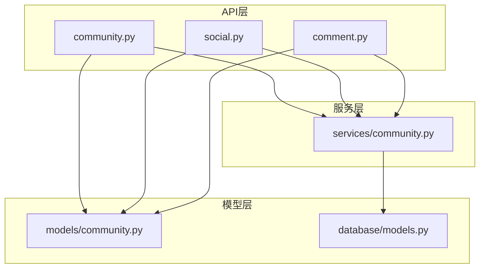

图表来源
- [web/backend/api/community.py:1-120](file://web/backend/api/community.py#L1-L120)
- [web/backend/services/community.py:1-120](file://web/backend/services/community.py#L1-L120)
- [web/backend/models/community.py:1-120](file://web/backend/models/community.py#L1-L120)
- [web/backend/database/models.py:312-477](file://web/backend/database/models.py#L312-L477)

章节来源
- [web/backend/database/models.py:312-477](file://web/backend/database/models.py#L312-L477)
- [web/backend/models/community.py:1-170](file://web/backend/models/community.py#L1-L170)
- [web/backend/services/community.py:1-120](file://web/backend/services/community.py#L1-L120)
- [web/backend/api/community.py:1-120](file://web/backend/api/community.py#L1-L120)

## 核心组件
- Post（帖子）：支持多种媒体类型与结构化字段，含分类、标签、附件、图片、音频、视频、位置、心情、日记日期、私密性、审核状态等
- Comment（评论）：通用页面评论与帖子评论两类
- Like（点赞）：用户与帖子的多对一关系，具备唯一约束防重
- Tag（标签）：全局标签与帖子-标签多对多
- Collection/CollectionItem（收藏夹）：用户级文件夹与条目，支持公开分享
- Bookmark（书签）：用户快速收藏帖子
- UserFollow（关注）：用户间关注关系
- ContentModeration（内容风控）：AI/人工审核记录
- AuditLog（审计日志）：关键操作不可篡改记录

章节来源
- [web/backend/database/models.py:312-560](file://web/backend/database/models.py#L312-L560)
- [web/backend/database/models.py:848-935](file://web/backend/database/models.py#L848-L935)
- [web/backend/models/community.py:61-170](file://web/backend/models/community.py#L61-L170)

## 架构总览
社区数据流从 API 路由进入，调用服务层进行业务处理，最终通过 ORM 访问数据库模型。Pydantic 模型用于输入校验与输出序列化。

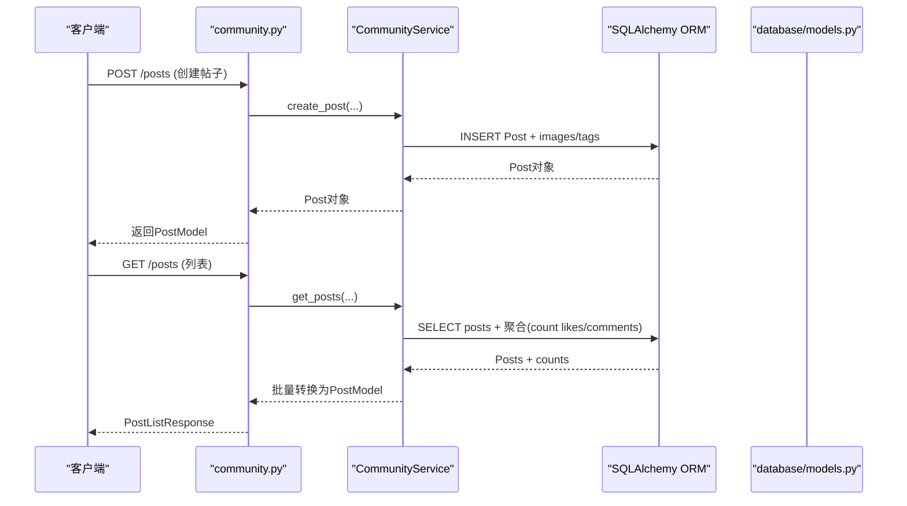

图表来源
- [web/backend/api/community.py:219-354](file://web/backend/api/community.py#L219-L354)
- [web/backend/services/community.py:136-292](file://web/backend/services/community.py#L136-L292)
- [web/backend/database/models.py:312-377](file://web/backend/database/models.py#L312-L377)

## 详细组件分析

### 帖子(Post)与多媒体
- 字段覆盖：标题、HTML内容、Tiptap JSON、内容预览、类型(image/video/text/long/treatment)、视频URL/封面、分类、私密性、草稿过期时间、日记日期/类型、心情、匿名、城市、经纬度、审核状态、阅读数、停留时长
- 多媒体：图片、音频、附件均独立表，按顺序排序
- 结构化治疗分享：JSON字段存储方法、周期、效果评分、费用区间、副作用、VASI评估快照

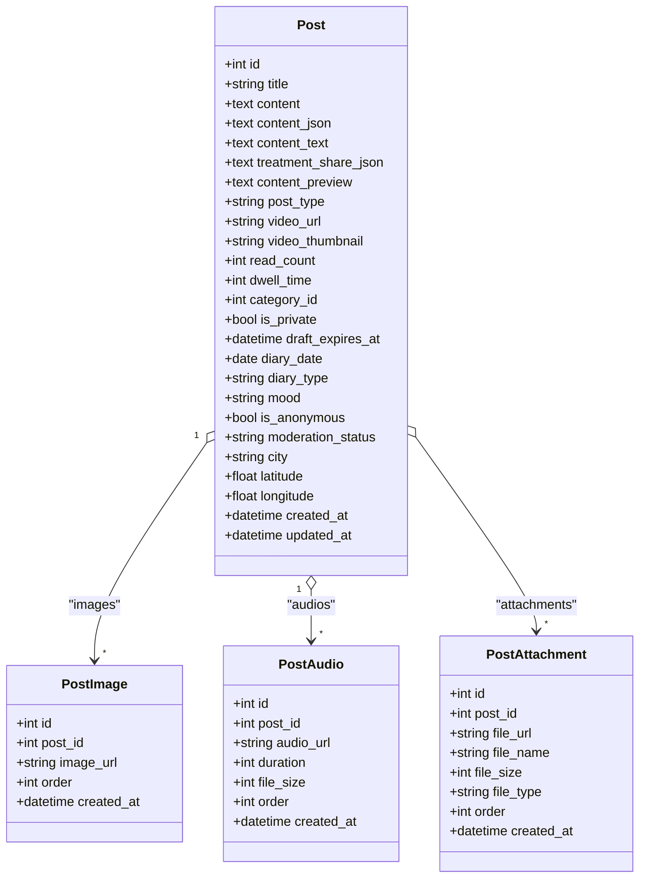

图表来源
- [web/backend/database/models.py:312-377](file://web/backend/database/models.py#L312-L377)
- [web/backend/database/models.py:379-484](file://web/backend/database/models.py#L379-L484)

章节来源
- [web/backend/database/models.py:312-484](file://web/backend/database/models.py#L312-L484)
- [web/backend/models/community.py:88-170](file://web/backend/models/community.py#L88-L170)

### 评论(Comment)
- 通用评论：comments表，支持页面路径索引，需审核
- 帖子评论：post_comments表，与Post和User建立外键关系

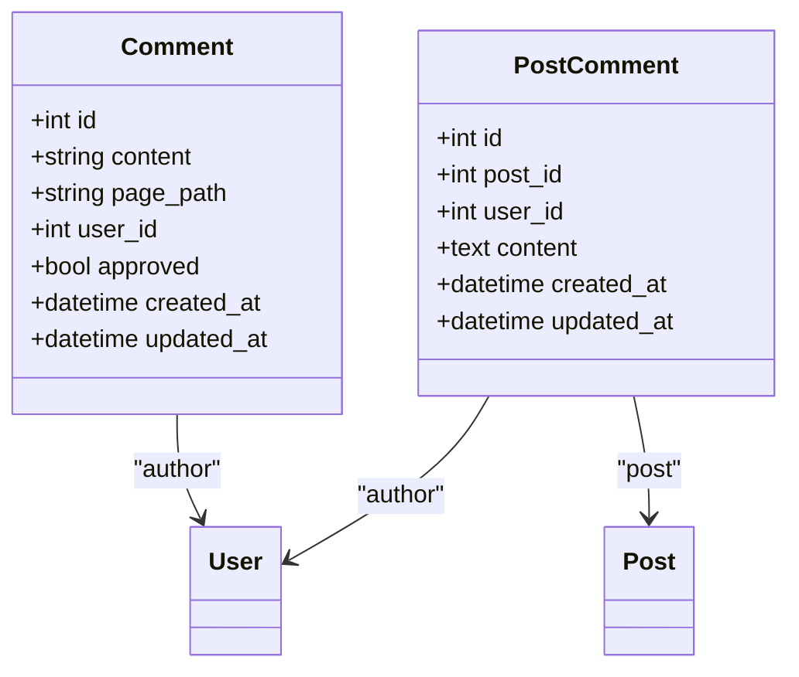

图表来源
- [web/backend/database/models.py:239-253](file://web/backend/database/models.py#L239-L253)
- [web/backend/database/models.py:414-428](file://web/backend/database/models.py#L414-L428)

章节来源
- [web/backend/database/models.py:239-253](file://web/backend/database/models.py#L239-L253)
- [web/backend/database/models.py:414-428](file://web/backend/database/models.py#L414-L428)

### 点赞(Like)
- 唯一约束防止重复点赞，服务层在并发冲突时回滚并重新计算计数

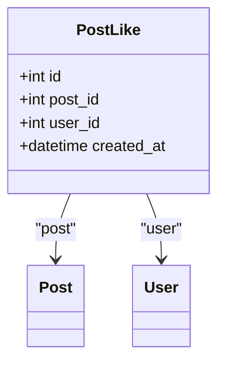

图表来源
- [web/backend/database/models.py:393-412](file://web/backend/database/models.py#L393-L412)

章节来源
- [web/backend/database/models.py:393-412](file://web/backend/database/models.py#L393-L412)

### 标签(Tag)与多对多
- Tag全局唯一，usage_count统计使用次数
- PostTag为中间表，限制post_id+tag_id唯一

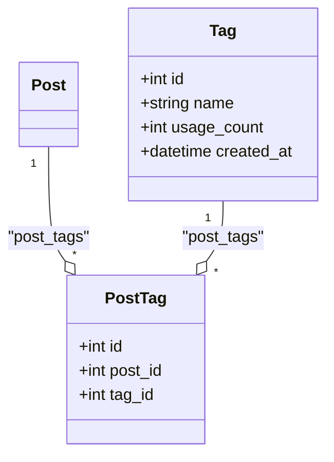

图表来源
- [web/backend/database/models.py:430-451](file://web/backend/database/models.py#L430-L451)

章节来源
- [web/backend/database/models.py:430-451](file://web/backend/database/models.py#L430-L451)

### 收藏夹(Collection/CollectionItem)与书签(Bookmark)
- Collection为用户级文件夹，支持公开分享（share_slug）
- CollectionItem维护集合与帖子的多对多，支持排序与备注
- Bookmark为用户快速收藏，唯一约束(user_id, post_id)

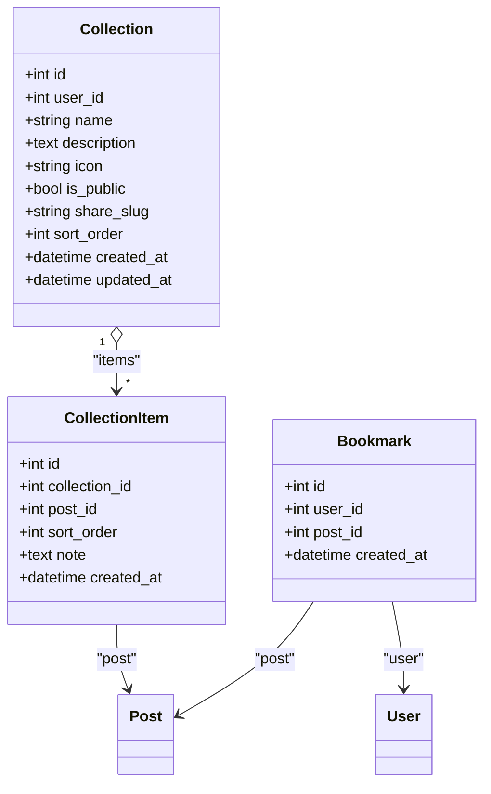

图表来源
- [web/backend/database/models.py:486-526](file://web/backend/database/models.py#L486-L526)
- [web/backend/database/models.py:546-560](file://web/backend/database/models.py#L546-L560)

章节来源
- [web/backend/database/models.py:486-560](file://web/backend/database/models.py#L486-L560)

### 用户关注(UserFollow)与拉黑(UserBlock)
- UserFollow双向唯一约束(followee_id, follower_id)
- UserBlock阻止互动，拉黑自动取关

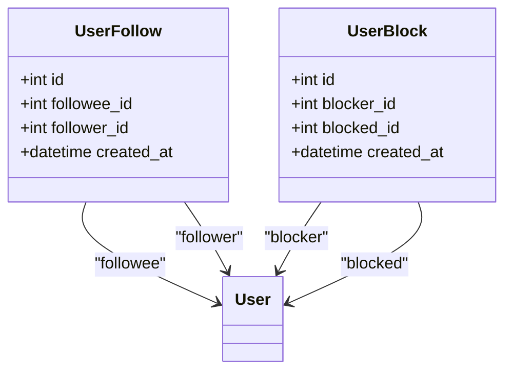

图表来源
- [web/backend/database/models.py:786-824](file://web/backend/database/models.py#L786-L824)

章节来源
- [web/backend/database/models.py:786-824](file://web/backend/database/models.py#L786-L824)

### 内容审核(ContentModeration)与审计(AuditLog)
- ContentModeration记录风险等级、类别、自动动作、AI置信度、审核状态
- AuditLog记录授权/公开操作的不可变历史

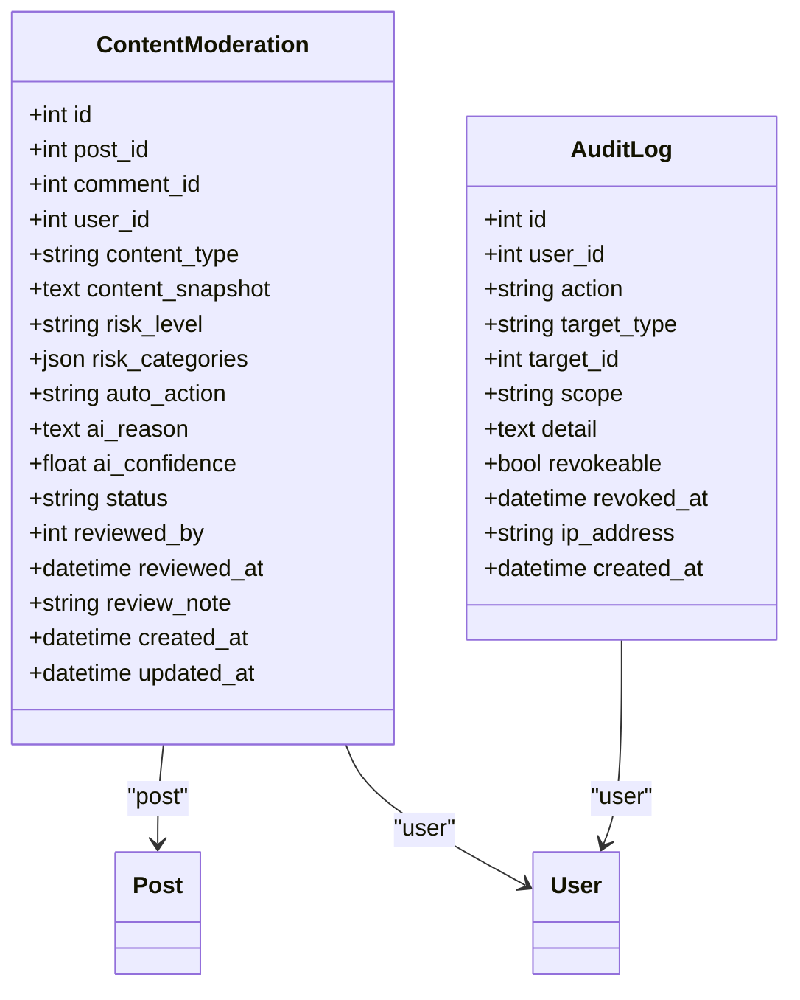

图表来源
- [web/backend/database/models.py:848-897](file://web/backend/database/models.py#L848-L897)
- [web/backend/database/models.py:623-648](file://web/backend/database/models.py#L623-L648)

章节来源
- [web/backend/database/models.py:848-897](file://web/backend/database/models.py#L848-L897)
- [web/backend/database/models.py:623-648](file://web/backend/database/models.py#L623-L648)

### 帖子版本控制(PostVersion)
- 每次更新保存旧版本，包含标题、内容、JSON、编辑摘要

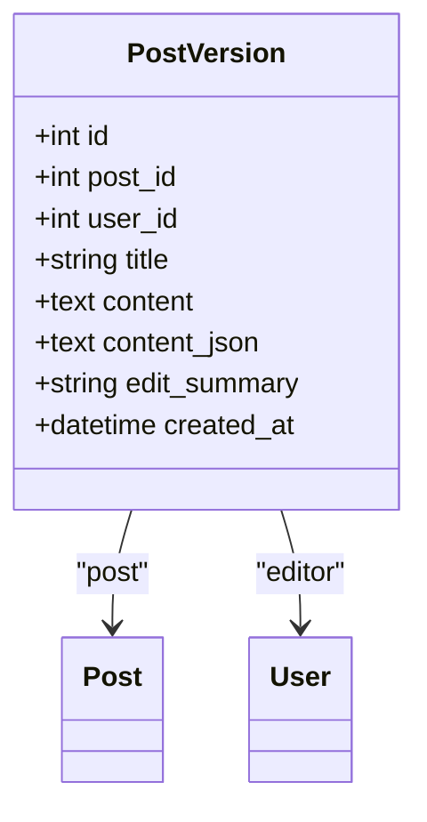

图表来源
- [web/backend/database/models.py:528-544](file://web/backend/database/models.py#L528-L544)

章节来源
- [web/backend/database/models.py:528-544](file://web/backend/database/models.py#L528-L544)

## 依赖关系分析
- API层依赖服务层进行业务逻辑封装，服务层直接操作ORM模型
- Pydantic模型用于API输入输出校验与序列化
- 推荐系统、通知、审计、内容安全等服务被API或服务层调用

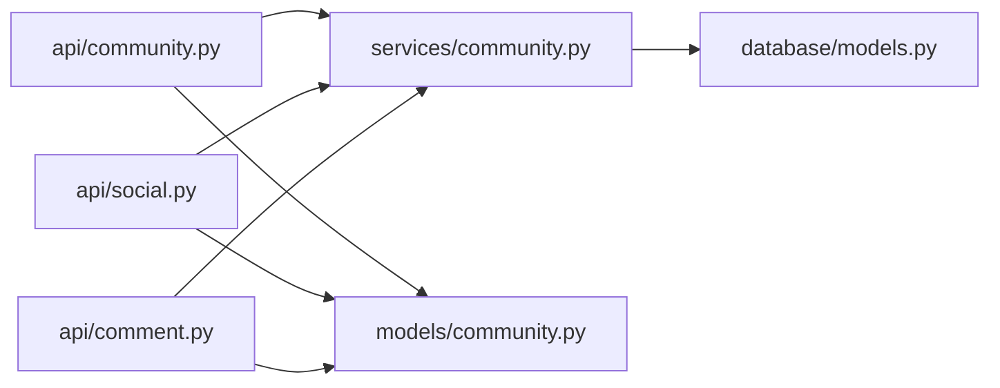

图表来源
- [web/backend/api/community.py:1-60](file://web/backend/api/community.py#L1-L60)
- [web/backend/services/community.py:1-42](file://web/backend/services/community.py#L1-L42)
- [web/backend/database/models.py:1-24](file://web/backend/database/models.py#L1-L24)
- [web/backend/models/community.py:1-20](file://web/backend/models/community.py#L1-L20)

章节来源
- [web/backend/api/community.py:1-60](file://web/backend/api/community.py#L1-L60)
- [web/backend/services/community.py:1-42](file://web/backend/services/community.py#L1-L42)
- [web/backend/database/models.py:1-24](file://web/backend/database/models.py#L1-L24)
- [web/backend/models/community.py:1-20](file://web/backend/models/community.py#L1-L20)

## 性能与并发控制
- 批量转换优化：posts_to_models通过IN查询与group by聚合，将N+1查询降至约8次往返
- 点赞并发：PostLike唯一约束避免重复插入，IntegrityError捕获后回滚并重算计数
- 读取限流：ReadRateLimit保护高频读取接口
- 写入限流：limit_write_for_user限制用户写操作频率

章节来源
- [web/backend/services/community.py:991-1171](file://web/backend/services/community.py#L991-L1171)
- [web/backend/services/community.py:424-454](file://web/backend/services/community.py#L424-L454)
- [web/backend/api/community.py:296-354](file://web/backend/api/community.py#L296-L354)

## 复杂查询与ORM示例

### 分页查询（游标分页）
- 使用after游标基于created_at与id组合条件，避免offset在大表上的性能问题

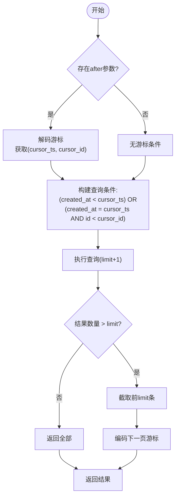

图表来源
- [web/backend/services/community.py:226-292](file://web/backend/services/community.py#L226-L292)

章节来源
- [web/backend/services/community.py:226-292](file://web/backend/services/community.py#L226-L292)

### 关联查询（作者、分类、标签、多媒体）
- 批量预取images/audios/attachments/tags，避免N+1
- 聚合like_count/comment_count/is_liked/is_bookmarked/followed_author

章节来源
- [web/backend/services/community.py:991-1171](file://web/backend/services/community.py#L991-L1171)

### 聚合统计（热门帖子、标签热度）
- 热门帖子：基于RecommendationService.post_score_expr加权排序
- 标签热度：按usage_count降序

章节来源
- [web/backend/services/community.py:277-284](file://web/backend/services/community.py#L277-L284)
- [web/backend/services/community.py:849-850](file://web/backend/services/community.py#L849-L850)

### 用户关注关系查询
- 我关注的用户、关注我的用户、是否已关注

章节来源
- [web/backend/api/social.py:108-155](file://web/backend/api/social.py#L108-L155)
- [web/backend/services/community.py:949-953](file://web/backend/services/community.py#L949-L953)

## 故障排查指南
- 点赞重复：检查PostLike唯一约束与IntegrityError处理
- 权限错误：确认can_access_post逻辑（私密、审核blocked）
- 上传失败：验证文件大小、扩展名、magic byte校验
- 审核标记：检查exaggerated claims检测与moderation_status设置

章节来源
- [web/backend/services/community.py:424-454](file://web/backend/services/community.py#L424-L454)
- [web/backend/services/community.py:529-583](file://web/backend/services/community.py#L529-L583)
- [web/backend/api/community.py:237-293](file://web/backend/api/community.py#L237-L293)

## 结论
Subskin社区数据模型以Post为核心，围绕多媒体、标签、评论、点赞、收藏、关注、审核等构建了完整的社会化内容生态。通过严格的ORM设计与服务层优化，实现了高性能、高一致性的数据处理能力。未来可进一步扩展推荐算法、实时通知与多语言支持。