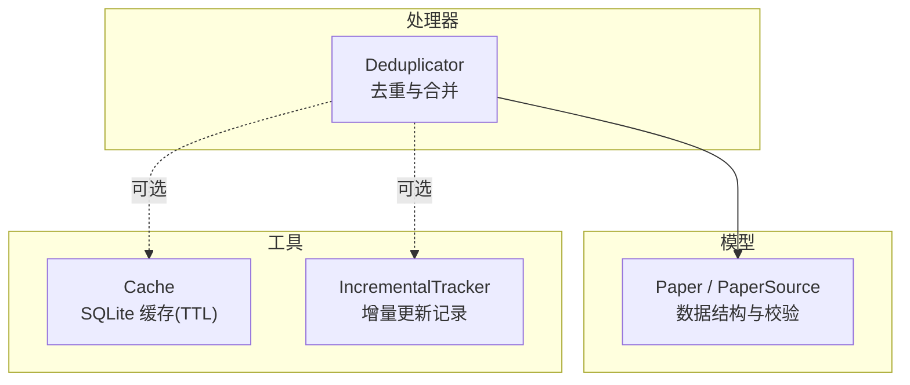
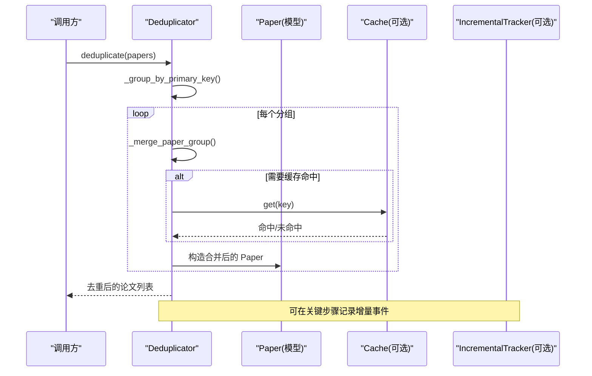
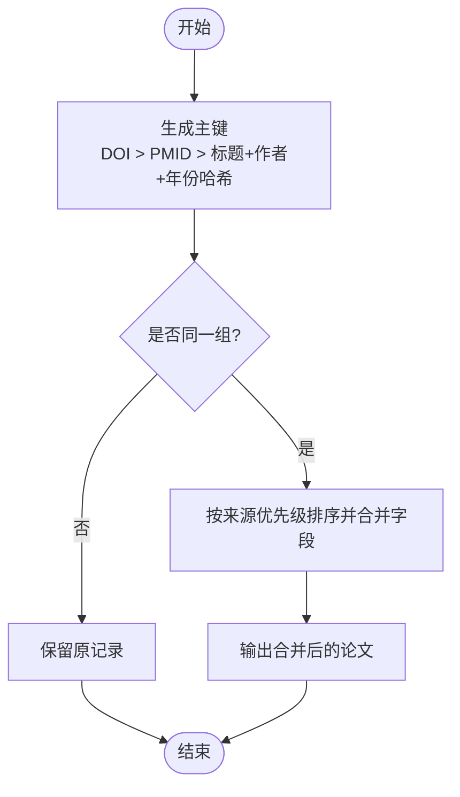
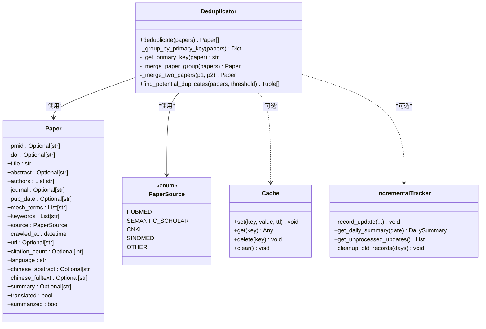

# 内容去重引擎

<cite>
**本文引用的文件**
- [src/processors/deduplicator.py](file://src/processors/deduplicator.py)
- [tests/test_deduplicator.py](file://tests/test_deduplicator.py)
- [src/models/paper.py](file://src/models/paper.py)
- [src/utils/cache.py](file://src/utils/cache.py)
- [src/utils/incremental_tracker.py](file://src/utils/incremental_tracker.py)
</cite>

## 目录
1. [简介](#简介)
2. [项目结构](#项目结构)
3. [核心组件](#核心组件)
4. [架构总览](#架构总览)
5. [详细组件分析](#详细组件分析)
6. [依赖关系分析](#依赖关系分析)
7. [性能与内存优化](#性能与内存优化)
8. [故障排查指南](#故障排查指南)
9. [结论](#结论)
10. [附录：配置、API与扩展指南](#附录：配置api与扩展指南)

## 简介
本技术文档聚焦 Subskin 项目的“内容去重引擎”，围绕论文（Paper）数据的多源采集后的去重与合并能力展开。当前实现以精确标识符为主（DOI、PMID），辅以基于标题、作者、年份的哈希回退分组；提供字段级智能合并策略，支持来源优先级控制，并预留模糊匹配接口用于未来语义相似度扩展。配套工具包括 SQLite 缓存与增量更新追踪，为批量处理、增量更新与并发安全提供基础支撑。

## 项目结构
与去重引擎直接相关的代码位于 src/processors 与 src/models，辅助能力在 src/utils。测试覆盖于 tests/test_deduplicator.py。

图表来源
- [src/processors/deduplicator.py:28-90](file://src/processors/deduplicator.py#L28-L90)
- [src/models/paper.py:9-128](file://src/models/paper.py#L9-L128)
- [src/utils/cache.py:16-147](file://src/utils/cache.py#L16-L147)
- [src/utils/incremental_tracker.py:53-298](file://src/utils/incremental_tracker.py#L53-L298)

章节来源
- [src/processors/deduplicator.py:28-90](file://src/processors/deduplicator.py#L28-L90)
- [src/models/paper.py:9-128](file://src/models/paper.py#L9-L128)
- [src/utils/cache.py:16-147](file://src/utils/cache.py#L16-L147)
- [src/utils/incremental_tracker.py:53-298](file://src/utils/incremental_tracker.py#L53-L298)

## 核心组件
- Deduplicator：负责按主键分组、多源合并与潜在重复检测接口。
- Paper/PaperSource：统一的数据模型与来源枚举，提供字段校验与序列化能力。
- Cache：线程安全的 SQLite 缓存，支持 TTL 与过期清理，可用于 API 响应或中间结果缓存。
- IncrementalTracker：记录每日增量变更，便于通知与审计，支持未处理记录查询与清理。

章节来源
- [src/processors/deduplicator.py:28-319](file://src/processors/deduplicator.py#L28-L319)
- [src/models/paper.py:9-263](file://src/models/paper.py#L9-L263)
- [src/utils/cache.py:16-147](file://src/utils/cache.py#L16-L147)
- [src/utils/incremental_tracker.py:53-298](file://src/utils/incremental_tracker.py#L53-L298)

## 架构总览
去重流程从输入论文列表开始，依据主键分组，再对每组进行字段级合并，最终输出唯一论文集合。可选地，可结合缓存减少重复计算，使用增量追踪记录变更事件。

图表来源
- [src/processors/deduplicator.py:57-90](file://src/processors/deduplicator.py#L57-L90)
- [src/processors/deduplicator.py:92-172](file://src/processors/deduplicator.py#L92-L172)
- [src/utils/cache.py:66-114](file://src/utils/cache.py#L66-L114)
- [src/utils/incremental_tracker.py:100-129](file://src/utils/incremental_tracker.py#L100-L129)

## 详细组件分析

### Deduplicator 类与算法
- 主键生成策略
  - 优先使用 DOI（全局唯一）。
  - 其次使用 PMID（若缺失 DOI）。
  - 回退策略：将标题前缀、首作者、出版年拼接后做 MD5 取前缀作为哈希键，用于无标识符场景的近似分组。
- 分组与合并
  - 按主键分组后，单条直接保留；多条则进入合并流程。
  - 合并时按来源优先级排序（默认 PubMed > Semantic Scholar），以首选来源为基础，逐项合并字段：
    - 标题/摘要：选择更长更完整者。
    - 作者/关键词/MESH：取并集去重。
    - 期刊：优先非空，同有值时优先 PubMed。
    - 出版日期：选择更具体格式（分隔符更多）。
    - 引用数：取最大值。
    - URL：合并不同链接。
    - 语言/状态位：按 OR 逻辑合并。
- 模糊匹配接口
  - 提供 find_potential_duplicates 接口，预留相似度阈值参数，当前返回空列表，待后续实现 Levenshtein/Jaccard 等相似度算法。

图表来源
- [src/processors/deduplicator.py:92-172](file://src/processors/deduplicator.py#L92-L172)
- [src/processors/deduplicator.py:174-285](file://src/processors/deduplicator.py#L174-L285)

章节来源
- [src/processors/deduplicator.py:28-319](file://src/processors/deduplicator.py#L28-L319)
- [tests/test_deduplicator.py:64-315](file://tests/test_deduplicator.py#L64-L315)

### Paper 数据模型
- 标识符：pmid、pmcid、doi。
- 元数据：title、abstract、authors、journal、pub_date、mesh_terms、keywords。
- 来源与时间：source、crawled_at。
- 附加信息：url、full_text_url、citation_count、language。
- 翻译与摘要：chinese_abstract、chinese_fulltext、summary。
- 处理状态：translated、summarized。
- 校验器：对 pub_date、doi、url 进行格式校验与规范化。

章节来源
- [src/models/paper.py:9-263](file://src/models/paper.py#L9-L263)

### 缓存与增量追踪
- Cache
  - 基于 SQLite 的线程安全缓存，支持 TTL 自动清理。
  - 适合缓存外部 API 响应或中间计算结果，降低重复开销。
- IncrementalTracker
  - 记录每日新增/更新/失败等事件，支持按日汇总、未处理查询与历史清理。
  - 通过数据库索引提升查询效率，支持上下文管理器与锁保护。

章节来源
- [src/utils/cache.py:16-147](file://src/utils/cache.py#L16-L147)
- [src/utils/incremental_tracker.py:53-298](file://src/utils/incremental_tracker.py#L53-L298)

## 依赖关系分析
- Deduplicator 依赖 Paper/PaperSource 模型进行数据建模与校验。
- 可选依赖 Cache 与 IncrementalTracker 以提升性能与可观测性。
- 测试用例验证了去重、合并策略与来源优先级等行为。

图表来源
- [src/processors/deduplicator.py:28-319](file://src/processors/deduplicator.py#L28-L319)
- [src/models/paper.py:9-263](file://src/models/paper.py#L9-L263)
- [src/utils/cache.py:16-147](file://src/utils/cache.py#L16-L147)
- [src/utils/incremental_tracker.py:53-298](file://src/utils/incremental_tracker.py#L53-L298)

章节来源
- [src/processors/deduplicator.py:28-319](file://src/processors/deduplicator.py#L28-L319)
- [src/models/paper.py:9-263](file://src/models/paper.py#L9-L263)
- [src/utils/cache.py:16-147](file://src/utils/cache.py#L16-L147)
- [src/utils/incremental_tracker.py:53-298](file://src/utils/incremental_tracker.py#L53-L298)

## 性能与内存优化
- 时间复杂度
  - 分组阶段：O(N)，N 为论文数量，使用字典按主键分组。
  - 合并阶段：每组内两两合并，整体接近 O(N)。
  - 模糊匹配接口：当前未实现，预留 O(N^2) 比较空间，建议后续引入分桶或索引以降低复杂度。
- 内存使用
  - 分组字典占用 O(N) 内存；合并过程创建新对象，注意大文本字段（如摘要、全文路径）的内存占用。
  - 可通过分批处理、流式读取与及时释放引用控制峰值内存。
- 并发安全
  - Cache 与 IncrementalTracker 内部使用线程锁保证并发安全。
  - Deduplicator 本身无共享状态，适合多线程并行调用各自实例。
- 批处理优化
  - 建议按批次（例如每批数千条）调用 deduplicate，避免单次过大列表导致内存抖动。
  - 可结合 Cache 缓存相似查询结果或中间指纹，减少重复计算。
- 增量更新
  - 借助 IncrementalTracker 记录新增/更新/失败事件，配合调度器仅拉取增量数据，降低全量去重压力。

[本节为通用性能讨论，不直接分析具体文件]

## 故障排查指南
- 常见异常
  - 数据序列化失败：当增量追踪写入 change_details 时，若包含不可序列化对象会抛出异常。需确保传入字典可 JSON 序列化。
  - 日期格式错误：Paper 的 pub_date 校验器会尝试解析，若无法识别将保留原值但可能影响后续逻辑。
  - 缓存访问异常：SQLite 连接或锁竞争可能导致短暂阻塞，应合理设置超时与重试。
- 定位方法
  - 检查日志输出，关注去重前后的计数变化与合并细节。
  - 使用增量追踪的未处理查询与按日汇总，确认事件是否被正确处理。
  - 针对模糊匹配问题，先确认主键是否正确生成（DOI/PMID/哈希键）。

章节来源
- [src/utils/incremental_tracker.py:100-129](file://src/utils/incremental_tracker.py#L100-L129)
- [src/models/paper.py:129-187](file://src/models/paper.py#L129-L187)
- [src/utils/cache.py:66-114](file://src/utils/cache.py#L66-L114)

## 结论
当前去重引擎以精确标识符为核心，具备稳定的分组与合并能力，并通过来源优先级保障数据质量。模糊匹配接口已预留，便于后续引入语义相似度计算。配合缓存与增量追踪，可实现高效、可扩展的去重流水线。建议在大规模场景下采用批处理与增量更新策略，并结合监控指标持续优化。

[本节为总结性内容，不直接分析具体文件]

## 附录：配置、API与扩展指南

### 去重器配置示例
- 基本用法
  - 创建 Deduplicator 实例，传入可选的来源优先级与模糊阈值。
  - 调用 deduplicate 方法传入论文列表，获取去重结果。
- 来源优先级
  - 默认顺序：PubMed > Semantic Scholar。
  - 可通过 prefer_source_order 自定义优先级。
- 模糊阈值
  - fuzzy_title_similarity_threshold 用于未来模糊匹配时的相似度阈值（当前未启用）。

章节来源
- [src/processors/deduplicator.py:47-55](file://src/processors/deduplicator.py#L47-L55)
- [src/processors/deduplicator.py:148-156](file://src/processors/deduplicator.py#L148-L156)

### API 接口规范
- 主要方法
  - deduplicate(papers): 去重并合并论文列表。
  - find_potential_duplicates(papers, similarity_threshold): 查找潜在重复对（当前返回空列表）。
- 输入输出
  - 输入：List[Paper]。
  - 输出：List[Paper]（去重后）或 List[Tuple[Paper, Paper, float]]（潜在重复对）。
- 错误处理
  - 输入为空时返回空列表。
  - 合并过程中保持字段完整性，避免数据丢失。

章节来源
- [src/processors/deduplicator.py:57-90](file://src/processors/deduplicator.py#L57-L90)
- [src/processors/deduplicator.py:287-306](file://src/processors/deduplicator.py#L287-L306)

### 扩展开发指南
- 语义相似度计算
  - 在 find_potential_duplicates 中实现标题与作者的相似度算法（如 Levenshtein、Jaccard 或向量相似度）。
  - 结合 fuzzy_title_similarity_threshold 控制误判率。
- 指纹生成策略
  - 除现有哈希键外，可增加基于摘要或关键词的指纹，用于跨语言或跨格式内容的近似匹配。
- 增量更新机制
  - 在每次去重前后记录增量事件（新增、更新、失败），便于审计与通知。
  - 结合调度器仅处理增量数据，降低全量去重成本。
- 批量处理与并发
  - 将大批量数据切分为小批次，逐批去重，避免内存峰值过高。
  - 多线程或多进程并行处理不同批次，利用 Cache 与 IncrementalTracker 的并发安全特性。

章节来源
- [src/processors/deduplicator.py:287-306](file://src/processors/deduplicator.py#L287-L306)
- [src/utils/incremental_tracker.py:100-129](file://src/utils/incremental_tracker.py#L100-L129)
- [src/utils/cache.py:66-114](file://src/utils/cache.py#L66-L114)