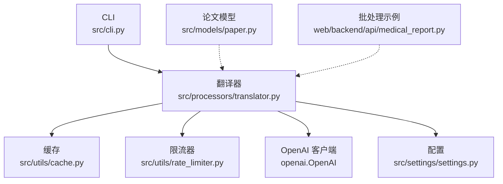
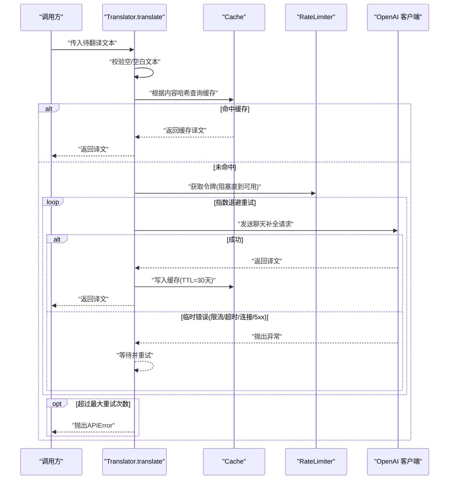
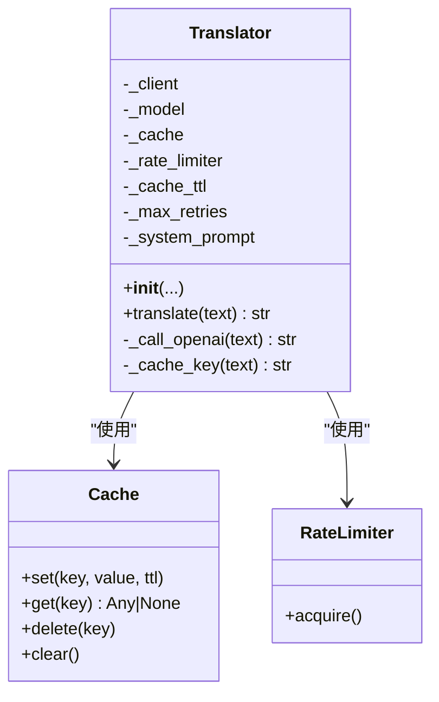
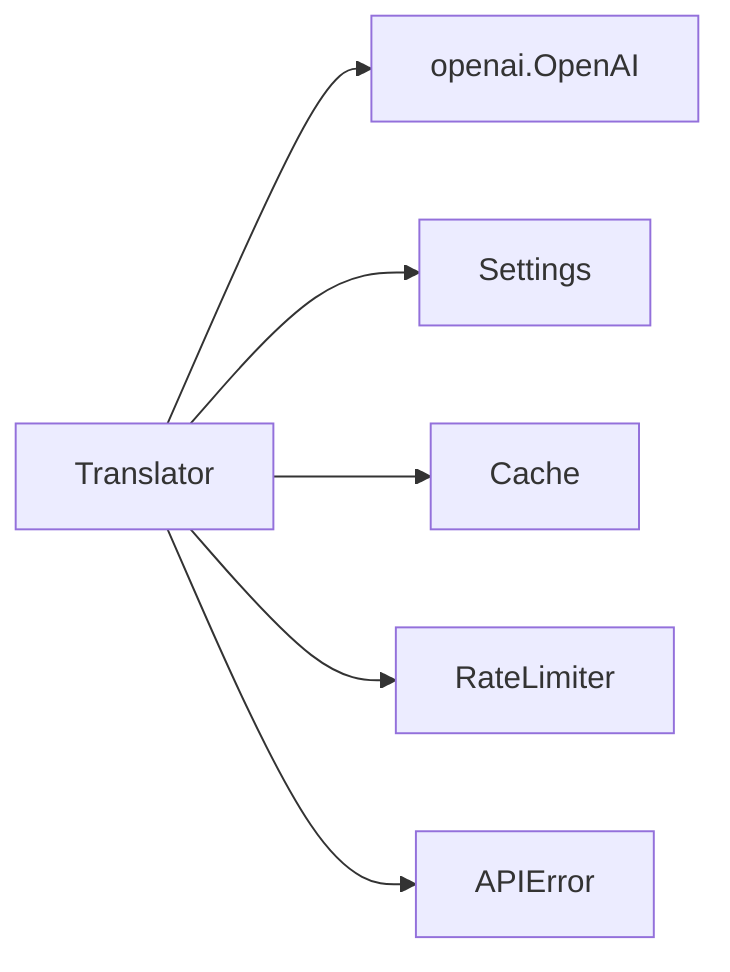

# 多语言翻译服务

<cite>
**本文引用的文件**
- [src/processors/translator.py](file://src/processors/translator.py)
- [tests/test_translator.py](file://tests/test_translator.py)
- [src/utils/cache.py](file://src/utils/cache.py)
- [src/utils/rate_limiter.py](file://src/utils/rate_limiter.py)
- [src/settings/settings.py](file://src/settings/settings.py)
- [src/config.py](file://src/config.py)
- [src/models/paper.py](file://src/models/paper.py)
- [src/cli.py](file://src/cli.py)
- [web/backend/api/medical_report.py](file://web/backend/api/medical_report.py)
- [data/llm_config_backup.json](file://data/llm_config_backup.json)
</cite>

## 目录
1. [简介](#简介)
2. [项目结构](#项目结构)
3. [核心组件](#核心组件)
4. [架构总览](#架构总览)
5. [详细组件分析](#详细组件分析)
6. [依赖关系分析](#依赖关系分析)
7. [性能与内存优化](#性能与内存优化)
8. [故障排查指南](#故障排查指南)
9. [结论](#结论)
10. [附录：API与配置规范](#附录api与配置规范)

## 简介
本技术文档围绕 Subskin 的多语言翻译服务展开，重点说明基于 OpenAI 兼容接口的医学摘要英译中能力，包括：
- 模型配置与切换（OpenAI、火山引擎）
- 缓存策略与限流机制
- 重试与错误恢复
- 批量处理思路与现有集成点
- 质量评估、上下文保持与本地化适配建议
- 监控指标与扩展开发指南

该服务当前以单条文本翻译为核心能力，并通过 CLI 与导出器形成“采集—翻译—导出”的流水线雏形。

## 项目结构
与翻译相关的代码主要分布在以下位置：
- 翻译核心：src/processors/translator.py
- 缓存与限流：src/utils/cache.py、src/utils/rate_limiter.py
- 配置中心：src/settings/settings.py（含火山引擎等设置）
- 数据模型：src/models/paper.py（包含翻译结果字段）
- 命令行入口：src/cli.py（集成 Translator）
- 批处理参考：web/backend/api/medical_report.py（展示按批次处理的模式）
- LLM 配置备份：data/llm_config_backup.json（展示模块级 provider/model/base_url 配置方式）

图表来源
- [src/processors/translator.py:100-132](file://src/processors/translator.py#L100-L132)
- [src/utils/cache.py:16-114](file://src/utils/cache.py#L16-L114)
- [src/utils/rate_limiter.py:10-57](file://src/utils/rate_limiter.py#L10-L57)
- [src/settings/settings.py:275-287](file://src/settings/settings.py#L275-L287)
- [src/models/paper.py:94-127](file://src/models/paper.py#L94-L127)
- [web/backend/api/medical_report.py:521-558](file://web/backend/api/medical_report.py#L521-L558)

章节来源
- [src/processors/translator.py:1-251](file://src/processors/translator.py#L1-L251)
- [src/utils/cache.py:1-147](file://src/utils/cache.py#L1-L147)
- [src/utils/rate_limiter.py:1-81](file://src/utils/rate_limiter.py#L1-L81)
- [src/settings/settings.py:1-328](file://src/settings/settings.py#L1-L328)
- [src/models/paper.py:68-165](file://src/models/paper.py#L68-L165)
- [src/cli.py:96-109](file://src/cli.py#L96-L109)
- [web/backend/api/medical_report.py:521-558](file://web/backend/api/medical_report.py#L521-L558)

## 核心组件
- 翻译器 Translator：封装 OpenAI 兼容聊天接口调用，内置系统提示词、重试、缓存与限流。
- 缓存 Cache：线程安全的 SQLite 缓存，支持 TTL 自动清理。
- 限流器 RateLimiter：令牌桶算法实现，控制 API 请求速率。
- 配置 Settings：集中管理环境变量与 .env，支持 OpenAI 与火山引擎双通道。
- 论文模型 Paper：承载原文与中文翻译结果字段，便于后续导出与归档。
- CLI：提供数据处理入口，已导入 Translator，具备扩展为批量翻译的潜力。

章节来源
- [src/processors/translator.py:65-132](file://src/processors/translator.py#L65-L132)
- [src/utils/cache.py:16-114](file://src/utils/cache.py#L16-L114)
- [src/utils/rate_limiter.py:10-57](file://src/utils/rate_limiter.py#L10-L57)
- [src/settings/settings.py:38-41](file://src/settings/settings.py#L38-L41)
- [src/settings/settings.py:275-287](file://src/settings/settings.py#L275-L287)
- [src/models/paper.py:94-127](file://src/models/paper.py#L94-L127)
- [src/cli.py:13-23](file://src/cli.py#L13-L23)

## 架构总览
翻译服务采用“输入校验 → 缓存命中 → 限流 → 重试调用 → 缓存落盘 → 返回结果”的清晰流程，确保高可用与可观测性。

图表来源
- [src/processors/translator.py:195-250](file://src/processors/translator.py#L195-L250)
- [src/utils/cache.py:66-114](file://src/utils/cache.py#L66-L114)
- [src/utils/rate_limiter.py:43-57](file://src/utils/rate_limiter.py#L43-L57)

## 详细组件分析

### 翻译器 Translator
- 多模型与后端切换：优先使用火山引擎（若配置），否则回退到 OpenAI；支持自定义 base_url 与 model。
- 系统提示词：针对医学摘要翻译定制，强调术语准确性、可读性与完整性。
- 重试策略：对限流、超时、连接失败、服务端错误进行指数退避重试，默认最多 3 次。
- 缓存键：基于 SHA-256 生成确定性键，避免重复请求。
- 限流：默认 10 次/分钟，通过令牌桶控制并发。
- 错误处理：非重试错误包装为 APIError，保留原始异常链以便诊断。

图表来源
- [src/processors/translator.py:65-132](file://src/processors/translator.py#L65-L132)
- [src/utils/cache.py:16-114](file://src/utils/cache.py#L16-L114)
- [src/utils/rate_limiter.py:10-57](file://src/utils/rate_limiter.py#L10-L57)

章节来源
- [src/processors/translator.py:39-63](file://src/processors/translator.py#L39-L63)
- [src/processors/translator.py:100-132](file://src/processors/translator.py#L100-L132)
- [src/processors/translator.py:134-193](file://src/processors/translator.py#L134-L193)
- [src/processors/translator.py:195-250](file://src/processors/translator.py#L195-L250)

### 缓存 Cache
- 存储介质：SQLite，支持进程内内存数据库或持久化文件。
- 线程安全：读写加锁，保证并发安全。
- TTL 过期：访问时清理过期条目，减少脏读。
- 序列化：JSON 序列化任意可序列化的值。

章节来源
- [src/utils/cache.py:16-114](file://src/utils/cache.py#L16-L114)

### 限流器 RateLimiter
- 算法：令牌桶，按秒粒度补充令牌。
- 行为：acquire 阻塞直到获得令牌，避免突发流量打满下游。
- 适用场景：保护第三方 API 配额与稳定性。

章节来源
- [src/utils/rate_limiter.py:10-57](file://src/utils/rate_limiter.py#L10-L57)

### 配置 Settings
- 环境变量与 .env：统一加载，支持类型校验与缺失检查。
- 翻译相关：
  - OPENAI_API_KEY：OpenAI 密钥
  - VOLCENGINE_API_KEY / BASE_URL / MODEL：火山引擎密钥、基地址与模型名
- 其他：日志级别、任务并发、健康检查与指标端口等。

章节来源
- [src/settings/settings.py:38-41](file://src/settings/settings.py#L38-L41)
- [src/settings/settings.py:275-287](file://src/settings/settings.py#L275-L287)
- [src/settings/settings.py:101-102](file://src/settings/settings.py#L101-L102)
- [src/settings/settings.py:194-203](file://src/settings/settings.py#L194-L203)

### 数据模型 Paper
- 字段：包含英文摘要、中文摘要、全文中文翻译、是否已翻译等，便于后续导出与统计。
- 用途：作为翻译结果的载体，配合导出器输出 Markdown/JSON。

章节来源
- [src/models/paper.py:94-127](file://src/models/paper.py#L94-L127)

### CLI 与批处理
- CLI 已导入 Translator，process 命令预留了“翻译+总结”的处理管线入口。
- 批处理参考：web/backend/api/medical_report.py 展示了将大量页面按固定批次（如每批 8 页）调用的模式，可借鉴用于翻译任务的批量拆分与进度上报。

章节来源
- [src/cli.py:96-109](file://src/cli.py#L96-L109)
- [web/backend/api/medical_report.py:521-558](file://web/backend/api/medical_report.py#L521-L558)

## 依赖关系分析
- 外部依赖：openai SDK、tenacity（重试）、sqlite3（缓存）。
- 内部依赖：settings（配置）、exceptions（错误类型）、utils（缓存/限流）。
- 耦合度：Translator 与 OpenAI 客户端松耦合，可通过 base_url 与 model 灵活替换后端；与缓存/限流通过接口组合，易于替换实现。

图表来源
- [src/processors/translator.py:100-132](file://src/processors/translator.py#L100-L132)
- [src/utils/cache.py:16-114](file://src/utils/cache.py#L16-L114)
- [src/utils/rate_limiter.py:10-57](file://src/utils/rate_limiter.py#L10-L57)
- [src/settings/settings.py:275-287](file://src/settings/settings.py#L275-L287)
- [src/exceptions.py:29-39](file://src/exceptions.py#L29-L39)

章节来源
- [src/processors/translator.py:100-132](file://src/processors/translator.py#L100-L132)
- [src/exceptions.py:13-39](file://src/exceptions.py#L13-L39)

## 性能与内存优化
- 缓存命中率：相同文本复用缓存，默认 TTL 30 天，显著降低重复请求。
- 限流保护：令牌桶平滑请求，避免触发上游限流导致整体抖动。
- 重试退避：指数退避降低瞬时失败影响，提高成功率。
- 内存占用：
  - 缓存默认使用内存数据库，适合短生命周期任务；生产环境建议切换到磁盘 SQLite 文件以降低内存压力。
  - 大文本翻译时注意单次请求体大小，必要时在应用层做分块与合并。
- 并发与吞吐：
  - 通过 RateLimiter 控制 QPS；如需更高吞吐，可在上层引入队列与多进程/多线程并行，但需结合上游配额限制。
- 监控指标建议：
  - 缓存命中率、平均延迟、P95/P99 延迟、重试次数、失败率、QPS、Token 消耗（若可用）。

[本节为通用指导，不直接分析具体文件]

## 故障排查指南
- 无 API Key：初始化时报错，需设置 OPENAI_API_KEY 或 VOLCENGINE_API_KEY。
- 空输入：translate 会拒绝空或纯空白文本。
- 无有效响应：当 choices 为空或内容为空时抛出 APIError。
- 网络/配额问题：限流、超时、连接失败、5xx 会触发重试；超过最大重试次数后抛出 APIError。
- 缓存异常：SQLite 写入/读取异常会被上层捕获，建议在部署时启用持久化路径并定期维护。

章节来源
- [src/processors/translator.py:111-124](file://src/processors/translator.py#L111-L124)
- [src/processors/translator.py:186-193](file://src/processors/translator.py#L186-L193)
- [src/processors/translator.py:232-245](file://src/processors/translator.py#L232-L245)
- [src/exceptions.py:29-39](file://src/exceptions.py#L29-L39)

## 结论
Subskin 的翻译服务以简洁可靠的单条翻译为核心，具备：
- 多后端切换（OpenAI/火山引擎）
- 完善的缓存、限流与重试机制
- 清晰的错误分类与可观测性基础
- 可扩展的批处理与导出链路

在生产环境中，建议：
- 使用持久化缓存与监控指标
- 引入队列与批处理逻辑，提升吞吐与容错
- 建立质量评估与回滚策略，保障翻译一致性

[本节为总结性内容，不直接分析具体文件]

## 附录：API与配置规范

### 翻译 API 接口规范（概念）
- 输入：待翻译文本（字符串）
- 输出：翻译结果（字符串）
- 错误：
  - 参数错误：空文本
  - 服务错误：APIError（包含原因链）
- 行为：
  - 命中缓存直接返回
  - 未命中则限流后调用上游，成功后写缓存

[本节为概念性说明，不直接映射具体文件]

### 配置选项说明
- OPENAI_API_KEY：OpenAI 密钥（可选，若未配置火山引擎时使用）
- VOLCENGINE_API_KEY：火山引擎密钥（优先级高于 OpenAI）
- VOLCENGINE_BASE_URL：火山引擎基地址
- VOLCENGINE_MODEL：火山引擎模型名
- LOG_LEVEL：日志级别
- METRICS_ENABLED/METRICS_PORT：指标开关与端口

章节来源
- [src/settings/settings.py:38-41](file://src/settings/settings.py#L38-L41)
- [src/settings/settings.py:275-287](file://src/settings/settings.py#L275-L287)
- [src/settings/settings.py:101-102](file://src/settings/settings.py#L101-L102)
- [src/settings/settings.py:194-203](file://src/settings/settings.py#L194-L203)

### 批量翻译处理能力
- 当前 Translator 面向单条文本；批量能力可在上层实现：
  - 将大批量文本拆分为小批次（参考 OCR 批处理模式）
  - 逐条调用 translate，聚合结果并记录进度
  - 结合缓存与限流，避免重复与超限
- 数据模型 Paper 已包含中文翻译字段，便于批量处理后落库与导出。

章节来源
- [web/backend/api/medical_report.py:521-558](file://web/backend/api/medical_report.py#L521-L558)
- [src/models/paper.py:94-127](file://src/models/paper.py#L94-L127)

### 翻译质量评估机制（建议）
- 规则校验：术语一致性、长度比例、标点与格式检查
- 抽样人工复核：对关键段落进行专家抽检
- 自动化评分：利用另一模型对译文进行打分（需额外服务）
- 回归测试：构建基准集，持续评估版本变更影响

[本节为通用建议，不直接分析具体文件]

### 上下文保持策略（建议）
- 段落级上下文：对长文分段翻译，并在段首注入必要背景
- 术语表：维护领域术语对照表，在 prompt 中约束翻译一致性
- 风格模板：针对不同文体（摘要、正文、科普）使用不同 system prompt

[本节为通用建议，不直接分析具体文件]

### 本地化适配方案（建议）
- 术语本地化：结合目标读者群体调整表达风格
- 单位与日期：转换为本地习惯格式
- 免责声明：在输出末尾附加医疗免责声明

[本节为通用建议，不直接分析具体文件]

### 缓存策略与内存管理
- 缓存键：基于内容哈希，确保确定性
- TTL：默认 30 天，可按业务调整
- 存储：建议使用磁盘 SQLite 文件，避免重启丢失
- 清理：访问时自动清理过期条目，减少维护成本

章节来源
- [src/processors/translator.py:134-147](file://src/processors/translator.py#L134-L147)
- [src/utils/cache.py:54-114](file://src/utils/cache.py#L54-L114)

### 错误恢复机制
- 重试：对限流、超时、连接、5xx 进行指数退避重试
- 降级：达到最大重试次数后抛出 APIError，由上层决定重试或告警
- 可观测：记录重试次数与失败原因，便于定位问题

章节来源
- [src/processors/translator.py:232-245](file://src/processors/translator.py#L232-L245)
- [src/exceptions.py:29-39](file://src/exceptions.py#L29-L39)

### 性能监控指标（建议）
- 请求级：QPS、延迟分布、重试次数、失败率
- 缓存级：命中率、过期数、写入失败数
- 资源级：内存占用、SQLite 文件大小
- 业务级：翻译完成数量、耗时、错误样本占比

[本节为通用建议，不直接分析具体文件]

### 扩展开发指南
- 新增后端：实现统一的 OpenAI 兼容接口即可接入新供应商
- 自定义缓存：替换 Cache 为 Redis 等分布式缓存
- 自定义限流：替换 RateLimiter 为分布式令牌桶
- 批量流水线：在上层实现任务队列与进度上报，结合 Paper 模型持久化

[本节为通用建议，不直接分析具体文件]