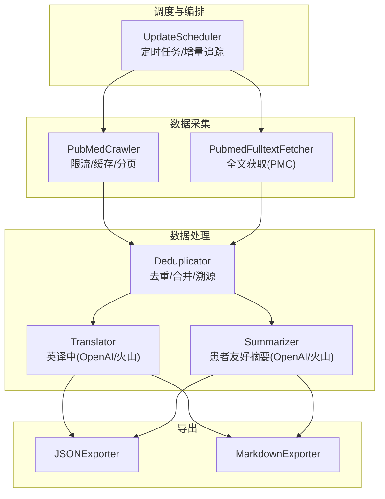
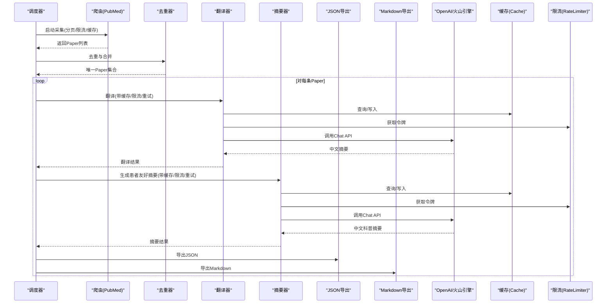
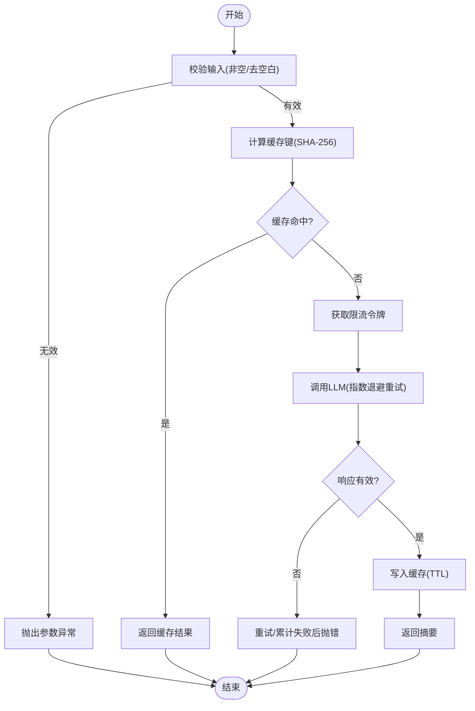
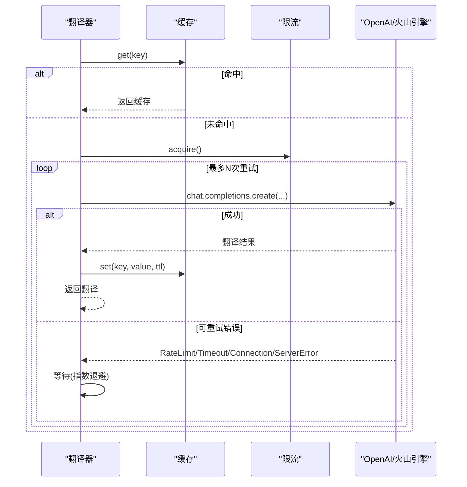
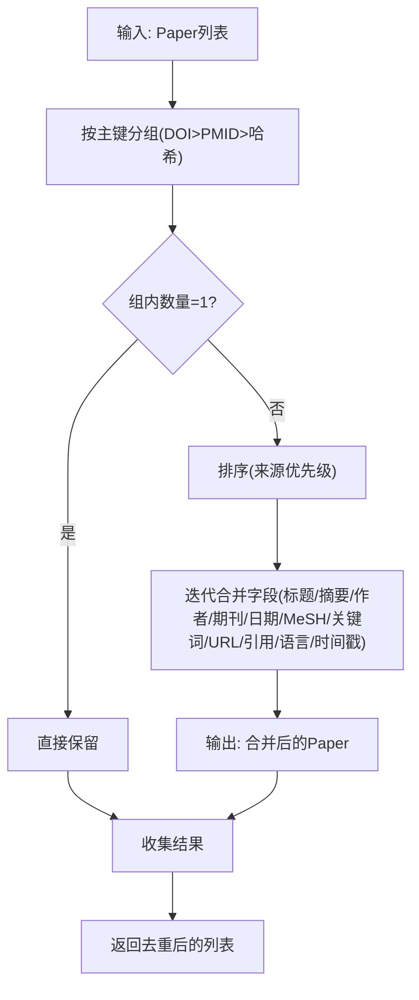
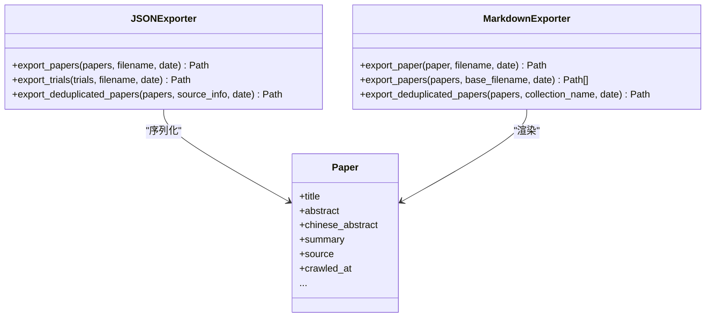
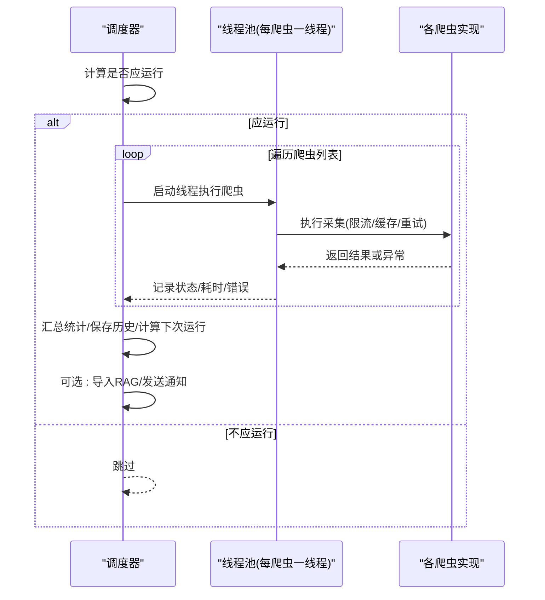
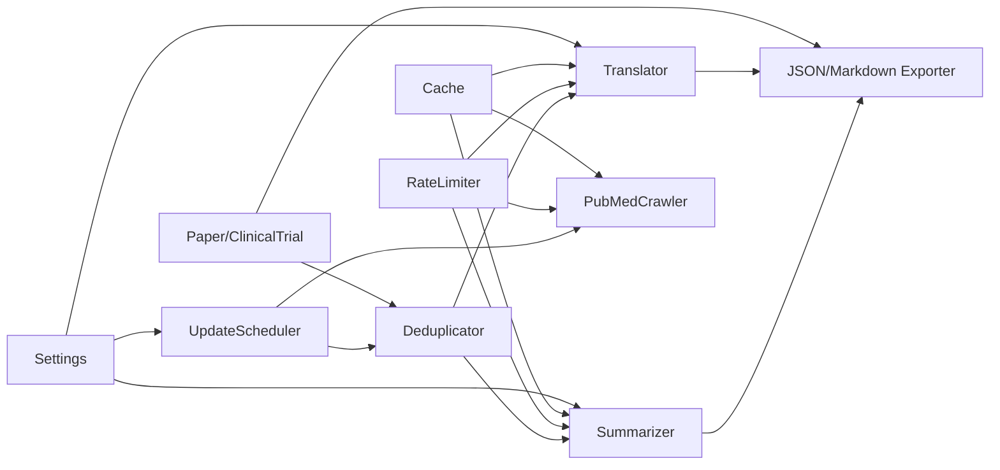

# 数据处理流水线

<cite>
**本文引用的文件**
- [src/processors/summarizer.py](file://src/processors/summarizer.py)
- [src/processors/translator.py](file://src/processors/translator.py)
- [src/processors/deduplicator.py](file://src/processors/deduplicator.py)
- [src/exporters/json_exporter.py](file://src/exporters/json_exporter.py)
- [src/exporters/markdown_exporter.py](file://src/exporters/markdown_exporter.py)
- [src/models/paper.py](file://src/models/paper.py)
- [src/utils/cache.py](file://src/utils/cache.py)
- [src/utils/rate_limiter.py](file://src/utils/rate_limiter.py)
- [src/config.py](file://src/config.py)
- [src/exceptions.py](file://src/exceptions.py)
- [src/settings/settings.py](file://src/settings/settings.py)
- [src/crawlers/pubmed_crawler.py](file://src/crawlers/pubmed_crawler.py)
- [src/scheduler/update_scheduler.py](file://src/scheduler/update_scheduler.py)
- [tests/test_summarizer.py](file://tests/test_summarizer.py)
- [tests/test_translator.py](file://tests/test_translator.py)
- [tests/test_deduplicator.py](file://tests/test_deduplicator.py)
</cite>

## 目录
1. [简介](#简介)
2. [项目结构](#项目结构)
3. [核心组件](#核心组件)
4. [架构总览](#架构总览)
5. [详细组件分析](#详细组件分析)
6. [依赖关系分析](#依赖关系分析)
7. [性能与内存优化](#性能与内存优化)
8. [故障排查指南](#故障排查指南)
9. [结论](#结论)
10. [附录：扩展与调优](#附录：扩展与调优)

## 简介
本技术文档围绕 Subskin 的数据处理流水线，系统阐述从数据抓取、清洗、去重、翻译、摘要生成到导出的完整流程。重点覆盖以下方面：
- 文本摘要生成算法（面向患者的中文科普摘要）
- 多语言翻译服务（英文医学论文摘要到中文）
- 内容去重机制（基于 DOI/PMID 及标题作者哈希的合并策略）
- 质量评估标准（字段完整性、来源优先级、可追溯性）
- 数据清洗与格式转换（JSON/Markdown 导出）
- AI 模型集成（OpenAI 与火山引擎 OpenAI 兼容 API）
- 批量处理能力、限流与缓存、错误恢复与重试
- 处理器扩展开发指南、性能调优策略与故障排查方法

## 项目结构
Subskin 的数据处理流水线由“调度器 + 爬虫 + 处理器 + 导出器”构成，辅以配置、异常、缓存与限流等通用能力。

图表来源
- [src/scheduler/update_scheduler.py:218-381](file://src/scheduler/update_scheduler.py#L218-L381)
- [src/crawlers/pubmed_crawler.py:129-200](file://src/crawlers/pubmed_crawler.py#L129-L200)
- [src/processors/deduplicator.py:57-90](file://src/processors/deduplicator.py#L57-L90)
- [src/processors/translator.py:195-251](file://src/processors/translator.py#L195-L251)
- [src/processors/summarizer.py:204-247](file://src/processors/summarizer.py#L204-L247)
- [src/exporters/json_exporter.py:41-120](file://src/exporters/json_exporter.py#L41-L120)
- [src/exporters/markdown_exporter.py:170-284](file://src/exporters/markdown_exporter.py#L170-L284)

章节来源
- [src/scheduler/update_scheduler.py:218-381](file://src/scheduler/update_scheduler.py#L218-L381)
- [src/crawlers/pubmed_crawler.py:129-200](file://src/crawlers/pubmed_crawler.py#L129-L200)
- [src/processors/deduplicator.py:57-90](file://src/processors/deduplicator.py#L57-L90)
- [src/processors/translator.py:195-251](file://src/processors/translator.py#L195-L251)
- [src/processors/summarizer.py:204-247](file://src/processors/summarizer.py#L204-L247)
- [src/exporters/json_exporter.py:41-120](file://src/exporters/json_exporter.py#L41-L120)
- [src/exporters/markdown_exporter.py:170-284](file://src/exporters/markdown_exporter.py#L170-L284)

## 核心组件
- 调度器：负责周期性执行采集任务、记录状态、统计结果并触发后续导入与通知。
- 爬虫：以 PubMed 为主，支持分页、限流、缓存与重试；另含全文抓取。
- 处理器：
  - 去重：按 DOI > PMID > 标题+作者+年份哈希分组，合并元数据并保留来源信息。
  - 翻译：调用 OpenAI/火山引擎 Chat API，具备缓存、限流与指数退避重试。
  - 摘要：生成患者友好的中文科普摘要，遵循固定提示词与免责声明。
- 导出器：将结构化数据导出为 JSON 或 Markdown（含 YAML frontmatter），便于知识库与文档站点使用。
- 基础设施：
  - 配置：集中管理环境变量与默认值（含 LLM 提供商切换）。
  - 缓存：SQLite 持久化缓存，支持 TTL 与线程安全。
  - 限流：令牌桶算法实现请求速率控制。
  - 异常：统一的自定义异常体系。

章节来源
- [src/scheduler/update_scheduler.py:218-381](file://src/scheduler/update_scheduler.py#L218-L381)
- [src/crawlers/pubmed_crawler.py:129-200](file://src/crawlers/pubmed_crawler.py#L129-L200)
- [src/processors/deduplicator.py:57-90](file://src/processors/deduplicator.py#L57-L90)
- [src/processors/translator.py:195-251](file://src/processors/translator.py#L195-L251)
- [src/processors/summarizer.py:204-247](file://src/processors/summarizer.py#L204-L247)
- [src/exporters/json_exporter.py:41-120](file://src/exporters/json_exporter.py#L41-L120)
- [src/exporters/markdown_exporter.py:170-284](file://src/exporters/markdown_exporter.py#L170-L284)
- [src/settings/settings.py:17-328](file://src/settings/settings.py#L17-L328)
- [src/utils/cache.py:16-147](file://src/utils/cache.py#L16-L147)
- [src/utils/rate_limiter.py:10-81](file://src/utils/rate_limiter.py#L10-L81)
- [src/exceptions.py:13-39](file://src/exceptions.py#L13-L39)

## 架构总览
下图展示了从调度到导出的端到端数据流，以及关键的外部依赖（LLM 提供商、NCBI/PubMed 等）。

图表来源
- [src/scheduler/update_scheduler.py:218-381](file://src/scheduler/update_scheduler.py#L218-L381)
- [src/crawlers/pubmed_crawler.py:129-200](file://src/crawlers/pubmed_crawler.py#L129-L200)
- [src/processors/deduplicator.py:57-90](file://src/processors/deduplicator.py#L57-L90)
- [src/processors/translator.py:195-251](file://src/processors/translator.py#L195-L251)
- [src/processors/summarizer.py:204-247](file://src/processors/summarizer.py#L204-L247)
- [src/exporters/json_exporter.py:41-120](file://src/exporters/json_exporter.py#L41-L120)
- [src/exporters/markdown_exporter.py:170-284](file://src/exporters/markdown_exporter.py#L170-L284)

## 详细组件分析

### 文本摘要生成（Summarizer）
- 功能要点
  - 面向患者的中文科普摘要，强调治疗方法、结果与结论，附带免责声明。
  - 自动选择 LLM 后端：优先火山引擎（若配置），否则回退到 OpenAI。
  - 内置缓存键（SHA-256）、令牌桶限流、指数退避重试。
- 关键流程
  - 输入校验 → 缓存命中检查 → 限流 → 调用 Chat API → 缓存写入 → 返回结果。
- 错误处理
  - 空输入抛出参数异常；API 临时错误（连接、超时、限流）进行重试；最终失败抛出专用异常。
- 测试覆盖
  - 验证空输入、缓存命中/未命中、提示词注入、重试行为等。

图表来源
- [src/processors/summarizer.py:204-247](file://src/processors/summarizer.py#L204-L247)
- [src/utils/cache.py:66-114](file://src/utils/cache.py#L66-L114)
- [src/utils/rate_limiter.py:43-57](file://src/utils/rate_limiter.py#L43-L57)

章节来源
- [src/processors/summarizer.py:204-247](file://src/processors/summarizer.py#L204-L247)
- [tests/test_summarizer.py:63-200](file://tests/test_summarizer.py#L63-L200)

### 多语言翻译服务（Translator）
- 功能要点
  - 将英文医学论文摘要翻译为中文，保持术语准确性与可读性。
  - 同样支持火山引擎/OpenAI 双后端，具备缓存、限流与指数退避重试。
- 关键流程
  - 输入校验 → 缓存命中检查 → 限流 → 调用 Chat API（tenacity 重试）→ 缓存写入 → 返回结果。
- 错误处理
  - 非重试错误封装为统一 APIError；重试耗尽后抛出携带原因链的错误。
- 测试覆盖
  - 环境变量读取、显式 key 覆盖、空内容/无 choices 错误、缓存与限流行为、重试场景。

图表来源
- [src/processors/translator.py:195-251](file://src/processors/translator.py#L195-L251)
- [src/utils/cache.py:66-114](file://src/utils/cache.py#L66-L114)
- [src/utils/rate_limiter.py:43-57](file://src/utils/rate_limiter.py#L43-L57)

章节来源
- [src/processors/translator.py:195-251](file://src/processors/translator.py#L195-L251)
- [tests/test_translator.py:52-200](file://tests/test_translator.py#L52-L200)

### 内容去重机制（Deduplicator）
- 功能要点
  - 按主键层级（DOI > PMID > 标题+首作者+年份哈希）分组，合并元数据。
  - 字段合并策略：标题/摘要取更长；作者/关键词/MeSH 取并集；期刊优先 PubMed；引用数取最大值；时间戳取更精确/更新者。
  - 支持可选的字段级来源追踪（预留）。
- 复杂度与性能
  - 分组阶段 O(N)，合并阶段取决于每组大小；整体近似线性。
- 测试覆盖
  - 空列表、单条、重复识别（DOI/PMID/哈希）、合并策略（标题/摘要/作者/期刊/日期/URL/引用/语言/时间戳）。

图表来源
- [src/processors/deduplicator.py:57-90](file://src/processors/deduplicator.py#L57-L90)
- [src/processors/deduplicator.py:111-133](file://src/processors/deduplicator.py#L111-L133)
- [src/processors/deduplicator.py:174-285](file://src/processors/deduplicator.py#L174-L285)

章节来源
- [src/processors/deduplicator.py:57-90](file://src/processors/deduplicator.py#L57-L90)
- [src/processors/deduplicator.py:111-133](file://src/processors/deduplicator.py#L111-L133)
- [src/processors/deduplicator.py:174-285](file://src/processors/deduplicator.py#L174-L285)
- [tests/test_deduplicator.py:64-200](file://tests/test_deduplicator.py#L64-L200)

### 数据清洗与格式转换（Exporters）
- JSON 导出
  - 按日期分目录组织，序列化 datetime 与枚举值，支持导出原始/去重后的论文与临床试验数据。
- Markdown 导出
  - 生成包含 YAML frontmatter 的文档，适配 VitePress；提供单篇与合集导出，自动生成索引 README。
- 质量保障
  - 字段过滤 None；标识符与来源清晰；免责声明嵌入。

图表来源
- [src/exporters/json_exporter.py:19-120](file://src/exporters/json_exporter.py#L19-L120)
- [src/exporters/markdown_exporter.py:19-284](file://src/exporters/markdown_exporter.py#L19-L284)
- [src/models/paper.py:18-128](file://src/models/paper.py#L18-L128)

章节来源
- [src/exporters/json_exporter.py:19-120](file://src/exporters/json_exporter.py#L19-L120)
- [src/exporters/markdown_exporter.py:19-284](file://src/exporters/markdown_exporter.py#L19-L284)
- [src/models/paper.py:18-128](file://src/models/paper.py#L18-L128)

### 调度与批量处理（UpdateScheduler）
- 功能要点
  - 定时任务（日/周/月），支持最大运行时长限制、并发超时保护、结果汇总与状态持久化。
  - 按信息源分类执行多个爬虫（PubMed、全文、CMA、CrossRef、Semantic Scholar、临床试验、基金会新闻、生物信息等）。
  - 增量追踪与导入 RAG 知识库（在新增数据时触发）。
  - 可选微信通知。
- 批处理特性
  - 每个爬虫独立线程执行，设置超时；失败/超时均记录并继续后续任务。
  - 聚合统计 collected/updated/errors，保存执行历史与下次运行时间。

图表来源
- [src/scheduler/update_scheduler.py:218-381](file://src/scheduler/update_scheduler.py#L218-L381)
- [src/scheduler/update_scheduler.py:383-800](file://src/scheduler/update_scheduler.py#L383-L800)

章节来源
- [src/scheduler/update_scheduler.py:218-381](file://src/scheduler/update_scheduler.py#L218-L381)
- [src/scheduler/update_scheduler.py:383-800](file://src/scheduler/update_scheduler.py#L383-L800)

### 质量评估标准
- 数据完整性
  - 必需字段：标题、至少一个标识符（PMID/DOI/URL）。
  - 推荐字段：摘要、作者、期刊、发表日期、MeSH/关键词、引用次数、语言、来源、抓取时间。
- 来源可信度
  - 去重合并时优先 PubMed 等权威来源；字段级合并策略保证更完整/更精确的值。
- 可追溯性
  - 导出 JSON/Markdown 中包含来源、抓取时间、标识符与声明；Markdown 合集生成索引。
- 合规与安全
  - 摘要与文档末尾附免责声明；不添加原文没有的信息；翻译保持专业术语准确性。

章节来源
- [src/models/paper.py:18-128](file://src/models/paper.py#L18-L128)
- [src/processors/deduplicator.py:174-285](file://src/processors/deduplicator.py#L174-L285)
- [src/exporters/markdown_exporter.py:53-131](file://src/exporters/markdown_exporter.py#L53-L131)
- [src/processors/summarizer.py:29-44](file://src/processors/summarizer.py#L29-L44)

## 依赖关系分析
- 模块耦合
  - 调度器依赖爬虫与工具（缓存、限流、日志、增量追踪）。
  - 处理器依赖模型（Paper/ClinicalTrial）、缓存、限流与外部 LLM。
  - 导出器依赖模型与文件系统。
- 外部依赖
  - LLM：OpenAI 或火山引擎（通过 settings 动态切换）。
  - NCBI/PubMed：通过 metapub 访问 E-utilities，受 NCBI_API_KEY 影响速率限制。
- 潜在循环依赖
  - 当前结构分层清晰，未见循环导入；调度器通过函数式调用具体爬虫，避免紧耦合。

图表来源
- [src/settings/settings.py:17-328](file://src/settings/settings.py#L17-L328)
- [src/utils/cache.py:16-147](file://src/utils/cache.py#L16-L147)
- [src/utils/rate_limiter.py:10-81](file://src/utils/rate_limiter.py#L10-L81)
- [src/processors/translator.py:195-251](file://src/processors/translator.py#L195-L251)
- [src/processors/summarizer.py:204-247](file://src/processors/summarizer.py#L204-L247)
- [src/processors/deduplicator.py:57-90](file://src/processors/deduplicator.py#L57-L90)
- [src/exporters/json_exporter.py:19-120](file://src/exporters/json_exporter.py#L19-L120)
- [src/exporters/markdown_exporter.py:19-284](file://src/exporters/markdown_exporter.py#L19-L284)
- [src/crawlers/pubmed_crawler.py:129-200](file://src/crawlers/pubmed_crawler.py#L129-L200)
- [src/scheduler/update_scheduler.py:218-381](file://src/scheduler/update_scheduler.py#L218-L381)

章节来源
- [src/settings/settings.py:17-328](file://src/settings/settings.py#L17-L328)
- [src/utils/cache.py:16-147](file://src/utils/cache.py#L16-L147)
- [src/utils/rate_limiter.py:10-81](file://src/utils/rate_limiter.py#L10-L81)
- [src/processors/translator.py:195-251](file://src/processors/translator.py#L195-L251)
- [src/processors/summarizer.py:204-247](file://src/processors/summarizer.py#L204-L247)
- [src/processors/deduplicator.py:57-90](file://src/processors/deduplicator.py#L57-L90)
- [src/exporters/json_exporter.py:19-120](file://src/exporters/json_exporter.py#L19-L120)
- [src/exporters/markdown_exporter.py:19-284](file://src/exporters/markdown_exporter.py#L19-L284)
- [src/crawlers/pubmed_crawler.py:129-200](file://src/crawlers/pubmed_crawler.py#L129-L200)
- [src/scheduler/update_scheduler.py:218-381](file://src/scheduler/update_scheduler.py#L218-L381)

## 性能与内存优化
- 缓存策略
  - 翻译与摘要均使用 SHA-256 确定性键，避免重复请求；默认 TTL 30 天，降低 LLM 成本。
  - 爬虫层面对搜索与文章结果进行缓存，减少网络开销。
- 限流与重试
  - 令牌桶限流确保稳定吞吐；指数退避重试提升鲁棒性。
- 批量与并发
  - 调度器为每个爬虫分配独立线程并设置超时，避免单个任务阻塞整体流程。
- 内存优化建议
  - 大文件导出采用流式写入（当前已逐条序列化写入，避免一次性构建超大对象）。
  - 缓存数据库路径建议使用磁盘持久化，避免进程重启丢失；必要时清理过期条目。
- 指标与监控
  - 可通过配置开启指标与健康检查端口，结合日志观察吞吐与错误率。

章节来源
- [src/processors/translator.py:195-251](file://src/processors/translator.py#L195-L251)
- [src/processors/summarizer.py:204-247](file://src/processors/summarizer.py#L204-L247)
- [src/crawlers/pubmed_crawler.py:129-200](file://src/crawlers/pubmed_crawler.py#L129-L200)
- [src/scheduler/update_scheduler.py:218-381](file://src/scheduler/update_scheduler.py#L218-L381)
- [src/settings/settings.py:194-233](file://src/settings/settings.py#L194-L233)

## 故障排查指南
- 常见问题定位
  - 缺少 API Key：初始化翻译/摘要时会抛出明确异常；检查环境变量或传入参数。
  - 空输入：翻译/摘要会拒绝空字符串或仅空白字符。
  - 空响应/无 choices：翻译/摘要会抛出 APIError/SummarizerError；查看上游 LLM 返回。
  - 限流/超时/连接错误：自动重试；若仍失败，检查网络与配额。
  - 爬虫失败/超时：调度器记录错误并继续其他任务；检查目标站点与依赖库安装。
- 日志与诊断
  - 调度器与爬虫均有详细日志；关注错误堆栈与耗时统计。
  - 缓存命中/未命中日志有助于判断是否重复请求。
- 恢复策略
  - 重试耗尽后记录错误并继续；对关键任务可配置更高重试次数或调整退避策略。
  - 增量更新失败不影响整体调度；下次运行时可重新尝试。

章节来源
- [src/exceptions.py:13-39](file://src/exceptions.py#L13-L39)
- [src/processors/translator.py:195-251](file://src/processors/translator.py#L195-L251)
- [src/processors/summarizer.py:204-247](file://src/processors/summarizer.py#L204-L247)
- [src/scheduler/update_scheduler.py:218-381](file://src/scheduler/update_scheduler.py#L218-L381)

## 结论
Subskin 的数据处理流水线以“调度驱动、模块化处理器、稳健的基础设施”为核心，实现了从多源抓取、去重合并、翻译摘要到多格式导出的全链路自动化。通过缓存、限流与重试机制，系统在稳定性与成本之间取得平衡；通过严格的字段合并策略与导出规范，保障了数据质量与可追溯性。未来可在模糊匹配去重、更多数据源接入、异步批处理与指标可视化等方面持续演进。

## 附录：扩展与调优
- 处理器扩展开发指南
  - 新增处理器（如内容审核、实体抽取）：
    - 定义输入/输出契约（基于 Paper/ClinicalTrial 模型）。
    - 集成缓存与限流，复用现有工具类。
    - 在调度器中添加新的处理步骤，保持幂等与可重试。
    - 编写单元测试覆盖边界条件与错误路径。
- 性能调优策略
  - 调整限流速率与重试次数，平衡吞吐与成功率。
  - 合理设置缓存 TTL，权衡命中率与新鲜度。
  - 针对大文件导出，考虑分片与压缩存储。
  - 根据 LLM 提供商延迟与配额，动态切换后端与模型。
- 故障排查方法
  - 启用更详细的日志级别，定位瓶颈与错误点。
  - 使用测试用例复现问题，逐步缩小范围。
  - 监控缓存命中率、API 调用次数与错误分布，指导容量规划。

章节来源
- [src/processors/deduplicator.py:57-90](file://src/processors/deduplicator.py#L57-L90)
- [src/processors/translator.py:195-251](file://src/processors/translator.py#L195-L251)
- [src/processors/summarizer.py:204-247](file://src/processors/summarizer.py#L204-L247)
- [src/scheduler/update_scheduler.py:218-381](file://src/scheduler/update_scheduler.py#L218-L381)
- [src/settings/settings.py:17-328](file://src/settings/settings.py#L17-L328)