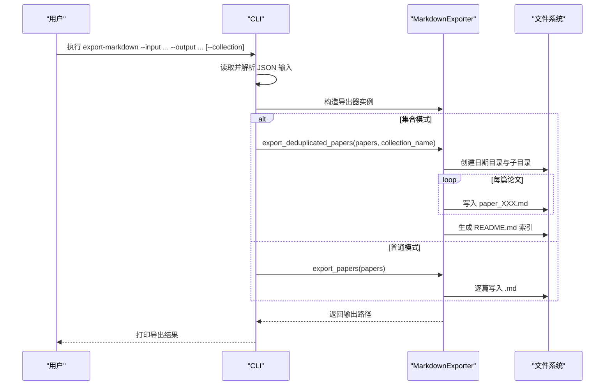
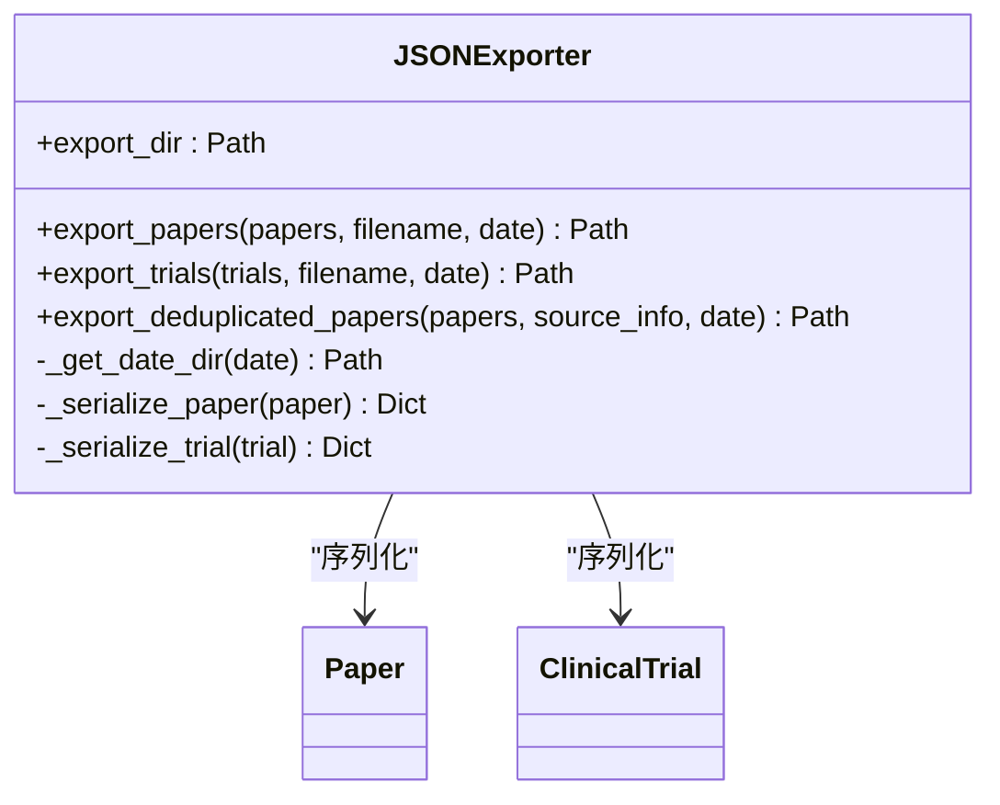
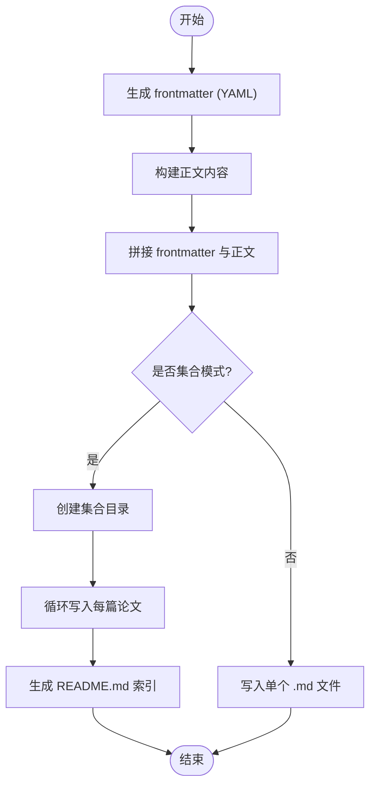
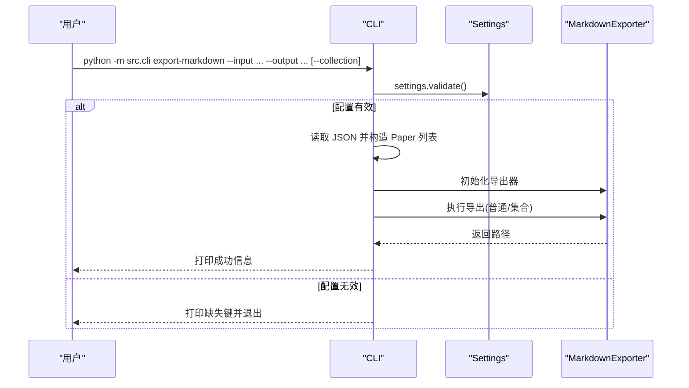
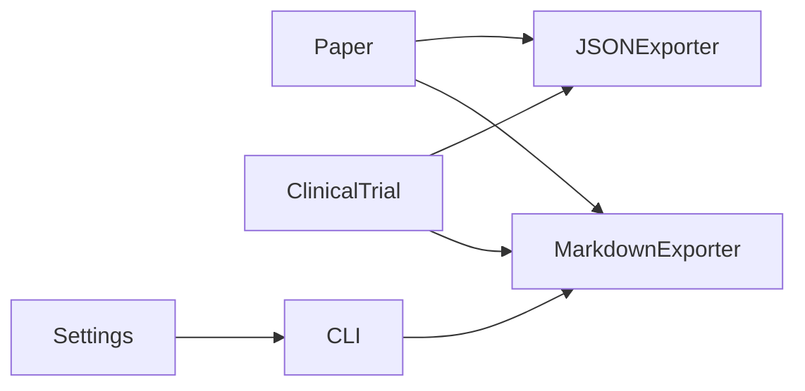

# 数据导出工具

<cite>
**本文引用的文件**
- [json_exporter.py](file://src/exporters/json_exporter.py)
- [markdown_exporter.py](file://src/exporters/markdown_exporter.py)
- [__init__.py](file://src/exporters/__init__.py)
- [paper.py](file://src/models/paper.py)
- [trial.py](file://src/models/trial.py)
- [cli.py](file://src/cli.py)
- [settings.py](file://src/settings/settings.py)
- [config.py](file://src/config.py)
- [exceptions.py](file://src/exceptions.py)
- [test_json_exporter.py](file://tests/test_json_exporter.py)
- [test_markdown_exporter.py](file://tests/test_markdown_exporter.py)
</cite>

## 目录
1. [简介](#简介)
2. [项目结构](#项目结构)
3. [核心组件](#核心组件)
4. [架构总览](#架构总览)
5. [详细组件分析](#详细组件分析)
6. [依赖关系分析](#依赖关系分析)
7. [性能与大数据处理](#性能与大数据处理)
8. [故障排查指南](#故障排查指南)
9. [结论](#结论)
10. [附录：扩展开发指南与最佳实践](#附录：扩展开发指南与最佳实践)

## 简介
本技术文档聚焦 Subskin 项目的数据导出工具，系统阐述 JSON 与 Markdown 两种导出器的实现原理、数据序列化策略、模板渲染机制、文件写入优化、配置选项、批量处理能力与错误恢复机制。同时提供数据完整性校验、编码处理、大文件处理与性能优化建议，并给出导出器扩展开发指南、自定义格式支持与最佳实践。

## 项目结构
导出能力集中在 src/exporters 模块，包含 JSON 与 Markdown 两个导出器；数据模型位于 src/models；命令行入口在 src/cli.py；全局配置通过 src/settings/settings.py 管理；异常类型定义于 src/exceptions.py。测试覆盖导出器行为与边界条件。

```mermaid
graph TB
subgraph "导出模块"
JE["JSONExporter"]
ME["MarkdownExporter"]
end
subgraph "数据模型"
P["Paper"]
T["ClinicalTrial"]
end
subgraph "CLI"
CLI["export-markdown 命令"]
end
subgraph "配置"
CFG["Settings"]
end
JE --> P
JE --> T
ME --> P
ME --> T
CLI --> ME
CLI --> CFG
```

**图表来源**
- [json_exporter.py:19-120](file://src/exporters/json_exporter.py#L19-L120)
- [markdown_exporter.py:19-284](file://src/exporters/markdown_exporter.py#L19-L284)
- [paper.py:18-225](file://src/models/paper.py#L18-L225)
- [trial.py:67-287](file://src/models/trial.py#L67-L287)
- [cli.py:170-208](file://src/cli.py#L170-L208)
- [settings.py:17-328](file://src/settings/settings.py#L17-L328)

**章节来源**
- [json_exporter.py:19-120](file://src/exporters/json_exporter.py#L19-L120)
- [markdown_exporter.py:19-284](file://src/exporters/markdown_exporter.py#L19-L284)
- [paper.py:18-225](file://src/models/paper.py#L18-L225)
- [trial.py:67-287](file://src/models/trial.py#L67-L287)
- [cli.py:170-208](file://src/cli.py#L170-L208)
- [settings.py:17-328](file://src/settings/settings.py#L17-L328)

## 核心组件
- JSONExporter：将论文与临床试验数据序列化为 JSON 文件，按日期组织目录，支持去重导出并附带元数据。
- MarkdownExporter：将论文与临床试验数据转换为带 YAML frontmatter 的 Markdown 文档，支持单篇、批量与集合（含索引）导出。
- 数据模型 Paper/ClinicalTrial：提供字段校验、标识符提取、状态判断等能力，为导出器提供稳定数据结构。
- CLI export-markdown：从 JSON 输入解析 Paper 列表，调用 MarkdownExporter 完成导出，支持集合模式。

**章节来源**
- [json_exporter.py:19-120](file://src/exporters/json_exporter.py#L19-L120)
- [markdown_exporter.py:19-284](file://src/exporters/markdown_exporter.py#L19-L284)
- [paper.py:18-225](file://src/models/paper.py#L18-L225)
- [trial.py:67-287](file://src/models/trial.py#L67-L287)
- [cli.py:170-208](file://src/cli.py#L170-L208)

## 架构总览
导出流程以“数据模型 → 序列化/渲染 → 文件写入”为主线。JSON 导出器侧重结构化数据序列化；Markdown 导出器侧重可读性内容与前端友好 frontmatter。CLI 作为编排入口，负责参数解析、数据加载与导出调度。



**图表来源**
- [cli.py:170-208](file://src/cli.py#L170-L208)
- [markdown_exporter.py:170-284](file://src/exporters/markdown_exporter.py#L170-L284)

## 详细组件分析

### JSONExporter
- 序列化策略
  - 使用模型的 model_dump 进行基础序列化，补充 crawled_at 与 source 等字段，确保时间戳与枚举值可序列化。
  - 对未知类型采用 default=str 兜底，提升鲁棒性。
- 目录与命名
  - 按日期划分目录（YYYY-MM-DD），文件名支持时间戳或指定名称；去重导出附加 metadata 与 deduplicated 标记。
- 写入优化
  - 使用 UTF-8 编码与缩进格式化，便于人类阅读与版本控制。
- 批量与去重
  - 提供 papers/trials 批量导出与 deduplicated 专用导出方法，统一日志记录与路径返回。



**图表来源**
- [json_exporter.py:19-120](file://src/exporters/json_exporter.py#L19-L120)
- [paper.py:18-225](file://src/models/paper.py#L18-L225)
- [trial.py:67-287](file://src/models/trial.py#L67-L287)

**章节来源**
- [json_exporter.py:19-120](file://src/exporters/json_exporter.py#L19-L120)
- [test_json_exporter.py:11-74](file://tests/test_json_exporter.py#L11-L74)

### MarkdownExporter
- 模板渲染机制
  - frontmatter：基于 PyYAML 生成 YAML 头部，包含标题、日期、来源、作者、期刊、PMID/DOI/URL、抓取时间、引用次数、MeSH/关键词、语言、翻译/摘要状态等。
  - 正文内容：按章节拼接标题、作者、期刊、发表日期、标识符、摘要（中英文）、患者易懂总结、关键词/MeSH、引用次数、来源、抓取时间与免责声明。
  - 试验数据：简化 frontmatter 与正文，包含 NCT ID、适应症、阶段、状态、入组人数、申办方、起止日期、地点与免责声明。
- 批量与集合
  - 单篇导出：根据标题与标识符生成安全文件名。
  - 批量导出：可选 base_filename 前缀，否则按序号补齐。
  - 集合导出：创建独立子目录，逐篇导出并生成 README.md 索引，链接到各论文文件。
- 编码与健壮性
  - 统一 UTF-8 写入；frontmatter 允许 Unicode；内容中特殊字符（如 |）转义以避免 Markdown 表格冲突。



**图表来源**
- [markdown_exporter.py:30-131](file://src/exporters/markdown_exporter.py#L30-L131)
- [markdown_exporter.py:170-284](file://src/exporters/markdown_exporter.py#L170-L284)

**章节来源**
- [markdown_exporter.py:19-284](file://src/exporters/markdown_exporter.py#L19-L284)
- [test_markdown_exporter.py:11-98](file://tests/test_markdown_exporter.py#L11-L98)

### CLI 集成与配置
- export-markdown 命令
  - 参数：--input（JSON 输入）、--output（输出目录）、--collection（集合模式）。
  - 流程：读取 JSON → 解析为 Paper 列表 → 选择导出模式 → 调用 MarkdownExporter → 输出路径与统计信息。
- 配置验证
  - 启动时通过 Settings.validate() 检查必要环境变量，缺失则提示并退出。



**图表来源**
- [cli.py:170-208](file://src/cli.py#L170-L208)
- [cli.py:301-325](file://src/cli.py#L301-L325)
- [settings.py:301-324](file://src/settings/settings.py#L301-L324)

**章节来源**
- [cli.py:170-208](file://src/cli.py#L170-L208)
- [cli.py:301-325](file://src/cli.py#L301-L325)
- [settings.py:17-328](file://src/settings/settings.py#L17-L328)
- [config.py:1-10](file://src/config.py#L1-L10)

## 依赖关系分析
- 导出器依赖数据模型：Paper/ClinicalTrial 提供强类型字段与校验，保证导出数据的完整性与一致性。
- CLI 依赖 Settings：在运行前校验环境配置，避免运行时因缺失关键变量导致失败。
- 测试覆盖：单元测试验证导出器初始化、文件结构、frontmatter 生成、免责声明、集合索引等关键行为。



**图表来源**
- [paper.py:18-225](file://src/models/paper.py#L18-L225)
- [trial.py:67-287](file://src/models/trial.py#L67-L287)
- [json_exporter.py:19-120](file://src/exporters/json_exporter.py#L19-L120)
- [markdown_exporter.py:19-284](file://src/exporters/markdown_exporter.py#L19-L284)
- [cli.py:170-208](file://src/cli.py#L170-L208)
- [settings.py:17-328](file://src/settings/settings.py#L17-L328)

**章节来源**
- [test_json_exporter.py:11-74](file://tests/test_json_exporter.py#L11-L74)
- [test_markdown_exporter.py:11-98](file://tests/test_markdown_exporter.py#L11-L98)

## 性能与大数据处理
- 序列化与写入
  - JSON：使用 json.dump 一次性写入，配合 indent 与 ensure_ascii=False 提升可读性与国际化支持；default=str 降低类型转换开销。
  - Markdown：逐篇写入，避免内存峰值；frontmatter 使用 PyYAML 生成，注意 Unicode 输出。
- 批量处理
  - 支持批量导出与集合导出，减少重复目录创建与 I/O 开销。
- 大文件建议
  - 分块写入：对于超大列表，可采用流式写入或分片文件（当前实现为整批写入，适合中等规模数据）。
  - 压缩归档：导出完成后打包为 zip/tar.gz 以减少存储与传输成本。
  - 并发限制：若后续引入并行导出，需考虑磁盘 I/O 与锁竞争，建议使用线程池或进程池并限制并发度。
- 编码与健壮性
  - 统一 UTF-8 编码；对可能包含特殊字符的标题进行转义，避免 Markdown 解析问题。

[本节为通用指导，不直接分析具体文件]

## 故障排查指南
- 常见错误定位
  - 配置缺失：CLI 启动时通过 Settings.validate() 检查必填项，缺失会打印提示并退出。
  - 输入数据非法：CLI 解析 JSON 后构造 Paper 列表，若字段不符合模型约束，Pydantic 会抛出验证错误。
  - 文件写入失败：检查输出目录权限与磁盘空间；确认路径存在且可写。
- 异常体系
  - 自定义异常：CrawlerError、APIError、RateLimitError、CacheError 用于爬虫与外部服务交互场景；导出器本身未抛出这些异常，但可在上层捕获并记录。
- 调试建议
  - 增加日志级别：通过 Settings.LOG_LEVEL 调整日志粒度。
  - 最小化复现：使用少量样本数据验证导出逻辑，逐步扩大规模。
  - 断点与中间产物：在 CLI 与导出器之间保存中间 JSON，便于比对与定位问题。

**章节来源**
- [cli.py:301-325](file://src/cli.py#L301-L325)
- [settings.py:301-324](file://src/settings/settings.py#L301-L324)
- [exceptions.py:13-39](file://src/exceptions.py#L13-L39)

## 结论
Subskin 的数据导出工具以清晰的分层与职责分离实现了 JSON 与 Markdown 两种格式的可靠导出。JSON 导出器强调结构化与元数据完整性；Markdown 导出器注重可读性与前端友好性，并提供集合模式与索引生成。CLI 提供了简洁的编排入口，结合 Settings 的配置校验保障运行稳定性。针对大规模数据，建议引入分块写入与并发控制以提升性能与鲁棒性。

[本节为总结性内容，不直接分析具体文件]

## 附录：扩展开发指南与最佳实践
- 新增导出格式
  - 新建导出器类，遵循现有接口风格：接收数据模型列表，返回输出路径或路径列表；内部实现序列化/渲染与文件写入。
  - 复用 _get_date_dir 与目录创建逻辑，保持输出结构一致。
  - 在 __init__.py 中注册新导出器，便于统一导入。
- 数据完整性校验
  - 利用 Pydantic 模型校验输入数据；必要时在导出前增加业务规则检查（如必需字段、格式规范）。
- 编码与国际化
  - 统一使用 UTF-8 编码；对非 ASCII 字符启用 ensure_ascii=False 或 allow_unicode=True。
- 错误恢复与重试
  - 对 I/O 操作增加 try/except，记录错误并继续处理剩余条目；对网络或外部依赖调用实现重试与退避。
- 性能优化
  - 批量写入：合并多次小写入为一次大写入，减少系统调用开销。
  - 预分配缓冲：对已知大小的数据，预先计算缓冲区大小，减少内存分配。
  - 异步与并发：在高吞吐场景下，结合 asyncio 或 multiprocessing 提升 I/O 与 CPU 利用率。
- 测试与回归
  - 为新导出器编写单元测试，覆盖正常路径、边界条件与异常场景；参考现有 test_json_exporter.py 与 test_markdown_exporter.py 的结构。

[本节为通用指导，不直接分析具体文件]