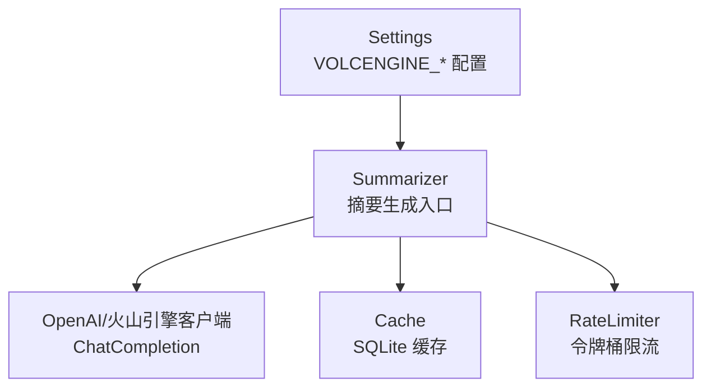
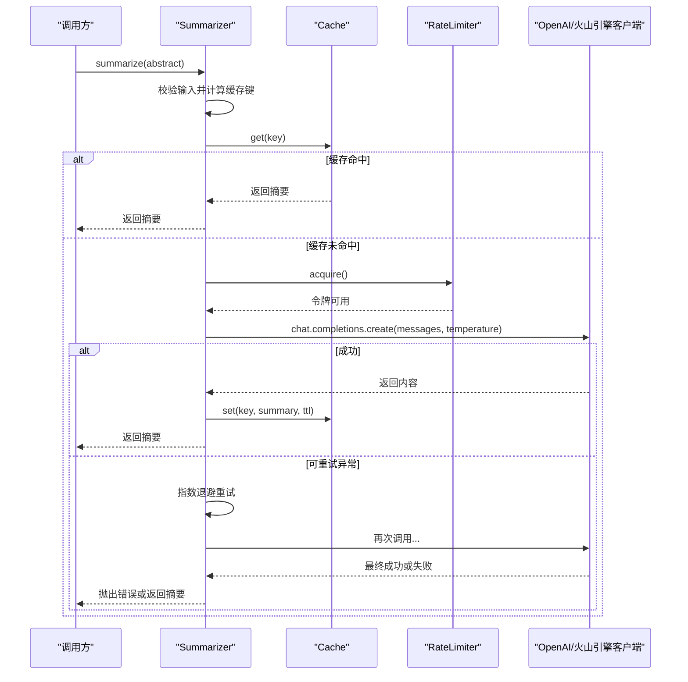
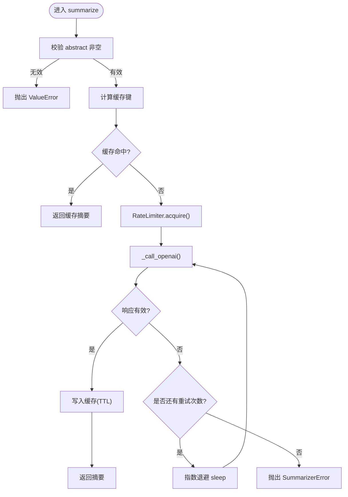
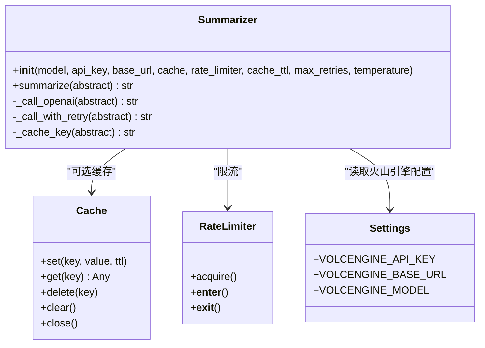

# 文本摘要生成

<cite>
**本文引用的文件**
- [src/processors/summarizer.py](file://src/processors/summarizer.py)
- [src/utils/cache.py](file://src/utils/cache.py)
- [src/utils/rate_limiter.py](file://src/utils/rate_limiter.py)
- [src/settings/settings.py](file://src/settings/settings.py)
- [tests/test_summarizer.py](file://tests/test_summarizer.py)
</cite>

## 目录
1. [简介](#简介)
2. [项目结构](#项目结构)
3. [核心组件](#核心组件)
4. [架构总览](#架构总览)
5. [详细组件分析](#详细组件分析)
6. [依赖关系分析](#依赖关系分析)
7. [性能与优化](#性能与优化)
8. [故障排查指南](#故障排查指南)
9. [结论](#结论)
10. [附录：API调用示例与配置说明](#附录api调用示例与配置说明)

## 简介
本技术文档聚焦于 Subskin 项目的“文本摘要生成”能力，围绕 Summarizer 类展开，系统阐述其如何集成 OpenAI 与火山引擎（Volcengine）OpenAI 兼容 API，将英文医学论文摘要转化为面向患者的中文科普摘要。文档覆盖系统提示词设计、用户提示模板、重试机制与指数退避策略、缓存机制、速率限制、错误处理与性能优化，并提供 API 调用示例、配置参数说明与故障排查指南。

## 项目结构
与文本摘要生成相关的代码主要位于以下模块：
- 处理器层：Summarizer 实现摘要生成主流程
- 工具层：Cache（SQLite 缓存）、RateLimiter（令牌桶限流）
- 配置层：Settings 提供火山引擎等 LLM 配置项
- 测试层：对 Summarizer 的完整行为进行验证

图表来源
- [src/processors/summarizer.py:90-126](file://src/processors/summarizer.py#L90-L126)
- [src/utils/cache.py:16-48](file://src/utils/cache.py#L16-L48)
- [src/utils/rate_limiter.py:10-41](file://src/utils/rate_limiter.py#L10-L41)
- [src/settings/settings.py:276-287](file://src/settings/settings.py#L276-L287)

章节来源
- [src/processors/summarizer.py:1-247](file://src/processors/summarizer.py#L1-L247)
- [src/utils/cache.py:1-147](file://src/utils/cache.py#L1-L147)
- [src/utils/rate_limiter.py:1-81](file://src/utils/rate_limiter.py#L1-L81)
- [src/settings/settings.py:270-328](file://src/settings/settings.py#L270-L328)

## 核心组件
- Summarizer：封装 OpenAI 兼容 ChatCompletion 调用，负责提示词组装、缓存命中判断、速率控制、重试与退避、结果返回。
- Cache：基于 SQLite 的线程安全缓存，支持 TTL 过期清理与键值存取。
- RateLimiter：基于令牌桶算法的线程安全限流器，按配置的请求速率阻塞等待可用令牌。
- Settings：集中管理环境变量与默认值，包括火山引擎 API Key、Base URL、模型名等。

章节来源
- [src/processors/summarizer.py:57-126](file://src/processors/summarizer.py#L57-L126)
- [src/utils/cache.py:16-147](file://src/utils/cache.py#L16-L147)
- [src/utils/rate_limiter.py:10-81](file://src/utils/rate_limiter.py#L10-L81)
- [src/settings/settings.py:276-287](file://src/settings/settings.py#L276-L287)

## 架构总览
Summarizer 的工作流如下：
- 输入校验与缓存键计算
- 优先从 Cache 读取命中结果
- 未命中则通过 RateLimiter 获取令牌
- 调用 OpenAI/火山引擎 ChatCompletion，携带系统提示词与用户提示模板
- 捕获可重试异常，执行指数退避重试
- 将结果写入 Cache（带 TTL），并返回给用户

图表来源
- [src/processors/summarizer.py:140-202](file://src/processors/summarizer.py#L140-L202)
- [src/processors/summarizer.py:204-247](file://src/processors/summarizer.py#L204-L247)
- [src/utils/cache.py:66-114](file://src/utils/cache.py#L66-L114)
- [src/utils/rate_limiter.py:43-57](file://src/utils/rate_limiter.py#L43-L57)

## 详细组件分析

### Summarizer 类
- 初始化与提供商选择：
  - 若检测到 VOLCENGINE_API_KEY，则优先使用火山引擎配置（Key、Base URL、Model）。
  - 否则回退到 OpenAI（OPENAI_API_KEY、默认 Base URL、默认模型 gpt-3.5-turbo）。
  - 未提供有效 API Key 时抛出 ValueError。
- 提示词设计：
  - 系统提示词定义角色、任务、输出规则与免责声明，确保输出为面向白友的中文科普内容。
  - 用户提示模板以 {abstract} 占位符注入待处理的英文摘要。
- 缓存键生成：
  - 对原始摘要做 UTF-8 编码后计算 SHA-256，并以固定前缀拼接形成确定性键。
- API 调用与响应解析：
  - 构造 messages 列表（system + user），设置 temperature。
  - 校验返回 choices 与 content，空响应抛出 SummarizerError。
- 重试与指数退避：
  - 针对连接错误、超时、速率限制三类异常进行重试。
  - 初始退避时间、倍增系数与最大重试次数可配置。
- 主流程 summarize：
  - 输入为空或仅空白字符时抛出 ValueError。
  - 先查缓存；命中直接返回。
  - 未命中则申请速率令牌，调用 API 并写入缓存（TTL 默认 30 天）。

图表来源
- [src/processors/summarizer.py:204-247](file://src/processors/summarizer.py#L204-L247)
- [src/processors/summarizer.py:140-202](file://src/processors/summarizer.py#L140-L202)

章节来源
- [src/processors/summarizer.py:29-44](file://src/processors/summarizer.py#L29-L44)
- [src/processors/summarizer.py:90-126](file://src/processors/summarizer.py#L90-L126)
- [src/processors/summarizer.py:127-168](file://src/processors/summarizer.py#L127-L168)
- [src/processors/summarizer.py:170-202](file://src/processors/summarizer.py#L170-L202)
- [src/processors/summarizer.py:204-247](file://src/processors/summarizer.py#L204-L247)

### Cache 组件
- 存储介质：SQLite 数据库（支持内存模式或持久化文件）。
- 数据结构：cache_entries 表包含 key、value、created_at、ttl、expires_at。
- 线程安全：通过 threading.Lock 保护并发访问。
- TTL 清理：在读写操作前清理过期条目，避免脏读。
- 接口：set/get/delete/clear/close，支持上下文管理器。

章节来源
- [src/utils/cache.py:16-48](file://src/utils/cache.py#L16-L48)
- [src/utils/cache.py:54-114](file://src/utils/cache.py#L54-L114)
- [src/utils/cache.py:116-147](file://src/utils/cache.py#L116-L147)

### RateLimiter 组件
- 算法：令牌桶，按每秒速率填充令牌，acquire 阻塞直到获得一个令牌。
- 线程安全：Lock 保护状态更新。
- 上下文管理器：with 语句自动 acquire。
- 适用场景：控制外部 API 调用频率，避免触发服务端限流。

章节来源
- [src/utils/rate_limiter.py:10-41](file://src/utils/rate_limiter.py#L10-L41)
- [src/utils/rate_limiter.py:43-81](file://src/utils/rate_limiter.py#L43-L81)

### 配置与提供商切换
- 火山引擎优先：当存在 VOLCENGINE_API_KEY 时，Summarizer 自动使用该提供商的配置（Key、Base URL、Model）。
- 回退到 OpenAI：若无火山引擎配置，则使用 OPENAI_API_KEY 及默认端点与模型。
- 配置字段：
  - VOLCENGINE_API_KEY：火山引擎 API Key
  - VOLCENGINE_BASE_URL：火山引擎 Base URL（默认北京区域端点）
  - VOLCENGINE_MODEL：火山引擎模型名（默认 doubao-4k）

章节来源
- [src/processors/summarizer.py:101-117](file://src/processors/summarizer.py#L101-L117)
- [src/settings/settings.py:276-287](file://src/settings/settings.py#L276-L287)

## 依赖关系分析
- Summarizer 依赖：
  - OpenAI 客户端（兼容火山引擎 OpenAI 协议）
  - Cache（可选，用于减少重复请求）
  - RateLimiter（默认启用，防止超频）
  - Settings（加载火山引擎配置）
- 测试覆盖：
  - 初始化参数与环境变量优先级
  - 缓存命中/未命中行为
  - 速率限制调用顺序
  - 重试逻辑与指数退避时序
  - 空响应与空 choices 的错误路径

图表来源
- [src/processors/summarizer.py:90-126](file://src/processors/summarizer.py#L90-L126)
- [src/utils/cache.py:16-147](file://src/utils/cache.py#L16-L147)
- [src/utils/rate_limiter.py:10-81](file://src/utils/rate_limiter.py#L10-L81)
- [src/settings/settings.py:276-287](file://src/settings/settings.py#L276-L287)

章节来源
- [tests/test_summarizer.py:63-86](file://tests/test_summarizer.py#L63-L86)
- [tests/test_summarizer.py:88-147](file://tests/test_summarizer.py#L88-L147)
- [tests/test_summarizer.py:149-250](file://tests/test_summarizer.py#L149-L250)
- [tests/test_summarizer.py:252-356](file://tests/test_summarizer.py#L252-L356)
- [tests/test_summarizer.py:358-401](file://tests/test_summarizer.py#L358-L401)

## 性能与优化
- 缓存命中率：
  - 相同摘要经哈希生成稳定键，命中后跳过 API 调用与限流等待，显著降低延迟与成本。
- 速率限制：
  - 默认 10 req/min，避免触发服务端限流；可根据实际配额调整。
- 重试与退避：
  - 指数退避降低瞬时拥塞导致的失败率；合理设置最大重试次数与退避倍数平衡稳定性与延迟。
- 温度参数：
  - 较低 temperature（如 0.3）提升输出稳定性，适合医学科普摘要。
- 批处理建议：
  - 批量摘要时结合缓存与限流，避免并发过高导致限流或超时。

[本节为通用性能指导，不直接分析具体文件]

## 故障排查指南
- 无 API Key：
  - 现象：初始化抛出 ValueError。
  - 排查：确认已设置 VOLCENGINE_API_KEY 或 OPENAI_API_KEY。
- 空摘要：
  - 现象：summarize 抛出 ValueError。
  - 排查：检查传入 abstract 是否为空或仅空白字符。
- 空响应：
  - 现象：抛出 SummarizerError（empty response）。
  - 排查：检查模型返回结构与 content 字段；必要时提高重试次数或更换模型。
- 频繁限流：
  - 现象：RateLimitError 多次出现。
  - 排查：降低并发、增大 RateLimiter 间隔、检查服务端配额。
- 缓存未命中：
  - 现象：每次均调用 API。
  - 排查：确认 Cache 实例正确传入、key 计算一致、TTL 未过期。

章节来源
- [src/processors/summarizer.py:113-117](file://src/processors/summarizer.py#L113-L117)
- [src/processors/summarizer.py:227-228](file://src/processors/summarizer.py#L227-L228)
- [src/processors/summarizer.py:164-168](file://src/processors/summarizer.py#L164-L168)
- [src/processors/summarizer.py:182-202](file://src/processors/summarizer.py#L182-L202)
- [tests/test_summarizer.py:63-86](file://tests/test_summarizer.py#L63-L86)
- [tests/test_summarizer.py:121-147](file://tests/test_summarizer.py#L121-L147)
- [tests/test_summarizer.py:358-384](file://tests/test_summarizer.py#L358-L384)

## 结论
Summarizer 提供了健壮的医学科普摘要生成能力，通过系统提示词与用户提示模板保证输出质量与合规性；借助缓存与限流提升效率与稳定性；通过重试与指数退避增强容错能力；同时支持 OpenAI 与火山引擎双提供商，便于灵活部署与成本控制。配合完善的测试覆盖，该组件可在生产环境中可靠运行。

[本节为总结性内容，不直接分析具体文件]

## 附录：API调用示例与配置说明

- 基本用法（启用缓存与默认限流）：
  - 创建 Cache 实例（可指定 SQLite 文件或内存模式）。
  - 初始化 Summarizer（可传入自定义 model、api_key、base_url、temperature、max_retries、cache_ttl）。
  - 调用 summarize(abstract) 获取患者友好的中文摘要。
  - 参考：[src/processors/summarizer.py:83-88](file://src/processors/summarizer.py#L83-L88)

- 配置参数说明：
  - model：模型标识（如 gpt-3.5-turbo 或火山引擎模型名）。
  - api_key：API Key（优先使用显式传入，其次环境变量）。
  - base_url：API Base URL（火山引擎默认北京区域端点）。
  - cache：Cache 实例（None 表示禁用缓存）。
  - rate_limiter：RateLimiter 实例（默认 10 req/min）。
  - cache_ttl：缓存有效期（秒，默认 30 天）。
  - max_retries：最大重试次数（默认 3）。
  - temperature：采样温度（默认 0.3）。
  - 参考：[src/processors/summarizer.py:90-126](file://src/processors/summarizer.py#L90-L126)

- 环境变量与提供商选择：
  - VOLCENGINE_API_KEY、VOLCENGINE_BASE_URL、VOLCENGINE_MODEL 用于火山引擎。
  - OPENAI_API_KEY 用于 OpenAI。
  - 参考：[src/settings/settings.py:276-287](file://src/settings/settings.py#L276-L287)

- 提示词与输出规范：
  - 系统提示词规定角色、任务、语言、免责声明与输出格式。
  - 用户提示模板以 {abstract} 注入待处理摘要。
  - 参考：[src/processors/summarizer.py:29-44](file://src/processors/summarizer.py#L29-L44)

- 重试与退避：
  - 可重试异常：连接错误、超时、速率限制。
  - 指数退避：初始 1.0s，倍增 2.0，最多 3 次。
  - 参考：[src/processors/summarizer.py:170-202](file://src/processors/summarizer.py#L170-L202)

- 测试用例参考：
  - 初始化与环境变量优先级、缓存命中/未命中、速率限制顺序、重试与退避时序、空响应错误路径。
  - 参考：[tests/test_summarizer.py:63-401](file://tests/test_summarizer.py#L63-L401)