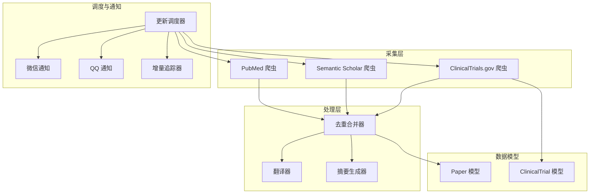
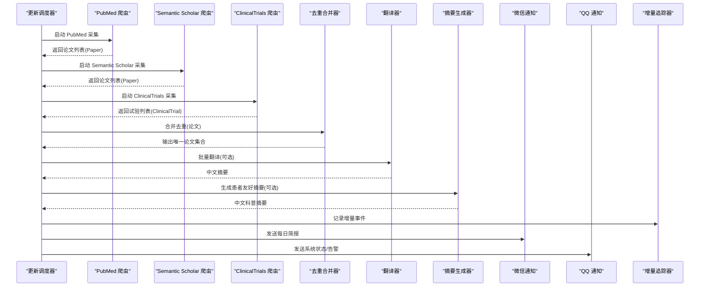
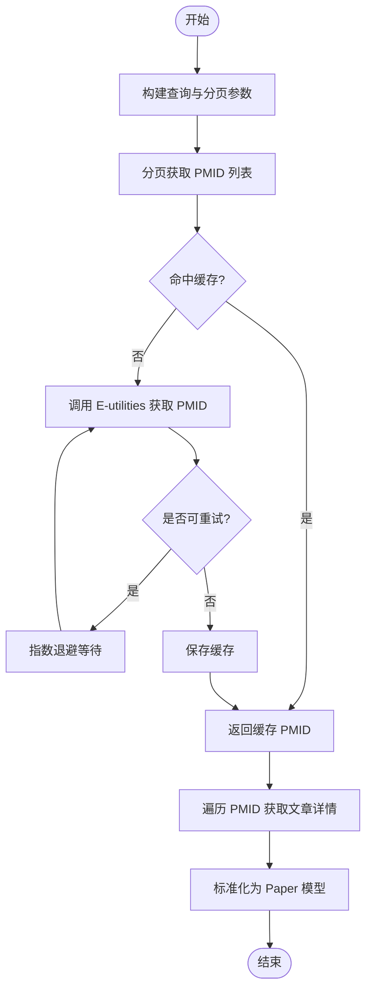
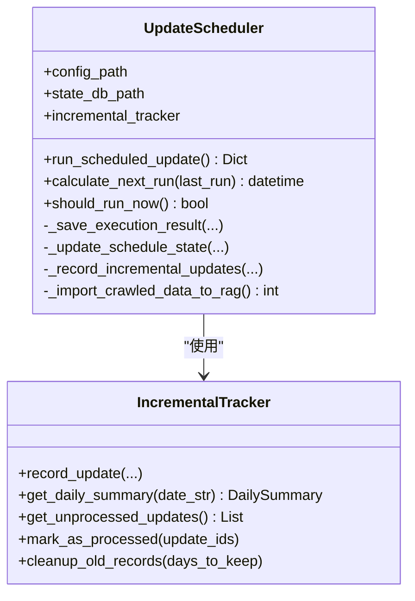
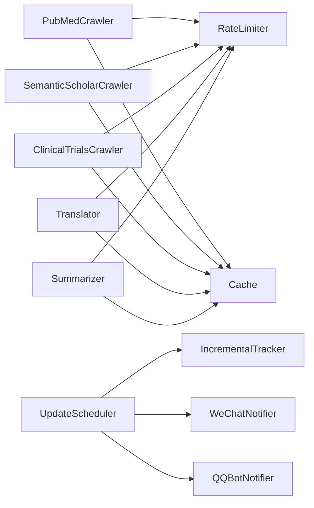

# 数据管道

<cite>
**本文引用的文件**   
- [README.md](file://README.md)
- [src/crawlers/pubmed_crawler.py](file://src/crawlers/pubmed_crawler.py)
- [src/crawlers/semantic_scholar_crawler.py](file://src/crawlers/semantic_scholar_crawler.py)
- [src/crawlers/clinical_trials_crawler.py](file://src/crawlers/clinical_trials_crawler.py)
- [src/processors/deduplicator.py](file://src/processors/deduplicator.py)
- [src/processors/translator.py](file://src/processors/translator.py)
- [src/processors/summarizer.py](file://src/processors/summarizer.py)
- [src/scheduler/update_scheduler.py](file://src/scheduler/update_scheduler.py)
- [src/notifications/wechat_notifier.py](file://src/notifications/wechat_notifier.py)
- [src/notifications/qq_notifier.py](file://src/notifications/qq_notifier.py)
- [src/models/paper.py](file://src/models/paper.py)
- [src/models/trial.py](file://src/models/trial.py)
- [src/utils/incremental_tracker.py](file://src/utils/incremental_tracker.py)
- [configs/crawler_config.yaml](file://configs/crawler_config.yaml)
- [scheduler_config.json](file://scheduler_config.json)
</cite>

## 目录
1. [简介](#简介)
2. [项目结构](#项目结构)
3. [核心组件](#核心组件)
4. [架构总览](#架构总览)
5. [详细组件分析](#详细组件分析)
6. [依赖关系分析](#依赖关系分析)
7. [性能考量](#性能考量)
8. [故障排查指南](#故障排查指南)
9. [结论](#结论)
10. [附录](#附录)

## 简介
本技术文档面向 SubSkin 数据管道，系统性阐述自动化数据采集与处理流水线。内容覆盖多源爬虫（PubMed、Semantic Scholar、ClinicalTrials.gov）、数据处理（翻译、摘要生成、去重、质量评估）、定时调度、任务监控日志、失败重试机制与通知推送服务。同时提供爬虫配置方法、处理器扩展策略与调度优化建议，帮助读者快速理解并高效运维该数据管道。

## 项目结构
SubSkin 的数据管道位于 src 目录下，按职责划分为：
- crawlers：多源采集器（PubMed、Semantic Scholar、ClinicalTrials.gov）
- processors：文本翻译、摘要生成、去重合并
- scheduler：定时调度与增量追踪
- notifications：微信与 QQ 通知
- models：Pydantic 数据模型（论文、临床试验）
- utils：缓存、限流、增量追踪等通用工具
- configs：爬虫与调度配置

图表来源
- [src/crawlers/pubmed_crawler.py:1-120](file://src/crawlers/pubmed_crawler.py#L1-L120)
- [src/crawlers/semantic_scholar_crawler.py:1-100](file://src/crawlers/semantic_scholar_crawler.py#L1-L100)
- [src/crawlers/clinical_trials_crawler.py:1-120](file://src/crawlers/clinical_trials_crawler.py#L1-L120)
- [src/processors/translator.py:1-120](file://src/processors/translator.py#L1-L120)
- [src/processors/summarizer.py:1-120](file://src/processors/summarizer.py#L1-L120)
- [src/processors/deduplicator.py:1-120](file://src/processors/deduplicator.py#L1-L120)
- [src/scheduler/update_scheduler.py:1-120](file://src/scheduler/update_scheduler.py#L1-L120)
- [src/notifications/wechat_notifier.py:1-120](file://src/notifications/wechat_notifier.py#L1-L120)
- [src/notifications/qq_notifier.py:1-120](file://src/notifications/qq_notifier.py#L1-L120)
- [src/models/paper.py:1-120](file://src/models/paper.py#L1-L120)
- [src/models/trial.py:1-120](file://src/models/trial.py#L1-L120)

章节来源
- [README.md:1-200](file://README.md#L1-L200)

## 核心组件
- 多源爬虫
  - PubMedCrawler：基于 metapub 的 PubMed 检索，支持分页、缓存、速率限制与指数退避重试。
  - SemanticScholarCrawler：调用 Semantic Scholar API，具备请求限流、缓存与重试。
  - ClinicalTrialsCrawler：对接 ClinicalTrials.gov v2 API，支持分页、状态映射、干预类型识别与 JAK 抑制剂筛选。
- 数据处理
  - Translator：OpenAI/Volcengine 兼容接口实现英文到中文的医学摘要翻译，带缓存与重试。
  - Summarizer：将英文摘要改写为面向患者的中文科普摘要，支持多后端与缓存。
  - Deduplicator：按 DOI/PMID/标题+作者哈希进行分组合并，保留来源溯源与字段优选策略。
- 调度与通知
  - UpdateScheduler：周期性执行采集任务，记录结果、计算下次运行时间、增量导入 RAG 并发送通知。
  - WeChatNotifier/QQBotNotifier：通过文件或 CLI 发送每日简报与告警。
  - IncrementalTracker：SQLite 持久化增量事件，支撑日报统计与未处理记录管理。
- 数据模型
  - Paper/ClinicalTrial：结构化字段、校验规则与便捷方法，贯穿采集与处理全链路。

章节来源
- [src/crawlers/pubmed_crawler.py:1-120](file://src/crawlers/pubmed_crawler.py#L1-L120)
- [src/crawlers/semantic_scholar_crawler.py:1-120](file://src/crawlers/semantic_scholar_crawler.py#L1-L120)
- [src/crawlers/clinical_trials_crawler.py:1-120](file://src/crawlers/clinical_trials_crawler.py#L1-L120)
- [src/processors/translator.py:1-120](file://src/processors/translator.py#L1-L120)
- [src/processors/summarizer.py:1-120](file://src/processors/summarizer.py#L1-L120)
- [src/processors/deduplicator.py:1-120](file://src/processors/deduplicator.py#L1-L120)
- [src/scheduler/update_scheduler.py:1-120](file://src/scheduler/update_scheduler.py#L1-L120)
- [src/notifications/wechat_notifier.py:1-120](file://src/notifications/wechat_notifier.py#L1-L120)
- [src/notifications/qq_notifier.py:1-120](file://src/notifications/qq_notifier.py#L1-L120)
- [src/models/paper.py:1-120](file://src/models/paper.py#L1-L120)
- [src/models/trial.py:1-120](file://src/models/trial.py#L1-L120)

## 架构总览
数据管道采用“采集-处理-调度-通知”的分层架构，各层通过统一数据模型与工具组件解耦协作。

图表来源
- [src/scheduler/update_scheduler.py:218-382](file://src/scheduler/update_scheduler.py#L218-L382)
- [src/crawlers/pubmed_crawler.py:129-153](file://src/crawlers/pubmed_crawler.py#L129-L153)
- [src/crawlers/semantic_scholar_crawler.py:231-284](file://src/crawlers/semantic_scholar_crawler.py#L231-L284)
- [src/crawlers/clinical_trials_crawler.py:394-428](file://src/crawlers/clinical_trials_crawler.py#L394-L428)
- [src/processors/deduplicator.py:57-90](file://src/processors/deduplicator.py#L57-L90)
- [src/processors/translator.py:195-251](file://src/processors/translator.py#L195-L251)
- [src/processors/summarizer.py:204-247](file://src/processors/summarizer.py#L204-L247)
- [src/notifications/wechat_notifier.py:179-201](file://src/notifications/wechat_notifier.py#L179-L201)
- [src/notifications/qq_notifier.py:414-485](file://src/notifications/qq_notifier.py#L414-L485)
- [src/utils/incremental_tracker.py:130-199](file://src/utils/incremental_tracker.py#L130-L199)

## 详细组件分析

### PubMed 爬虫
- 功能要点
  - 使用 metapub 的 PubMedFetcher 进行检索，支持分页与最大结果上限。
  - 自动检测 NCBI_API_KEY 提升速率限制；内置缓存与指数退避重试。
  - 将原始文章转换为标准 Paper 模型，包含 MeSH、关键词、作者、出版信息等。
- 关键流程
  - 搜索 PMID 列表 → 逐条获取文章详情 → 标准化为 Paper → 写入缓存。
- 错误处理
  - 对 5xx、超时、连接异常等进行可重试判断与指数退避。
- 性能优化
  - 页面级与条目级缓存；合理 page_size 与 max_results 控制。

图表来源
- [src/crawlers/pubmed_crawler.py:154-216](file://src/crawlers/pubmed_crawler.py#L154-L216)
- [src/crawlers/pubmed_crawler.py:316-362](file://src/crawlers/pubmed_crawler.py#L316-L362)

章节来源
- [src/crawlers/pubmed_crawler.py:1-120](file://src/crawlers/pubmed_crawler.py#L1-L120)
- [src/crawlers/pubmed_crawler.py:129-216](file://src/crawlers/pubmed_crawler.py#L129-L216)
- [src/crawlers/pubmed_crawler.py:316-362](file://src/crawlers/pubmed_crawler.py#L316-L362)

### Semantic Scholar 爬虫
- 功能要点
  - 调用 Semantic Scholar Graph API，支持分页、字段选择与缓存键生成。
  - 内置速率限制、指数退避重试与会话复用。
- 关键流程
  - 构造查询参数 → 请求 API → 解析 data 数组 → 转换为 Paper 对象。
- 错误处理
  - 区分客户端错误（4xx）与服务端错误（5xx），仅对可重试错误进行重试。

章节来源
- [src/crawlers/semantic_scholar_crawler.py:1-120](file://src/crawlers/semantic_scholar_crawler.py#L1-L120)
- [src/crawlers/semantic_scholar_crawler.py:231-284](file://src/crawlers/semantic_scholar_crawler.py#L231-L284)

### ClinicalTrials.gov 爬虫
- 功能要点
  - 对接 v2 API，支持分页 token、状态/阶段映射、干预类型识别与 JAK 抑制剂筛选。
  - 内置速率限制、缓存与重试逻辑。
- 关键流程
  - 构建查询参数 → 请求 API → 解析 protocolSection → 映射枚举 → 组装 ClinicalTrial。
- 错误处理
  - 针对 429、5xx、超时与连接错误进行重试或抛出 APIError。

章节来源
- [src/crawlers/clinical_trials_crawler.py:1-120](file://src/crawlers/clinical_trials_crawler.py#L1-L120)
- [src/crawlers/clinical_trials_crawler.py:394-428](file://src/crawlers/clinical_trials_crawler.py#L394-L428)

### 翻译器（Translator）
- 功能要点
  - 基于 OpenAI/Volcengine 兼容接口，将英文医学摘要翻译为中文。
  - 支持缓存、速率限制与指数退避重试。
- 关键流程
  - 检查缓存 → 获取令牌 → 调用 ChatCompletion → 缓存结果 → 返回中文文本。
- 错误处理
  - 捕获可重试异常（限流、超时、连接、服务端错误），非可重试错误包装为 APIError。

章节来源
- [src/processors/translator.py:1-120](file://src/processors/translator.py#L1-L120)
- [src/processors/translator.py:195-251](file://src/processors/translator.py#L195-L251)

### 摘要生成器（Summarizer）
- 功能要点
  - 将英文摘要改写为患者友好的中文科普摘要，支持多后端与缓存。
- 关键流程
  - 输入摘要 → 计算缓存键 → 若未命中则调用 LLM → 缓存并返回。
- 错误处理
  - 对连接、超时、限流等异常进行指数退避重试，最终抛出 SummarizerError。

章节来源
- [src/processors/summarizer.py:1-120](file://src/processors/summarizer.py#L1-L120)
- [src/processors/summarizer.py:204-247](file://src/processors/summarizer.py#L204-L247)

### 去重合并器（Deduplicator）
- 功能要点
  - 按 DOI > PMID > 标题+作者+年份哈希进行分组，合并元数据并保留来源偏好。
- 合并策略
  - 标题/摘要取更长更完整；作者/MeSH/关键词取并集；引用数取最大值；日期精度更高者优先。
- 扩展点
  - 可开启字段来源追踪；可调整模糊匹配阈值与优先级顺序。

章节来源
- [src/processors/deduplicator.py:1-120](file://src/processors/deduplicator.py#L1-L120)
- [src/processors/deduplicator.py:135-285](file://src/processors/deduplicator.py#L135-L285)

### 更新调度器（UpdateScheduler）
- 功能要点
  - 周期性执行多源采集任务，记录执行历史、计算下次运行时间、增量导入 RAG、发送通知。
- 执行流程
  - 检查是否应运行 → 并发执行各爬虫（带超时） → 汇总结果 → 持久化状态 → 增量追踪 → 通知。
- 配置
  - 频率（日/周/月）、执行时间、最大运行时长、通知开关等。

图表来源
- [src/scheduler/update_scheduler.py:79-156](file://src/scheduler/update_scheduler.py#L79-L156)
- [src/utils/incremental_tracker.py:53-120](file://src/utils/incremental_tracker.py#L53-L120)

章节来源
- [src/scheduler/update_scheduler.py:218-382](file://src/scheduler/update_scheduler.py#L218-L382)
- [scheduler_config.json:1-11](file://scheduler_config.json#L1-L11)

### 通知服务（WeChat / QQ）
- 微信通知
  - 优先写入简报文件供 Hermes cronjob 投递；回退至 openclaw CLI。
  - 格式化每日简报，按权威层级分类展示新增项。
- QQ 通知
  - 通过 go-cqhttp HTTP API 发送私聊/群消息，支持重试与错误封装。
  - 提供系统状态报告、错误告警与自定义消息能力。

章节来源
- [src/notifications/wechat_notifier.py:1-120](file://src/notifications/wechat_notifier.py#L1-L120)
- [src/notifications/wechat_notifier.py:179-201](file://src/notifications/wechat_notifier.py#L179-L201)
- [src/notifications/qq_notifier.py:1-120](file://src/notifications/qq_notifier.py#L1-L120)
- [src/notifications/qq_notifier.py:414-485](file://src/notifications/qq_notifier.py#L414-L485)

### 数据模型（Paper / ClinicalTrial）
- Paper
  - 标识符（PMID/PMCID/DOI）、标题、摘要、作者、期刊、出版日期、MeSH、关键词、语言、全文路径、翻译与摘要状态等。
  - 提供引用生成、完整性校验、URL 规范化等方法。
- ClinicalTrial
  - NCT ID、标题、条件、干预措施、阶段、状态、招募人数、赞助方、地点、链接、研究类型、主要/次要终点、纳入/排除标准等。
  - 提供 JAK 抑制剂判定、活跃状态判断、国家列表提取等方法。

章节来源
- [src/models/paper.py:1-120](file://src/models/paper.py#L1-L120)
- [src/models/paper.py:189-225](file://src/models/paper.py#L189-L225)
- [src/models/trial.py:1-120](file://src/models/trial.py#L1-L120)
- [src/models/trial.py:235-287](file://src/models/trial.py#L235-L287)

## 依赖关系分析
- 组件耦合
  - 爬虫依赖 RateLimiter 与 Cache，保证外部 API 访问稳定与重复请求最小化。
  - 处理器依赖 OpenAI/Volcengine SDK，结合 RateLimiter 与 Cache 控制成本与延迟。
  - 调度器聚合多个爬虫与处理器，并通过 IncrementalTracker 与通知模块形成闭环。
- 外部依赖
  - PubMed：metapub/E-utilities（可选 NCBI_API_KEY 提升速率）。
  - Semantic Scholar：Graph API（可选 API Key）。
  - ClinicalTrials.gov：v2 API（严格速率限制）。
  - LLM：OpenAI/Volcengine 兼容接口。
  - 通知：openclaw CLI（微信）、go-cqhttp（QQ）。

图表来源
- [src/crawlers/pubmed_crawler.py:1-120](file://src/crawlers/pubmed_crawler.py#L1-L120)
- [src/crawlers/semantic_scholar_crawler.py:1-120](file://src/crawlers/semantic_scholar_crawler.py#L1-L120)
- [src/crawlers/clinical_trials_crawler.py:1-120](file://src/crawlers/clinical_trials_crawler.py#L1-L120)
- [src/processors/translator.py:1-120](file://src/processors/translator.py#L1-L120)
- [src/processors/summarizer.py:1-120](file://src/processors/summarizer.py#L1-L120)
- [src/scheduler/update_scheduler.py:1-120](file://src/scheduler/update_scheduler.py#L1-L120)
- [src/utils/incremental_tracker.py:1-120](file://src/utils/incremental_tracker.py#L1-L120)

章节来源
- [configs/crawler_config.yaml:1-143](file://configs/crawler_config.yaml#L1-L143)

## 性能考量
- 速率限制与缓存
  - 所有外部 API 调用均通过 RateLimiter 控制吞吐，避免触发限流。
  - 页面级与条目级缓存减少重复请求，显著降低延迟与成本。
- 重试与退避
  - 指数退避策略应对瞬时错误（超时、连接中断、服务端 5xx、429）。
- 分页与上限
  - 合理设置 page_size、max_results 与 retstart/retmax，平衡覆盖率与耗时。
- 并发与超时
  - 调度器对每个爬虫线程执行并设置超时，防止单个任务阻塞整体流程。
- 增量处理
  - 仅对新增内容进行向量化与摘要生成，已入库 source_url 跳过，降低 LLM 调用量。

[本节为通用指导，不直接分析具体文件]

## 故障排查指南
- 常见问题定位
  - 爬虫失败：检查网络连通性、API Key、速率限制与缓存键是否正确。
  - LLM 调用失败：确认环境变量（OPENAI_API_KEY/VOLCENGINE_API_KEY）、base_url 与模型名。
  - 通知失败：微信需确保简报文件可写且 Hermes cronjob 正常；QQ 需验证 go-cqhttp 端口与 OneBot 协议。
- 日志与状态
  - 查看调度器日志（logs/scheduler.log）与爬虫输出 JSON（data/raw/*）。
  - 检查增量数据库（incremental_updates.sqlite）与调度状态（scheduler_state.sqlite）。
- 恢复步骤
  - 清理过期缓存与临时文件，重新执行调度任务。
  - 调整重试次数与退避参数，必要时放宽速率限制。
  - 修复 API Key 或代理配置后重试。

章节来源
- [src/scheduler/update_scheduler.py:383-541](file://src/scheduler/update_scheduler.py#L383-L541)
- [src/notifications/wechat_notifier.py:55-106](file://src/notifications/wechat_notifier.py#L55-L106)
- [src/notifications/qq_notifier.py:76-126](file://src/notifications/qq_notifier.py#L76-L126)

## 结论
SubSkin 数据管道以模块化设计实现了多源采集、智能处理与可靠调度的闭环。通过严格的速率限制、缓存与重试机制，系统在稳定性与成本之间取得良好平衡。增量追踪与通知体系保障了运维可见性与及时性。未来可在模糊去重、质量评估与并行度方面进一步优化，以提升数据质量与吞吐能力。

[本节为总结性内容，不直接分析具体文件]

## 附录

### 爬虫配置说明
- 配置文件位置：configs/crawler_config.yaml
- 关键字段
  - search_terms：检索词列表（如 vitiligo、JAK inhibitor 等）
  - api_key：平台密钥（NCBI_API_KEY、SEMANTIC_SCHOLAR_API_KEY）
  - rate_limit：每秒请求上限
  - cache_ttl：缓存有效期（秒）
  - output_dir/output_format：输出目录与格式（JSON）
  - general：全局重试、超时、日志与监控选项

章节来源
- [configs/crawler_config.yaml:1-143](file://configs/crawler_config.yaml#L1-L143)

### 调度策略优化
- 频率与时段
  - 当前设置为每周日凌晨 3:00 统一爬取，减少 embedding 调用成本。
- 增量策略
  - 仅对新增内容做向量嵌入，已入库 source_url 跳过。
- 运行时保护
  - 最大运行时长限制，避免长时间占用资源。
- 通知开关
  - 完成与失败时均可发送通知，便于及时响应。

章节来源
- [scheduler_config.json:1-11](file://scheduler_config.json#L1-L11)
- [src/scheduler/update_scheduler.py:130-156](file://src/scheduler/update_scheduler.py#L130-L156)

### 处理器扩展方法
- 新增翻译/摘要后端
  - 在 Translator/Summarizer 中增加新的 base_url 与 model 配置，保持缓存与限流一致。
- 新增去重策略
  - 在 Deduplicator 中扩展 fuzzy_title_similarity_threshold 与合并规则，支持更多字段优先级。
- 新增数据源
  - 在 crawlers 下实现新爬虫类，遵循 RateLimiter/Cache 模式，并在 UpdateScheduler 中注册执行函数。

[本节为通用指导，不直接分析具体文件]