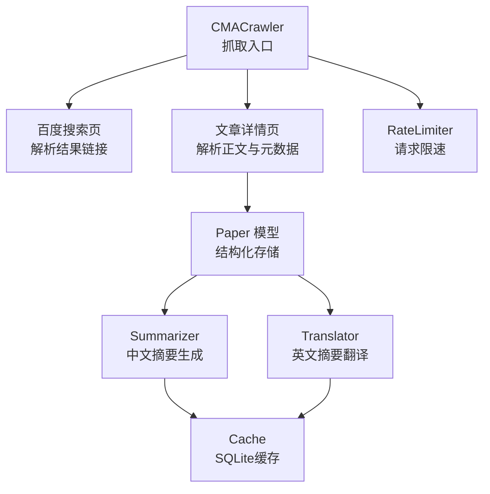
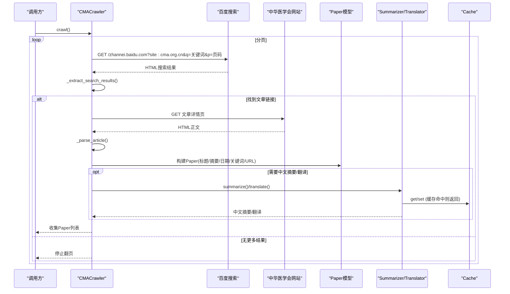
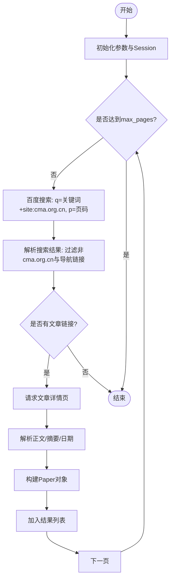
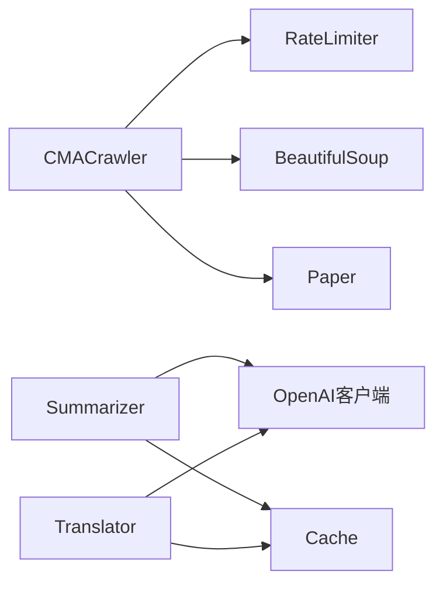

# CMA爬虫

<cite>
**本文引用的文件**
- [cma_crawler.py](file://src/crawlers/cma_crawler.py)
- [paper.py](file://src/models/paper.py)
- [rate_limiter.py](file://src/utils/rate_limiter.py)
- [cache.py](file://src/utils/cache.py)
- [summarizer.py](file://src/processors/summarizer.py)
- [translator.py](file://src/processors/translator.py)
- [crawler_config.yaml](file://configs/crawler_config.yaml)
- [test_cma_crawler.py](file://tests/test_cma_crawler.py)
</cite>

## 目录
1. [简介](#简介)
2. [项目结构](#项目结构)
3. [核心组件](#核心组件)
4. [架构总览](#架构总览)
5. [详细组件分析](#详细组件分析)
6. [依赖关系分析](#依赖关系分析)
7. [性能与稳定性](#性能与稳定性)
8. [反爬策略与合规建议](#反爬策略与合规建议)
9. [中文文本处理与本地化存储](#中文文本处理与本地化存储)
10. [配置与解析规则](#配置与解析规则)
11. [故障排查指南](#故障排查指南)
12. [结论](#结论)

## 简介
本技术文档围绕中国医学文摘（CMA）爬虫的实现，系统阐述从请求、HTML解析、中文文本处理到摘要生成与本地化存储的完整链路。重点覆盖：
- 使用百度站内搜索定位中华医学会网站内容，并抓取文章正文与元数据
- 请求限速、重试与退避机制，保障稳定抓取
- 中文文本清洗、日期提取、摘要截取等处理逻辑
- 基于大模型的中文摘要生成与翻译能力
- 可配置的爬取参数、解析规则与异常处理方案

## 项目结构
与CMA爬虫直接相关的代码位于以下模块：
- 爬虫实现：src/crawlers/cma_crawler.py
- 数据模型：src/models/paper.py
- 工具库：src/utils/rate_limiter.py、src/utils/cache.py
- 处理器：src/processors/summarizer.py、src/processors/translator.py
- 配置：configs/crawler_config.yaml
- 测试：tests/test_cma_crawler.py

图表来源
- [cma_crawler.py:23-321](file://src/crawlers/cma_crawler.py#L23-L321)
- [paper.py:18-224](file://src/models/paper.py#L18-L224)
- [rate_limiter.py:10-81](file://src/utils/rate_limiter.py#L10-L81)
- [cache.py:16-147](file://src/utils/cache.py#L16-L147)
- [summarizer.py:57-247](file://src/processors/summarizer.py#L57-L247)
- [translator.py:65-251](file://src/processors/translator.py#L65-L251)

章节来源
- [cma_crawler.py:23-321](file://src/crawlers/cma_crawler.py#L23-L321)
- [crawler_config.yaml:1-143](file://configs/crawler_config.yaml#L1-L143)

## 核心组件
- CMACrawler：负责通过百度搜索站点对中华医学会网站进行关键词检索，逐页获取文章链接，再抓取文章详情并解析为Paper对象。内置请求限速、重试与指数退避。
- Paper：统一的数据模型，承载标题、摘要、作者、期刊、发布日期、关键词、来源、URL等字段，并提供校验与序列化方法。
- RateLimiter：基于令牌桶算法的线程安全限流器，控制每秒请求数。
- Cache：基于SQLite的轻量级缓存，支持TTL过期清理，用于翻译与摘要结果的缓存。
- Summarizer：调用OpenAI兼容接口，将英文摘要改写为面向患者的中文科普摘要，具备重试与缓存。
- Translator：调用OpenAI兼容接口，将英文摘要翻译为中文，具备重试与缓存。

章节来源
- [cma_crawler.py:23-321](file://src/crawlers/cma_crawler.py#L23-L321)
- [paper.py:18-224](file://src/models/paper.py#L18-L224)
- [rate_limiter.py:10-81](file://src/utils/rate_limiter.py#L10-L81)
- [cache.py:16-147](file://src/utils/cache.py#L16-L147)
- [summarizer.py:57-247](file://src/processors/summarizer.py#L57-L247)
- [translator.py:65-251](file://src/processors/translator.py#L65-L251)

## 架构总览
CMA爬虫的整体流程如下：
- 初始化：设置关键词、基础URL、请求速率限制、超时、最大页数、重试次数与退避基数；创建带默认请求头的Session。
- 搜索阶段：构造百度搜索查询“关键词 site:cma.org.cn”，分页拉取搜索结果。
- 解析阶段：过滤非目标站点与导航链接，仅保留文章页面；对每个文章链接请求详情页，解析正文、摘要、发布日期等。
- 建模阶段：将解析结果封装为Paper对象，填充来源、关键词、URL等信息。
- 后处理阶段：可选调用Summarizer生成中文摘要，或调用Translator进行英文摘要翻译；结果写入Cache。

图表来源
- [cma_crawler.py:257-313](file://src/crawlers/cma_crawler.py#L257-L313)
- [cma_crawler.py:219-255](file://src/crawlers/cma_crawler.py#L219-L255)
- [cma_crawler.py:139-217](file://src/crawlers/cma_crawler.py#L139-L217)
- [summarizer.py:204-247](file://src/processors/summarizer.py#L204-L247)
- [translator.py:195-251](file://src/processors/translator.py#L195-L251)
- [cache.py:66-114](file://src/utils/cache.py#L66-L114)

## 详细组件分析

### CMACrawler 类
职责与关键点：
- 初始化参数校验：max_pages、requests_per_minute、max_retries、backoff_base_seconds等必须满足约束。
- 会话与请求头：使用requests.Session，设置User-Agent、Accept、Accept-Language、Accept-Encoding、Connection、Referer等头部，模拟浏览器访问。
- 请求封装：_make_request提供GET/POST、重试、指数退避、429限流等待与异常捕获。
- 搜索解析：_extract_search_results从百度搜索结果中提取cma.org.cn的文章链接，过滤导航与登录注册页面，并按标题包含关键词筛选。
- 文章解析：_parse_article优先选择多个CSS选择器定位正文，若失败回退至body；提取首段作为摘要并进行长度截断；正则匹配中文日期格式并标准化为YYYY-MM-DD；最终构建Paper对象。
- 主流程：crawl循环分页，直到达到max_pages或无更多结果；search_vitiligo为便捷入口。

图表来源
- [cma_crawler.py:49-89](file://src/crawlers/cma_crawler.py#L49-L89)
- [cma_crawler.py:91-137](file://src/crawlers/cma_crawler.py#L91-L137)
- [cma_crawler.py:219-255](file://src/crawlers/cma_crawler.py#L219-L255)
- [cma_crawler.py:139-217](file://src/crawlers/cma_crawler.py#L139-L217)
- [cma_crawler.py:257-313](file://src/crawlers/cma_crawler.py#L257-L313)

章节来源
- [cma_crawler.py:23-321](file://src/crawlers/cma_crawler.py#L23-L321)
- [test_cma_crawler.py:94-163](file://tests/test_cma_crawler.py#L94-L163)
- [test_cma_crawler.py:199-274](file://tests/test_cma_crawler.py#L199-L274)
- [test_cma_crawler.py:281-384](file://tests/test_cma_crawler.py#L281-L384)
- [test_cma_crawler.py:391-489](file://tests/test_cma_crawler.py#L391-L489)
- [test_cma_crawler.py:496-564](file://tests/test_cma_crawler.py#L496-L564)

### Paper 数据模型
- 关键字段：pmid、pmcid、doi、title、abstract、authors、journal、pub_date、mesh_terms、keywords、source、url、full_text_url、citation_count、language、chinese_abstract、chinese_fulltext、summary、full_text_path、translated、summarized。
- 校验器：pub_date支持多种格式尝试解析；doi支持从URL提取；url自动补全https前缀。
- 辅助方法：get_citation生成引用字符串；to_dict序列化；is_complete判断最小完整性。

章节来源
- [paper.py:9-224](file://src/models/paper.py#L9-L224)

### RateLimiter 与 Cache
- RateLimiter：令牌桶算法，线程安全，按秒速率控制请求；支持上下文管理器。
- Cache：SQLite持久化缓存，支持TTL过期清理；提供set/get/delete/clear/close等方法。

章节来源
- [rate_limiter.py:10-81](file://src/utils/rate_limiter.py#L10-L81)
- [cache.py:16-147](file://src/utils/cache.py#L16-L147)

### Summarizer 与 Translator
- Summarizer：面向患者的中文摘要生成，支持火山引擎/OpenAI兼容API；具备重试、缓存与限流；提示词强调医学科普风格与免责声明。
- Translator：英文摘要翻译为中文，支持火山引擎/OpenAI兼容API；具备重试、缓存与限流；提示词强调专业术语准确性与可读性。

章节来源
- [summarizer.py:57-247](file://src/processors/summarizer.py#L57-L247)
- [translator.py:65-251](file://src/processors/translator.py#L65-L251)

## 依赖关系分析
- CMACrawler依赖：
  - requests.Session进行HTTP请求
  - BeautifulSoup解析HTML
  - RateLimiter控制请求频率
  - Paper模型封装结果
- Summarizer/Translator依赖：
  - OpenAI兼容客户端
  - Cache进行结果缓存
  - RateLimiter控制调用频率
- 配置：
  - crawler_config.yaml定义通用爬取参数（重试、超时、输出目录、日志级别等），当前未直接注入CMA爬虫，但可作为扩展参考。

图表来源
- [cma_crawler.py:9-18](file://src/crawlers/cma_crawler.py#L9-L18)
- [summarizer.py:13-23](file://src/processors/summarizer.py#L13-L23)
- [translator.py:17-35](file://src/processors/translator.py#L17-L35)
- [rate_limiter.py:10-81](file://src/utils/rate_limiter.py#L10-L81)
- [cache.py:16-147](file://src/utils/cache.py#L16-L147)

章节来源
- [cra_wler_config.yaml:117-143](file://configs/crawler_config.yaml#L117-L143)

## 性能与稳定性
- 请求限速：通过RateLimiter将请求速率控制在合理范围，避免触发目标站点限流。
- 重试与退避：_make_request在429状态或网络异常时进行指数退避重试，提升鲁棒性。
- 解析容错：多选择器定位正文，失败回退至body；长摘要截断防止过大负载。
- 缓存与去重：Summarizer/Translator使用Cache减少重复调用；Deduplicator可用于合并多源论文记录（虽不直接用于CMA爬虫，但可在后续流水线中使用）。

章节来源
- [cma_crawler.py:91-137](file://src/crawlers/cma_crawler.py#L91-L137)
- [cma_crawler.py:139-217](file://src/crawlers/cma_crawler.py#L139-L217)
- [summarizer.py:204-247](file://src/processors/summarizer.py#L204-L247)
- [translator.py:195-251](file://src/processors/translator.py#L195-L251)
- [deduplicator.py:28-319](file://src/processors/deduplicator.py#L28-L319)

## 反爬策略与合规建议
当前实现已包含的基础措施：
- 请求头伪装：设置User-Agent、Accept、Accept-Language、Accept-Encoding、Connection、Referer等，模拟浏览器行为。
- 请求限速：通过RateLimiter控制请求频率，降低被识别风险。
- 重试与退避：针对429与网络异常进行指数退避重试。

尚未实现但可考虑的策略（需结合目标站点政策与法律合规）：
- 代理IP轮换：可通过外部代理池与requests.Session的proxies参数实现，注意代理质量与延迟影响。
- 验证码处理：若出现验证码拦截，可接入第三方验证码服务或人工审核队列，避免自动化破解。
- 动态渲染应对：若目标站点采用JS渲染，可引入无头浏览器（如Playwright/Selenium）进行抓取，但需评估性能与合规。
- 遵守robots.txt与服务条款：确保抓取范围与频率符合网站政策，避免对目标站点造成压力。

章节来源
- [cma_crawler.py:78-89](file://src/crawlers/cma_crawler.py#L78-L89)
- [cma_crawler.py:91-137](file://src/crawlers/cma_crawler.py#L91-L137)

## 中文文本处理与本地化存储
- 文本清洗：使用BeautifulSoup提取正文后，通过正则去除多余空行，保证段落结构清晰。
- 摘要提取：按段落拆分，选取首个有效段落作为摘要，并对过长摘要进行截断。
- 日期解析：正则匹配“YYYY年MM月DD日”等中文日期格式，标准化为YYYY-MM-DD。
- 关键词与主题：当前硬编码关键词为“白癜风”，可扩展为从标题或正文中抽取关键词（例如基于TF-IDF或预训练模型）。
- 本地化存储：Paper对象支持chinese_abstract、chinese_fulltext、summary等字段，便于后续入库或导出。

章节来源
- [cma_crawler.py:139-217](file://src/crawlers/cma_crawler.py#L139-L217)
- [paper.py:99-117](file://src/models/paper.py#L99-L117)

## 配置与解析规则
- 爬取配置（通用）：
  - 重试次数、退避因子、超时时间、输出目录、日志级别、监控开关、数据保留策略等，见crawler_config.yaml。
- 解析规则：
  - 正文选择器优先级：.art-con、.article-content、.container-text、#zoom-content、#content、.content；若均失败则回退至body。
  - 搜索结果过滤：仅保留cma.org.cn域名且非导航/登录/注册页面的链接；标题需包含关键词。
  - 日期格式：支持“YYYY年MM月DD日”等中文格式，并转换为YYYY-MM-DD。
- 扩展点：
  - 可配置关键词、最大页数、请求速率、超时与重试策略。
  - 可集成Deduplicator进行多源数据合并。
  - 可接入Summarizer/Translator进行中文摘要与翻译。

章节来源
- [crawler_config.yaml:117-143](file://configs/crawler_config.yaml#L117-L143)
- [cma_crawler.py:154-188](file://src/crawlers/cma_crawler.py#L154-L188)
- [cma_crawler.py:219-255](file://src/crawlers/cma_crawler.py#L219-L255)
- [cma_crawler.py:190-203](file://src/crawlers/cma_crawler.py#L190-L203)

## 故障排查指南
常见问题与处理：
- 请求失败：检查网络连接、超时设置与重试策略；查看日志中的状态码与异常信息。
- 429限流：增加退避时间与降低请求速率；必要时调整max_retries与backoff_base_seconds。
- 解析失败：确认HTML结构变化，更新选择器或回退逻辑；检查正文长度阈值。
- 摘要过长：确保截断逻辑生效，避免下游处理负担。
- 缓存未命中：检查Cache TTL与键生成逻辑；确认SQLite数据库路径与权限。

章节来源
- [cma_crawler.py:91-137](file://src/crawlers/cma_crawler.py#L91-L137)
- [cma_crawler.py:139-217](file://src/crawlers/cma_crawler.py#L139-L217)
- [cache.py:66-114](file://src/utils/cache.py#L66-L114)
- [test_cma_crawler.py:571-625](file://tests/test_cma_crawler.py#L571-L625)

## 结论
CMA爬虫以简洁可靠的架构实现了中华医学会网站相关内容的抓取与结构化，结合限速、重试与解析容错，保障了稳定性。通过Summarizer与Translator，可将英文摘要转化为患者友好的中文内容，并借助Cache进行高效缓存。未来可进一步扩展代理轮换、验证码处理与更智能的中文分词与关键词提取能力，以提升抓取效率与数据质量。