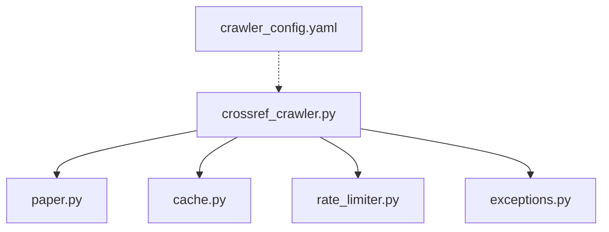
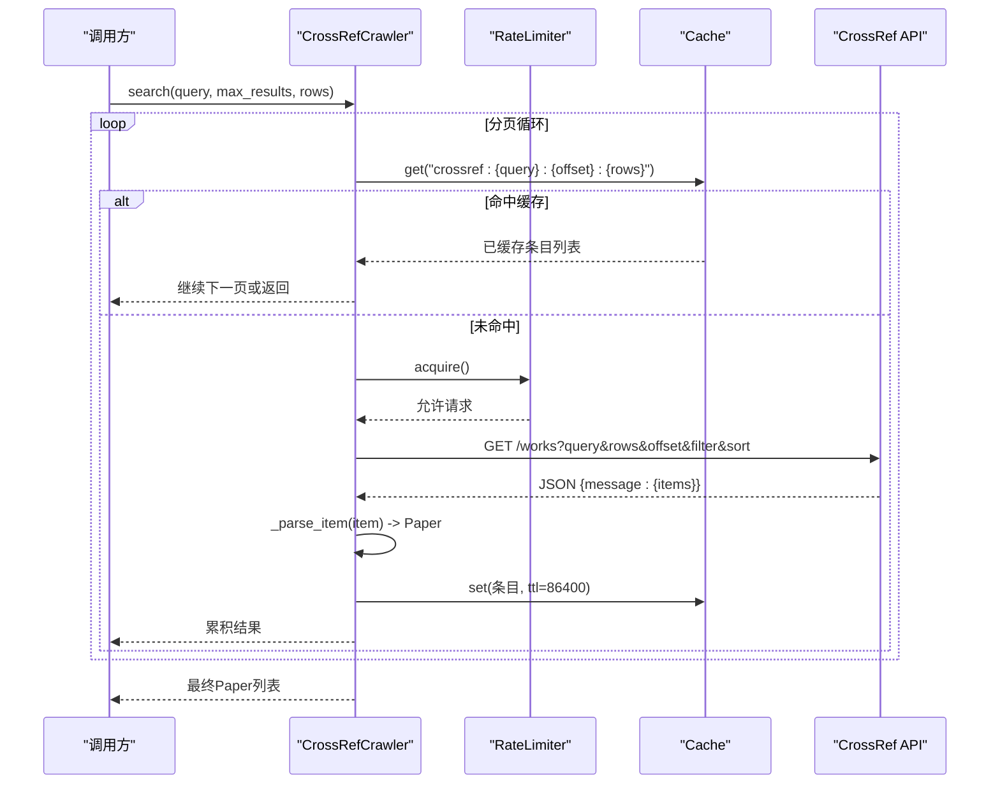
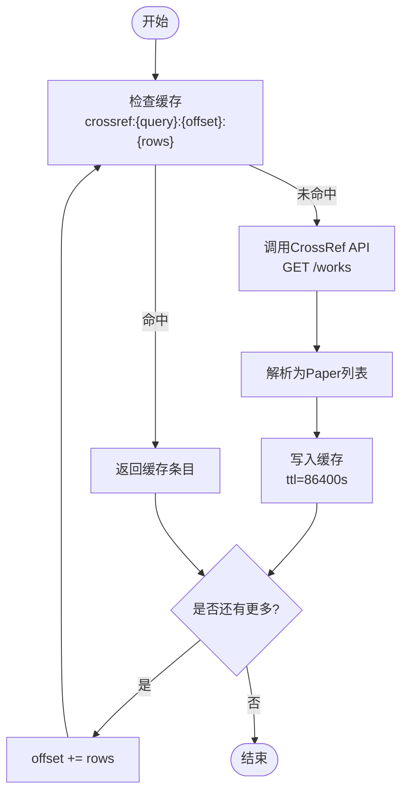
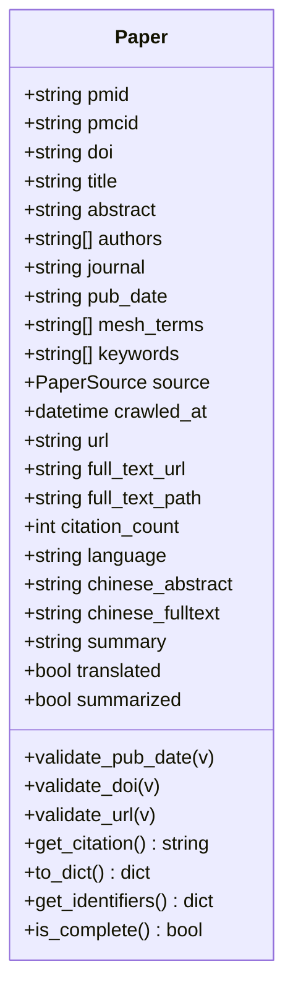
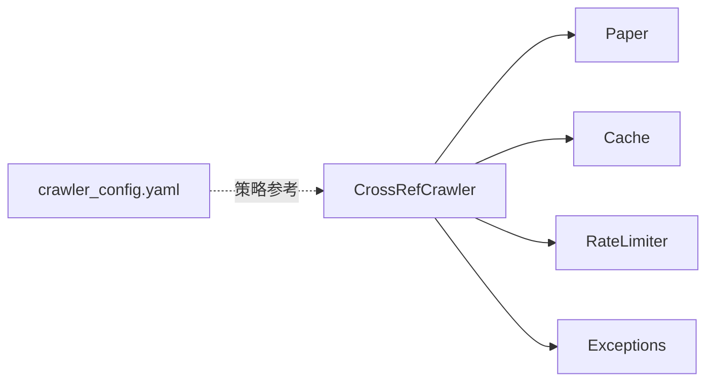

# CrossRef爬虫

<cite>
**本文引用的文件**
- [crossref_crawler.py](file://src/crawlers/crossref_crawler.py)
- [paper.py](file://src/models/paper.py)
- [cache.py](file://src/utils/cache.py)
- [rate_limiter.py](file://src/utils/rate_limiter.py)
- [exceptions.py](file://src/exceptions.py)
- [crawler_config.yaml](file://configs/crawler_config.yaml)
</cite>

## 目录
1. [简介](#简介)
2. [项目结构](#项目结构)
3. [核心组件](#核心组件)
4. [架构总览](#架构总览)
5. [详细组件分析](#详细组件分析)
6. [依赖关系分析](#依赖关系分析)
7. [性能与优化](#性能与优化)
8. [故障排查指南](#故障排查指南)
9. [结论](#结论)
10. [附录：接口、响应与错误处理](#附录接口响应与错误处理)

## 简介
本技术文档聚焦于CrossRef爬虫，围绕以下目标展开：DOI解析、引用关系获取（通过外部数据源补充）、学术元数据标准化、REST API调用策略、批量查询优化、引用网络分析思路、以及元数据补全机制。同时涵盖DOI验证、作者信息提取、期刊元数据处理、查询接口与响应格式说明，以及错误处理策略。

该实现基于CrossRef的免费开放API（无需API Key），通过速率限制、缓存与重试机制，稳定地抓取与白点病（vitiligo）相关的论文元数据，并将其标准化为统一的Paper模型，便于后续存储、检索与分析。

## 项目结构
与CrossRef爬虫直接相关的代码位于src/crawlers下，配合src/models/paper.py进行数据建模，使用src/utils/cache.py做本地SQLite缓存，使用src/utils/rate_limiter.py进行请求限速，并通过全局异常定义src/exceptions.py统一错误类型。配置项集中在configs/crawler_config.yaml中，用于不同爬取器的通用设置。

图表来源
- [crossref_crawler.py:1-202](file://src/crawlers/crossref_crawler.py#L1-L202)
- [paper.py:1-263](file://src/models/paper.py#L1-L263)
- [cache.py:1-147](file://src/utils/cache.py#L1-L147)
- [rate_limiter.py:1-81](file://src/utils/rate_limiter.py#L1-L81)
- [exceptions.py:1-39](file://src/exceptions.py#L1-L39)
- [crawler_config.yaml:1-143](file://configs/crawler_config.yaml#L1-L143)

章节来源
- [crossref_crawler.py:1-202](file://src/crawlers/crossref_crawler.py#L1-L202)
- [crawler_config.yaml:1-143](file://configs/crawler_config.yaml#L1-L143)

## 核心组件
- CrossRefCrawler：封装CrossRef REST API调用、分页搜索、缓存命中、重试退避、结果解析与标准化。
- Paper模型：统一学术文献数据结构，包含标识符（PMID/PMCID/DOI）、标题、摘要、作者、期刊、发表日期、关键词、来源、URL等字段，并提供DOI/URL校验、引用字符串生成等方法。
- Cache：线程安全的SQLite缓存，支持TTL过期清理，减少重复API请求。
- RateLimiter：令牌桶算法实现的并发限速器，避免触发CrossRef限流。
- 异常体系：统一CrawlerError及其子类，便于上层捕获和处理。

章节来源
- [crossref_crawler.py:31-202](file://src/crawlers/crossref_crawler.py#L31-L202)
- [paper.py:18-225](file://src/models/paper.py#L18-L225)
- [cache.py:16-147](file://src/utils/cache.py#L16-L147)
- [rate_limiter.py:10-81](file://src/utils/rate_limiter.py#L10-L81)
- [exceptions.py:13-39](file://src/exceptions.py#L13-L39)

## 架构总览
CrossRef爬虫的整体流程如下：
- 入口：search(query, max_results, rows)发起分页搜索。
- 每页：_fetch_page先查缓存，未命中则_request_api调用CrossRef API，带过滤与排序参数。
- 解析：_parse_item将CrossRef返回的JSON映射到Paper对象，清洗摘要HTML标签，规范化作者名、期刊、发布日期等。
- 缓存：将解析后的轻量级条目写入缓存，键包含query、offset、rows，TTL默认24小时。
- 限速：每次HTTP请求前通过RateLimiter控制速率，避免超限。
- 重试：对网络异常采用指数退避重试，最多3次。

图表来源
- [crossref_crawler.py:60-151](file://src/crawlers/crossref_crawler.py#L60-L151)
- [cache.py:66-114](file://src/utils/cache.py#L66-L114)
- [rate_limiter.py:43-62](file://src/utils/rate_limiter.py#L43-L62)

## 详细组件分析

### CrossRefCrawler
- 功能要点
  - 分页搜索：按rows大小拉取，自动递增offset直到达到max_results或无更多数据。
  - 过滤与排序：固定filter="type:journal-article"，sort="relevance"，确保只获取期刊文章并按相关性排序。
  - 缓存键设计：crossref:{query}:{offset}:{rows}，避免重复请求相同分页。
  - 解析逻辑：
    - 标题：取title数组首项。
    - 作者：遍历author数组，拼接given+family。
    - 摘要：若为HTML片段，去除标签后保留纯文本。
    - DOI与URL：从item.DOI构造https://doi.org/{doi}。
    - 期刊：container-title首项。
    - 出版日期：从published.date-parts组装YYYY-MM-DD。
  - 错误处理：捕获requests.RequestException并记录警告，指数退避重试，失败返回空列表。
- 关键路径
  - search -> _fetch_page -> _request_api -> _parse_item
  - 缓存读写在_fetch_page前后完成

图表来源
- [crossref_crawler.py:60-151](file://src/crawlers/crossref_crawler.py#L60-L151)
- [crossref_crawler.py:153-202](file://src/crawlers/crossref_crawler.py#L153-L202)

章节来源
- [crossref_crawler.py:60-202](file://src/crawlers/crossref_crawler.py#L60-L202)

### Paper模型与元数据标准化
- 标准化职责
  - 统一标识符：pmid、pmcid、doi；提供get_identifiers()聚合。
  - 基础元数据：title、abstract、authors、journal、pub_date。
  - 医学元数据：mesh_terms、keywords（当前由其他来源填充）。
  - 来源与时间戳：source、crawled_at。
  - URL与全文：url、full_text_url、full_text_path。
  - 统计与语言：citation_count、language。
  - 翻译与总结：chinese_abstract、chinese_fulltext、summary。
  - 状态标记：translated、summarized。
- 校验与转换
  - pub_date：尝试解析YYYY-MM-DD，否则提取年份。
  - doi：必须以“10.”开头，或从URL中提取。
  - url：无前缀时自动补全https://。
  - is_complete：判断是否具备最小可用数据（title + 任一标识符）。
  - get_citation：生成标准引用字符串。

图表来源
- [paper.py:18-225](file://src/models/paper.py#L18-L225)

章节来源
- [paper.py:18-225](file://src/models/paper.py#L18-L225)

### 缓存与速率限制
- Cache
  - 基于SQLite，线程安全，支持TTL过期清理。
  - set/get/delete/clear/close方法，上下文管理器支持。
  - 跨进程共享可通过持久化db_path实现。
- RateLimiter
  - 令牌桶算法，按秒速率平滑限流。
  - 支持acquire阻塞等待，__enter__/__exit__作为上下文管理器。
  - 默认50 req/s，匹配CrossRef免费额度。

章节来源
- [cache.py:16-147](file://src/utils/cache.py#L16-L147)
- [rate_limiter.py:10-81](file://src/utils/rate_limiter.py#L10-L81)

### 错误处理与重试
- 网络异常：捕获requests.RequestException，记录警告日志，指数退避重试（INITIAL_BACKOFF * 2^(attempt-1)），最多MAX_RETRIES次。
- 解析异常：创建Paper失败时记录警告并跳过该条目。
- 统一异常：可结合CrawlerError、APIError、RateLimitError、CacheError进行上层分类处理。

章节来源
- [crossref_crawler.py:124-151](file://src/crawlers/crossref_crawler.py#L124-L151)
- [crossref_crawler.py:188-202](file://src/crawlers/crossref_crawler.py#L188-L202)
- [exceptions.py:13-39](file://src/exceptions.py#L13-L39)

## 依赖关系分析
- CrossRefCrawler依赖：
  - requests：HTTP客户端。
  - src.models.paper.Paper：数据模型。
  - src.utils.cache.Cache：缓存。
  - src.utils.rate_limiter.RateLimiter：限速。
- 配置：
  - configs/crawler_config.yaml提供通用爬取器设置（重试、超时、输出目录、日志级别等），虽未直接注入CrossRefCrawler，但可作为整体运行策略参考。

图表来源
- [crossref_crawler.py:1-202](file://src/crawlers/crossref_crawler.py#L1-L202)
- [paper.py:1-263](file://src/models/paper.py#L1-L263)
- [cache.py:1-147](file://src/utils/cache.py#L1-L147)
- [rate_limiter.py:1-81](file://src/utils/rate_limiter.py#L1-L81)
- [exceptions.py:1-39](file://src/exceptions.py#L1-L39)
- [crawler_config.yaml:1-143](file://configs/crawler_config.yaml#L1-L143)

章节来源
- [crossref_crawler.py:1-202](file://src/crawlers/crossref_crawler.py#L1-L202)
- [crawler_config.yaml:1-143](file://configs/crawler_config.yaml#L1-L143)

## 性能与优化
- 批量查询优化
  - 分页参数rows最大支持1000，合理设置可减少请求次数。
  - 使用offset递增实现分页，直至返回条数小于rows或达到max_results。
- 缓存策略
  - 以query+offset+rows为键，避免重复请求相同分页。
  - TTL默认86400秒（24小时），平衡新鲜度与命中率。
- 速率限制
  - 默认50 req/s，符合CrossRef免费额度，避免被限流。
- 重试与退避
  - 指数退避降低瞬时失败影响，提高鲁棒性。
- 解析优化
  - 仅提取必要字段，减少内存占用。
  - 摘要HTML清洗避免冗余字符。

[本节为通用性能建议，不直接分析具体文件]

## 故障排查指南
- 常见错误
  - 网络异常：检查网络连通性与CrossRef服务可用性；查看日志中的重试次数与退避间隔。
  - 限流：确认RateLimiter配置与并发量；必要时降低并发或增加间隔。
  - 解析失败：检查CrossRef返回字段变化；关注摘要HTML清洗逻辑。
  - 缓存问题：确认SQLite数据库路径与权限；必要时clear或调整TTL。
- 定位步骤
  - 启用更详细的日志级别，观察_request_api与_parse_item的调用轨迹。
  - 临时关闭缓存，验证是否为缓存键冲突导致的数据不一致。
  - 使用独立测试用例模拟不同query与rows组合，验证分页边界条件。

章节来源
- [crossref_crawler.py:124-151](file://src/crawlers/crossref_crawler.py#L124-L151)
- [crossref_crawler.py:153-202](file://src/crawlers/crossref_crawler.py#L153-L202)
- [cache.py:66-114](file://src/utils/cache.py#L66-L114)
- [exceptions.py:13-39](file://src/exceptions.py#L13-L39)

## 结论
CrossRef爬虫通过稳健的分页、缓存、限速与重试机制，高效地从CrossRef API获取白点病相关论文的元数据，并将其标准化为统一的Paper模型。该实现满足DOI解析、作者与期刊信息提取、发布日期规范化等核心需求。对于引用关系获取与引用网络分析，可在现有基础上引入外部数据源（如Semantic Scholar）进行补充，构建更完整的引用图谱。

[本节为总结性内容，不直接分析具体文件]

## 附录：接口、响应与错误处理

### CrossRef REST API调用
- 端点：https://api.crossref.org/works
- 常用参数
  - query：搜索词（例如“vitiligo”）
  - rows：每页条数（最大1000）
  - offset：偏移量（分页起始位置）
  - filter：过滤器（例如type:journal-article）
  - sort：排序方式（例如relevance）
- 超时：默认15秒，可根据网络环境调整

章节来源
- [crossref_crawler.py:124-151](file://src/crawlers/crossref_crawler.py#L124-L151)

### 响应格式
- 顶层结构：{ message: { items: [...] } }
- items元素关键字段
  - title：数组，取首项作为标题
  - author：数组，每项含given与family，拼接为作者名
  - abstract：可能为HTML片段，需清洗
  - DOI：数字对象标识符
  - container-title：数组，首项为期刊名
  - published.date-parts：[[年, 月, 日]]，用于组装发布日期

章节来源
- [crossref_crawler.py:153-202](file://src/crawlers/crossref_crawler.py#L153-L202)

### DOI验证
- 规则：必须以“10.”开头，或从URL中提取
- 作用：保证标识符有效性，便于后续链接与去重

章节来源
- [paper.py:159-174](file://src/models/paper.py#L159-L174)

### 引用统计与引用网络分析
- 当前实现：Paper模型包含citation_count字段，但CrossRef爬虫未直接填充该字段
- 扩展建议：
  - 通过Semantic Scholar或其他引文数据库，根据DOI查询引用次数
  - 构建引用图：以DOI为节点，建立“被引用/引用”边，支持中心性分析与热点追踪
  - 增量更新：定期刷新引用统计，保持时效性

[本节为概念性扩展建议，不直接分析具体文件]

### 作者信息与期刊元数据处理
- 作者：遍历author数组，拼接given与family，过滤空值
- 期刊：取container-title首项
- 发布日期：从published.date-parts组装YYYY-MM-DD

章节来源
- [crossref_crawler.py:153-202](file://src/crawlers/crossref_crawler.py#L153-L202)

### 错误处理策略
- 网络异常：捕获RequestException，记录警告，指数退避重试
- 解析异常：创建Paper失败时记录警告并跳过
- 统一异常：可使用CrawlerError及其子类进行分类处理

章节来源
- [crossref_crawler.py:124-151](file://src/crawlers/crossref_crawler.py#L124-L151)
- [crossref_crawler.py:188-202](file://src/crawlers/crossref_crawler.py#L188-L202)
- [exceptions.py:13-39](file://src/exceptions.py#L13-L39)