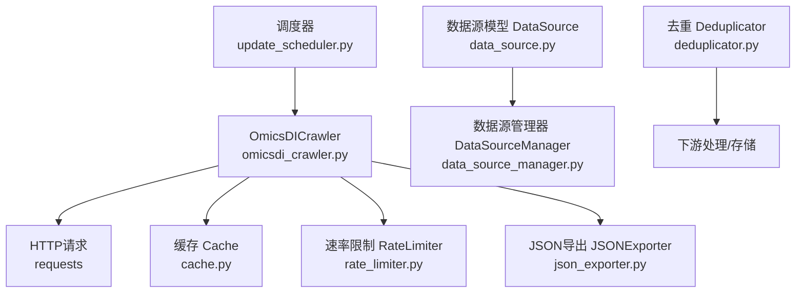
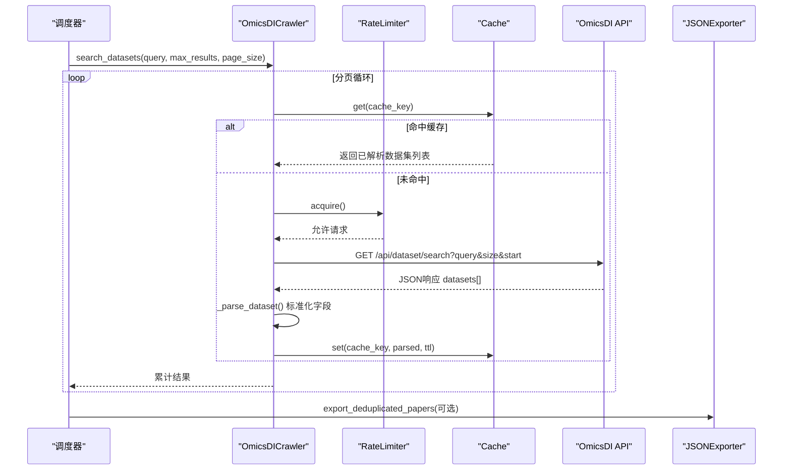
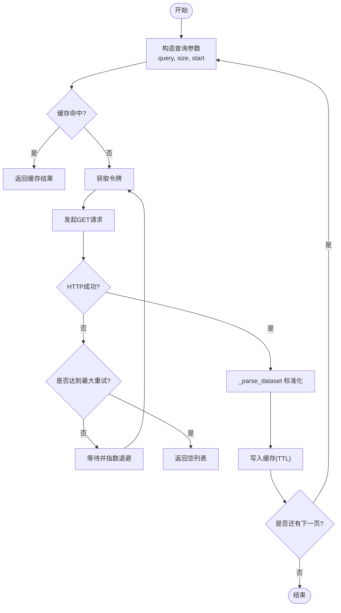
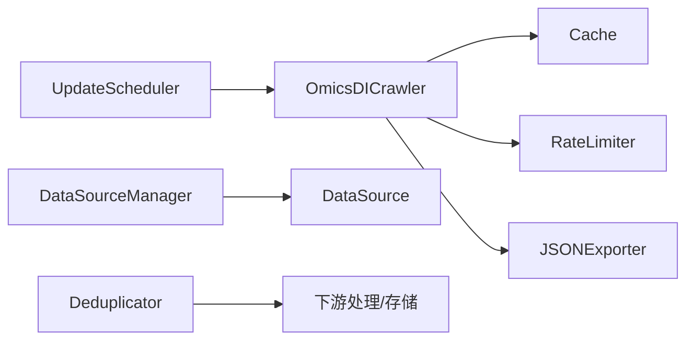

# OmicsDI爬虫

<cite>
**本文引用的文件**
- [src/crawlers/omicsdi_crawler.py](file://src/crawlers/omicsdi_crawler.py)
- [configs/crawler_config.yaml](file://configs/crawler_config.yaml)
- [src/models/data_source.py](file://src/models/data_source.py)
- [src/utils/data_source_manager.py](file://src/utils/data_source_manager.py)
- [src/utils/cache.py](file://src/utils/cache.py)
- [src/utils/rate_limiter.py](file://src/utils/rate_limiter.py)
- [src/processors/deduplicator.py](file://src/processors/deduplicator.py)
- [src/exporters/json_exporter.py](file://src/exporters/json_exporter.py)
- [src/scheduler/update_scheduler.py](file://src/scheduler/update_scheduler.py)
</cite>

## 目录
1. [简介](#简介)
2. [项目结构](#项目结构)
3. [核心组件](#核心组件)
4. [架构总览](#架构总览)
5. [详细组件分析](#详细组件分析)
6. [依赖关系分析](#依赖关系分析)
7. [性能与可扩展性](#性能与可扩展性)
8. [数据质量、元数据标准化与版本管理](#数据质量元数据标准化与版本管理)
9. [故障排查指南](#故障排查指南)
10. [结论](#结论)
11. [附录：查询接口、数据格式与集成示例](#附录查询接口数据格式与集成示例)

## 简介
本技术文档聚焦于OmicsDI爬虫，围绕组学数据集成平台的数据抓取、生物标志物发现与关联分析能力展开。文档详细说明OmicsDI API调用、数据集搜索、实验结果提取和多组学数据整合流程，并给出数据质量评估、元数据标准化、版本管理与数据验证的实践建议。同时提供具体的查询接口、数据格式和集成示例，帮助读者快速上手并稳定运行。

## 项目结构
本项目将OmicsDI爬虫作为多源数据爬取体系的一部分，位于爬虫模块中，并通过调度器统一编排执行；配套工具包括缓存、限流、去重、导出等通用能力。

图表来源
- [src/scheduler/update_scheduler.py:817-828](file://src/scheduler/update_scheduler.py#L817-L828)
- [src/crawlers/omicsdi_crawler.py:30-165](file://src/crawlers/omicsdi_crawler.py#L30-L165)
- [src/utils/cache.py:16-147](file://src/utils/cache.py#L16-L147)
- [src/utils/rate_limiter.py:10-81](file://src/utils/rate_limiter.py#L10-L81)
- [src/exporters/json_exporter.py:19-120](file://src/exporters/json_exporter.py#L19-L120)
- [src/models/data_source.py:98-214](file://src/models/data_source.py#L98-L214)
- [src/utils/data_source_manager.py:100-381](file://src/utils/data_source_manager.py#L100-L381)
- [src/processors/deduplicator.py:28-319](file://src/processors/deduplicator.py#L28-L319)

章节来源
- [src/crawlers/omicsdi_crawler.py:1-165](file://src/crawlers/omicsdi_crawler.py#L1-L165)
- [configs/crawler_config.yaml:1-143](file://configs/crawler_config.yaml#L1-L143)
- [src/models/data_source.py:1-284](file://src/models/data_source.py#L1-L284)
- [src/utils/data_source_manager.py:1-381](file://src/utils/data_source_manager.py#L1-L381)
- [src/utils/cache.py:1-147](file://src/utils/cache.py#L1-L147)
- [src/utils/rate_limiter.py:1-81](file://src/utils/rate_limiter.py#L1-L81)
- [src/processors/deduplicator.py:1-319](file://src/processors/deduplicator.py#L1-L319)
- [src/exporters/json_exporter.py:1-120](file://src/exporters/json_exporter.py#L1-L120)
- [src/scheduler/update_scheduler.py:792-828](file://src/scheduler/update_scheduler.py#L792-L828)

## 核心组件
- OmicsDICrawler：封装OmicsDI数据集搜索API，支持分页、重试、缓存与速率限制，输出标准化的数据集记录。
- Cache：基于SQLite的线程安全缓存，支持TTL过期清理。
- RateLimiter：令牌桶算法实现的并发限流器，避免对远端API造成压力。
- DataSource/DataSourceManager：定义数据源元数据模型与管理器，便于统一配置与策略管理。
- Deduplicator：用于多源数据的去重与合并（论文为主，可复用思路到组学数据）。
- JSONExporter：按日期组织导出数据，便于归档与回溯。
- UpdateScheduler：调度器负责定时或触发式执行各爬虫任务，包含OmicsDI任务的运行入口。

章节来源
- [src/crawlers/omicsdi_crawler.py:30-165](file://src/crawlers/omicsdi_crawler.py#L30-L165)
- [src/utils/cache.py:16-147](file://src/utils/cache.py#L16-L147)
- [src/utils/rate_limiter.py:10-81](file://src/utils/rate_limiter.py#L10-L81)
- [src/models/data_source.py:98-214](file://src/models/data_source.py#L98-L214)
- [src/utils/data_source_manager.py:100-381](file://src/utils/data_source_manager.py#L100-L381)
- [src/processors/deduplicator.py:28-319](file://src/processors/deduplicator.py#L28-L319)
- [src/exporters/json_exporter.py:19-120](file://src/exporters/json_exporter.py#L19-L120)
- [src/scheduler/update_scheduler.py:817-828](file://src/scheduler/update_scheduler.py#L817-L828)

## 架构总览
下图展示了从调度器到OmicsDI API的完整调用链，以及缓存、限流、导出与数据管理的协作关系。

图表来源
- [src/scheduler/update_scheduler.py:817-828](file://src/scheduler/update_scheduler.py#L817-L828)
- [src/crawlers/omicsdi_crawler.py:55-165](file://src/crawlers/omicsdi_crawler.py#L55-L165)
- [src/utils/cache.py:66-114](file://src/utils/cache.py#L66-L114)
- [src/utils/rate_limiter.py:43-62](file://src/utils/rate_limiter.py#L43-L62)
- [src/exporters/json_exporter.py:87-120](file://src/exporters/json_exporter.py#L87-L120)

## 详细组件分析

### OmicsDICrawler 组件
- 功能要点
  - 调用OmicsDI数据集搜索API，支持query、page_size、start分页参数。
  - 内置重试与退避机制，提升网络不稳定时的鲁棒性。
  - 使用缓存减少重复请求，TTL默认24小时。
  - 通过速率限制控制请求频率，避免触发远端限流。
  - 标准化输出字段：id、title、description、repository、accession、omics_type、url、pub_date、organisms、source。
- 关键方法
  - search_datasets：主入口，分页拉取并聚合结果。
  - _fetch_page：单页获取与缓存读写。
  - _request_api：带重试的HTTP请求。
  - _parse_dataset：字段映射与清洗。
  - get_vitiligo_genomics/get_vitiligo_proteomics：便捷查询方法。
- 复杂度与性能
  - 时间复杂度近似O(N)，N为返回数据集条目数。
  - 空间复杂度受缓存与内存中结果集影响，合理设置page_size与max_results可控制峰值内存。
- 错误处理
  - 捕获网络异常并重试，超过最大次数返回空列表。
  - 解析失败时记录警告并跳过该条记录。

图表来源
- [src/crawlers/omicsdi_crawler.py:55-165](file://src/crawlers/omicsdi_crawler.py#L55-L165)
- [src/utils/cache.py:66-114](file://src/utils/cache.py#L66-L114)
- [src/utils/rate_limiter.py:43-62](file://src/utils/rate_limiter.py#L43-L62)

章节来源
- [src/crawlers/omicsdi_crawler.py:30-165](file://src/crawlers/omicsdi_crawler.py#L30-L165)

### 缓存与速率限制
- Cache
  - 线程安全SQLite实现，支持TTL自动清理。
  - 键设计包含query、start、page_size，确保分页结果独立缓存。
- RateLimiter
  - 令牌桶算法，支持上下文管理器，阻塞直到令牌可用。
  - 防止突发流量导致远端限流或封禁。

章节来源
- [src/utils/cache.py:16-147](file://src/utils/cache.py#L16-L147)
- [src/utils/rate_limiter.py:10-81](file://src/utils/rate_limiter.py#L10-L81)

### 数据源模型与管理器
- DataSource
  - 定义数据源的分类、类型、访问方式、成本、质量等级、优先级、采集方法等元数据。
  - 提供校验规则与方法（如是否需要限速、伦理考量等）。
- DataSourceManager
  - 加载YAML配置，构建类别、数据源、优先级分组、采集策略与质量标准。
  - 提供按类别、类型、访问方式等维度查询数据源的能力。
  - 生成采集计划，汇总工具需求与估计数据量。

章节来源
- [src/models/data_source.py:98-214](file://src/models/data_source.py#L98-L214)
- [src/utils/data_source_manager.py:100-381](file://src/utils/data_source_manager.py#L100-L381)
- [configs/crawler_config.yaml:1-143](file://configs/crawler_config.yaml#L1-L143)

### 去重与导出
- Deduplicator
  - 针对多源数据（如论文）进行标识符优先的去重与合并，保留来源追溯。
  - 可复用到组学数据集，以accession或唯一ID作为主键进行合并。
- JSONExporter
  - 按日期组织导出目录，序列化对象并写入JSON。
  - 支持导出原始数据与去重后数据，附带元信息。

章节来源
- [src/processors/deduplicator.py:28-319](file://src/processors/deduplicator.py#L28-L319)
- [src/exporters/json_exporter.py:19-120](file://src/exporters/json_exporter.py#L19-L120)

### 调度器集成
- UpdateScheduler
  - 提供运行OmicsDI爬虫的方法，封装起止时间、统计信息与异常处理。
  - 可通过定时任务或手动触发执行数据采集。

章节来源
- [src/scheduler/update_scheduler.py:817-828](file://src/scheduler/update_scheduler.py#L817-L828)

## 依赖关系分析
- OmicsDICrawler依赖：
  - requests：HTTP客户端。
  - Cache：本地缓存。
  - RateLimiter：并发控制。
- 调度器依赖：
  - OmicsDICrawler：执行具体抓取逻辑。
- 数据模型与管理器：
  - DataSource/DataSourceManager：集中管理数据源配置与策略。
- 数据处理：
  - Deduplicator：去重与合并。
  - JSONExporter：持久化导出。

图表来源
- [src/scheduler/update_scheduler.py:817-828](file://src/scheduler/update_scheduler.py#L817-L828)
- [src/crawlers/omicsdi_crawler.py:30-165](file://src/crawlers/omicsdi_crawler.py#L30-L165)
- [src/utils/cache.py:16-147](file://src/utils/cache.py#L16-L147)
- [src/utils/rate_limiter.py:10-81](file://src/utils/rate_limiter.py#L10-L81)
- [src/exporters/json_exporter.py:19-120](file://src/exporters/json_exporter.py#L19-L120)
- [src/models/data_source.py:98-214](file://src/models/data_source.py#L98-L214)
- [src/utils/data_source_manager.py:100-381](file://src/utils/data_source_manager.py#L100-L381)
- [src/processors/deduplicator.py:28-319](file://src/processors/deduplicator.py#L28-L319)

章节来源
- [src/crawlers/omicsdi_crawler.py:30-165](file://src/crawlers/omicsdi_crawler.py#L30-L165)
- [src/utils/cache.py:16-147](file://src/utils/cache.py#L16-L147)
- [src/utils/rate_limiter.py:10-81](file://src/utils/rate_limiter.py#L10-L81)
- [src/exporters/json_exporter.py:19-120](file://src/exporters/json_exporter.py#L19-L120)
- [src/models/data_source.py:98-214](file://src/models/data_source.py#L98-L214)
- [src/utils/data_source_manager.py:100-381](file://src/utils/data_source_manager.py#L100-L381)
- [src/processors/deduplicator.py:28-319](file://src/processors/deduplicator.py#L28-L319)
- [src/scheduler/update_scheduler.py:817-828](file://src/scheduler/update_scheduler.py#L817-L828)

## 性能与可扩展性
- 性能优化
  - 分页大小与最大结果数可调，平衡内存与网络开销。
  - 缓存TTL设置为24小时，降低重复请求。
  - 令牌桶限流保护远端服务，避免触发限流。
  - 重试与指数退避提高稳定性。
- 可扩展性
  - 通过DataSourceManager统一管理数据源与策略，便于新增其他组学数据源。
  - 去重与导出模块可复用至其他数据管道。
  - 调度器支持扩展更多爬虫任务。

[本节为通用指导，不直接分析具体文件]

## 数据质量、元数据标准化与版本管理
- 数据质量评估
  - 在爬虫层进行基础校验（字段存在性、长度限制），解析失败记录日志并跳过。
  - 建议在下游增加更严格的Schema校验（例如Pydantic模型），确保字段类型与取值范围。
- 元数据标准化
  - 统一字段命名与类型（id、title、description、repository、accession、omics_type、url、pub_date、organisms、source）。
  - 通过DataSource模型定义数据源元数据，便于追踪来源、质量等级与优先级。
- 版本管理
  - 导出文件按日期组织，附带元信息（导出时间、数据来源、是否去重）。
  - 建议在数据库或对象存储中标记数据版本标签，支持回滚与审计。
- 数据验证
  - 使用DataSourceManager的validate_configuration检查配置一致性。
  - 在导入下游前执行字段级校验与完整性检查（非空、枚举值、数值范围）。

章节来源
- [src/crawlers/omicsdi_crawler.py:134-150](file://src/crawlers/omicsdi_crawler.py#L134-L150)
- [src/models/data_source.py:114-177](file://src/models/data_source.py#L114-L177)
- [src/utils/data_source_manager.py:82-97](file://src/utils/data_source_manager.py#L82-L97)
- [src/exporters/json_exporter.py:87-120](file://src/exporters/json_exporter.py#L87-L120)

## 故障排查指南
- 常见问题
  - 网络超时或连接失败：检查timeout与重试策略，确认网络连通性与代理设置。
  - 远端限流：调整RateLimiter的每秒请求数，或增大TTL以减少重复请求。
  - 缓存未命中：检查缓存键是否与查询参数一致，确认TTL是否过期。
  - 解析失败：查看日志中的警告信息，确认OmicsDI返回字段是否变化。
- 定位步骤
  - 启用详细日志，观察_request_api与_parse_dataset的执行路径。
  - 临时关闭缓存，确认是否为缓存问题。
  - 降低page_size与max_results，逐步缩小问题范围。
  - 使用调度器的统计信息（耗时、错误列表）定位瓶颈。

章节来源
- [src/crawlers/omicsdi_crawler.py:105-132](file://src/crawlers/omicsdi_crawler.py#L105-L132)
- [src/utils/cache.py:66-114](file://src/utils/cache.py#L66-L114)
- [src/utils/rate_limiter.py:43-62](file://src/utils/rate_limiter.py#L43-L62)
- [src/scheduler/update_scheduler.py:817-828](file://src/scheduler/update_scheduler.py#L817-L828)

## 结论
OmicsDI爬虫在本项目中提供了稳定、可控的多组学数据集抓取能力，结合缓存、限流、去重与导出等工具，形成了完整的采集流水线。通过DataSource模型与管理器，系统具备良好的扩展性与可维护性。建议在下游引入更强的数据验证与版本管理，进一步提升数据质量与分析可靠性。

[本节为总结性内容，不直接分析具体文件]

## 附录：查询接口、数据格式与集成示例
- 查询接口
  - 基础搜索：search_datasets(query="vitiligo", max_results=200, page_size=20)
  - 基因组学/转录组学：get_vitiligo_genomics()
  - 蛋白质组学：get_vitiligo_proteomics()
- 数据格式
  - 每条记录包含：id、title、description、repository、accession、omics_type、url、pub_date、organisms、source。
  - 导出格式：JSON，按日期目录组织，支持去重后导出并附带元信息。
- 集成示例
  - 调度器调用：通过_update_scheduler中的_ run_omicsdi_crawler方法执行采集。
  - 缓存与限流：自动生效，无需额外配置。
  - 导出与归档：使用JSONExporter导出，便于后续分析与可视化。

章节来源
- [src/crawlers/omicsdi_crawler.py:55-165](file://src/crawlers/omicsdi_crawler.py#L55-L165)
- [src/exporters/json_exporter.py:19-120](file://src/exporters/json_exporter.py#L19-L120)
- [src/scheduler/update_scheduler.py:817-828](file://src/scheduler/update_scheduler.py#L817-L828)