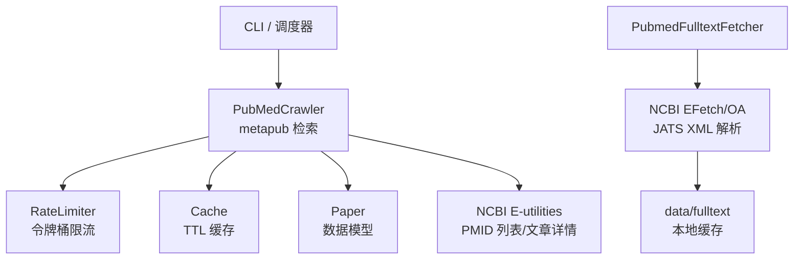
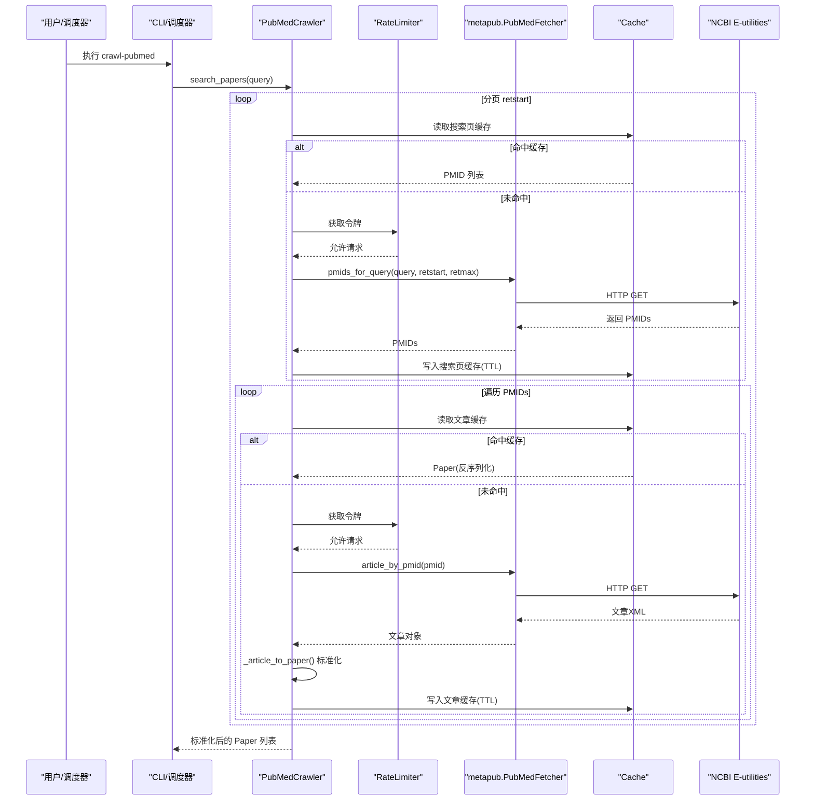
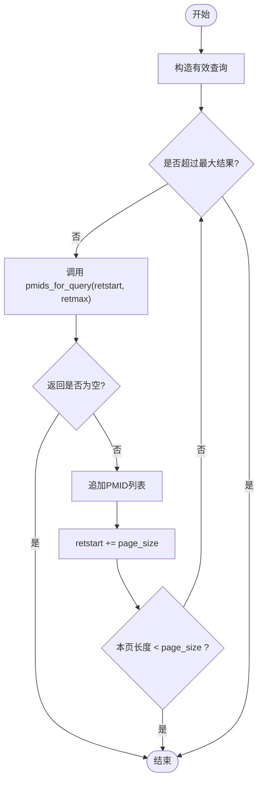
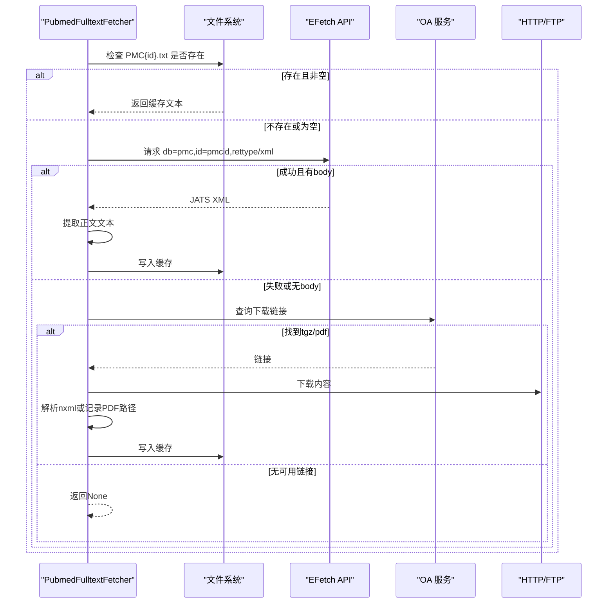
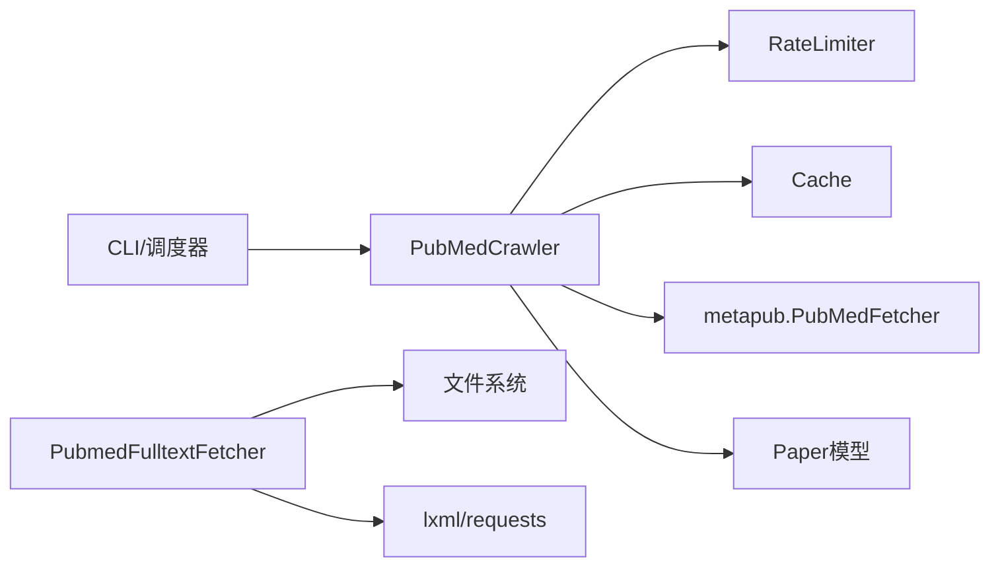

# PubMed爬虫

<cite>
**本文引用的文件**
- [pubmed_crawler.py](file://src/crawlers/pubmed_crawler.py)
- [pubmed_fulltext.py](file://src/crawlers/pubmed_fulltext.py)
- [paper.py](file://src/models/paper.py)
- [rate_limiter.py](file://src/utils/rate_limiter.py)
- [cache.py](file://src/utils/cache.py)
- [crawler_config.yaml](file://configs/crawler_config.yaml)
- [cli.py](file://src/cli.py)
- [update_scheduler.py](file://src/scheduler/update_scheduler.py)
- [test_pubmed_crawler.py](file://tests/test_pubmed_crawler.py)
- [exceptions.py](file://src/exceptions.py)
</cite>

## 目录
1. [简介](#简介)
2. [项目结构](#项目结构)
3. [核心组件](#核心组件)
4. [架构总览](#架构总览)
5. [详细组件分析](#详细组件分析)
6. [依赖关系分析](#依赖关系分析)
7. [性能与速率限制](#性能与速率限制)
8. [缓存策略](#缓存策略)
9. [错误处理与异常恢复](#错误处理与异常恢复)
10. [使用示例与配置参数](#使用示例与配置参数)
11. [故障排查指南](#故障排查指南)
12. [结论](#结论)

## 简介
本技术文档围绕基于 metapub 的 PubMed 文献抓取实现，系统阐述 MeSH 术语搜索、分页获取 PMID 列表、文章详情解析与数据标准化流程；说明 NCBI API 密钥配置、请求速率限制（无密钥 3 req/s，有密钥 10 req/s）、缓存策略与指数退避重试机制；并提供错误处理、异常恢复与性能优化建议及具体使用示例。

## 项目结构
PubMed 爬虫位于爬虫模块中，配合模型、工具与调度器共同完成数据采集、标准化与持久化：
- 爬虫层：PubMedCrawler（基于 metapub），PubmedFulltextFetcher（PMC 全文）
- 数据模型：Paper（Pydantic 模型）
- 工具层：RateLimiter（令牌桶限流）、Cache（SQLite TTL 缓存）
- 配置：crawler_config.yaml（爬虫配置）
- 入口与调度：CLI 命令与更新调度器

图表来源
- [pubmed_crawler.py:40-127](file://src/crawlers/pubmed_crawler.py#L40-L127)
- [pubmed_fulltext.py:47-85](file://src/crawlers/pubmed_fulltext.py#L47-L85)
- [rate_limiter.py:10-31](file://src/utils/rate_limiter.py#L10-L31)
- [cache.py:16-33](file://src/utils/cache.py#L16-L33)
- [paper.py:18-79](file://src/models/paper.py#L18-L79)

章节来源
- [pubmed_crawler.py:1-127](file://src/crawlers/pubmed_crawler.py#L1-L127)
- [pubmed_fulltext.py:1-85](file://src/crawlers/pubmed_fulltext.py#L1-L85)
- [paper.py:1-79](file://src/models/paper.py#L1-L79)
- [rate_limiter.py:1-31](file://src/utils/rate_limiter.py#L1-L31)
- [cache.py:1-33](file://src/utils/cache.py#L1-L33)
- [crawler_config.yaml:12-42](file://configs/crawler_config.yaml#L12-L42)

## 核心组件
- PubMedCrawler：封装 metapub.PubMedFetcher，提供 MeSH 查询、分页拉取 PMIDs、逐篇解析为 Paper、限流、重试与缓存。
- PubmedFulltextFetcher：通过 NCBI EFetch 或 OA 服务下载 PMC 全文 JATS XML，提取正文纯文本并落盘缓存。
- RateLimiter：线程安全令牌桶限流器，按配置的每秒请求数控制调用频率。
- Cache：基于 SQLite 的轻量级缓存，支持 TTL 过期清理与并发安全。
- Paper：统一的数据模型，包含标识、元数据、医学主题词、状态字段等。

章节来源
- [pubmed_crawler.py:40-127](file://src/crawlers/pubmed_crawler.py#L40-L127)
- [pubmed_fulltext.py:47-85](file://src/crawlers/pubmed_fulltext.py#L47-L85)
- [rate_limiter.py:10-31](file://src/utils/rate_limiter.py#L10-L31)
- [cache.py:16-33](file://src/utils/cache.py#L16-L33)
- [paper.py:18-79](file://src/models/paper.py#L18-L79)

## 架构总览
下图展示从 CLI/调度器到 NCBI 的完整调用链，包括限流、缓存、重试与数据标准化。

图表来源
- [pubmed_crawler.py:129-215](file://src/crawlers/pubmed_crawler.py#L129-L215)
- [pubmed_crawler.py:312-339](file://src/crawlers/pubmed_crawler.py#L312-L339)
- [rate_limiter.py:43-61](file://src/utils/rate_limiter.py#L43-L61)
- [cache.py:66-114](file://src/utils/cache.py#L66-L114)

## 详细组件分析

### PubMedCrawler（基于 metapub）
- 功能要点
  - 默认查询：MeSH 术语“vitiligo[MeSH Terms]”，可覆盖。
  - 分页：retstart 递增，retmax=page_size，直到达到 max_results 或返回不足一页。
  - 解析：将 metapub 文章对象标准化为 Paper，兼容多种字段名（如 mesh/mesh_terms/meshheadings）。
  - 限流：通过 RateLimiter 上下文管理器包裹每次网络调用。
  - 重试：对瞬时错误进行指数退避重试，非瞬时错误直接抛出。
  - 缓存：搜索页与单篇文章均缓存，键含 query/retstart/page_size 与 pmid。
- 关键路径
  - search_papers -> _search_pmids_with_pagination -> _fetch_pmids_page -> _with_retries/_call_with_rate_limit
  - _fetch_paper_by_pmid -> _article_to_paper -> 缓存写入
- 复杂度
  - 时间：O(N) 次 PMID 请求，N 为结果数量；每页一次搜索请求。
  - 空间：缓存存储 PMIDs 与文章 JSON，受 TTL 与磁盘容量限制。

图表来源
- [pubmed_crawler.py:154-169](file://src/crawlers/pubmed_crawler.py#L154-L169)

章节来源
- [pubmed_crawler.py:40-127](file://src/crawlers/pubmed_crawler.py#L40-L127)
- [pubmed_crawler.py:129-215](file://src/crawlers/pubmed_crawler.py#L129-L215)
- [pubmed_crawler.py:217-310](file://src/crawlers/pubmed_crawler.py#L217-L310)
- [pubmed_crawler.py:312-361](file://src/crawlers/pubmed_crawler.py#L312-L361)

### PubmedFulltextFetcher（PMC 全文）
- 功能要点
  - 优先通过 EFetch 获取 JATS XML，解析 body 标签提取正文文本。
  - 若 EFetch 不可用，回退至 OA 服务，支持 PDF 或 tgz(nxml) 下载与解析。
  - 本地缓存：以 data/fulltext/PMC{id}.txt 形式持久化全文。
  - 限流与重试：内置最小间隔与指数退避重试。
- 关键点
  - 文本提取：仅抽取 p/title/label/caption/th/td/li/abstract 等正文相关标签，过滤过短片段。
  - 批量：支持 fetch_batch 进度回调与日志统计。

图表来源
- [pubmed_fulltext.py:88-116](file://src/crawlers/pubmed_fulltext.py#L88-L116)
- [pubmed_fulltext.py:180-221](file://src/crawlers/pubmed_fulltext.py#L180-L221)
- [pubmed_fulltext.py:223-301](file://src/crawlers/pubmed_fulltext.py#L223-L301)
- [pubmed_fulltext.py:303-333](file://src/crawlers/pubmed_fulltext.py#L303-L333)

章节来源
- [pubmed_fulltext.py:47-85](file://src/crawlers/pubmed_fulltext.py#L47-L85)
- [pubmed_fulltext.py:88-144](file://src/crawlers/pubmed_fulltext.py#L88-L144)
- [pubmed_fulltext.py:180-333](file://src/crawlers/pubmed_fulltext.py#L180-L333)

### 数据模型 Paper
- 字段涵盖：标识（pmid/pmcid/doi）、标题/摘要、作者/期刊/发表日期、MeSH 术语/关键词、来源/采集时间、语言、翻译与摘要标记、全文路径等。
- 校验：发布日期格式宽松校验、DOI 前缀校验、URL 补全 https。
- 用途：作为爬虫输出与后续处理（翻译、摘要、导出）的统一载体。

章节来源
- [paper.py:18-127](file://src/models/paper.py#L18-L127)
- [paper.py:129-187](file://src/models/paper.py#L129-L187)

### 限流器 RateLimiter
- 算法：令牌桶，按 requests_per_second 速率补充令牌，acquire 阻塞直至获得令牌。
- 线程安全：内部锁保护 refill 与 acquire。
- 用法：在爬虫中通过上下文管理器包裹每次外部调用。

章节来源
- [rate_limiter.py:10-81](file://src/utils/rate_limiter.py#L10-L81)

### 缓存 Cache
- 存储：SQLite 表 cache_entries，字段 key/value/created_at/ttl/expires_at。
- 特性：TTL 自动清理、并发安全、支持 set/get/delete/clear/close。
- 爬虫集成：搜索页与文章分别缓存，键包含查询与分页信息，避免重复请求。

章节来源
- [cache.py:16-147](file://src/utils/cache.py#L16-L147)

## 依赖关系分析
- PubMedCrawler 依赖：
  - metapub.PubMedFetcher（动态导入，缺失时抛出明确错误）
  - RateLimiter（限流）
  - Cache（TTL 缓存）
  - Paper（标准化输出）
- PubmedFulltextFetcher 依赖：
  - requests/lxml（EFetch/OA 请求与 XML 解析）
  - 文件系统（全文缓存）
- 调度与 CLI：
  - CLI 暴露 crawl-pubmed 子命令，调用 PubMedCrawler 并导出 JSON。
  - 调度器周期性运行 PubMedCrawler，保存增量 JSON。

图表来源
- [cli.py:28-46](file://src/cli.py#L28-L46)
- [update_scheduler.py:383-415](file://src/scheduler/update_scheduler.py#L383-L415)
- [pubmed_crawler.py:21-35](file://src/crawlers/pubmed_crawler.py#L21-L35)
- [pubmed_fulltext.py:19-22](file://src/crawlers/pubmed_fulltext.py#L19-L22)

章节来源
- [cli.py:28-46](file://src/cli.py#L28-L46)
- [update_scheduler.py:383-415](file://src/scheduler/update_scheduler.py#L383-L415)
- [pubmed_crawler.py:21-35](file://src/crawlers/pubmed_crawler.py#L21-L35)
- [pubmed_fulltext.py:19-22](file://src/crawlers/pubmed_fulltext.py#L19-L22)

## 性能与速率限制
- 速率限制
  - 无 NCBI_API_KEY：3 req/s
  - 有 NCBI_API_KEY：10 req/s
  - 通过环境变量检测并在初始化时设置；也可显式传入 requests_per_second 覆盖。
- 分页与上限
  - page_size 控制每页 PMIDs 数量；max_results 控制总抓取上限。
  - 当某页返回数量小于 page_size 时提前终止。
- 重试与退避
  - 指数退避：base_delay * 2^(attempt-1)，默认 base=1s，最多重试次数可配置。
  - 仅对瞬时错误（超时、连接重置、5xx 等）重试，非瞬时错误立即抛出。
- 缓存命中
  - 搜索页与文章均缓存，显著减少重复请求；TTL 默认 24 小时。
- 建议
  - 生产环境务必配置 NCBI_API_KEY 以提升吞吐。
  - 合理设置 page_size 与 max_results，避免单次任务过长。
  - 在高并发场景下，确保进程内共享同一 RateLimiter 实例。

章节来源
- [pubmed_crawler.py:62-127](file://src/crawlers/pubmed_crawler.py#L62-L127)
- [pubmed_crawler.py:154-169](file://src/crawlers/pubmed_crawler.py#L154-L169)
- [pubmed_crawler.py:316-339](file://src/crawlers/pubmed_crawler.py#L316-L339)
- [pubmed_fulltext.py:65-84](file://src/crawlers/pubmed_fulltext.py#L65-L84)
- [pubmed_fulltext.py:154-178](file://src/crawlers/pubmed_fulltext.py#L154-L178)

## 缓存策略
- 搜索页缓存键：pubmed:search:{query}:{retstart}:{page_size}
- 文章缓存键：pubmed:article:{pmid}
- 存储介质：SQLite（默认内存数据库，可指定文件路径）
- TTL：默认 24 小时，可按需调整
- 失效与清理：访问时清理过期条目；支持 delete/clear
- 全文缓存：data/fulltext/PMC{id}.txt，避免重复下载与解析

章节来源
- [pubmed_crawler.py:171-215](file://src/crawlers/pubmed_crawler.py#L171-L215)
- [cache.py:66-114](file://src/utils/cache.py#L66-L114)
- [pubmed_fulltext.py:97-116](file://src/crawlers/pubmed_fulltext.py#L97-L116)
- [pubmed_fulltext.py:148-152](file://src/crawlers/pubmed_fulltext.py#L148-L152)

## 错误处理与异常恢复
- 瞬时错误识别：包含 timeout、connection reset/aborted/error、server error、502/503/504 等关键字或 5xx 状态码。
- 重试策略：指数退避，最多重试次数；最后一次失败则抛出。
- 非瞬时错误：不重试，直接向上抛出（如无效查询）。
- 跳过策略：单篇解析失败时记录警告并跳过该 PMID，不影响整体批次。
- 自定义异常：CrawlerError、APIError、RateLimitError、CacheError 可用于上层统一捕获。

章节来源
- [pubmed_crawler.py:316-361](file://src/crawlers/pubmed_crawler.py#L316-L361)
- [pubmed_fulltext.py:162-178](file://src/crawlers/pubmed_fulltext.py#L162-L178)
- [pubmed_fulltext.py:217-221](file://src/crawlers/pubmed_fulltext.py#L217-L221)
- [pubmed_fulltext.py:297-301](file://src/crawlers/pubmed_fulltext.py#L297-L301)
- [exceptions.py:13-39](file://src/exceptions.py#L13-L39)

## 使用示例与配置参数

### 环境变量与 API 密钥
- 设置 NCBI_API_KEY 环境变量后，爬虫自动启用 10 req/s 限速；否则为 3 req/s。
- 建议在 .env 文件中配置，模块加载时自动读取。

章节来源
- [pubmed_crawler.py:27-29](file://src/crawlers/pubmed_crawler.py#L27-L29)
- [pubmed_crawler.py:91-117](file://src/crawlers/pubmed_crawler.py#L91-L117)
- [pubmed_fulltext.py:65-84](file://src/crawlers/pubmed_fulltext.py#L65-L84)

### CLI 命令
- 抓取 PubMed：
  - python -m src.cli crawl-pubmed --query "vitiligo" --output data/raw/pubmed.json --limit 100
- 其他命令：
  - crawl-scholar、crawl-trials、process、update、status、export-markdown

章节来源
- [cli.py:28-46](file://src/cli.py#L28-L46)
- [cli.py:211-325](file://src/cli.py#L211-L325)

### 调度器集成
- 调度器会创建 PubMedCrawler 并执行 search_papers，将结果保存为 data/raw/pubmed_incremental_YYYY-MM-DD.json。

章节来源
- [update_scheduler.py:383-415](file://src/scheduler/update_scheduler.py#L383-L415)

### 配置项（crawler_config.yaml）
- pubmed.search_terms：MeSH 与自由词组合
- pubmed.api_key：${NCBI_API_KEY}
- pubmed.rate_limit：默认 3（可通过环境变量提升）
- pubmed.retmax：每页结果数
- pubmed.sort、mindate、languages、article_types：筛选条件
- pubmed.cache_ttl：缓存过期时间（秒）
- general：重试、超时、输出目录、日志级别等通用设置

章节来源
- [crawler_config.yaml:12-42](file://configs/crawler_config.yaml#L12-L42)
- [crawler_config.yaml:117-143](file://configs/crawler_config.yaml#L117-L143)

### 编程接口示例（概念性）
- 基本抓取：
  - 初始化 PubMedCrawler（可选传入 cache、page_size、max_results、requests_per_second）
  - 调用 search_papers() 获取 Paper 列表
  - 如需全文，遍历 Paper 中的 pmcid，调用 PubmedFulltextFetcher.fetch_fulltext()
- 批量全文：
  - 使用 fetch_batch(pmcid_list, on_progress=...) 获取进度回调

章节来源
- [pubmed_crawler.py:69-127](file://src/crawlers/pubmed_crawler.py#L69-L127)
- [pubmed_crawler.py:129-152](file://src/crawlers/pubmed_crawler.py#L129-L152)
- [pubmed_fulltext.py:88-144](file://src/crawlers/pubmed_fulltext.py#L88-L144)

## 故障排查指南
- 常见问题
  - 未安装 metapub：初始化时会抛出运行时错误，提示先安装依赖。
  - 无 API Key：限速较低，日志会发出警告；建议配置 NCBI_API_KEY。
  - 瞬时错误频发：检查网络状况与 NCBI 服务状态；适当增大 backoff_base_seconds 与 max_retries。
  - 缓存未命中：确认缓存 TTL 与键生成逻辑；必要时清理缓存或延长 TTL。
  - 全文不可用：部分论文仅有摘要或无 PMC 全文；可降级为仅抓取元数据。
- 定位方法
  - 查看日志中的警告与错误信息（Transient error、Invalid XML、No full text available 等）
  - 检查 data/fulltext 目录下是否有对应 PMC 缓存文件
  - 使用 check_pmcid_availability 快速判断 PMCID 是否具备全文

章节来源
- [pubmed_crawler.py:99-105](file://src/crawlers/pubmed_crawler.py#L99-L105)
- [pubmed_crawler.py:107-117](file://src/crawlers/pubmed_crawler.py#L107-L117)
- [pubmed_fulltext.py:197-221](file://src/crawlers/pubmed_fulltext.py#L197-L221)
- [pubmed_fulltext.py:223-301](file://src/crawlers/pubmed_fulltext.py#L223-L301)
- [pubmed_fulltext.py:339-365](file://src/crawlers/pubmed_fulltext.py#L339-L365)

## 结论
本项目实现了稳定、可扩展的 PubMed 爬虫：通过 MeSH 精准检索、分页高效拉取、严格限流与指数退避重试、完善的缓存与数据标准化，满足大规模文献采集需求。结合 CLI 与调度器，可自动化执行增量采集与导出。建议在生产环境中配置 NCBI_API_KEY、合理设置分页与上限、监控缓存命中率与错误率，以获得最佳性能与稳定性。