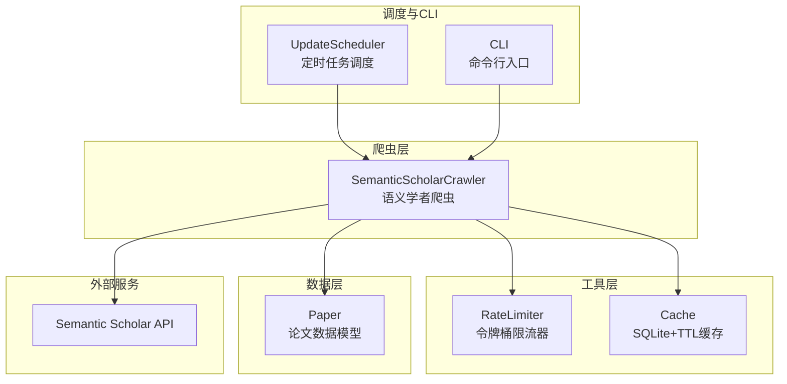
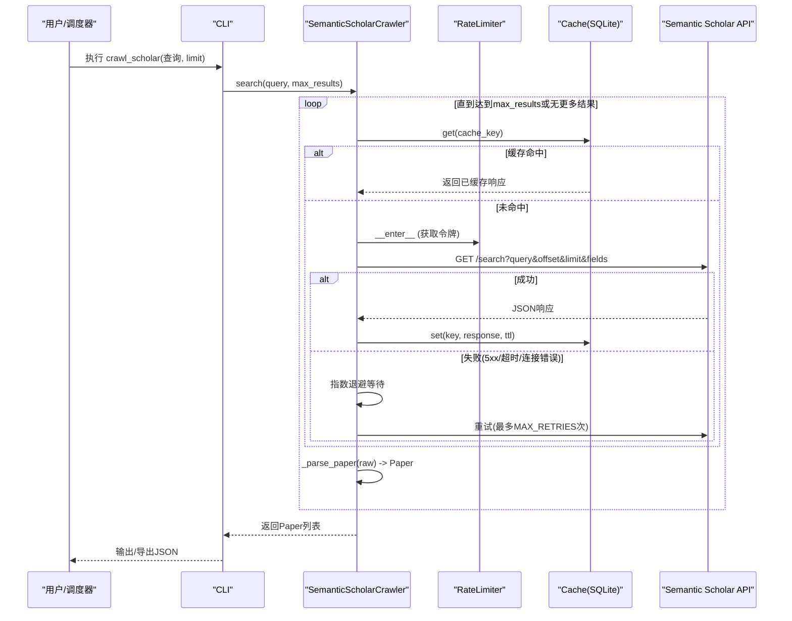
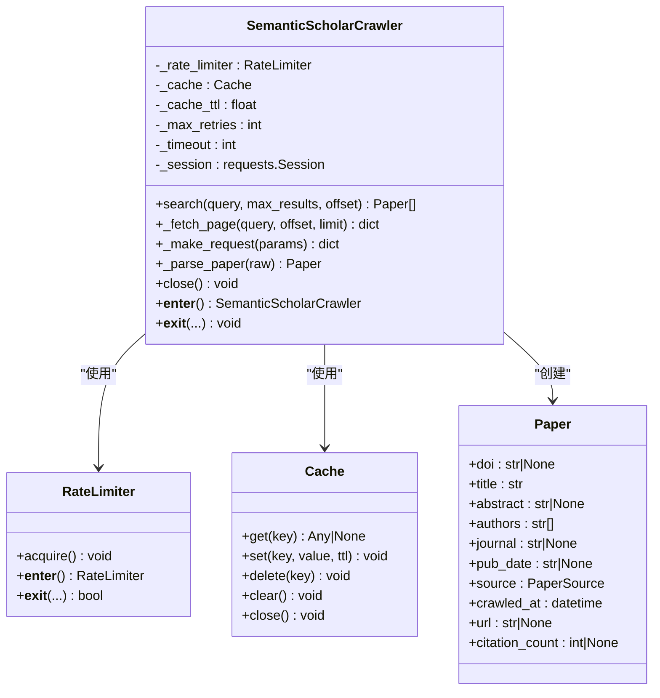
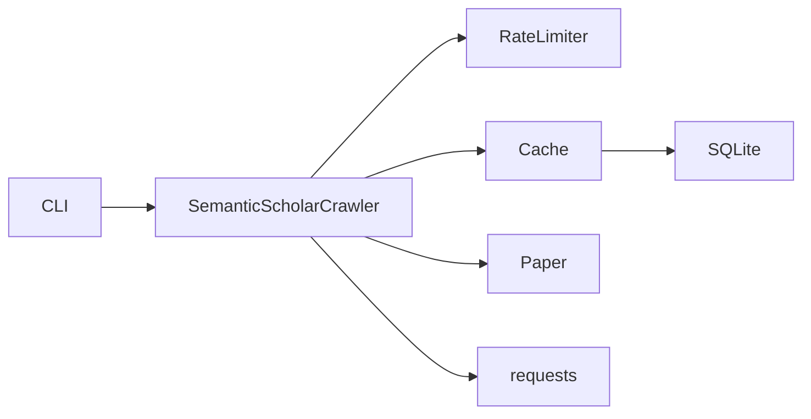

# Semantic Scholar爬虫

<cite>
**本文引用的文件**   
- [src/crawlers/semantic_scholar_crawler.py](file://src/crawlers/semantic_scholar_crawler.py)
- [tests/test_semantic_scholar_crawler.py](file://tests/test_semantic_scholar_crawler.py)
- [configs/crawler_config.yaml](file://configs/crawler_config.yaml)
- [src/utils/rate_limiter.py](file://src/utils/rate_limiter.py)
- [src/utils/cache.py](file://src/utils/cache.py)
- [src/models/paper.py](file://src/models/paper.py)
- [src/scheduler/update_scheduler.py](file://src/scheduler/update_scheduler.py)
- [src/settings/settings.py](file://src/settings/settings.py)
- [src/cli.py](file://src/cli.py)
</cite>

## 目录
1. [简介](#简介)
2. [项目结构](#项目结构)
3. [核心组件](#核心组件)
4. [架构总览](#架构总览)
5. [详细组件分析](#详细组件分析)
6. [依赖关系分析](#依赖关系分析)
7. [性能考量](#性能考量)
8. [故障排查指南](#故障排查指南)
9. [结论](#结论)
10. [附录](#附录)

## 简介
本技术文档围绕 SubSkin 项目中的 Semantic Scholar 爬虫实现，系统阐述其 API 集成、学术文献搜索与元数据提取能力。重点说明：
- API 调用策略（限流、重试、超时）
- 查询构建方法（字段选择、分页、过滤）
- 结果处理流程（缓存、解析、去重与导出）
- 错误处理与恢复机制（指数退避、客户端/服务端错误区分）
- 配置项与环境变量（API Key、速率限制、TTL）
- 使用示例与最佳实践

该爬虫面向白癜风相关学术文献的自动化采集，结合令牌桶限流、SQLite TTL 缓存与指数退避重试，确保在高并发与不稳定网络环境下的稳定性与可观测性。

## 项目结构
Semantic Scholar 爬虫位于爬虫模块中，配合通用工具（限流器、缓存）、数据模型（论文模型）、调度器与 CLI 入口共同构成完整的数据采集链路。

图表来源
- [src/crawlers/semantic_scholar_crawler.py:34-73](file://src/crawlers/semantic_scholar_crawler.py#L34-L73)
- [src/utils/rate_limiter.py:10-31](file://src/utils/rate_limiter.py#L10-L31)
- [src/utils/cache.py:16-33](file://src/utils/cache.py#L16-L33)
- [src/models/paper.py:18-76](file://src/models/paper.py#L18-L76)
- [src/scheduler/update_scheduler.py:622-664](file://src/scheduler/update_scheduler.py#L622-L664)
- [src/cli.py:49-67](file://src/cli.py#L49-L67)

章节来源
- [src/crawlers/semantic_scholar_crawler.py:1-304](file://src/crawlers/semantic_scholar_crawler.py#L1-L304)
- [configs/crawler_config.yaml:44-77](file://configs/crawler_config.yaml#L44-L77)

## 核心组件
- SemanticScholarCrawler：封装对 Semantic Scholar Graph API 的搜索请求、分页、缓存、限流与重试逻辑，并将原始记录转换为 Paper 对象。
- RateLimiter：基于令牌桶算法的线程安全限流器，控制每秒最大请求数。
- Cache：基于 SQLite 的轻量级缓存，支持 TTL 过期与线程安全读写。
- Paper：Pydantic 模型，统一存储论文元数据与来源标识。
- UpdateScheduler：调度器预留了 Semantic Scholar 爬取任务接口（当前增量更新跳过，全量由其他流程负责）。
- CLI：提供命令行入口，可直接运行 Semantic Scholar 爬虫并导出 JSON。

章节来源
- [src/crawlers/semantic_scholar_crawler.py:34-73](file://src/crawlers/semantic_scholar_crawler.py#L34-L73)
- [src/utils/rate_limiter.py:10-31](file://src/utils/rate_limiter.py#L10-L31)
- [src/utils/cache.py:16-33](file://src/utils/cache.py#L16-L33)
- [src/models/paper.py:18-76](file://src/models/paper.py#L18-L76)
- [src/scheduler/update_scheduler.py:622-664](file://src/scheduler/update_scheduler.py#L622-L664)
- [src/cli.py:49-67](file://src/cli.py#L49-L67)

## 架构总览
下图展示了从 CLI 或调度器触发到最终返回论文对象的完整调用序列，包括限流、缓存命中、HTTP 请求、重试与解析等关键步骤。

图表来源
- [src/cli.py:49-67](file://src/cli.py#L49-L67)
- [src/crawlers/semantic_scholar_crawler.py:162-284](file://src/crawlers/semantic_scholar_crawler.py#L162-L284)
- [src/utils/rate_limiter.py:59-80](file://src/utils/rate_limiter.py#L59-L80)
- [src/utils/cache.py:66-114](file://src/utils/cache.py#L66-L114)

## 详细组件分析

### SemanticScholarCrawler 类
职责与要点：
- 初始化 HTTP Session，设置 Accept 与 User-Agent。
- 默认字段集包含 paperId、title、abstract、authors、venue、year、citationCount、url、externalIds、publicationDate。
- 默认每页 100 条，缓存 TTL 为 86400 秒，最大重试次数 3，初始退避 1 秒。
- 查询键生成：将 query、offset、limit 拼接后做 SHA-256 哈希，保证确定性。
- 请求策略：
  - 通过 RateLimiter 上下文管理限流。
  - 捕获 Timeout、ConnectionError 与 5xx HTTPError 进行指数退避重试；4xx 直接抛出。
- 分页策略：循环拉取直到达到 max_results 或 total 耗尽。
- 解析策略：将 raw 记录映射为 Paper，缺失 DOI 时允许为空；若 url 缺失则用 paperId 构造；publicationDate 缺失时回退 year。

图表来源
- [src/crawlers/semantic_scholar_crawler.py:34-73](file://src/crawlers/semantic_scholar_crawler.py#L34-L73)
- [src/crawlers/semantic_scholar_crawler.py:93-160](file://src/crawlers/semantic_scholar_crawler.py#L93-L160)
- [src/crawlers/semantic_scholar_crawler.py:162-284](file://src/crawlers/semantic_scholar_crawler.py#L162-L284)
- [src/utils/rate_limiter.py:10-80](file://src/utils/rate_limiter.py#L10-L80)
- [src/utils/cache.py:16-147](file://src/utils/cache.py#L16-L147)
- [src/models/paper.py:18-76](file://src/models/paper.py#L18-L76)

章节来源
- [src/crawlers/semantic_scholar_crawler.py:23-31](file://src/crawlers/semantic_scholar_crawler.py#L23-L31)
- [src/crawlers/semantic_scholar_crawler.py:79-91](file://src/crawlers/semantic_scholar_crawler.py#L79-L91)
- [src/crawlers/semantic_scholar_crawler.py:162-284](file://src/crawlers/semantic_scholar_crawler.py#L162-L284)

### 查询构建与分页
- 查询参数：
  - query：自由文本搜索词（例如“vitiligo treatment”）
  - offset：起始偏移
  - limit：每页数量（默认 100）
  - fields：指定返回字段集合（默认包含标题、摘要、作者、期刊、年份、引用数、URL、外部ID、发表日期）
- 分页终止条件：当 data 数组为空或 current_offset >= total 时停止。
- 结果上限：max_results 控制最终返回论文数量，自动计算每页实际 limit。

章节来源
- [src/crawlers/semantic_scholar_crawler.py:182-190](file://src/crawlers/semantic_scholar_crawler.py#L182-L190)
- [src/crawlers/semantic_scholar_crawler.py:231-284](file://src/crawlers/semantic_scholar_crawler.py#L231-L284)

### 元数据提取与模型映射
- 外部标识：优先使用 externalIds.DOI；若无则保留 None。
- 作者列表：从 authors 数组中提取 name 字段，过滤非字典或缺失 name 的记录。
- URL 构造：若 url 缺失，则根据 paperId 构造语义学者页面链接。
- 发表日期：优先 publicationDate；若缺失且存在 year，则回退为年字符串。
- 来源标记：source=PaperSource.SEMANTIC_SCHOLAR。
- 异常容错：单条记录解析失败会记录警告并跳过，不影响整体批次。

章节来源
- [src/crawlers/semantic_scholar_crawler.py:192-229](file://src/crawlers/semantic_scholar_crawler.py#L192-L229)
- [src/models/paper.py:18-76](file://src/models/paper.py#L18-L76)

### 限流与重试策略
- 限流：RateLimiter 以令牌桶方式控制每秒最大请求数，默认 1000 req/s。
- 重试：对 5xx、Timeout、ConnectionError 进行指数退避重试，初始 1 秒，每次翻倍，最多 MAX_RETRIES=3 次。
- 客户端错误：4xx 直接抛出，不重试。
- 上下文管理：在 _make_request 中使用 with self._rate_limiter 确保限流生效。

章节来源
- [src/utils/rate_limiter.py:10-80](file://src/utils/rate_limiter.py#L10-L80)
- [src/crawlers/semantic_scholar_crawler.py:93-160](file://src/crawlers/semantic_scholar_crawler.py#L93-L160)

### 缓存策略
- 键生成：SHA-256("semantic_scholar:{query}:{offset}:{limit}")
- 存储介质：SQLite，支持 TTL 过期清理。
- 生命周期：默认 TTL=86400 秒（24小时），可通过 crawler 实例参数覆盖。
- 线程安全：内部加锁，支持并发访问。

章节来源
- [src/crawlers/semantic_scholar_crawler.py:79-91](file://src/crawlers/semantic_scholar_crawler.py#L79-L91)
- [src/utils/cache.py:16-114](file://src/utils/cache.py#L16-L114)

### 调度器与 CLI 集成
- 调度器：update_scheduler 预留了 _run_semantic_scholar_crawler 方法，当前增量更新跳过，返回空结果；全量抓取由其他流程负责。
- CLI：crawl_scholar 命令创建 SemanticScholarCrawler，执行搜索并导出 JSON。

章节来源
- [src/scheduler/update_scheduler.py:622-664](file://src/scheduler/update_scheduler.py#L622-L664)
- [src/cli.py:49-67](file://src/cli.py#L49-L67)

## 依赖关系分析
- 模块内依赖：
  - SemanticScholarCrawler 依赖 RateLimiter、Cache、Paper。
  - CLI 依赖 SemanticScholarCrawler、JSONExporter。
  - 调度器预留接口但未启用增量抓取。
- 外部依赖：
  - requests 用于 HTTP 请求。
  - SQLite 用于本地缓存。
  - Pydantic 用于数据模型校验。

图表来源
- [src/cli.py:49-67](file://src/cli.py#L49-L67)
- [src/crawlers/semantic_scholar_crawler.py:15-21](file://src/crawlers/semantic_scholar_crawler.py#L15-L21)
- [src/utils/cache.py:8-12](file://src/utils/cache.py#L8-L12)

章节来源
- [src/cli.py:1-200](file://src/cli.py#L1-L200)
- [src/crawlers/semantic_scholar_crawler.py:1-304](file://src/crawlers/semantic_scholar_crawler.py#L1-L304)

## 性能考量
- 分页与批量：默认每页 100 条，减少往返次数；可根据网络状况调整 limit。
- 缓存命中率：合理设置 TTL，避免重复请求；相同 query+offset+limit 命中率高。
- 限流与并发：令牌桶限流避免突发流量导致被限流或封禁；多线程场景下限流器保证一致性。
- 重试与退避：指数退避降低瞬时拥塞影响；超时与连接错误自动重试提升鲁棒性。
- I/O 开销：SQLite 缓存写入/读取开销低；内存数据库模式适合测试与短生命周期任务。

[本节为通用指导，不直接分析具体文件]

## 故障排查指南
常见问题与定位建议：
- 查询为空或仅空白字符：search 会抛出 ValueError，检查输入参数。
- 客户端错误（4xx）：立即抛出 HTTPError，检查 API Key、URL 与权限。
- 服务端错误（5xx）/超时/连接错误：触发重试与退避；若多次失败，检查网络与服务状态。
- 解析失败：单条记录解析异常会被记录并跳过，检查 raw 数据结构是否符合预期。
- 缓存未命中：确认 key 生成一致性与 TTL 是否过期。
- 限流阻塞：确认 RateLimiter 的速率配置与并发度是否匹配。

章节来源
- [src/crawlers/semantic_scholar_crawler.py:231-284](file://src/crawlers/semantic_scholar_crawler.py#L231-L284)
- [src/crawlers/semantic_scholar_crawler.py:93-160](file://src/crawlers/semantic_scholar_crawler.py#L93-L160)
- [tests/test_semantic_scholar_crawler.py:235-341](file://tests/test_semantic_scholar_crawler.py#L235-L341)

## 结论
Semantic Scholar 爬虫在 SubSkin 项目中提供了稳定、可扩展的学术文献采集能力。通过令牌桶限流、SQLite TTL 缓存与指数退避重试，有效应对网络波动与 API 限流。配合统一的 Paper 模型与 CLI/调度器集成，便于后续数据处理与导出。建议在大规模采集场景中关注分页大小、缓存 TTL 与限流速率的配置调优，并结合日志与监控持续优化。

[本节为总结性内容，不直接分析具体文件]

## 附录

### API 调用策略与参数配置
- 基础 URL：https://api.semanticscholar.org/graph/v1/paper/search
- 默认字段：paperId、title、abstract、authors、venue、year、citationCount、url、externalIds、publicationDate
- 默认分页：limit=100，offset 自增
- 默认缓存 TTL：86400 秒
- 默认限流：1000 req/s
- 默认重试：3 次，初始退避 1 秒，指数增长

章节来源
- [src/crawlers/semantic_scholar_crawler.py:23-31](file://src/crawlers/semantic_scholar_crawler.py#L23-L31)
- [configs/crawler_config.yaml:44-77](file://configs/crawler_config.yaml#L44-L77)
- [src/settings/settings.py:42-45](file://src/settings/settings.py#L42-L45)

### 搜索查询示例
- 基本搜索：query="vitiligo treatment", max_results=50
- 自定义偏移：offset=50
- 字段定制：fields=["paperId","title","abstract","authors","venue","year","citationCount","url","externalIds","publicationDate"]

章节来源
- [src/crawlers/semantic_scholar_crawler.py:182-190](file://src/crawlers/semantic_scholar_crawler.py#L182-L190)
- [tests/test_semantic_scholar_crawler.py:90-136](file://tests/test_semantic_scholar_crawler.py#L90-L136)

### 错误处理方法
- 空查询：抛出 ValueError
- 客户端错误（4xx）：直接抛出 HTTPError
- 服务端错误（5xx）/超时/连接错误：指数退避重试，超过次数后抛出最后异常
- 单条解析失败：记录警告并跳过，继续处理其余记录

章节来源
- [src/crawlers/semantic_scholar_crawler.py:231-284](file://src/crawlers/semantic_scholar_crawler.py#L231-L284)
- [tests/test_semantic_scholar_crawler.py:235-341](file://tests/test_semantic_scholar_crawler.py#L235-L341)

### 性能优化建议
- 调整 limit：根据网络质量与 API 限制平衡单次请求量
- 提高缓存命中率：合理设置 TTL，复用相同查询参数
- 控制并发：结合 RateLimiter 与进程/线程池规模，避免过度并发
- 监控与日志：关注重试次数、超时率与缓存命中率

[本节为通用指导，不直接分析具体文件]