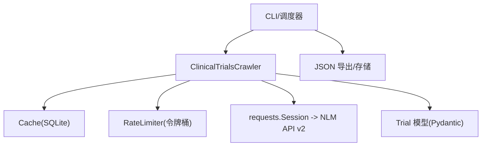
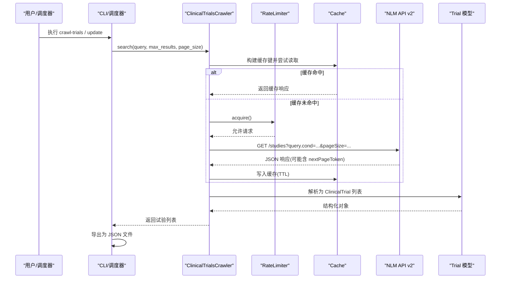
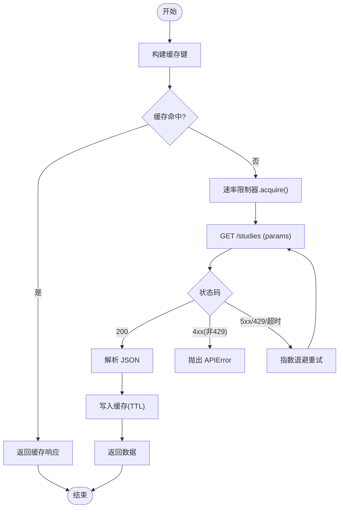
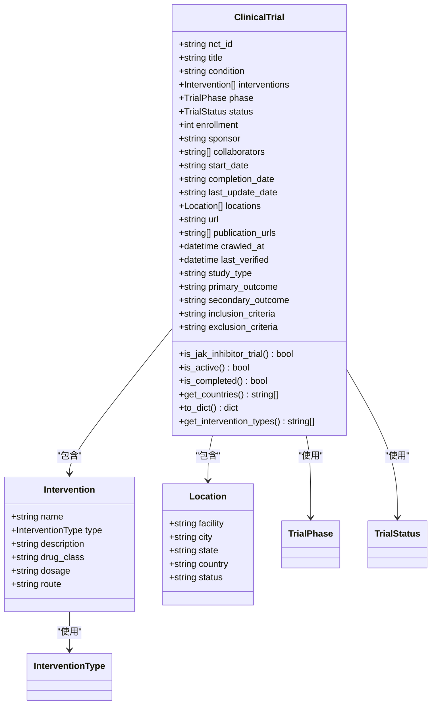
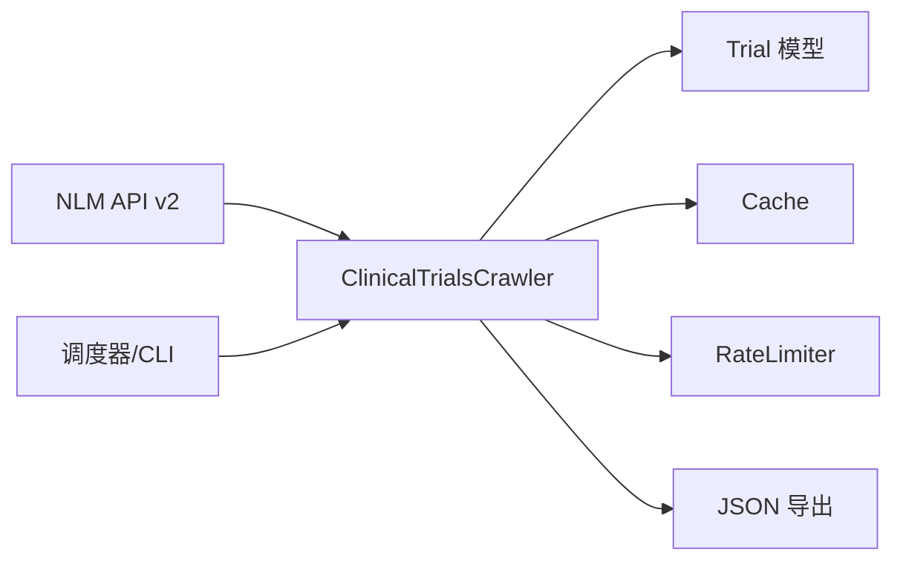

# 临床试验爬虫

<cite>
**本文引用的文件**
- [clinical_trials_crawler.py](file://src/crawlers/clinical_trials_crawler.py)
- [trial.py](file://src/models/trial.py)
- [cache.py](file://src/utils/cache.py)
- [rate_limiter.py](file://src/utils/rate_limiter.py)
- [crawler_config.yaml](file://configs/crawler_config.yaml)
- [update_scheduler.py](file://src/scheduler/update_scheduler.py)
- [cli.py](file://src/cli.py)
- [test_clinical_trials_crawler.py](file://tests/test_clinical_trials_crawler.py)
- [test_trial.py](file://tests/test_trial.py)
</cite>

## 目录
1. [简介](#简介)
2. [项目结构](#项目结构)
3. [核心组件](#核心组件)
4. [架构总览](#架构总览)
5. [详细组件分析](#详细组件分析)
6. [依赖关系分析](#依赖关系分析)
7. [性能与可扩展性](#性能与可扩展性)
8. [故障排查指南](#故障排查指南)
9. [结论](#结论)
10. [附录：查询示例、筛选条件与导出格式](#附录：查询示例筛选条件与导出格式)

## 简介
本技术文档围绕 ClinicalTrials.gov v2 API 的爬虫实现，系统阐述试验搜索、详细信息获取、数据结构映射、NLM API 调用方式、试验状态过滤、条件搜索与结果排序能力。同时覆盖数据验证、字段映射、错误处理与增量更新策略，并提供具体查询示例、筛选条件和数据导出格式说明，帮助读者快速理解并正确使用该爬虫模块。

## 项目结构
与临床试验爬虫相关的代码主要分布在以下位置：
- 爬虫实现：src/crawlers/clinical_trials_crawler.py
- 数据模型：src/models/trial.py
- 缓存与限流：src/utils/cache.py, src/utils/rate_limiter.py
- 配置：configs/crawler_config.yaml
- 调度与导出：src/scheduler/update_scheduler.py, src/cli.py
- 测试：tests/test_clinical_trials_crawler.py, tests/test_trial.py

图表来源
- [clinical_trials_crawler.py:88-115](file://src/crawlers/clinical_trials_crawler.py#L88-L115)
- [cache.py:16-147](file://src/utils/cache.py#L16-L147)
- [rate_limiter.py:10-81](file://src/utils/rate_limiter.py#L10-L81)
- [update_scheduler.py:666-698](file://src/scheduler/update_scheduler.py#L666-L698)
- [cli.py:74-93](file://src/cli.py#L74-L93)

章节来源
- [clinical_trials_crawler.py:1-480](file://src/crawlers/clinical_trials_crawler.py#L1-L480)
- [trial.py:1-315](file://src/models/trial.py#L1-L315)
- [cache.py:1-147](file://src/utils/cache.py#L1-L147)
- [rate_limiter.py:1-81](file://src/utils/rate_limiter.py#L1-L81)
- [crawler_config.yaml:79-116](file://configs/crawler_config.yaml#L79-L116)
- [update_scheduler.py:666-698](file://src/scheduler/update_scheduler.py#L666-L698)
- [cli.py:74-93](file://src/cli.py#L74-L93)

## 核心组件
- ClinicalTrialsCrawler：封装对 ClinicalTrials.gov v2 API 的请求、分页、重试、缓存、解析与过滤逻辑。
- Trial 模型族：使用 Pydantic 定义试验数据模型，包含枚举、校验规则与便捷方法（如 JAK 抑制剂识别、活跃状态判断等）。
- Cache：基于 SQLite 的线程安全缓存，支持 TTL 过期清理。
- RateLimiter：令牌桶算法实现的速率限制器，避免触发 API 限流。
- 调度器与 CLI：提供定时抓取与命令行入口，将结果持久化为 JSON。

章节来源
- [clinical_trials_crawler.py:88-480](file://src/crawlers/clinical_trials_crawler.py#L88-L480)
- [trial.py:9-315](file://src/models/trial.py#L9-L315)
- [cache.py:16-147](file://src/utils/cache.py#L16-L147)
- [rate_limiter.py:10-81](file://src/utils/rate_limiter.py#L10-L81)
- [update_scheduler.py:666-698](file://src/scheduler/update_scheduler.py#L666-L698)
- [cli.py:74-93](file://src/cli.py#L74-L93)

## 架构总览
下图展示了从 CLI/调度器到 NLM API 的完整调用链，包括缓存命中、速率限制、重试与数据解析流程。

图表来源
- [clinical_trials_crawler.py:117-224](file://src/crawlers/clinical_trials_crawler.py#L117-L224)
- [clinical_trials_crawler.py:394-428](file://src/crawlers/clinical_trials_crawler.py#L394-L428)
- [cache.py:66-114](file://src/utils/cache.py#L66-L114)
- [rate_limiter.py:43-57](file://src/utils/rate_limiter.py#L43-L57)
- [cli.py:74-93](file://src/cli.py#L74-L93)

## 详细组件分析

### ClinicalTrialsCrawler：API 调用、分页、重试与解析
- API 基础地址与默认参数：
  - 基础 URL 指向官方 v2 端点；默认页面大小、TTL、最大重试次数、退避因子等常量集中管理。
- 缓存键生成：
  - 基于请求参数（排除 None）排序拼接后哈希，确保相同查询命中同一缓存。
- 带重试的请求：
  - 针对 5xx、429、网络超时/连接异常进行指数退避重试；非 4xx 客户端错误直接抛出。
- 分页抓取：
  - 通过 query.cond、pageSize、pageToken 控制查询与翻页；自动聚合多页结果直至无下一页或达到上限。
- 数据解析：
  - 将 NLM v2 协议段映射到 Trial 模型：标识、状态、阶段、干预措施、地点、日期、URL、研究类型等。
  - 状态与阶段采用映射表转换为枚举；干预措施按类型映射并识别 JAK 抑制剂类别。
- 便捷查询：
  - 白皮病专项检索与 JAK 抑制剂专项检索（后者在全部结果基础上二次过滤）。
- 单条试验获取：
  - 通过 query.id 精确获取单个试验，并按 NCT ID 单独缓存。

图表来源
- [clinical_trials_crawler.py:117-199](file://src/crawlers/clinical_trials_crawler.py#L117-L199)
- [clinical_trials_crawler.py:201-224](file://src/crawlers/clinical_trials_crawler.py#L201-L224)

章节来源
- [clinical_trials_crawler.py:26-75](file://src/crawlers/clinical_trials_crawler.py#L26-L75)
- [clinical_trials_crawler.py:117-224](file://src/crawlers/clinical_trials_crawler.py#L117-L224)
- [clinical_trials_crawler.py:226-392](file://src/crawlers/clinical_trials_crawler.py#L226-L392)
- [clinical_trials_crawler.py:394-480](file://src/crawlers/clinical_trials_crawler.py#L394-L480)

### Trial 数据模型：验证、映射与工具方法
- 枚举定义：
  - 试验阶段、状态、干预类型统一用枚举表达，便于校验与展示。
- 主模型 ClinicalTrial：
  - 字段包含 NCT ID、标题、疾病、干预、阶段、状态、入组人数、赞助方、合作机构、日期、地点、URL、研究类型、目标指标、纳入/排除标准等。
  - 内置校验：NCT ID 格式、URL 前缀校验、日期格式兼容 YYYY-MM 与 YYYY-MM-DD。
- 工具方法：
  - is_jak_inhibitor_trial：综合干预名称、药物类别、标题与疾病关键词判断是否涉及 JAK 抑制剂。
  - is_active/is_completed：基于状态枚举的快速判定。
  - get_countries：提取试验开展国家集合。
  - to_dict/get_intervention_types：序列化与类型汇总。
- 辅助模型：
  - Intervention、Location：描述干预与地点信息。
  - TrialUpdate/TrialSearchResult：用于部分更新与搜索结果包装。

图表来源
- [trial.py:9-315](file://src/models/trial.py#L9-L315)

章节来源
- [trial.py:9-315](file://src/models/trial.py#L9-L315)
- [test_trial.py:14-121](file://tests/test_trial.py#L14-L121)

### 缓存与速率限制
- Cache：
  - 基于 SQLite 的线程安全缓存，支持 TTL 过期清理；提供 set/get/delete/clear/close 接口。
  - 爬虫通过 _build_cache_key 生成稳定键，减少重复请求。
- RateLimiter：
  - 令牌桶算法，阻塞式 acquire，保证每秒请求数不超过阈值，避免触发 429。

章节来源
- [cache.py:16-147](file://src/utils/cache.py#L16-L147)
- [rate_limiter.py:10-81](file://src/utils/rate_limiter.py#L10-L81)
- [clinical_trials_crawler.py:117-140](file://src/crawlers/clinical_trials_crawler.py#L117-L140)

### 调度与导出
- 调度器：
  - 定时任务中调用 ClinicalTrialsCrawler 抓取白皮病相关试验，并将结果序列化为 JSON 保存到 data/raw。
- CLI：
  - 提供 crawl-trials 子命令，支持指定条件、输出路径与结果数量限制，内部同样调用爬虫并导出 JSON。

章节来源
- [update_scheduler.py:666-698](file://src/scheduler/update_scheduler.py#L666-L698)
- [cli.py:74-93](file://src/cli.py#L74-L93)

## 依赖关系分析
- 外部依赖：
  - requests：HTTP 客户端，发起 NLM API 请求。
  - Pydantic：数据模型与校验。
  - SQLite：本地缓存存储。
- 内部依赖：
  - 爬虫依赖模型、缓存、速率限制器。
  - 调度器与 CLI 依赖爬虫与导出逻辑。

图表来源
- [clinical_trials_crawler.py:11-23](file://src/crawlers/clinical_trials_crawler.py#L11-L23)
- [trial.py:1-10](file://src/models/trial.py#L1-L10)
- [cache.py:1-15](file://src/utils/cache.py#L1-L15)
- [rate_limiter.py:1-8](file://src/utils/rate_limiter.py#L1-L8)
- [update_scheduler.py:666-698](file://src/scheduler/update_scheduler.py#L666-L698)
- [cli.py:74-93](file://src/cli.py#L74-L93)

章节来源
- [clinical_trials_crawler.py:1-480](file://src/crawlers/clinical_trials_crawler.py#L1-L480)
- [trial.py:1-315](file://src/models/trial.py#L1-L315)
- [cache.py:1-147](file://src/utils/cache.py#L1-L147)
- [rate_limiter.py:1-81](file://src/utils/rate_limiter.py#L1-L81)
- [update_scheduler.py:666-698](file://src/scheduler/update_scheduler.py#L666-L698)
- [cli.py:74-93](file://src/cli.py#L74-L93)

## 性能与可扩展性
- 性能特性：
  - 缓存命中显著降低重复请求；TTL 默认 24 小时，适合批量抓取场景。
  - 令牌桶限流避免突发流量导致 429；指数退避重试提升鲁棒性。
  - 分页聚合与最大结果限制控制内存与 I/O 开销。
- 可扩展建议：
  - 可配置化：将 base_url、page_size、max_retries、backoff_factor 等从配置文件注入，便于不同环境切换。
  - 并发抓取：在保持限流前提下引入异步或进程池，提高吞吐。
  - 增量更新：结合 last_update_date 与 NCT ID 去重，仅拉取变更条目。
  - 监控告警：记录失败率、延迟分布与缓存命中率，接入监控系统。

[本节为通用指导，不直接分析具体文件]

## 故障排查指南
- 常见错误与定位：
  - 4xx 客户端错误：检查 query 语法、必填字段与权限；不会重试，直接抛出 APIError。
  - 429 限流：检查 RateLimiter 配置与并发度；当前实现会重试并退避。
  - 5xx/超时/连接异常：自动重试；若多次失败，检查网络与服务器状态。
  - 解析失败：日志中包含缺失 NCT ID 或解析异常的提示；检查 API 响应结构与版本兼容性。
- 调试建议：
  - 开启日志观察缓存命中、重试次数与请求参数。
  - 使用最小 page_size 与 max_results 复现问题。
  - 对比 NLM API 文档确认字段名与枚举值。

章节来源
- [clinical_trials_crawler.py:124-199](file://src/crawlers/clinical_trials_crawler.py#L124-L199)
- [clinical_trials_crawler.py:312-392](file://src/crawlers/clinical_trials_crawler.py#L312-L392)
- [test_clinical_trials_crawler.py:240-329](file://tests/test_clinical_trials_crawler.py#L240-L329)

## 结论
该爬虫以清晰的模块化设计实现了 ClinicalTrials.gov v2 API 的稳定抓取：通过缓存与限流保障性能，通过重试机制增强健壮性，通过模型校验确保数据质量，并通过调度与 CLI 提供便捷的运行入口。配合配置与测试，可支撑白皮病与 JAK 抑制剂相关试验的高效采集与分析。

[本节为总结性内容，不直接分析具体文件]

## 附录：查询示例、筛选条件与导出格式

- 基本查询
  - 搜索白皮病相关试验：调用 search("vitiligo", max_results=N, page_size=P)。
  - 精确获取某试验：调用 get_trial_by_nct_id("NCTxxxxxxxx")。
- 条件搜索
  - 组合条件：search("vitiligo AND JAK inhibitor") 可在服务端侧过滤，再在客户端二次筛选。
  - 状态过滤：可通过 query.cond 传入状态表达式（例如 RECRUITING|ACTIVE_NOT_RECRUITING），或在客户端根据 TrialStatus 枚举过滤。
  - 阶段过滤：通过 designModule.phases 映射到 TrialPhase，并在客户端筛选。
- 结果排序
  - 当前实现未显式设置排序参数；如需排序，可在后续扩展中添加 sort 参数（例如按更新日期或相关性）。
- 数据导出格式
  - JSON：每个试验对象遵循 ClinicalTrial 模型字段；调度器与 CLI 均将结果保存为 JSON 文件。
  - 字段示例（来源于模型定义）：nct_id、title、condition、interventions、phase、status、enrollment、sponsor、collaborators、start_date、completion_date、last_update_date、locations、url、study_type、primary_outcome、secondary_outcome、inclusion_criteria、exclusion_criteria、crawled_at、last_verified。
- 增量更新策略
  - 基于 last_update_date 与 NCT ID 的去重：仅当试验更新时间变化或为新条目时更新。
  - 缓存策略：按查询参数与 NCT ID 分别缓存，缩短重复访问成本。
  - 调度频率：可按日/周执行，结合配置中的 rate_limit、page_size、max_pages 控制抓取规模。

章节来源
- [clinical_trials_crawler.py:394-480](file://src/crawlers/clinical_trials_crawler.py#L394-L480)
- [trial.py:67-315](file://src/models/trial.py#L67-L315)
- [crawler_config.yaml:79-116](file://configs/crawler_config.yaml#L79-L116)
- [update_scheduler.py:666-698](file://src/scheduler/update_scheduler.py#L666-L698)
- [cli.py:74-93](file://src/cli.py#L74-L93)