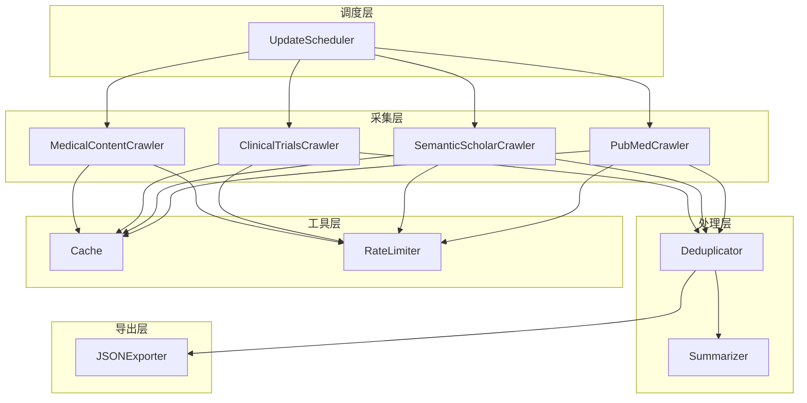
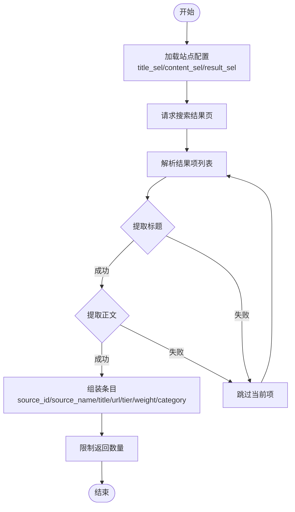
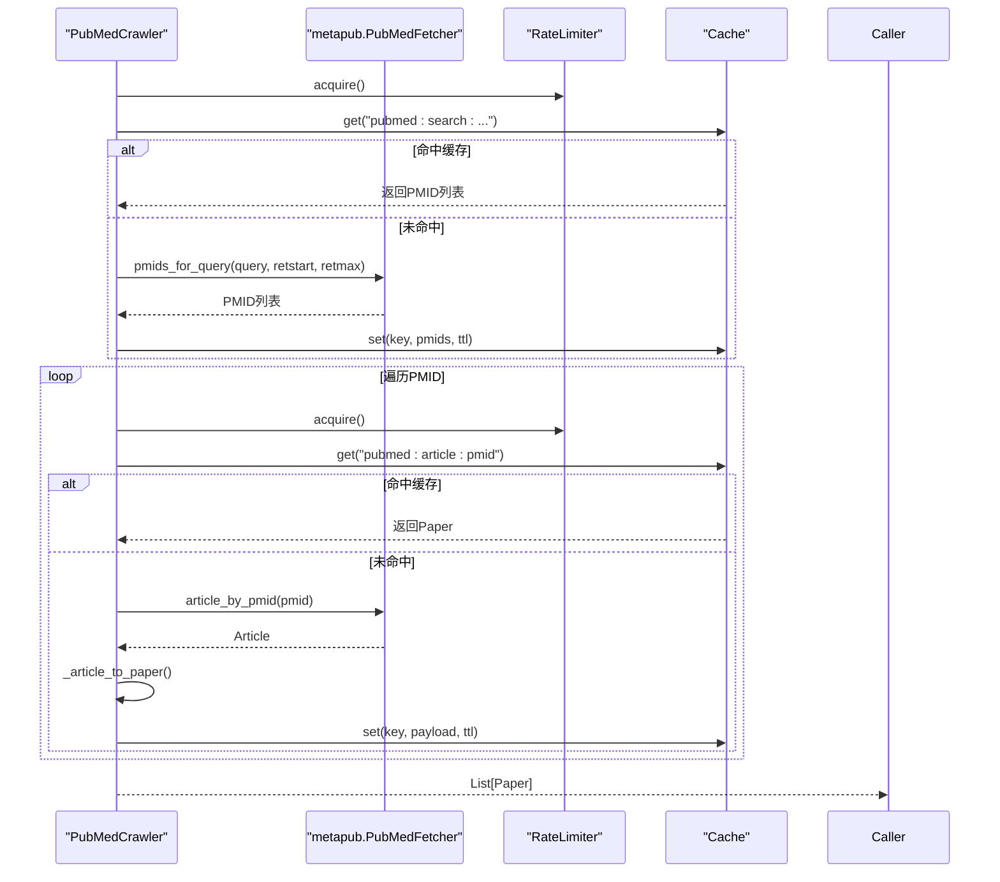
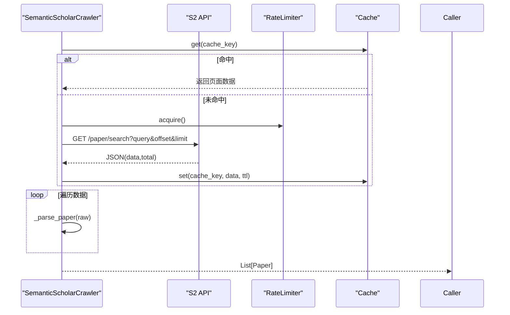
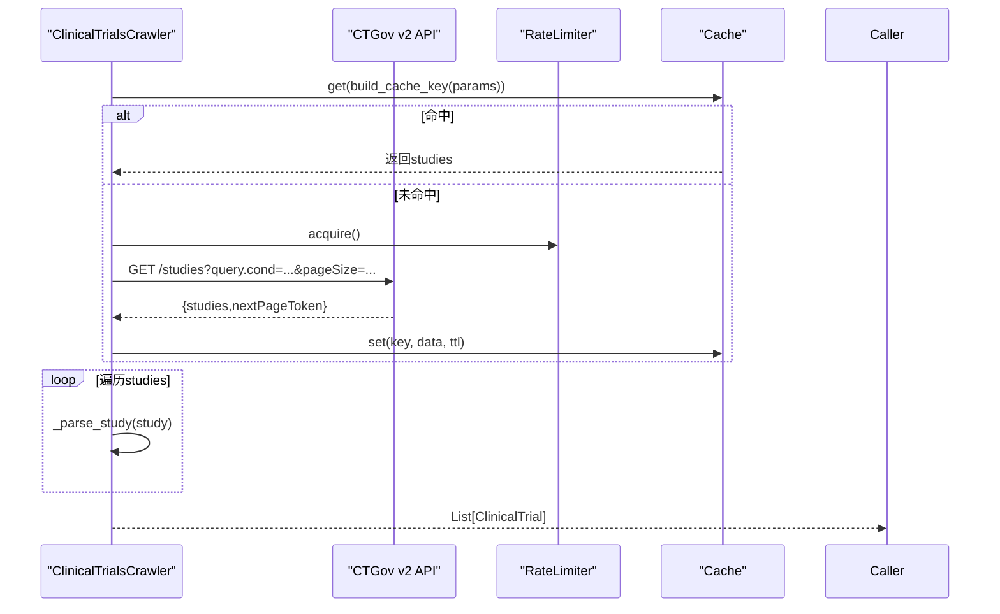
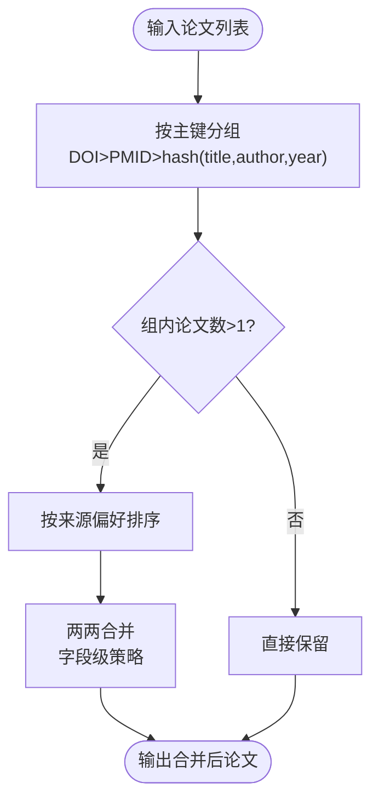
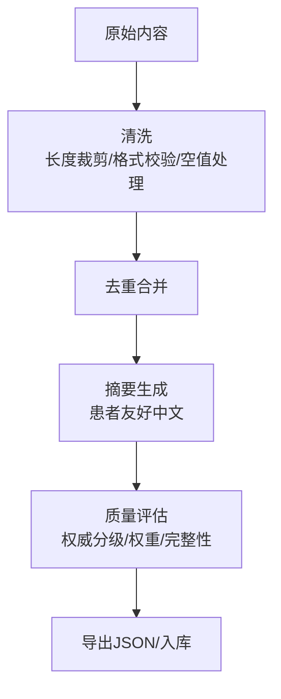
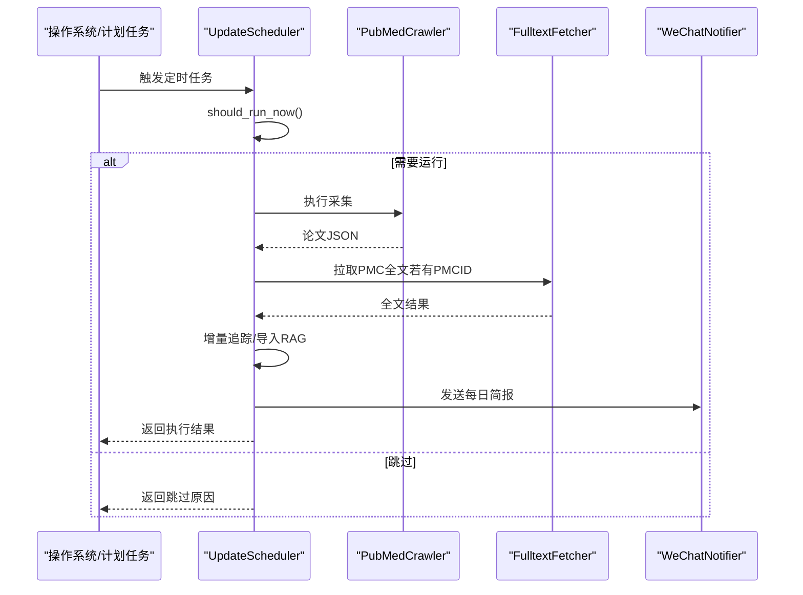
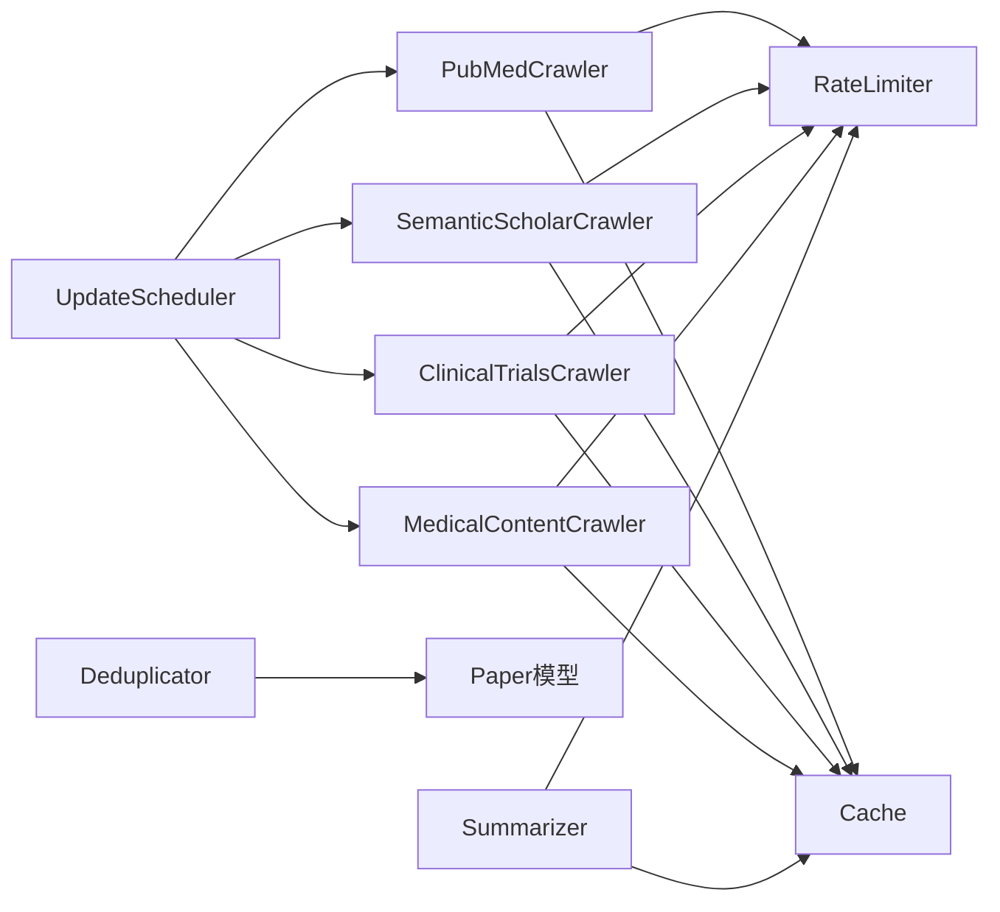

# 医学内容爬虫

<cite>
**本文引用的文件**
- [medical_content_crawler.py](file://src/crawlers/medical_content_crawler.py)
- [pubmed_crawler.py](file://src/crawlers/pubmed_crawler.py)
- [semantic_scholar_crawler.py](file://src/crawlers/semantic_scholar_crawler.py)
- [clinical_trials_crawler.py](file://src/crawlers/clinical_trials_crawler.py)
- [deduplicator.py](file://src/processors/deduplicator.py)
- [summarizer.py](file://src/processors/summarizer.py)
- [data_source.py](file://src/models/data_source.py)
- [paper.py](file://src/models/paper.py)
- [cache.py](file://src/utils/cache.py)
- [rate_limiter.py](file://src/utils/rate_limiter.py)
- [json_exporter.py](file://src/exporters/json_exporter.py)
- [update_scheduler.py](file://src/scheduler/update_scheduler.py)
- [crawler_config.yaml](file://configs/crawler_config.yaml)
- [README.md](file://README.md)
</cite>

## 目录
1. [简介](#简介)
2. [项目结构](#项目结构)
3. [核心组件](#核心组件)
4. [架构总览](#架构总览)
5. [详细组件分析](#详细组件分析)
6. [依赖关系分析](#依赖关系分析)
7. [性能考量](#性能考量)
8. [故障排查指南](#故障排查指南)
9. [结论](#结论)
10. [附录](#附录)

## 简介
本技术文档面向“通用医学内容爬虫”子系统，覆盖多源医学网站与学术数据库的内容抓取、结构化数据提取、质量评估与后续处理。系统支持：
- 多源适配层：统一抽象 PubMed、Semantic Scholar、ClinicalTrials.gov 以及通用百科/新闻站点（通过选择器配置）的抓取流程。
- 模板匹配算法：基于 CSS 选择器的标题、正文、结果项解析策略，便于快速适配新站点。
- 内容清洗管道：去重、相似度检测、敏感信息过滤、合规性检查（以模型与处理器为基础）。
- 知识图谱构建：通过权威分级、来源权重、MeSH/关键词等元数据进行结构化组织，为检索与问答提供高质量语料。
- 质量控制：缓存、限流、重试与错误隔离；增量更新与调度编排；导出与可观测性。

该子系统服务于白癜风领域知识库建设，兼顾英文文献与中文科普资源，确保内容可信、可用、可追溯。

## 项目结构
本项目采用分层模块化设计：
- 采集层（crawlers）：按数据源实现专用爬取器，封装请求、分页、重试、缓存与解析。
- 模型层（models）：使用 Pydantic 定义论文、试验、数据源等强类型数据结构。
- 处理层（processors）：去重、摘要生成、翻译等后处理逻辑。
- 工具层（utils）：缓存、限流、日志、增量追踪等横切能力。
- 调度层（scheduler）：定时任务编排、增量跟踪、通知与导入 RAG。
- 导出层（exporters）：将结构化数据输出为 JSON/Markdown 等格式。
- 配置（configs）：YAML 集中管理各数据源的搜索词、速率限制、缓存策略等。



图表来源
- [pubmed_crawler.py:40-128](file://src/crawlers/pubmed_crawler.py#L40-L128)
- [semantic_scholar_crawler.py:34-67](file://src/crawlers/semantic_scholar_crawler.py#L34-L67)
- [clinical_trials_crawler.py:88-116](file://src/crawlers/clinical_trials_crawler.py#L88-L116)
- [medical_content_crawler.py:116-140](file://src/crawlers/medical_content_crawler.py#L116-L140)
- [deduplicator.py:28-90](file://src/processors/deduplicator.py#L28-L90)
- [summarizer.py:57-126](file://src/processors/summarizer.py#L57-L126)
- [cache.py:16-33](file://src/utils/cache.py#L16-L33)
- [rate_limiter.py:10-31](file://src/utils/rate_limiter.py#L10-L31)
- [update_scheduler.py:79-99](file://src/scheduler/update_scheduler.py#L79-L99)
- [json_exporter.py:19-34](file://src/exporters/json_exporter.py#L19-L34)

章节来源
- [README.md:46-65](file://README.md#L46-L65)

## 核心组件
- 多源采集器
  - PubMedCrawler：基于 metapub 的 PubMed 论文检索与详情获取，支持分页、缓存、限流与指数退避重试。
  - SemanticScholarCrawler：调用 S2 API 检索论文，自动分页、缓存与重试。
  - ClinicalTrialsCrawler：调用 ClinicalTrials.gov v2 API，解析试验状态、分期、干预措施与地点。
  - MedicalContentCrawler：通用百科/新闻站点抓取，通过 CSS 选择器配置标题、正文、结果项，支持多站点统一处理。
- 数据处理
  - Deduplicator：按 DOI/PMID/标题+作者+年份哈希分组合并，保留来源溯源，支持字段级合并策略。
  - Summarizer：调用 OpenAI/火山引擎兼容接口，生成患者友好的中文摘要，具备缓存与限流。
- 基础设施
  - Cache：SQLite 持久化缓存，支持 TTL 与过期清理。
  - RateLimiter：令牌桶限流器，线程安全。
- 调度与导出
  - UpdateScheduler：定时执行各采集器，记录增量变化，触发 RAG 导入与通知。
  - JSONExporter：将论文与试验数据导出为带时间分区的 JSON 文件。

章节来源
- [pubmed_crawler.py:129-152](file://src/crawlers/pubmed_crawler.py#L129-L152)
- [semantic_scholar_crawler.py:231-284](file://src/crawlers/semantic_scholar_crawler.py#L231-L284)
- [clinical_trials_crawler.py:394-428](file://src/crawlers/clinical_trials_crawler.py#L394-L428)
- [medical_content_crawler.py:141-181](file://src/crawlers/medical_content_crawler.py#L141-L181)
- [deduplicator.py:57-90](file://src/processors/deduplicator.py#L57-L90)
- [summarizer.py:204-247](file://src/processors/summarizer.py#L204-L247)
- [cache.py:66-114](file://src/utils/cache.py#L66-L114)
- [rate_limiter.py:43-61](file://src/utils/rate_limiter.py#L43-L61)
- [update_scheduler.py:218-381](file://src/scheduler/update_scheduler.py#L218-L381)
- [json_exporter.py:41-85](file://src/exporters/json_exporter.py#L41-L85)

## 架构总览
下图展示从数据采集到处理后导出的端到端流程，包括调度编排、缓存与限流、去重与摘要、以及最终导出。

```mermaid
sequenceDiagram
participant Sched as "调度器"
participant Pub as "PubMedCrawler"
participant SS as "SemanticScholarCrawler"
participant CT as "ClinicalTrialsCrawler"
MC as "MedicalContentCrawler"
participant Ded as "Deduplicator"
participant Sum as "Summarizer"
participant Exp as "JSONExporter"
participant Cache as "Cache"
participant RL as "RateLimiter"
Sched->>Pub : 启动采集
Pub->>RL : 限流
Pub->>Cache : 查询/写入缓存
Pub-->>Sched : 论文列表(Paper)
Sched->>SS : 启动采集
SS->>RL : 限流
SS->>Cache : 查询/写入缓存
SS-->>Sched : 论文列表(Paper)
Sched->>CT : 启动采集
CT->>RL : 限流
CT->>Cache : 查询/写入缓存
CT-->>Sched : 试验列表(ClinicalTrial)
Sched->>MC : 启动采集
MC->>RL : 限流
MC->>Cache : 查询/写入缓存
MC-->>Sched : 文章列表(字典)
Sched->>Ded : 传入论文集合
Ded-->>Sched : 去重合并后的论文
Sched->>Sum : 对摘要进行中文总结
Sum-->>Sched : 患者友好摘要
Sched->>Exp : 导出论文/试验
Exp-->>Sched : 输出JSON文件
```

图表来源
- [update_scheduler.py:241-381](file://src/scheduler/update_scheduler.py#L241-L381)
- [pubmed_crawler.py:129-152](file://src/crawlers/pubmed_crawler.py#L129-L152)
- [semantic_scholar_crawler.py:231-284](file://src/crawlers/semantic_scholar_crawler.py#L231-L284)
- [clinical_trials_crawler.py:394-428](file://src/crawlers/clinical_trials_crawler.py#L394-L428)
- [medical_content_crawler.py:141-181](file://src/crawlers/medical_content_crawler.py#L141-L181)
- [deduplicator.py:57-90](file://src/processors/deduplicator.py#L57-L90)
- [summarizer.py:204-247](file://src/processors/summarizer.py#L204-L247)
- [json_exporter.py:41-85](file://src/exporters/json_exporter.py#L41-L85)

## 详细组件分析

### 多源适配层与模板匹配算法
- 统一适配：每个采集器封装了特定数据源的访问方式（API/网页），并通过统一的模型（Paper/ClinicalTrial）输出，屏蔽差异。
- 模板匹配：MedicalContentCrawler 通过 CSS 选择器配置标题、正文、结果项，支持逗号分隔的多候选选择器，提升对新站点的适配效率。
- 分类与权重：根据 source_tier 与 authority_weight 标注来源权威性与权重，用于后续检索排序与质量评估。



图表来源
- [medical_content_crawler.py:163-268](file://src/crawlers/medical_content_crawler.py#L163-L268)

章节来源
- [medical_content_crawler.py:28-113](file://src/crawlers/medical_content_crawler.py#L28-L113)
- [medical_content_crawler.py:163-268](file://src/crawlers/medical_content_crawler.py#L163-L268)

### PubMed 采集器
- 功能要点：
  - 基于 metapub 的 PubMedFetcher 进行 MeSH 主题检索与分页获取 PMIDs，再逐条拉取论文详情。
  - 支持 NCBI API Key 动态调整速率限制（3→10 req/s）。
  - 内置缓存键（按查询与分页参数）、指数退避重试、异常分类（临时错误可重试）。
  - 标准化作者、MeSH、关键词、出版日期等字段，构造 Paper 对象。
- 关键路径：search_papers → _search_pmids_with_pagination → _fetch_paper_by_pmid → _article_to_paper。



图表来源
- [pubmed_crawler.py:129-152](file://src/crawlers/pubmed_crawler.py#L129-L152)
- [pubmed_crawler.py:154-188](file://src/crawlers/pubmed_crawler.py#L154-L188)
- [pubmed_crawler.py:190-259](file://src/crawlers/pubmed_crawler.py#L190-L259)
- [pubmed_crawler.py:312-361](file://src/crawlers/pubmed_crawler.py#L312-L361)
- [cache.py:66-114](file://src/utils/cache.py#L66-L114)
- [rate_limiter.py:43-61](file://src/utils/rate_limiter.py#L43-L61)

章节来源
- [pubmed_crawler.py:40-128](file://src/crawlers/pubmed_crawler.py#L40-L128)
- [pubmed_crawler.py:129-152](file://src/crawlers/pubmed_crawler.py#L129-L152)
- [pubmed_crawler.py:190-259](file://src/crawlers/pubmed_crawler.py#L190-L259)

### Semantic Scholar 采集器
- 功能要点：
  - 调用 S2 Graph API，支持 fields 定制、分页 offset/limit。
  - 缓存键由 query+offset+limit 组成，避免重复请求。
  - 指数退避重试，区分客户端错误与服务端错误。
  - 解析外部标识（DOI）、作者、期刊、引用数、发布日期等，构造 Paper。
- 关键路径：search → _fetch_page → _make_request → _parse_paper。



图表来源
- [semantic_scholar_crawler.py:93-160](file://src/crawlers/semantic_scholar_crawler.py#L93-L160)
- [semantic_scholar_crawler.py:162-190](file://src/crawlers/semantic_scholar_crawler.py#L162-L190)
- [semantic_scholar_crawler.py:192-229](file://src/crawlers/semantic_scholar_crawler.py#L192-L229)
- [semantic_scholar_crawler.py:231-284](file://src/crawlers/semantic_scholar_crawler.py#L231-L284)

章节来源
- [semantic_scholar_crawler.py:34-67](file://src/crawlers/semantic_scholar_crawler.py#L34-L67)
- [semantic_scholar_crawler.py:231-284](file://src/crawlers/semantic_scholar_crawler.py#L231-L284)

### ClinicalTrials.gov 采集器
- 功能要点：
  - 调用 v2 API，支持条件查询、分页 token、最大结果限制。
  - 解析试验状态、分期、干预措施（含 JAK 抑制剂识别）、地点、赞助方等。
  - 缓存键由查询参数排序拼接后哈希生成，避免重复请求。
  - 指数退避重试，针对 5xx/429/超时进行重试，非 4xx 错误立即抛出。
- 关键路径：search → _fetch_page → _parse_study → search_vitiligo_trials / search_jak_inhibitor_trials。



图表来源
- [clinical_trials_crawler.py:117-123](file://src/crawlers/clinical_trials_crawler.py#L117-L123)
- [clinical_trials_crawler.py:124-199](file://src/crawlers/clinical_trials_crawler.py#L124-L199)
- [clinical_trials_crawler.py:201-224](file://src/crawlers/clinical_trials_crawler.py#L201-L224)
- [clinical_trials_crawler.py:312-392](file://src/crawlers/clinical_trials_crawler.py#L312-L392)
- [clinical_trials_crawler.py:394-428](file://src/crawlers/clinical_trials_crawler.py#L394-L428)

章节来源
- [clinical_trials_crawler.py:88-116](file://src/crawlers/clinical_trials_crawler.py#L88-L116)
- [clinical_trials_crawler.py:394-428](file://src/crawlers/clinical_trials_crawler.py#L394-L428)

### 内容去重与相似度检测
- 去重策略：
  - 主键优先级：DOI > PMID > 标题+首作者+年份哈希。
  - 合并策略：标题取更长、摘要取更长、作者并集去重、期刊优先 PubMed、日期更精确、MeSH/关键词并集、URL 合并、引用数取最大值。
  - 来源偏好：按 prefer_source_order 排序，优先保留高可信来源。
- 相似度检测：预留 find_potential_duplicates，可扩展 Levenshtein/Jaccard 相似度。



图表来源
- [deduplicator.py:92-133](file://src/processors/deduplicator.py#L92-L133)
- [deduplicator.py:135-285](file://src/processors/deduplicator.py#L135-L285)

章节来源
- [deduplicator.py:28-90](file://src/processors/deduplicator.py#L28-L90)
- [deduplicator.py:135-285](file://src/processors/deduplicator.py#L135-L285)

### 内容清洗管道与质量评估
- 清洗步骤：
  - 规范化：标题/摘要长度裁剪、作者列表归一化、日期格式校验、DOI/URL 校验。
  - 去重：见上节。
  - 摘要生成：Summarizer 将英文摘要改写为患者友好的中文科普内容，附带免责声明。
  - 质量评估：结合 AuthorityTier 与 authority_weight 进行来源加权；对无标题或过短内容进行过滤。
- 合规性：
  - 限流与重试：避免对上游服务造成压力。
  - 缓存：减少重复请求与成本。
  - 敏感信息过滤：在后续服务层可通过 redact 工具进行个人信息脱敏（项目包含相关工具模块）。



图表来源
- [medical_content_crawler.py:215-268](file://src/crawlers/medical_content_crawler.py#L215-L268)
- [deduplicator.py:135-285](file://src/processors/deduplicator.py#L135-L285)
- [summarizer.py:204-247](file://src/processors/summarizer.py#L204-L247)
- [data_source.py:12-21](file://src/models/data_source.py#L12-L21)

章节来源
- [summarizer.py:29-44](file://src/processors/summarizer.py#L29-L44)
- [summarizer.py:204-247](file://src/processors/summarizer.py#L204-L247)
- [data_source.py:98-177](file://src/models/data_source.py#L98-L177)

### 调度与增量更新
- 调度器职责：
  - 按频率（日/周/月）计算下次运行时间，维护执行历史与状态。
  - 并行执行多个采集器（带超时保护），汇总结果与错误。
  - 增量追踪：记录新增/更新条目，触发 RAG 导入与微信通知。
- 采集顺序：PubMed、PubMed全文、中华医学会、CrossRef、Semantic Scholar、临床试验、基金会新闻、OmicsDI、通用医学内容。



图表来源
- [update_scheduler.py:157-216](file://src/scheduler/update_scheduler.py#L157-L216)
- [update_scheduler.py:218-381](file://src/scheduler/update_scheduler.py#L218-L381)
- [update_scheduler.py:455-541](file://src/scheduler/update_scheduler.py#L455-L541)

章节来源
- [update_scheduler.py:79-99](file://src/scheduler/update_scheduler.py#L79-L99)
- [update_scheduler.py:218-381](file://src/scheduler/update_scheduler.py#L218-L381)

## 依赖关系分析
- 组件耦合：
  - 采集器依赖 RateLimiter 与 Cache，降低对外部服务的压力与重复开销。
  - 调度器聚合多个采集器，解耦具体实现，便于扩展与维护。
  - 去重器依赖 Paper 模型，保证数据结构一致。
  - 摘要器依赖 OpenAI/火山引擎兼容接口，具备缓存与限流。
- 外部依赖：
  - metapub（PubMed）、requests（HTTP）、BeautifulSoup（HTML解析）、OpenAI SDK（摘要）。
- 潜在循环依赖：未发现明显循环依赖，模块边界清晰。



图表来源
- [pubmed_crawler.py:129-152](file://src/crawlers/pubmed_crawler.py#L129-L152)
- [semantic_scholar_crawler.py:231-284](file://src/crawlers/semantic_scholar_crawler.py#L231-L284)
- [clinical_trials_crawler.py:394-428](file://src/crawlers/clinical_trials_crawler.py#L394-L428)
- [medical_content_crawler.py:141-181](file://src/crawlers/medical_content_crawler.py#L141-L181)
- [deduplicator.py:57-90](file://src/processors/deduplicator.py#L57-L90)
- [summarizer.py:204-247](file://src/processors/summarizer.py#L204-L247)
- [update_scheduler.py:241-381](file://src/scheduler/update_scheduler.py#L241-L381)

章节来源
- [pubmed_crawler.py:129-152](file://src/crawlers/pubmed_crawler.py#L129-L152)
- [semantic_scholar_crawler.py:231-284](file://src/crawlers/semantic_scholar_crawler.py#L231-L284)
- [clinical_trials_crawler.py:394-428](file://src/crawlers/clinical_trials_crawler.py#L394-L428)
- [medical_content_crawler.py:141-181](file://src/crawlers/medical_content_crawler.py#L141-L181)
- [update_scheduler.py:241-381](file://src/scheduler/update_scheduler.py#L241-L381)

## 性能考量
- 缓存策略：
  - 所有采集器均使用 Cache 存储 API 响应或中间结果，设置合理 TTL 以减少重复请求。
  - 摘要器对相同摘要文本生成确定性缓存键，避免重复 LLM 调用。
- 限流与重试：
  - RateLimiter 基于令牌桶算法，控制每秒请求数，避免触发上游限流。
  - 指数退避重试应对临时网络错误与服务器过载。
- 分页与批量：
  - PubMed/Semantic Scholar/ClinicalTrials.gov 均采用分页拉取，控制单次请求大小与总结果上限。
- 并发与超时：
  - 调度器对每个采集器设置超时保护，防止单个任务阻塞整体流程。
- 存储与导出：
  - JSON 导出按日期分区，便于归档与回溯。

章节来源
- [cache.py:66-114](file://src/utils/cache.py#L66-L114)
- [rate_limiter.py:43-61](file://src/utils/rate_limiter.py#L43-L61)
- [pubmed_crawler.py:154-188](file://src/crawlers/pubmed_crawler.py#L154-L188)
- [semantic_scholar_crawler.py:162-190](file://src/crawlers/semantic_scholar_crawler.py#L162-L190)
- [clinical_trials_crawler.py:201-224](file://src/crawlers/clinical_trials_crawler.py#L201-L224)
- [summarizer.py:204-247](file://src/processors/summarizer.py#L204-L247)
- [json_exporter.py:41-85](file://src/exporters/json_exporter.py#L41-L85)

## 故障排查指南
- 常见问题与定位：
  - 403/404：检查 URL 与权限，确认站点是否变更结构或启用反爬。
  - 429 限流：调整 RateLimiter 速率或等待冷却，检查上游配额。
  - 5xx/超时：启用重试与指数退避，检查网络稳定性。
  - 解析失败：核对 CSS 选择器与目标站点结构，必要时增加容错分支。
  - 摘要为空：检查 LLM 返回与缓存键，确认输入摘要非空。
- 日志与监控：
  - 采集器与调度器均有详细日志，记录请求、缓存命中、重试与错误。
  - 调度器维护执行历史与状态，便于回溯与分析。
- 恢复策略：
  - 清理过期缓存或指定 key 删除，重新触发采集。
  - 调整配置（如 max_retries、backoff_base_seconds、page_size）后重试。

章节来源
- [medical_content_crawler.py:183-213](file://src/crawlers/medical_content_crawler.py#L183-L213)
- [pubmed_crawler.py:316-361](file://src/crawlers/pubmed_crawler.py#L316-L361)
- [semantic_scholar_crawler.py:93-160](file://src/crawlers/semantic_scholar_crawler.py#L93-L160)
- [clinical_trials_crawler.py:124-199](file://src/crawlers/clinical_trials_crawler.py#L124-L199)
- [summarizer.py:170-202](file://src/processors/summarizer.py#L170-L202)
- [update_scheduler.py:218-381](file://src/scheduler/update_scheduler.py#L218-L381)

## 结论
本医学内容爬虫子系统通过统一适配层、模板匹配算法、稳健的清洗管道与质量评估机制，实现了多源医学内容的稳定采集与高质量结构化输出。结合调度器与导出工具，形成完整的自动化流水线，为知识图谱构建与智能问答提供可靠数据基础。未来可进一步增强相似度检测、敏感信息过滤与合规性检查，以提升内容安全性与可用性。

## 附录

### 网站配置与解析模板
- 通用站点配置示例（MedicalContentCrawler）：
  - id/name/base_url/search_url/search_param/search_term
  - title_sel/content_sel/result_sel
  - source_tier/authority_weight/enabled
- 学术数据源配置（crawler_config.yaml）：
  - pubmed/semantic_scholar/clinical_trials 的搜索词、API Key、速率限制、分页与过滤条件。
  - general 下的重试、超时、输出目录、日志级别与监控开关。

章节来源
- [medical_content_crawler.py:28-113](file://src/crawlers/medical_content_crawler.py#L28-L113)
- [crawler_config.yaml:1-143](file://configs/crawler_config.yaml#L1-L143)

### 质量控制策略
- 权威分级与权重：AuthorityTier（S/A/B/C/D）与 authority_weight 用于检索排序与质量评估。
- 完整性校验：标题长度、作者列表、DOI/URL 格式、发布日期格式。
- 去重与合并：主键优先级与字段级合并策略，保留来源溯源。
- 摘要合规：患者友好语言与免责声明，避免医疗建议。

章节来源
- [data_source.py:12-21](file://src/models/data_source.py#L12-L21)
- [paper.py:129-187](file://src/models/paper.py#L129-L187)
- [deduplicator.py:135-285](file://src/processors/deduplicator.py#L135-L285)
- [summarizer.py:29-44](file://src/processors/summarizer.py#L29-L44)