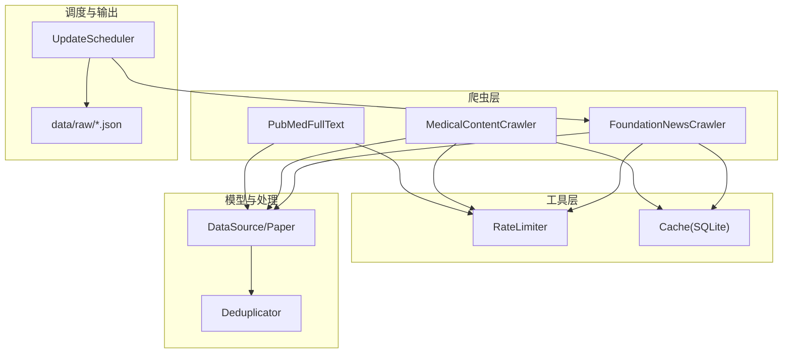
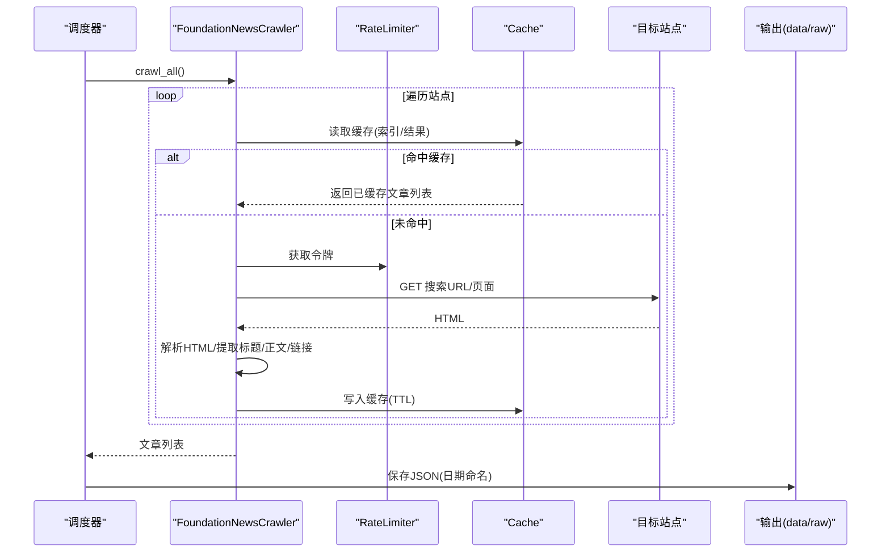
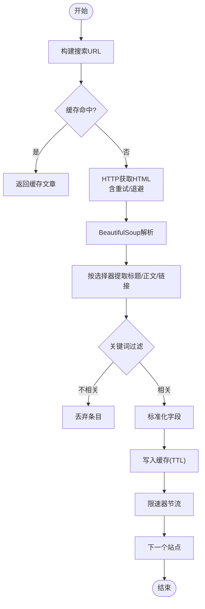
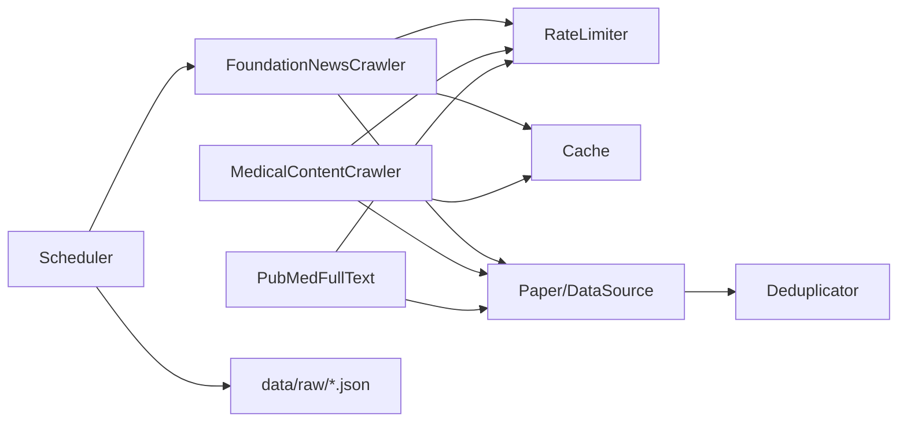

# 基金会新闻爬虫

<cite>
**本文引用的文件**
- [foundation_news_crawler.py](file://src/crawlers/foundation_news_crawler.py)
- [medical_content_crawler.py](file://src/crawlers/medical_content_crawler.py)
- [pubmed_fulltext.py](file://src/crawlers/pubmed_fulltext.py)
- [crawler_config.yaml](file://configs/crawler_config.yaml)
- [data_source.py](file://src/models/data_source.py)
- [paper.py](file://src/models/paper.py)
- [deduplicator.py](file://src/processors/deduplicator.py)
- [cache.py](file://src/utils/cache.py)
- [rate_limiter.py](file://src/utils/rate_limiter.py)
- [update_scheduler.py](file://src/scheduler/update_scheduler.py)
</cite>

## 目录
1. [简介](#简介)
2. [项目结构](#项目结构)
3. [核心组件](#核心组件)
4. [架构总览](#架构总览)
5. [详细组件分析](#详细组件分析)
6. [依赖关系分析](#依赖关系分析)
7. [性能考量](#性能考量)
8. [故障排查指南](#故障排查指南)
9. [结论](#结论)
10. [附录](#附录)

## 简介
本技术文档面向“白癜风相关基金会新闻爬虫”，聚焦医疗基金会网站新闻抓取、RSS/搜索页解析与内容提取，覆盖目标网站配置、解析规则、内容清洗、分类与标签提取、发布时间识别、去重处理、图片资源下载与本地存储策略。文档同时给出系统架构图、关键流程时序图与流程图，帮助读者快速理解并扩展该爬虫体系。

## 项目结构
本项目将爬虫能力按来源与职责拆分：
- 基金会与行业媒体新闻抓取：FoundationNewsCrawler（英文基金会站点 + 中文行业新闻站）
- 医学百科与患者教育内容抓取：MedicalContentCrawler（多站点统一抓取框架）
- 全文获取与XML/JATS解析：PubMed Central全文抓取（PMC JATS XML）
- 调度与输出：Scheduler 集成 Foundation News 抓取并落盘 JSON
- 通用工具：缓存（SQLite TTL）、速率限制（令牌桶）、数据模型（Paper/DataSource）与去重器

图表来源
- [foundation_news_crawler.py:91-145](file://src/crawlers/foundation_news_crawler.py#L91-L145)
- [medical_content_crawler.py:116-181](file://src/crawlers/medical_content_crawler.py#L116-L181)
- [pubmed_fulltext.py:1-44](file://src/crawlers/pubmed_fulltext.py#L1-L44)
- [rate_limiter.py:10-81](file://src/utils/rate_limiter.py#L10-L81)
- [cache.py:16-147](file://src/utils/cache.py#L16-L147)
- [data_source.py:98-214](file://src/models/data_source.py#L98-L214)
- [paper.py:18-225](file://src/models/paper.py#L18-L225)
- [deduplicator.py:28-90](file://src/processors/deduplicator.py#L28-L90)
- [update_scheduler.py:768-795](file://src/scheduler/update_scheduler.py#L768-L795)

章节来源
- [foundation_news_crawler.py:1-288](file://src/crawlers/foundation_news_crawler.py#L1-L288)
- [medical_content_crawler.py:1-269](file://src/crawlers/medical_content_crawler.py#L1-L269)
- [pubmed_fulltext.py:1-44](file://src/crawlers/pubmed_fulltext.py#L1-L44)
- [crawler_config.yaml:1-143](file://configs/crawler_config.yaml#L1-L143)
- [data_source.py:1-284](file://src/models/data_source.py#L1-L284)
- [paper.py:1-263](file://src/models/paper.py#L1-L263)
- [deduplicator.py:1-319](file://src/processors/deduplicator.py#L1-L319)
- [cache.py:1-147](file://src/utils/cache.py#L1-L147)
- [rate_limiter.py:1-81](file://src/utils/rate_limiter.py#L1-L81)
- [update_scheduler.py:768-795](file://src/scheduler/update_scheduler.py#L768-L795)

## 核心组件
- FoundationNewsCrawler：负责抓取英文基金会站点与中文行业新闻站点的搜索结果页，基于选择器提取标题、正文、链接，并进行关键词过滤与基础分类。
- MedicalContentCrawler：统一的医学百科/患者教育站点抓取框架，支持按站点配置启用/禁用、参数化选择器与结果抽取。
- PubMedFullText：从PMC拉取JATS XML全文，提取正文纯文本，用于补充论文或长文内容。
- Cache：线程安全的SQLite缓存，支持TTL过期清理，减少重复请求。
- RateLimiter：令牌桶算法的并发限流器，避免对目标站点造成压力。
- DataSource/Paper：数据源与论文的数据模型，提供校验、序列化与元数据字段。
- Deduplicator：基于DOI/PMID/标题+作者+年份哈希的去重合并，保留来源溯源。
- UpdateScheduler：定时任务入口，调用 FoundationNewsCrawler 并将结果写入 data/raw。

章节来源
- [foundation_news_crawler.py:91-288](file://src/crawlers/foundation_news_crawler.py#L91-L288)
- [medical_content_crawler.py:116-269](file://src/crawlers/medical_content_crawler.py#L116-L269)
- [pubmed_fulltext.py:1-44](file://src/crawlers/pubmed_fulltext.py#L1-L44)
- [cache.py:16-147](file://src/utils/cache.py#L16-L147)
- [rate_limiter.py:10-81](file://src/utils/rate_limiter.py#L10-L81)
- [data_source.py:98-214](file://src/models/data_source.py#L98-L214)
- [paper.py:18-225](file://src/models/paper.py#L18-L225)
- [deduplicator.py:28-319](file://src/processors/deduplicator.py#L28-L319)
- [update_scheduler.py:768-795](file://src/scheduler/update_scheduler.py#L768-L795)

## 架构总览
下图展示从调度到抓取、解析、缓存、落盘的完整链路。

图表来源
- [update_scheduler.py:768-795](file://src/scheduler/update_scheduler.py#L768-L795)
- [foundation_news_crawler.py:116-184](file://src/crawlers/foundation_news_crawler.py#L116-L184)
- [cache.py:66-114](file://src/utils/cache.py#L66-L114)
- [rate_limiter.py:43-61](file://src/utils/rate_limiter.py#L43-L61)

## 详细组件分析

### FoundationNewsCrawler（基金会新闻抓取）
- 目标站点
  - 英文基金会：VR Foundation、Global Vitiligo Foundation、Clinical Trial Vanguard
  - 中文新闻：生物通、生物谷
- 抓取流程
  - 构造搜索URL（英文站点使用内置 search_path；中文站点使用 search_url + 参数）
  - 通过 requests 获取HTML，带重试与指数退避
  - 使用 BeautifulSoup 解析，按站点配置的选择器提取标题、正文、链接
  - 关键词过滤（白癜风、白斑、JAK抑制剂等），仅保留相关内容
  - 输出标准化字段：source_id、source_name、title、content、url、pub_date、category
- 缓存与限流
  - 每个站点索引/结果以 key 形式缓存，TTL默认3600秒
  - 每次HTTP请求受 RateLimiter 控制（默认1次/秒）
- 错误处理
  - 捕获网络异常与状态码（403/404），记录日志并跳过
  - 最大重试次数与退避策略

图表来源
- [foundation_news_crawler.py:147-184](file://src/crawlers/foundation_news_crawler.py#L147-L184)
- [foundation_news_crawler.py:186-221](file://src/crawlers/foundation_news_crawler.py#L186-L221)
- [foundation_news_crawler.py:223-288](file://src/crawlers/foundation_news_crawler.py#L223-L288)

章节来源
- [foundation_news_crawler.py:36-88](file://src/crawlers/foundation_news_crawler.py#L36-L88)
- [foundation_news_crawler.py:91-288](file://src/crawlers/foundation_news_crawler.py#L91-L288)

### MedicalContentCrawler（医学百科/患者教育抓取）
- 站点配置
  - 支持多个站点独立配置（base_url、search_url、选择器等），可启用/禁用
  - 示例站点：默沙东诊疗手册、丁香园用药参考、Dove Medical Press、Broad Institute、好大夫在线、AVRF
- 抓取流程
  - 根据站点配置构造查询参数或直接访问固定搜索页
  - 解析结果列表，提取标题、摘要/正文片段、链接
  - 输出包含 source_tier、authority_weight、category 等元数据
- 缓存与限流
  - 同 FoundationNewsCrawler，使用相同 Cache 与 RateLimiter

章节来源
- [medical_content_crawler.py:28-113](file://src/crawlers/medical_content_crawler.py#L28-L113)
- [medical_content_crawler.py:116-269](file://src/crawlers/medical_content_crawler.py#L116-L269)

### PubMedFullText（PMC全文抓取与JATS解析）
- 功能
  - 通过 NCBI EFetch/OA API 获取JATS XML
  - 提取正文段落、标题、标签、表格、列表等文本
- 适用场景
  - 为论文或长文补充完整正文内容，便于后续翻译/摘要/检索

章节来源
- [pubmed_fulltext.py:1-44](file://src/crawlers/pubmed_fulltext.py#L1-L44)

### 数据模型与去重
- DataSource/Paper
  - 定义数据源类型、类别、采集方式、质量等级、权威层级、优先级等
  - Paper 模型包含标识符（PMID/PMCID/DOI）、元数据、语言、翻译/摘要状态、全文路径等
- Deduplicator
  - 分组键：DOI > PMID > 标题+首作者+年份哈希
  - 合并策略：优先更长标题/摘要、合并作者/关键词/MESH、取最大引用数、合并URL等
  - 支持模糊匹配接口预留（当前返回空）

章节来源
- [data_source.py:12-214](file://src/models/data_source.py#L12-L214)
- [paper.py:18-225](file://src/models/paper.py#L18-L225)
- [deduplicator.py:28-319](file://src/processors/deduplicator.py#L28-L319)

### 调度与输出
- Scheduler 调用 FoundationNewsCrawler 抓取所有配置站点
- 将结果以 JSON 格式保存到 data/raw，文件名包含日期
- 记录统计信息（状态、耗时、错误等）

章节来源
- [update_scheduler.py:768-795](file://src/scheduler/update_scheduler.py#L768-L795)

## 依赖关系分析
- 组件耦合
  - FoundationNewsCrawler 依赖 RateLimiter、Cache、requests、BeautifulSoup
  - MedicalContentCrawler 同样依赖 RateLimiter、Cache、requests、BeautifulSoup
  - PubMedFullText 依赖 requests、lxml（JATS解析）
  - Deduplicator 依赖 Paper 模型
  - Scheduler 依赖 FoundationNewsCrawler 与文件系统
- 外部依赖
  - 目标站点HTML结构变化可能影响选择器有效性
  - NCBI API 有速率限制（无API Key 3req/s，有Key 10req/s）

图表来源
- [foundation_news_crawler.py:17-28](file://src/crawlers/foundation_news_crawler.py#L17-L28)
- [medical_content_crawler.py:12-20](file://src/crawlers/medical_content_crawler.py#L12-L20)
- [pubmed_fulltext.py:12-21](file://src/crawlers/pubmed_fulltext.py#L12-L21)
- [data_source.py:98-214](file://src/models/data_source.py#L98-L214)
- [paper.py:18-225](file://src/models/paper.py#L18-L225)
- [deduplicator.py:18-23](file://src/processors/deduplicator.py#L18-L23)
- [update_scheduler.py:768-795](file://src/scheduler/update_scheduler.py#L768-L795)

章节来源
- [foundation_news_crawler.py:17-28](file://src/crawlers/foundation_news_crawler.py#L17-L28)
- [medical_content_crawler.py:12-20](file://src/crawlers/medical_content_crawler.py#L12-L20)
- [pubmed_fulltext.py:12-21](file://src/crawlers/pubmed_fulltext.py#L12-L21)
- [data_source.py:98-214](file://src/models/data_source.py#L98-L214)
- [paper.py:18-225](file://src/models/paper.py#L18-L225)
- [deduplicator.py:18-23](file://src/processors/deduplicator.py#L18-L23)
- [update_scheduler.py:768-795](file://src/scheduler/update_scheduler.py#L768-L795)

## 性能考量
- 缓存策略
  - SQLite TTL 缓存减少重复请求，适合高频索引页与稳定结果集
  - 建议为不同站点设置合理TTL（如1小时至24小时）
- 限流策略
  - 令牌桶限流避免突发流量，保护目标站点与自身稳定性
  - 可根据站点策略调整每秒请求数
- 重试与退避
  - 指数退避提升网络抖动下的成功率
- I/O与存储
  - 输出JSON采用日期分片，便于增量处理与归档
  - 如需长期存储，可结合数据库或对象存储

[本节为通用指导，无需特定文件来源]

## 故障排查指南
- 常见错误
  - 403/404：站点反爬或页面变更，检查选择器与URL
  - 超时/连接失败：增加超时时间或降低并发
  - 解析结果为空：确认HTML结构与选择器匹配
- 定位方法
  - 查看日志中的站点名称与错误信息
  - 检查缓存是否命中（必要时清空缓存）
  - 验证网络连通性与User-Agent策略
- 恢复措施
  - 更新站点配置（选择器、搜索参数）
  - 调整限流与重试参数
  - 临时禁用问题站点，待修复后重新启用

章节来源
- [foundation_news_crawler.py:186-221](file://src/crawlers/foundation_news_crawler.py#L186-L221)
- [medical_content_crawler.py:183-200](file://src/crawlers/medical_content_crawler.py#L183-L200)
- [cache.py:54-64](file://src/utils/cache.py#L54-L64)

## 结论
本爬虫体系围绕基金会与行业媒体新闻抓取，提供了可扩展的站点配置、稳定的缓存与限流机制、标准化的内容提取与分类、以及完善的去重与调度输出能力。未来可进一步增强：
- RSS订阅解析（若目标站点提供RSS/Atom）
- 更精细的分类与标签提取（基于NLP或规则）
- 图片资源下载与本地存储策略（结合后端文件服务）
- 动态内容加载支持（如JS渲染页面的浏览器自动化）

[本节为总结性内容，无需特定文件来源]

## 附录

### 目标网站配置与解析规则
- 英文基金会站点
  - 选择器：article/.post/.news-item/.blog-entry
  - 标题选择器：h1/h2/h3/.entry-title/.post-title
  - 内容选择器：.entry-content/.post-content/article p/main
  - 搜索路径：/?s=vitiligo
- 中文新闻站点
  - 生物通：search_url + keyword=白癜风
  - 生物谷：search_url + q=白癜风
  - 标题/内容选择器按站点配置

章节来源
- [foundation_news_crawler.py:36-88](file://src/crawlers/foundation_news_crawler.py#L36-L88)
- [medical_content_crawler.py:28-113](file://src/crawlers/medical_content_crawler.py#L28-L113)

### 内容清洗与分类
- 关键词过滤：白癜风、白斑、JAK抑制剂、鲁索利替尼、Opzelura、afamelanotide、黑素细胞、复色、自身免疫性皮肤病等
- 分类字段：research_news（基金会新闻）、medical_education/drug_info/research_review（医学内容）
- 标题/正文长度限制：标题截断至500字符，正文截断至2000/3000字符

章节来源
- [foundation_news_crawler.py:223-288](file://src/crawlers/foundation_news_crawler.py#L223-L288)
- [medical_content_crawler.py:220-268](file://src/crawlers/medical_content_crawler.py#L220-L268)

### 发布时间识别与去重
- 发布时间：当前实现中 pub_date 为空字符串，可在解析阶段扩展提取逻辑（如时间戳、相对时间转绝对时间）
- 去重策略：基于DOI/PMID/标题+作者+年份哈希进行分组与合并，保留来源溯源

章节来源
- [foundation_news_crawler.py:243-251](file://src/crawlers/foundation_news_crawler.py#L243-L251)
- [deduplicator.py:92-133](file://src/processors/deduplicator.py#L92-L133)
- [deduplicator.py:135-285](file://src/processors/deduplicator.py#L135-L285)

### 图片资源下载与本地存储策略
- 当前爬虫主要提取文本与链接，未直接下载图片
- 若需下载图片：
  - 在解析阶段收集 img src，按域名/路径规范化
  - 使用 requests 下载并保存至 data/uploads 或后端文件服务
  - 通过后端文件API提供访问与鉴权（参考后端文件服务逻辑）
- 注意：遵守目标站点robots协议与版权要求

[本节为扩展建议，无需特定文件来源]

### RSS订阅解析
- 当前实现未包含RSS/Atom解析模块
- 若目标站点提供RSS：
  - 可使用标准库 xml.etree 或第三方库（如 feedparser）解析
  - 将条目映射为标准文章结构（标题、摘要、链接、发布时间）
  - 复用现有缓存与限流机制

[本节为扩展建议，无需特定文件来源]