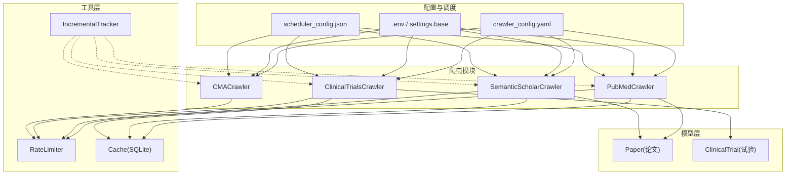
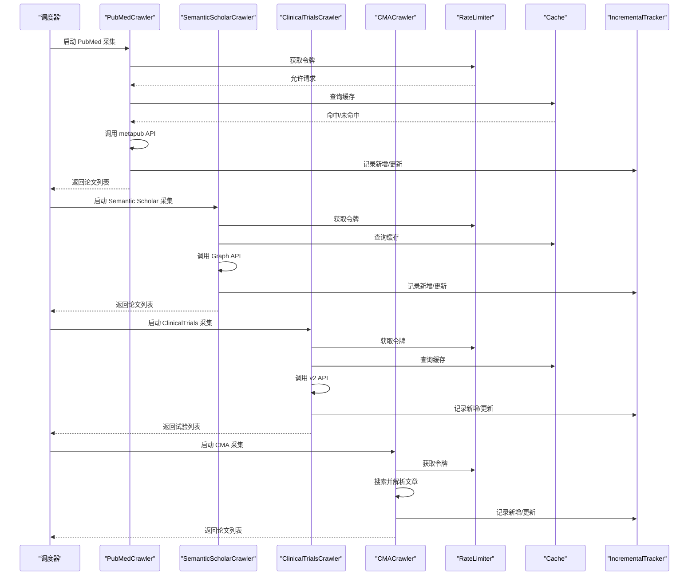
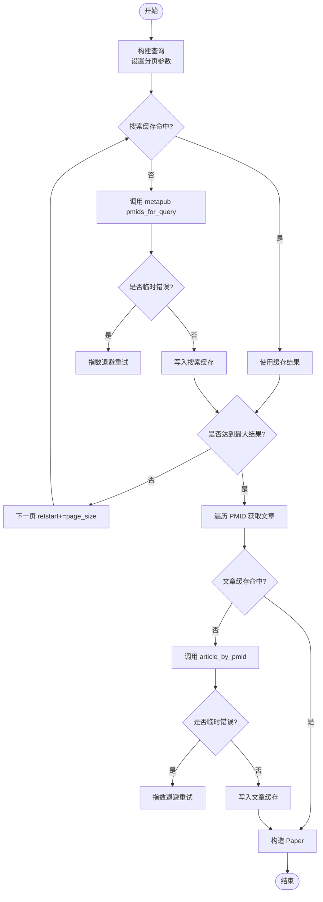
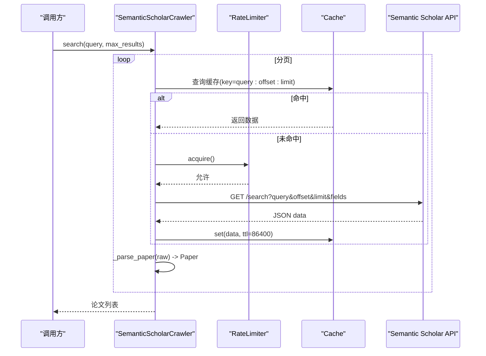
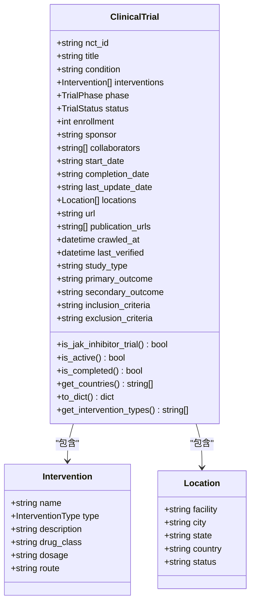
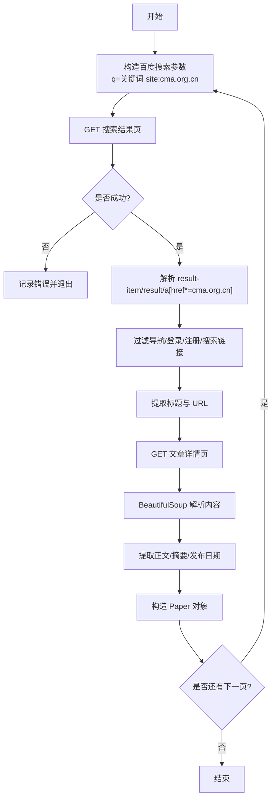
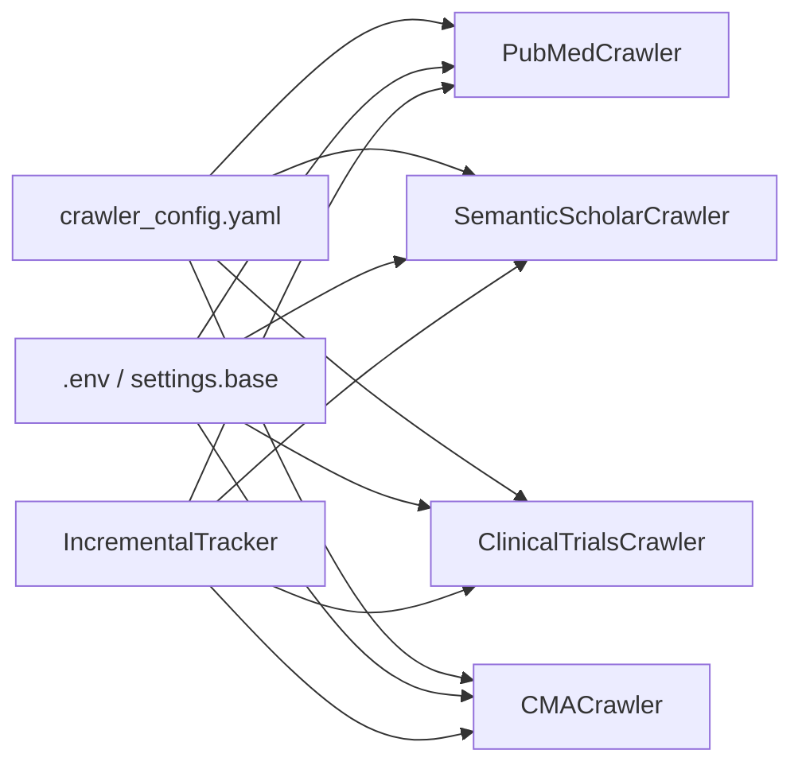
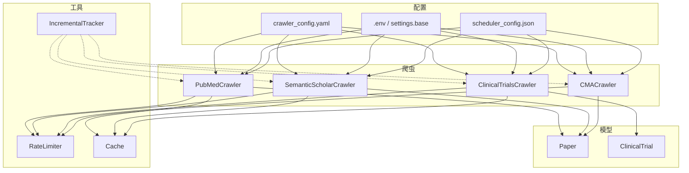

# 爬虫系统

<cite>
**本文引用的文件**
- [src/crawlers/__init__.py](file://src/crawlers/__init__.py)
- [configs/crawler_config.yaml](file://configs/crawler_config.yaml)
- [src/settings/base.py](file://src/settings/base.py)
- [src/utils/data_source_manager.py](file://src/utils/data_source_manager.py)
- [src/models/data_source.py](file://src/models/data_source.py)
- [src/crawlers/pubmed_crawler.py](file://src/crawlers/pubmed_crawler.py)
- [src/crawlers/semantic_scholar_crawler.py](file://src/crawlers/semantic_scholar_crawler.py)
- [src/crawlers/clinical_trials_crawler.py](file://src/crawlers/clinical_trials_crawler.py)
- [src/crawlers/cma_crawler.py](file://src/crawlers/cma_crawler.py)
- [src/utils/incremental_tracker.py](file://src/utils/incremental_tracker.py)
- [src/utils/rate_limiter.py](file://src/utils/rate_limiter.py)
- [src/utils/cache.py](file://src/utils/cache.py)
- [src/models/paper.py](file://src/models/paper.py)
- [src/models/trial.py](file://src/models/trial.py)
- [scheduler_config.json](file://scheduler_config.json)
</cite>

## 目录
1. [简介](#简介)
2. [项目结构](#项目结构)
3. [核心组件](#核心组件)
4. [架构总览](#架构总览)
5. [详细组件分析](#详细组件分析)
6. [依赖关系分析](#依赖关系分析)
7. [性能考量](#性能考量)
8. [故障排查指南](#故障排查指南)
9. [结论](#结论)
10. [附录](#附录)

## 简介
本技术文档面向 Subskin 爬虫系统，聚焦多源数据采集器的实现与运行机制。系统覆盖 PubMed、Semantic Scholar、ClinicalTrials.gov、中华医学会（CMA）等学术文献与临床试验数据源，提供统一的 API 调用策略、反爬处理、数据解析、错误重试、增量更新、并发控制与技术限制管理。同时给出扩展新爬虫的指南与性能优化建议，帮助开发者快速集成与维护。

## 项目结构
爬虫子系统位于 src/crawlers，配合通用工具（缓存、限流）、数据模型（论文、试验）、配置与调度完成端到端的数据采集流程。关键组织方式如下：
- 爬虫模块：按数据源拆分，统一对外暴露搜索/抓取接口
- 工具层：线程安全令牌桶限流器、SQLite TTL 缓存、增量更新记录
- 模型层：Pydantic 模型约束论文与试验数据结构
- 配置层：YAML 配置 + .env 环境变量注入
- 调度层：定时任务配置，支持周频执行与增量处理

图表来源
- [src/crawlers/pubmed_crawler.py:1-362](file://src/crawlers/pubmed_crawler.py#L1-L362)
- [src/crawlers/semantic_scholar_crawler.py:1-304](file://src/crawlers/semantic_scholar_crawler.py#L1-L304)
- [src/crawlers/clinical_trials_crawler.py:1-480](file://src/crawlers/clinical_trials_crawler.py#L1-L480)
- [src/crawlers/cma_crawler.py:1-321](file://src/crawlers/cma_crawler.py#L1-L321)
- [src/utils/rate_limiter.py:1-81](file://src/utils/rate_limiter.py#L1-L81)
- [src/utils/cache.py:1-147](file://src/utils/cache.py#L1-L147)
- [src/utils/incremental_tracker.py:1-298](file://src/utils/incremental_tracker.py#L1-L298)
- [configs/crawler_config.yaml:1-143](file://configs/crawler_config.yaml#L1-L143)
- [src/settings/base.py:1-67](file://src/settings/base.py#L1-L67)
- [scheduler_config.json:1-11](file://scheduler_config.json#L1-L11)

章节来源
- [src/crawlers/__init__.py:1-21](file://src/crawlers/__init__.py#L1-L21)
- [configs/crawler_config.yaml:1-143](file://configs/crawler_config.yaml#L1-L143)
- [src/settings/base.py:1-67](file://src/settings/base.py#L1-L67)
- [scheduler_config.json:1-11](file://scheduler_config.json#L1-L11)

## 核心组件
- 数据源管理器：集中加载与查询数据源配置，生成采集计划，校验配置一致性
- 数据源模型：定义权威等级、类别、类型、访问方式、优先级与采集方法等元数据
- 论文模型：标准化论文字段、标识符、语言、翻译/摘要状态、引用计数等
- 试验模型：标准化试验阶段、状态、干预措施、地点、日期、URL 校验等
- 限流器：线程安全令牌桶算法，控制请求速率
- 缓存：SQLite 存储，TTL 过期清理，键值存取
- 增量跟踪：记录每日新增/更新/失败事件，支持汇总与清理

章节来源
- [src/utils/data_source_manager.py:1-381](file://src/utils/data_source_manager.py#L1-L381)
- [src/models/data_source.py:1-284](file://src/models/data_source.py#L1-L284)
- [src/models/paper.py:1-263](file://src/models/paper.py#L1-L263)
- [src/models/trial.py:1-315](file://src/models/trial.py#L1-L315)
- [src/utils/rate_limiter.py:1-81](file://src/utils/rate_limiter.py#L1-L81)
- [src/utils/cache.py:1-147](file://src/utils/cache.py#L1-L147)
- [src/utils/incremental_tracker.py:1-298](file://src/utils/incremental_tracker.py#L1-L298)

## 架构总览
系统采用“爬虫-工具-模型”分层架构：
- 爬虫层：各数据源专用爬虫，封装 API/网页抓取、分页、解析、归一化
- 工具层：限流、缓存、增量跟踪，保证稳定性与可观测性
- 模型层：强类型数据契约，确保下游处理一致性与可验证性
- 配置层：YAML 参数与环境变量注入，灵活适配不同环境
- 调度层：周期性触发，结合增量策略减少重复工作

图表来源
- [src/crawlers/pubmed_crawler.py:129-215](file://src/crawlers/pubmed_crawler.py#L129-L215)
- [src/crawlers/semantic_scholar_crawler.py:231-284](file://src/crawlers/semantic_scholar_crawler.py#L231-L284)
- [src/crawlers/clinical_trials_crawler.py:394-480](file://src/crawlers/clinical_trials_crawler.py#L394-L480)
- [src/crawlers/cma_crawler.py:257-321](file://src/crawlers/cma_crawler.py#L257-L321)
- [src/utils/rate_limiter.py:43-61](file://src/utils/rate_limiter.py#L43-L61)
- [src/utils/cache.py:66-114](file://src/utils/cache.py#L66-L114)
- [src/utils/incremental_tracker.py:100-128](file://src/utils/incremental_tracker.py#L100-L128)

## 详细组件分析

### PubMed 爬虫
- API 调用策略：基于 metapub 的 PubMedFetcher，使用 E-utilities 检索 PMID 列表，再逐条拉取文章详情；支持分页 retstart/retmax
- 反爬虫处理：通过 RateLimiter 控制请求速率；当检测到 NCBI_API_KEY 时自动提高速率上限
- 数据解析逻辑：将 metapub 文章对象映射到 Paper 模型，规范化作者、MeSH、关键词、出版日期等字段
- 错误重试机制：对临时错误（超时、连接重置、5xx）进行指数退避重试；非临时错误直接抛出
- 缓存策略：对搜索页与文章详情分别缓存，键包含查询、分页与页面大小；TTL 默认 24 小时
- 并发控制：单实例内串行请求，由限流器协调；可通过外部调度器并行多个实例

图表来源
- [src/crawlers/pubmed_crawler.py:154-215](file://src/crawlers/pubmed_crawler.py#L154-L215)
- [src/crawlers/pubmed_crawler.py:316-362](file://src/crawlers/pubmed_crawler.py#L316-L362)
- [src/utils/cache.py:66-114](file://src/utils/cache.py#L66-L114)

章节来源
- [src/crawlers/pubmed_crawler.py:1-362](file://src/crawlers/pubmed_crawler.py#L1-L362)
- [src/models/paper.py:1-263](file://src/models/paper.py#L1-L263)

### Semantic Scholar 爬虫
- API 调用策略：调用 Graph API 搜索论文，支持 fields 选择、分页 offset/limit
- 反爬虫处理：内置 RateLimiter（默认高吞吐），User-Agent 标识；对 5xx/超时/连接错误进行指数退避重试
- 数据解析逻辑：将 raw paper 映射到 Paper 模型，补充 DOI、作者、期刊、发布日期、引用数、URL
- 错误重试机制：捕获 Timeout/HTTPError/ConnectionError，仅对服务端错误重试；客户端错误立即抛出
- 缓存策略：以 query+offset+limit 生成 SHA-256 缓存键，TTL 默认 24 小时
- 并发控制：单实例串行请求；可通过上下文管理器关闭会话与缓存资源

图表来源
- [src/crawlers/semantic_scholar_crawler.py:93-190](file://src/crawlers/semantic_scholar_crawler.py#L93-L190)
- [src/crawlers/semantic_scholar_crawler.py:231-284](file://src/crawlers/semantic_scholar_crawler.py#L231-L284)
- [src/utils/cache.py:66-114](file://src/utils/cache.py#L66-L114)

章节来源
- [src/crawlers/semantic_scholar_crawler.py:1-304](file://src/crawlers/semantic_scholar_crawler.py#L1-L304)
- [src/models/paper.py:1-263](file://src/models/paper.py#L1-L263)

### ClinicalTrials.gov 爬虫
- API 调用策略：v2 API 搜索试验，支持 pageSize/pageToken 分页；提供 vitiligo 与 JAK 抑制剂专项搜索
- 反爬虫处理：默认 1 req/s 限流；对 5xx/429/超时/连接错误进行指数退避重试；4xx 非 429 直接抛出
- 数据解析逻辑：将 protocolSection 各模块映射到 ClinicalTrial 模型，包括阶段、状态、干预、地点、日期、URL
- 错误重试机制：自定义 APIError，区分可重试与不可重试错误；累计失败后抛出异常
- 缓存策略：对查询参数排序后生成哈希键，TTL 默认 24 小时；支持按 NCT ID 精确查询缓存
- 并发控制：单实例串行请求；可通过外部调度器并行多个实例

图表来源
- [src/models/trial.py:44-65](file://src/models/trial.py#L44-L65)
- [src/models/trial.py:67-315](file://src/models/trial.py#L67-L315)

章节来源
- [src/crawlers/clinical_trials_crawler.py:1-480](file://src/crawlers/clinical_trials_crawler.py#L1-L480)
- [src/models/trial.py:1-315](file://src/models/trial.py#L1-L315)

### 中华医学会（CMA）爬虫
- 抓取策略：通过百度站内搜索 cma.org.cn，提取文章链接，再解析正文内容；避免直接访问受限站点
- 反爬虫处理：模拟浏览器 UA/Referer/Language；RateLimiter 控制每分钟请求数；429 指数退避
- 数据解析逻辑：使用 BeautifulSoup 定位文章内容区域，提取标题、摘要、发布日期；构造 Paper 模型
- 错误重试机制：网络异常与 429 均进行指数退避；多次失败后记录日志并停止
- 输出规范：统一为 Paper 模型，便于与其他来源合并处理

图表来源
- [src/crawlers/cma_crawler.py:91-137](file://src/crawlers/cma_crawler.py#L91-L137)
- [src/crawlers/cma_crawler.py:139-217](file://src/crawlers/cma_crawler.py#L139-L217)
- [src/crawlers/cma_crawler.py:219-321](file://src/crawlers/cma_crawler.py#L219-L321)

章节来源
- [src/crawlers/cma_crawler.py:1-321](file://src/crawlers/cma_crawler.py#L1-L321)
- [src/models/paper.py:1-263](file://src/models/paper.py#L1-L263)

### 配置管理与增量更新
- 配置管理：crawler_config.yaml 定义各数据源的搜索词、API 设置、分页、过滤、缓存 TTL、输出路径、日志级别、监控开关、数据保留策略；.env 注入 API Key（如 NCBI_API_KEY、SEMANTIC_SCHOLAR_API_KEY）
- 数据源管理：DataSourceManager 加载 data_sources.yaml（若存在），解析分类、优先级组、采集策略、质量标准，并提供查询与计划生成能力
- 增量更新：IncrementalTracker 使用 SQLite 记录每日新增/更新/失败事件，支持按日汇总、未处理记录查询、标记已处理与历史清理

图表来源
- [configs/crawler_config.yaml:1-143](file://configs/crawler_config.yaml#L1-L143)
- [src/settings/base.py:14-67](file://src/settings/base.py#L14-L67)
- [src/utils/incremental_tracker.py:60-128](file://src/utils/incremental_tracker.py#L60-L128)

章节来源
- [configs/crawler_config.yaml:1-143](file://configs/crawler_config.yaml#L1-L143)
- [src/settings/base.py:1-67](file://src/settings/base.py#L1-L67)
- [src/utils/data_source_manager.py:100-175](file://src/utils/data_source_manager.py#L100-L175)
- [src/utils/incremental_tracker.py:130-199](file://src/utils/incremental_tracker.py#L130-L199)

## 依赖关系分析
- 爬虫与工具：所有爬虫均依赖 RateLimiter 与 Cache；PubMed 还依赖 metapub；CMA 依赖 BeautifulSoup
- 爬虫与模型：PubMed/Semantic Scholar/CMA 输出 Paper；ClinicalTrials 输出 ClinicalTrial
- 配置与调度：YAML 配置驱动爬虫行为；scheduler_config.json 控制执行频率与通知策略
- 数据源管理：可选地加载 data_sources.yaml，用于规划采集优先级与工具需求

图表来源
- [src/crawlers/pubmed_crawler.py:1-362](file://src/crawlers/pubmed_crawler.py#L1-L362)
- [src/crawlers/semantic_scholar_crawler.py:1-304](file://src/crawlers/semantic_scholar_crawler.py#L1-L304)
- [src/crawlers/clinical_trials_crawler.py:1-480](file://src/crawlers/clinical_trials_crawler.py#L1-L480)
- [src/crawlers/cma_crawler.py:1-321](file://src/crawlers/cma_crawler.py#L1-L321)
- [src/utils/rate_limiter.py:1-81](file://src/utils/rate_limiter.py#L1-L81)
- [src/utils/cache.py:1-147](file://src/utils/cache.py#L1-L147)
- [src/utils/incremental_tracker.py:1-298](file://src/utils/incremental_tracker.py#L1-L298)
- [configs/crawler_config.yaml:1-143](file://configs/crawler_config.yaml#L1-L143)
- [src/settings/base.py:1-67](file://src/settings/base.py#L1-L67)
- [scheduler_config.json:1-11](file://scheduler_config.json#L1-L11)

章节来源
- [src/crawlers/__init__.py:1-21](file://src/crawlers/__init__.py#L1-L21)
- [configs/crawler_config.yaml:1-143](file://configs/crawler_config.yaml#L1-L143)
- [scheduler_config.json:1-11](file://scheduler_config.json#L1-L11)

## 性能考量
- 限流与退避：所有爬虫均使用令牌桶限流；对临时错误采用指数退避，避免雪崩
- 缓存命中率：对高频查询（搜索页、文章详情、试验页）启用 TTL 缓存，显著降低重复请求
- 分页与上限：合理设置 page_size、max_results、max_pages，避免单次拉取过大负载
- 并发策略：单实例串行请求，外部调度器可并行多个实例；注意目标站点的并发限制
- 资源释放：Semantic Scholar 爬虫支持上下文管理器关闭会话与缓存；其他爬虫应遵循相同模式
- 增量更新：通过 IncrementalTracker 记录变更，仅对新增内容做后续处理（如向量化），减少计算开销
- 配置调优：根据 API 配额调整 rate_limit、cache_ttl、output_dir、log_level；生产环境建议开启监控与告警

[本节为通用指导，不直接分析具体文件]

## 故障排查指南
- 常见错误类型
  - 429 限流：检查 RateLimiter 配置与目标站点限制；适当增大退避时间或降低并发
  - 5xx 服务器错误：确认服务可用性；查看重试次数与退避策略
  - 超时/连接错误：检查网络与代理；增加 timeout 与重试次数
  - 解析失败：核对 HTML/JSON 结构变化；更新选择器或字段映射
- 调试建议
  - 启用详细日志：调整 log_level 为 DEBUG，观察请求与缓存命中情况
  - 检查缓存键：确认 key 生成逻辑（如 query+offset+limit）是否正确
  - 验证模型：使用 Pydantic 校验失败信息定位字段缺失或格式错误
  - 增量记录：查询 IncrementalTracker 的未处理记录与今日汇总，定位失败来源
- 恢复策略
  - 清理过期缓存：必要时调用 clear/delete 或等待 TTL 过期
  - 重试策略：对可重试错误保持指数退避；对不可重试错误记录并跳过
  - 降级方案：在第三方 API 不可用时，切换到备用数据源或离线数据

章节来源
- [src/crawlers/clinical_trials_crawler.py:124-199](file://src/crawlers/clinical_trials_crawler.py#L124-L199)
- [src/crawlers/semantic_scholar_crawler.py:93-160](file://src/crawlers/semantic_scholar_crawler.py#L93-L160)
- [src/crawlers/cma_crawler.py:91-137](file://src/crawlers/cma_crawler.py#L91-L137)
- [src/utils/incremental_tracker.py:219-285](file://src/utils/incremental_tracker.py#L219-L285)

## 结论
Subskin 爬虫系统通过模块化设计、统一工具链与强类型模型，实现了稳定、可扩展的多源数据采集能力。各爬虫针对目标站点特性定制了 API 调用、反爬与解析策略，并结合限流、缓存与增量跟踪保障性能与可靠性。建议在生产环境中完善监控告警、优化配置参数、定期清理历史数据，并按需扩展新数据源。

[本节为总结，不直接分析具体文件]

## 附录
- 爬虫扩展开发指南
  - 新建爬虫类：实现搜索/抓取、分页、解析、归一化为标准模型（Paper/ClinicalTrial）
  - 接入限流与缓存：使用 RateLimiter 与 Cache，设置合理 TTL 与键生成策略
  - 错误处理：区分可重试与不可重试错误，实现指数退避与日志记录
  - 配置注入：在 crawler_config.yaml 中添加数据源配置，必要时通过 .env 注入密钥
  - 增量记录：在新增/更新/失败时调用 IncrementalTracker.record_update
  - 测试与验证：编写单元测试覆盖解析逻辑与边界条件；使用 fixtures 模拟 API 响应
- 性能优化建议
  - 合理分页：根据 API 限制与数据量调整 page_size 与 max_results
  - 缓存策略：对热点查询设置较长 TTL；对频繁更新的数据缩短 TTL
  - 并发控制：外部调度器并行多个实例，但需遵守目标站点并发限制
  - 资源管理：使用上下文管理器确保会话与缓存正确关闭
  - 日志与监控：开启结构化日志，记录请求耗时、错误率、缓存命中率
  - 增量优先：仅对新增内容做后续处理（如向量化、摘要），减少计算成本

[本节为通用指导，不直接分析具体文件]