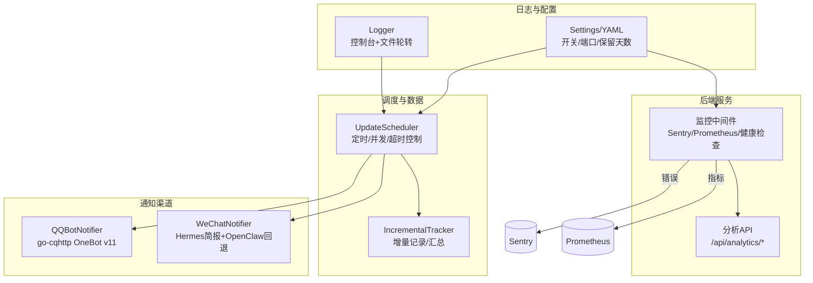
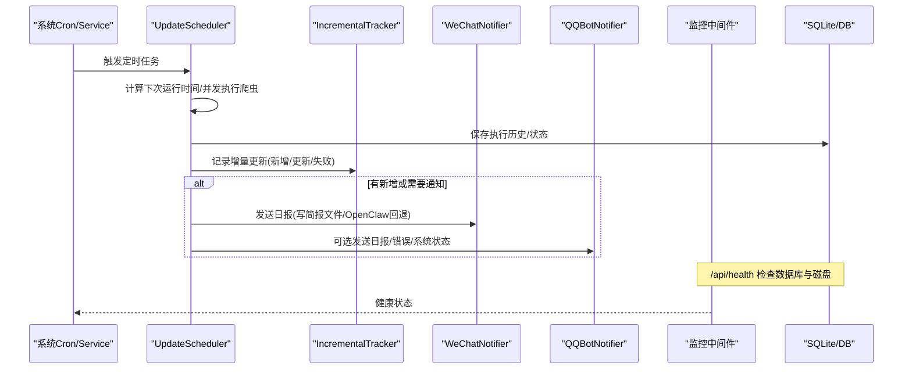
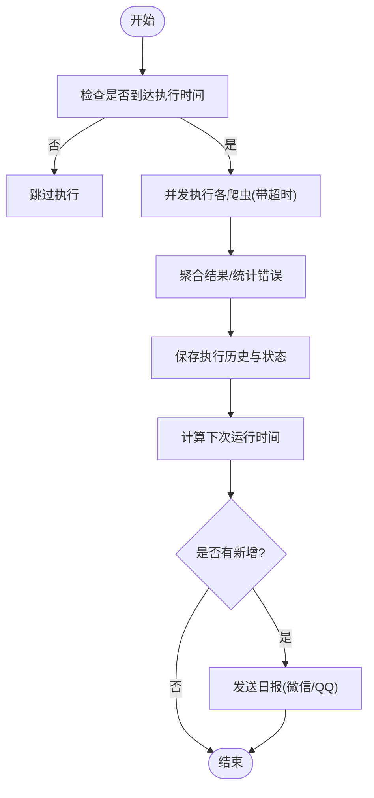
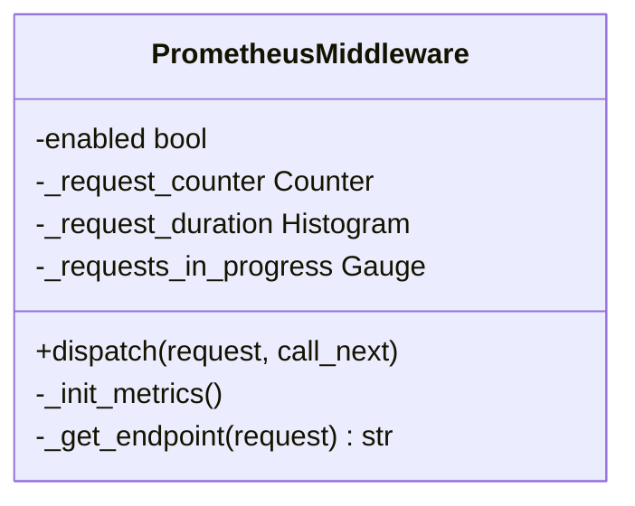
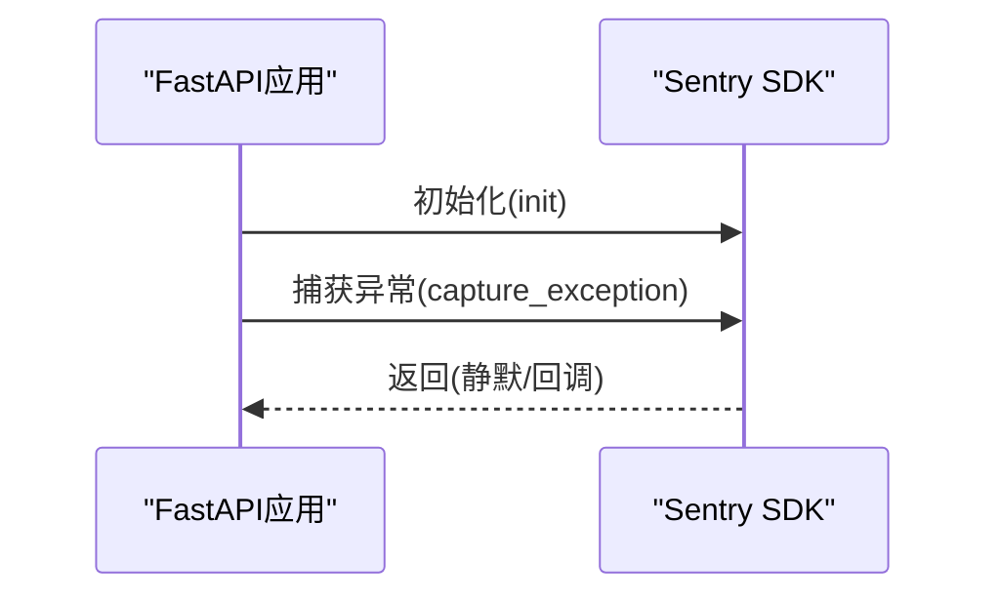
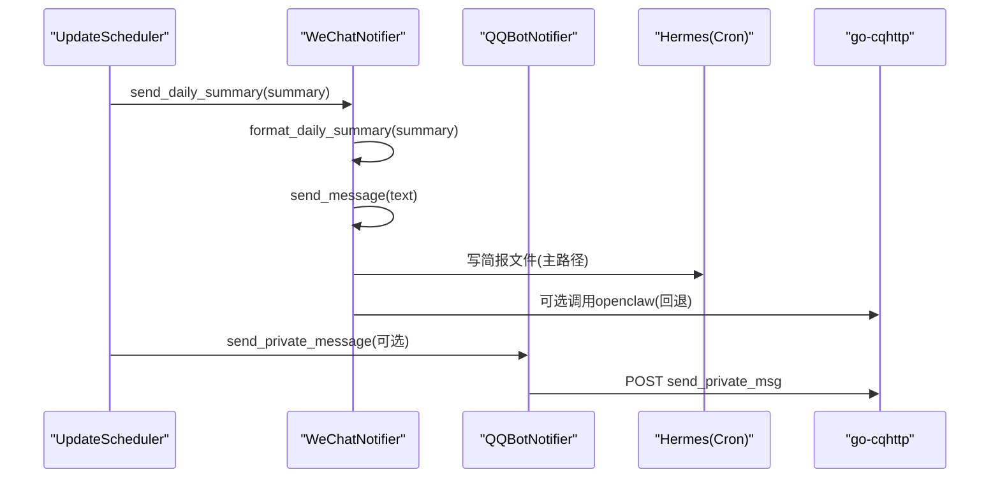
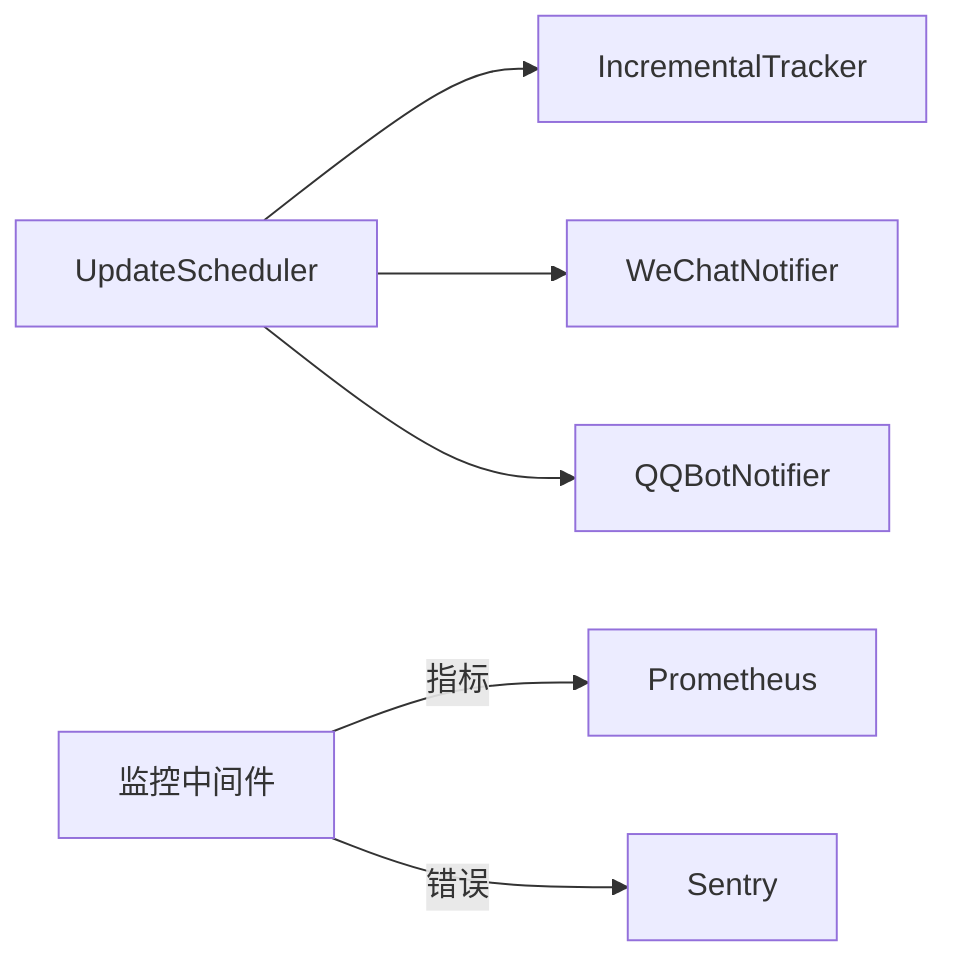

# 监控与告警

<cite>
**本文引用的文件**
- [monitoring.py](file://web/backend/services/monitoring.py)
- [wechat_notifier.py](file://src/notifications/wechat_notifier.py)
- [qq_notifier.py](file://src/notifications/qq_notifier.py)
- [update_scheduler.py](file://src/scheduler/update_scheduler.py)
- [incremental_tracker.py](file://src/utils/incremental_tracker.py)
- [logger.py](file://src/utils/logger.py)
- [logging.py](file://src/settings/logging.py)
- [settings.py](file://src/settings/settings.py)
- [web_config.yaml](file://configs/web_config.yaml)
- [analytics.py](file://web/backend/api/analytics.py)
- [analytics_service.py](file://web/backend/services/analytics.py)
- [notifications_api.py](file://web/backend/api/notifications.py)
- [scheduler_config.json](file://scheduler_config.json)
</cite>

## 目录
1. [简介](#简介)
2. [项目结构](#项目结构)
3. [核心组件](#核心组件)
4. [架构总览](#架构总览)
5. [详细组件分析](#详细组件分析)
6. [依赖关系分析](#依赖关系分析)
7. [性能考量](#性能考量)
8. [故障排查指南](#故障排查指南)
9. [结论](#结论)
10. [附录](#附录)

## 简介
本技术文档聚焦 SubSkin 的监控与告警体系，覆盖任务执行监控、性能指标采集、异常检测与多渠道通知（微信、QQ）的实现原理与配置方法。同时给出日志收集策略、错误追踪、健康检查接口、告警规则配置建议，以及监控面板集成、自定义指标定义与阈值设置指南，帮助运维与研发人员快速搭建可观测性与稳定性保障能力。

## 项目结构
SubSkin 的监控与告警由后端服务中间件、调度器、通知模块、日志与配置共同组成：
- 后端监控中间件：Sentry 错误追踪、Prometheus 指标采集、健康检查端点
- 调度器：定时任务编排、爬虫执行、增量更新记录与通知触发
- 通知模块：微信（OpenClaw CLI + Hermes 简报）、QQ（go-cqhttp HTTP API）
- 日志系统：统一 logger、按天轮转、控制台与文件双输出
- 配置中心：环境变量与 YAML 配置项，控制开关与端口等

图表来源
- [monitoring.py:28-259](file://web/backend/services/monitoring.py#L28-L259)
- [update_scheduler.py:79-381](file://src/scheduler/update_scheduler.py#L79-L381)
- [incremental_tracker.py:53-298](file://src/utils/incremental_tracker.py#L53-L298)
- [wechat_notifier.py:26-216](file://src/notifications/wechat_notifier.py#L26-L216)
- [qq_notifier.py:40-530](file://src/notifications/qq_notifier.py#L40-L530)
- [logger.py:19-81](file://src/utils/logger.py#L19-L81)
- [settings.py:189-241](file://src/settings/settings.py#L189-L241)
- [web_config.yaml:232-251](file://configs/web_config.yaml#L232-L251)

章节来源
- [monitoring.py:28-259](file://web/backend/services/monitoring.py#L28-L259)
- [update_scheduler.py:79-381](file://src/scheduler/update_scheduler.py#L79-L381)
- [incremental_tracker.py:53-298](file://src/utils/incremental_tracker.py#L53-L298)
- [wechat_notifier.py:26-216](file://src/notifications/wechat_notifier.py#L26-L216)
- [qq_notifier.py:40-530](file://src/notifications/qq_notifier.py#L40-L530)
- [logger.py:19-81](file://src/utils/logger.py#L19-L81)
- [settings.py:189-241](file://src/settings/settings.py#L189-L241)
- [web_config.yaml:232-251](file://configs/web_config.yaml#L232-L251)

## 核心组件
- 监控中间件
  - Sentry 错误追踪：初始化、敏感信息过滤、手动捕获异常
  - Prometheus 指标：请求总数、耗时直方图、进行中请求数、/metrics 端点
  - 健康检查：数据库连通性、磁盘空间检查
- 调度器与增量跟踪
  - UpdateScheduler：定时/频率计算、并发执行各爬虫、超时控制、结果持久化、失败统计
  - IncrementalTracker：记录每日新增/更新/失败事件，生成日报摘要
- 通知渠道
  - WeChatNotifier：优先写简报到文件供 Hermes 投递，回退调用 OpenClaw CLI
  - QQBotNotifier：基于 go-cqhttp 的 OneBot v11 协议，带重试与连接测试
- 日志系统
  - get_logger：控制台与文件双输出，TimedRotatingFileHandler 按天轮转
  - settings.logging：统一级别与格式化
- 配置
  - 环境变量：SENTRY_DSN、PROMETHEUS_ENABLED、METRICS_PORT 等
  - YAML：监控与分析相关开关、健康检查路径、指标端口

章节来源
- [monitoring.py:28-259](file://web/backend/services/monitoring.py#L28-L259)
- [update_scheduler.py:79-381](file://src/scheduler/update_scheduler.py#L79-L381)
- [incremental_tracker.py:53-298](file://src/utils/incremental_tracker.py#L53-L298)
- [wechat_notifier.py:26-216](file://src/notifications/wechat_notifier.py#L26-L216)
- [qq_notifier.py:40-530](file://src/notifications/qq_notifier.py#L40-L530)
- [logger.py:19-81](file://src/utils/logger.py#L19-L81)
- [logging.py:14-58](file://src/settings/logging.py#L14-L58)
- [settings.py:189-241](file://src/settings/settings.py#L189-L241)
- [web_config.yaml:232-251](file://configs/web_config.yaml#L232-L251)

## 架构总览
下图展示从调度执行到通知触发的完整链路，以及监控指标与健康检查的接入点。

图表来源
- [update_scheduler.py:218-381](file://src/scheduler/update_scheduler.py#L218-L381)
- [incremental_tracker.py:100-199](file://src/utils/incremental_tracker.py#L100-L199)
- [wechat_notifier.py:55-216](file://src/notifications/wechat_notifier.py#L55-L216)
- [qq_notifier.py:127-218](file://src/notifications/qq_notifier.py#L127-L218)
- [monitoring.py:208-240](file://web/backend/services/monitoring.py#L208-L240)

## 详细组件分析

### 任务执行监控（UpdateScheduler）
- 功能要点
  - 支持 daily/weekly/monthly 频率，计算 next_run
  - 并发执行多个爬虫，单任务最大超时控制
  - 记录每次执行的历史、状态、错误、耗时
  - 增量更新记录后，可选择导入 RAG 并触发通知
- 关键流程
  - should_run_now 判断是否到达执行时间
  - run_scheduled_update 编排执行、聚合结果、写入状态、计算下次运行
  - 若存在新增，构造简报并通过 WeChatNotifier 发送；也可扩展 QQ 通知

图表来源
- [update_scheduler.py:157-217](file://src/scheduler/update_scheduler.py#L157-L217)
- [update_scheduler.py:218-381](file://src/scheduler/update_scheduler.py#L218-L381)

章节来源
- [update_scheduler.py:157-217](file://src/scheduler/update_scheduler.py#L157-L217)
- [update_scheduler.py:218-381](file://src/scheduler/update_scheduler.py#L218-L381)

### 性能指标采集（Prometheus 中间件）
- 指标定义
  - http_requests_total：按 method、endpoint、status_code 分组
  - http_request_duration_seconds：按 method、endpoint 分桶的耗时直方图
  - http_requests_in_progress：当前进行中的请求数
- 启用方式
  - 环境变量 PROMETHEUS_ENABLED=true
  - 添加中间件并暴露 /metrics 端点
- 注意事项
  - endpoint 使用路由模板避免高基数
  - 未安装 prometheus-client 时自动降级为禁用

图表来源
- [monitoring.py:96-183](file://web/backend/services/monitoring.py#L96-L183)

章节来源
- [monitoring.py:96-183](file://web/backend/services/monitoring.py#L96-L183)

### 异常检测与错误追踪（Sentry）
- 功能要点
  - init_sentry：根据 DSN 与环境初始化，注册 FastAPI/Starlette/SQLAlchemy 集成
  - before_send：过滤敏感字段（password、token、secret、api_key、authorization）
  - capture_exception：在业务中手动上报异常并附加上下文
- 使用建议
  - 生产环境务必配置 SENTRY_DSN
  - 合理设置 traces_sample_rate 平衡成本与可观测性

图表来源
- [monitoring.py:28-91](file://web/backend/services/monitoring.py#L28-L91)

章节来源
- [monitoring.py:28-91](file://web/backend/services/monitoring.py#L28-L91)

### 多渠道通知服务（微信、QQ）
- 微信（WeChatNotifier）
  - 主路径：将格式化后的简报写入 data/briefings/daily_YYYY-MM-DD.md，供 Hermes cronjob 通过 weixin 通道投递
  - 回退路径：直接调用 openclaw message send（可能会话过期）
  - 支持错误告警消息发送
- QQ（QQBotNotifier）
  - 通过 go-cqhttp 的 OneBot v11 协议发送私聊/群消息
  - 内置重试逻辑、连接测试、会话管理
  - 提供日报、错误、系统状态消息格式化与发送
  - 支持从环境变量创建实例（CQHTTP_HOST/PORT/TIMEOUT/MAX_RETRIES/RETRY_DELAY）

图表来源
- [wechat_notifier.py:55-216](file://src/notifications/wechat_notifier.py#L55-L216)
- [qq_notifier.py:127-218](file://src/notifications/qq_notifier.py#L127-L218)
- [update_scheduler.py:349-381](file://src/scheduler/update_scheduler.py#L349-L381)

章节来源
- [wechat_notifier.py:55-216](file://src/notifications/wechat_notifier.py#L55-L216)
- [qq_notifier.py:127-218](file://src/notifications/qq_notifier.py#L127-L218)
- [update_scheduler.py:349-381](file://src/scheduler/update_scheduler.py#L349-L381)

### 日志收集策略
- 统一 logger
  - get_logger：默认输出到 stderr，可选文件输出并按天轮转（保留N天）
  - 格式包含时间、级别、模块名、消息
- settings.logging
  - 提供 configure_logging/get_logger 快捷方式，读取全局 LOG_LEVEL
- 建议
  - 调度器日志单独落盘（logs/scheduler.log），便于定位定时任务问题
  - 生产环境结合日志聚合平台（如 ELK/Loki）集中收集

章节来源
- [logger.py:19-81](file://src/utils/logger.py#L19-L81)
- [logging.py:14-58](file://src/settings/logging.py#L14-L58)
- [update_scheduler.py:32-37](file://src/scheduler/update_scheduler.py#L32-L37)

### 健康检查接口
- 端点：GET /api/health
- 检查项
  - 数据库连通性：尝试 SELECT 1
  - 磁盘空间：剩余空间低于阈值标记 degraded
- 返回值：status 与 checks 明细

章节来源
- [monitoring.py:208-240](file://web/backend/services/monitoring.py#L208-L240)

### 告警规则配置与阈值建议
- 指标类
  - 请求错误率：http_requests_total 中 status_code>=500 的比例超过阈值（如 >1%）
  - 请求延迟：http_request_duration_seconds 的 P95/P99 超过阈值（如 >2s）
  - 并发请求：http_requests_in_progress 持续高位（如 >200）
- 任务类
  - 调度失败：schedule_history 连续失败次数超过阈值（如 >=3）
  - 爬虫超时：单个爬虫执行时长接近或超过 CRAWLER_TIMEOUT_SECONDS
- 资源类
  - 磁盘空间：/api/health 返回 disk 为 low space
  - 内存/CPU：结合系统监控（Node Exporter）设定阈值
- 通知类
  - 微信/QQ 发送失败：记录失败次数并触发告警
  - 增量更新无变化：长时间无新增，需确认数据源可用性

章节来源
- [monitoring.py:96-183](file://web/backend/services/monitoring.py#L96-L183)
- [update_scheduler.py:257-381](file://src/scheduler/update_scheduler.py#L257-L381)
- [monitoring.py:208-240](file://web/backend/services/monitoring.py#L208-L240)

### 监控面板集成与自定义指标
- Prometheus 集成
  - 启用 PROMETHEUS_ENABLED=true，访问 /metrics 抓取
  - 可在 Grafana 中导入官方模板或使用自定义面板
- 自定义指标
  - 在业务关键路径增加 Counter/Histogram/Gauge（例如：RAG 导入成功数、Embedding 调用次数）
  - 注意标签基数控制，避免高基数字段（如用户ID）作为维度
- 前端分析
  - /api/analytics/* 提供概览、趋势、页面视图、漏斗、功能使用、注册趋势、用户旅程等
  - 可用于构建运营看板与产品分析

章节来源
- [monitoring.py:185-203](file://web/backend/services/monitoring.py#L185-L203)
- [analytics.py:14-88](file://web/backend/api/analytics.py#L14-L88)
- [analytics_service.py:76-667](file://web/backend/services/analytics.py#L76-L667)

## 依赖关系分析
- 组件耦合
  - UpdateScheduler 依赖 IncrementalTracker 与通知模块，解耦清晰
  - 监控中间件独立于业务，仅通过环境变量控制启用
  - 通知模块各自封装外部依赖（OpenClaw CLI、go-cqhttp）
- 外部依赖
  - Sentry SDK（可选）
  - Prometheus Client（可选）
  - go-cqhttp（QQ 通知）
  - OpenClaw CLI（微信回退）
- 潜在循环依赖
  - 未发现循环 import；模块间通过函数调用与配置参数交互

图表来源
- [update_scheduler.py:79-381](file://src/scheduler/update_scheduler.py#L79-L381)
- [monitoring.py:28-259](file://web/backend/services/monitoring.py#L28-L259)

章节来源
- [update_scheduler.py:79-381](file://src/scheduler/update_scheduler.py#L79-L381)
- [monitoring.py:28-259](file://web/backend/services/monitoring.py#L28-L259)

## 性能考量
- 并发与超时
  - 每个爬虫线程执行，设置最大超时防止阻塞整体调度
  - 合理调整并发数量与超时阈值以匹配外部 API 限流
- 指标粒度
  - endpoint 使用路由模板降低基数；避免将动态 ID 作为标签
- 日志轮转
  - 使用 TimedRotatingFileHandler 按天轮转，控制保留天数避免磁盘占用
- 通知可靠性
  - 微信优先走文件+Hermes，降低对 CLI 会话状态的依赖
  - QQ 通知具备重试与连接测试，提升鲁棒性

## 故障排查指南
- 常见问题
  - 微信通知失败：检查简报文件是否写入、Hermes 是否运行、OpenClaw 会话是否有效
  - QQ 通知失败：检查 go-cqhttp 是否启动、端口与 host 是否正确、OneBot 响应 retcode
  - 健康检查异常：数据库不可用或磁盘空间不足
  - 指标缺失：prometheus-client 未安装或 PROMETHEUS_ENABLED 未开启
- 定位步骤
  - 查看 logs/scheduler.log 与标准输出日志
  - 检查 /api/health 返回的 checks 详情
  - 访问 /metrics 验证指标是否暴露
  - 核对环境变量与 YAML 配置项

章节来源
- [wechat_notifier.py:55-216](file://src/notifications/wechat_notifier.py#L55-L216)
- [qq_notifier.py:76-218](file://src/notifications/qq_notifier.py#L76-L218)
- [monitoring.py:208-240](file://web/backend/services/monitoring.py#L208-L240)
- [monitoring.py:185-203](file://web/backend/services/monitoring.py#L185-L203)

## 结论
SubSkin 的监控与告警体系以“可观测性+稳定性”为核心，通过 Prometheus/Sentry 实现运行时指标与错误追踪，借助 UpdateScheduler 与 IncrementalTracker 完成任务编排与增量记录，并以微信/QQ 多渠道通知确保及时触达。配合健康检查、日志轮转与合理的告警阈值，可构建稳定可靠的自动化数据采集与知识更新流水线。

## 附录
- 环境变量参考
  - SENTRY_DSN、SENTRY_ENVIRONMENT、SENTRY_TRACES_SAMPLE_RATE
  - PROMETHEUS_ENABLED、METRICS_PORT
  - CQHTTP_HOST、CQHTTP_PORT、CQHTTP_TIMEOUT、CQHTTP_MAX_RETRIES、CQHTTP_RETRY_DELAY
- 配置文件参考
  - web_config.yaml：监控与分析开关、健康检查路径、指标端口
  - scheduler_config.json：调度频率、时间、通知开关、最大运行时长

章节来源
- [settings.py:189-241](file://src/settings/settings.py#L189-L241)
- [web_config.yaml:232-251](file://configs/web_config.yaml#L232-L251)
- [scheduler_config.json:1-11](file://scheduler_config.json#L1-L11)