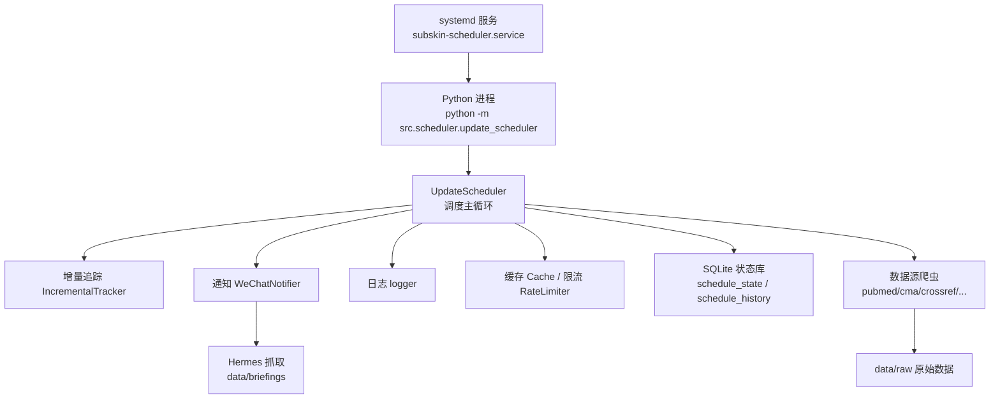
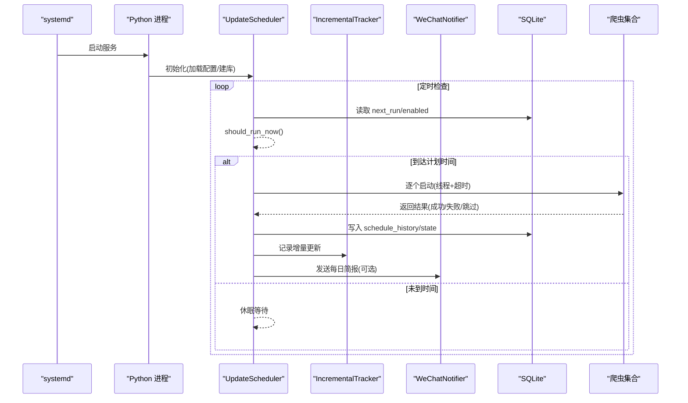
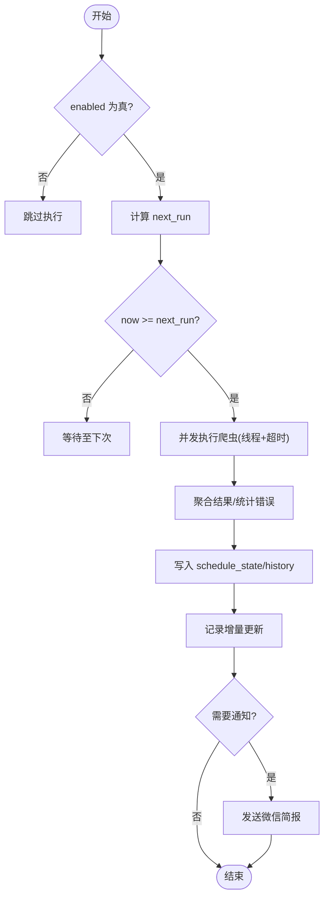
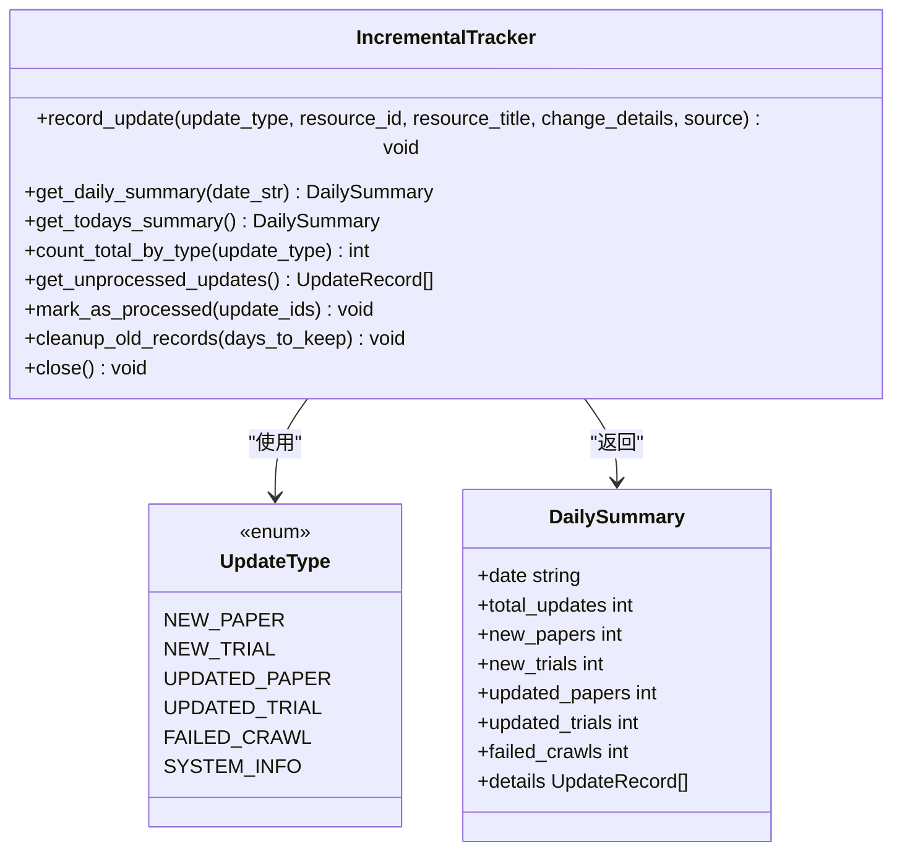
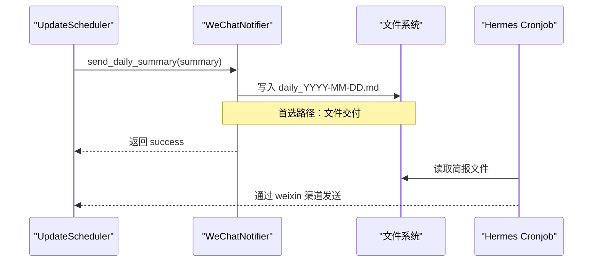
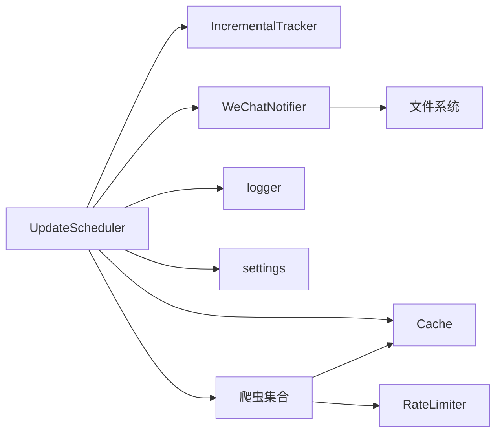

# 调度管理系统

<cite>
**本文引用的文件**   
- [update_scheduler.py](file://src/scheduler/update_scheduler.py)
- [incremental_tracker.py](file://src/utils/incremental_tracker.py)
- [wechat_notifier.py](file://src/notifications/wechat_notifier.py)
- [logger.py](file://src/utils/logger.py)
- [cache.py](file://src/utils/cache.py)
- [rate_limiter.py](file://src/utils/rate_limiter.py)
- [settings.py](file://src/settings/settings.py)
- [config.py](file://src/config.py)
- [crawler_config.yaml](file://configs/crawler_config.yaml)
- [web_config.yaml](file://configs/web_config.yaml)
- [scheduler_config.json](file://scheduler_config.json)
- [subskin-scheduler.service](file://subskin-scheduler.service)
- [test_update_scheduler.py](file://tests/test_update_scheduler.py)
</cite>

## 目录
1. [简介](#简介)
2. [项目结构](#项目结构)
3. [核心组件](#核心组件)
4. [架构总览](#架构总览)
5. [详细组件分析](#详细组件分析)
6. [依赖关系分析](#依赖关系分析)
7. [性能与资源管理](#性能与资源管理)
8. [故障排查指南](#故障排查指南)
9. [结论](#结论)
10. [附录](#附录)

## 简介
本技术文档围绕 Subskin 的调度管理系统，系统性阐述定时任务调度机制、任务队列管理与执行监控。重点覆盖：
- 任务配置管理（频率、时间窗口、开关、最大运行时长、通知策略）
- 依赖关系处理（数据源分类、串行/并行执行、超时控制）
- 失败重试与容错（线程级超时、连续失败计数、自动禁用）
- 资源分配机制（并发度、速率限制、缓存、日志轮转）
- 状态跟踪与可观测性（SQLite 持久化历史、增量更新记录、微信简报）
- 告警与通知（微信推送、健康检查、指标采集）
- 调度策略优化（日/周/月调度、下次运行计算、优先级扩展建议）
- 分布式部署方案（systemd 服务、进程隔离、横向扩展思路）

## 项目结构
调度系统位于 src/scheduler 模块，配合 utils、notifications、settings 等子模块共同完成“计划—执行—记录—通知”的闭环。关键文件与职责如下：
- 调度器：UpdateScheduler 负责读取配置、计算下次运行时间、编排爬虫执行、汇总结果、写入历史与增量记录、触发通知
- 增量追踪：IncrementalTracker 以 SQLite 存储每日变更明细，支持按类型统计与清理
- 通知：WeChatNotifier 将每日摘要写入文件供 Hermes 抓取，或回退到 openclaw CLI 发送
- 日志：get_logger 统一输出控制台与带时间轮转的文件日志
- 缓存与限流：Cache（SQLite TTL 缓存）、RateLimiter（令牌桶）为爬虫提供基础能力
- 配置：scheduler_config.json（调度频率与开关）、crawler_config.yaml（各数据源参数）、web_config.yaml（Web 侧相关设置）
- 运行环境：subskin-scheduler.service（systemd 单元）确保进程常驻与自动重启

图表来源
- [subskin-scheduler.service:1-16](file://subskin-scheduler.service#L1-L16)
- [update_scheduler.py:1-120](file://src/scheduler/update_scheduler.py#L1-L120)
- [incremental_tracker.py:1-120](file://src/utils/incremental_tracker.py#L1-L120)
- [wechat_notifier.py:1-120](file://src/notifications/wechat_notifier.py#L1-L120)
- [logger.py:1-81](file://src/utils/logger.py#L1-L81)
- [cache.py:1-147](file://src/utils/cache.py#L1-L147)
- [rate_limiter.py:1-81](file://src/utils/rate_limiter.py#L1-L81)

章节来源
- [update_scheduler.py:1-120](file://src/scheduler/update_scheduler.py#L1-L120)
- [scheduler_config.json:1-11](file://scheduler_config.json#L1-L11)
- [crawler_config.yaml:1-143](file://configs/crawler_config.yaml#L1-L143)
- [web_config.yaml:1-284](file://configs/web_config.yaml#L1-L284)
- [subskin-scheduler.service:1-16](file://subskin-scheduler.service#L1-L16)

## 核心组件
- UpdateScheduler
  - 配置加载与持久化（JSON），默认值与覆盖策略
  - 调度周期计算（日/周/月），下次运行时间维护
  - 任务编排：按信息源类别顺序调用各爬虫，线程+超时保护
  - 结果聚合：成功/失败统计、错误收集、整体状态判定
  - 状态持久化：SQLite 表 schedule_state/schedule_history
  - 增量记录：通过 IncrementalTracker 记录新增/更新条目
  - 通知：条件触发 WeChatNotifier 发送每日简报
- IncrementalTracker
  - 每日变更记录表 daily_updates，索引优化查询
  - 按日期汇总、未处理记录获取、批量标记已处理、过期清理
- WeChatNotifier
  - 首选：写入 data/briefings/daily_YYYY-MM-DD.md，由 Hermes 抓取
  - 回退：openclaw CLI 直接发送消息
  - 格式化：按权威分级（S/A/B/C/D）生成可读摘要
- 辅助工具
  - logger：控制台 + 文件（TimedRotatingFileHandler，按天轮转）
  - Cache：SQLite TTL 缓存，线程安全
  - RateLimiter：令牌桶限流，避免 API 限速

章节来源
- [update_scheduler.py:1-380](file://src/scheduler/update_scheduler.py#L1-L380)
- [incremental_tracker.py:1-298](file://src/utils/incremental_tracker.py#L1-L298)
- [wechat_notifier.py:1-216](file://src/notifications/wechat_notifier.py#L1-L216)
- [logger.py:1-81](file://src/utils/logger.py#L1-L81)
- [cache.py:1-147](file://src/utils/cache.py#L1-L147)
- [rate_limiter.py:1-81](file://src/utils/rate_limiter.py#L1-L81)

## 架构总览
调度系统采用“单进程 + 多线程”模式：一个调度主进程负责编排与状态管理，每个爬虫在独立线程中执行并受超时约束；结果与状态落盘 SQLite，增量记录与通知异步化。

图表来源
- [subskin-scheduler.service:1-16](file://subskin-scheduler.service#L1-L16)
- [update_scheduler.py:180-380](file://src/scheduler/update_scheduler.py#L180-L380)
- [incremental_tracker.py:100-200](file://src/utils/incremental_tracker.py#L100-L200)
- [wechat_notifier.py:179-216](file://src/notifications/wechat_notifier.py#L179-L216)

## 详细组件分析

### UpdateScheduler：调度主引擎
- 配置管理
  - 从 scheduler_config.json 加载，缺失则使用默认值并写回
  - 字段包括 frequency/hour/minute/enabled/max_runtime_hours/notify_on_completion/notify_on_failure
- 调度决策
  - calculate_next_run：根据频率与时分计算下一次执行时间
  - should_run_now：结合数据库中的 enabled 与 next_run 判断是否立即执行
- 执行编排
  - run_scheduled_update：遍历预定义爬虫列表，线程执行并设置超时（如 PubMed 约需 55 分钟，上限 60 分钟）
  - 结果聚合：统计 collected/updated/errors，判定整体状态
- 状态与增量
  - _save_execution_result/_update_schedule_state：持久化执行历史与下次运行时间，累计连续失败次数并在阈值后禁用
  - _record_incremental_updates：通过 IncrementalTracker 记录当日变更
- 通知
  - 当 WECHAT_NOTIFICATION_ENABLED 且开启通知时，构造简报并调用 WeChatNotifier

图表来源
- [update_scheduler.py:157-380](file://src/scheduler/update_scheduler.py#L157-L380)

章节来源
- [update_scheduler.py:80-380](file://src/scheduler/update_scheduler.py#L80-L380)
- [scheduler_config.json:1-11](file://scheduler_config.json#L1-L11)

### IncrementalTracker：增量更新追踪
- 数据结构
  - daily_updates 表：update_type/resource_id/resource_title/change_details/timestamp/source/processed
  - 索引：按 date(timestamp)/update_type/processed 加速查询
- 主要能力
  - record_update：序列化 change_details 并插入
  - get_daily_summary/get_todays_summary：按日期汇总各类更新数量与详情
  - get_unprocessed_updates/mark_as_processed：批处理未消费记录
  - cleanup_old_records：按保留天数清理历史
- 复杂度
  - 插入 O(1)，查询 O(logN)（得益于索引），清理 O(N)

图表来源
- [incremental_tracker.py:1-298](file://src/utils/incremental_tracker.py#L1-L298)

章节来源
- [incremental_tracker.py:1-298](file://src/utils/incremental_tracker.py#L1-L298)

### WeChatNotifier：通知与简报
- 发送路径
  - 首选：写入 data/briefings/daily_YYYY-MM-DD.md，供 Hermes cronjob 抓取
  - 回退：调用 openclaw CLI 发送消息（可能会话过期）
- 格式化
  - format_daily_summary：按权威分级（S/A/B/C/D）组织来源与标题预览，生成 Markdown 文本
- 错误告警
  - send_error_alert：结构化告警文本

图表来源
- [wechat_notifier.py:55-106](file://src/notifications/wechat_notifier.py#L55-L106)
- [wechat_notifier.py:179-216](file://src/notifications/wechat_notifier.py#L179-L216)

章节来源
- [wechat_notifier.py:1-216](file://src/notifications/wechat_notifier.py#L1-L216)

### 日志与可观测性
- 日志
  - get_logger：控制台 + TimedRotatingFileHandler（按天轮转，保留 N 天）
  - 调度器专用日志文件 logs/scheduler.log
- 健康检查与指标
  - web/backend/services/monitoring.py 暴露 /api/health 与 /metrics（Prometheus）
  - settings.py 提供 METRICS_ENABLED/METRICS_PORT 等开关

章节来源
- [logger.py:1-81](file://src/utils/logger.py#L1-L81)
- [settings.py:189-241](file://src/settings/settings.py#L189-L241)

### 缓存与限流
- Cache：SQLite 实现，TTL 过期自动清理，线程安全
- RateLimiter：令牌桶算法，阻塞式 acquire，适合外部 API 限速

章节来源
- [cache.py:1-147](file://src/utils/cache.py#L1-L147)
- [rate_limiter.py:1-81](file://src/utils/rate_limiter.py#L1-L81)

## 依赖关系分析
- 模块耦合
  - UpdateScheduler 依赖 IncrementalTracker、WeChatNotifier、logger、settings、Cache
  - IncrementalTracker 仅依赖 SQLite 与 JSON 序列化
  - WeChatNotifier 依赖文件系统与可选 openclaw CLI
- 外部依赖
  - 爬虫模块（PubMed/CMA/CrossRef/ClinicalTrials/FoundationNews/OmicsDI/MedicalContent）
  - Web 监控（Prometheus/Sentry，按需启用）
- 潜在循环依赖
  - 当前无循环导入；通知与追踪均为单向依赖

图表来源
- [update_scheduler.py:1-120](file://src/scheduler/update_scheduler.py#L1-L120)
- [crawler_config.yaml:1-143](file://configs/crawler_config.yaml#L1-L143)

章节来源
- [update_scheduler.py:1-120](file://src/scheduler/update_scheduler.py#L1-L120)
- [crawler_config.yaml:1-143](file://configs/crawler_config.yaml#L1-L143)

## 性能与资源管理
- 并发与超时
  - 每个爬虫线程独立执行，统一超时（如 3600s），防止长尾阻塞
  - 可通过调整 CRAWLER_TIMEOUT_SECONDS 与并发度提升吞吐
- 速率限制
  - 爬虫内部使用 RateLimiter 控制请求频率，避免触发外部 API 限速
- 缓存
  - Cache 减少重复请求，TTL 控制内存占用与一致性
- 日志轮转
  - 按天轮转，保留固定天数，避免磁盘膨胀
- 资源配额
  - settings.py 提供 WORKER_PROCESSES/MAX_CONCURRENT_TASKS/TASK_TIMEOUT_SECONDS 等可调项
- 数据保留
  - RAW_DATA_RETENTION_DAYS/PROCESSED_DATA_RETENTION_DAYS/LOG_RETENTION_DAYS 控制生命周期

章节来源
- [update_scheduler.py:257-305](file://src/scheduler/update_scheduler.py#L257-L305)
- [rate_limiter.py:1-81](file://src/utils/rate_limiter.py#L1-L81)
- [cache.py:1-147](file://src/utils/cache.py#L1-L147)
- [settings.py:189-241](file://src/settings/settings.py#L189-L241)

## 故障排查指南
- 常见问题定位
  - 未执行：检查 scheduler_config.json 的 enabled 与 next_run；确认 should_run_now 逻辑
  - 执行失败：查看 logs/scheduler.log 与 crawler 日志；关注线程超时与异常堆栈
  - 通知失败：确认 data/briefings 目录权限；检查 openclaw CLI 可用性与会话状态
  - 增量记录为空：确认 _record_incremental_updates 是否被调用；检查 IncrementalTracker 表结构与索引
- 诊断步骤
  - 查看 schedule_state 表 last_run/next_run/consecutive_failures/enabled
  - 查看 schedule_history 最近执行结果与错误列表
  - 检查 incremental_updates.sqlite 的 daily_updates 表是否有新记录
  - 验证 /api/health 与 /metrics 端点是否正常
- 恢复策略
  - 对连续失败的调度，先修复根因再手动 enable；必要时重置 next_run
  - 清理过期日志与增量记录，释放空间

章节来源
- [update_scheduler.py:190-340](file://src/scheduler/update_scheduler.py#L190-L340)
- [incremental_tracker.py:200-298](file://src/utils/incremental_tracker.py#L200-L298)
- [wechat_notifier.py:179-216](file://src/notifications/wechat_notifier.py#L179-L216)

## 结论
Subskin 调度系统以轻量、可靠为核心目标，通过“配置驱动 + 线程编排 + SQLite 持久化 + 增量追踪 + 通知闭环”，实现了稳定的数据采集与更新流程。其设计便于扩展更多数据源与通知渠道，同时具备完善的日志与监控能力，满足生产环境的稳定性与可观测性要求。

## 附录

### 任务配置管理
- 调度配置（scheduler_config.json）
  - frequency：daily/weekly/monthly
  - hour/minute：计划执行时分
  - enabled：是否启用
  - max_runtime_hours：最大运行时长
  - notify_on_completion/notify_on_failure：通知开关
- 爬虫配置（crawler_config.yaml）
  - 各数据源的搜索词、API 密钥、速率限制、分页与过滤参数
  - 通用重试、超时、输出目录、日志级别、监控开关、数据保留策略

章节来源
- [scheduler_config.json:1-11](file://scheduler_config.json#L1-L11)
- [crawler_config.yaml:1-143](file://configs/crawler_config.yaml#L1-L143)

### 依赖关系处理
- 数据源分类与执行顺序：学术类（pubmed/crossref/semantic_scholar）、临床（clinical_trials）、行业与科普（cma/foundation_news/omicsdi/medical_content）
- 依赖链：上游爬取完成后，下游全文抓取与向量化基于当日 raw 数据
- 超时与失败隔离：单个爬虫失败不影响其他任务，整体状态由失败比例决定

章节来源
- [update_scheduler.py:245-305](file://src/scheduler/update_scheduler.py#L245-L305)

### 失败重试策略
- 线程级超时：每个爬虫线程设置超时，超时视为失败
- 指数退避：爬虫内部 _with_retries 实现指数退避重试
- 连续失败计数：schedule_state 累计失败次数，达到阈值自动禁用

章节来源
- [update_scheduler.py:257-340](file://src/scheduler/update_scheduler.py#L257-L340)
- [pubmed_fulltext.py:154-182](file://src/crawlers/pubmed_fulltext.py#L154-L182)

### 资源分配机制
- 并发度：线程数与爬虫数量一致，可按 CPU/IO 特性调优
- 速率限制：RateLimiter 控制外部 API 访问频率
- 缓存：Cache 降低重复请求，TTL 平衡一致性与性能
- 日志与数据保留：按天轮转与保留天数控制磁盘占用

章节来源
- [rate_limiter.py:1-81](file://src/utils/rate_limiter.py#L1-L81)
- [cache.py:1-147](file://src/utils/cache.py#L1-L147)
- [logger.py:1-81](file://src/utils/logger.py#L1-L81)

### 任务状态跟踪与日志
- 状态表：schedule_state（last_run/next_run/enabled/consecutive_failures）
- 历史表：schedule_history（start/end/status/results/errors）
- 增量表：daily_updates（按类型统计与详情）
- 日志：logs/scheduler.log（按天轮转）

章节来源
- [update_scheduler.py:101-129](file://src/scheduler/update_scheduler.py#L101-L129)
- [incremental_tracker.py:72-99](file://src/utils/incremental_tracker.py#L72-L99)
- [logger.py:1-81](file://src/utils/logger.py#L1-L81)

### 性能监控与告警通知
- 健康检查：/api/health（数据库、磁盘等）
- 指标采集：/metrics（Prometheus，可选）
- 告警通知：WeChatNotifier 写入简报文件或调用 openclaw CLI

章节来源
- [settings.py:189-241](file://src/settings/settings.py#L189-L241)
- [wechat_notifier.py:55-106](file://src/notifications/wechat_notifier.py#L55-L106)

### 调度策略优化与优先级管理
- 策略优化
  - 动态频率：根据数据量与耗时自适应调整 frequency/hour/minute
  - 智能超时：按爬虫历史耗时动态调整 CRAWLER_TIMEOUT_SECONDS
  - 增量优先：仅对新增内容做 embedding，已入库 source_url 跳过
- 优先级管理（建议）
  - 引入 priority 字段与优先级队列（FIFO/PriorityQueue）
  - 高优先级数据源（如 PubMed）优先执行，低优先级延后
  - 失败降级：高优先级失败快速告警，低优先级延迟重试

章节来源
- [scheduler_config.json:1-11](file://scheduler_config.json#L1-L11)
- [update_scheduler.py:157-188](file://src/scheduler/update_scheduler.py#L157-L188)

### 分布式部署方案
- 单机部署
  - systemd 服务：subskin-scheduler.service 保证进程常驻与自动重启
  - 工作目录与 Python 环境：.venv/bin/python
- 多实例部署
  - 多进程：同一主机多实例共享 SQLite 需谨慎（建议使用 WAL 模式与连接池）
  - 多机部署：通过消息队列（Redis/RabbitMQ）分发任务，集中式状态库（PostgreSQL）
  - 横向扩展：按数据源拆分实例，避免热点冲突
- 监控与运维
  - 统一日志采集（ELK/Loki）
  - 指标上报（Prometheus/Grafana）
  - 健康检查与自愈（systemd restart、容器编排）

章节来源
- [subskin-scheduler.service:1-16](file://subskin-scheduler.service#L1-L16)
- [settings.py:189-241](file://src/settings/settings.py#L189-L241)

### 测试与验证
- 单元测试覆盖
  - 初始化、配置保存/加载、下次运行计算、should_run_now、执行历史、连续失败处理、上下文管理器、增量追踪集成、状态持久化
- 典型用例
  - 禁用调度时跳过执行
  - 自定义频率与时分
  - 集成 IncrementalTracker 验证增量记录

章节来源
- [test_update_scheduler.py:1-372](file://tests/test_update_scheduler.py#L1-L372)