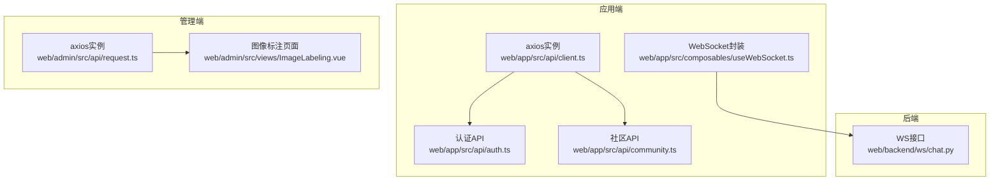
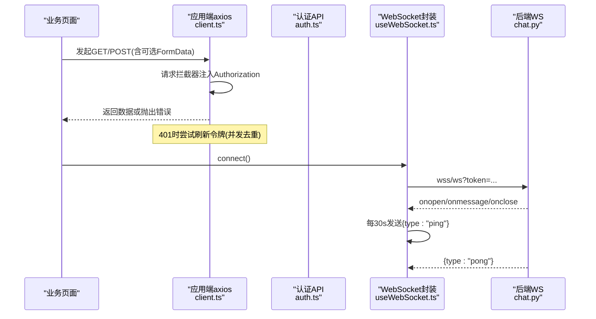
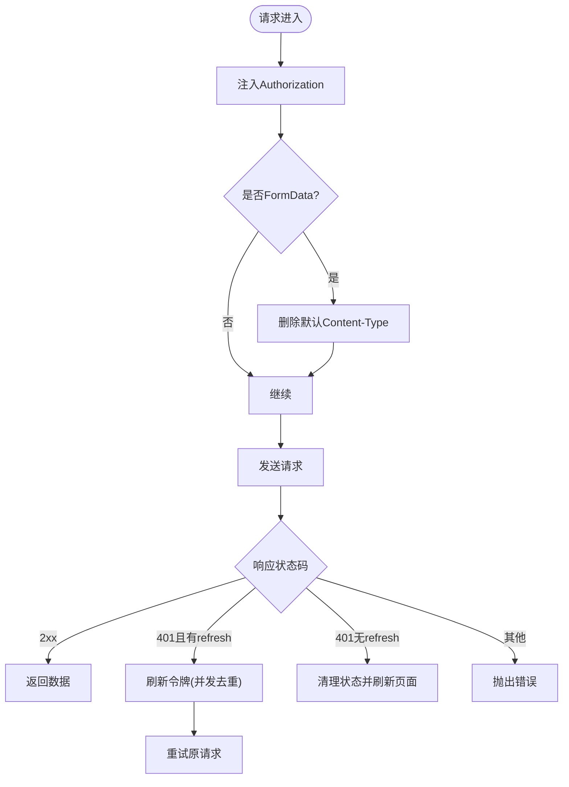
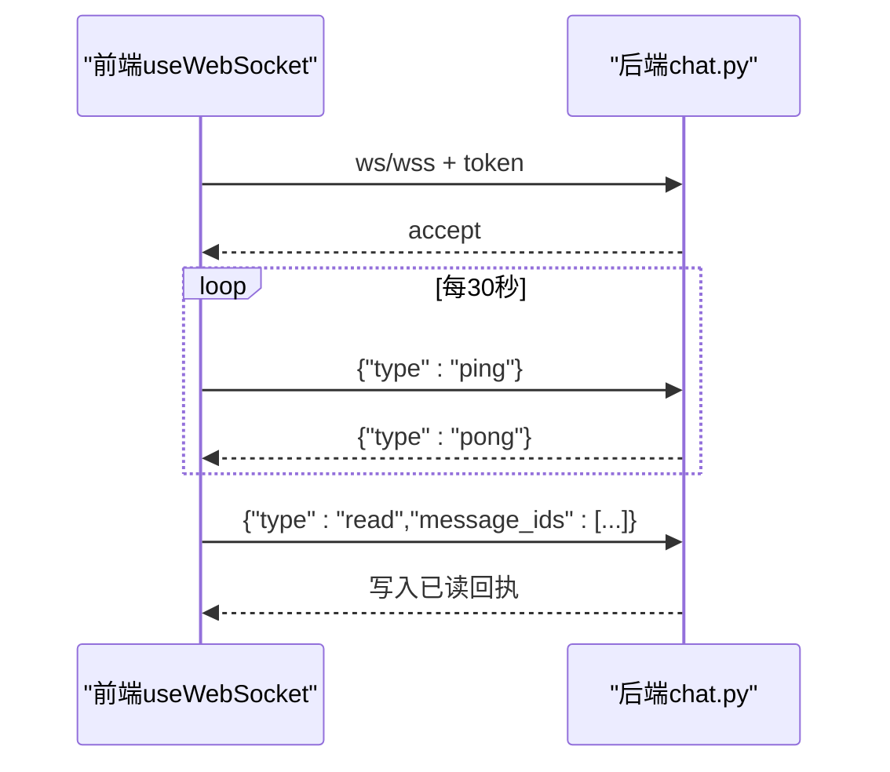
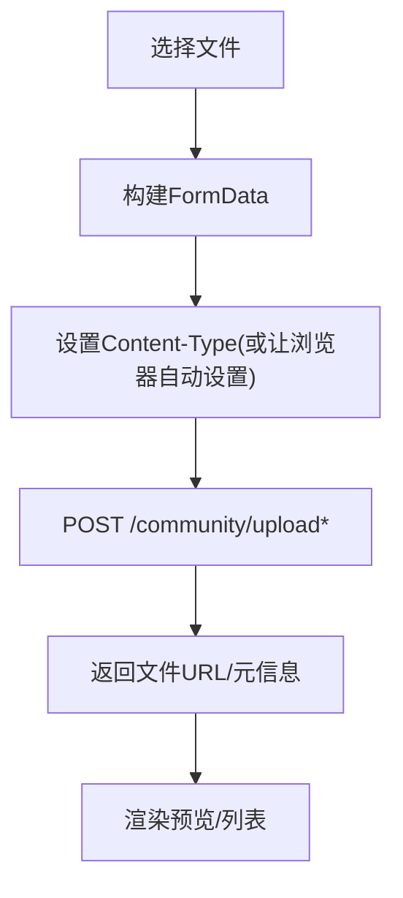
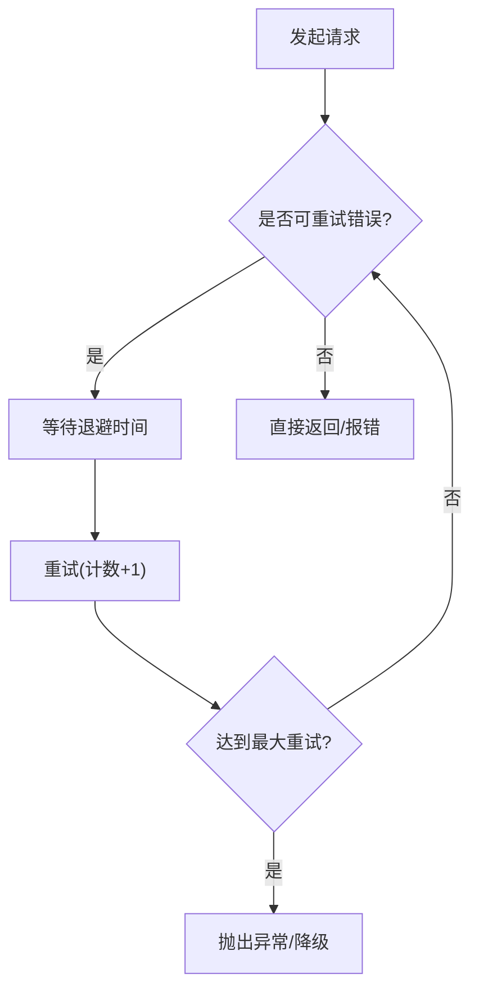
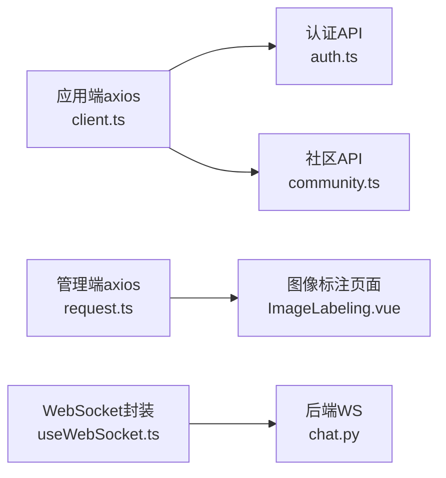

# API客户端封装

<cite>
**本文引用的文件**
- [web/app/src/api/client.ts](file://web/app/src/api/client.ts)
- [web/admin/src/api/request.ts](file://web/admin/src/api/request.ts)
- [web/app/src/composables/useWebSocket.ts](file://web/app/src/composables/useWebSocket.ts)
- [web/backend/ws/chat.py](file://web/backend/ws/chat.py)
- [web/app/src/api/auth.ts](file://web/app/src/api/auth.ts)
- [web/app/src/api/community.ts](file://web/app/src/api/community.ts)
- [web/admin/src/views/ImageLabeling.vue](file://web/admin/src/views/ImageLabeling.vue)
- [configs/crawler_config.yaml](file://configs/crawler_config.yaml)
- [src/crawlers/semantic_scholar_crawler.py](file://src/crawlers/semantic_scholar_crawler.py)
- [src/crawlers/pubmed_fulltext.py](file://src/crawlers/pubmed_fulltext.py)
- [tests/test_translator.py](file://tests/test_translator.py)
</cite>

## 目录
1. [简介](#简介)
2. [项目结构](#项目结构)
3. [核心组件](#核心组件)
4. [架构总览](#架构总览)
5. [详细组件分析](#详细组件分析)
6. [依赖关系分析](#依赖关系分析)
7. [性能与可靠性](#性能与可靠性)
8. [故障排查指南](#故障排查指南)
9. [结论](#结论)
10. [附录：调用示例与最佳实践](#附录调用示例与最佳实践)

## 简介
本文件面向Subskin前端（应用端与管理端）的API客户端封装，系统性说明HTTP请求封装、拦截器配置、错误处理机制；解释RESTful API调用模式、WebSocket连接管理、文件上传下载处理；并给出请求重试策略、缓存机制、超时控制、API版本管理、Mock数据支持、调试工具集成等工程化要点。文档同时提供可操作的调用示例与最佳实践，帮助开发者快速、稳定地对接后端服务。

## 项目结构
前端包含两套独立的Axios实例：
- 应用端：位于 web/app/src/api/client.ts，统一封装用户态请求、鉴权、刷新令牌、文件上传自动类型处理等。
- 管理端：位于 web/admin/src/api/request.ts，封装管理员态请求与基础错误处理。

实时通信通过 WebSocket 实现：
- 前端：web/app/src/composables/useWebSocket.ts，负责连接、心跳、重连、消息分发。
- 后端：web/backend/ws/chat.py，负责鉴权、连接管理、消息路由与已读回执。

文件上传在多处使用FormData并通过统一的axios实例发送：
- 应用端社区模块：web/app/src/api/community.ts
- 管理端图像标注：web/admin/src/views/ImageLabeling.vue

**图表来源**
- [web/app/src/api/client.ts:1-84](file://web/app/src/api/client.ts#L1-L84)
- [web/admin/src/api/request.ts:1-32](file://web/admin/src/api/request.ts#L1-L32)
- [web/app/src/composables/useWebSocket.ts:1-75](file://web/app/src/composables/useWebSocket.ts#L1-L75)
- [web/backend/ws/chat.py:1-111](file://web/backend/ws/chat.py#L1-L111)
- [web/app/src/api/auth.ts:1-195](file://web/app/src/api/auth.ts#L1-L195)
- [web/app/src/api/community.ts:1-284](file://web/app/src/api/community.ts#L1-L284)
- [web/admin/src/views/ImageLabeling.vue:367-413](file://web/admin/src/views/ImageLabeling.vue#L367-L413)

**章节来源**
- [web/app/src/api/client.ts:1-84](file://web/app/src/api/client.ts#L1-L84)
- [web/admin/src/api/request.ts:1-32](file://web/admin/src/api/request.ts#L1-L32)
- [web/app/src/composables/useWebSocket.ts:1-75](file://web/app/src/composables/useWebSocket.ts#L1-L75)
- [web/backend/ws/chat.py:1-111](file://web/backend/ws/chat.py#L1-L111)

## 核心组件
- HTTP客户端（应用端）
  - 基于Axios创建实例，设置baseURL与超时，统一注入Authorization头，自动处理FormData的Content-Type。
  - 响应拦截器实现401时刷新访问令牌，并发401去重，失败则清理本地状态并刷新页面。
- HTTP客户端（管理端）
  - 基于Axios创建实例，注入管理员令牌，401时清理本地令牌并拒绝错误。
- WebSocket客户端
  - 封装连接、心跳ping/pong、断线指数退避重连、按事件类型分发的消息处理器。
- WebSocket服务端
  - 基于FastAPI，校验token后建立连接，维护用户级连接表，处理ping/read事件，记录已读回执。

**章节来源**
- [web/app/src/api/client.ts:11-82](file://web/app/src/api/client.ts#L11-L82)
- [web/admin/src/api/request.ts:8-29](file://web/admin/src/api/request.ts#L8-L29)
- [web/app/src/composables/useWebSocket.ts:11-73](file://web/app/src/composables/useWebSocket.ts#L11-L73)
- [web/backend/ws/chat.py:14-111](file://web/backend/ws/chat.py#L14-L111)

## 架构总览
下图展示从业务模块到HTTP/WebSocket的完整调用链，包括鉴权、刷新令牌、文件上传与实时消息。

**图表来源**
- [web/app/src/api/client.ts:11-82](file://web/app/src/api/client.ts#L11-L82)
- [web/app/src/api/auth.ts:150-166](file://web/app/src/api/auth.ts#L150-L166)
- [web/app/src/composables/useWebSocket.ts:11-73](file://web/app/src/composables/useWebSocket.ts#L11-L73)
- [web/backend/ws/chat.py:45-111](file://web/backend/ws/chat.py#L45-L111)

## 详细组件分析

### HTTP客户端（应用端）
- 请求拦截器
  - 自动附加Bearer Token（从localStorage读取）。
  - 对FormData请求删除默认Content-Type，交由浏览器设置multipart/form-data边界。
- 响应拦截器
  - 捕获401：若存在refresh_token则调用刷新接口，成功后重试原请求；否则清理本地状态并刷新页面。
  - 并发401去重：使用单例Promise避免重复刷新。
- 超时与基地址
  - baseURL为/api，超时设置为较长值以适配AI预处理耗时场景。

**图表来源**
- [web/app/src/api/client.ts:11-82](file://web/app/src/api/client.ts#L11-L82)

**章节来源**
- [web/app/src/api/client.ts:1-84](file://web/app/src/api/client.ts#L1-L84)

### HTTP客户端（管理端）
- 请求拦截器：注入admin_token。
- 响应拦截器：401时移除本地令牌并拒绝错误，不自动跳转，由业务层感知登出状态。

**章节来源**
- [web/admin/src/api/request.ts:1-32](file://web/admin/src/api/request.ts#L1-L32)

### RESTful API调用模式
- 资源导向路径：如 /community/posts、/users/me、/user/credentials 等。
- 常用方法：GET查询、POST创建、PUT更新、DELETE删除。
- 分页与过滤：通过params传递limit/offset/after等参数。
- 典型模块：
  - 认证：登录、注册、绑定手机/邮箱、修改密码、获取当前用户、刷新令牌、登出、获取文件访问令牌。
  - 社区：帖子、评论、收藏、标签、关注/拉黑/举报、日历日记等。

**章节来源**
- [web/app/src/api/auth.ts:52-195](file://web/app/src/api/auth.ts#L52-L195)
- [web/app/src/api/community.ts:55-284](file://web/app/src/api/community.ts#L55-L284)

### WebSocket连接管理
- 前端封装
  - 根据协议选择ws/wss，附带token建立连接。
  - 连接成功开启心跳（每30秒发送ping），关闭时清理定时器。
  - 断线后按指数退避重连，最多固定次数。
  - 支持按事件类型订阅/取消订阅，以及通配符监听。
- 后端处理
  - 校验token，未授权直接关闭连接。
  - 维护active连接映射，支持向指定用户推送事件。
  - 处理read事件，写入已读记录。

**图表来源**
- [web/app/src/composables/useWebSocket.ts:11-73](file://web/app/src/composables/useWebSocket.ts#L11-L73)
- [web/backend/ws/chat.py:45-111](file://web/backend/ws/chat.py#L45-L111)

**章节来源**
- [web/app/src/composables/useWebSocket.ts:1-75](file://web/app/src/composables/useWebSocket.ts#L1-L75)
- [web/backend/ws/chat.py:1-111](file://web/backend/ws/chat.py#L1-L111)

### 文件上传与下载
- 上传
  - 使用FormData构造文件字段，显式设置multipart/form-data或通过axios自动检测。
  - 应用端社区模块提供图片/音频/通用文件上传接口。
  - 管理端图像标注批量上传，带进度回调与结果汇总。
- 下载
  - 通过短时效的文件访问令牌安全获取受保护文件，避免泄露长期令牌。

**图表来源**
- [web/app/src/api/community.ts:132-157](file://web/app/src/api/community.ts#L132-L157)
- [web/admin/src/views/ImageLabeling.vue:367-413](file://web/admin/src/views/ImageLabeling.vue#L367-L413)
- [web/app/src/api/auth.ts:160-166](file://web/app/src/api/auth.ts#L160-L166)

**章节来源**
- [web/app/src/api/community.ts:132-157](file://web/app/src/api/community.ts#L132-L157)
- [web/admin/src/views/ImageLabeling.vue:367-413](file://web/admin/src/views/ImageLabeling.vue#L367-L413)
- [web/app/src/api/auth.ts:160-166](file://web/app/src/api/auth.ts#L160-L166)

### 请求重试策略
- 前端HTTP层
  - 针对401进行令牌刷新后的单次重试。
- 后端/爬虫层参考
  - 爬取器采用指数退避重试，覆盖超时、连接错误、5xx/429等场景。
  - 翻译器测试用例验证了内部错误、限流、超时、连接错误的重试行为。
  - 配置文件集中定义最大重试次数、延迟与退避因子。

**图表来源**
- [configs/crawler_config.yaml:117-143](file://configs/crawler_config.yaml#L117-L143)
- [src/crawlers/semantic_scholar_crawler.py:114-153](file://src/crawlers/semantic_scholar_crawler.py#L114-L153)
- [src/crawlers/pubmed_fulltext.py:162-178](file://src/crawlers/pubmed_fulltext.py#L162-L178)
- [tests/test_translator.py:165-226](file://tests/test_translator.py#L165-L226)

**章节来源**
- [configs/crawler_config.yaml:117-143](file://configs/crawler_config.yaml#L117-L143)
- [src/crawlers/semantic_scholar_crawler.py:114-153](file://src/crawlers/semantic_scholar_crawler.py#L114-L153)
- [src/crawlers/pubmed_fulltext.py:162-178](file://src/crawlers/pubmed_fulltext.py#L162-L178)
- [tests/test_translator.py:165-226](file://tests/test_translator.py#L165-L226)

### 缓存机制
- 前端HTTP层未内置全局缓存，建议结合业务需求引入轻量缓存（如内存Map或IndexedDB）以减少重复请求。
- 后端/爬虫层具备缓存键生成与TTL策略，可用于参考设计。

**章节来源**
- [configs/crawler_config.yaml:117-143](file://configs/crawler_config.yaml#L117-L143)

### 超时控制
- 前端axios实例统一设置较长超时以适配AI预处理流程。
- 爬虫层配置连接与请求超时，保障稳定性。

**章节来源**
- [web/app/src/api/client.ts:3-9](file://web/app/src/api/client.ts#L3-L9)
- [web/admin/src/api/request.ts:3-6](file://web/admin/src/api/request.ts#L3-L6)
- [configs/crawler_config.yaml:124-126](file://configs/crawler_config.yaml#L124-L126)

### API版本管理
- 当前所有接口均以/api前缀聚合，便于未来演进至/v1、/v2等版本路径。
- 建议在网关或路由层增加版本路由与兼容性策略，逐步灰度升级。

[本节为概念性说明，无需代码引用]

### Mock数据支持
- 设计文档中提供了Mock服务的方案与开关，可通过环境变量启用模拟AI分析，便于前后端并行开发与联调。
- 前端可在开发环境切换真实/模拟后端，配合网络层拦截器返回预设数据。

**章节来源**
- [docs/design/risk-mitigation-plan.md:43-94](file://docs/design/risk-mitigation-plan.md#L43-L94)
- [docs/design/photo-upload-and-ai-kb-workflow.md:137-168](file://docs/design/photo-upload-and-ai-kb-workflow.md#L137-L168)

### 调试工具集成
- 浏览器开发者工具：Network面板查看请求/响应、Headers、Payload；Console查看日志；Application查看LocalStorage中的令牌。
- WebSocket面板：观察握手、ping/pong与业务消息。
- 建议：在开发环境开启更详细的日志输出，并在关键路径打印请求ID以便追踪。

[本节为通用指导，无需代码引用]

## 依赖关系分析
- 应用端axios实例被认证与社区等模块复用，形成稳定的HTTP基础设施。
- WebSocket封装独立于业务模块，通过事件分发解耦消息处理。
- 管理端axios实例与应用端相互独立，避免权限污染。

**图表来源**
- [web/app/src/api/client.ts:1-84](file://web/app/src/api/client.ts#L1-L84)
- [web/app/src/api/auth.ts:1-195](file://web/app/src/api/auth.ts#L1-L195)
- [web/app/src/api/community.ts:1-284](file://web/app/src/api/community.ts#L1-L284)
- [web/admin/src/api/request.ts:1-32](file://web/admin/src/api/request.ts#L1-L32)
- [web/admin/src/views/ImageLabeling.vue:367-413](file://web/admin/src/views/ImageLabeling.vue#L367-L413)
- [web/app/src/composables/useWebSocket.ts:1-75](file://web/app/src/composables/useWebSocket.ts#L1-L75)
- [web/backend/ws/chat.py:1-111](file://web/backend/ws/chat.py#L1-L111)

**章节来源**
- [web/app/src/api/client.ts:1-84](file://web/app/src/api/client.ts#L1-L84)
- [web/app/src/api/auth.ts:1-195](file://web/app/src/api/auth.ts#L1-L195)
- [web/app/src/api/community.ts:1-284](file://web/app/src/api/community.ts#L1-L284)
- [web/admin/src/api/request.ts:1-32](file://web/admin/src/api/request.ts#L1-L32)
- [web/admin/src/views/ImageLabeling.vue:367-413](file://web/admin/src/views/ImageLabeling.vue#L367-L413)
- [web/app/src/composables/useWebSocket.ts:1-75](file://web/app/src/composables/useWebSocket.ts#L1-L75)
- [web/backend/ws/chat.py:1-111](file://web/backend/ws/chat.py#L1-L111)

## 性能与可靠性
- 超时与长任务：前端axios设置较长超时以适配AI预处理；必要时可按接口粒度调整。
- 令牌刷新：并发401去重减少重复刷新，提升用户体验与后端压力。
- 文件上传：使用FormData与浏览器自动边界，避免422错误；管理端批量上传提供进度反馈。
- 重试与退避：参考爬虫层的指数退避策略，在需要时扩展前端重试逻辑（如网络抖动、临时5xx）。
- 缓存：建议对只读且变化频率低的列表数据引入短期缓存，降低带宽与服务器压力。

[本节为通用指导，无需代码引用]

## 故障排查指南
- 401未授权
  - 检查本地是否存在access_token与refresh_token。
  - 确认请求拦截器是否正确注入Authorization。
  - 若刷新失败，会清理本地状态并刷新页面。
- 文件上传422
  - 确保FormData请求不要手动设置application/json的Content-Type；让浏览器自动设置multipart/form-data。
- WebSocket断开
  - 检查onerror/onclose是否触发；确认心跳是否正常；确认后端是否因token无效关闭连接。
- 超时问题
  - 检查axios超时配置；对于AI相关接口适当延长超时。

**章节来源**
- [web/app/src/api/client.ts:44-82](file://web/app/src/api/client.ts#L44-L82)
- [web/admin/src/api/request.ts:19-29](file://web/admin/src/api/request.ts#L19-L29)
- [web/app/src/composables/useWebSocket.ts:44-53](file://web/app/src/composables/useWebSocket.ts#L44-L53)
- [web/backend/ws/chat.py:45-49](file://web/backend/ws/chat.py#L45-L49)

## 结论
Subskin的前端API客户端封装以Axios为核心，实现了统一的鉴权注入、401刷新与并发去重、FormData自动类型处理；WebSocket封装提供健壮的连接管理与心跳机制；文件上传通过标准FormData与进度回调提升体验。结合爬虫层的重试与超时配置，整体具备良好的稳定性与可扩展性。建议在后续迭代中完善前端缓存、统一错误上报与监控指标，进一步提升可用性。

[本节为总结性内容，无需代码引用]

## 附录：调用示例与最佳实践
- 登录与令牌管理
  - 使用认证API完成登录/注册/绑定等操作，返回access_token与refresh_token。
  - 刷新令牌：当收到401且存在refresh_token时，调用刷新接口并保存新令牌。
  - 文件访问令牌：通过专用接口获取短时效令牌用于受保护文件下载。
- 社区数据操作
  - 获取帖子、评论、标签、收藏等列表与详情，使用params进行分页与过滤。
  - 上传图片/音频/文件：使用FormData并正确设置Content-Type。
- 管理端批量上传
  - 构建多个文件的FormData，利用onUploadProgress显示进度，处理返回的统计与错误信息。
- WebSocket使用
  - 连接时携带token；订阅感兴趣的事件类型；保持心跳；断线自动重连。
- 最佳实践
  - 统一错误处理：在业务层捕获并提示用户，避免裸抛错。
  - 合理超时：对AI相关接口设置更长超时；普通接口保持合理阈值。
  - 重试策略：对幂等GET请求可考虑有限重试；写操作谨慎重试。
  - 缓存策略：对热点只读数据采用短期缓存，注意失效与一致性。
  - 安全：仅将必要信息存入本地存储；使用短时效令牌访问敏感资源。

**章节来源**
- [web/app/src/api/auth.ts:52-195](file://web/app/src/api/auth.ts#L52-L195)
- [web/app/src/api/community.ts:55-284](file://web/app/src/api/community.ts#L55-L284)
- [web/admin/src/views/ImageLabeling.vue:367-413](file://web/admin/src/views/ImageLabeling.vue#L367-L413)
- [web/app/src/composables/useWebSocket.ts:11-73](file://web/app/src/composables/useWebSocket.ts#L11-L73)