# 前端架构设计

<cite>
**本文引用的文件**
- [web/app/package.json](file://web/app/package.json)
- [web/admin/package.json](file://web/admin/package.json)
- [web/app/vite.config.ts](file://web/app/vite.config.ts)
- [web/admin/vite.config.ts](file://web/admin/vite.config.ts)
- [web/app/src/main.ts](file://web/app/src/main.ts)
- [web/admin/src/main.ts](file://web/admin/src/main.ts)
- [web/app/src/App.vue](file://web/app/src/App.vue)
- [web/admin/src/App.vue](file://web/admin/src/App.vue)
- [web/app/src/router/index.ts](file://web/app/src/router/index.ts)
- [web/admin/src/router/index.ts](file://web/admin/src/router/index.ts)
- [web/app/src/stores/auth.ts](file://web/app/src/stores/auth.ts)
- [web/admin/src/stores/auth.ts](file://web/admin/src/stores/auth.ts)
- [web/app/src/api/client.ts](file://web/app/src/api/client.ts)
- [web/admin/src/api/request.ts](file://web/admin/src/api/request.ts)
- [web/app/tailwind.config.ts](file://web/app/tailwind.config.ts)
</cite>

## 目录
1. [简介](#简介)
2. [项目结构](#项目结构)
3. [核心组件](#核心组件)
4. [架构总览](#架构总览)
5. [详细组件分析](#详细组件分析)
6. [依赖关系分析](#依赖关系分析)
7. [性能考虑](#性能考虑)
8. [故障排查指南](#故障排查指南)
9. [结论](#结论)
10. [附录](#附录)

## 简介
本文件为 Subskin 前端架构设计文档，覆盖用户应用（web/app）与管理后台（web/admin）两端的 Vue 3 + TypeScript 工程。内容涵盖：应用结构与职责划分、组件设计规范、状态管理（Pinia）架构、路由配置策略、PWA 特性实现、响应式与移动端适配方案、构建流程与代码分割策略、性能优化措施、前后端 API 客户端封装模式，以及共享能力与差异点说明。

## 项目结构
Subskin 前端采用双应用结构：
- web/app：面向终端用户的移动优先 Web 应用，使用 Vite + Vue 3 + TypeScript + Pinia + TailwindCSS，集成 PWA、微信分享、富文本编辑器等能力。
- web/admin：面向运营/管理员的后台管理 SPA，基于 Vite + Vue 3 + TypeScript + Pinia + Naive UI，提供数据看板、内容审核、训练监控等功能。

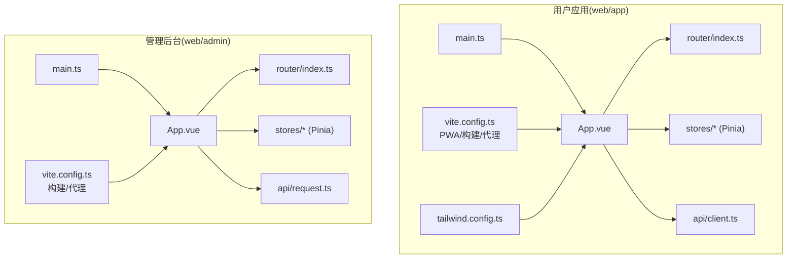

图表来源
- [web/app/src/main.ts:1-11](file://web/app/src/main.ts#L1-L11)
- [web/app/src/App.vue:1-117](file://web/app/src/App.vue#L1-L117)
- [web/app/src/router/index.ts:1-155](file://web/app/src/router/index.ts#L1-L155)
- [web/app/src/stores/auth.ts:1-259](file://web/app/src/stores/auth.ts#L1-L259)
- [web/app/src/api/client.ts:1-84](file://web/app/src/api/client.ts#L1-L84)
- [web/app/vite.config.ts:1-110](file://web/app/vite.config.ts#L1-L110)
- [web/app/tailwind.config.ts:1-63](file://web/app/tailwind.config.ts#L1-L63)
- [web/admin/src/main.ts:1-14](file://web/admin/src/main.ts#L1-L14)
- [web/admin/src/App.vue:1-23](file://web/admin/src/App.vue#L1-L23)
- [web/admin/src/router/index.ts:1-84](file://web/admin/src/router/index.ts#L1-L84)
- [web/admin/src/stores/auth.ts:1-59](file://web/admin/src/stores/auth.ts#L1-L59)
- [web/admin/src/api/request.ts:1-32](file://web/admin/src/api/request.ts#L1-L32)
- [web/admin/vite.config.ts:1-27](file://web/admin/vite.config.ts#L1-L27)

章节来源
- [web/app/package.json:1-55](file://web/app/package.json#L1-L55)
- [web/admin/package.json:1-30](file://web/admin/package.json#L1-L30)

## 核心组件
- 应用入口与装配
  - 用户应用：在 main.ts 中创建 Vue 应用，挂载 Pinia、Router，并引入全局样式与图标字体；App.vue 负责头部、主内容区、底部导航、PWA 提示、登录弹窗与全局事件监听。
  - 管理后台：在 main.ts 中创建应用，挂载 Pinia、Router 与 Naive UI 主题；App.vue 通过 ConfigProvider 统一主题与消息/对话框上下文。

- 路由策略
  - 用户应用：History 模式，按功能域组织路由（评估、社区、日记、百科、个人中心、消息等），使用懒加载与 keep-alive 缓存关键页面，并在 afterEach 中触发埋点上报。
  - 管理后台：Hash 模式，集中式 Layout 布局下包含多个子路由（仪表盘、用户管理、内容生成、图像标注、训练看板、系统监控等），并通过 beforeEach 进行管理员鉴权守卫。

- 状态管理（Pinia）
  - 用户应用 auth store：维护 token、refreshToken、用户信息与会话持久化；支持多种登录方式、刷新令牌、登出清理、文件访问短令牌自动刷新；错误时尝试刷新或跳转。
  - 管理后台 auth store：维护 admin_token 与用户信息，登录后校验 is_admin，失败则拒绝并清理本地状态。

- API 客户端封装
  - 用户应用：axios 实例统一 baseURL、超时、请求拦截器注入 Authorization、FormData 自动识别；响应拦截器处理 401 并发刷新去重、刷新失败清理并刷新页面。
  - 管理后台：轻量 axios 实例，请求头注入 admin_token，401 仅清理本地 token，不自动跳转，交由业务侧感知。

章节来源
- [web/app/src/main.ts:1-11](file://web/app/src/main.ts#L1-L11)
- [web/app/src/App.vue:1-117](file://web/app/src/App.vue#L1-L117)
- [web/admin/src/main.ts:1-14](file://web/admin/src/main.ts#L1-L14)
- [web/admin/src/App.vue:1-23](file://web/admin/src/App.vue#L1-L23)
- [web/app/src/router/index.ts:1-155](file://web/app/src/router/index.ts#L1-L155)
- [web/admin/src/router/index.ts:1-84](file://web/admin/src/router/index.ts#L1-L84)
- [web/app/src/stores/auth.ts:1-259](file://web/app/src/stores/auth.ts#L1-L259)
- [web/admin/src/stores/auth.ts:1-59](file://web/admin/src/stores/auth.ts#L1-L59)
- [web/app/src/api/client.ts:1-84](file://web/app/src/api/client.ts#L1-L84)
- [web/admin/src/api/request.ts:1-32](file://web/admin/src/api/request.ts#L1-L32)

## 架构总览
下图展示用户应用从入口到视图、状态、网络层的调用链路与 PWA 插件参与点。

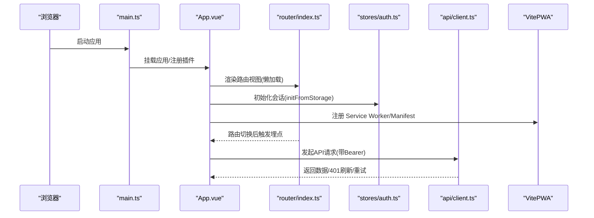

图表来源
- [web/app/src/main.ts:1-11](file://web/app/src/main.ts#L1-L11)
- [web/app/src/App.vue:1-117](file://web/app/src/App.vue#L1-L117)
- [web/app/src/router/index.ts:1-155](file://web/app/src/router/index.ts#L1-L155)
- [web/app/src/stores/auth.ts:1-259](file://web/app/src/stores/auth.ts#L1-L259)
- [web/app/src/api/client.ts:1-84](file://web/app/src/api/client.ts#L1-L84)
- [web/app/vite.config.ts:1-110](file://web/app/vite.config.ts#L1-L110)

## 详细组件分析

### 路由与导航
- 用户应用
  - 使用 History 模式，按模块划分路由，大量使用动态导入实现代码分割。
  - 对部分高频页面使用 keep-alive 提升体验。
  - 路由切换后执行埋点上报。
- 管理后台
  - 使用 Hash 模式，集中式 Layout 包裹所有子路由。
  - 通过 beforeEach 进行管理员权限校验，非管理员强制跳转到登录页。

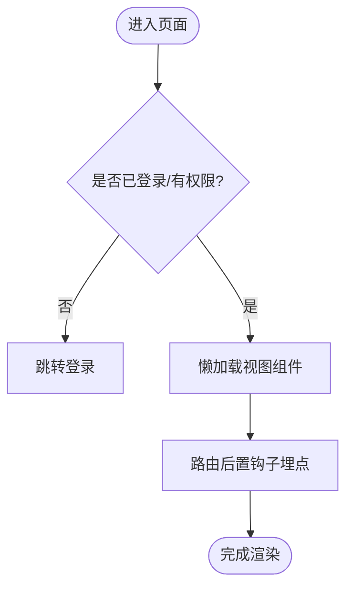

图表来源
- [web/app/src/router/index.ts:1-155](file://web/app/src/router/index.ts#L1-L155)
- [web/admin/src/router/index.ts:1-84](file://web/admin/src/router/index.ts#L1-L84)

章节来源
- [web/app/src/router/index.ts:1-155](file://web/app/src/router/index.ts#L1-L155)
- [web/admin/src/router/index.ts:1-84](file://web/admin/src/router/index.ts#L1-L84)

### 状态管理（Pinia）
- 用户应用认证 Store
  - 维护 token、refreshToken、用户信息与会话持久化。
  - 支持多方式登录、刷新令牌、登出清理、文件访问短令牌定时刷新。
  - 401 场景下尝试刷新，失败则清理并引导重新登录。
- 管理后台认证 Store
  - 维护 admin_token 与用户信息，登录成功后校验 is_admin。
  - 401 仅清理本地 token，不自动跳转。

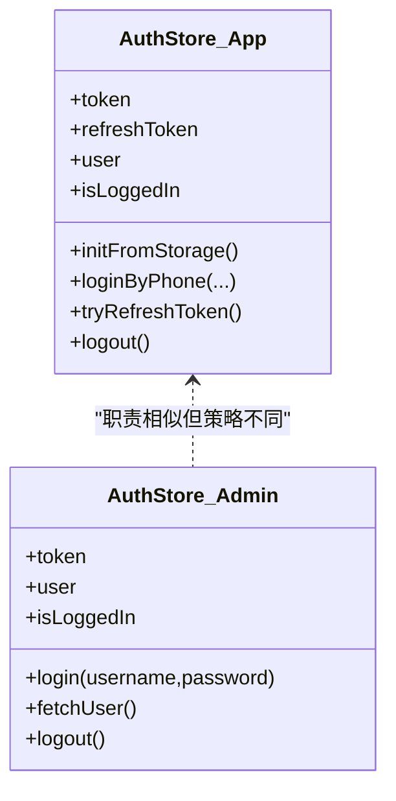

图表来源
- [web/app/src/stores/auth.ts:1-259](file://web/app/src/stores/auth.ts#L1-L259)
- [web/admin/src/stores/auth.ts:1-59](file://web/admin/src/stores/auth.ts#L1-L59)

章节来源
- [web/app/src/stores/auth.ts:1-259](file://web/app/src/stores/auth.ts#L1-L259)
- [web/admin/src/stores/auth.ts:1-59](file://web/admin/src/stores/auth.ts#L1-L59)

### API 客户端封装
- 用户应用
  - 统一 baseURL、超时、请求头注入 Authorization。
  - FormData 上传时自动移除 Content-Type 以让浏览器设置 boundary。
  - 401 时并发安全地刷新 access token，失败则清理本地状态并刷新页面。
- 管理后台
  - 统一 baseURL、超时、请求头注入 admin_token。
  - 401 仅清理本地 token，由业务侧处理后续逻辑。

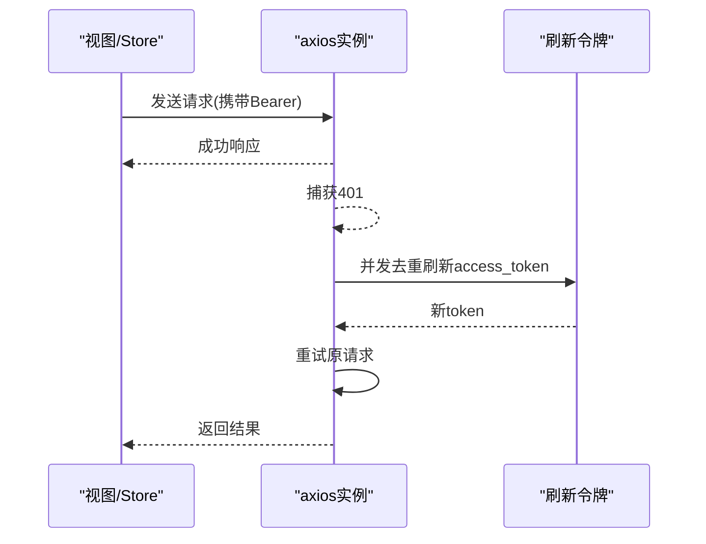

图表来源
- [web/app/src/api/client.ts:1-84](file://web/app/src/api/client.ts#L1-L84)
- [web/admin/src/api/request.ts:1-32](file://web/admin/src/api/request.ts#L1-L32)

章节来源
- [web/app/src/api/client.ts:1-84](file://web/app/src/api/client.ts#L1-L84)
- [web/admin/src/api/request.ts:1-32](file://web/admin/src/api/request.ts#L1-L32)

### PWA 特性实现
- 通过 VitePWA 插件启用 Manifest、Service Worker、资源缓存策略。
- 配置多尺寸图标、主题色、显示模式、方向、作用域与启动页。
- 针对敏感路径（/api、/uploads、version.json）使用 NetworkOnly 避免缓存泄露。
- 限制可缓存文件大小，排除 wiki-content 等特定路径的导航回退。

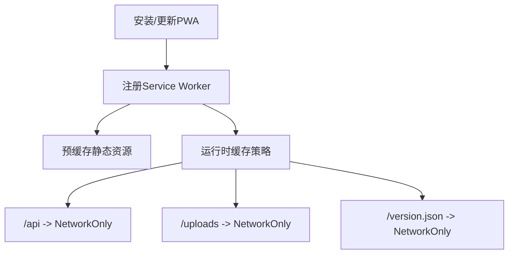

图表来源
- [web/app/vite.config.ts:1-110](file://web/app/vite.config.ts#L1-L110)

章节来源
- [web/app/vite.config.ts:1-110](file://web/app/vite.config.ts#L1-L110)

### 响应式设计与移动端适配
- 使用 TailwindCSS 构建响应式界面，定义品牌色板、字体与圆角扩展。
- App.vue 中根据设备 UA 注入 iOS 标记，便于差异化样式处理。
- 底部安全区域适配（env(safe-area-inset-bottom)）与媒体查询控制主内容区内边距。
- 底部导航与顶部栏构成移动端典型布局骨架。

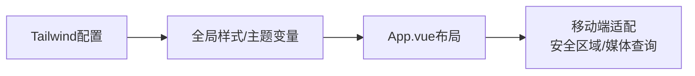

图表来源
- [web/app/tailwind.config.ts:1-63](file://web/app/tailwind.config.ts#L1-L63)
- [web/app/src/App.vue:1-117](file://web/app/src/App.vue#L1-L117)

章节来源
- [web/app/tailwind.config.ts:1-63](file://web/app/tailwind.config.ts#L1-L63)
- [web/app/src/App.vue:1-117](file://web/app/src/App.vue#L1-L117)

### 构建流程与代码分割
- 开发环境
  - 用户应用：Vite 开发服务器端口 5174，代理 /api 与 /uploads 至后端。
  - 管理后台：Vite 开发服务器端口 5174，代理 /api 至后端。
- 生产构建
  - 用户应用：输出至指定目录，生成 version.json 用于版本对比；启用 PWA 插件；按需分包与懒加载。
  - 管理后台：输出至指定目录，无 PWA。
- 脚本
  - 用户应用提供 dev/build/deploy:prod/preview/type-check 等脚本。
  - 管理后台提供 dev/build/preview 脚本。

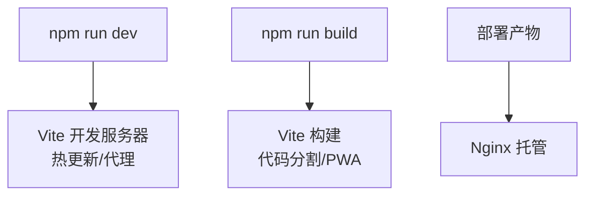

图表来源
- [web/app/package.json:1-55](file://web/app/package.json#L1-L55)
- [web/admin/package.json:1-30](file://web/admin/package.json#L1-L30)
- [web/app/vite.config.ts:1-110](file://web/app/vite.config.ts#L1-L110)
- [web/admin/vite.config.ts:1-27](file://web/admin/vite.config.ts#L1-L27)

章节来源
- [web/app/package.json:1-55](file://web/app/package.json#L1-L55)
- [web/admin/package.json:1-30](file://web/admin/package.json#L1-L30)
- [web/app/vite.config.ts:1-110](file://web/app/vite.config.ts#L1-L110)
- [web/admin/vite.config.ts:1-27](file://web/admin/vite.config.ts#L1-L27)

## 依赖关系分析
- 技术栈
  - 用户应用：Vue 3、Vue Router、Pinia、Axios、Vite、TypeScript、TailwindCSS、VitePWA、ECharts、TipTap、WeChat SDK、Workbox。
  - 管理后台：Vue 3、Vue Router、Pinia、Axios、Vite、TypeScript、Naive UI、TailwindCSS。
- 模块耦合
  - App.vue 聚合布局与全局能力（PWA、Toast、登录弹窗、埋点）。
  - Router 与 Stores 解耦，通过 Pinia 暴露方法供视图与路由钩子调用。
  - API 客户端独立于业务模块，被各 Store/视图按需引用。

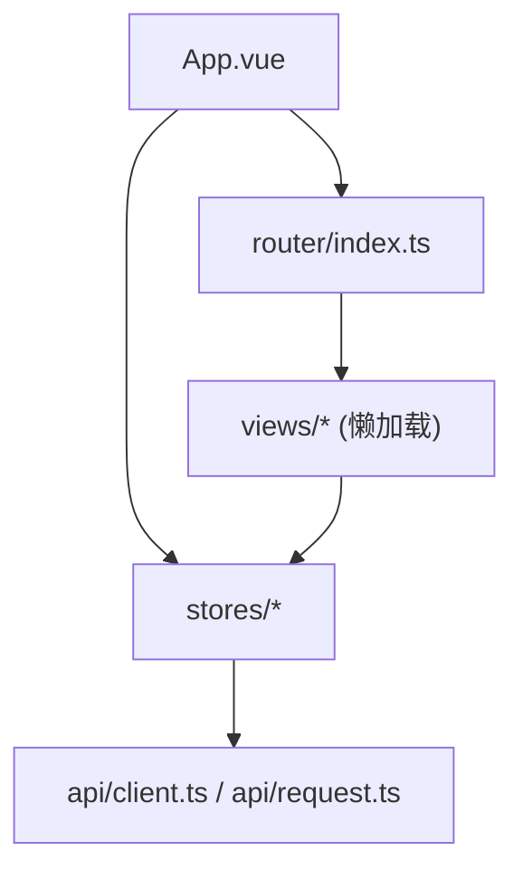

图表来源
- [web/app/src/App.vue:1-117](file://web/app/src/App.vue#L1-L117)
- [web/app/src/router/index.ts:1-155](file://web/app/src/router/index.ts#L1-L155)
- [web/app/src/stores/auth.ts:1-259](file://web/app/src/stores/auth.ts#L1-L259)
- [web/app/src/api/client.ts:1-84](file://web/app/src/api/client.ts#L1-L84)
- [web/admin/src/router/index.ts:1-84](file://web/admin/src/router/index.ts#L1-L84)
- [web/admin/src/stores/auth.ts:1-59](file://web/admin/src/stores/auth.ts#L1-L59)
- [web/admin/src/api/request.ts:1-32](file://web/admin/src/api/request.ts#L1-L32)

章节来源
- [web/app/package.json:1-55](file://web/app/package.json#L1-L55)
- [web/admin/package.json:1-30](file://web/admin/package.json#L1-L30)

## 性能考虑
- 代码分割与懒加载
  - 路由级懒加载减少首屏体积，按需加载页面组件。
- 缓存策略
  - PWA 预缓存静态资源，运行时对 API 与上传路径使用 NetworkOnly，避免敏感数据缓存。
  - 限制最大缓存文件大小，防止大资源拖慢安装与更新。
- 网络层优化
  - 统一超时与并发刷新去重，降低重复刷新带来的抖动。
  - 表单上传自动识别 FormData，避免额外开销。
- 渲染优化
  - 关键页面使用 keep-alive 缓存，减少重复渲染。
  - 标题与元信息按路由动态更新，利于 SEO 与分享。
- 构建优化
  - 使用 Vite 快速构建与 HMR；生产构建输出至固定目录，配合 Nginx 部署。

[本节为通用指导，不直接分析具体文件]

## 故障排查指南
- 401 未授权
  - 用户应用：检查是否存在 refresh_token；若缺失则清理本地状态并刷新页面；若存在则尝试刷新 access_token 并重试请求。
  - 管理后台：401 会清理 admin_token，需重新登录。
- 文件上传失败
  - 确认请求体为 FormData，且未手动设置 Content-Type，交由浏览器设置 boundary。
- PWA 缓存问题
  - 确认敏感路径（/api、/uploads、/version.json）未被缓存；必要时清除浏览器缓存与服务工作者缓存。
- 路由跳转异常
  - 管理后台：确保已通过 beforeEach 守卫；非管理员将被重定向到登录页。
  - 用户应用：检查路由 meta 与懒加载路径是否正确。

章节来源
- [web/app/src/api/client.ts:1-84](file://web/app/src/api/client.ts#L1-L84)
- [web/admin/src/api/request.ts:1-32](file://web/admin/src/api/request.ts#L1-L32)
- [web/app/vite.config.ts:1-110](file://web/app/vite.config.ts#L1-L110)
- [web/admin/src/router/index.ts:1-84](file://web/admin/src/router/index.ts#L1-L84)

## 结论
Subskin 前端采用清晰的双应用架构：用户应用聚焦移动端体验与 PWA 能力，管理后台聚焦运营效率与权限管控。通过 Pinia 统一管理状态、Axios 封装统一网络层、VitePWA 保障离线与缓存策略、TailwindCSS 实现响应式与主题体系，整体具备良好的可维护性与扩展性。建议在后续迭代中继续强化组件库抽象、接口契约与测试覆盖，进一步提升稳定性与交付效率。

## 附录
- 目录结构图（概念示意）
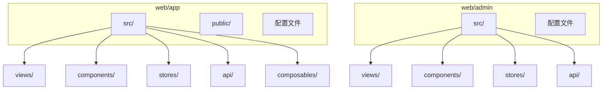

- 组件层次图（概念示意）
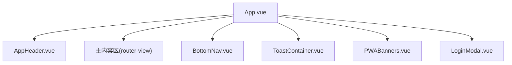

[以上为概念性图示，不映射具体源码文件]