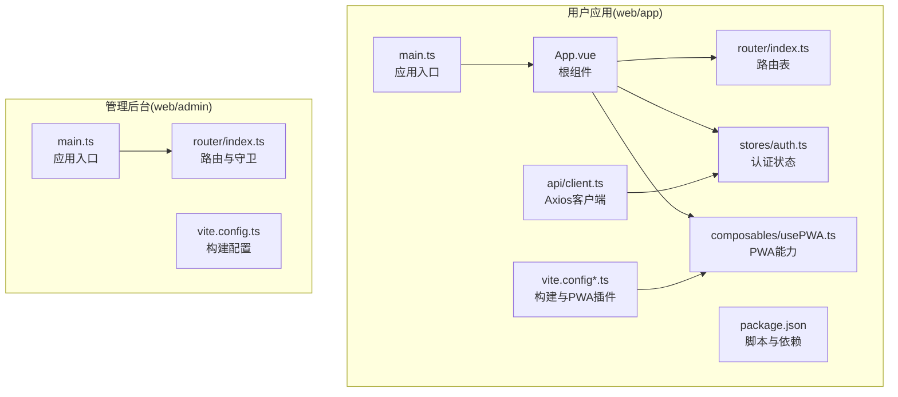
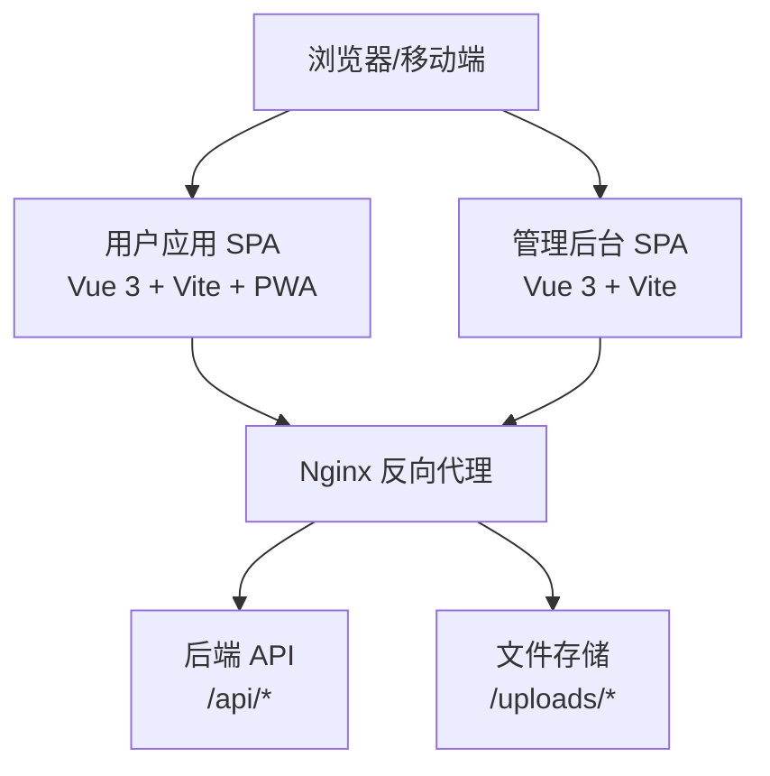
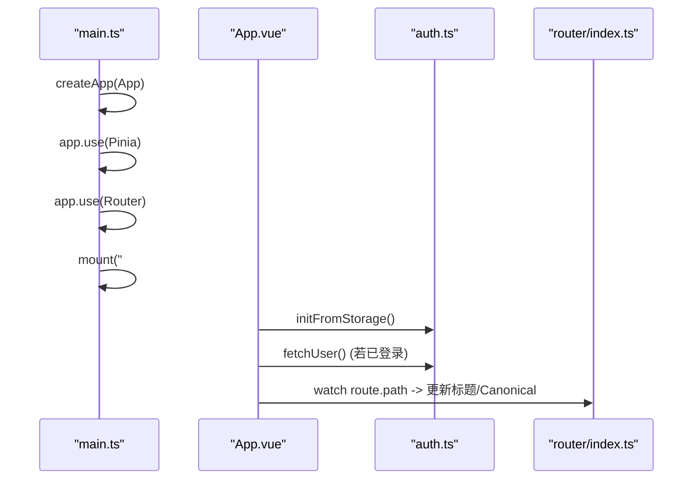
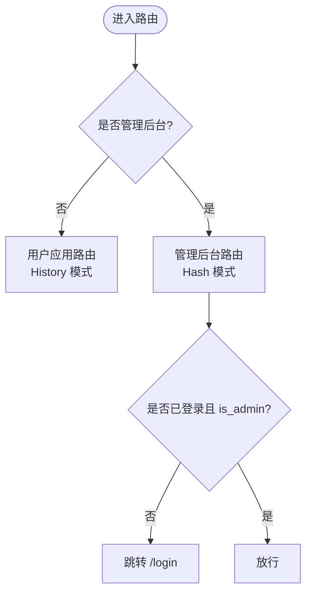
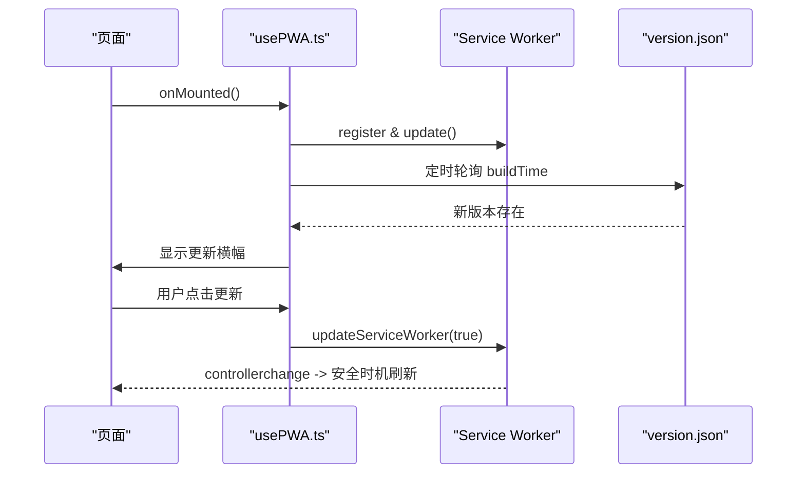
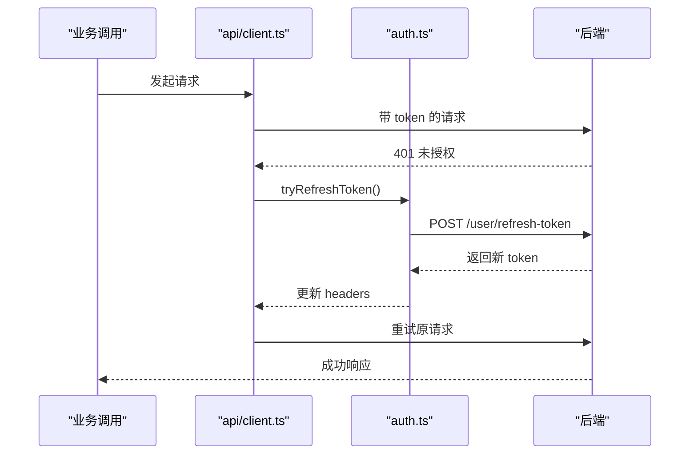
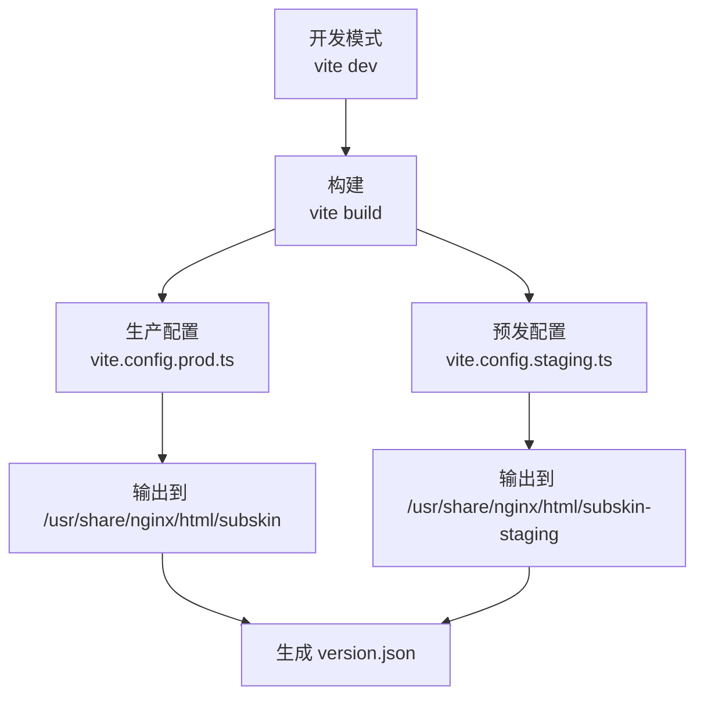
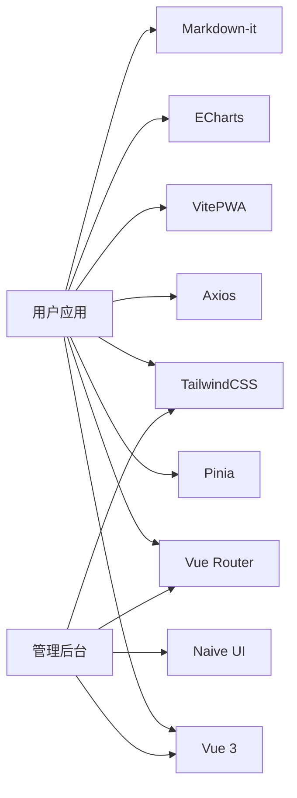

# 应用架构设计

<cite>
**本文引用的文件**   
- [web/app/src/main.ts](file://web/app/src/main.ts)
- [web/app/src/App.vue](file://web/app/src/App.vue)
- [web/app/src/router/index.ts](file://web/app/src/router/index.ts)
- [web/app/src/api/client.ts](file://web/app/src/api/client.ts)
- [web/app/src/stores/auth.ts](file://web/app/src/stores/auth.ts)
- [web/app/src/composables/usePWA.ts](file://web/app/src/composables/usePWA.ts)
- [web/app/vite.config.ts](file://web/app/vite.config.ts)
- [web/app/vite.config.prod.ts](file://web/app/vite.config.prod.ts)
- [web/app/vite.config.staging.ts](file://web/app/vite.config.staging.ts)
- [web/app/package.json](file://web/app/package.json)
- [web/admin/src/main.ts](file://web/admin/src/main.ts)
- [web/admin/src/router/index.ts](file://web/admin/src/router/index.ts)
- [web/admin/vite.config.ts](file://web/admin/vite.config.ts)
</cite>

## 目录
1. [简介](#简介)
2. [项目结构](#项目结构)
3. [核心组件](#核心组件)
4. [架构总览](#架构总览)
5. [详细组件分析](#详细组件分析)
6. [依赖关系分析](#依赖关系分析)
7. [性能考量](#性能考量)
8. [故障排查指南](#故障排查指南)
9. [结论](#结论)
10. [附录](#附录)

## 简介
本文件为 Subskin 前端应用的架构设计文档，聚焦 Vue 3 + TypeScript 的初始化流程、启动配置、全局依赖注入机制；对比用户应用与管理后台的架构差异与共享模块设计；阐述 PWA 特性、Service Worker 集成与离线缓存策略；说明前端构建流程、Vite 配置优化与代码分割策略。文末提供应用架构图与模块依赖关系图，帮助读者快速理解系统结构与关键路径。

## 项目结构
Subskin 前端包含两个独立的应用：
- web/app：面向用户的移动端/响应式应用（Vue 3 + Vite + Pinia + Vue Router + TailwindCSS + PWA）
- web/admin：管理后台（Vue 3 + Vite + Naive UI + TailwindCSS）

两者均使用独立的 Vite 配置与构建产物输出目录，通过 Nginx 反向代理到后端 API。

图表来源 
- [web/app/src/main.ts:1-11](file://web/app/src/main.ts#L1-L11)
- [web/app/src/App.vue:1-117](file://web/app/src/App.vue#L1-L117)
- [web/app/src/router/index.ts:1-155](file://web/app/src/router/index.ts#L1-L155)
- [web/app/src/api/client.ts:1-84](file://web/app/src/api/client.ts#L1-L84)
- [web/app/src/stores/auth.ts:1-259](file://web/app/src/stores/auth.ts#L1-L259)
- [web/app/src/composables/usePWA.ts:1-441](file://web/app/src/composables/usePWA.ts#L1-L441)
- [web/app/vite.config.ts:1-110](file://web/app/vite.config.ts#L1-L110)
- [web/app/vite.config.prod.ts:1-98](file://web/app/vite.config.prod.ts#L1-L98)
- [web/app/vite.config.staging.ts:1-110](file://web/app/vite.config.staging.ts#L1-L110)
- [web/app/package.json:1-55](file://web/app/package.json#L1-L55)
- [web/admin/src/main.ts:1-14](file://web/admin/src/main.ts#L1-L14)
- [web/admin/src/router/index.ts:1-84](file://web/admin/src/router/index.ts#L1-L84)
- [web/admin/vite.config.ts:1-27](file://web/admin/vite.config.ts#L1-L27)

章节来源
- [web/app/src/main.ts:1-11](file://web/app/src/main.ts#L1-L11)
- [web/app/src/App.vue:1-117](file://web/app/src/App.vue#L1-L117)
- [web/app/src/router/index.ts:1-155](file://web/app/src/router/index.ts#L1-L155)
- [web/app/src/api/client.ts:1-84](file://web/app/src/api/client.ts#L1-L84)
- [web/app/src/stores/auth.ts:1-259](file://web/app/src/stores/auth.ts#L1-L259)
- [web/app/src/composables/usePWA.ts:1-441](file://web/app/src/composables/usePWA.ts#L1-L441)
- [web/app/vite.config.ts:1-110](file://web/app/vite.config.ts#L1-L110)
- [web/app/vite.config.prod.ts:1-98](file://web/app/vite.config.prod.ts#L1-L98)
- [web/app/vite.config.staging.ts:1-110](file://web/app/vite.config.staging.ts#L1-L110)
- [web/app/package.json:1-55](file://web/app/package.json#L1-L55)
- [web/admin/src/main.ts:1-14](file://web/admin/src/main.ts#L1-L14)
- [web/admin/src/router/index.ts:1-84](file://web/admin/src/router/index.ts#L1-L84)
- [web/admin/vite.config.ts:1-27](file://web/admin/vite.config.ts#L1-L27)

## 核心组件
- 应用入口与挂载：创建 Vue 应用实例，注册 Pinia、Router，挂载根组件与样式资源。
- 根组件 App.vue：统一布局、动态标题与 canonical、全局点击埋点、PWA 提示与 Toast、登录弹窗等。
- 路由：基于 vue-router 的动态导入与懒加载，滚动行为与页面埋点。
- 网络层：Axios 单例封装，自动携带 Token、上传时正确设置 Content-Type、401 刷新令牌并发去重。
- 状态管理：Pinia store 管理认证态、用户信息、本地持久化、文件访问令牌刷新。
- PWA：usePWA composable 封装 Service Worker 更新、安装引导、离线检测、版本轮询与提示。
- 构建与插件：Vite 多环境配置，VitePWA 生成 manifest 与 Workbox 运行时缓存策略，版本 JSON 生成。

章节来源
- [web/app/src/main.ts:1-11](file://web/app/src/main.ts#L1-L11)
- [web/app/src/App.vue:1-117](file://web/app/src/App.vue#L1-L117)
- [web/app/src/router/index.ts:1-155](file://web/app/src/router/index.ts#L1-L155)
- [web/app/src/api/client.ts:1-84](file://web/app/src/api/client.ts#L1-L84)
- [web/app/src/stores/auth.ts:1-259](file://web/app/src/stores/auth.ts#L1-L259)
- [web/app/src/composables/usePWA.ts:1-441](file://web/app/src/composables/usePWA.ts#L1-L441)
- [web/app/vite.config.ts:1-110](file://web/app/vite.config.ts#L1-L110)
- [web/app/vite.config.prod.ts:1-98](file://web/app/vite.config.prod.ts#L1-L98)
- [web/app/vite.config.staging.ts:1-110](file://web/app/vite.config.staging.ts#L1-L110)

## 架构总览
下图展示用户应用与管理后台的整体架构及与后端的交互关系。

图表来源 
- [web/app/vite.config.ts:96-108](file://web/app/vite.config.ts#L96-L108)
- [web/admin/vite.config.ts:17-25](file://web/admin/vite.config.ts#L17-L25)

章节来源
- [web/app/vite.config.ts:96-108](file://web/app/vite.config.ts#L96-L108)
- [web/admin/vite.config.ts:17-25](file://web/admin/vite.config.ts#L17-L25)

## 详细组件分析

### 应用初始化与依赖注入
- 入口 main.ts：创建 Vue 应用，注册 Pinia 与 Router，挂载根组件与全局样式。
- App.vue：在 onMounted 中初始化主题、滑动导航、微信分享、从本地恢复认证态并拉取用户信息；监听 PWA 安装事件；根据路由动态设置 title 与 canonical。
- 依赖注入：Pinia 作为全局状态容器，Router 负责视图切换，axios 拦截器统一处理鉴权与错误。

图表来源 
- [web/app/src/main.ts:1-11](file://web/app/src/main.ts#L1-L11)
- [web/app/src/App.vue:1-117](file://web/app/src/App.vue#L1-L117)
- [web/app/src/stores/auth.ts:1-259](file://web/app/src/stores/auth.ts#L1-L259)
- [web/app/src/router/index.ts:1-155](file://web/app/src/router/index.ts#L1-L155)

章节来源
- [web/app/src/main.ts:1-11](file://web/app/src/main.ts#L1-L11)
- [web/app/src/App.vue:1-117](file://web/app/src/App.vue#L1-L117)
- [web/app/src/stores/auth.ts:1-259](file://web/app/src/stores/auth.ts#L1-L259)
- [web/app/src/router/index.ts:1-155](file://web/app/src/router/index.ts#L1-L155)

### 用户应用 vs 管理后台：架构差异
- 历史模式：用户应用使用 History 模式，管理后台使用 Hash 模式，便于在不同部署路径下运行。
- UI 框架：用户应用采用 TailwindCSS 自研组件；管理后台引入 Naive UI 提升开发效率。
- 路由守卫：管理后台在 beforeEach 中校验 is_admin，非管理员直接跳转登录。
- 构建产物：分别输出到不同目录，由 Nginx 按路径分发。

图表来源 
- [web/app/src/router/index.ts:1-155](file://web/app/src/router/index.ts#L1-L155)
- [web/admin/src/router/index.ts:1-84](file://web/admin/src/router/index.ts#L1-L84)

章节来源
- [web/app/src/router/index.ts:1-155](file://web/app/src/router/index.ts#L1-L155)
- [web/admin/src/router/index.ts:1-84](file://web/admin/src/router/index.ts#L1-L84)

### 共享模块设计
- 类型与常量：types/index.ts 与 constants/page-names.ts 提供跨模块共享的类型与页面名称。
- 通用 Composables：如 useTracking、useToast、useWechatShare 等在多个页面复用。
- 组件库：common 下的通用组件（确认框、空状态、头像、Toast、PWA 横幅等）被多处引用。
- 注意：当前仓库未提供独立的 shared 包，共享逻辑以相对路径或别名 @ 引用为主。

章节来源
- [web/app/src/types/index.ts](file://web/app/src/types/index.ts)
- [web/app/src/constants/page-names.ts](file://web/app/src/constants/page-names.ts)
- [web/app/src/components/common](file://web/app/src/components/common)
- [web/app/src/composables](file://web/app/src/composables)

### 插件系统与扩展点
- Vite 插件：自定义 generate-version-json 插件在打包阶段生成 version.json，用于前端版本比对与提示更新。
- PWA 插件：VitePWA 自动生成 Service Worker 与 Manifest，并通过 workbox 配置运行时缓存策略。
- 扩展建议：可基于 Vite 插件体系实现按需功能开关、环境变量注入、资源压缩与指纹策略等。

章节来源
- [web/app/vite.config.ts:17-33](file://web/app/vite.config.ts#L17-L33)
- [web/app/vite.config.prod.ts:17-27](file://web/app/vite.config.prod.ts#L17-L27)
- [web/app/vite.config.staging.ts:17-33](file://web/app/vite.config.staging.ts#L17-L33)

### PWA 特性与 Service Worker 集成
- 安装引导：捕获 beforeinstallprompt，结合高频访问与冷却时间控制提示频率，支持“稍后”和“永久关闭”。
- 更新机制：周期轮询 version.json 与 SW controllerchange 事件触发更新，必要时延迟刷新避免打断用户输入。
- 离线能力：通过 Workbox 配置 runtimeCaching，生产环境对敏感数据强制 NetworkOnly，测试环境可按需启用 CacheFirst/NetworkFirst。
- 状态上报：安装成功后上报后端，便于统计与运营分析。

图表来源 
- [web/app/src/composables/usePWA.ts:1-441](file://web/app/src/composables/usePWA.ts#L1-L441)
- [web/app/vite.config.ts:34-88](file://web/app/vite.config.ts#L34-L88)
- [web/app/vite.config.prod.ts:28-77](file://web/app/vite.config.prod.ts#L28-L77)
- [web/app/vite.config.staging.ts:34-88](file://web/app/vite.config.staging.ts#L34-L88)

章节来源
- [web/app/src/composables/usePWA.ts:1-441](file://web/app/src/composables/usePWA.ts#L1-L441)
- [web/app/vite.config.ts:34-88](file://web/app/vite.config.ts#L34-L88)
- [web/app/vite.config.prod.ts:28-77](file://web/app/vite.config.prod.ts#L28-L77)
- [web/app/vite.config.staging.ts:34-88](file://web/app/vite.config.staging.ts#L34-L88)

### 认证与令牌刷新流程
- 请求拦截：自动附加 Authorization 头，上传时删除 Content-Type 让浏览器设置 multipart boundary。
- 401 处理：检测到未授权时，尝试使用 refresh_token 刷新 access_token，并发请求去重，失败则清理本地状态并刷新页面。
- 状态持久化：token、refresh_token、user 对象落盘，应用启动时恢复并预取文件访问令牌。

图表来源 
- [web/app/src/api/client.ts:1-84](file://web/app/src/api/client.ts#L1-L84)
- [web/app/src/stores/auth.ts:1-259](file://web/app/src/stores/auth.ts#L1-L259)

章节来源
- [web/app/src/api/client.ts:1-84](file://web/app/src/api/client.ts#L1-L84)
- [web/app/src/stores/auth.ts:1-259](file://web/app/src/stores/auth.ts#L1-L259)

### 前端构建流程与 Vite 优化
- 多环境配置：dev/build/prod/staging 分别定义输出目录、环境变量与 PWA 策略。
- 代码分割：路由级懒加载（import()），减少首屏体积。
- 资源优化：TailwindCSS、PostCSS、图片与字体资源按需引入；Workbox 限制最大缓存文件大小。
- 版本发布：generate-version-json 插件输出 version.json，供前端轮询比对。

图表来源 
- [web/app/package.json:6-12](file://web/app/package.json#L6-L12)
- [web/app/vite.config.prod.ts:1-98](file://web/app/vite.config.prod.ts#L1-L98)
- [web/app/vite.config.staging.ts:1-110](file://web/app/vite.config.staging.ts#L1-L110)

章节来源
- [web/app/package.json:6-12](file://web/app/package.json#L6-L12)
- [web/app/vite.config.prod.ts:1-98](file://web/app/vite.config.prod.ts#L1-L98)
- [web/app/vite.config.staging.ts:1-110](file://web/app/vite.config.staging.ts#L1-L110)

## 依赖关系分析
- 用户应用依赖：Vue、Vue Router、Pinia、Axios、VitePWA、TailwindCSS、ECharts、Markdown-it、RemixIcon 等。
- 管理后台依赖：Vue、Vue Router、Naive UI、TailwindCSS。
- 构建工具链：Vite、TypeScript、vue-tsc、autoprefixer、postcss。

图表来源 
- [web/app/package.json:14-41](file://web/app/package.json#L14-L41)
- [web/admin/package.json](file://web/admin/package.json)

章节来源
- [web/app/package.json:14-41](file://web/app/package.json#L14-L41)

## 性能考量
- 首屏优化：路由懒加载、按需引入图标与组件、静态资源版本化与缓存。
- 网络优化：Axios 超时与并发刷新令牌去重，避免重复刷新导致的雪崩。
- PWA 缓存：严格区分敏感与非敏感资源，生产环境禁用 API 与上传资源的缓存，防止数据泄露。
- 渲染优化：keep-alive 缓存社区列表页，减少频繁重建开销。

[本节为通用指导，不直接分析具体文件]

## 故障排查指南
- 401 循环刷新：检查 refresh_token 是否存在与有效；确认 axios 拦截器 _retry 标记与并发去重逻辑。
- PWA 无法更新：确认 version.json 可达且 buildTime 变化；检查 SW controllerchange 事件与页面是否在表单输入中导致延迟刷新。
- 上传失败：确保 FormData 请求未设置 Content-Type，交由浏览器设置 boundary。
- 路由跳转异常：确认 History/Hash 模式与 Nginx 配置一致；管理后台需 is_admin 权限。

章节来源
- [web/app/src/api/client.ts:24-82](file://web/app/src/api/client.ts#L24-L82)
- [web/app/src/composables/usePWA.ts:312-345](file://web/app/src/composables/usePWA.ts#L312-L345)
- [web/admin/src/router/index.ts:70-81](file://web/admin/src/router/index.ts#L70-L81)

## 结论
Subskin 前端采用双应用架构，用户应用强调 PWA 与移动端体验，管理后台侧重高效开发与权限管控。通过 Vite 多环境配置与 VitePWA 插件，实现了灵活的构建与离线能力；Axios 拦截器与 Pinia store 提供了健壮的鉴权与状态管理能力。建议在后续迭代中进一步完善共享模块与插件扩展点，持续优化首屏性能与缓存策略。

[本节为总结性内容，不直接分析具体文件]

## 附录
- 环境变量与构建标识：__BUILD_TIME__、__APP_ENV__ 在各 vite.config.* 中定义，用于运行时判断与版本比对。
- 部署路径：用户应用与管理后台分别输出至 /usr/share/nginx/html/subskin 与 subskin-admin，由 Nginx 反向代理到后端 API。

章节来源
- [web/app/vite.config.ts:8-16](file://web/app/vite.config.ts#L8-L16)
- [web/app/vite.config.prod.ts:7-15](file://web/app/vite.config.prod.ts#L7-L15)
- [web/app/vite.config.staging.ts:8-16](file://web/app/vite.config.staging.ts#L8-L16)