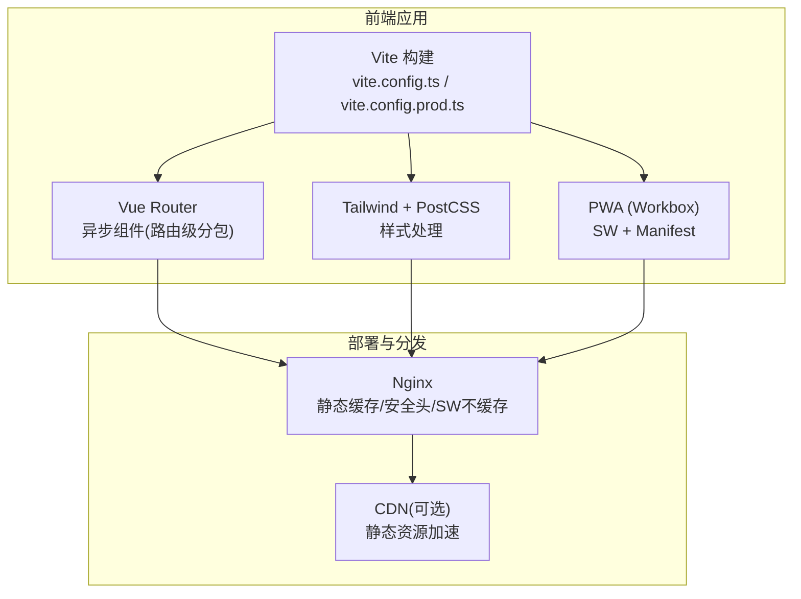
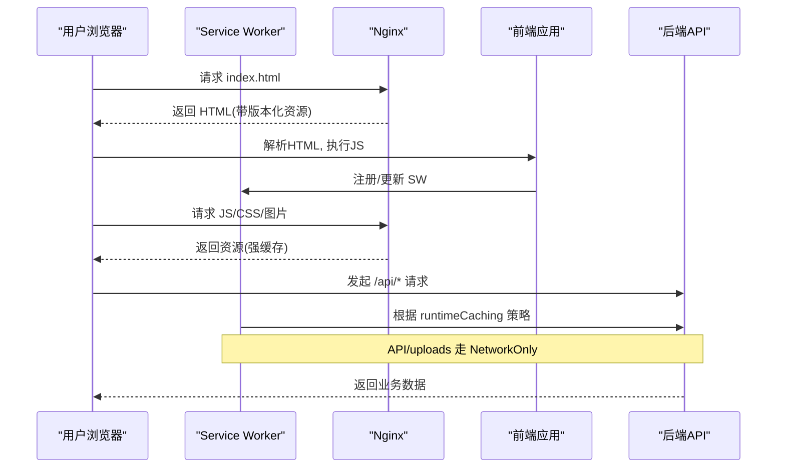
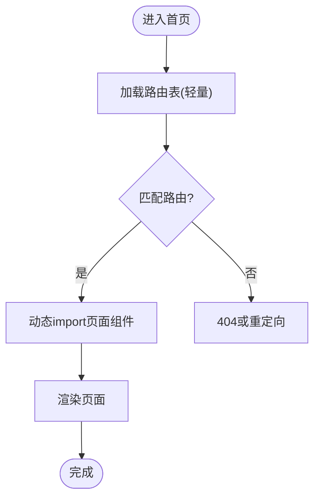
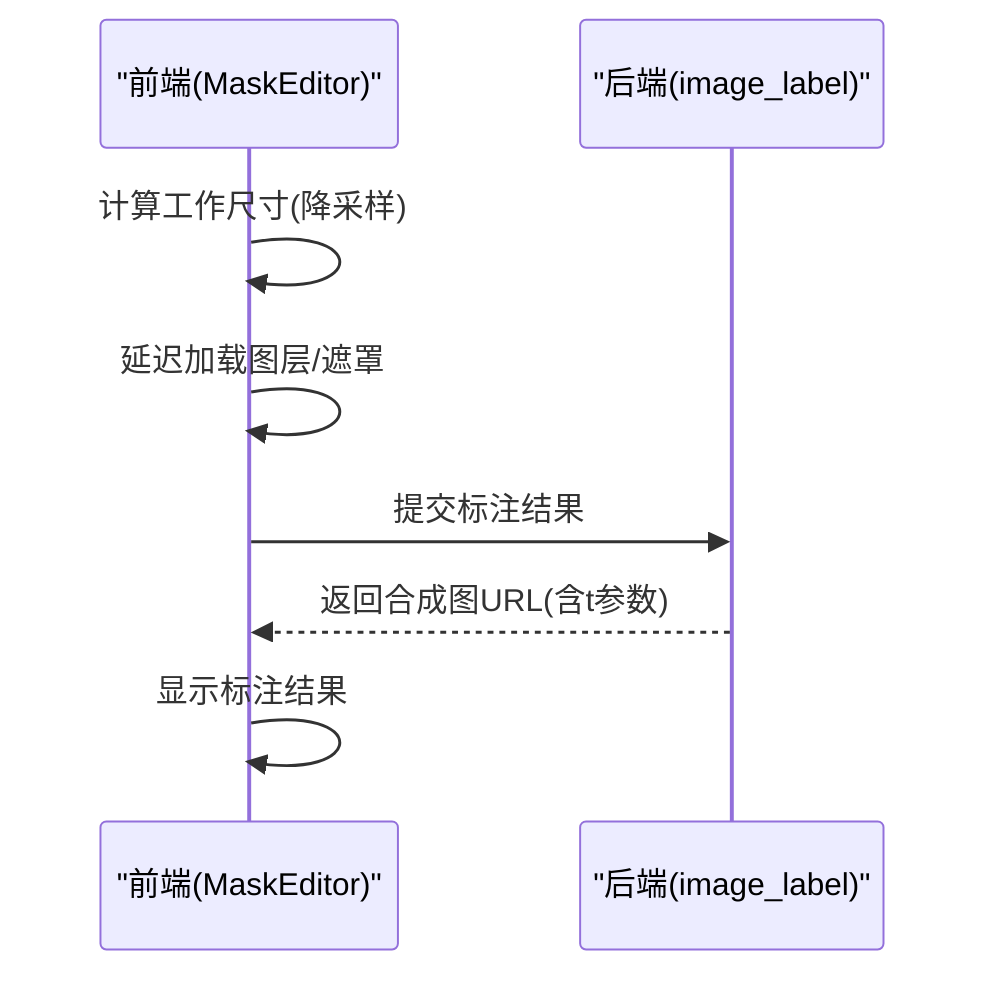
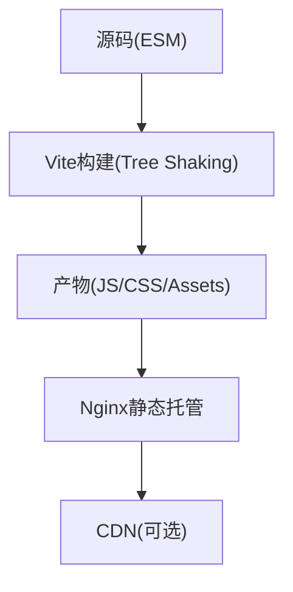
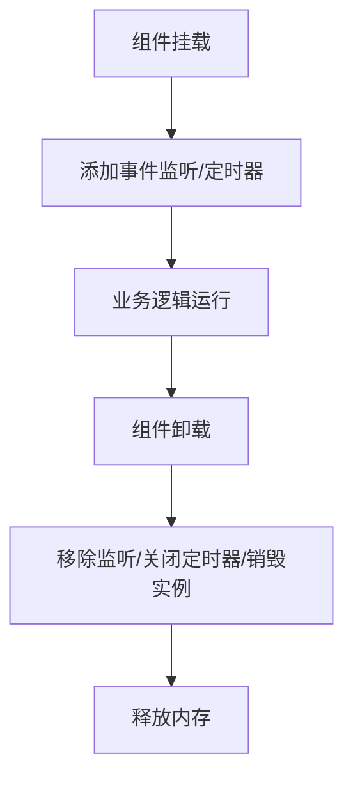
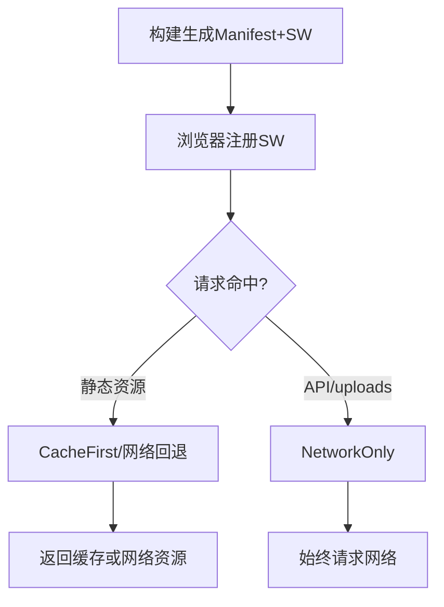
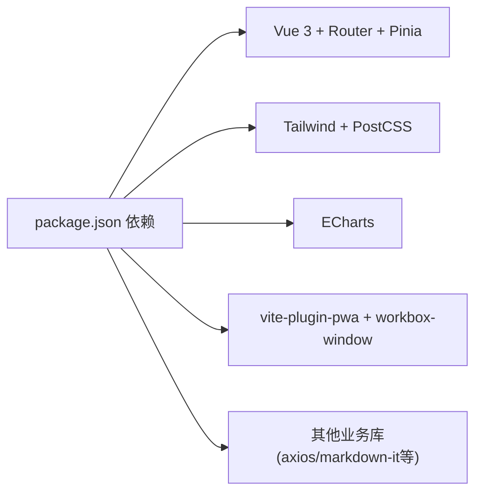

# 性能优化策略

<cite>
**本文引用的文件**   
- [web/app/vite.config.ts](file://web/app/vite.config.ts)
- [web/app/vite.config.prod.ts](file://web/app/vite.config.prod.ts)
- [web/app/package.json](file://web/app/package.json)
- [web/app/src/router/index.ts](file://web/app/src/router/index.ts)
- [web/app/tailwind.config.ts](file://web/app/tailwind.config.ts)
- [web/app/postcss.config.js](file://web/app/postcss.config.js)
- [web/deploy/nginx.conf](file://web/deploy/nginx.conf)
- [web/app/src/components/analytics/AnalyticsDashboard.vue](file://web/app/src/components/analytics/AnalyticsDashboard.vue)
- [web/app/src/views/VasiDetailPage.vue](file://web/app/src/views/VasiDetailPage.vue)
- [web/app/src/views/ReportDetailPage.vue](file://web/app/src/views/ReportDetailPage.vue)
- [web/app/src/components/tracker/MaskEditor.vue](file://web/app/src/components/tracker/MaskEditor.vue)
</cite>

## 目录
1. [引言](#引言)
2. [项目结构](#项目结构)
3. [核心组件](#核心组件)
4. [架构总览](#架构总览)
5. [详细组件分析](#详细组件分析)
6. [依赖分析](#依赖分析)
7. [性能考量](#性能考量)
8. [故障排查指南](#故障排查指南)
9. [结论](#结论)
10. [附录](#附录)

## 引言
本文件面向 Subskin 项目的性能优化，围绕前端构建与运行时两大主线展开：代码分割、资源懒加载、图片优化、Bundle 分析与 Tree Shaking、CSS 优化、首屏加载优化、内存泄漏防护、渲染性能提升；同时覆盖 PWA 缓存策略、Service Worker 优化与 CDN 集成方案，并给出可落地的监控指标与优化案例。所有建议均基于仓库现有配置与实现进行解读与扩展。

## 项目结构
Subskin 前端位于 web/app，采用 Vite + Vue 3 + TypeScript 技术栈，使用 Tailwind CSS 与 PostCSS 构建样式，通过 vite-plugin-pwa 生成 Service Worker 与 Manifest。Nginx 作为生产静态资源与反向代理服务器，负责缓存、安全头与 SW 不缓存策略。路由层使用 vue-router 的异步组件实现页面级代码分割。

**图表来源** 
- [web/app/vite.config.ts](file://web/app/vite.config.ts)
- [web/app/vite.config.prod.ts](file://web/app/vite.config.prod.ts)
- [web/app/src/router/index.ts](file://web/app/src/router/index.ts)
- [web/app/tailwind.config.ts](file://web/app/tailwind.config.ts)
- [web/app/postcss.config.js](file://web/app/postcss.config.js)
- [web/deploy/nginx.conf](file://web/deploy/nginx.conf)

**章节来源**
- [web/app/vite.config.ts:1-110](file://web/app/vite.config.ts#L1-L110)
- [web/app/vite.config.prod.ts:1-98](file://web/app/vite.config.prod.ts#L1-L98)
- [web/app/src/router/index.ts:1-155](file://web/app/src/router/index.ts#L1-L155)
- [web/app/tailwind.config.ts:1-63](file://web/app/tailwind.config.ts#L1-L63)
- [web/app/postcss.config.js:1-6](file://web/app/postcss.config.js#L1-L6)
- [web/deploy/nginx.conf:1-73](file://web/deploy/nginx.conf#L1-L73)

## 核心组件
- 构建与打包：Vite 默认开启按需打包与 Tree Shaking；生产环境输出到 Nginx 根目录，便于静态托管。
- PWA：vite-plugin-pwa 自动生成 SW 与 Manifest，runtimeCaching 对 API 与上传路径强制 NetworkOnly，避免敏感数据泄露。
- 路由分包：vue-router 使用动态 import 实现页面级懒加载，减少首屏体积。
- 样式体系：Tailwind + PostCSS，content 扫描范围限定在 index.html 与 src 下，减少无用 CSS。
- 部署：Nginx 设置强缓存与 SW 不缓存规则，保障版本更新与安全性。

**章节来源**
- [web/app/package.json:1-55](file://web/app/package.json#L1-L55)
- [web/app/vite.config.ts:34-89](file://web/app/vite.config.ts#L34-L89)
- [web/app/vite.config.prod.ts:28-77](file://web/app/vite.config.prod.ts#L28-L77)
- [web/app/src/router/index.ts:6-138](file://web/app/src/router/index.ts#L6-L138)
- [web/app/tailwind.config.ts:4-7](file://web/app/tailwind.config.ts#L4-L7)
- [web/deploy/nginx.conf:29-59](file://web/deploy/nginx.conf#L29-L59)

## 架构总览
下图展示从浏览器到 Nginx 再到后端 API 的请求链路，以及 PWA 缓存策略如何影响资源加载与更新。

**图表来源** 
- [web/app/vite.config.ts:34-89](file://web/app/vite.config.ts#L34-L89)
- [web/app/vite.config.prod.ts:28-77](file://web/app/vite.config.prod.ts#L28-L77)
- [web/deploy/nginx.conf:29-59](file://web/deploy/nginx.conf#L29-L59)

## 详细组件分析

### 代码分割与路由懒加载
- 路由级分包：所有页面组件通过动态 import 引入，仅在访问对应路由时加载，显著降低首屏体积。
- 组件级拆分：将大组件（如编辑器、看板）按功能拆分为子组件，配合按需导入减少初始包大小。
- 第三方库按需引入：例如 ECharts 仅在使用页面引入实例，避免全量打包。

**图表来源** 
- [web/app/src/router/index.ts:6-138](file://web/app/src/router/index.ts#L6-L138)

**章节来源**
- [web/app/src/router/index.ts:6-138](file://web/app/src/router/index.ts#L6-L138)

### 资源懒加载与图片优化
- 图片懒加载：在图像编辑等场景中，延迟加载图层与大图，避免阻塞主线程。
- Canvas 工作尺寸：根据自然尺寸计算合适的工作分辨率，降低内存占用与绘制开销。
- 服务端合成图：标注结果以 JPEG 形式保存，附带时间戳做缓存破坏，确保更新可见。

**图表来源** 
- [web/app/src/components/tracker/MaskEditor.vue:648-676](file://web/app/src/components/tracker/MaskEditor.vue#L648-L676)
- [web/backend/api/image_label.py:706-723](file://web/backend/api/image_label.py#L706-L723)

**章节来源**
- [web/app/src/components/tracker/MaskEditor.vue:648-676](file://web/app/src/components/tracker/MaskEditor.vue#L648-L676)
- [web/backend/api/image_label.py:706-723](file://web/backend/api/image_label.py#L706-L723)

### Bundle 分析与 Tree Shaking 配置
- Vite 默认启用 Tree Shaking，结合 ES 模块与类型检查，移除未使用代码。
- 生产构建输出至 Nginx 目录，便于后续接入 CDN 与缓存策略。
- 可通过构建产物分析工具（如 vite-bundle-analyzer）进一步定位大包依赖。

**图表来源** 
- [web/app/vite.config.ts:13-16](file://web/app/vite.config.ts#L13-L16)
- [web/app/vite.config.prod.ts:12-15](file://web/app/vite.config.prod.ts#L12-L15)

**章节来源**
- [web/app/vite.config.ts:13-16](file://web/app/vite.config.ts#L13-L16)
- [web/app/vite.config.prod.ts:12-15](file://web/app/vite.config.prod.ts#L12-L15)

### CSS 优化技术
- Tailwind content 扫描范围限定为 index.html 与 src 下的 .vue/.ts/.js，避免扫描 node_modules。
- PostCSS 自动添加前缀，保证兼容性。
- 建议在生产构建中启用 CSS 压缩与去重（Vite 默认已启用）。

**章节来源**
- [web/app/tailwind.config.ts:4-7](file://web/app/tailwind.config.ts#L4-L7)
- [web/app/postcss.config.js:1-6](file://web/app/postcss.config.js#L1-L6)

### 首屏加载优化
- 路由懒加载：首屏仅加载必要页面与基础框架。
- 关键资源内联：可将极小 CSS/字体内联以减少请求数（需权衡）。
- 预取与预连接：对高频路由或关键接口使用 preconnect/prefetch（可在 HTML 或 JS 中配置）。

**章节来源**
- [web/app/src/router/index.ts:6-138](file://web/app/src/router/index.ts#L6-L138)

### 内存泄漏防护
- 事件监听清理：在 onUnmounted 中移除 window/document 事件监听，防止内存泄漏。
- 定时器清理：关闭轮询与定时任务，避免后台继续运行。
- Chart 实例释放：ECharts 实例在卸载时 dispose，释放底层资源。

**图表来源** 
- [web/admin/src/components/labeling/VitiligoContourAdmin.vue:285-295](file://web/admin/src/components/labeling/VitiligoContourAdmin.vue#L285-L295)
- [web/app/src/components/analytics/AnalyticsDashboard.vue:311-319](file://web/app/src/components/analytics/AnalyticsDashboard.vue#L311-L319)

**章节来源**
- [web/admin/src/components/labeling/VitiligoContourAdmin.vue:285-295](file://web/admin/src/components/labeling/VitiligoContourAdmin.vue#L285-L295)
- [web/app/src/components/analytics/AnalyticsDashboard.vue:311-319](file://web/app/src/components/analytics/AnalyticsDashboard.vue#L311-L319)

### 渲染性能提升
- 长列表虚拟化：对大量条目使用虚拟滚动（如推荐 vue-virtual-scroller）。
- 防抖与节流：输入与滚动场景使用防抖/节流减少重排重绘。
- 增量更新：优先使用响应式最小更新，避免整页刷新。

[本节为通用指导，不直接分析具体文件]

### PWA 缓存策略与 Service Worker 优化
- Manifest 与图标：定义应用名称、主题色、启动页与多尺寸图标。
- Workbox 策略：
  - API 与 uploads 路径强制 NetworkOnly，避免跨用户数据泄露。
  - 静态资源由 globPatterns 控制缓存，最大文件大小限制 4MB。
  - clientsClaim 确保新 SW 立即接管客户端。
- 版本检测：构建时生成 version.json，用于提示更新。

**图表来源** 
- [web/app/vite.config.ts:34-89](file://web/app/vite.config.ts#L34-L89)
- [web/app/vite.config.prod.ts:28-77](file://web/app/vite.config.prod.ts#L28-L77)

**章节来源**
- [web/app/vite.config.ts:34-89](file://web/app/vite.config.ts#L34-L89)
- [web/app/vite.config.prod.ts:28-77](file://web/app/vite.config.prod.ts#L28-L77)

### CDN 集成方案
- 静态资源：将 Nginx 输出的静态文件（JS/CSS/图片）上推至 CDN，利用边缘缓存加速。
- 版本化文件名：Vite 默认对产物加哈希，利于长期缓存与快速失效。
- SW 与版本文件：保持 SW 与 version.json 不被 CDN 缓存或设置短 TTL，确保更新及时生效。

[本节为通用指导，不直接分析具体文件]

## 依赖分析
前端依赖集中在 package.json，包含 Vue 生态、UI 与图表库。通过 Vite 的依赖分析与 Tree Shaking，可减少最终包体。

**图表来源** 
- [web/app/package.json:14-42](file://web/app/package.json#L14-L42)

**章节来源**
- [web/app/package.json:14-42](file://web/app/package.json#L14-L42)

## 性能考量
- 首屏体积控制：通过路由懒加载、组件拆分与依赖精简，降低初始 JS/CSS 体积。
- 网络优化：Nginx 强缓存静态资源，SW 对非敏感资源缓存，API/uploads 直连网络。
- 渲染优化：Canvas 工作尺寸降采样、图表实例释放、事件监听清理。
- 监控与分析：通过 AnalyticsDashboard 收集 UV/PV、转化漏斗与功能使用，辅助定位瓶颈。

**章节来源**
- [web/deploy/nginx.conf:29-59](file://web/deploy/nginx.conf#L29-L59)
- [web/app/src/components/analytics/AnalyticsDashboard.vue:1-374](file://web/app/src/components/analytics/AnalyticsDashboard.vue#L1-L374)

## 故障排查指南
- 构建问题：检查 Vite 配置输出目录与插件顺序，确认 PWA 生成文件是否被正确发布。
- 缓存问题：确认 Nginx 对 SW 与 version.json 的 no-store 策略生效，避免旧版本残留。
- 内存泄漏：检查组件卸载生命周期，确保事件监听、定时器与图表实例被清理。
- 图片加载：验证 Canvas 工作尺寸计算与图层懒加载逻辑，避免大图阻塞。

**章节来源**
- [web/app/vite.config.ts:13-16](file://web/app/vite.config.ts#L13-L16)
- [web/deploy/nginx.conf:49-53](file://web/deploy/nginx.conf#L49-L53)
- [web/app/src/components/analytics/AnalyticsDashboard.vue:311-319](file://web/app/src/components/analytics/AnalyticsDashboard.vue#L311-L319)
- [web/app/src/components/tracker/MaskEditor.vue:648-676](file://web/app/src/components/tracker/MaskEditor.vue#L648-L676)

## 结论
Subskin 前端已具备较好的性能基础：Vite 构建、路由懒加载、Tailwind 内容扫描、PWA 安全缓存策略与 Nginx 缓存配置。建议在现有基础上持续进行 Bundle 分析、依赖瘦身、图片懒加载与渲染优化，并通过监控指标驱动迭代，逐步达成更优的首屏体验与运行性能。

[本节为总结性内容，不直接分析具体文件]

## 附录
- 监控指标建议：
  - 首屏时间（FCP/LCP）、交互时间（TTI）
  - 包体大小（JS/CSS/图片）与请求数
  - 缓存命中率与 SW 更新频率
  - 内存峰值与垃圾回收频率
- 优化案例参考：
  - 路由懒加载减少首屏体积
  - Canvas 工作尺寸降采样降低内存占用
  - API/uploads 强制 NetworkOnly 避免数据泄露

[本节为补充信息，不直接分析具体文件]