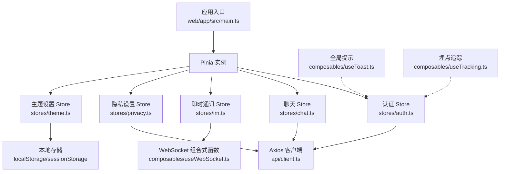
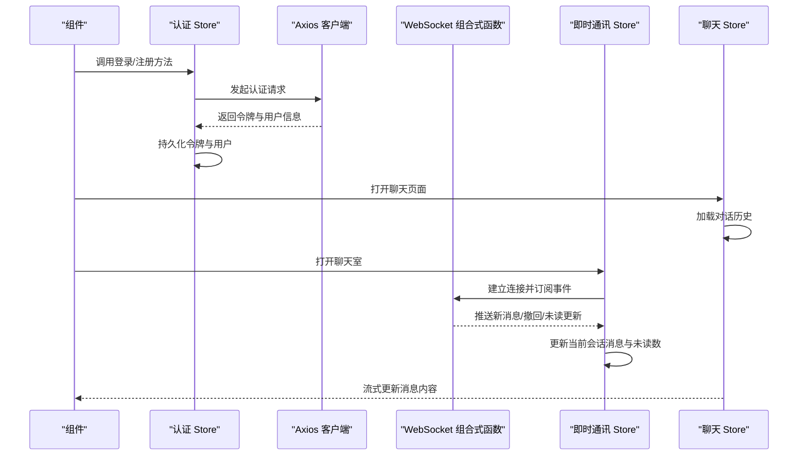
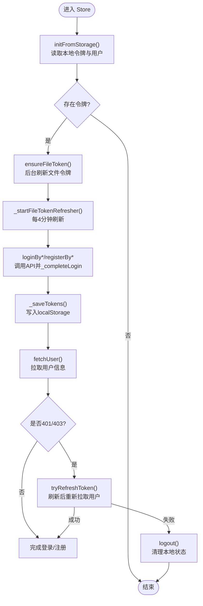
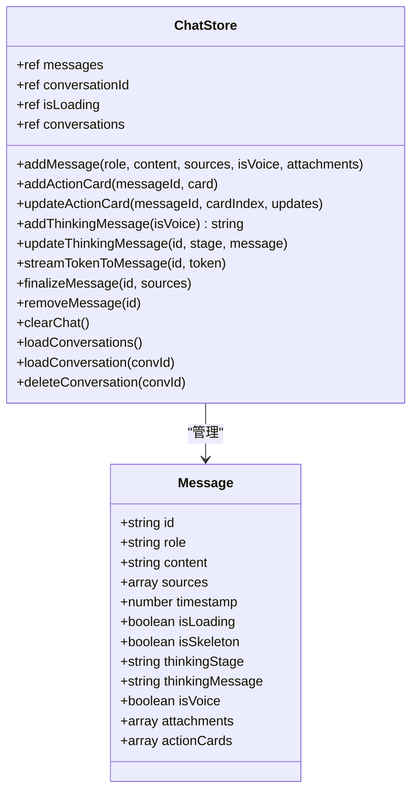
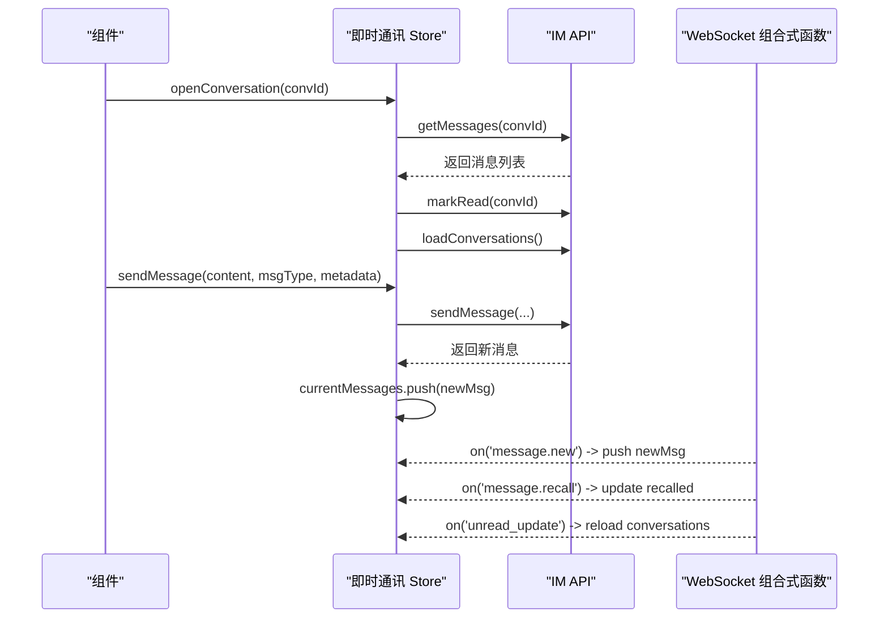
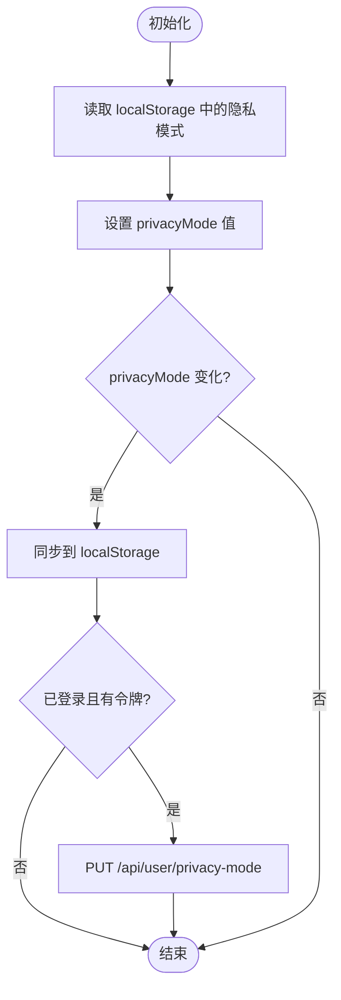
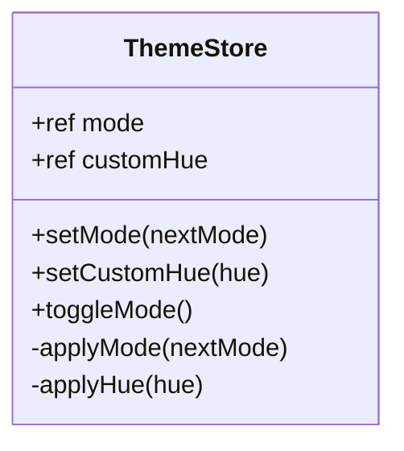
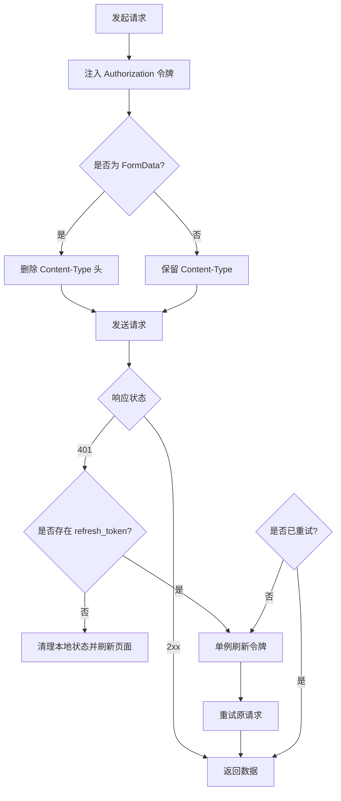
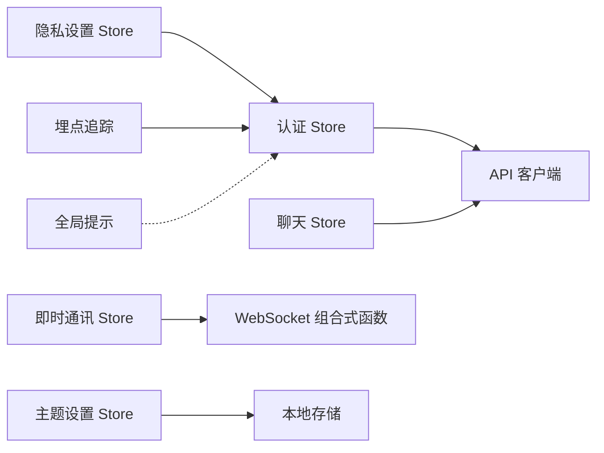

# 状态管理架构

<cite>
**本文引用的文件**   
- [web/app/src/main.ts](file://web/app/src/main.ts)
- [web/app/src/stores/auth.ts](file://web/app/src/stores/auth.ts)
- [web/app/src/stores/chat.ts](file://web/app/src/stores/chat.ts)
- [web/app/src/stores/im.ts](file://web/app/src/stores/im.ts)
- [web/app/src/stores/privacy.ts](file://web/app/src/stores/privacy.ts)
- [web/app/src/stores/theme.ts](file://web/app/src/stores/theme.ts)
- [web/app/src/composables/useWebSocket.ts](file://web/app/src/composables/useWebSocket.ts)
- [web/app/src/composables/useToast.ts](file://web/app/src/composables/useToast.ts)
- [web/app/src/composables/useTracking.ts](file://web/app/src/composables/useTracking.ts)
- [web/app/src/api/client.ts](file://web/app/src/api/client.ts)
- [web/app/src/types/index.ts](file://web/app/src/types/index.ts)
</cite>

## 目录
1. [引言](#引言)
2. [项目结构](#项目结构)
3. [核心组件](#核心组件)
4. [架构总览](#架构总览)
5. [详细组件分析](#详细组件分析)
6. [依赖关系分析](#依赖关系分析)
7. [性能考量](#性能考量)
8. [故障排查指南](#故障排查指南)
9. [结论](#结论)
10. [附录](#附录)

## 引言
本文件为 Subskin 前端的状态管理架构文档，聚焦于基于 Pinia 的状态管理模式、Store 设计原则与模块化组织方式。内容涵盖响应式数据流、异步状态处理、状态持久化策略、自定义 Composables 开发、跨 Store 共享机制、性能优化技巧、调试工具使用、错误处理方案与测试策略，并提供关键流程的图示与最佳实践示例，帮助开发者快速理解并高效扩展状态层。

## 项目结构
Subskin 的前端应用采用 Vue 3 + TypeScript 技术栈，状态管理统一由 Pinia 提供，入口在应用初始化时创建并注入 Pinia 实例。各业务域通过独立的 Store 文件进行组织，通用能力通过 Composables 封装，API 访问通过 Axios 客户端集中拦截与重试。类型定义集中在 types 文件中，保证前后端契约一致。

图表来源 
- [web/app/src/main.ts:1-11](file://web/app/src/main.ts#L1-L11)
- [web/app/src/stores/auth.ts:1-259](file://web/app/src/stores/auth.ts#L1-L259)
- [web/app/src/stores/chat.ts:1-164](file://web/app/src/stores/chat.ts#L1-L164)
- [web/app/src/stores/im.ts:1-116](file://web/app/src/stores/im.ts#L1-L116)
- [web/app/src/stores/privacy.ts:1-91](file://web/app/src/stores/privacy.ts#L1-L91)
- [web/app/src/stores/theme.ts:1-71](file://web/app/src/stores/theme.ts#L1-L71)
- [web/app/src/composables/useWebSocket.ts:1-75](file://web/app/src/composables/useWebSocket.ts#L1-L75)
- [web/app/src/composables/useToast.ts:1-31](file://web/app/src/composables/useToast.ts#L1-L31)
- [web/app/src/composables/useTracking.ts:1-110](file://web/app/src/composables/useTracking.ts#L1-L110)
- [web/app/src/api/client.ts:1-84](file://web/app/src/api/client.ts#L1-L84)

章节来源
- [web/app/src/main.ts:1-11](file://web/app/src/main.ts#L1-L11)

## 核心组件
- Pinia 初始化：在应用入口处创建并注册 Pinia，确保所有 Store 可被全局访问。
- 认证 Store（auth）：负责登录、注册、令牌刷新、用户信息获取与持久化，包含短期文件令牌管理与自动刷新。
- 聊天 Store（chat）：维护消息列表、会话 ID、加载状态、对话历史与流式输出更新。
- 即时通讯 Store（im）：管理会话列表、当前会话消息、未读数统计，并通过 WebSocket 实时同步消息与撤回事件。
- 隐私设置 Store（privacy）：控制隐私模式开关、本地与后端同步、敏感信息脱敏。
- 主题设置 Store（theme）：管理明暗模式与色相，持久化到本地存储并动态应用 CSS 变量。
- 通用 Composables：
  - useWebSocket：封装连接、重连、心跳、事件订阅与发送。
  - useToast：全局提示消息队列与自动消失。
  - useTracking：事件采集、批量上报、会话 ID 管理。
- API 客户端（client）：集中配置 baseURL、超时、请求头、上传类型处理；统一拦截器实现 401 自动刷新与并发去重。

章节来源
- [web/app/src/main.ts:1-11](file://web/app/src/main.ts#L1-L11)
- [web/app/src/stores/auth.ts:1-259](file://web/app/src/stores/auth.ts#L1-L259)
- [web/app/src/stores/chat.ts:1-164](file://web/app/src/stores/chat.ts#L1-L164)
- [web/app/src/stores/im.ts:1-116](file://web/app/src/stores/im.ts#L1-L116)
- [web/app/src/stores/privacy.ts:1-91](file://web/app/src/stores/privacy.ts#L1-L91)
- [web/app/src/stores/theme.ts:1-71](file://web/app/src/stores/theme.ts#L1-L71)
- [web/app/src/composables/useWebSocket.ts:1-75](file://web/app/src/composables/useWebSocket.ts#L1-L75)
- [web/app/src/composables/useToast.ts:1-31](file://web/app/src/composables/useToast.ts#L1-L31)
- [web/app/src/composables/useTracking.ts:1-110](file://web/app/src/composables/useTracking.ts#L1-L110)
- [web/app/src/api/client.ts:1-84](file://web/app/src/api/client.ts#L1-L84)

## 架构总览
整体状态管理遵循“单一职责、模块隔离、响应式驱动”的原则：
- 每个 Store 只负责一个业务域的状态与行为，避免耦合。
- 响应式数据通过 ref/computed 暴露给组件，变更自动触发 UI 更新。
- 异步操作集中在 Store 方法中，配合 Axios 拦截器统一处理认证与错误。
- 持久化策略分层：sessionStorage 用于会话级状态，localStorage 用于长期偏好与凭证。
- 跨 Store 共享通过直接调用其他 Store 的方法或 Composables 实现，保持低耦合。

图表来源 
- [web/app/src/stores/auth.ts:1-259](file://web/app/src/stores/auth.ts#L1-L259)
- [web/app/src/api/client.ts:1-84](file://web/app/src/api/client.ts#L1-L84)
- [web/app/src/composables/useWebSocket.ts:1-75](file://web/app/src/composables/useWebSocket.ts#L1-L75)
- [web/app/src/stores/im.ts:1-116](file://web/app/src/stores/im.ts#L1-L116)
- [web/app/src/stores/chat.ts:1-164](file://web/app/src/stores/chat.ts#L1-L164)

## 详细组件分析

### 认证 Store（auth）
- 状态字段：token、refreshToken、user、isLoggedIn、showLoginModal。
- 计算属性：isLoggedIn 基于 token 判断登录态。
- 持久化：登录成功后将 token、refreshToken、user 写入 localStorage；初始化时从本地恢复状态并后台刷新文件令牌。
- 异步流程：支持多种登录方式（手机号/邮箱/用户名），统一走 _completeLogin 保存令牌、拉取用户、预取文件令牌并启动定时刷新。
- 错误处理：401/403 时尝试 refreshToken，失败则 logout；logout 会先尝试服务端撤销 refresh token，再清理本地状态。
- 文件令牌：每 4 分钟刷新一次，避免长会话回退到长生命周期 access token。

图表来源 
- [web/app/src/stores/auth.ts:1-259](file://web/app/src/stores/auth.ts#L1-L259)

章节来源
- [web/app/src/stores/auth.ts:1-259](file://web/app/src/stores/auth.ts#L1-L259)

### 聊天 Store（chat）
- 状态字段：messages、conversationId、isLoading、conversations。
- 消息模型：包含角色、内容、来源、时间戳、骨架屏标记、思考阶段、语音标记、附件与动作卡片等。
- 流式更新：streamTokenToMessage 逐步拼接内容，并在 finalizeMessage 时清理骨架与加载状态。
- 对话管理：支持加载对话列表、加载具体对话、删除对话；消息清洗 sanitizeAssistantText 防止内部异常类名泄露。
- 动作卡片：addActionCard/updateActionCard 支持动态增强消息交互。

图表来源 
- [web/app/src/stores/chat.ts:1-164](file://web/app/src/stores/chat.ts#L1-L164)
- [web/app/src/types/index.ts:18-31](file://web/app/src/types/index.ts#L18-L31)

章节来源
- [web/app/src/stores/chat.ts:1-164](file://web/app/src/stores/chat.ts#L1-L164)
- [web/app/src/types/index.ts:18-31](file://web/app/src/types/index.ts#L18-L31)

### 即时通讯 Store（im）
- 状态字段：conversations、currentMessages、activeConversationId、totalUnread（计算）。
- 会话管理：openConversation 拉取消息并标记已读，同时刷新会话列表。
- 消息发送：sendMessage 推送到后端并追加到当前消息列表。
- WebSocket 集成：initWS 建立连接，订阅 message.new/message.recall/unread_update 事件，实时更新 UI。

图表来源 
- [web/app/src/stores/im.ts:1-116](file://web/app/src/stores/im.ts#L1-L116)
- [web/app/src/composables/useWebSocket.ts:1-75](file://web/app/src/composables/useWebSocket.ts#L1-L75)

章节来源
- [web/app/src/stores/im.ts:1-116](file://web/app/src/stores/im.ts#L1-L116)
- [web/app/src/composables/useWebSocket.ts:1-75](file://web/app/src/composables/useWebSocket.ts#L1-L75)

### 隐私设置 Store（privacy）
- 状态字段：privacyMode（默认 true）。
- 持久化：初始化时从 localStorage 读取；变更时通过 watch 同步到本地存储。
- 后端同步：syncWithBackend 拉取服务器隐私模式；togglePrivacyMode 切换后 PUT 更新。
- 脱敏工具：maskPhone/maskEmail 根据隐私模式决定是否脱敏。

图表来源 
- [web/app/src/stores/privacy.ts:1-91](file://web/app/src/stores/privacy.ts#L1-L91)

章节来源
- [web/app/src/stores/privacy.ts:1-91](file://web/app/src/stores/privacy.ts#L1-L91)

### 主题设置 Store（theme）
- 状态字段：mode（light/dark）、customHue（可选色相）。
- 初始化：根据系统偏好与本地存储决定初始模式与色相。
- 应用样式：applyMode 切换 document.documentElement 的 dark 类；applyHue 设置 CSS 变量 --color-primary-h。
- 持久化：watch 监听 mode/customHue 变化并写入 localStorage。

图表来源 
- [web/app/src/stores/theme.ts:1-71](file://web/app/src/stores/theme.ts#L1-L71)

章节来源
- [web/app/src/stores/theme.ts:1-71](file://web/app/src/stores/theme.ts#L1-L71)

### 通用 Composables
- useWebSocket：封装连接、心跳、重连、事件订阅与发送；自动携带 token 并处理关闭与错误。
- useToast：全局提示队列，支持 success/warning/error/info 类型与自动移除。
- useTracking：事件采集、批量上报、会话 ID 管理；自动附加用户 uid（若已登录）。

章节来源
- [web/app/src/composables/useWebSocket.ts:1-75](file://web/app/src/composables/useWebSocket.ts#L1-L75)
- [web/app/src/composables/useToast.ts:1-31](file://web/app/src/composables/useToast.ts#L1-L31)
- [web/app/src/composables/useTracking.ts:1-110](file://web/app/src/composables/useTracking.ts#L1-L110)

### API 客户端（client）
- 基础配置：baseURL=/api，timeout=120s，Content-Type=application/json。
- 请求拦截：自动注入 Authorization Bearer 令牌；FormData 上传时移除 Content-Type 以让浏览器自动设置 boundary。
- 响应拦截：401 时尝试刷新令牌，使用单例 promise 去重并发刷新；刷新失败则清理本地状态并强制刷新页面。

图表来源 
- [web/app/src/api/client.ts:1-84](file://web/app/src/api/client.ts#L1-L84)

章节来源
- [web/app/src/api/client.ts:1-84](file://web/app/src/api/client.ts#L1-L84)

## 依赖关系分析
- Store 之间通过直接调用彼此方法实现共享，例如 privacy Store 调用 auth Store 的 isLoggedIn/token。
- Composables 作为横切关注点被多个 Store 复用，如 useWebSocket 被 im Store 使用，useTracking 被 auth Store 使用。
- API 客户端被所有需要网络请求的 Store 间接使用，统一处理认证与错误。
- 类型定义集中在 types/index.ts，供各 Store 与组件共享，保证数据结构一致性。

图表来源 
- [web/app/src/stores/auth.ts:1-259](file://web/app/src/stores/auth.ts#L1-L259)
- [web/app/src/stores/chat.ts:1-164](file://web/app/src/stores/chat.ts#L1-L164)
- [web/app/src/stores/im.ts:1-116](file://web/app/src/stores/im.ts#L1-L116)
- [web/app/src/stores/privacy.ts:1-91](file://web/app/src/stores/privacy.ts#L1-L91)
- [web/app/src/stores/theme.ts:1-71](file://web/app/src/stores/theme.ts#L1-L71)
- [web/app/src/composables/useWebSocket.ts:1-75](file://web/app/src/composables/useWebSocket.ts#L1-L75)
- [web/app/src/composables/useToast.ts:1-31](file://web/app/src/composables/useToast.ts#L1-L31)
- [web/app/src/composables/useTracking.ts:1-110](file://web/app/src/composables/useTracking.ts#L1-L110)
- [web/app/src/api/client.ts:1-84](file://web/app/src/api/client.ts#L1-L84)

章节来源
- [web/app/src/stores/auth.ts:1-259](file://web/app/src/stores/auth.ts#L1-L259)
- [web/app/src/stores/chat.ts:1-164](file://web/app/src/stores/chat.ts#L1-L164)
- [web/app/src/stores/im.ts:1-116](file://web/app/src/stores/im.ts#L1-L116)
- [web/app/src/stores/privacy.ts:1-91](file://web/app/src/stores/privacy.ts#L1-L91)
- [web/app/src/stores/theme.ts:1-71](file://web/app/src/stores/theme.ts#L1-L71)
- [web/app/src/composables/useWebSocket.ts:1-75](file://web/app/src/composables/useWebSocket.ts#L1-L75)
- [web/app/src/composables/useToast.ts:1-31](file://web/app/src/composables/useToast.ts#L1-L31)
- [web/app/src/composables/useTracking.ts:1-110](file://web/app/src/composables/useTracking.ts#L1-L110)
- [web/app/src/api/client.ts:1-84](file://web/app/src/api/client.ts#L1-L84)

## 性能考量
- 响应式最小化更新：仅对必要字段使用 ref/computed，避免不必要的重渲染。
- 异步去重：Axios 客户端使用单例 promise 去重并发 401 刷新请求，减少重复网络开销。
- 批量上报：埋点追踪使用队列与定时器批量提交，降低频繁请求成本。
- 本地缓存：主题与隐私设置优先读取本地存储，减少首次渲染延迟。
- 短令牌刷新：文件令牌每 4 分钟刷新，避免长会话频繁回退到长生命周期令牌。
- WebSocket 重连：指数退避重连策略，避免雪崩式重连。

[本节为通用指导，不直接分析具体文件]

## 故障排查指南
- 认证失败：检查 localStorage 中的 subskin_token 与 subskin_refresh_token 是否存在且有效；确认 Axios 拦截器是否正确注入 Authorization 头。
- 401 循环刷新：确认 refresh-token 接口可用；查看单例刷新逻辑是否被正确重置。
- WebSocket 连接失败：检查 token 是否有效；确认 ws 协议与 host 是否正确；查看心跳与重连日志。
- 消息不同步：确认 message.new/recall/unread_update 事件是否被正确订阅与处理。
- 隐私模式未生效：检查 localStorage 中的 subskin_privacy_mode 是否与后端一致；确认 togglePrivacyMode 的 PUT 请求是否成功。
- 主题未应用：检查 document.documentElement 的 dark 类与 CSS 变量 --color-primary-h 是否正确设置。

章节来源
- [web/app/src/api/client.ts:1-84](file://web/app/src/api/client.ts#L1-L84)
- [web/app/src/composables/useWebSocket.ts:1-75](file://web/app/src/composables/useWebSocket.ts#L1-L75)
- [web/app/src/stores/privacy.ts:1-91](file://web/app/src/stores/privacy.ts#L1-L91)
- [web/app/src/stores/theme.ts:1-71](file://web/app/src/stores/theme.ts#L1-L71)

## 结论
Subskin 的状态管理以 Pinia 为核心，结合 Vue 3 响应式系统与 TypeScript 类型约束，构建了清晰、可维护、可扩展的状态层。通过模块化 Store、通用 Composables 与统一的 API 客户端，实现了认证、聊天、即时通讯、隐私与主题等核心功能的高效协作。建议在后续迭代中继续遵循单一职责、低耦合、高内聚的设计原则，并结合性能优化与错误处理策略，持续提升用户体验与系统稳定性。

[本节为总结性内容，不直接分析具体文件]

## 附录
- 最佳实践示例：
  - 新增 Store 时，明确定义状态字段与方法，避免直接修改外部状态。
  - 使用 computed 派生状态，减少重复计算与副作用。
  - 异步操作集中在 Store 方法中，统一错误处理与用户反馈。
  - 持久化策略区分 session/local storage，避免敏感信息泄露。
  - 使用 Composables 封装通用逻辑，提高代码复用率。
  - 通过类型定义保证前后端契约一致性，减少运行时错误。

[本节为概念性内容，不直接分析具体文件]