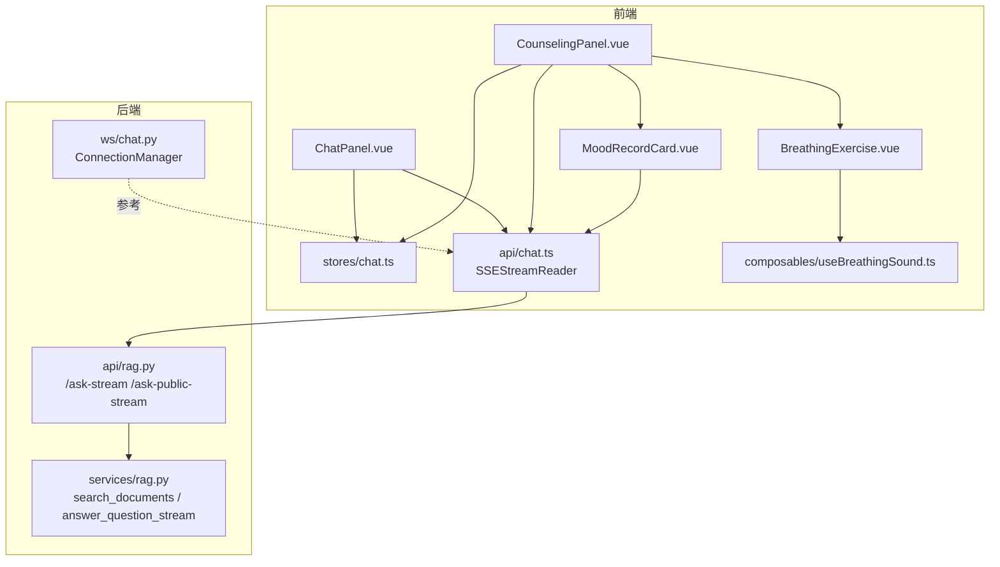
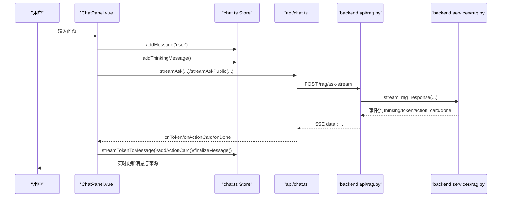
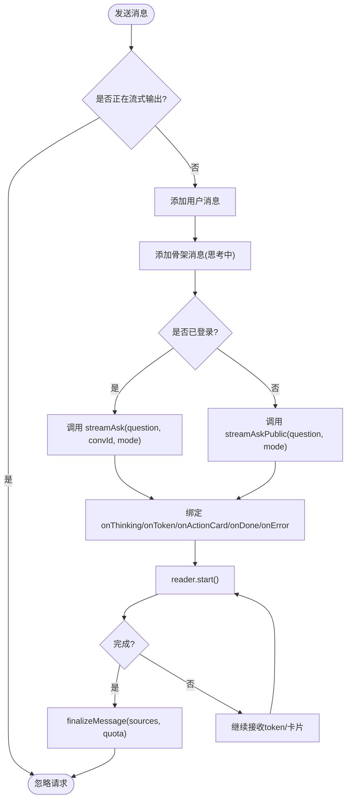
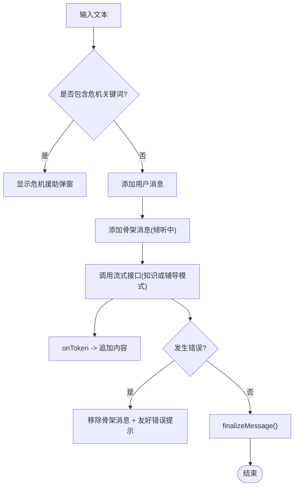
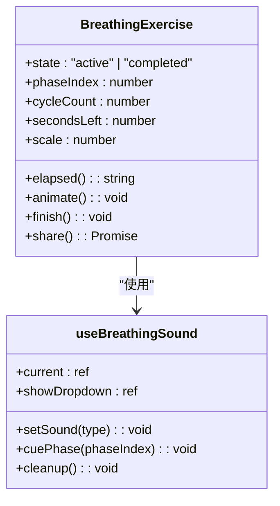
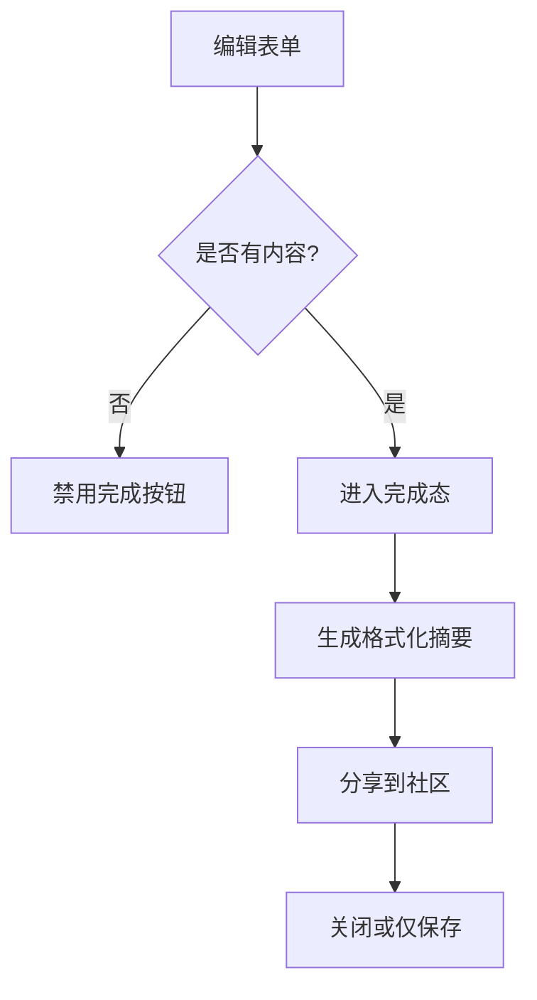
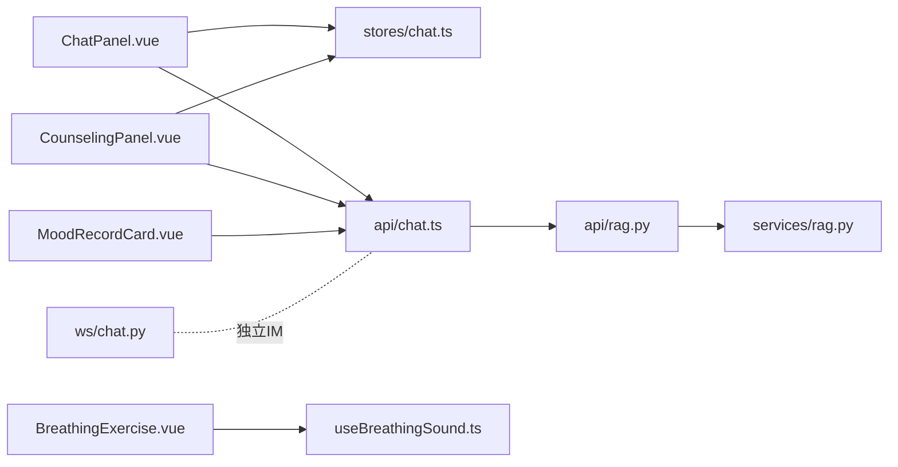

# AI助手组件

<cite>
**本文引用的文件**   
- [ChatPanel.vue](file://web/app/src/components/assistant/ChatPanel.vue)
- [CounselingPanel.vue](file://web/app/src/components/assistant/CounselingPanel.vue)
- [BreathingExercise.vue](file://web/app/src/components/assistant/BreathingExercise.vue)
- [MoodRecordCard.vue](file://web/app/src/components/assistant/MoodRecordCard.vue)
- [chat.ts（Store）](file://web/app/src/stores/chat.ts)
- [chat.ts（API与SSE流）](file://web/app/src/api/chat.ts)
- [useBreathingSound.ts](file://web/app/src/composables/useBreathingSound.ts)
- [rag.py（后端RAG接口）](file://web/backend/api/rag.py)
- [rag.py（后端RAG服务）](file://web/backend/services/rag.py)
- [chat.py（WebSocket连接管理）](file://web/backend/ws/chat.py)
</cite>

## 目录
1. [简介](#简介)
2. [项目结构](#项目结构)
3. [核心组件](#核心组件)
4. [架构总览](#架构总览)
5. [详细组件分析](#详细组件分析)
6. [依赖关系分析](#依赖关系分析)
7. [性能考量](#性能考量)
8. [故障排查指南](#故障排查指南)
9. [结论](#结论)

## 简介
本文件面向Subskin项目的AI助手前端组件，系统性梳理以下能力：
- ChatPanel的流式对话实现（SSE流式输出、思考阶段提示、动作卡片、来源引用）
- CounselingPanel的心理辅导功能（危机关键词检测、正念呼吸与心情记录入口）
- BreathingExercise呼吸练习组件（动画节拍、多音轨背景音、完成分享）
- MoodRecordCard情绪记录组件（结构化输入、总结展示、一键分享社区）
- 后端RAG检索集成（向量+关键词混合检索、访客配额、会话权限校验、速率限制）
- 错误处理与重试策略（友好错误文案、异常清洗、网络失败兜底）
- 状态管理与用户交互逻辑（Pinia Store消息流、骨架屏、历史对话加载）
- 与后端API的集成方式（REST+SSE流式、临时附件上传、动作确认回调）

## 项目结构
AI助手相关的前端代码集中在 web/app/src/components/assistant 下，配合 Pinia store 与 API 层；后端RAG与流式响应在 web/backend/api/rag.py 与 services/rag.py 中实现。WebSocket用于IM模块的消息推送，不在聊天问答主流程内，但作为系统实时通信能力的参考。

**图表来源** 
- [ChatPanel.vue:1-156](file://web/app/src/components/assistant/ChatPanel.vue#L1-L156)
- [CounselingPanel.vue:1-158](file://web/app/src/components/assistant/CounselingPanel.vue#L1-L158)
- [BreathingExercise.vue:1-204](file://web/app/src/components/assistant/BreathingExercise.vue#L1-L204)
- [MoodRecordCard.vue:1-135](file://web/app/src/components/assistant/MoodRecordCard.vue#L1-L135)
- [chat.ts（Store）:1-164](file://web/app/src/stores/chat.ts#L1-L164)
- [chat.ts（API与SSE流）:1-272](file://web/app/src/api/chat.ts#L1-L272)
- [rag.py（后端RAG接口）:534-629](file://web/backend/api/rag.py#L534-L629)
- [rag.py（后端RAG服务）:456-522](file://web/backend/services/rag.py#L456-L522)
- [chat.py（WebSocket连接管理）:14-42](file://web/backend/ws/chat.py#L14-L42)

**章节来源**
- [ChatPanel.vue:1-156](file://web/app/src/components/assistant/ChatPanel.vue#L1-L156)
- [CounselingPanel.vue:1-158](file://web/app/src/components/assistant/CounselingPanel.vue#L1-L158)
- [chat.ts（Store）:1-164](file://web/app/src/stores/chat.ts#L1-L164)
- [chat.ts（API与SSE流）:1-272](file://web/app/src/api/chat.ts#L1-L272)
- [rag.py（后端RAG接口）:534-629](file://web/backend/api/rag.py#L534-L629)
- [rag.py（后端RAG服务）:456-522](file://web/backend/services/rag.py#L456-L522)
- [chat.py（WebSocket连接管理）:14-42](file://web/backend/ws/chat.py#L14-L42)

## 核心组件
- ChatPanel：负责知识问答模式的流式对话，支持思考阶段提示、动作卡片渲染、来源引用展示、访客额度提示与登录引导。
- CounselingPanel：心理辅导模式，内置危机关键词检测并弹出援助资源；提供“正念呼吸”和“心情记录”快捷工具。
- BreathingExercise：基于requestAnimationFrame的呼吸节拍动画，支持多种环境音（木鱼/颂钵/雨声/溪流/风声/鸟鸣），完成后支持分享到社区。
- MoodRecordCard：结构化CBT风格记录（情境/想法/感受/反思/新视角），完成后生成格式化内容并可选分享。

**章节来源**
- [ChatPanel.vue:1-156](file://web/app/src/components/assistant/ChatPanel.vue#L1-L156)
- [CounselingPanel.vue:1-158](file://web/app/src/components/assistant/CounselingPanel.vue#L1-L158)
- [BreathingExercise.vue:1-204](file://web/app/src/components/assistant/BreathingExercise.vue#L1-L204)
- [MoodRecordCard.vue:1-135](file://web/app/src/components/assistant/MoodRecordCard.vue#L1-L135)

## 架构总览
前端通过 SSE（Server-Sent Events）建立长连接，后端以 text/event-stream 形式分片推送 thinking、token、action_card、done 等事件。Store集中维护消息列表、骨架屏状态、思考阶段与来源信息。RAG服务根据配置选择向量或关键词检索，结合用户上下文与知识库生成回答。

**图表来源**
- [ChatPanel.vue:17-54](file://web/app/src/components/assistant/ChatPanel.vue#L17-L54)
- [chat.ts（Store）:60-105](file://web/app/src/stores/chat.ts#L60-L105)
- [chat.ts（API与SSE流）:116-272](file://web/app/src/api/chat.ts#L116-L272)
- [rag.py（后端RAG接口）:534-629](file://web/backend/api/rag.py#L534-L629)
- [rag.py（后端RAG服务）:632-800](file://web/backend/services/rag.py#L632-L800)

## 详细组件分析

### ChatPanel 流式对话实现
- 发送消息：区分已登录与访客路径，调用不同流式接口；插入骨架消息并绑定思考阶段回调。
- 流式处理：onThinking更新思考阶段与文案；onToken拼接文本并清洗异常类名；onActionCard注入动作卡片；onDone收尾并携带来源与剩余次数。
- 错误处理：统一友好文案映射，对额度耗尽/限流进行特殊提示；异常时回退为通用错误消息。
- 历史对话：支持新建对话、切换历史会话、加载会话消息并清理本地状态。

**图表来源**
- [ChatPanel.vue:17-54](file://web/app/src/components/assistant/ChatPanel.vue#L17-L54)
- [chat.ts（API与SSE流）:116-272](file://web/app/src/api/chat.ts#L116-L272)

**章节来源**
- [ChatPanel.vue:1-156](file://web/app/src/components/assistant/ChatPanel.vue#L1-L156)
- [chat.ts（Store）:27-115](file://web/app/src/stores/chat.ts#L27-L115)
- [chat.ts（API与SSE流）:116-272](file://web/app/src/api/chat.ts#L116-L272)

### CounselingPanel 心理辅导功能
- 危机检测：命中预设关键词即弹出全屏援助资源弹窗，阻断常规对话流。
- 快捷工具：正念呼吸与心情记录以全屏覆盖层呈现，互斥显示。
- 流式对话：仅 token 流，无动作卡片；错误时移除骨架消息并给出安抚性提示。

**图表来源**
- [CounselingPanel.vue:21-40](file://web/app/src/components/assistant/CounselingPanel.vue#L21-L40)

**章节来源**
- [CounselingPanel.vue:1-158](file://web/app/src/components/assistant/CounselingPanel.vue#L1-L158)

### BreathingExercise 呼吸练习组件
- 节拍控制：吸气/屏息/呼气三阶段，使用 requestAnimationFrame 驱动缩放动画与倒计时。
- 声音系统：AudioContext合成白/粉/棕噪声与环境音，支持木鱼节奏、颂钵泛音、鸟鸣随机化。
- 完成态：统计轮数与用时，随机鼓励语，支持一键发布到社区（分类ID固定）。

**图表来源**
- [BreathingExercise.vue:1-204](file://web/app/src/components/assistant/BreathingExercise.vue#L1-L204)
- [useBreathingSound.ts:1-224](file://web/app/src/composables/useBreathingSound.ts#L1-L224)

**章节来源**
- [BreathingExercise.vue:1-204](file://web/app/src/components/assistant/BreathingExercise.vue#L1-L204)
- [useBreathingSound.ts:1-224](file://web/app/src/composables/useBreathingSound.ts#L1-L224)

### MoodRecordCard 情绪记录组件
- 结构化输入：五字段（情境/想法/感受/反思/新视角），自动高度自适应。
- 完成态：汇总为带图标标签的HTML片段，支持分享或仅保存关闭。
- 分享：调用社区发帖接口，设置标题、内容与分类。

**图表来源**
- [MoodRecordCard.vue:1-135](file://web/app/src/components/assistant/MoodRecordCard.vue#L1-L135)

**章节来源**
- [MoodRecordCard.vue:1-135](file://web/app/src/components/assistant/MoodRecordCard.vue#L1-L135)

## 依赖关系分析
- 前端依赖
  - ChatPanel/CounselingPanel 依赖 chat.ts Store 进行消息状态管理。
  - 所有流式请求通过 api/chat.ts 的 SSEStreamReader 发起，封装了认证头、错误映射与事件分发。
  - BreathingExercise 依赖 useBreathingSound 进行音频合成与播放控制。
  - MoodRecordCard 依赖 communityApi 进行社区发帖。
- 后端依赖
  - rag.py 暴露 REST 与 SSE 流式接口，内部调用 services/rag.py 的 search_documents 与 answer_question_stream。
  - services/rag.py 实现混合检索（向量+关键词）、用户上下文聚合、动作卡片生成与文档解析。
  - ws/chat.py 提供 IM WebSocket 连接管理，非聊天问答主流程，但体现系统级实时通信能力。

**图表来源**
- [ChatPanel.vue:1-156](file://web/app/src/components/assistant/ChatPanel.vue#L1-L156)
- [CounselingPanel.vue:1-158](file://web/app/src/components/assistant/CounselingPanel.vue#L1-L158)
- [chat.ts（Store）:1-164](file://web/app/src/stores/chat.ts#L1-L164)
- [chat.ts（API与SSE流）:1-272](file://web/app/src/api/chat.ts#L1-L272)
- [rag.py（后端RAG接口）:534-629](file://web/backend/api/rag.py#L534-L629)
- [rag.py（后端RAG服务）:456-522](file://web/backend/services/rag.py#L456-L522)
- [chat.py（WebSocket连接管理）:14-42](file://web/backend/ws/chat.py#L14-L42)

**章节来源**
- [chat.ts（Store）:1-164](file://web/app/src/stores/chat.ts#L1-L164)
- [chat.ts（API与SSE流）:1-272](file://web/app/src/api/chat.ts#L1-L272)
- [rag.py（后端RAG接口）:534-629](file://web/backend/api/rag.py#L534-L629)
- [rag.py（后端RAG服务）:456-522](file://web/backend/services/rag.py#L456-L522)
- [chat.py（WebSocket连接管理）:14-42](file://web/backend/ws/chat.py#L14-L42)

## 性能考量
- 前端渲染
  - 骨架消息与 isSkeleton 标记避免频繁重排；流式 token 直接拼接减少DOM操作。
  - BreathingExercise 使用 requestAnimationFrame 保证动画帧率，并在卸载时取消与清理音频节点。
- 网络与流式
  - SSE 分块读取，按行缓冲解析，避免整包等待；AbortController 支持中断连接。
  - 错误映射将异常类名与英文错误转为用户友好文案，降低UI抖动与误报。
- 后端检索
  - 混合检索优先向量匹配，维度不匹配时回退关键词搜索，确保新增内容可被检索。
  - 访客配额与速率限制防止滥用；会话所有权校验保障数据安全。

[本节为通用指导，无需特定文件来源]

## 故障排查指南
- 流式读取失败
  - 检查浏览器是否支持 ReadableStream；查看 onError 回调中的友好错误文案。
  - 确认 Authorization 头是否正确注入（localStorage中的subskin_token）。
- 额度耗尽/限流
  - 访客每日限额用尽会返回特定错误文案；页面需提示登录获取更多次数。
  - 已登录用户受每用户速率限制，出现429时需延迟重试。
- LLM调用异常
  - 若LLM失败以token下发异常文本，需在展示前清洗异常类名，避免泄露内部错误。
- 动作卡片未渲染
  - 确认后端 action_card 事件正常发出；Store addActionCard 是否被调用。
- 呼吸练习声音异常
  - 检查 AudioContext 状态与浏览器自动播放策略；确保组件卸载时 cleanup。

**章节来源**
- [chat.ts（API与SSE流）:131-166](file://web/app/src/api/chat.ts#L131-L166)
- [chat.ts（API与SSE流）:186-272](file://web/app/src/api/chat.ts#L186-L272)
- [rag.py（后端RAG接口）:568-629](file://web/backend/api/rag.py#L568-L629)
- [BreathingExercise.vue:108-118](file://web/app/src/components/assistant/BreathingExercise.vue#L108-L118)

## 结论
本AI助手组件通过SSE流式传输与Pinia状态管理实现了低延迟、高可用的对话体验；RAG检索兼顾准确性与时效性，访客配额与会话安全机制保障了系统的稳定性与公平性。心理关怀与正念呼吸等功能提升了用户体验与心理健康支持能力。建议后续优化方向包括：
- 增加断线自动重连与指数退避重试
- 扩展动作卡片交互（如草稿保存、报告下载）
- 引入更细粒度的错误码与监控埋点
- 优化大段文本渲染与虚拟滚动

[本节为总结性内容，无需特定文件来源]