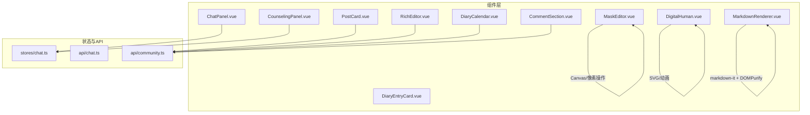
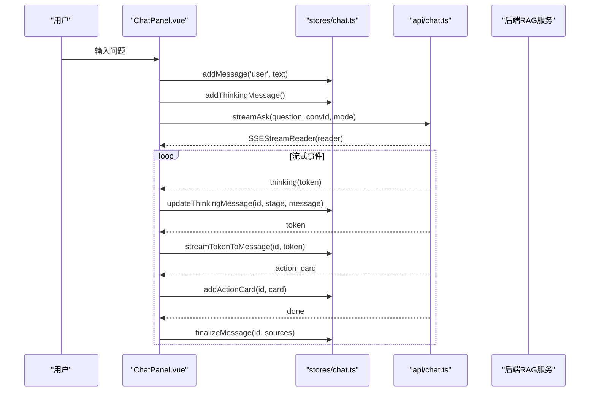
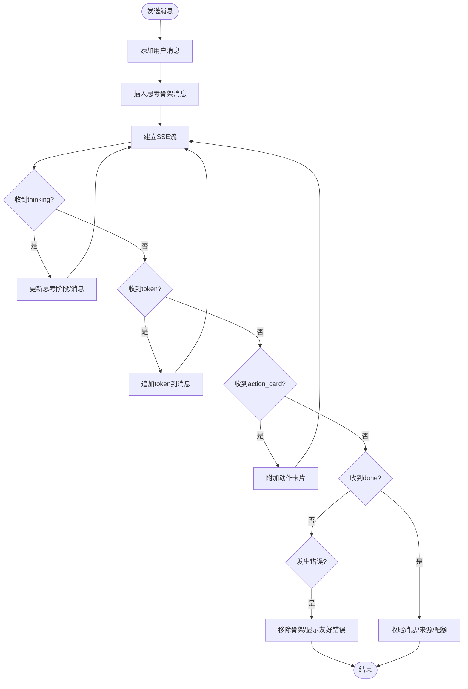
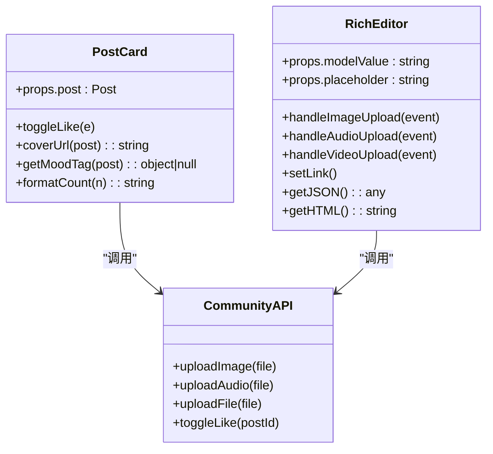
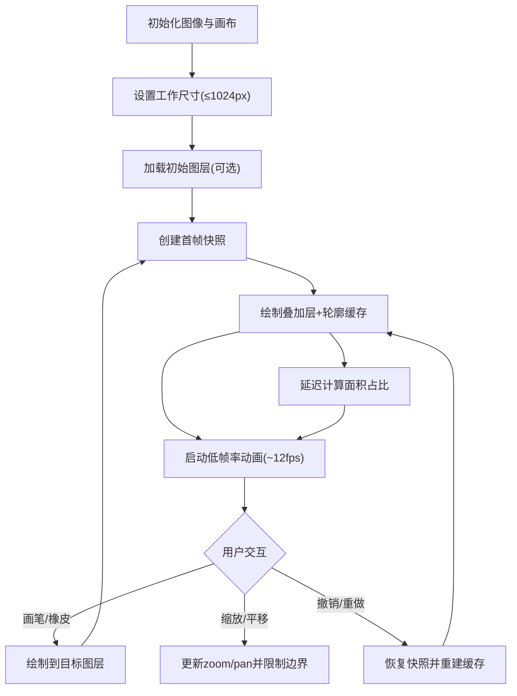
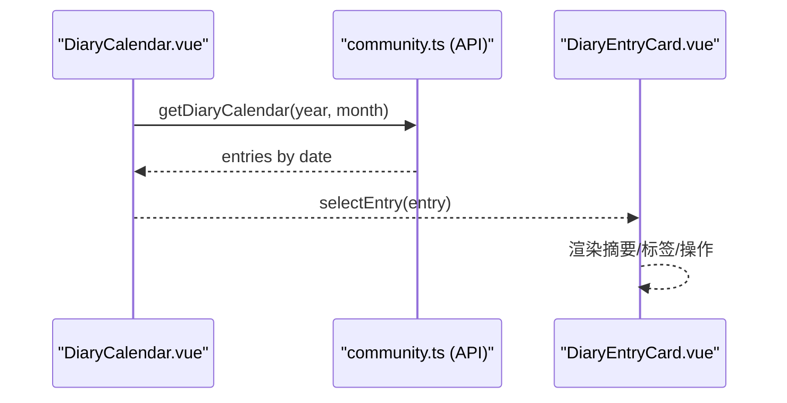
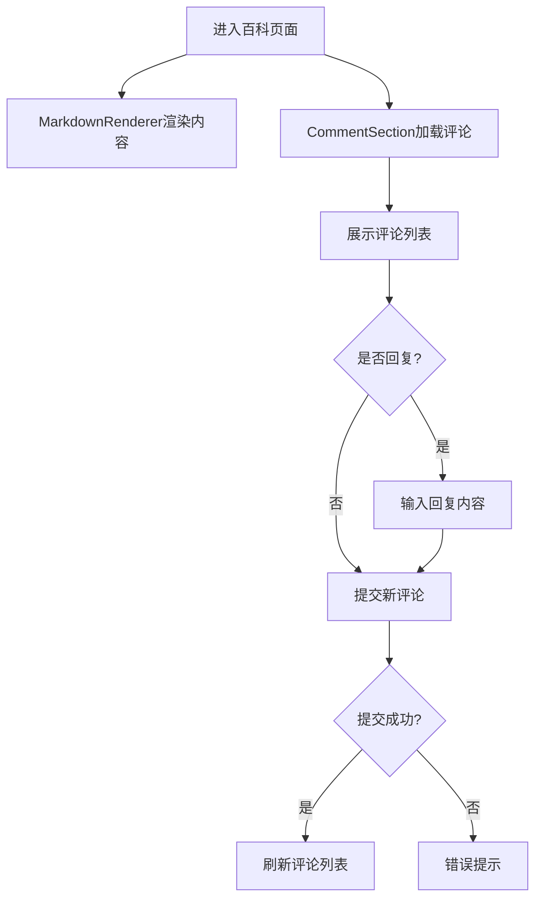
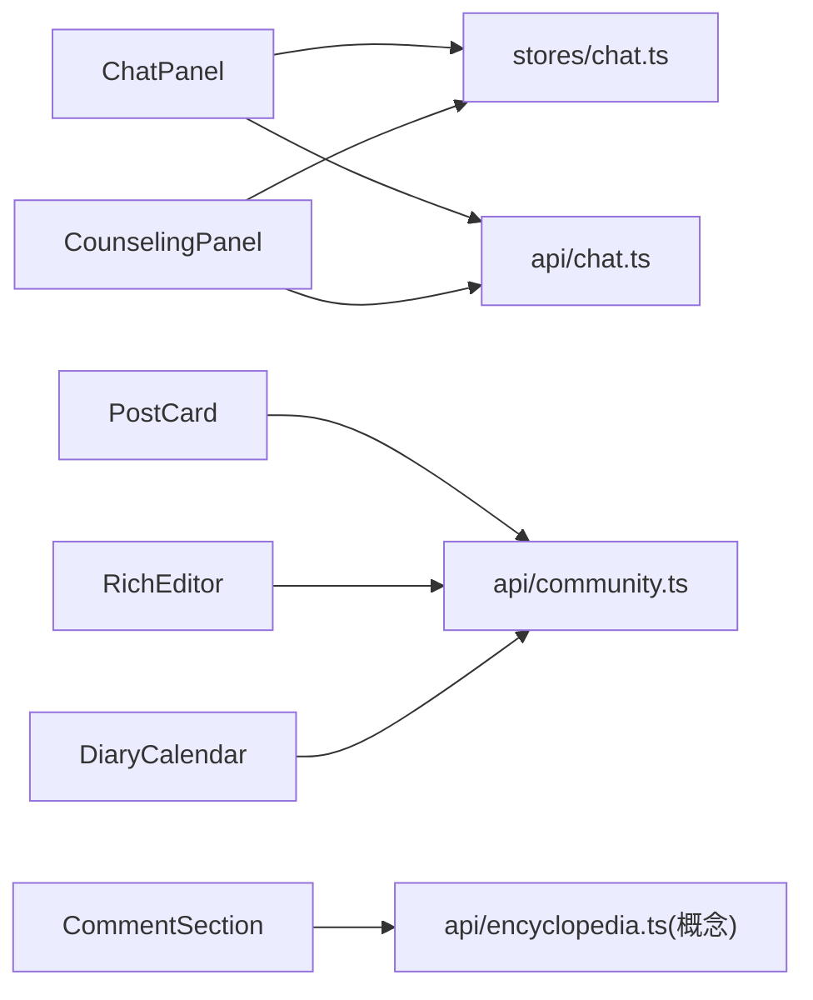

# 业务组件

<cite>
**本文引用的文件**   
- [ChatPanel.vue](file://web/app/src/components/assistant/ChatPanel.vue)
- [CounselingPanel.vue](file://web/app/src/components/assistant/CounselingPanel.vue)
- [PostCard.vue](file://web/app/src/components/community/PostCard.vue)
- [RichEditor.vue](file://web/app/src/components/community/RichEditor.vue)
- [MaskEditor.vue](file://web/app/src/components/tracker/MaskEditor.vue)
- [DigitalHuman.vue](file://web/app/src/components/tracker/DigitalHuman.vue)
- [DiaryCalendar.vue](file://web/app/src/components/community/DiaryCalendar.vue)
- [DiaryEntryCard.vue](file://web/app/src/components/diary/DiaryEntryCard.vue)
- [CommentSection.vue](file://web/app/src/components/encyclopedia/CommentSection.vue)
- [MarkdownRenderer.vue](file://web/app/src/components/encyclopedia/MarkdownRenderer.vue)
- [chat.ts](file://web/app/src/stores/chat.ts)
- [chat.ts (API)](file://web/app/src/api/chat.ts)
- [community.ts (API)](file://web/app/src/api/community.ts)
</cite>

## 目录
1. [简介](#简介)
2. [项目结构](#项目结构)
3. [核心组件](#核心组件)
4. [架构总览](#架构总览)
5. [详细组件分析](#详细组件分析)
6. [依赖关系分析](#依赖关系分析)
7. [性能考量](#性能考量)
8. [故障排查指南](#故障排查指南)
9. [结论](#结论)

## 简介
本文件聚焦 Subskin 前端应用中的关键业务组件，覆盖 AI 助手、社区内容、病情追踪与日记、百科评论与渲染等模块。文档从组件职责、数据流、状态管理、复杂交互逻辑与性能优化策略等方面展开，帮助读者快速理解并高效维护这些组件。

## 项目结构
- 组件按功能域组织在 web/app/src/components 下：assistant（AI 助手）、community（社区）、tracker（病情追踪）、diary（日记）、encyclopedia（百科）。
- 状态集中在 Pinia store（如 chat store），API 封装在 api 目录中，组件通过 API 调用后端服务。
- 典型数据流：组件触发事件 → API 层发起请求/建立 SSE 流 → Store 更新状态 → 视图响应式更新。

图表来源
- [ChatPanel.vue:1-156](file://web/app/src/components/assistant/ChatPanel.vue#L1-L156)
- [CounselingPanel.vue:1-158](file://web/app/src/components/assistant/CounselingPanel.vue#L1-L158)
- [PostCard.vue:1-184](file://web/app/src/components/community/PostCard.vue#L1-L184)
- [RichEditor.vue:1-703](file://web/app/src/components/community/RichEditor.vue#L1-L703)
- [MaskEditor.vue:1-800](file://web/app/src/components/tracker/MaskEditor.vue#L1-L800)
- [DigitalHuman.vue:1-325](file://web/app/src/components/tracker/DigitalHuman.vue#L1-L325)
- [DiaryCalendar.vue:1-202](file://web/app/src/components/community/DiaryCalendar.vue#L1-L202)
- [DiaryEntryCard.vue:1-252](file://web/app/src/components/diary/DiaryEntryCard.vue#L1-L252)
- [CommentSection.vue:1-154](file://web/app/src/components/encyclopedia/CommentSection.vue#L1-L154)
- [MarkdownRenderer.vue:1-84](file://web/app/src/components/encyclopedia/MarkdownRenderer.vue#L1-L84)
- [chat.ts:1-164](file://web/app/src/stores/chat.ts#L1-L164)
- [chat.ts (API):1-272](file://web/app/src/api/chat.ts#L1-L272)
- [community.ts (API):1-284](file://web/app/src/api/community.ts#L1-L284)

章节来源
- [ChatPanel.vue:1-156](file://web/app/src/components/assistant/ChatPanel.vue#L1-L156)
- [CounselingPanel.vue:1-158](file://web/app/src/components/assistant/CounselingPanel.vue#L1-L158)
- [PostCard.vue:1-184](file://web/app/src/components/community/PostCard.vue#L1-L184)
- [RichEditor.vue:1-703](file://web/app/src/components/community/RichEditor.vue#L1-L703)
- [MaskEditor.vue:1-800](file://web/app/src/components/tracker/MaskEditor.vue#L1-L800)
- [DigitalHuman.vue:1-325](file://web/app/src/components/tracker/DigitalHuman.vue#L1-L325)
- [DiaryCalendar.vue:1-202](file://web/app/src/components/community/DiaryCalendar.vue#L1-L202)
- [DiaryEntryCard.vue:1-252](file://web/app/src/components/diary/DiaryEntryCard.vue#L1-L252)
- [CommentSection.vue:1-154](file://web/app/src/components/encyclopedia/CommentSection.vue#L1-L154)
- [MarkdownRenderer.vue:1-84](file://web/app/src/components/encyclopedia/MarkdownRenderer.vue#L1-L84)
- [chat.ts:1-164](file://web/app/src/stores/chat.ts#L1-L164)
- [chat.ts (API):1-272](file://web/app/src/api/chat.ts#L1-L272)
- [community.ts (API):1-284](file://web/app/src/api/community.ts#L1-L284)

## 核心组件
- AI 助手组件
  - ChatPanel：支持知识问答的流式对话、思考阶段提示、动作卡片、历史会话切换、访客配额展示。
  - CounselingPanel：心理咨询对话、危机关键词检测与弹窗、正念呼吸与心情记录全屏遮罩。
- 社区功能组件
  - PostCard：瀑布流卡片，含封面图、情绪标签、私密标记、点赞交互、作者信息。
  - RichEditor：基于 Tiptap 的富文本编辑器，支持图片/音频/视频上传与自定义节点。
- 病情追踪组件
  - MaskEditor：双图层（皮肤/病灶）画布标注，缩放平移、撤销重做、轮廓 marching ants 动画、面积统计。
  - DigitalHuman：人体部位选择器，正面/背面视图切换，雨滴/扫描动效。
- 日记组件
  - DiaryCalendar：月度日历弹窗，按天聚合日记条目，类型图标与标签。
  - DiaryEntryCard：单条日记卡片，AI 摘要、多类标签、删除确认。
- 百科组件
  - CommentSection：文章评论列表与回复，登录校验与提交反馈。
  - MarkdownRenderer：markdown-it 渲染 + DOMPurify 安全清洗，Prose 样式。

章节来源
- [ChatPanel.vue:1-156](file://web/app/src/components/assistant/ChatPanel.vue#L1-L156)
- [CounselingPanel.vue:1-158](file://web/app/src/components/assistant/CounselingPanel.vue#L1-L158)
- [PostCard.vue:1-184](file://web/app/src/components/community/PostCard.vue#L1-L184)
- [RichEditor.vue:1-703](file://web/app/src/components/community/RichEditor.vue#L1-L703)
- [MaskEditor.vue:1-800](file://web/app/src/components/tracker/MaskEditor.vue#L1-L800)
- [DigitalHuman.vue:1-325](file://web/app/src/components/tracker/DigitalHuman.vue#L1-L325)
- [DiaryCalendar.vue:1-202](file://web/app/src/components/community/DiaryCalendar.vue#L1-L202)
- [DiaryEntryCard.vue:1-252](file://web/app/src/components/diary/DiaryEntryCard.vue#L1-L252)
- [CommentSection.vue:1-154](file://web/app/src/components/encyclopedia/CommentSection.vue#L1-L154)
- [MarkdownRenderer.vue:1-84](file://web/app/src/components/encyclopedia/MarkdownRenderer.vue#L1-L84)

## 架构总览
- 组件层负责 UI 与用户交互，通过 API 层与后端通信。
- 聊天相关使用 Pinia store 集中管理消息、会话与思考状态；社区与百科通过各自 API 直接返回数据。
- 流式交互由 SSEStreamReader 统一处理，组件订阅 onToken/onThinking/onActionCard/onDone 回调。

图表来源
- [ChatPanel.vue:1-156](file://web/app/src/components/assistant/ChatPanel.vue#L1-L156)
- [chat.ts:1-164](file://web/app/src/stores/chat.ts#L1-L164)
- [chat.ts (API):1-272](file://web/app/src/api/chat.ts#L1-L272)

## 详细组件分析

### AI 助手组件（ChatPanel、CounselingPanel）
- 数据流
  - 用户输入 → 本地添加用户消息 → 插入骨架思考消息 → 调用流式接口 → 逐 token 追加到消息 → 结束时补充来源与配额。
- 状态管理
  - 使用 Pinia chat store 维护 messages、conversationId、conversations；提供 addThinkingMessage/streamTokenToMessage/finalizeMessage 等方法。
- 错误处理
  - 对网络异常与后端错误进行友好文案转换，避免暴露内部异常类名；对额度用尽或限流进行特殊提示。
- 交互细节
  - 访客配额展示与登录引导；历史会话侧滑面板；动作卡片扩展点。

图表来源
- [ChatPanel.vue:1-156](file://web/app/src/components/assistant/ChatPanel.vue#L1-L156)
- [chat.ts:1-164](file://web/app/src/stores/chat.ts#L1-L164)
- [chat.ts (API):1-272](file://web/app/src/api/chat.ts#L1-L272)

章节来源
- [ChatPanel.vue:1-156](file://web/app/src/components/assistant/ChatPanel.vue#L1-L156)
- [CounselingPanel.vue:1-158](file://web/app/src/components/assistant/CounselingPanel.vue#L1-L158)
- [chat.ts:1-164](file://web/app/src/stores/chat.ts#L1-L164)
- [chat.ts (API):1-272](file://web/app/src/api/chat.ts#L1-L272)

### 社区功能组件（PostCard、RichEditor）
- PostCard
  - 展示封面图、类别占位渐变、情绪标签、私密标记、多图指示、医生认证标识。
  - 点赞交互：未登录弹出登录框；已登录调用 toggleLike 并乐观更新本地计数。
- RichEditor
  - 基于 Tiptap StarterKit，扩展 Image/Link/Placeholder/Underline，自定义 Audio/Video Node。
  - 媒体上传：图片/音频/视频分别调用 communityApi.uploadImage/uploadAudio/uploadFile，成功后插入对应节点。
  - 双向绑定：update:modelValue 输出 HTML，update:contentJson 输出 JSON 结构。

图表来源
- [PostCard.vue:1-184](file://web/app/src/components/community/PostCard.vue#L1-L184)
- [RichEditor.vue:1-703](file://web/app/src/components/community/RichEditor.vue#L1-L703)
- [community.ts (API):1-284](file://web/app/src/api/community.ts#L1-L284)

章节来源
- [PostCard.vue:1-184](file://web/app/src/components/community/PostCard.vue#L1-L184)
- [RichEditor.vue:1-703](file://web/app/src/components/community/RichEditor.vue#L1-L703)
- [community.ts (API):1-284](file://web/app/src/api/community.ts#L1-L284)

### 病情追踪组件（MaskEditor、DigitalHuman）
- MaskEditor
  - 双 Canvas 图层（皮肤/病灶），可擦除与互斥绘制；工作分辨率上限 1024px 以降低内存与 CPU 开销。
  - 缩放平移：鼠标滚轮、拖拽、双指捏合；视口边界限制。
  - 撤销重做：shallowRef 保存 ImageData 快照，限制最大步数。
  - 轮廓动画：预计算边缘像素，分两阶段离屏缓冲，降低每帧 draw 调用次数。
  - 面积统计：延迟计算区域占比，防抖避免主线程阻塞。
- DigitalHuman
  - SVG 人体部位映射，点击/键盘无障碍；正面/背面视图切换。
  - 雨滴/扫描动效：CSS 动画与定时器控制，生命周期清理。

图表来源
- [MaskEditor.vue:1-800](file://web/app/src/components/tracker/MaskEditor.vue#L1-L800)
- [DigitalHuman.vue:1-325](file://web/app/src/components/tracker/DigitalHuman.vue#L1-L325)

章节来源
- [MaskEditor.vue:1-800](file://web/app/src/components/tracker/MaskEditor.vue#L1-L800)
- [DigitalHuman.vue:1-325](file://web/app/src/components/tracker/DigitalHuman.vue#L1-L325)

### 日记组件（DiaryCalendar、DiaryEntryCard）
- DiaryCalendar
  - 按月拉取日记条目，生成日历网格；选中日期后列出该日条目，支持类型图标与标签。
- DiaryEntryCard
  - 展示日期、摘要/原文、AI 提取标签（心情/睡眠/用药/压力/患处），支持删除确认。

图表来源
- [DiaryCalendar.vue:1-202](file://web/app/src/components/community/DiaryCalendar.vue#L1-L202)
- [DiaryEntryCard.vue:1-252](file://web/app/src/components/diary/DiaryEntryCard.vue#L1-L252)
- [community.ts (API):1-284](file://web/app/src/api/community.ts#L1-L284)

章节来源
- [DiaryCalendar.vue:1-202](file://web/app/src/components/community/DiaryCalendar.vue#L1-L202)
- [DiaryEntryCard.vue:1-252](file://web/app/src/components/diary/DiaryEntryCard.vue#L1-L252)
- [community.ts (API):1-284](file://web/app/src/api/community.ts#L1-L284)

### 百科组件（CommentSection、MarkdownRenderer）
- CommentSection
  - 加载评论列表，支持回复与提交；登录校验与错误提示。
- MarkdownRenderer
  - markdown-it 启用 html/linkify/typographer/breaks，配合 anchor 插件；DOMPurify 清洗 XSS；Prose 样式适配。

图表来源
- [CommentSection.vue:1-154](file://web/app/src/components/encyclopedia/CommentSection.vue#L1-L154)
- [MarkdownRenderer.vue:1-84](file://web/app/src/components/encyclopedia/MarkdownRenderer.vue#L1-L84)

章节来源
- [CommentSection.vue:1-154](file://web/app/src/components/encyclopedia/CommentSection.vue#L1-L154)
- [MarkdownRenderer.vue:1-84](file://web/app/src/components/encyclopedia/MarkdownRenderer.vue#L1-L84)

## 依赖关系分析
- 组件与 API
  - ChatPanel/CounselingPanel 依赖 chat API（SSE 流式）与 chat store。
  - PostCard/RichEditor/DiaryCalendar 依赖 community API。
  - CommentSection 依赖 encyclopedia API（评论接口）。
- 组件间耦合
  - 聊天组件共享 chat store，避免重复状态。
  - 社区编辑与展示通过统一的 Post 类型与 API 契约解耦。
  - 病情追踪组件独立于社区与百科，专注 Canvas/SVG 交互。

图表来源
- [chat.ts:1-164](file://web/app/src/stores/chat.ts#L1-L164)
- [chat.ts (API):1-272](file://web/app/src/api/chat.ts#L1-L272)
- [community.ts (API):1-284](file://web/app/src/api/community.ts#L1-L284)
- [ChatPanel.vue:1-156](file://web/app/src/components/assistant/ChatPanel.vue#L1-L156)
- [CounselingPanel.vue:1-158](file://web/app/src/components/assistant/CounselingPanel.vue#L1-L158)
- [PostCard.vue:1-184](file://web/app/src/components/community/PostCard.vue#L1-L184)
- [RichEditor.vue:1-703](file://web/app/src/components/community/RichEditor.vue#L1-L703)
- [DiaryCalendar.vue:1-202](file://web/app/src/components/community/DiaryCalendar.vue#L1-L202)
- [CommentSection.vue:1-154](file://web/app/src/components/encyclopedia/CommentSection.vue#L1-L154)

章节来源
- [chat.ts:1-164](file://web/app/src/stores/chat.ts#L1-L164)
- [chat.ts (API):1-272](file://web/app/src/api/chat.ts#L1-L272)
- [community.ts (API):1-284](file://web/app/src/api/community.ts#L1-L284)
- [ChatPanel.vue:1-156](file://web/app/src/components/assistant/ChatPanel.vue#L1-L156)
- [CounselingPanel.vue:1-158](file://web/app/src/components/assistant/CounselingPanel.vue#L1-L158)
- [PostCard.vue:1-184](file://web/app/src/components/community/PostCard.vue#L1-L184)
- [RichEditor.vue:1-703](file://web/app/src/components/community/RichEditor.vue#L1-L703)
- [DiaryCalendar.vue:1-202](file://web/app/src/components/community/DiaryCalendar.vue#L1-L202)
- [CommentSection.vue:1-154](file://web/app/src/components/encyclopedia/CommentSection.vue#L1-L154)

## 性能考量
- 聊天流式渲染
  - 使用 SSE 流式传输，逐 token 更新，减少等待时间；store 中 sanitizeAssistantText 防止敏感信息泄露。
- 富文本编辑器
  - 自定义 Audio/Video Node 避免额外解析开销；上传前大小校验与类型校验，失败即时反馈。
- 病情追踪
  - 工作分辨率上限 1024px，显著降低内存占用与像素遍历成本；shallowRef 存储 ImageData 避免深度代理；轮廓动画采用离屏缓冲与低帧率（~12fps）；面积计算延迟与防抖。
- 百科渲染
  - markdown-it 开启必要特性，DOMPurify 一次性清洗，避免运行时多次解析。
- 日历与卡片
  - 懒加载与按需渲染，避免长列表卡顿；数字格式化与相对时间计算轻量实现。

[本节为通用指导，不直接分析具体文件]

## 故障排查指南
- 聊天组件
  - 若出现“额度用尽/限流”提示，检查访客配额与登录态；查看 SSE 流 onError 回调与 toFriendlyError 转换逻辑。
  - 若回答包含异常类名，确认 sanitizeAssistantText 是否正确剥离。
- 社区上传
  - 图片/音频/视频上传失败时，检查文件大小与类型限制；确认 communityApi 对应端点返回字段。
- 百科评论
  - 未登录无法提交评论，需先登录；提交失败时读取 response.detail 提示。
- 病情追踪
  - 画布空白或错位：检查容器尺寸与 zoomToFit 重试逻辑；确认 willReadFrequently 上下文使用正确。

章节来源
- [chat.ts (API):1-272](file://web/app/src/api/chat.ts#L1-L272)
- [community.ts (API):1-284](file://web/app/src/api/community.ts#L1-L284)
- [CommentSection.vue:1-154](file://web/app/src/components/encyclopedia/CommentSection.vue#L1-L154)
- [MaskEditor.vue:1-800](file://web/app/src/components/tracker/MaskEditor.vue#L1-L800)

## 结论
Subskin 的业务组件围绕清晰的数据流与状态管理构建：聊天模块通过 SSE 流与 Pinia store 实现实时交互；社区模块以富文本与卡片为核心，强调内容与互动；病情追踪模块在高性能 Canvas/SVG 上实现专业标注与可视化；日记与百科模块则注重可读性与安全性。整体设计兼顾用户体验与性能，便于后续扩展与维护。