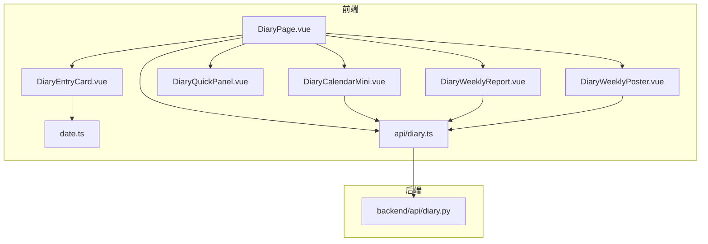
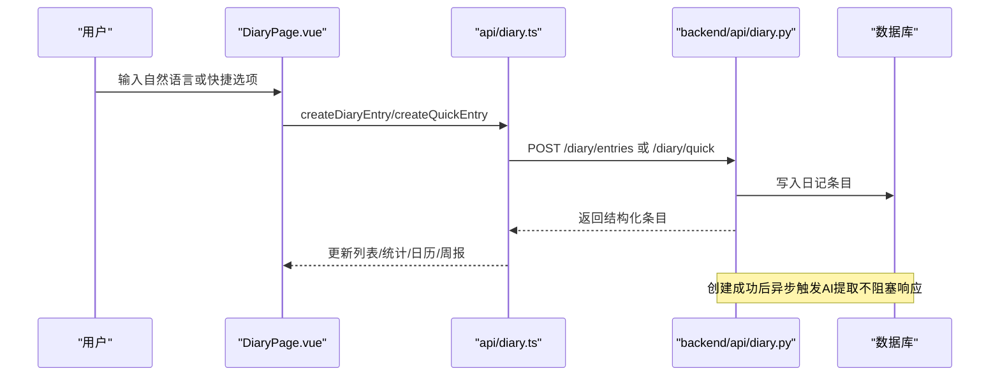
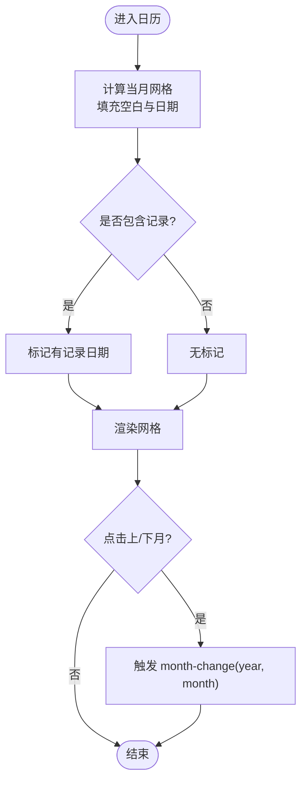
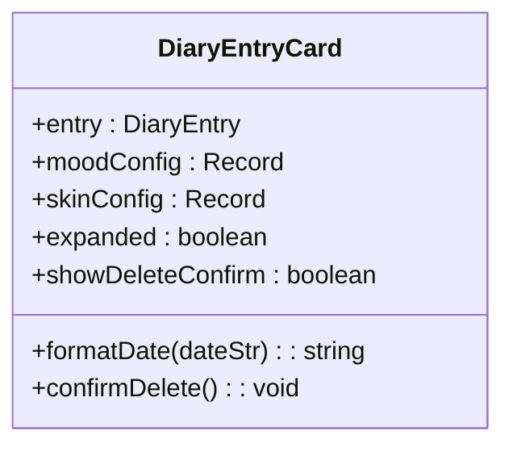
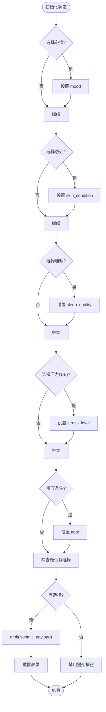
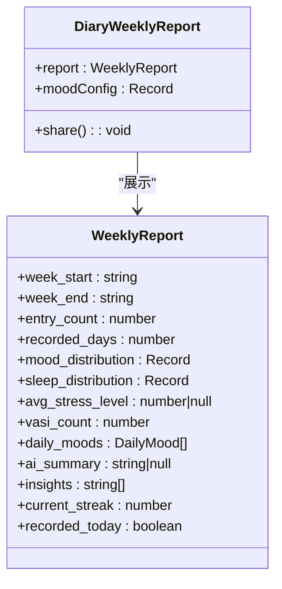
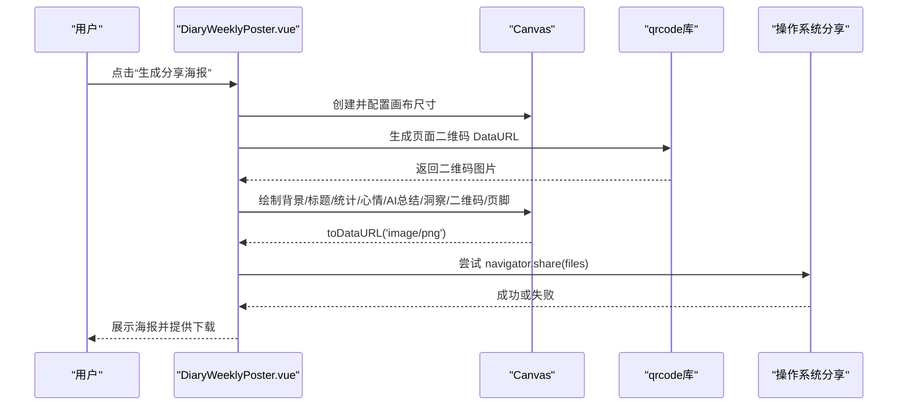
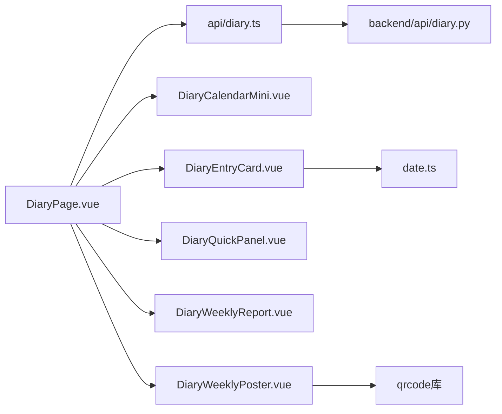
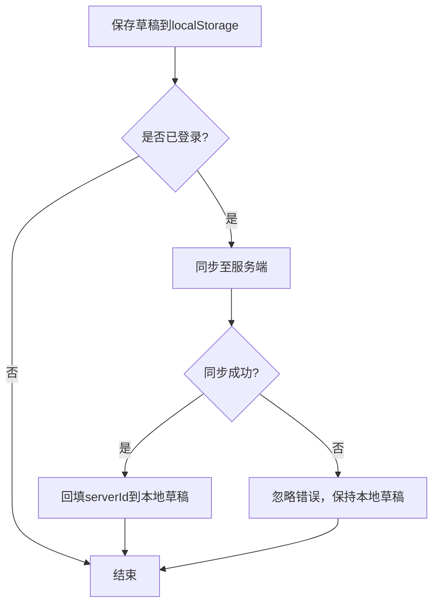

# 日记组件

<cite>
**本文引用的文件**   
- [DiaryPage.vue](file://web/app/src/views/DiaryPage.vue)
- [diary.ts](file://web/app/src/api/diary.ts)
- [diary.py](file://web/backend/api/diary.py)
- [DiaryCalendarMini.vue](file://web/app/src/components/diary/DiaryCalendarMini.vue)
- [DiaryEntryCard.vue](file://web/app/src/components/diary/DiaryEntryCard.vue)
- [DiaryQuickPanel.vue](file://web/app/src/components/diary/DiaryQuickPanel.vue)
- [DiaryWeeklyReport.vue](file://web/app/src/components/diary/DiaryWeeklyReport.vue)
- [DiaryWeeklyPoster.vue](file://web/app/src/components/diary/DiaryWeeklyPoster.vue)
- [date.ts](file://web/app/src/utils/date.ts)
</cite>

## 目录
1. [简介](#简介)
2. [项目结构](#项目结构)
3. [核心组件](#核心组件)
4. [架构总览](#架构总览)
5. [详细组件分析](#详细组件分析)
6. [依赖关系分析](#依赖关系分析)
7. [性能与渲染](#性能与渲染)
8. [本地存储与数据同步](#本地存储与数据同步)
9. [移动端适配方案](#移动端适配方案)
10. [故障排查指南](#故障排查指南)
11. [结论](#结论)

## 简介
本文件为 Subskin 项目的“日记”模块提供完整的技术与使用文档，覆盖以下关键能力：
- 日历视图（DiaryCalendarMini）的日期选择与月份切换逻辑
- 日记条目卡片（DiaryEntryCard）的展示设计与交互
- 快捷面板（DiaryQuickPanel）的一键记录体验
- 周报生成（DiaryWeeklyPoster）的海报绘制与分享流程
- 周报统计与可视化（DiaryWeeklyReport）的数据结构与展示
- 前端数据模型、后端 API、时间解析工具、图表/海报渲染技术
- 本地存储策略与数据同步机制（适用于草稿等场景）
- 移动端适配与可访问性要点

## 项目结构
日记功能由“前端页面 + 组件 + API 类型定义 + 后端 FastAPI 路由”组成。核心文件分布如下：
- 页面与编排：web/app/src/views/DiaryPage.vue
- 组件：
  - web/app/src/components/diary/DiaryCalendarMini.vue
  - web/app/src/components/diary/DiaryEntryCard.vue
  - web/app/src/components/diary/DiaryQuickPanel.vue
  - web/app/src/components/diary/DiaryWeeklyReport.vue
  - web/app/src/components/diary/DiaryWeeklyPoster.vue
- 前端 API 与类型：web/app/src/api/diary.ts
- 后端 API：web/backend/api/diary.py
- 时间工具：web/app/src/utils/date.ts

**图示来源** 
- [DiaryPage.vue:1-80](file://web/app/src/views/DiaryPage.vue#L1-L80)
- [diary.ts:1-141](file://web/app/src/api/diary.ts#L1-L141)
- [diary.py:1-120](file://web/backend/api/diary.py#L1-L120)

**章节来源**
- [DiaryPage.vue:1-80](file://web/app/src/views/DiaryPage.vue#L1-L80)
- [diary.ts:1-141](file://web/app/src/api/diary.ts#L1-L141)
- [diary.py:1-120](file://web/backend/api/diary.py#L1-L120)

## 核心组件
- DiaryCalendarMini：迷你日历，展示当月有记录的日期点，支持左右翻页切换月份，触发父级加载对应月份数据。
- DiaryEntryCard：单条日记卡片，展示日期、摘要/原文、AI 标签（心情/睡眠/用药/压力/患处），支持展开/收起与删除确认。
- DiaryQuickPanel：快捷记录面板，通过按钮一键选择心情、患处、睡眠、压力并可选备注，提交后生成结构化条目。
- DiaryWeeklyReport：周报卡片，汇总本周记录天数、日记条数、连续天数、心情分布、睡眠/压力概况、VASI 评估次数、AI 总结与洞察。
- DiaryWeeklyPoster：周报海报生成器，基于 Canvas 绘制 PNG，支持下载与系统分享（微信环境特殊处理）。

**章节来源**
- [DiaryCalendarMini.vue:1-105](file://web/app/src/components/diary/DiaryCalendarMini.vue#L1-L105)
- [DiaryEntryCard.vue:1-105](file://web/app/src/components/diary/DiaryEntryCard.vue#L1-L105)
- [DiaryQuickPanel.vue:1-154](file://web/app/src/components/diary/DiaryQuickPanel.vue#L1-L154)
- [DiaryWeeklyReport.vue:1-198](file://web/app/src/components/diary/DiaryWeeklyReport.vue#L1-L198)
- [DiaryWeeklyPoster.vue:1-120](file://web/app/src/components/diary/DiaryWeeklyPoster.vue#L1-L120)

## 架构总览
日记模块采用前后端分离架构：
- 前端通过 api/diary.ts 调用后端 /diary/* 接口，完成 CRUD、日历聚合、周报统计与统计概览。
- 后端在 diary.py 中实现业务逻辑：创建条目时异步触发 AI 结构化提取；快速记录直接构造结构化字段；日历按天聚合；周报计算分布、均值、连续天数，并尝试 LLM 生成摘要（带内存缓存与降级）。

**图示来源** 
- [DiaryPage.vue:136-177](file://web/app/src/views/DiaryPage.vue#L136-L177)
- [diary.ts:85-130](file://web/app/src/api/diary.ts#L85-L130)
- [diary.py:172-224](file://web/backend/api/diary.py#L172-L224)

## 详细组件分析

### 日历组件（DiaryCalendarMini）
- 日期选择与月份切换：
  - 根据传入的 CalendarResponse 计算当月网格，标记有记录的日期点。
  - 点击上月/下月按钮触发 month-change 事件，父组件重新请求该年月的日历数据。
- 视觉反馈：当天高亮、有记录日加底色与圆点。

**图示来源** 
- [DiaryCalendarMini.vue:19-66](file://web/app/src/components/diary/DiaryCalendarMini.vue#L19-L66)

**章节来源**
- [DiaryCalendarMini.vue:1-105](file://web/app/src/components/diary/DiaryCalendarMini.vue#L1-L105)

### 日记条目卡片（DiaryEntryCard）
- 展示设计：
  - 头部显示日期与操作区（快捷标签、删除按钮）。
  - 正文优先显示 AI 摘要，未展开时折叠；展开后可查看原始文本。
  - 标签行展示心情、睡眠、患处、用药、压力、饮食等结构化信息。
- 交互逻辑：
  - 点击卡片展开/收起。
  - 删除按钮二次确认，确认后触发 delete 事件。

**图示来源** 
- [DiaryEntryCard.vue:10-43](file://web/app/src/components/diary/DiaryEntryCard.vue#L10-L43)

**章节来源**
- [DiaryEntryCard.vue:1-105](file://web/app/src/components/diary/DiaryEntryCard.vue#L1-L105)

### 快捷面板（DiaryQuickPanel）
- 交互体验：
  - 心情、患处、睡眠以图标+文字按钮选择，压力为 1-5 数字按钮。
  - 可选备注输入框，长度限制。
  - 提交前校验至少有一项选择，否则禁用提交按钮。
- 数据提交：
  - 将选中项组装为 payload，触发 submit 事件，由父组件调用后端快捷记录接口。

**图示来源** 
- [DiaryQuickPanel.vue:39-62](file://web/app/src/components/diary/DiaryQuickPanel.vue#L39-L62)

**章节来源**
- [DiaryQuickPanel.vue:1-154](file://web/app/src/components/diary/DiaryQuickPanel.vue#L1-L154)

### 周报报告（DiaryWeeklyReport）
- 数据展示：
  - 顶部统计：记录天数、日记条数、连续天数。
  - 心情轨迹（7 天）、心情分布、睡眠分布、平均压力、VASI 评估次数。
  - AI 总结与洞察列表。
- 交互：
  - 点击分享按钮触发 share 事件，打开海报弹窗。

**图示来源** 
- [diary.ts:67-81](file://web/app/src/api/diary.ts#L67-L81)
- [DiaryWeeklyReport.vue:1-198](file://web/app/src/components/diary/DiaryWeeklyReport.vue#L1-L198)

**章节来源**
- [DiaryWeeklyReport.vue:1-198](file://web/app/src/components/diary/DiaryWeeklyReport.vue#L1-L198)

### 周报海报（DiaryWeeklyPoster）
- 生成流程：
  - 监听 visible 变化，打开时隐藏滚动并生成海报。
  - 使用 Canvas 绘制标题、统计、心情轨迹、AI 总结、洞察、二维码与页脚。
  - 生成完成后提供下载与系统分享（微信环境提示长按保存）。
- 技术要点：
  - 字体与换行测量：使用 Canvas measureText 进行中文换行。
  - 二维码：qrcode 库生成 DataURL 后绘制到 Canvas。
  - 分享：navigator.share(files) 检测可用性，失败回退到下载。

**图示来源** 
- [DiaryWeeklyPoster.vue:75-137](file://web/app/src/components/diary/DiaryWeeklyPoster.vue#L75-L137)
- [DiaryWeeklyPoster.vue:339-361](file://web/app/src/components/diary/DiaryWeeklyPoster.vue#L339-L361)

**章节来源**
- [DiaryWeeklyPoster.vue:1-450](file://web/app/src/components/diary/DiaryWeeklyPoster.vue#L1-L450)

## 依赖关系分析
- 前端依赖：
  - DiaryPage.vue 依赖所有日记组件与 api/diary.ts。
  - DiaryEntryCard.vue 依赖 date.ts 的时间解析。
  - DiaryWeeklyPoster.vue 依赖 qrcode 库与 Canvas API。
- 后端依赖：
  - diary.py 依赖 SQLAlchemy ORM、Pydantic 模型、认证服务与数据库会话。
  - 周报接口依赖 LLM 摘要服务（失败降级为拼接摘要）。

**图示来源** 
- [DiaryPage.vue:1-80](file://web/app/src/views/DiaryPage.vue#L1-L80)
- [diary.ts:1-141](file://web/app/src/api/diary.ts#L1-L141)
- [diary.py:1-120](file://web/backend/api/diary.py#L1-L120)

**章节来源**
- [DiaryPage.vue:1-80](file://web/app/src/views/DiaryPage.vue#L1-L80)
- [diary.ts:1-141](file://web/app/src/api/diary.ts#L1-L141)
- [diary.py:1-120](file://web/backend/api/diary.py#L1-L120)

## 性能与渲染
- 日历渲染：
  - 使用 Map 构建日期映射，O(n) 遍历生成网格，避免重复 DOM 操作。
- 周报生成：
  - Canvas 绘制集中在可见区域，控制最大行数与段落长度，减少重绘。
  - 二维码生成在后台线程执行，避免阻塞 UI。
- 时间解析：
  - date.ts 统一处理 date-only、无时区 datetime、带时区时间戳，避免 UTC+8 偏移问题。

**章节来源**
- [DiaryCalendarMini.vue:19-45](file://web/app/src/components/diary/DiaryCalendarMini.vue#L19-L45)
- [DiaryWeeklyPoster.vue:54-73](file://web/app/src/components/diary/DiaryWeeklyPoster.vue#L54-L73)
- [date.ts:24-45](file://web/app/src/utils/date.ts#L24-L45)

## 本地存储与数据同步
- 草稿存储策略（通用模式，适用于社区内容等）：
  - 使用 localStorage 持久化草稿对象，包含类型、标题、内容、图片、标签、情绪等元数据。
  - 支持本地与服务器草稿合并去重，保留最新时间戳版本。
  - 登录状态下自动同步至服务端，成功后回填 serverId 以便后续更新而非重复创建。
- 日记模块当前未直接使用此草稿机制，但可在未来扩展“草稿式记录”以提升断网容错与编辑体验。

**图示来源** 
- [useDrafts.ts:123-170](file://web/app/src/composables/useDrafts.ts#L123-L170)
- [useDrafts.ts:258-290](file://web/app/src/composables/useDrafts.ts#L258-L290)

**章节来源**
- [useDrafts.ts:123-170](file://web/app/src/composables/useDrafts.ts#L123-L170)
- [useDrafts.ts:258-290](file://web/app/src/composables/useDrafts.ts#L258-L290)

## 移动端适配方案
- 布局与样式：
  - 使用 Tailwind 类名与 CSS 变量，确保暗色模式与主题一致性。
  - 海报弹窗 max-w-[375px] 适配手机预览，宽屏居中展示。
- 交互优化：
  - 快捷面板按钮大小与间距适合触摸操作。
  - 删除按钮二次确认，防止误删。
- 分享兼容：
  - 微信环境提示长按保存，非微信环境尝试系统分享 API，失败回退下载。

**章节来源**
- [DiaryWeeklyPoster.vue:384-449](file://web/app/src/components/diary/DiaryWeeklyPoster.vue#L384-L449)
- [DiaryQuickPanel.vue:156-296](file://web/app/src/components/diary/DiaryQuickPanel.vue#L156-L296)

## 故障排查指南
- 时间显示异常：
  - 检查 date.ts 的 parseDate 是否正确处理 date-only 字符串，避免 UTC 偏移导致“X小时前”错误。
- 周报摘要为空：
  - 后端 LLM 调用失败会降级为拼接摘要，检查日志与缓存清理逻辑。
- 海报生成失败：
  - 检查 Canvas 上下文获取、字体加载、二维码生成与跨域资源加载。
- 快捷记录无效：
  - 确认至少选择一项（心情/患处/睡眠/压力/备注），否则提交按钮禁用。

**章节来源**
- [date.ts:24-45](file://web/app/src/utils/date.ts#L24-L45)
- [diary.py:431-450](file://web/backend/api/diary.py#L431-L450)
- [DiaryWeeklyPoster.vue:332-337](file://web/app/src/components/diary/DiaryWeeklyPoster.vue#L332-L337)
- [DiaryQuickPanel.vue:39-62](file://web/app/src/components/diary/DiaryQuickPanel.vue#L39-L62)

## 结论
日记模块通过清晰的组件划分与前后端职责分离，实现了从自然语言/快捷输入到结构化记录、日历聚合、周报统计与海报分享的完整闭环。时间解析、Canvas 渲染与分享兼容性均做了针对性优化。未来可扩展草稿机制与离线缓存，进一步提升用户体验与鲁棒性。