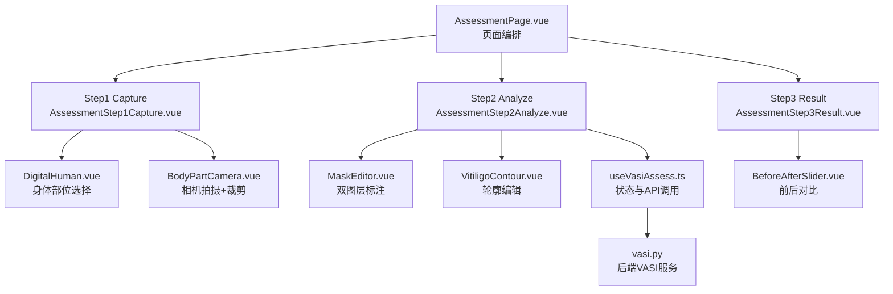
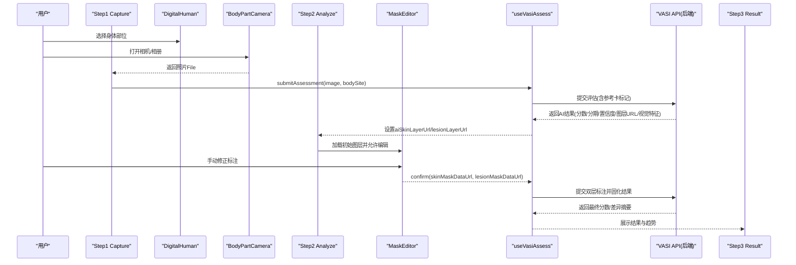
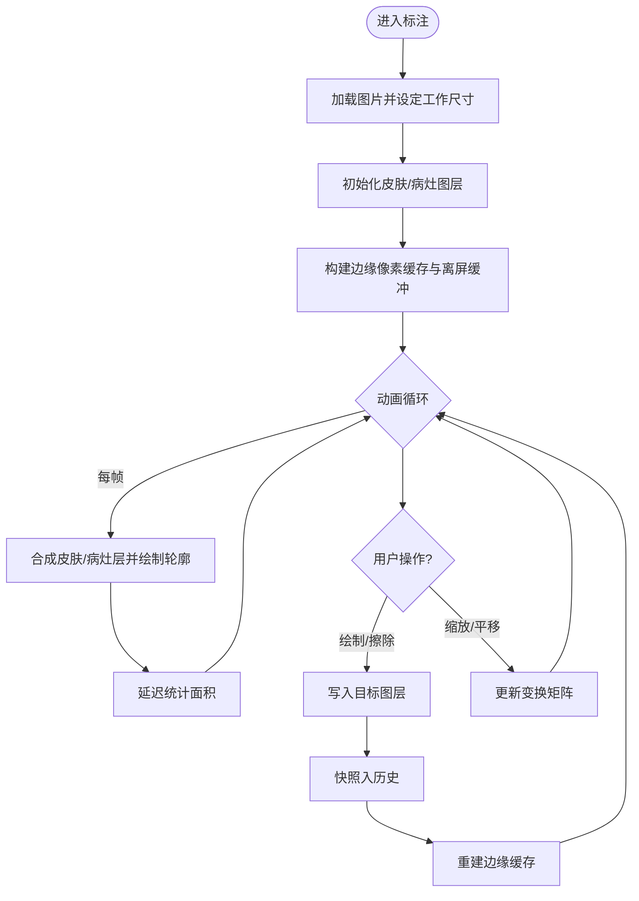
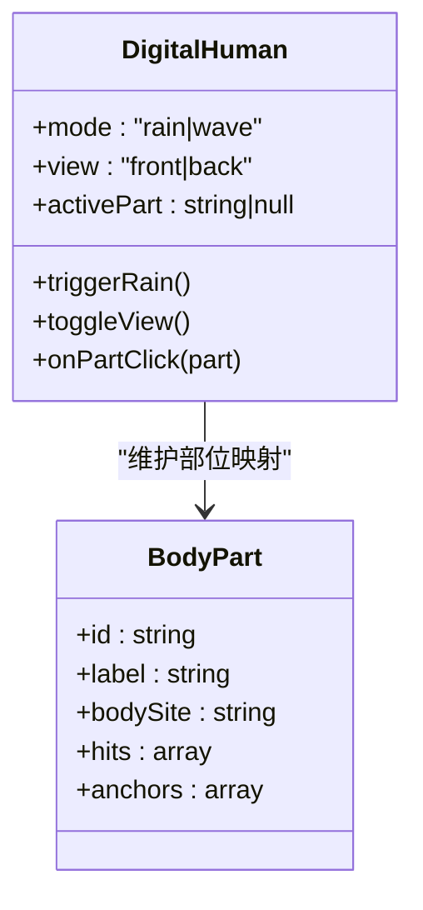
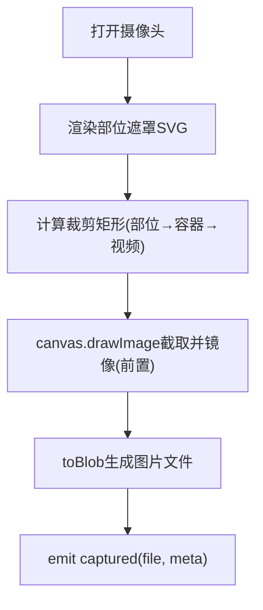
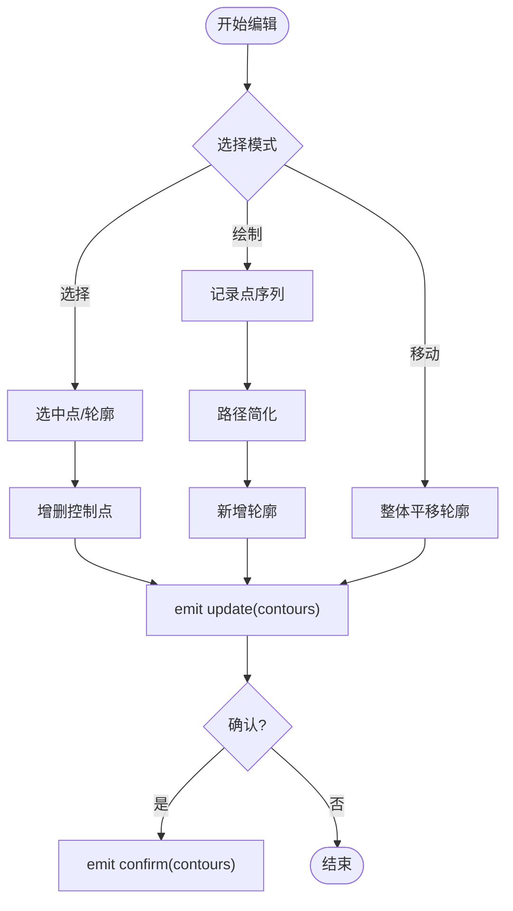
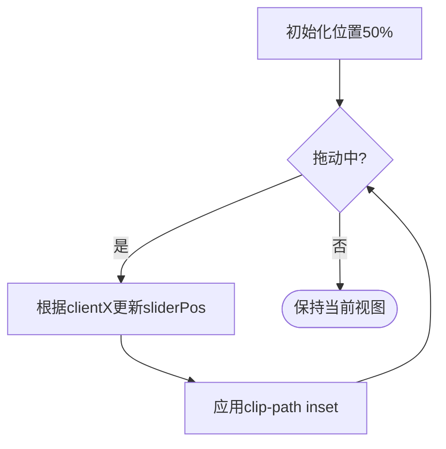
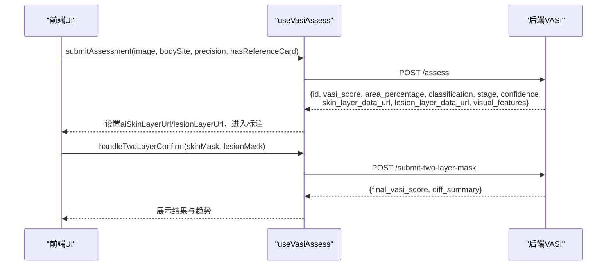
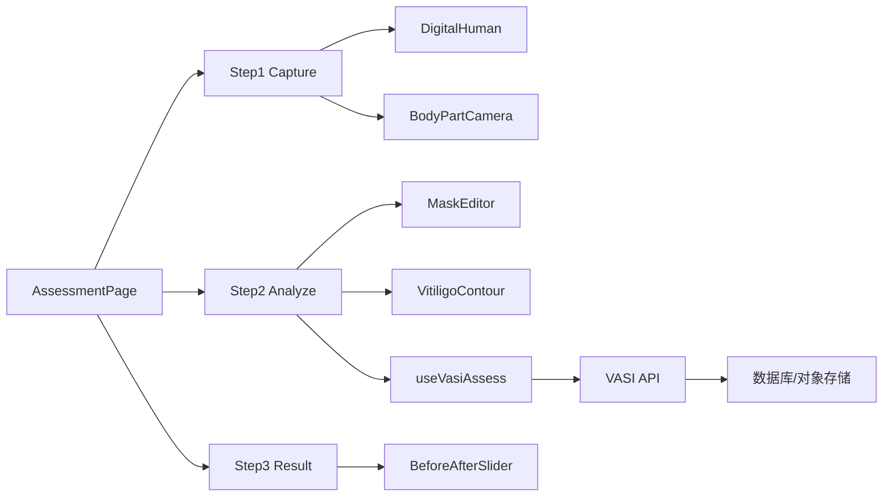

# 病情追踪组件

<cite>
**本文引用的文件**
- [AssessmentPage.vue](file://web/app/src/views/AssessmentPage.vue)
- [AssessmentStep1Capture.vue](file://web/app/src/components/tracker/AssessmentStep1Capture.vue)
- [AssessmentStep2Analyze.vue](file://web/app/src/components/tracker/AssessmentStep2Analyze.vue)
- [AssessmentStep3Result.vue](file://web/app/src/components/tracker/AssessmentStep3Result.vue)
- [MaskEditor.vue](file://web/app/src/components/tracker/MaskEditor.vue)
- [DigitalHuman.vue](file://web/app/src/components/tracker/DigitalHuman.vue)
- [BodyPartCamera.vue](file://web/app/src/components/tracker/BodyPartCamera.vue)
- [VitiligoContour.vue](file://web/app/src/components/tracker/VitiligoContour.vue)
- [BeforeAfterSlider.vue](file://web/app/src/components/tracker/BeforeAfterSlider.vue)
- [useVasiAssess.ts](file://web/app/src/composables/useVasiAssess.ts)
- [vasi.py](file://web/backend/services/vasi.py)
- [vasi_param_optimizer.py](file://web/backend/services/vasi_param_optimizer.py)
- [SKILL.md（3D模型工作）](file://.agents/skills/3d-model-work/SKILL.md)
</cite>

## 目录
1. [简介](#简介)
2. [项目结构](#项目结构)
3. [核心组件](#核心组件)
4. [架构总览](#架构总览)
5. [详细组件分析](#详细组件分析)
6. [依赖关系分析](#依赖关系分析)
7. [性能考量](#性能考量)
8. [故障排查指南](#故障排查指南)
9. [结论](#结论)
10. [附录](#附录)

## 简介
本文件面向Subskin项目的“病情追踪”模块，聚焦以下能力：
- MaskEditor图像标注工具的核心算法与交互实现
- DigitalHuman身体部位选择与渲染机制
- VASI评估流程三步骤（Capture、Analyze、Result）的数据流转
- VitiligoContour白斑轮廓绘制、BodyPartCamera身体部位拍照、BeforeAfterSlider前后对比滑块的技术细节
- Canvas操作、图像处理、移动端适配与医疗级精度要求
- 完整的评估工作流与数据处理管道说明

## 项目结构
病情追踪相关的前端组件集中在 web/app/src/components/tracker 下，编排入口在 AssessmentPage.vue；后端服务位于 web/backend/services/vasi.py。

图表来源
- [AssessmentPage.vue:108-145](file://web/app/src/views/AssessmentPage.vue#L108-L145)
- [AssessmentStep1Capture.vue:1-150](file://web/app/src/components/tracker/AssessmentStep1Capture.vue#L1-L150)
- [AssessmentStep2Analyze.vue:1-97](file://web/app/src/components/tracker/AssessmentStep2Analyze.vue#L1-L97)
- [AssessmentStep3Result.vue:1-119](file://web/app/src/components/tracker/AssessmentStep3Result.vue#L1-L119)
- [MaskEditor.vue:1-120](file://web/app/src/components/tracker/MaskEditor.vue#L1-L120)
- [DigitalHuman.vue:1-170](file://web/app/src/components/tracker/DigitalHuman.vue#L1-L170)
- [BodyPartCamera.vue:1-280](file://web/app/src/components/tracker/BodyPartCamera.vue#L1-L280)
- [VitiligoContour.vue:1-230](file://web/app/src/components/tracker/VitiligoContour.vue#L1-L230)
- [BeforeAfterSlider.vue:1-104](file://web/app/src/components/tracker/BeforeAfterSlider.vue#L1-L104)
- [useVasiAssess.ts:1-186](file://web/app/src/composables/useVasiAssess.ts#L1-L186)
- [vasi.py:218-241](file://web/backend/services/vasi.py#L218-L241)

章节来源
- [AssessmentPage.vue:108-145](file://web/app/src/views/AssessmentPage.vue#L108-L145)
- [AssessmentStep1Capture.vue:1-150](file://web/app/src/components/tracker/AssessmentStep1Capture.vue#L1-L150)
- [AssessmentStep2Analyze.vue:1-97](file://web/app/src/components/tracker/AssessmentStep2Analyze.vue#L1-L97)
- [AssessmentStep3Result.vue:1-119](file://web/app/src/components/tracker/AssessmentStep3Result.vue#L1-L119)

## 核心组件
- MaskEditor：基于HTML5 Canvas的双图层（皮肤层/病灶层）标注，支持缩放平移、撤销重做、动画轮廓描边、面积统计与导出合成图。
- DigitalHuman：SVG人体示意图，提供正面/背面切换、部位点击事件、雨/波动画效果，用于引导用户选择拍摄部位。
- BodyPartCamera：调用设备摄像头，按部位生成遮罩提示框，计算并裁剪对应区域，输出高质量图片。
- VitiligoContour：SVG叠加的轮廓编辑器，支持手绘、拖拽控制点、整体移动、简化路径与多区域管理。
- BeforeAfterSlider：通过clip-path实现前后对比滑动查看。
- useVasiAssess：封装上传、AI分析、标注确认、结果持久化等状态与API调用。

章节来源
- [MaskEditor.vue:1-120](file://web/app/src/components/tracker/MaskEditor.vue#L1-L120)
- [DigitalHuman.vue:1-170](file://web/app/src/components/tracker/DigitalHuman.vue#L1-L170)
- [BodyPartCamera.vue:1-280](file://web/app/src/components/tracker/BodyPartCamera.vue#L1-L280)
- [VitiligoContour.vue:1-230](file://web/app/src/components/tracker/VitiligoContour.vue#L1-L230)
- [BeforeAfterSlider.vue:1-104](file://web/app/src/components/tracker/BeforeAfterSlider.vue#L1-L104)
- [useVasiAssess.ts:1-186](file://web/app/src/composables/useVasiAssess.ts#L1-L186)

## 架构总览
评估流程由前端三步骤组件驱动，结合后端VASI服务完成AI分割、分类与评分。

图表来源
- [AssessmentStep1Capture.vue:1-150](file://web/app/src/components/tracker/AssessmentStep1Capture.vue#L1-L150)
- [AssessmentStep2Analyze.vue:1-97](file://web/app/src/components/tracker/AssessmentStep2Analyze.vue#L1-L97)
- [AssessmentStep3Result.vue:1-119](file://web/app/src/components/tracker/AssessmentStep3Result.vue#L1-L119)
- [MaskEditor.vue:1-120](file://web/app/src/components/tracker/MaskEditor.vue#L1-L120)
- [useVasiAssess.ts:63-149](file://web/app/src/composables/useVasiAssess.ts#L63-L149)
- [vasi.py:218-241](file://web/backend/services/vasi.py#L218-L241)

## 详细组件分析

### MaskEditor 图像标注工具
- 双图层设计：皮肤层（蓝色半透明）、病灶层（粉色半透明），叠加到覆盖层Canvas进行实时合成。
- 高性能渲染：
  - 工作分辨率上限MAX_CANVAS_DIM=1024，避免高分辨率大图导致内存与CPU压力。
  - 覆盖层上下文不使用willReadFrequent，启用GPU加速合成。
  - 动画轮廓采用离屏缓冲（两阶段点阵缓存），将每帧数千次fillRect优化为1-2次drawImage。
- 交互与工具：
  - 指针事件统一处理，支持单指绘制、橡皮擦、双指捏合缩放与平移、滚轮缩放。
  - 撤销/重做使用shallowRef保存ImageData历史，限制最大步数避免内存膨胀。
  - 面积统计通过alpha通道像素计数，防抖更新避免卡顿。
- 数据导出：
  - 可导出skin/lesion mask的data URL，以及原始图+图层合成的annotated image data URL。

图表来源
- [MaskEditor.vue:58-128](file://web/app/src/components/tracker/MaskEditor.vue#L58-L128)
- [MaskEditor.vue:323-467](file://web/app/src/components/tracker/MaskEditor.vue#L323-L467)
- [MaskEditor.vue:523-565](file://web/app/src/components/tracker/MaskEditor.vue#L523-L565)
- [MaskEditor.vue:567-715](file://web/app/src/components/tracker/MaskEditor.vue#L567-L715)

章节来源
- [MaskEditor.vue:58-128](file://web/app/src/components/tracker/MaskEditor.vue#L58-L128)
- [MaskEditor.vue:323-467](file://web/app/src/components/tracker/MaskEditor.vue#L323-L467)
- [MaskEditor.vue:523-565](file://web/app/src/components/tracker/MaskEditor.vue#L523-L565)
- [MaskEditor.vue:567-715](file://web/app/src/components/tracker/MaskEditor.vue#L567-L715)

### DigitalHuman 身体部位选择与渲染
- 以SVG矢量图形呈现人体正/背面，定义12个部位的热区与锚点，点击触发select-part事件。
- 支持rain/wave两种动画模式，增强引导体验。
- 生产环境bundle小（约9.8KB），非Three.js 3D模型，便于快速加载。

图表来源
- [DigitalHuman.vue:1-170](file://web/app/src/components/tracker/DigitalHuman.vue#L1-L170)
- [DigitalHuman.vue:105-139](file://web/app/src/components/tracker/DigitalHuman.vue#L105-L139)

章节来源
- [DigitalHuman.vue:1-170](file://web/app/src/components/tracker/DigitalHuman.vue#L1-L170)
- [SKILL.md（3D模型工作）:30-73](file://.agents/skills/3d-model-work/SKILL.md#L30-L73)

### BodyPartCamera 身体部位拍照
- 根据所选部位动态生成SVG遮罩（椭圆/矩形组合），在视频画面上叠加虚线框提示。
- 计算裁剪矩形：将SVG viewBox映射到容器坐标，再映射到视频像素坐标，考虑前置摄像头镜像翻转。
- 捕获时按部位裁剪并输出JPEG Blob，附带元信息（是否包含参考卡）。

图表来源
- [BodyPartCamera.vue:31-95](file://web/app/src/components/tracker/BodyPartCamera.vue#L31-L95)
- [BodyPartCamera.vue:101-183](file://web/app/src/components/tracker/BodyPartCamera.vue#L101-L183)
- [BodyPartCamera.vue:214-260](file://web/app/src/components/tracker/BodyPartCamera.vue#L214-L260)

章节来源
- [BodyPartCamera.vue:1-280](file://web/app/src/components/tracker/BodyPartCamera.vue#L1-L280)

### VitiligoContour 白斑轮廓绘制
- 基于SVG叠加的多边形编辑：支持选择、绘制、移动模式；可添加/删除控制点；对多点路径进行简化以减少冗余。
- 颜色区分不同区域，显示各区域面积百分比与合计。
- 通过ResizeObserver监听容器尺寸变化，保证坐标映射准确。

图表来源
- [VitiligoContour.vue:102-192](file://web/app/src/components/tracker/VitiligoContour.vue#L102-L192)
- [VitiligoContour.vue:222-233](file://web/app/src/components/tracker/VitiligoContour.vue#L222-L233)

章节来源
- [VitiligoContour.vue:1-400](file://web/app/src/components/tracker/VitiligoContour.vue#L1-L400)

### BeforeAfterSlider 前后对比滑块
- 使用clip-path inset实现“之前/现在”两张图的滑动对比。
- 支持鼠标/触摸拖动与键盘方向键微调，具备无障碍属性（aria-*）。

图表来源
- [BeforeAfterSlider.vue:16-47](file://web/app/src/components/tracker/BeforeAfterSlider.vue#L16-L47)
- [BeforeAfterSlider.vue:57-104](file://web/app/src/components/tracker/BeforeAfterSlider.vue#L57-L104)

章节来源
- [BeforeAfterSlider.vue:1-104](file://web/app/src/components/tracker/BeforeAfterSlider.vue#L1-L104)

### VASI评估流程（Capture → Analyze → Result）数据流转
- Step1 Capture：选择部位、拍照/上传，可选参考卡标记。
- Step2 Analyze：调用后端VASI服务，获取AI皮肤/病灶mask图层与视觉特征，进入MaskEditor进行人工修正。
- Step3 Result：展示最终VASI评分、分期、分型、趋势折线，并提供分享与继续测评。

图表来源
- [useVasiAssess.ts:63-149](file://web/app/src/composables/useVasiAssess.ts#L63-L149)
- [AssessmentStep1Capture.vue:1-150](file://web/app/src/components/tracker/AssessmentStep1Capture.vue#L1-L150)
- [AssessmentStep2Analyze.vue:1-97](file://web/app/src/components/tracker/AssessmentStep2Analyze.vue#L1-L97)
- [AssessmentStep3Result.vue:1-119](file://web/app/src/components/tracker/AssessmentStep3Result.vue#L1-L119)

章节来源
- [useVasiAssess.ts:63-149](file://web/app/src/composables/useVasiAssess.ts#L63-L149)
- [AssessmentStep1Capture.vue:1-150](file://web/app/src/components/tracker/AssessmentStep1Capture.vue#L1-L150)
- [AssessmentStep2Analyze.vue:1-97](file://web/app/src/components/tracker/AssessmentStep2Analyze.vue#L1-L97)
- [AssessmentStep3Result.vue:1-119](file://web/app/src/components/tracker/AssessmentStep3Result.vue#L1-L119)

## 依赖关系分析
- 前端组件依赖：
  - AssessmentPage 编排三个步骤组件。
  - Step1 依赖 DigitalHuman 与 BodyPartCamera。
  - Step2 依赖 MaskEditor 与 VitiligoContour。
  - Step3 依赖 BeforeAfterSlider 与评分解读逻辑。
- 状态管理：
  - useVasiAssess 集中管理上传进度、AI结果、标注状态与API调用。
- 后端服务：
  - vasi.py 负责创建评估记录、存储AI图层与视觉特征、计算趋势与评分。
  - vasi_param_optimizer.py 提供自适应参数集，针对不同肤色/质量场景优化识别阈值。

图表来源
- [AssessmentPage.vue:108-145](file://web/app/src/views/AssessmentPage.vue#L108-L145)
- [useVasiAssess.ts:1-186](file://web/app/src/composables/useVasiAssess.ts#L1-L186)
- [vasi.py:218-241](file://web/backend/services/vasi.py#L218-L241)

章节来源
- [useVasiAssess.ts:1-186](file://web/app/src/composables/useVasiAssess.ts#L1-L186)
- [vasi.py:218-241](file://web/backend/services/vasi.py#L218-L241)
- [vasi_param_optimizer.py:110-137](file://web/backend/services/vasi_param_optimizer.py#L110-L137)

## 性能考量
- 高分辨率图片处理：
  - MaskEditor将工作分辨率限制至1024px，显著降低内存占用与像素遍历成本。
  - 使用requestAnimationFrame拆分耗时任务（快照、边缘缓存、面积统计），避免阻塞主线程。
- 动画与渲染：
  - 轮廓动画采用离屏缓冲与相位偏移，减少每帧绘制次数。
  - 覆盖层上下文禁用willReadFrequently，提升合成性能。
- 移动端适配：
  - 双指捏合缩放与平移、safe-area底部安全区、touch事件优化。
  - BodyPartCamera针对前置摄像头镜像与object-cover布局精确裁剪。
- 医疗级精度：
  - 后端自适应参数（HSV/YCrCb阈值、亮度偏移、色度阈值、最小面积比例）针对不同肤质与质量场景调优。
  - 支持参考卡辅助，提高光照一致性。
  - 人工修正闭环：AI初筛 + 用户精修 + 差异反馈用于模型迭代。

[本节为通用性能指导，不直接分析具体文件]

## 故障排查指南
- 图片加载失败：
  - 检查网络与图片有效性，MaskEditor在onImgError中给出提示。
- 相机权限被拒绝：
  - BodyPartCamera捕获NotAllowedError并提示用户开启权限。
- 容器尺寸为0导致fit失败：
  - MaskEditor使用requestAnimationFrame重试zoomToFit，防止无限循环。
- 评估提交失败：
  - useVasiAssess捕获后端错误并提示重试；必要时清理状态或放弃评估。
- 标注无响应：
  - 确认editable为true且图片已加载；检查pointer事件与canvas尺寸。

章节来源
- [MaskEditor.vue:717-722](file://web/app/src/components/tracker/MaskEditor.vue#L717-L722)
- [BodyPartCamera.vue:200-207](file://web/app/src/components/tracker/BodyPartCamera.vue#L200-L207)
- [MaskEditor.vue:735-776](file://web/app/src/components/tracker/MaskEditor.vue#L735-L776)
- [useVasiAssess.ts:96-103](file://web/app/src/composables/useVasiAssess.ts#L96-L103)

## 结论
该病情追踪组件通过“AI初筛 + 人工精修”的闭环，实现了高可用、高性能且符合医疗严谨性的白斑评估工作流。MaskEditor在Canvas层面做了大量性能优化，确保在移动端流畅运行；DigitalHuman与BodyPartCamera提供了直观的部位选择与拍摄引导；VitiligoContour与BeforeAfterSlider增强了可视化与对比能力。后端VASI服务提供稳定的评分与趋势分析，并通过自适应参数提升在不同肤质与拍摄条件下的鲁棒性。

[本节为总结性内容，不直接分析具体文件]

## 附录
- 关键API与数据字段（来自后端服务）：
  - 评估记录字段：status、user_id、image_url、image_key、vasi_score、body_site、area_percentage、classification、stage、details、raw_api_response、assessment_source、confidence、quality_report_json、preprocessed、ai_skin_layer、ai_lesion_layer、visual_features_json。
  - 趋势计算：优先使用final_vasi_score（用户修正后），否则回退到原始vasi_score。

章节来源
- [vasi.py:218-241](file://web/backend/services/vasi.py#L218-L241)
- [vasi.py:475-516](file://web/backend/services/vasi.py#L475-L516)
- [vasi.py:987-1010](file://web/backend/services/vasi.py#L987-L1010)