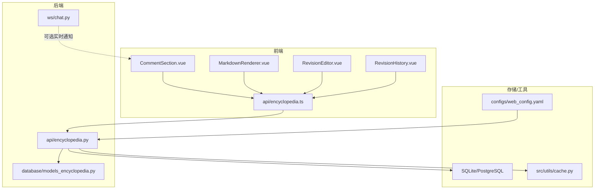
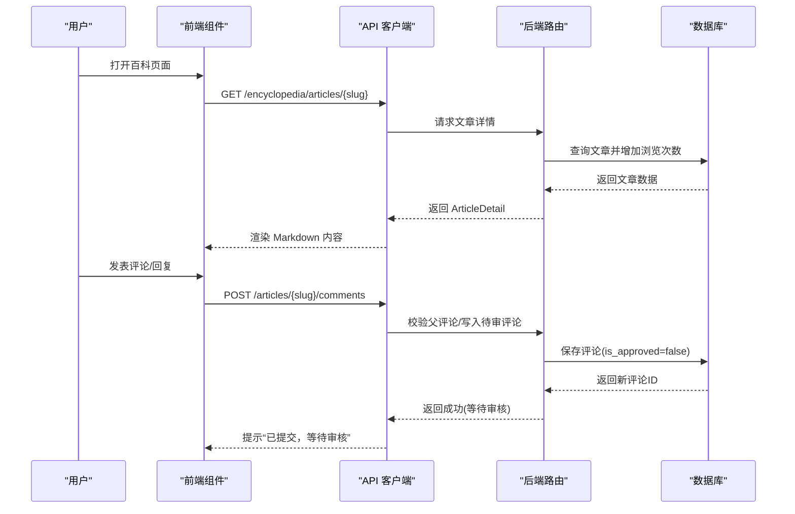
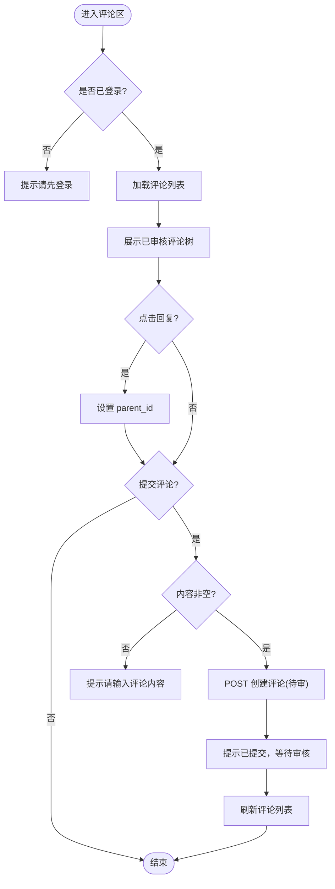
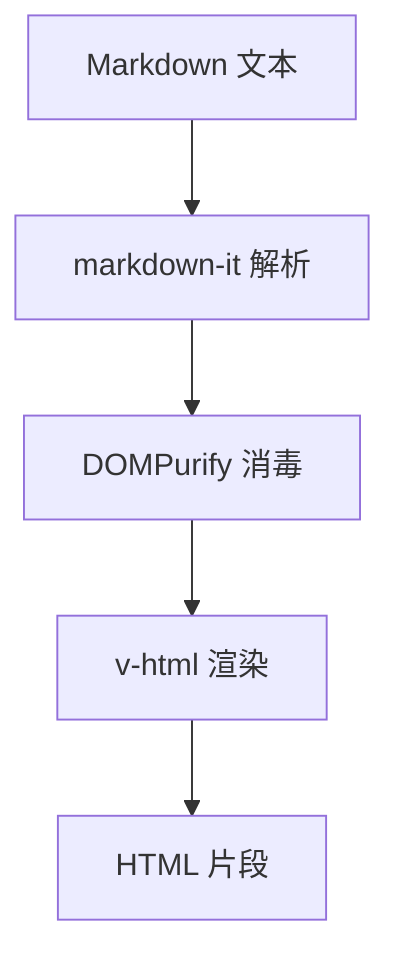
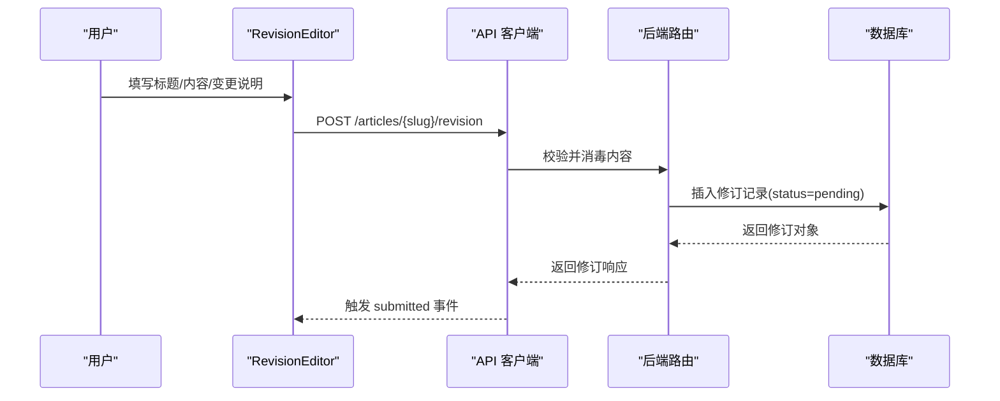
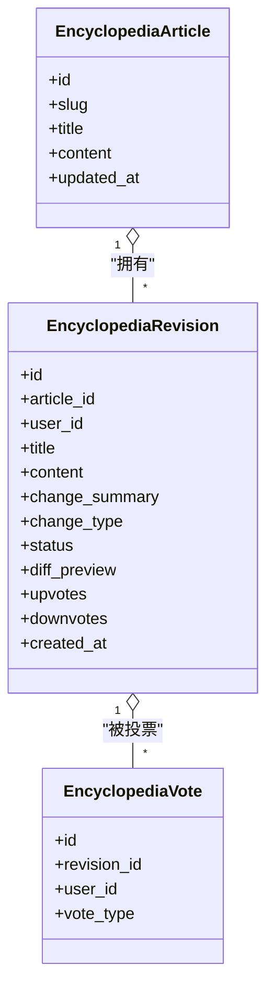
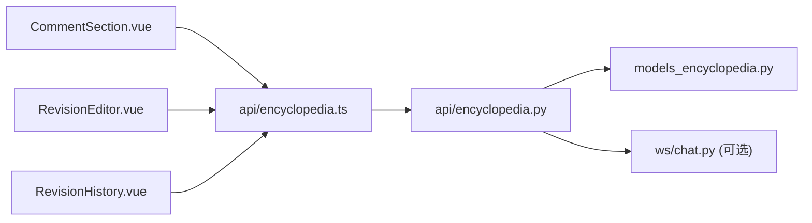
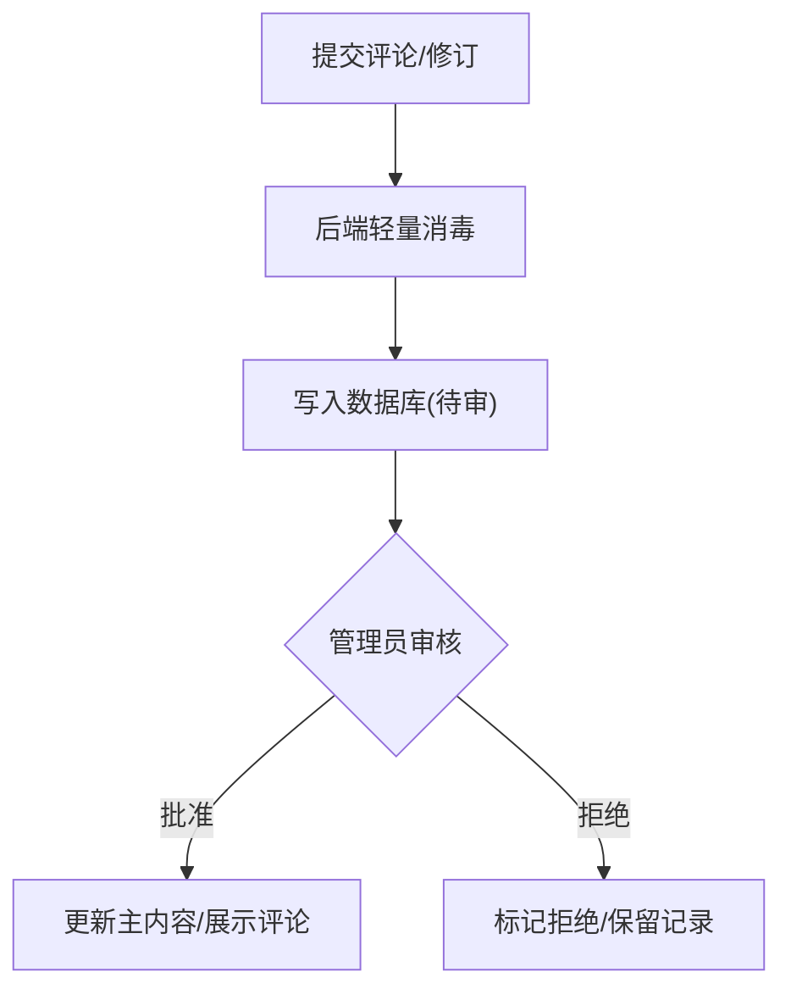

# 百科组件

<cite>
**本文引用的文件**
- [CommentSection.vue](file://web/app/src/components/encyclopedia/CommentSection.vue)
- [MarkdownRenderer.vue](file://web/app/src/components/encyclopedia/MarkdownRenderer.vue)
- [RevisionEditor.vue](file://web/app/src/components/encyclopedia/RevisionEditor.vue)
- [RevisionHistory.vue](file://web/app/src/components/encyclopedia/RevisionHistory.vue)
- [encyclopedia.ts](file://web/app/src/api/encyclopedia.ts)
- [encyclopedia.py](file://web/backend/api/encyclopedia.py)
- [models_encyclopedia.py](file://web/backend/database/models_encyclopedia.py)
- [chat.py](file://web/backend/ws/chat.py)
- [cache.py](file://src/utils/cache.py)
- [web_config.yaml](file://configs/web_config.yaml)
- [moderation.py](file://web/backend/api/moderation.py)
</cite>

## 目录
1. [简介](#简介)
2. [项目结构](#项目结构)
3. [核心组件](#核心组件)
4. [架构总览](#架构总览)
5. [详细组件分析](#详细组件分析)
6. [依赖关系分析](#依赖关系分析)
7. [性能与缓存策略](#性能与缓存策略)
8. [权限控制与内容审核](#权限控制与内容审核)
9. [搜索索引构建](#搜索索引构建)
10. [故障排查指南](#故障排查指南)
11. [结论](#结论)

## 简介
本文件为 Subskin 项目的“百科组件”专业文档，聚焦以下能力：
- CommentSection 评论系统的实时交互、嵌套回复与审核流程
- MarkdownRenderer 的 Markdown 解析与安全渲染（含扩展）
- RevisionEditor 版本编辑器的协同编辑工作流（提交修订、审核、采纳/拒绝/回滚）
- RevisionHistory 版本历史的时间线展示与投票评估
- 内容版本控制机制、图片上传处理、缓存策略
- 权限控制、内容审核、搜索索引构建与性能优化方案
- 完整的内容管理流程与协作编辑模式说明

## 项目结构
百科功能由前端 Vue 组件、后端 FastAPI 路由、数据库模型与工具模块组成。前端通过 API 客户端调用后端接口；后端负责数据校验、安全消毒、版本控制、评论树构建与权限校验；数据库提供文章、修订、评论、投票等持久化能力；工具层提供缓存与配置支持。

图表来源
- [CommentSection.vue:1-154](file://web/app/src/components/encyclopedia/CommentSection.vue#L1-L154)
- [MarkdownRenderer.vue:1-84](file://web/app/src/components/encyclopedia/MarkdownRenderer.vue#L1-L84)
- [RevisionEditor.vue:1-112](file://web/app/src/components/encyclopedia/RevisionEditor.vue#L1-L112)
- [RevisionHistory.vue:1-170](file://web/app/src/components/encyclopedia/RevisionHistory.vue#L1-L170)
- [encyclopedia.ts:1-133](file://web/app/src/api/encyclopedia.ts#L1-L133)
- [encyclopedia.py:1-586](file://web/backend/api/encyclopedia.py#L1-L586)
- [models_encyclopedia.py:1-134](file://web/backend/database/models_encyclopedia.py#L1-L134)
- [chat.py:1-111](file://web/backend/ws/chat.py#L1-L111)
- [cache.py:1-147](file://src/utils/cache.py#L1-L147)
- [web_config.yaml:61-78](file://configs/web_config.yaml#L61-L78)

章节来源
- [CommentSection.vue:1-154](file://web/app/src/components/encyclopedia/CommentSection.vue#L1-L154)
- [MarkdownRenderer.vue:1-84](file://web/app/src/components/encyclopedia/MarkdownRenderer.vue#L1-L84)
- [RevisionEditor.vue:1-112](file://web/app/src/components/encyclopedia/RevisionEditor.vue#L1-L112)
- [RevisionHistory.vue:1-170](file://web/app/src/components/encyclopedia/RevisionHistory.vue#L1-L170)
- [encyclopedia.ts:1-133](file://web/app/src/api/encyclopedia.ts#L1-L133)
- [encyclopedia.py:1-586](file://web/backend/api/encyclopedia.py#L1-L586)
- [models_encyclopedia.py:1-134](file://web/backend/database/models_encyclopedia.py#L1-L134)
- [chat.py:1-111](file://web/backend/ws/chat.py#L1-L111)
- [cache.py:1-147](file://src/utils/cache.py#L1-L147)
- [web_config.yaml:61-78](file://configs/web_config.yaml#L61-L78)

## 核心组件
- 评论系统 CommentSection：支持登录态校验、发表评论/回复、加载评论列表、显示审核状态提示。
- Markdown 渲染 MarkdownRenderer：基于 markdown-it 解析，启用锚点、链接识别、换行等，并通过 DOMPurify 进行 XSS 防护，支持自定义块样式。
- 版本编辑器 RevisionEditor：用户提交修订建议，包含标题、内容、变更说明，并做基础长度校验。
- 版本历史 RevisionHistory：按状态筛选、查看 diff 预览、对修订进行点赞/踩投票。

章节来源
- [CommentSection.vue:1-154](file://web/app/src/components/encyclopedia/CommentSection.vue#L1-L154)
- [MarkdownRenderer.vue:1-84](file://web/app/src/components/encyclopedia/MarkdownRenderer.vue#L1-L84)
- [RevisionEditor.vue:1-112](file://web/app/src/components/encyclopedia/RevisionEditor.vue#L1-L112)
- [RevisionHistory.vue:1-170](file://web/app/src/components/encyclopedia/RevisionHistory.vue#L1-L170)

## 架构总览
百科组件采用前后端分离架构：
- 前端通过 TypeScript API 客户端封装 RESTful 接口，统一错误处理与类型定义。
- 后端使用 FastAPI 路由，提供文章查询、修订提交/审核/回滚、评论创建/获取、投票等功能。
- 数据模型以 SQLAlchemy ORM 定义，包含文章、修订、评论、投票等实体及关系。
- 安全方面：后端对用户内容进行轻量消毒，前端渲染前使用 DOMPurify 二次消毒。
- 可选实时能力：WebSocket 通道用于消息与未读计数推送，可作为评论实时更新的扩展通道。

图表来源
- [encyclopedia.ts:66-133](file://web/app/src/api/encyclopedia.ts#L66-L133)
- [encyclopedia.py:187-586](file://web/backend/api/encyclopedia.py#L187-L586)
- [models_encyclopedia.py:18-134](file://web/backend/database/models_encyclopedia.py#L18-L134)

章节来源
- [encyclopedia.ts:1-133](file://web/app/src/api/encyclopedia.ts#L1-L133)
- [encyclopedia.py:1-586](file://web/backend/api/encyclopedia.py#L1-L586)
- [models_encyclopedia.py:1-134](file://web/backend/database/models_encyclopedia.py#L1-L134)

## 详细组件分析

### CommentSection 评论系统
- 功能要点
  - 登录后才能发表评论或回复，未登录时禁用输入并提示。
  - 支持回复指定评论（parent_id），提交后进入审核队列（is_approved=false）。
  - 加载评论列表时仅展示已审核的顶级评论及其回复，形成嵌套树。
  - 提交成功后刷新评论列表，并提示“等待审核”。
- 数据流
  - 前端调用 getComments 获取评论树；createComment 提交评论。
  - 后端在创建评论时校验父评论存在性，并将 is_approved 设为 false。
  - 获取评论时只返回 is_approved=true 的评论，并按时间排序构建树。
- 实时交互
  - 当前实现为轮询式加载；可结合 WebSocket 推送新增评论事件以提升体验。
- 权限与审核
  - 评论需登录；所有评论默认待审，管理员审核后才会展示。

图表来源
- [CommentSection.vue:19-71](file://web/app/src/components/encyclopedia/CommentSection.vue#L19-L71)
- [encyclopedia.py:474-555](file://web/backend/api/encyclopedia.py#L474-L555)

章节来源
- [CommentSection.vue:1-154](file://web/app/src/components/encyclopedia/CommentSection.vue#L1-L154)
- [encyclopedia.py:474-555](file://web/backend/api/encyclopedia.py#L474-L555)

### MarkdownRenderer 渲染引擎
- 功能要点
  - 使用 markdown-it 解析 Markdown，启用 HTML、linkify、typographer、breaks。
  - 启用 anchor 插件生成带锚点的标题，便于跳转。
  - 渲染结果经 DOMPurify 消毒后再注入到 v-html，防止 XSS。
  - 支持自定义块样式（info/warning/danger/tip），通过 CSS 类名控制外观。
- 安全策略
  - 后端对用户提交内容进行轻量消毒（剔除危险标签与事件处理器）。
  - 前端渲染前再次消毒，双重保障。
- 扩展能力
  - 可通过 markdown-it 插件生态扩展语法（如表格、脚注、数学公式等）。
  - 自定义块样式可在组件内扩展更多语义化区块。

图表来源
- [MarkdownRenderer.vue:11-28](file://web/app/src/components/encyclopedia/MarkdownRenderer.vue#L11-L28)
- [encyclopedia.py:125-147](file://web/backend/api/encyclopedia.py#L125-L147)

章节来源
- [MarkdownRenderer.vue:1-84](file://web/app/src/components/encyclopedia/MarkdownRenderer.vue#L1-L84)
- [encyclopedia.py:125-147](file://web/backend/api/encyclopedia.py#L125-L147)

### RevisionEditor 版本编辑器
- 功能要点
  - 表单包含标题、内容（Markdown）、变更说明，提交前进行最小长度校验。
  - 提交后调用后端接口创建修订记录，状态为 pending，变更类型为 suggest。
  - 提交成功后触发回调，关闭编辑器并刷新视图。
- 协同编辑模式
  - 多人可对同一文章提交修订，后台审核通过后合并到主内容。
  - 支持回滚到指定版本，自动创建回滚修订记录。
- 安全与质量
  - 后端对标题和内容进行轻量消毒，避免危险脚本。
  - 生成 diff 预览，辅助审核人员快速判断变更范围。

图表来源
- [RevisionEditor.vue:28-51](file://web/app/src/components/encyclopedia/RevisionEditor.vue#L28-L51)
- [encyclopedia.py:227-271](file://web/backend/api/encyclopedia.py#L227-L271)

章节来源
- [RevisionEditor.vue:1-112](file://web/app/src/components/encyclopedia/RevisionEditor.vue#L1-L112)
- [encyclopedia.py:227-271](file://web/backend/api/encyclopedia.py#L227-L271)

### RevisionHistory 版本历史
- 功能要点
  - 支持按状态筛选（全部/待审核/已采纳/已拒绝）。
  - 展示每条修订的变更摘要、diff 预览、时间与作者信息。
  - 支持对修订进行点赞/踩投票，实时更新计数。
- 时间线展示
  - 按创建时间倒序排列，便于追踪演进过程。
  - 已采纳的修订会更新主文章内容，回滚操作会生成新的修订记录。

图表来源
- [models_encyclopedia.py:18-134](file://web/backend/database/models_encyclopedia.py#L18-L134)
- [RevisionHistory.vue:30-61](file://web/app/src/components/encyclopedia/RevisionHistory.vue#L30-L61)
- [encyclopedia.py:274-469](file://web/backend/api/encyclopedia.py#L274-L469)

章节来源
- [RevisionHistory.vue:1-170](file://web/app/src/components/encyclopedia/RevisionHistory.vue#L1-L170)
- [encyclopedia.py:274-469](file://web/backend/api/encyclopedia.py#L274-L469)
- [models_encyclopedia.py:18-134](file://web/backend/database/models_encyclopedia.py#L18-L134)

## 依赖关系分析
- 前端依赖
  - Vue 组件依赖 TypeScript API 客户端，统一封装接口与类型。
  - Markdown 渲染依赖 markdown-it、markdown-it-anchor、DOMPurify。
- 后端依赖
  - FastAPI 路由依赖 SQLAlchemy ORM 模型与数据库会话。
  - 权限校验依赖统一认证中间件。
- 数据模型依赖
  - 文章、修订、评论、投票之间存在外键与一对多/自引用关系。
- 可选实时依赖
  - WebSocket 连接管理器可用于推送未读计数或评论更新事件。

图表来源
- [CommentSection.vue:1-154](file://web/app/src/components/encyclopedia/CommentSection.vue#L1-L154)
- [RevisionEditor.vue:1-112](file://web/app/src/components/encyclopedia/RevisionEditor.vue#L1-L112)
- [RevisionHistory.vue:1-170](file://web/app/src/components/encyclopedia/RevisionHistory.vue#L1-L170)
- [encyclopedia.ts:1-133](file://web/app/src/api/encyclopedia.ts#L1-L133)
- [encyclopedia.py:1-586](file://web/backend/api/encyclopedia.py#L1-L586)
- [models_encyclopedia.py:1-134](file://web/backend/database/models_encyclopedia.py#L1-L134)
- [chat.py:1-111](file://web/backend/ws/chat.py#L1-L111)

章节来源
- [encyclopedia.ts:1-133](file://web/app/src/api/encyclopedia.ts#L1-L133)
- [encyclopedia.py:1-586](file://web/backend/api/encyclopedia.py#L1-L586)
- [models_encyclopedia.py:1-134](file://web/backend/database/models_encyclopedia.py#L1-L134)
- [chat.py:1-111](file://web/backend/ws/chat.py#L1-L111)

## 性能与缓存策略
- 缓存
  - 提供 SQLite-backed 线程安全缓存，支持 TTL 与过期清理，可用于 API 响应缓存。
  - 配置中预留 Redis 地址与默认 TTL，便于迁移至分布式缓存。
- 数据库
  - 为常用查询字段建立索引（分类、发布状态、文章 ID、评论父子关系等）。
  - 浏览量统计在读取详情时递增，注意在高并发场景下考虑异步或批量更新。
- 渲染
  - Markdown 渲染在前端完成，减少后端计算压力；使用 DOMPurify 保证安全。
- 网络
  - 合理分页与过滤（如修订历史按状态筛选）降低数据传输量。
- 建议
  - 对热点文章详情、分类树、评论列表实施缓存策略。
  - 对频繁写操作（浏览量、投票）考虑异步任务或批处理。

章节来源
- [cache.py:1-147](file://src/utils/cache.py#L1-L147)
- [web_config.yaml:61-78](file://configs/web_config.yaml#L61-L78)
- [models_encyclopedia.py:18-134](file://web/backend/database/models_encyclopedia.py#L18-L134)
- [encyclopedia.py:560-586](file://web/backend/api/encyclopedia.py#L560-L586)

## 权限控制与内容审核
- 权限控制
  - 评论与修订提交需要登录态；审核与回滚操作需要管理员权限。
  - 后端通过统一认证依赖注入当前用户，并在敏感操作中校验角色。
- 内容审核
  - 评论默认待审，仅已审核评论可见；修订提交后进入审核队列。
  - 管理员可审核修订（批准/拒绝），批准后更新主内容；拒绝则保留历史记录。
  - 通用内容风控模块支持风险等级、自动处置、违规记录与处罚。
- 安全消毒
  - 后端对用户内容进行正则级消毒（剔除危险标签与事件处理器）。
  - 前端渲染前使用 DOMPurify 二次消毒，防止 XSS。

图表来源
- [encyclopedia.py:227-361](file://web/backend/api/encyclopedia.py#L227-L361)
- [encyclopedia.py:520-555](file://web/backend/api/encyclopedia.py#L520-L555)
- [moderation.py:144-180](file://web/backend/api/moderation.py#L144-L180)

章节来源
- [encyclopedia.py:227-361](file://web/backend/api/encyclopedia.py#L227-L361)
- [encyclopedia.py:520-555](file://web/backend/api/encyclopedia.py#L520-L555)
- [moderation.py:144-180](file://web/backend/api/moderation.py#L144-L180)

## 搜索索引构建
- 现状
  - 项目配置中包含向量数据库选项（chromadb/qdrant/weaviate），但百科模块未直接集成全文检索。
  - VitePress 文档站点内置 MiniSearch 能力，可用于静态文档搜索。
- 建议方案
  - 为百科文章建立全文索引（标题、摘要、内容），支持关键词匹配与模糊搜索。
  - 增量索引：在文章更新或修订批准后触发索引重建或增量更新。
  - 前端搜索：结合 MiniSearch 或后端检索服务，提供分类过滤与高亮。
- 性能优化
  - 对高频查询字段建立索引（category、is_published、updated_at）。
  - 搜索结果分页与缓存，减少重复查询。

章节来源
- [web_config.yaml:61-78](file://configs/web_config.yaml#L61-L78)
- [models_encyclopedia.py:18-42](file://web/backend/database/models_encyclopedia.py#L18-L42)

## 故障排查指南
- 常见问题
  - 评论无法显示：检查评论是否已通过审核（is_approved=true）。
  - 修订未生效：确认管理员已批准该修订；查看 diff 预览定位问题。
  - 渲染异常：检查 Markdown 语法与自定义块类名；确认 DOMPurify 未误删必要标签。
  - 权限错误：确认当前用户已登录且具备相应角色（管理员/普通用户）。
- 调试建议
  - 前端：查看 API 响应与错误信息，使用浏览器开发者工具跟踪请求。
  - 后端：检查日志输出与数据库记录，确认事务提交与索引更新。
  - 实时功能：若启用 WebSocket，检查连接状态与消息协议。

章节来源
- [CommentSection.vue:19-71](file://web/app/src/components/encyclopedia/CommentSection.vue#L19-L71)
- [RevisionHistory.vue:30-61](file://web/app/src/components/encyclopedia/RevisionHistory.vue#L30-L61)
- [MarkdownRenderer.vue:11-28](file://web/app/src/components/encyclopedia/MarkdownRenderer.vue#L11-L28)
- [encyclopedia.py:227-586](file://web/backend/api/encyclopedia.py#L227-L586)

## 结论
Subskin 百科组件提供了完整的协作编辑与内容管理能力：
- 评论系统支持嵌套回复与审核流程，确保内容质量。
- Markdown 渲染兼顾扩展性与安全性，满足百科内容呈现需求。
- 版本编辑器与历史时间线实现了可追溯的版本控制与社区协作。
- 权限控制与内容审核机制保障了平台的安全与合规。
- 缓存与索引策略为性能优化提供了可扩展路径。
未来可进一步增强实时互动（WebSocket 推送）、全文检索与图片上传处理能力，提升用户体验与运营效率。