# 社区功能组件

<cite>
**本文引用的文件**   
- [TextPostCard.vue](file://web/app/src/components/community/PostCard/TextPostCard.vue)
- [ImagePostCard.vue](file://web/app/src/components/community/PostCard/ImagePostCard.vue)
- [LongPostCard.vue](file://web/app/src/components/community/PostCard/LongPostCard.vue)
- [RichEditor.vue](file://web/app/src/components/community/RichEditor.vue)
- [CreatePostSheet.vue](file://web/app/src/components/community/CreatePostSheet.vue)
- [FeedWaterfall.vue](file://web/app/src/components/community/FeedWaterfall.vue)
- [FollowButton.vue](file://web/app/src/components/community/FollowButton.vue)
- [FollowPlus.vue](file://web/app/src/components/community/FollowPlus.vue)
- [TagEditor.vue](file://web/app/src/components/community/TagEditor.vue)
- [TagSelector.vue](file://web/app/src/components/community/TagSelector.vue)
- [FileAttachment.vue](file://web/app/src/components/community/FileAttachment.vue)
- [PostCard.vue](file://web/app/src/components/community/PostCard.vue)
- [CommentSection.vue](file://web/app/src/components/encyclopedia/CommentSection.vue)
- [SharePoster.vue](file://web/app/src/components/community/SharePoster.vue)
- [ShareSheet.vue](file://web/app/src/components/community/ShareSheet.vue)
</cite>

## 目录
1. [简介](#简介)
2. [项目结构](#项目结构)
3. [核心组件](#核心组件)
4. [架构总览](#架构总览)
5. [详细组件分析](#详细组件分析)
6. [依赖关系分析](#依赖关系分析)
7. [性能考量](#性能考量)
8. [故障排查指南](#故障排查指南)
9. [结论](#结论)
10. [附录](#附录)

## 简介
本文件面向 Subskin 项目的社区功能，系统性梳理并文档化以下能力：
- PostCard 系列（TextPostCard、ImagePostCard、LongPostCard）的渲染逻辑与交互
- RichEditor 富文本编辑器的实现要点与多媒体插入流程
- CreatePostSheet 发帖界面的交互设计与路由跳转
- FeedWaterfall 瀑布流布局的数据分发与性能优化策略
- 关注系统（FollowButton、FollowPlus）的状态管理与用户反馈
- 标签系统（TagEditor、TagSelector）的数据结构与交互
- 文件附件（FileAttachment）的展示与下载流程
- 评论系统、点赞功能、分享机制的实现细节与用户体验优化

## 项目结构
社区相关的前端组件集中在 web/app/src/components/community 目录下，配合通用组件与 API 模块完成数据获取与状态管理。整体采用 Vue 单文件组件组织，按“功能域 + 子功能”划分目录，便于扩展与维护。

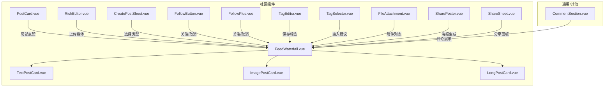

图表来源
- [FeedWaterfall.vue:1-42](file://web/app/src/components/community/FeedWaterfall.vue#L1-L42)
- [PostCard.vue:1-184](file://web/app/src/components/community/PostCard.vue#L1-L184)
- [TextPostCard.vue:1-65](file://web/app/src/components/community/PostCard/TextPostCard.vue#L1-L65)
- [ImagePostCard.vue:1-261](file://web/app/src/components/community/PostCard/ImagePostCard.vue#L1-L261)
- [LongPostCard.vue:1-91](file://web/app/src/components/community/PostCard/LongPostCard.vue#L1-L91)
- [RichEditor.vue:1-703](file://web/app/src/components/community/RichEditor.vue#L1-L703)
- [CreatePostSheet.vue:1-231](file://web/app/src/components/community/CreatePostSheet.vue#L1-L231)
- [FollowButton.vue:1-57](file://web/app/src/components/community/FollowButton.vue#L1-L57)
- [FollowPlus.vue:1-61](file://web/app/src/components/community/FollowPlus.vue#L1-L61)
- [TagEditor.vue:1-96](file://web/app/src/components/community/TagEditor.vue#L1-L96)
- [TagSelector.vue:1-171](file://web/app/src/components/community/TagSelector.vue#L1-L171)
- [FileAttachment.vue:1-98](file://web/app/src/components/community/FileAttachment.vue#L1-L98)
- [SharePoster.vue:1-200](file://web/app/src/components/community/SharePoster.vue#L1-L200)
- [ShareSheet.vue:1-200](file://web/app/src/components/community/ShareSheet.vue#L1-L200)
- [CommentSection.vue:1-200](file://web/app/src/components/encyclopedia/CommentSection.vue#L1-L200)

章节来源
- [FeedWaterfall.vue:1-42](file://web/app/src/components/community/FeedWaterfall.vue#L1-L42)
- [PostCard.vue:1-184](file://web/app/src/components/community/PostCard.vue#L1-L184)

## 核心组件
- PostCard 系列：负责不同内容类型的卡片渲染与基础交互（头像、昵称、关注、点赞）。
- RichEditor：基于 Tiptap 的富文本编辑器，支持加粗、标题、列表、引用、链接、图片/音频/视频插入。
- CreatePostSheet：底部弹窗选择发布类型（图文、视频、文字、长文），并跳转到对应编辑器页面。
- FeedWaterfall：根据帖子类型动态分发到具体 Card 组件，形成两列/三列瀑布流布局。
- FollowButton/FollowPlus：关注/取消关注的轻量按钮，处理登录态与加载态。
- TagEditor/TagSelector：标签编辑与选择器，支持去重、上限控制、推荐标签与搜索建议。
- FileAttachment：统一展示附件列表，按类型显示图标、大小与下载链接。
- 评论/点赞/分享：通过各自组件或组合实现，提供即时反馈与多通道分享。

章节来源
- [TextPostCard.vue:1-65](file://web/app/src/components/community/PostCard/TextPostCard.vue#L1-L65)
- [ImagePostCard.vue:1-261](file://web/app/src/components/community/PostCard/ImagePostCard.vue#L1-L261)
- [LongPostCard.vue:1-91](file://web/app/src/components/community/PostCard/LongPostCard.vue#L1-L91)
- [RichEditor.vue:1-703](file://web/app/src/components/community/RichEditor.vue#L1-L703)
- [CreatePostSheet.vue:1-231](file://web/app/src/components/community/CreatePostSheet.vue#L1-L231)
- [FeedWaterfall.vue:1-42](file://web/app/src/components/community/FeedWaterfall.vue#L1-L42)
- [FollowButton.vue:1-57](file://web/app/src/components/community/FollowButton.vue#L1-L57)
- [FollowPlus.vue:1-61](file://web/app/src/components/community/FollowPlus.vue#L1-L61)
- [TagEditor.vue:1-96](file://web/app/src/components/community/TagEditor.vue#L1-L96)
- [TagSelector.vue:1-171](file://web/app/src/components/community/TagSelector.vue#L1-L171)
- [FileAttachment.vue:1-98](file://web/app/src/components/community/FileAttachment.vue#L1-L98)

## 架构总览
社区功能以 FeedWaterfall 为入口容器，将数据按类型分发给具体 PostCard；编辑侧由 RichEditor 承载内容生产；关注与标签作为辅助能力嵌入卡片与编辑器；附件与分享在消费侧增强体验。

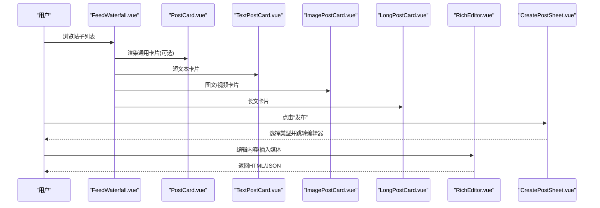

图表来源
- [FeedWaterfall.vue:1-42](file://web/app/src/components/community/FeedWaterfall.vue#L1-L42)
- [PostCard.vue:1-184](file://web/app/src/components/community/PostCard.vue#L1-L184)
- [TextPostCard.vue:1-65](file://web/app/src/components/community/PostCard/TextPostCard.vue#L1-L65)
- [ImagePostCard.vue:1-261](file://web/app/src/components/community/PostCard/ImagePostCard.vue#L1-L261)
- [LongPostCard.vue:1-91](file://web/app/src/components/community/PostCard/LongPostCard.vue#L1-L91)
- [RichEditor.vue:1-703](file://web/app/src/components/community/RichEditor.vue#L1-L703)
- [CreatePostSheet.vue:1-231](file://web/app/src/components/community/CreatePostSheet.vue#L1-L231)

## 详细组件分析

### PostCard 系列渲染逻辑
- TextPostCard：展示摘要文本、作者头像与昵称、关注按钮与点赞计数，点击跳转详情页。
- ImagePostCard：多图轮播（首图停留更久）、长按预览滚动文本、支持视频标识与私密标记。
- LongPostCard：标题+摘要+阅读时长估算，支持治疗分享结构化摘要卡片。

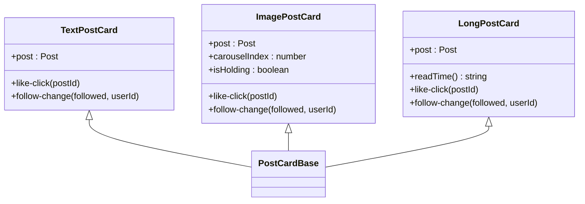

图表来源
- [TextPostCard.vue:1-65](file://web/app/src/components/community/PostCard/TextPostCard.vue#L1-L65)
- [ImagePostCard.vue:1-261](file://web/app/src/components/community/PostCard/ImagePostCard.vue#L1-L261)
- [LongPostCard.vue:1-91](file://web/app/src/components/community/PostCard/LongPostCard.vue#L1-L91)

章节来源
- [TextPostCard.vue:1-65](file://web/app/src/components/community/PostCard/TextPostCard.vue#L1-L65)
- [ImagePostCard.vue:1-261](file://web/app/src/components/community/PostCard/ImagePostCard.vue#L1-L261)
- [LongPostCard.vue:1-91](file://web/app/src/components/community/PostCard/LongPostCard.vue#L1-L91)

### RichEditor 富文本编辑器
- 基于 Tiptap StarterKit，扩展下划线、图片、链接、占位符，自定义 Audio/Video 节点。
- 工具栏支持加粗、斜体、下划线、删除线、H1-H3、有序/无序列表、引用、分割线、插入链接、图片/音频/视频上传。
- 上传校验：图片≤5MB、音频≤20MB、视频≤50MB；失败时提示；成功后插入对应节点。
- 双向绑定：同步 HTML 与 JSON，供提交使用。

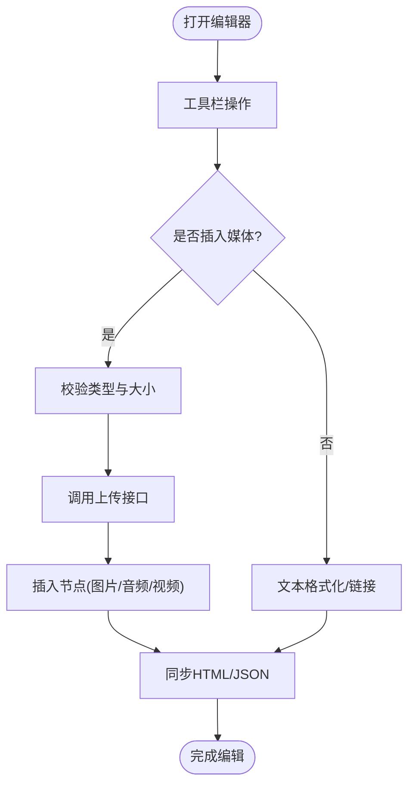

图表来源
- [RichEditor.vue:1-703](file://web/app/src/components/community/RichEditor.vue#L1-L703)

章节来源
- [RichEditor.vue:1-703](file://web/app/src/components/community/RichEditor.vue#L1-L703)

### CreatePostSheet 发帖界面
- 底部弹窗，提供四种发布类型：图文、视频、文字、长文，附带描述与图标。
- 支持“我的草稿”入口，显示草稿数量与即将过期提示。
- 动画过渡（遮罩淡入、底部滑出），键盘 ESC 关闭，点击遮罩关闭。

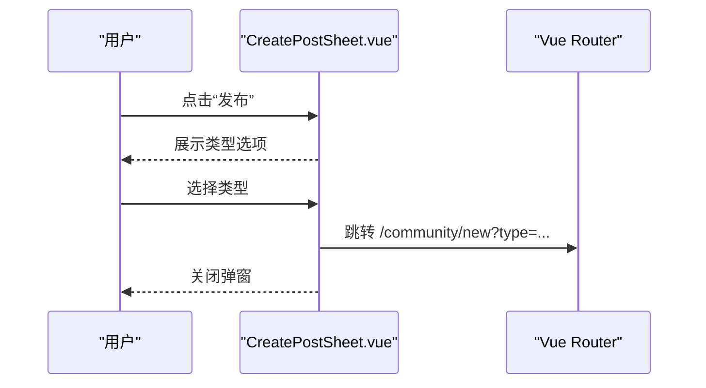

图表来源
- [CreatePostSheet.vue:1-231](file://web/app/src/components/community/CreatePostSheet.vue#L1-L231)

章节来源
- [CreatePostSheet.vue:1-231](file://web/app/src/components/community/CreatePostSheet.vue#L1-L231)

### FeedWaterfall 瀑布流布局
- 根据 post_type、video_url、images 长度与文本长度自动判定类型，分发到 ImagePostCard、TextPostCard、LongPostCard。
- 网格布局：移动端两列，md 断点三列，间距一致。
- 事件冒泡：转发 like-click 与 follow-change 给父级。

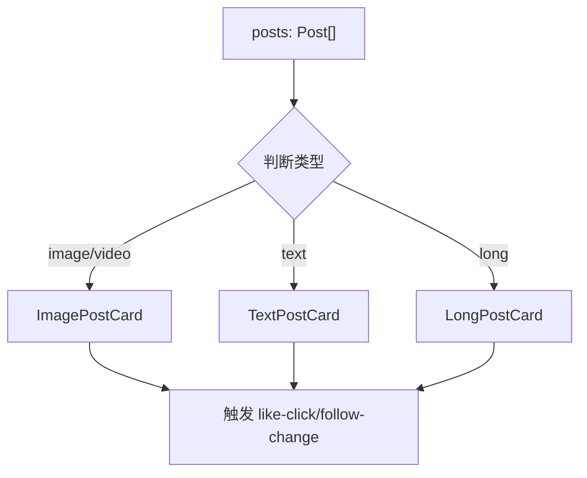

图表来源
- [FeedWaterfall.vue:1-42](file://web/app/src/components/community/FeedWaterfall.vue#L1-L42)

章节来源
- [FeedWaterfall.vue:1-42](file://web/app/src/components/community/FeedWaterfall.vue#L1-L42)

### 关注系统（FollowButton、FollowPlus）
- FollowButton：简洁按钮，未登录不显示，已登录可切换关注状态，带 loading 态。
- FollowPlus：更紧凑样式，自动隐藏“自己关注自己”的场景，未登录时弹出登录框。
- 两者均通过 communityApi 调用关注/取消接口，并向父组件派发状态变化。

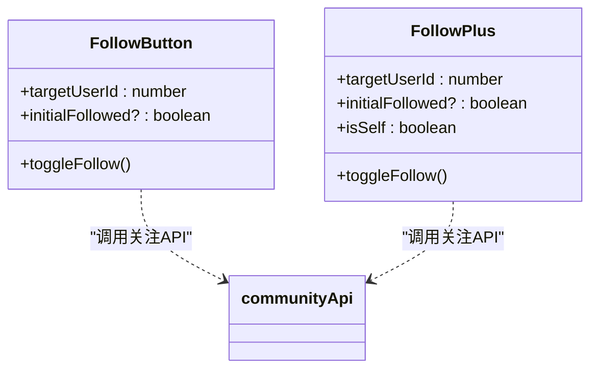

图表来源
- [FollowButton.vue:1-57](file://web/app/src/components/community/FollowButton.vue#L1-L57)
- [FollowPlus.vue:1-61](file://web/app/src/components/community/FollowPlus.vue#L1-L61)

章节来源
- [FollowButton.vue:1-57](file://web/app/src/components/community/FollowButton.vue#L1-L57)
- [FollowPlus.vue:1-61](file://web/app/src/components/community/FollowPlus.vue#L1-L61)

### 标签系统（TagEditor、TagSelector）
- TagEditor：底部弹窗式编辑，支持添加/移除标签、最多 5 个、推荐标签列表。
- TagSelector：行内输入框+下拉建议，支持回车/逗号添加、退格删除最后一个、防抖搜索建议、去重与上限控制。
- 两者均与 communityApi 交互获取热门/搜索标签。

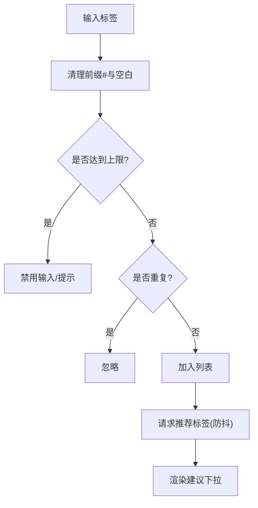

图表来源
- [TagEditor.vue:1-96](file://web/app/src/components/community/TagEditor.vue#L1-L96)
- [TagSelector.vue:1-171](file://web/app/src/components/community/TagSelector.vue#L1-L171)

章节来源
- [TagEditor.vue:1-96](file://web/app/src/components/community/TagEditor.vue#L1-L96)
- [TagSelector.vue:1-171](file://web/app/src/components/community/TagSelector.vue#L1-L171)

### 文件附件（FileAttachment）
- 按顺序排序展示附件，区分文档/图片/通用文件图标。
- 文件名截断、文件大小格式化，点击在新窗口打开受保护链接。

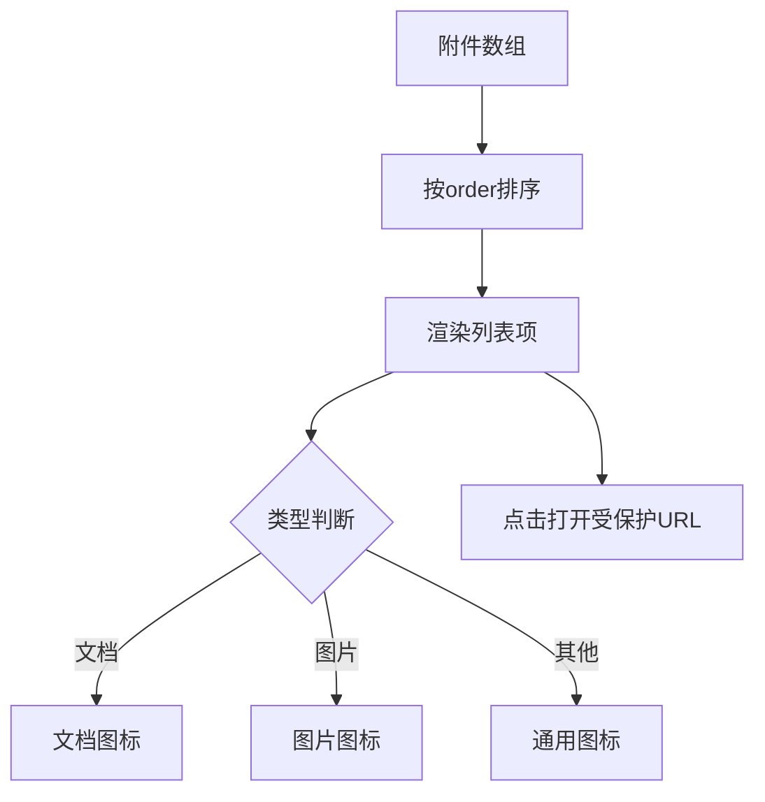

图表来源
- [FileAttachment.vue:1-98](file://web/app/src/components/community/FileAttachment.vue#L1-L98)

章节来源
- [FileAttachment.vue:1-98](file://web/app/src/components/community/FileAttachment.vue#L1-L98)

### 评论系统、点赞功能、分享机制
- 点赞：PostCard.vue 维护本地 liked 与计数，点击调用 toggleLike，未登录弹出登录框；各 PostCard 子组件也暴露 like-click 事件。
- 评论：CommentSection.vue 用于百科类内容的评论展示与交互（具体实现参考该组件）。
- 分享：SharePoster.vue 生成分享海报，ShareSheet.vue 提供分享面板（系统分享/复制链接等）。

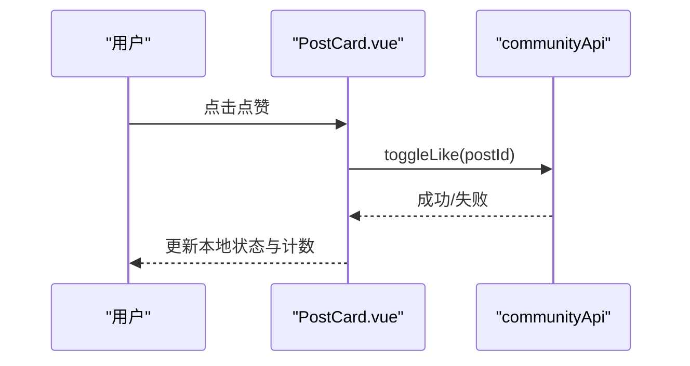

图表来源
- [PostCard.vue:1-184](file://web/app/src/components/community/PostCard.vue#L1-L184)
- [CommentSection.vue:1-200](file://web/app/src/components/encyclopedia/CommentSection.vue#L1-L200)
- [SharePoster.vue:1-200](file://web/app/src/components/community/SharePoster.vue#L1-L200)
- [ShareSheet.vue:1-200](file://web/app/src/components/community/ShareSheet.vue#L1-L200)

章节来源
- [PostCard.vue:1-184](file://web/app/src/components/community/PostCard.vue#L1-L184)
- [CommentSection.vue:1-200](file://web/app/src/components/encyclopedia/CommentSection.vue#L1-L200)
- [SharePoster.vue:1-200](file://web/app/src/components/community/SharePoster.vue#L1-L200)
- [ShareSheet.vue:1-200](file://web/app/src/components/community/ShareSheet.vue#L1-L200)

## 依赖关系分析
- FeedWaterfall 依赖三类 PostCard 组件进行渲染分发。
- PostCard 系列依赖 FollowPlus/FollowButton 进行关注操作，依赖 toProtectedFileUrl 处理头像与图片 URL。
- RichEditor 依赖 communityApi 进行媒体上传，依赖 Tiptap 生态扩展。
- TagEditor/TagSelector 依赖 communityApi 获取标签建议。
- FileAttachment 依赖 file-url 工具生成受保护链接。

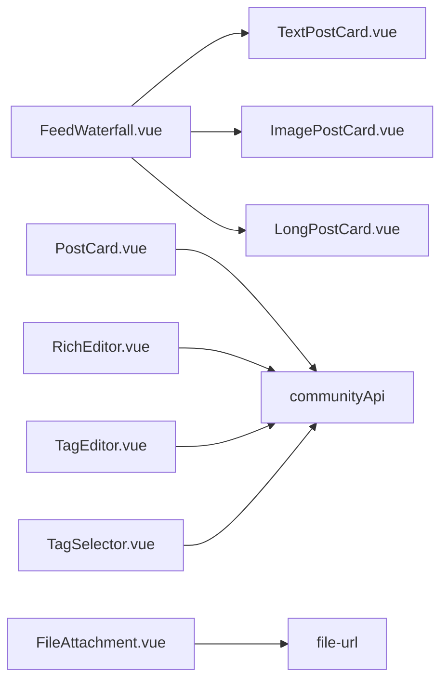

图表来源
- [FeedWaterfall.vue:1-42](file://web/app/src/components/community/FeedWaterfall.vue#L1-L42)
- [PostCard.vue:1-184](file://web/app/src/components/community/PostCard.vue#L1-L184)
- [RichEditor.vue:1-703](file://web/app/src/components/community/RichEditor.vue#L1-L703)
- [TagEditor.vue:1-96](file://web/app/src/components/community/TagEditor.vue#L1-L96)
- [TagSelector.vue:1-171](file://web/app/src/components/community/TagSelector.vue#L1-L171)
- [FileAttachment.vue:1-98](file://web/app/src/components/community/FileAttachment.vue#L1-L98)

章节来源
- [FeedWaterfall.vue:1-42](file://web/app/src/components/community/FeedWaterfall.vue#L1-L42)
- [PostCard.vue:1-184](file://web/app/src/components/community/PostCard.vue#L1-L184)
- [RichEditor.vue:1-703](file://web/app/src/components/community/RichEditor.vue#L1-L703)
- [TagEditor.vue:1-96](file://web/app/src/components/community/TagEditor.vue#L1-L96)
- [TagSelector.vue:1-171](file://web/app/src/components/community/TagSelector.vue#L1-L171)
- [FileAttachment.vue:1-98](file://web/app/src/components/community/FileAttachment.vue#L1-L98)

## 性能考量
- 图片懒加载：ImagePostCard 使用 loading="lazy"，减少首屏压力。
- 轮播定时器管理：ImagePostCard 在挂载/卸载时启停定时器，避免内存泄漏。
- 文本滚动动画：长按后使用 CSS 动画展示内容，避免频繁重排。
- 标签搜索防抖：TagSelector 使用 300ms 防抖降低请求频率。
- 网格布局：FeedWaterfall 使用 CSS Grid，响应式列数适配不同屏幕。
- 组件拆分：按类型拆分 PostCard，减少不必要的渲染与计算。

[本节为通用指导，无需特定文件来源]

## 故障排查指南
- 图片/音视频上传失败：检查文件大小限制与 MIME 类型校验，查看 toast 错误提示与控制台日志。
- 关注状态不同步：确认登录态与接口返回，检查 loading 态与异常分支。
- 标签建议为空：检查网络请求与防抖逻辑，确认后端接口可用。
- 附件无法打开：确认受保护 URL 生成是否正确，检查权限与跨域设置。
- 轮播卡顿：检查定时器清理与触摸事件冲突，确保 stopCarousel 被正确调用。

章节来源
- [RichEditor.vue:1-703](file://web/app/src/components/community/RichEditor.vue#L1-L703)
- [FollowButton.vue:1-57](file://web/app/src/components/community/FollowButton.vue#L1-L57)
- [FollowPlus.vue:1-61](file://web/app/src/components/community/FollowPlus.vue#L1-L61)
- [TagSelector.vue:1-171](file://web/app/src/components/community/TagSelector.vue#L1-L171)
- [FileAttachment.vue:1-98](file://web/app/src/components/community/FileAttachment.vue#L1-L98)
- [ImagePostCard.vue:1-261](file://web/app/src/components/community/PostCard/ImagePostCard.vue#L1-L261)

## 结论
社区功能组件围绕“内容消费—内容生产—社交互动”三大主线构建，PostCard 系列与 FeedWaterfall 提供高效的内容呈现，RichEditor 与 CreatePostSheet 完善创作体验，Follow/Tag/File/Share 等能力增强互动与传播。通过合理的组件拆分、状态管理与性能优化，整体具备良好的可扩展性与用户体验。

[本节为总结性内容，无需特定文件来源]

## 附录
- 最佳实践
  - 保持组件职责单一，事件冒泡清晰，避免深层耦合。
  - 对媒体上传做严格校验与友好提示，提升容错性。
  - 合理使用懒加载与防抖，平衡性能与交互流畅度。
  - 对敏感操作（关注、点赞）做好登录态拦截与加载反馈。

[本节为通用指导，无需特定文件来源]