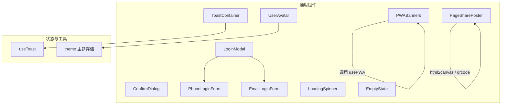
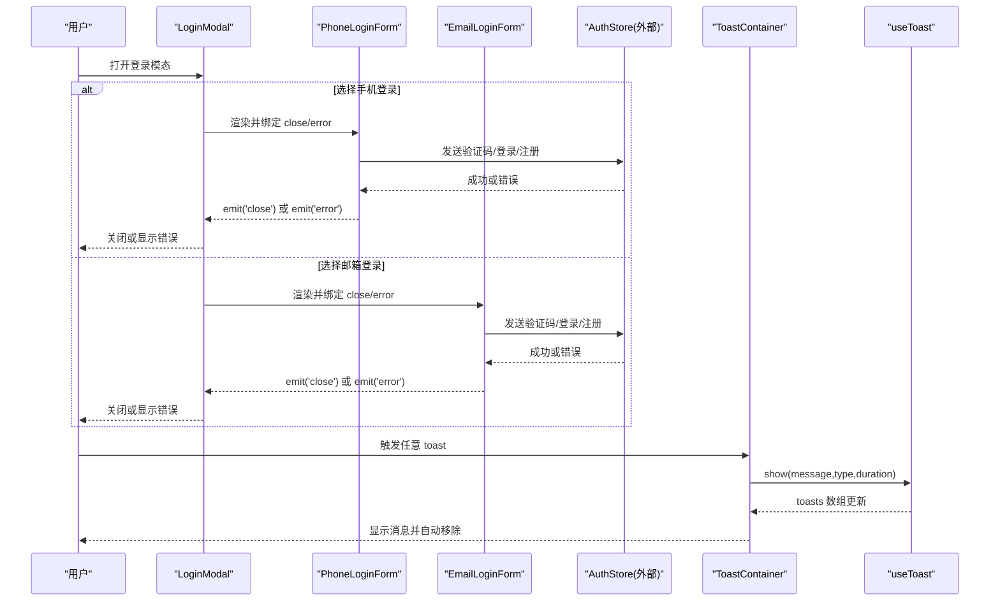
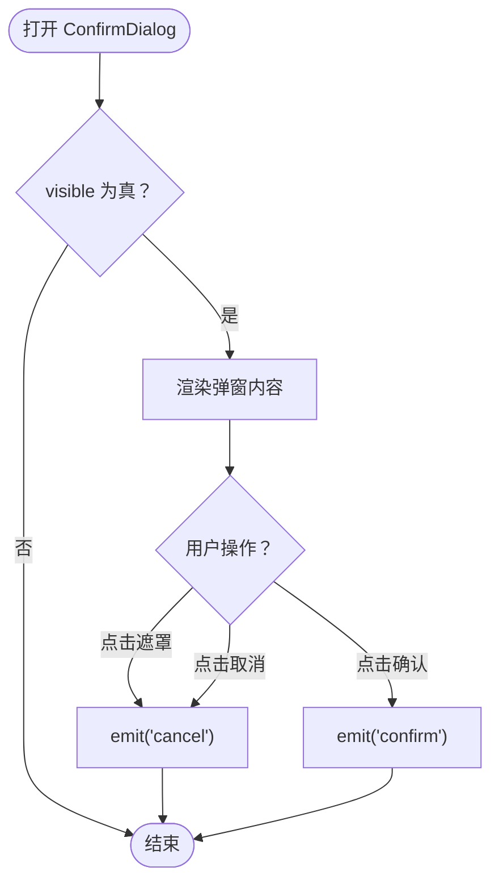
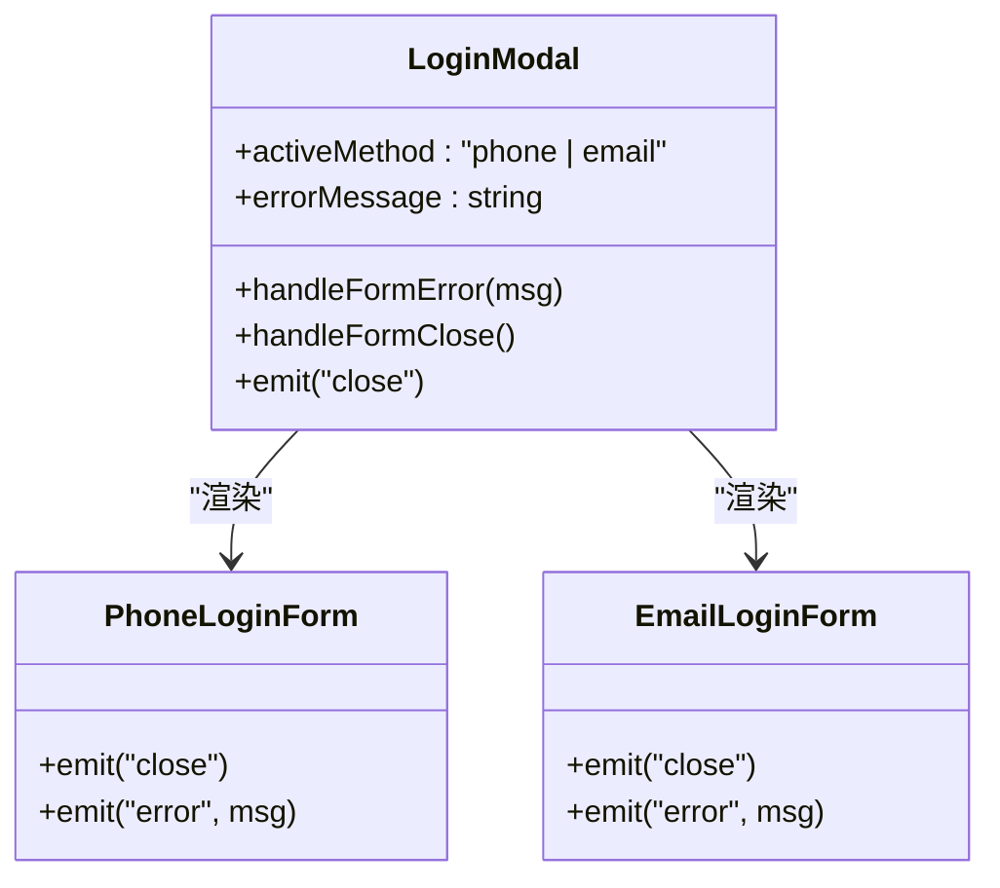
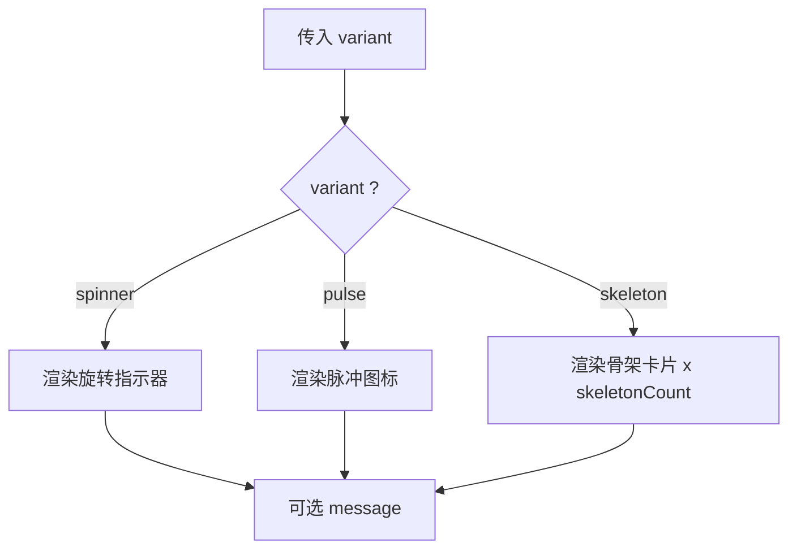
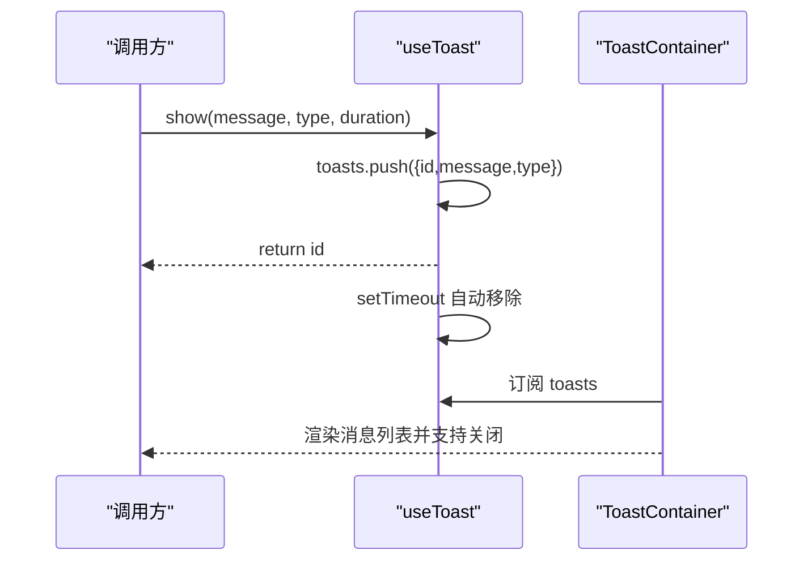
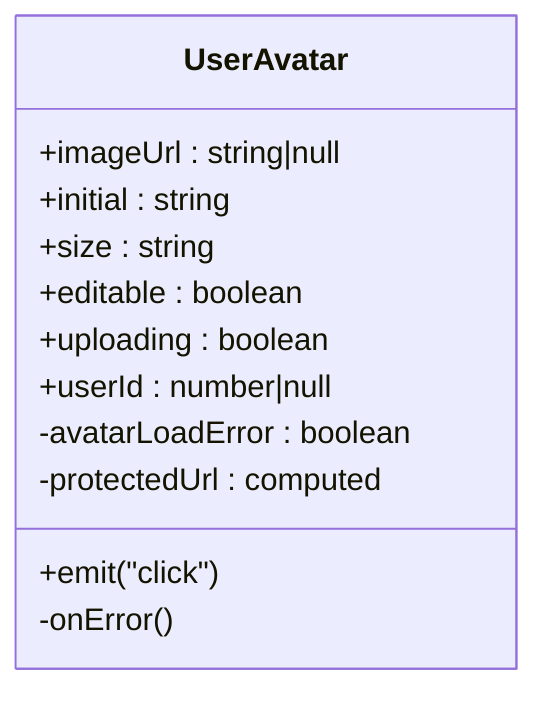
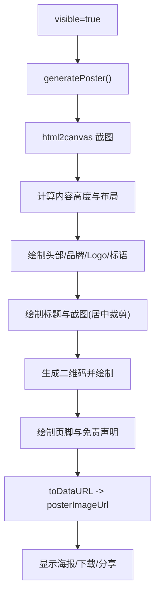
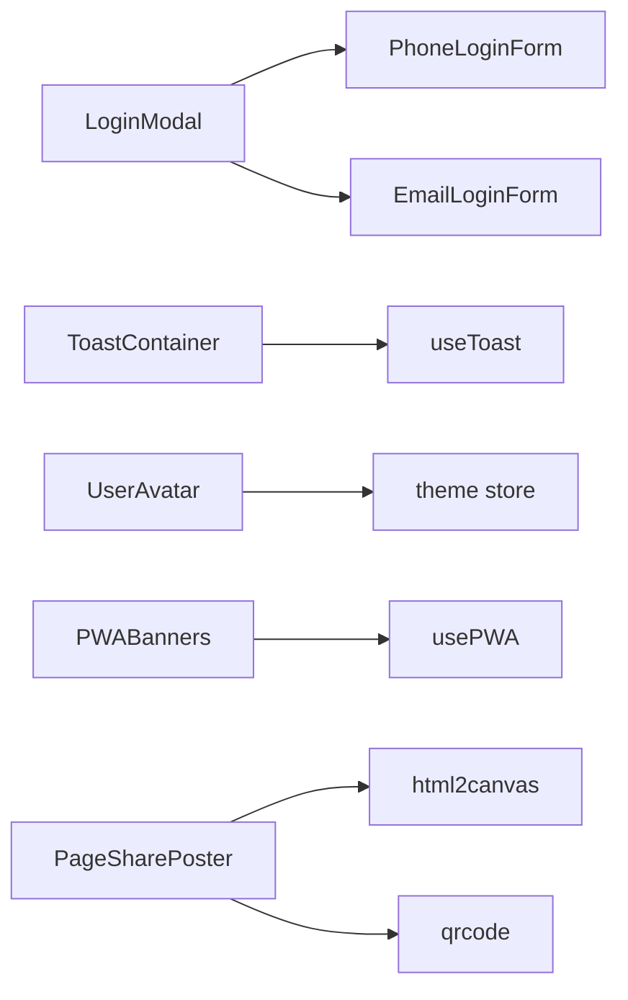

# 通用组件

<cite>
**本文引用的文件**   
- [ConfirmDialog.vue](file://web/app/src/components/common/ConfirmDialog.vue)
- [LoginModal.vue](file://web/app/src/components/common/LoginModal.vue)
- [PhoneLoginForm.vue](file://web/app/src/components/common/PhoneLoginForm.vue)
- [EmailLoginForm.vue](file://web/app/src/components/common/EmailLoginForm.vue)
- [LoadingSpinner.vue](file://web/app/src/components/common/LoadingSpinner.vue)
- [EmptyState.vue](file://web/app/src/components/common/EmptyState.vue)
- [ToastContainer.vue](file://web/app/src/components/common/ToastContainer.vue)
- [useToast.ts](file://web/app/src/composables/useToast.ts)
- [UserAvatar.vue](file://web/app/src/components/common/UserAvatar.vue)
- [PWABanners.vue](file://web/app/src/components/common/PWABanners.vue)
- [PageSharePoster.vue](file://web/app/src/components/common/PageSharePoster.vue)
- [theme.ts](file://web/app/src/stores/theme.ts)
</cite>

## 目录
1. [简介](#简介)
2. [项目结构](#项目结构)
3. [核心组件总览](#核心组件总览)
4. [架构总览](#架构总览)
5. [组件详细分析](#组件详细分析)
6. [依赖关系分析](#依赖关系分析)
7. [性能与优化建议](#性能与优化建议)
8. [故障排查指南](#故障排查指南)
9. [结论](#结论)
10. [附录：Props 接口与事件回调速查](#附录props-接口与事件回调速查)

## 简介
本文件为 Subskin 项目的通用组件基础文档，覆盖以下关键能力：
- ConfirmDialog 确认对话框的可配置化设计（标题、文案、按钮样式、加载态）
- LoginModal 登录模态框的多方式认证支持（手机验证码/密码/注册，邮箱验证码/密码/注册）
- LoadingSpinner 加载动画的三种变体（旋转、脉冲、骨架屏）及性能考量
- EmptyState 空状态的友好提示与可操作入口
- ToastContainer 消息通知的队列管理与自动消隐
- UserAvatar 用户头像的图片回退、尺寸定制、编辑遮罩与主题色适配
- PWABanners 渐进式 Web 应用更新提示、离线提示与安装引导
- PageSharePoster 页面分享海报生成（截图合成、二维码、下载与系统分享）

同时提供 Props 接口定义、事件回调机制、样式主题定制与国际化扩展建议，以及复用模式与最佳实践。

## 项目结构
通用组件集中于 web/app/src/components/common，状态与工具通过 composables 与 stores 提供支撑。下图展示组件与其依赖的关系概览。

图表来源
- [ConfirmDialog.vue:1-60](file://web/app/src/components/common/ConfirmDialog.vue#L1-L60)
- [LoginModal.vue:1-69](file://web/app/src/components/common/LoginModal.vue#L1-L69)
- [PhoneLoginForm.vue:1-157](file://web/app/src/components/common/PhoneLoginForm.vue#L1-L157)
- [EmailLoginForm.vue:1-143](file://web/app/src/components/common/EmailLoginForm.vue#L1-L143)
- [LoadingSpinner.vue:1-48](file://web/app/src/components/common/LoadingSpinner.vue#L1-L48)
- [EmptyState.vue:1-37](file://web/app/src/components/common/EmptyState.vue#L1-L37)
- [ToastContainer.vue:1-47](file://web/app/src/components/common/ToastContainer.vue#L1-L47)
- [useToast.ts:1-31](file://web/app/src/composables/useToast.ts#L1-L31)
- [UserAvatar.vue:1-99](file://web/app/src/components/common/UserAvatar.vue#L1-L99)
- [PWABanners.vue:1-113](file://web/app/src/components/common/PWABanners.vue#L1-L113)
- [PageSharePoster.vue:1-376](file://web/app/src/components/common/PageSharePoster.vue#L1-L376)
- [theme.ts:1-71](file://web/app/src/stores/theme.ts#L1-L71)

章节来源
- [ConfirmDialog.vue:1-60](file://web/app/src/components/common/ConfirmDialog.vue#L1-L60)
- [LoginModal.vue:1-69](file://web/app/src/components/common/LoginModal.vue#L1-L69)
- [LoadingSpinner.vue:1-48](file://web/app/src/components/common/LoadingSpinner.vue#L1-L48)
- [EmptyState.vue:1-37](file://web/app/src/components/common/EmptyState.vue#L1-L37)
- [ToastContainer.vue:1-47](file://web/app/src/components/common/ToastContainer.vue#L1-L47)
- [useToast.ts:1-31](file://web/app/src/composables/useToast.ts#L1-L31)
- [UserAvatar.vue:1-99](file://web/app/src/components/common/UserAvatar.vue#L1-L99)
- [PWABanners.vue:1-113](file://web/app/src/components/common/PWABanners.vue#L1-L113)
- [PageSharePoster.vue:1-376](file://web/app/src/components/common/PageSharePoster.vue#L1-L376)
- [theme.ts:1-71](file://web/app/src/stores/theme.ts#L1-L71)

## 核心组件总览
- ConfirmDialog：统一确认弹窗，支持自定义标题、消息、确认/取消文案、确认按钮样式类、加载态；通过 Teleport 挂载至 body，避免层级问题。
- LoginModal：多标签切换登录方式（手机/邮箱），内部组合 PhoneLoginForm 与 EmailLoginForm，统一错误处理与关闭回调。
- LoadingSpinner：三变体 spinner/pulse/skeleton，骨架屏支持数量控制，适合列表占位。
- EmptyState：统一空态展示，支持图标、标题、描述与动作按钮。
- ToastContainer：基于 useToast 的全局消息队列，支持 success/warning/error/info 四类样式与自动消失。
- UserAvatar：图片头像 + 首字母回退，支持尺寸、可编辑遮罩、上传中状态、点击事件与主题色适配。
- PWABanners：新版本可用横幅、离线提示、安装引导，结合 usePWA 管理状态。
- PageSharePoster：基于 html2canvas 截图合成海报，绘制品牌头图、二维码、页脚说明，支持下载与系统分享。

章节来源
- [ConfirmDialog.vue:1-60](file://web/app/src/components/common/ConfirmDialog.vue#L1-L60)
- [LoginModal.vue:1-69](file://web/app/src/components/common/LoginModal.vue#L1-L69)
- [PhoneLoginForm.vue:1-157](file://web/app/src/components/common/PhoneLoginForm.vue#L1-L157)
- [EmailLoginForm.vue:1-143](file://web/app/src/components/common/EmailLoginForm.vue#L1-L143)
- [LoadingSpinner.vue:1-48](file://web/app/src/components/common/LoadingSpinner.vue#L1-L48)
- [EmptyState.vue:1-37](file://web/app/src/components/common/EmptyState.vue#L1-L37)
- [ToastContainer.vue:1-47](file://web/app/src/components/common/ToastContainer.vue#L1-L47)
- [useToast.ts:1-31](file://web/app/src/composables/useToast.ts#L1-L31)
- [UserAvatar.vue:1-99](file://web/app/src/components/common/UserAvatar.vue#L1-L99)
- [PWABanners.vue:1-113](file://web/app/src/components/common/PWABanners.vue#L1-L113)
- [PageSharePoster.vue:1-376](file://web/app/src/components/common/PageSharePoster.vue#L1-L376)

## 架构总览
下图展示了通用组件在应用中的交互关系与数据流。

图表来源
- [LoginModal.vue:1-69](file://web/app/src/components/common/LoginModal.vue#L1-L69)
- [PhoneLoginForm.vue:1-157](file://web/app/src/components/common/PhoneLoginForm.vue#L1-L157)
- [EmailLoginForm.vue:1-143](file://web/app/src/components/common/EmailLoginForm.vue#L1-L143)
- [ToastContainer.vue:1-47](file://web/app/src/components/common/ToastContainer.vue#L1-L47)
- [useToast.ts:1-31](file://web/app/src/composables/useToast.ts#L1-L31)

## 组件详细分析

### ConfirmDialog 确认对话框
- 可配置项：可见性、标题、消息、确认/取消文案、确认按钮样式类、加载态
- 事件：confirm、cancel
- 行为：Teleport 到 body，点击遮罩取消，禁用按钮防止重复提交
- 主题：使用 Tailwind 语义化颜色，可通过 confirmClass 注入样式
- 国际化建议：将默认文案抽离为 i18n key，如 title/message/confirmText/cancelText

图表来源
- [ConfirmDialog.vue:1-60](file://web/app/src/components/common/ConfirmDialog.vue#L1-L60)

章节来源
- [ConfirmDialog.vue:1-60](file://web/app/src/components/common/ConfirmDialog.vue#L1-L60)

### LoginModal 登录模态框
- 多方式认证：手机（验证码/密码/注册）、邮箱（验证码/密码/注册）
- 子组件：PhoneLoginForm、EmailLoginForm
- 事件：close、error（由子表单冒泡）
- 错误处理：统一 errorMessage 展示
- 主题：暗色模式兼容，主色变量来自 theme store

图表来源
- [LoginModal.vue:1-69](file://web/app/src/components/common/LoginModal.vue#L1-L69)
- [PhoneLoginForm.vue:1-157](file://web/app/src/components/common/PhoneLoginForm.vue#L1-L157)
- [EmailLoginForm.vue:1-143](file://web/app/src/components/common/EmailLoginForm.vue#L1-L143)

章节来源
- [LoginModal.vue:1-69](file://web/app/src/components/common/LoginModal.vue#L1-L69)
- [PhoneLoginForm.vue:1-157](file://web/app/src/components/common/PhoneLoginForm.vue#L1-L157)
- [EmailLoginForm.vue:1-143](file://web/app/src/components/common/EmailLoginForm.vue#L1-L143)

### LoadingSpinner 加载动画
- 变体：spinner（旋转）、pulse（脉冲图标）、skeleton（骨架屏）
- 骨架屏：skeletonCount 控制卡片数量
- 性能：骨架屏使用 CSS 动画，避免重绘大图；长列表建议使用虚拟滚动配合 skeleton
- 主题：主色通过 primary-* 变量驱动

图表来源
- [LoadingSpinner.vue:1-48](file://web/app/src/components/common/LoadingSpinner.vue#L1-L48)

章节来源
- [LoadingSpinner.vue:1-48](file://web/app/src/components/common/LoadingSpinner.vue#L1-L48)

### EmptyState 空状态
- 可配置项：icon、title、description、actionLabel
- 事件：action（用于触发创建/刷新等操作）
- 适用场景：列表为空、无权限、搜索无结果等

章节来源
- [EmptyState.vue:1-37](file://web/app/src/components/common/EmptyState.vue#L1-L37)

### ToastContainer 消息通知与队列管理
- 队列：useToast 维护全局 toasts 数组，按 id 唯一标识
- 类型：success/warning/error/info，对应不同边框与背景色
- 生命周期：show 时入队，duration 后自动出队；支持手动 remove
- 动画：TransitionGroup 实现滑入滑出

图表来源
- [useToast.ts:1-31](file://web/app/src/composables/useToast.ts#L1-L31)
- [ToastContainer.vue:1-47](file://web/app/src/components/common/ToastContainer.vue#L1-L47)

章节来源
- [useToast.ts:1-31](file://web/app/src/composables/useToast.ts#L1-L31)
- [ToastContainer.vue:1-47](file://web/app/src/components/common/ToastContainer.vue#L1-L47)

### UserAvatar 用户头像
- 功能：图片头像优先，失败回退为首字母；支持尺寸、可编辑遮罩、上传中状态、点击事件
- 主题：bg-primary-100/dark:bg-primary-900，文字颜色随主题变化
- 缓存策略：imageUrl 变化时重置加载错误；受保护 URL 通过 toProtectedFileUrl 转换
- 建议：对大头像进行懒加载与缩略图缓存，避免重复请求

图表来源
- [UserAvatar.vue:1-99](file://web/app/src/components/common/UserAvatar.vue#L1-L99)

章节来源
- [UserAvatar.vue:1-99](file://web/app/src/components/common/UserAvatar.vue#L1-L99)

### PWABanners 渐进式 Web 应用提示
- 功能：新版本可用横幅、离线提示、安装引导
- 状态：isInstallable、isOffline、showUpdateBanner 由 usePWA 提供
- 交互：更新、稍后、关闭、安装应用
- 环境：区分 staging 与生产环境样式

章节来源
- [PWABanners.vue:1-113](file://web/app/src/components/common/PWABanners.vue#L1-L113)

### PageSharePoster 页面分享海报生成
- 流程：监听 visible，捕获 main 或 #app 截图，计算内容高度，绘制品牌头图、标题、截图、二维码、页脚与免责声明，输出 base64 图片
- 能力：下载保存、系统分享（Web Share API），微信环境下长按保存提示
- 依赖：html2canvas、qrcode
- 性能：限制最大高度、合理缩放、裁剪居中，减少内存占用

图表来源
- [PageSharePoster.vue:1-376](file://web/app/src/components/common/PageSharePoster.vue#L1-L376)

章节来源
- [PageSharePoster.vue:1-376](file://web/app/src/components/common/PageSharePoster.vue#L1-L376)

## 依赖关系分析
- LoginModal 依赖 PhoneLoginForm 与 EmailLoginForm，二者均依赖 auth store 完成认证流程
- ToastContainer 依赖 useToast 提供的响应式 toasts 与操作方法
- UserAvatar 依赖 file-url 工具与主题 store（primary-* 变量）
- PWABanners 依赖 usePWA 组合式函数
- PageSharePoster 依赖 html2canvas 与 qrcode 库

图表来源
- [LoginModal.vue:1-69](file://web/app/src/components/common/LoginModal.vue#L1-L69)
- [PhoneLoginForm.vue:1-157](file://web/app/src/components/common/PhoneLoginForm.vue#L1-L157)
- [EmailLoginForm.vue:1-143](file://web/app/src/components/common/EmailLoginForm.vue#L1-L143)
- [ToastContainer.vue:1-47](file://web/app/src/components/common/ToastContainer.vue#L1-L47)
- [useToast.ts:1-31](file://web/app/src/composables/useToast.ts#L1-L31)
- [UserAvatar.vue:1-99](file://web/app/src/components/common/UserAvatar.vue#L1-L99)
- [PWABanners.vue:1-113](file://web/app/src/components/common/PWABanners.vue#L1-L113)
- [PageSharePoster.vue:1-376](file://web/app/src/components/common/PageSharePoster.vue#L1-L376)
- [theme.ts:1-71](file://web/app/src/stores/theme.ts#L1-L71)

章节来源
- [LoginModal.vue:1-69](file://web/app/src/components/common/LoginModal.vue#L1-L69)
- [PhoneLoginForm.vue:1-157](file://web/app/src/components/common/PhoneLoginForm.vue#L1-L157)
- [EmailLoginForm.vue:1-143](file://web/app/src/components/common/EmailLoginForm.vue#L1-L143)
- [ToastContainer.vue:1-47](file://web/app/src/components/common/ToastContainer.vue#L1-L47)
- [useToast.ts:1-31](file://web/app/src/composables/useToast.ts#L1-L31)
- [UserAvatar.vue:1-99](file://web/app/src/components/common/UserAvatar.vue#L1-L99)
- [PWABanners.vue:1-113](file://web/app/src/components/common/PWABanners.vue#L1-L113)
- [PageSharePoster.vue:1-376](file://web/app/src/components/common/PageSharePoster.vue#L1-L376)
- [theme.ts:1-71](file://web/app/src/stores/theme.ts#L1-L71)

## 性能与优化建议
- LoadingSpinner
  - skeleton 变体适合大数据量列表占位，避免真实渲染开销
  - 长列表配合虚拟滚动，减少 DOM 节点数量
- ToastContainer
  - 合理设置 duration，避免过多消息堆积
  - 批量操作完成后统一提示，减少频繁入队
- UserAvatar
  - 对 imageUrl 变更进行去抖与缓存，避免重复请求
  - 使用缩略图与懒加载，降低首屏压力
- PageSharePoster
  - 限制截图高度与 scale，避免内存峰值过高
  - 生成失败时快速降级为文本占位，提升用户体验
- PWABanners
  - 仅在 isInstallable/isOffline/showUpdateBanner 为真时渲染，减少不必要的重排

[本节为通用指导，不直接分析具体文件]

## 故障排查指南
- ConfirmDialog
  - 按钮不可用：检查 loading 状态是否被父组件正确传递
  - 层级问题：确保 Teleport 目标存在且 z-index 足够
- LoginModal
  - 表单校验失败：检查手机号/邮箱正则与最小长度校验
  - 错误信息未显示：确认子组件是否正确 emit('error')
- ToastContainer
  - 消息未消失：检查 useToast 的 duration 与 remove 逻辑
  - 样式异常：确认 typeStyles 映射是否存在
- UserAvatar
  - 图片不显示：检查 imageUrl 是否为空或无效，查看 onError 分支
  - 主题色异常：确认 theme store 的 --color-primary-h 变量已设置
- PWABanners
  - 更新横幅不出现：检查 usePWA 的状态与 __APP_ENV__ 环境变量
  - 离线提示错位：根据 showUpdateBanner 动态调整 top 值
- PageSharePoster
  - 生成失败：检查 html2canvas 权限与跨域资源，必要时降级为文本
  - 二维码无法扫描：确认 pageUrl 有效且编码参数正确

章节来源
- [ConfirmDialog.vue:1-60](file://web/app/src/components/common/ConfirmDialog.vue#L1-L60)
- [LoginModal.vue:1-69](file://web/app/src/components/common/LoginModal.vue#L1-L69)
- [PhoneLoginForm.vue:1-157](file://web/app/src/components/common/PhoneLoginForm.vue#L1-L157)
- [EmailLoginForm.vue:1-143](file://web/app/src/components/common/EmailLoginForm.vue#L1-L143)
- [ToastContainer.vue:1-47](file://web/app/src/components/common/ToastContainer.vue#L1-L47)
- [useToast.ts:1-31](file://web/app/src/composables/useToast.ts#L1-L31)
- [UserAvatar.vue:1-99](file://web/app/src/components/common/UserAvatar.vue#L1-L99)
- [PWABanners.vue:1-113](file://web/app/src/components/common/PWABanners.vue#L1-L113)
- [PageSharePoster.vue:1-376](file://web/app/src/components/common/PageSharePoster.vue#L1-L376)

## 结论
上述通用组件以高内聚、低耦合为原则，通过 props/emits 明确接口，借助 composables 与 stores 管理状态与主题，满足多场景复用需求。建议在后续迭代中完善国际化与单元测试，进一步提升可维护性与稳定性。

[本节为总结，不直接分析具体文件]

## 附录：Props 接口与事件回调速查
- ConfirmDialog
  - Props：visible、title、message、confirmText、cancelText、confirmClass、loading
  - Events：confirm、cancel
- LoginModal
  - Events：close、error（由子表单冒泡）
- PhoneLoginForm / EmailLoginForm
  - Events：close、error
- LoadingSpinner
  - Props：message、variant、skeletonCount
- EmptyState
  - Props：icon、title、description、actionLabel
  - Events：action
- ToastContainer
  - 依赖 useToast：show、success、warning、error、remove
- UserAvatar
  - Props：imageUrl、initial、size、editable、uploading、userId
  - Events：click
- PWABanners
  - 依赖 usePWA：isInstallable、isOffline、showUpdateBanner、installApp、dismissInstall、dismissInstallLong、dismissUpdate、updateApp
- PageSharePoster
  - Props：visible、pageTitle、pageUrl
  - Events：close

章节来源
- [ConfirmDialog.vue:1-60](file://web/app/src/components/common/ConfirmDialog.vue#L1-L60)
- [LoginModal.vue:1-69](file://web/app/src/components/common/LoginModal.vue#L1-L69)
- [PhoneLoginForm.vue:1-157](file://web/app/src/components/common/PhoneLoginForm.vue#L1-L157)
- [EmailLoginForm.vue:1-143](file://web/app/src/components/common/EmailLoginForm.vue#L1-L143)
- [LoadingSpinner.vue:1-48](file://web/app/src/components/common/LoadingSpinner.vue#L1-L48)
- [EmptyState.vue:1-37](file://web/app/src/components/common/EmptyState.vue#L1-L37)
- [ToastContainer.vue:1-47](file://web/app/src/components/common/ToastContainer.vue#L1-L47)
- [useToast.ts:1-31](file://web/app/src/composables/useToast.ts#L1-L31)
- [UserAvatar.vue:1-99](file://web/app/src/components/common/UserAvatar.vue#L1-L99)
- [PWABanners.vue:1-113](file://web/app/src/components/common/PWABanners.vue#L1-L113)
- [PageSharePoster.vue:1-376](file://web/app/src/components/common/PageSharePoster.vue#L1-L376)