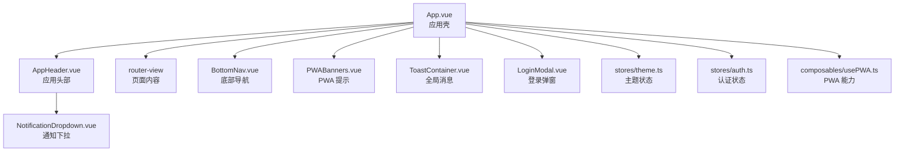
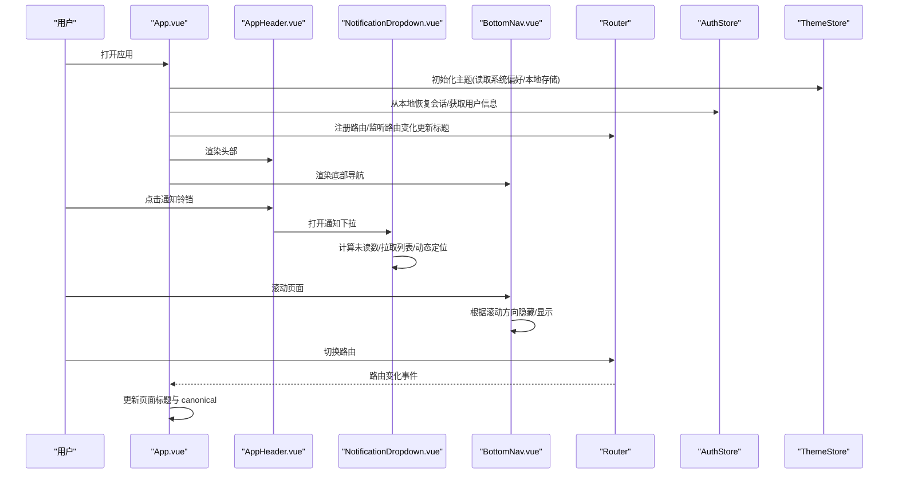
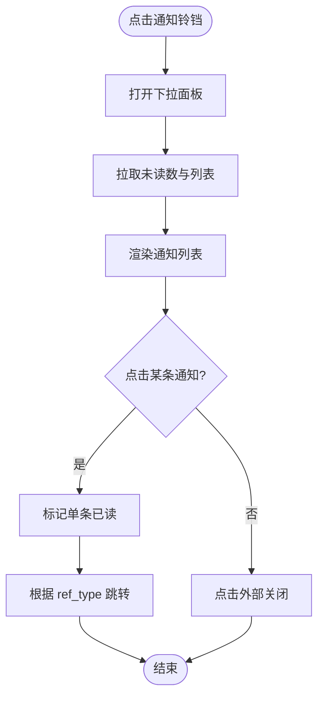
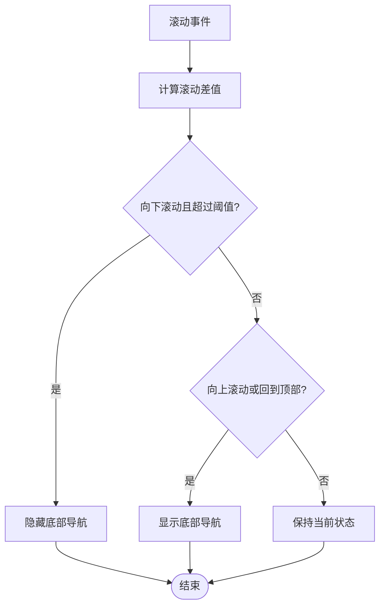
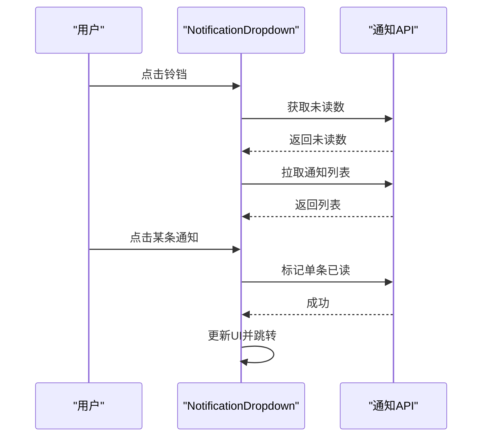
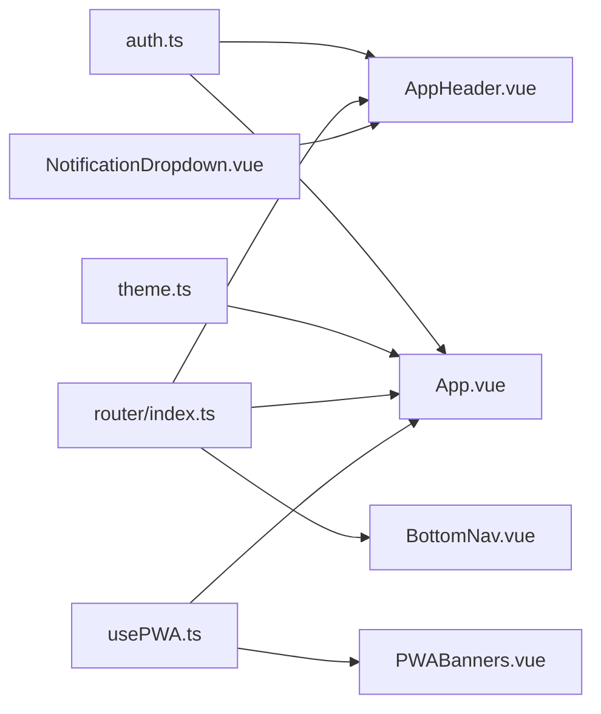

# 布局组件

<cite>
**本文引用的文件**
- [AppHeader.vue](file://web/app/src/components/layout/AppHeader.vue)
- [BottomNav.vue](file://web/app/src/components/layout/BottomNav.vue)
- [NotificationDropdown.vue](file://web/app/src/components/layout/NotificationDropdown.vue)
- [App.vue](file://web/app/src/App.vue)
- [main.ts](file://web/app/src/main.ts)
- [theme.ts](file://web/app/src/stores/theme.ts)
- [auth.ts](file://web/app/src/stores/auth.ts)
- [usePWA.ts](file://web/app/src/composables/usePWA.ts)
- [PWABanners.vue](file://web/app/src/components/common/PWABanners.vue)
- [ToastContainer.vue](file://web/app/src/components/common/ToastContainer.vue)
- [router/index.ts](file://web/app/src/router/index.ts)
- [main.css](file://web/app/src/styles/main.css)
</cite>

## 目录
1. [简介](#简介)
2. [项目结构](#项目结构)
3. [核心组件](#核心组件)
4. [架构总览](#架构总览)
5. [详细组件分析](#详细组件分析)
6. [依赖关系分析](#依赖关系分析)
7. [性能考量](#性能考量)
8. [故障排查指南](#故障排查指南)
9. [结论](#结论)
10. [附录](#附录)

## 简介
本章节面向 Subskin 应用级布局组件，系统性说明头部、底部导航与通知下拉等核心布局元素的设计模式与实现要点。文档覆盖移动端优先的响应式策略、多端适配、导航状态管理、PWA 集成、主题切换与可访问性优化，并提供布局组合与扩展指南，帮助开发者快速理解并安全扩展应用壳层。

## 项目结构
应用壳由根组件 App.vue 组织，顶部为 AppHeader，主体区域通过路由渲染页面，底部为 BottomNav；全局通知、登录弹窗、PWA 提示与 Toast 以 Teleport 或条件渲染挂载在根层级。样式基于 Tailwind 与自定义 CSS 变量，提供暗色模式与主色调可调能力。

图表来源
- [App.vue:1-16](file://web/app/src/App.vue#L1-L16)
- [AppHeader.vue:1-220](file://web/app/src/components/layout/AppHeader.vue#L1-L220)
- [BottomNav.vue:1-184](file://web/app/src/components/layout/BottomNav.vue#L1-L184)
- [NotificationDropdown.vue:1-260](file://web/app/src/components/layout/NotificationDropdown.vue#L1-L260)
- [PWABanners.vue:1-42](file://web/app/src/components/common/PWABanners.vue#L1-L42)
- [ToastContainer.vue:1-47](file://web/app/src/components/common/ToastContainer.vue#L1-L47)
- [theme.ts:1-71](file://web/app/src/stores/theme.ts#L1-L71)
- [auth.ts:1-259](file://web/app/src/stores/auth.ts#L1-L259)
- [usePWA.ts:1-441](file://web/app/src/composables/usePWA.ts#L1-L441)

章节来源
- [App.vue:1-16](file://web/app/src/App.vue#L1-L16)
- [main.ts:1-11](file://web/app/src/main.ts#L1-L11)

## 核心组件
- 应用头部 AppHeader：固定顶部、品牌标识、主导航、分享入口、通知铃铛、用户菜单（登录/个人中心/退出）。支持环境差异化样式（staging），并联动路由高亮。
- 底部导航 BottomNav：移动端固定底部，根据滚动方向自动隐藏/显示，按当前路由高亮对应项，提供图标+标签的触控友好布局。
- 通知下拉 NotificationDropdown：动态定位的下拉面板，展示未读数量、列表、全部已读、点击跳转至目标页，支持滚动/缩放时重算位置。
- 应用壳 App.vue：组合上述布局组件，注入主题、认证、PWA、微信分享、手势滑动等全局能力，维护页面标题与 canonical 元信息。

章节来源
- [AppHeader.vue:1-220](file://web/app/src/components/layout/AppHeader.vue#L1-L220)
- [BottomNav.vue:1-184](file://web/app/src/components/layout/BottomNav.vue#L1-L184)
- [NotificationDropdown.vue:1-260](file://web/app/src/components/layout/NotificationDropdown.vue#L1-L260)
- [App.vue:1-117](file://web/app/src/App.vue#L1-L117)

## 架构总览
应用采用“壳 + 视图”的经典布局：壳负责全局导航、主题、认证、PWA 与全局反馈；视图通过路由按需加载。布局组件之间低耦合，通过 Pinia store 共享状态（认证、主题），通过 composables 复用 PWA 等能力。

图表来源
- [App.vue:19-117](file://web/app/src/App.vue#L19-L117)
- [AppHeader.vue:1-220](file://web/app/src/components/layout/AppHeader.vue#L1-L220)
- [NotificationDropdown.vue:1-260](file://web/app/src/components/layout/NotificationDropdown.vue#L1-L260)
- [BottomNav.vue:1-184](file://web/app/src/components/layout/BottomNav.vue#L1-L184)
- [router/index.ts:1-155](file://web/app/src/router/index.ts#L1-L155)
- [theme.ts:1-71](file://web/app/src/stores/theme.ts#L1-L71)
- [auth.ts:1-259](file://web/app/src/stores/auth.ts#L1-L259)

## 详细组件分析

### 应用头部 AppHeader
- 功能要点
  - 固定顶部，支持 staging 环境深色样式。
  - 主导航使用 router-link，结合 isNavActive 判断高亮，覆盖首页、日记、测评、社区等路径族。
  - 分享按钮触发 PageShareSheet/PageSharePoster，动态生成标题与 URL。
  - 通知铃铛仅在登录后显示，委托给 NotificationDropdown。
  - 用户头像/首字母兜底，头像加载失败回退到首字母；用户菜单包含个人中心、隐私政策、退出登录。
  - 点击外部关闭用户菜单，生命周期内绑定/解绑 document 事件。
- 交互流程
  - 点击通知铃铛 -> 打开下拉 -> 拉取未读数与列表 -> 点击条目标记已读并跳转。
  - 点击头像 -> 展开/收起用户菜单 -> 选择退出登录 -> 调用 authStore.logout。
- 可访问性
  - 按钮具备 aria-label，图片 alt 描述清晰，链接语义化。
- 样式与响应式
  - 桌面端显示完整导航，移动端隐藏顶部导航（由 BottomNav 承担）。
  - 使用 Tailwind 工具类与 scoped 样式控制激活态与 hover 效果。

图表来源
- [NotificationDropdown.vue:80-131](file://web/app/src/components/layout/NotificationDropdown.vue#L80-L131)
- [AppHeader.vue:136-171](file://web/app/src/components/layout/AppHeader.vue#L136-L171)

章节来源
- [AppHeader.vue:1-220](file://web/app/src/components/layout/AppHeader.vue#L1-L220)
- [NotificationDropdown.vue:1-260](file://web/app/src/components/layout/NotificationDropdown.vue#L1-L260)
- [auth.ts:210-227](file://web/app/src/stores/auth.ts#L210-L227)

### 底部导航 BottomNav
- 功能要点
  - 固定底部，提供四个主要入口：问答、日记、测评、白友圈。
  - 根据当前路由高亮对应项，支持子路径匹配（如 /assessment/*、/diary/*）。
  - 监听滚动事件，超过阈值且向下滚动时隐藏，向上滚动或回到顶部时显示，提升阅读体验。
  - 移动端可见，桌面端隐藏（min-width: 768px）。
- 可访问性
  - 导航容器设置 role="navigation" 与 aria-label。
- 样式与响应式
  - 毛玻璃背景、安全区域适配（safe-area-inset-bottom）、触控反馈动画。

图表来源
- [BottomNav.vue:35-52](file://web/app/src/components/layout/BottomNav.vue#L35-L52)
- [BottomNav.vue:78-183](file://web/app/src/components/layout/BottomNav.vue#L78-L183)

章节来源
- [BottomNav.vue:1-184](file://web/app/src/components/layout/BottomNav.vue#L1-L184)

### 通知下拉 NotificationDropdown
- 功能要点
  - 动态定位：移动端全屏宽度居中，桌面端右对齐铃铛按钮，考虑视口边界裁剪。
  - 数据流：轮询未读数，打开时拉取列表，点击条目标记已读并跳转。
  - 列表展示：头像/类型图标、标题、摘要、相对时间、未读点。
  - 全部已读：批量标记并清空未读数。
- 可访问性
  - 铃铛按钮具备 aria-label，列表项可聚焦并可键盘操作（由浏览器默认行为保障）。
- 性能
  - 使用 Teleport 将下拉面板挂载到 body，避免父级 overflow/transform 影响定位。
  - 滚动/resize 时重新计算位置，避免溢出屏幕。

图表来源
- [NotificationDropdown.vue:80-131](file://web/app/src/components/layout/NotificationDropdown.vue#L80-L131)
- [NotificationDropdown.vue:143-156](file://web/app/src/components/layout/NotificationDropdown.vue#L143-L156)

章节来源
- [NotificationDropdown.vue:1-260](file://web/app/src/components/layout/NotificationDropdown.vue#L1-L260)

### 应用壳 App.vue
- 功能要点
  - 组合 AppHeader、BottomNav、PWABanners、ToastContainer、LoginModal。
  - 初始化主题、认证、手势滑动、微信分享配置。
  - 监听路由变化，动态更新页面标题与 canonical、OG 标签。
  - 全局点击捕获，收集 data-track-id 进行埋点。
  - iOS 设备检测，添加 data-ios 属性用于样式适配。
- 可访问性
  - 提供“跳转到主要内容”的跳过链接，便于键盘/读屏用户快速进入正文。

章节来源
- [App.vue:1-117](file://web/app/src/App.vue#L1-L117)

### 主题切换 Theme Store
- 功能要点
  - 支持 light/dark 模式，持久化到 localStorage。
  - 支持自定义主色调色相（hue），实时应用到 CSS 变量。
  - 监听系统偏好，初始应用系统主题。
- 与布局的关系
  - 头部与底部导航均受主题影响，通知下拉也遵循暗色模式。
  - 通过 CSS 变量统一控制主色阶，确保一致性。

章节来源
- [theme.ts:1-71](file://web/app/src/stores/theme.ts#L1-L71)
- [main.css:5-35](file://web/app/src/styles/main.css#L5-L35)

### PWA 集成与提示
- 功能要点
  - 安装引导：捕获 beforeinstallprompt，记录用户选择，统计连续访问天数后提示安装。
  - 离线检测：监听 online/offline 事件，更新状态。
  - 版本更新：轮询 version.json，发现新版本提示更新，支持延迟刷新。
  - 状态上报：登录后上报安装状态到后端。
- 与布局的关系
  - PWABanners 作为全局横幅，出现在应用壳中，不影响主布局结构。
  - Toast 用于安装成功等反馈。

章节来源
- [usePWA.ts:1-441](file://web/app/src/composables/usePWA.ts#L1-L441)
- [PWABanners.vue:1-42](file://web/app/src/components/common/PWABanners.vue#L1-L42)
- [ToastContainer.vue:1-47](file://web/app/src/components/common/ToastContainer.vue#L1-L47)

## 依赖关系分析
- 组件间依赖
  - AppHeader 依赖 authStore（登录态、用户信息）与 NotificationDropdown。
  - BottomNav 依赖 vue-router 的路由对象进行高亮判断。
  - NotificationDropdown 依赖通知 API 与路由进行跳转。
  - App.vue 组合所有布局组件，并注入 theme/auth/PWA 等能力。
- 状态管理
  - 认证状态集中在 authStore，控制登录态、用户信息与文件令牌刷新。
  - 主题状态集中在 themeStore，控制暗色模式与主色调。
- 路由与页面
  - 路由定义在 router/index.ts，App.vue 根据路由更新标题与 canonical。

图表来源
- [auth.ts:1-259](file://web/app/src/stores/auth.ts#L1-L259)
- [theme.ts:1-71](file://web/app/src/stores/theme.ts#L1-L71)
- [router/index.ts:1-155](file://web/app/src/router/index.ts#L1-L155)
- [usePWA.ts:1-441](file://web/app/src/composables/usePWA.ts#L1-L441)
- [AppHeader.vue:1-220](file://web/app/src/components/layout/AppHeader.vue#L1-L220)
- [BottomNav.vue:1-184](file://web/app/src/components/layout/BottomNav.vue#L1-L184)
- [NotificationDropdown.vue:1-260](file://web/app/src/components/layout/NotificationDropdown.vue#L1-L260)
- [PWABanners.vue:1-42](file://web/app/src/components/common/PWABanners.vue#L1-L42)

章节来源
- [auth.ts:1-259](file://web/app/src/stores/auth.ts#L1-L259)
- [theme.ts:1-71](file://web/app/src/stores/theme.ts#L1-L71)
- [router/index.ts:1-155](file://web/app/src/router/index.ts#L1-L155)

## 性能考量
- 滚动优化
  - 底部导航监听 scroll 使用 passive 选项，减少滚动抖动。
  - 通知下拉在滚动/resize 时仅重算定位，避免全量重绘。
- 网络请求
  - 通知未读数定时轮询，注意频率与错误处理；列表仅在打开时拉取。
  - 文件令牌后台刷新，避免频繁 UI 阻塞。
- 渲染优化
  - 使用 keep-alive 缓存社区页面，减少重复渲染。
  - 头像加载失败回退到首字母，降低图片失败对布局的影响。
- 样式与主题
  - 通过 CSS 变量与 Tailwind 工具类减少重复样式，提高一致性。
  - 暗色模式切换仅修改 class 与变量，避免大范围重排。

[本节为通用性能建议，不直接引用具体代码行]

## 故障排查指南
- 通知下拉定位异常
  - 检查是否被父级 transform/overflow 影响；确认 Teleport 挂载到 body。
  - 在窗口 resize 或滚动时重新计算位置。
  - 参考实现：动态定位逻辑与事件监听。
- 底部导航不显示/不隐藏
  - 检查滚动事件是否正确绑定与解绑。
  - 确认阈值与 delta 计算逻辑是否符合预期。
- 主题切换无效
  - 确认 themeStore 的 mode 与 customHue 是否正确写入 localStorage。
  - 检查根节点是否添加了 dark class，CSS 变量是否生效。
- 登录态丢失
  - 检查 authStore 的 initFromStorage 与 token 刷新逻辑。
  - 确认文件令牌刷新定时器是否启动。
- PWA 安装提示不出现
  - 检查 beforeinstallprompt 是否被捕获，用户是否连续访问满足条件。
  - 查看 dismiss 冷却时间与次数限制。

章节来源
- [NotificationDropdown.vue:18-54](file://web/app/src/components/layout/NotificationDropdown.vue#L18-L54)
- [NotificationDropdown.vue:143-156](file://web/app/src/components/layout/NotificationDropdown.vue#L143-L156)
- [BottomNav.vue:35-52](file://web/app/src/components/layout/BottomNav.vue#L35-L52)
- [theme.ts:16-55](file://web/app/src/stores/theme.ts#L16-L55)
- [auth.ts:33-61](file://web/app/src/stores/auth.ts#L33-L61)
- [usePWA.ts:22-32](file://web/app/src/composables/usePWA.ts#L22-L32)
- [usePWA.ts:79-98](file://web/app/src/composables/usePWA.ts#L79-L98)

## 结论
Subskin 的布局组件以 App.vue 为核心，组合 AppHeader、BottomNav 与 NotificationDropdown，形成稳定、可扩展的应用壳。通过 Pinia 管理认证与主题状态，通过 composables 封装 PWA 能力，实现了移动端优先、多端适配、可访问性与用户体验优化的平衡。建议在新增布局元素时遵循现有模式：低耦合、状态集中、样式变量化、可访问性完备，并通过路由与 store 进行联动。

[本节为总结性内容，不直接引用具体代码行]

## 附录

### 移动端优先与多端适配策略
- 移动优先
  - 底部导航在移动端固定显示，桌面端隐藏；顶部导航在桌面端显示，移动端隐藏。
  - 触摸目标最小尺寸与触控反馈优化。
- 安全区域
  - 使用 safe-area-inset-* 适配刘海屏与底部横条。
- 响应式断点
  - 基于 Tailwind 断点控制显示/隐藏与间距调整。

章节来源
- [BottomNav.vue:78-183](file://web/app/src/components/layout/BottomNav.vue#L78-L183)
- [main.css:31-35](file://web/app/src/styles/main.css#L31-L35)
- [main.css:86-90](file://web/app/src/styles/main.css#L86-L90)

### 导航状态管理
- 路由高亮
  - AppHeader 与 BottomNav 分别实现 isNavActive/isActive，覆盖主路径与子路径。
- 页面标题与 SEO
  - App.vue 根据路由更新 title、canonical 与 OG 标签。

章节来源
- [AppHeader.vue:25-29](file://web/app/src/components/layout/AppHeader.vue#L25-L29)
- [BottomNav.vue:19-33](file://web/app/src/components/layout/BottomNav.vue#L19-L33)
- [App.vue:54-93](file://web/app/src/App.vue#L54-L93)

### PWA 特性集成
- 安装引导与状态追踪
  - 捕获 beforeinstallprompt，记录用户选择与连续访问天数。
- 版本更新提示
  - 轮询 version.json，发现新版本提示更新，支持延迟刷新。
- 离线能力
  - 监听 online/offline，更新状态并在恢复时尝试更新 Service Worker。

章节来源
- [usePWA.ts:22-32](file://web/app/src/composables/usePWA.ts#L22-L32)
- [usePWA.ts:312-367](file://web/app/src/composables/usePWA.ts#L312-L367)
- [PWABanners.vue:1-42](file://web/app/src/components/common/PWABanners.vue#L1-L42)

### 主题切换支持
- 模式切换
  - 支持 light/dark，持久化到 localStorage，并监听系统偏好。
- 主色调可调
  - 通过 hue 变量动态调整主色阶，全站一致。

章节来源
- [theme.ts:16-55](file://web/app/src/stores/theme.ts#L16-L55)
- [main.css:5-35](file://web/app/src/styles/main.css#L5-L35)

### 可访问性优化
- 语义化与标注
  - 导航使用 nav 与 aria-label，按钮具备 aria-label，图片具备 alt。
- 键盘与读屏
  - 提供“跳转到主要内容”的跳过链接，保证键盘可达。
- 触控与视觉
  - 合适的触控目标尺寸与对比度，暗色模式下的可读性。

章节来源
- [App.vue:2-3](file://web/app/src/App.vue#L2-L3)
- [BottomNav.vue:56-61](file://web/app/src/components/layout/BottomNav.vue#L56-L61)
- [NotificationDropdown.vue:162-167](file://web/app/src/components/layout/NotificationDropdown.vue#L162-L167)

### 布局组合模式与扩展指南
- 组合模式
  - 在 App.vue 中组合头部、主体、底部与全局提示，保持壳层简洁。
  - 通过路由与 keep-alive 控制页面缓存与渲染。
- 扩展建议
  - 新增导航项：在 AppHeader 与 BottomNav 中同步添加路由与高亮逻辑。
  - 新增全局提示：复用 ToastContainer 与 Teleport 模式。
  - 新增主题能力：在 themeStore 中扩展变量，并在组件中使用 CSS 变量。
  - 新增 PWA 能力：在 usePWA 中扩展状态与事件，在 PWABanners 中展示。

章节来源
- [App.vue:1-16](file://web/app/src/App.vue#L1-L16)
- [AppHeader.vue:100-117](file://web/app/src/components/layout/AppHeader.vue#L100-L117)
- [BottomNav.vue:10-17](file://web/app/src/components/layout/BottomNav.vue#L10-L17)
- [PWABanners.vue:1-42](file://web/app/src/components/common/PWABanners.vue#L1-L42)
- [theme.ts:16-55](file://web/app/src/stores/theme.ts#L16-L55)