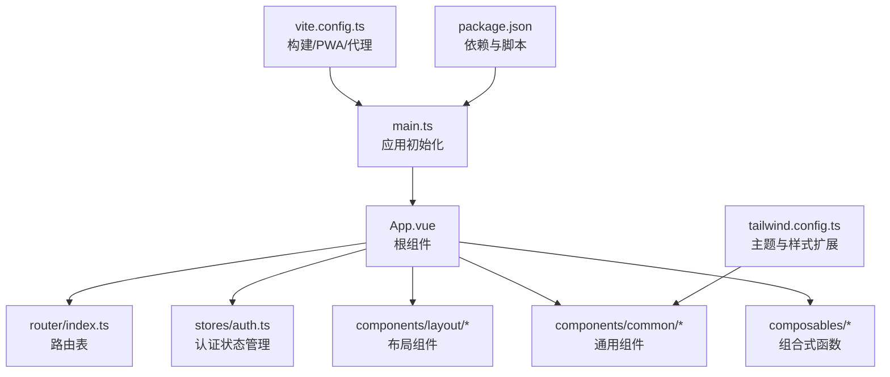
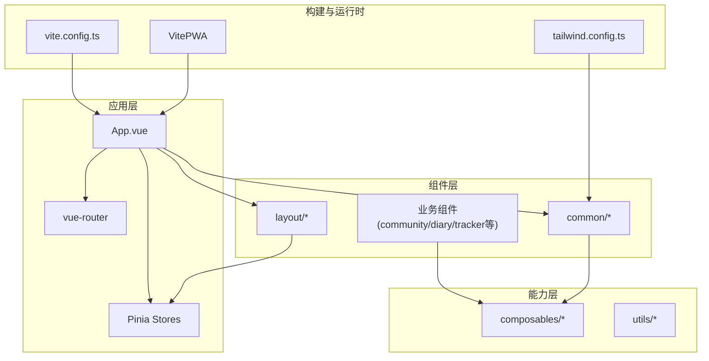
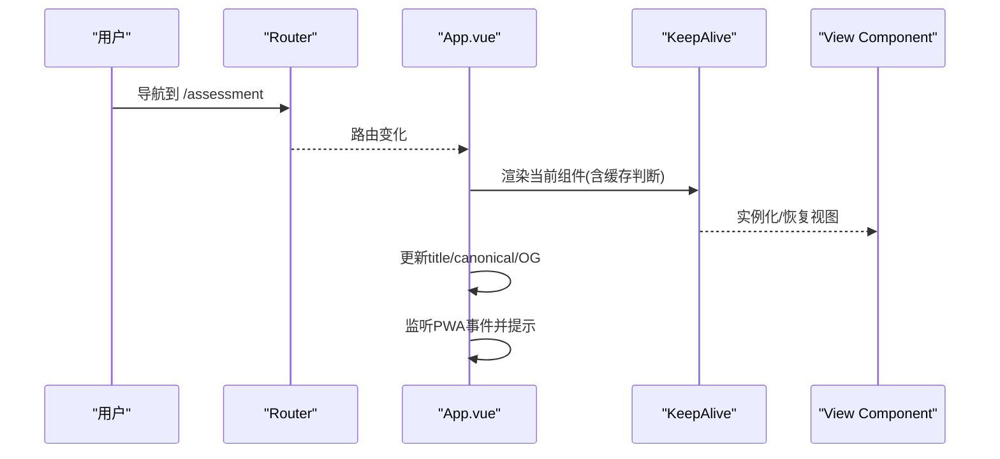
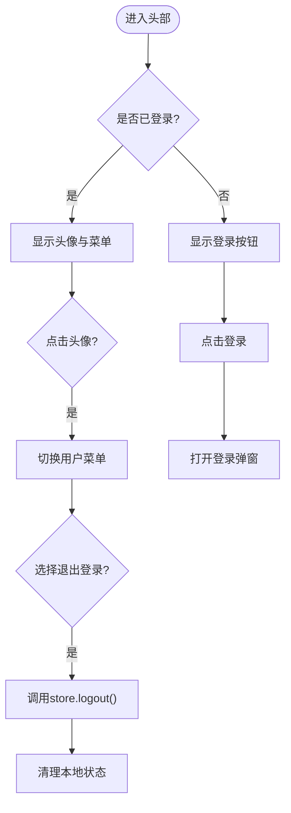
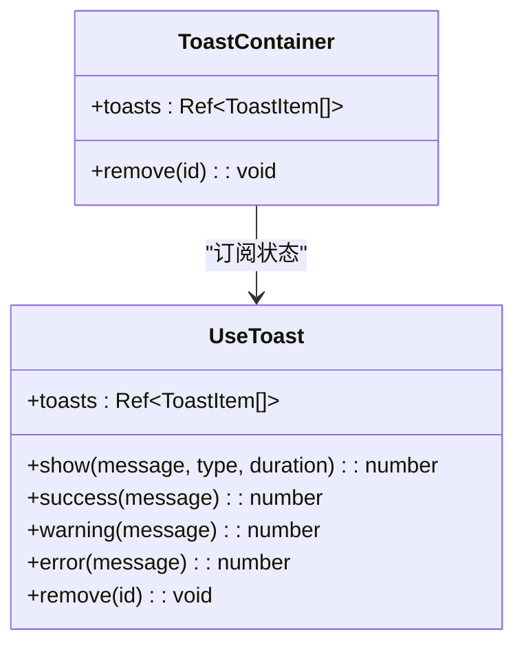
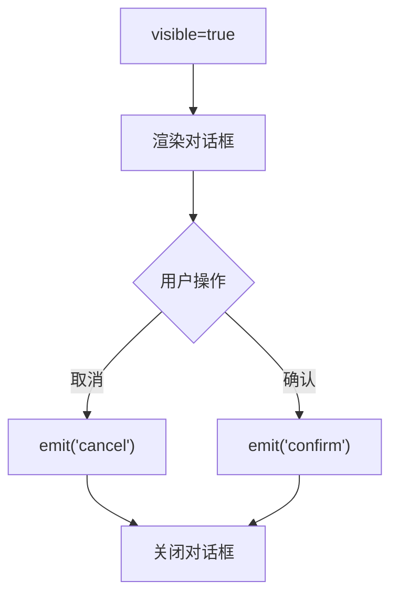
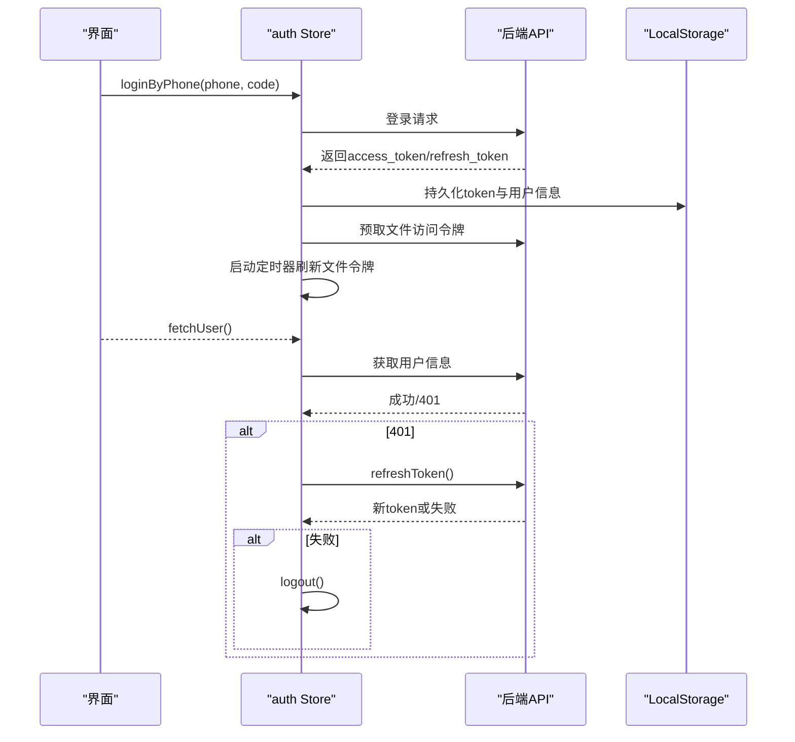
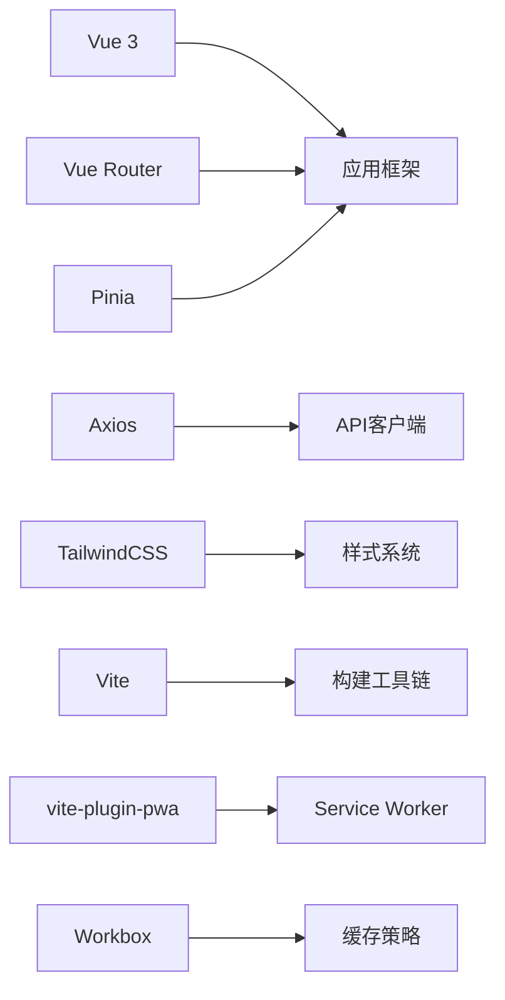
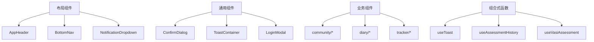

# 组件系统设计

<cite>
**本文引用的文件**   
- [web/app/src/main.ts](file://web/app/src/main.ts)
- [web/app/src/App.vue](file://web/app/src/App.vue)
- [web/app/src/router/index.ts](file://web/app/src/router/index.ts)
- [web/app/package.json](file://web/app/package.json)
- [web/app/vite.config.ts](file://web/app/vite.config.ts)
- [web/app/tailwind.config.ts](file://web/app/tailwind.config.ts)
- [web/app/src/components/common/ToastContainer.vue](file://web/app/src/components/common/ToastContainer.vue)
- [web/app/src/components/layout/AppHeader.vue](file://web/app/src/components/layout/AppHeader.vue)
- [web/app/src/stores/auth.ts](file://web/app/src/stores/auth.ts)
- [web/app/src/composables/useToast.ts](file://web/app/src/composables/useToast.ts)
- [web/app/src/components/common/ConfirmDialog.vue](file://web/app/src/components/common/ConfirmDialog.vue)
</cite>

## 目录
1. [引言](#引言)
2. [项目结构](#项目结构)
3. [核心组件](#核心组件)
4. [架构总览](#架构总览)
5. [详细组件分析](#详细组件分析)
6. [依赖分析](#依赖分析)
7. [性能考虑](#性能考虑)
8. [故障排查指南](#故障排查指南)
9. [结论](#结论)
10. [附录](#附录)

## 引言
本设计文档面向 Subskin 项目的 Vue 3 前端，系统化阐述组件系统的设计规范、层次结构与组合式 API 使用模式。重点覆盖通用组件库设计、业务组件组织、组件间通信机制；并给出响应式设计与移动端适配方案、无障碍访问支持、组件测试策略、性能优化技巧与样式隔离方案。最后提供组件分类图与最佳实践指南，帮助团队在复杂业务场景下保持一致性与可维护性。

## 项目结构
Subskin 的前端位于 web/app 目录，采用 Vite + Vue 3 + TypeScript + TailwindCSS + Pinia + Vue Router 的技术栈。入口文件负责应用初始化、插件挂载与全局样式引入；根组件 App.vue 承担路由视图渲染、全局交互（如 PWA、登录弹窗、Toast）与元信息更新；路由定义按功能域划分页面；Tailwind 配置统一主题色板与字体；Vite 配置包含 PWA、代理与构建产物输出路径。

图表来源
- [web/app/src/main.ts:1-11](file://web/app/src/main.ts#L1-L11)
- [web/app/src/App.vue:1-117](file://web/app/src/App.vue#L1-L117)
- [web/app/src/router/index.ts:1-155](file://web/app/src/router/index.ts#L1-L155)
- [web/app/vite.config.ts:1-110](file://web/app/vite.config.ts#L1-L110)
- [web/app/tailwind.config.ts:1-63](file://web/app/tailwind.config.ts#L1-L63)
- [web/app/package.json:1-55](file://web/app/package.json#L1-L55)

章节来源
- [web/app/src/main.ts:1-11](file://web/app/src/main.ts#L1-L11)
- [web/app/src/App.vue:1-117](file://web/app/src/App.vue#L1-L117)
- [web/app/src/router/index.ts:1-155](file://web/app/src/router/index.ts#L1-L155)
- [web/app/vite.config.ts:1-110](file://web/app/vite.config.ts#L1-L110)
- [web/app/tailwind.config.ts:1-63](file://web/app/tailwind.config.ts#L1-L63)
- [web/app/package.json:1-55](file://web/app/package.json#L1-L55)

## 核心组件
- 根组件 App.vue：负责路由视图渲染、全局点击埋点、PWA 事件监听、iOS 环境标记、动态标题与 canonical/OG 标签更新、底部导航与 Toast 容器挂载。
- 布局组件 AppHeader.vue：顶部导航、用户菜单、分享面板、通知下拉、活跃路由高亮逻辑与环境差异化样式。
- 通用组件：
  - ToastContainer.vue：基于 Teleport 的全局消息提示，配合 useToast 组合式函数实现类型化消息展示与自动消失。
  - ConfirmDialog.vue：统一的确认对话框，支持加载态与自定义文案。
- 状态管理 stores/auth.ts：集中处理登录、注册、刷新令牌、用户信息与文件访问令牌生命周期管理。
- 组合式函数 composables/useToast.ts：轻量级 toast 状态管理与展示方法。

章节来源
- [web/app/src/App.vue:1-117](file://web/app/src/App.vue#L1-L117)
- [web/app/src/components/layout/AppHeader.vue:1-220](file://web/app/src/components/layout/AppHeader.vue#L1-L220)
- [web/app/src/components/common/ToastContainer.vue:1-47](file://web/app/src/components/common/ToastContainer.vue#L1-L47)
- [web/app/src/components/common/ConfirmDialog.vue:1-60](file://web/app/src/components/common/ConfirmDialog.vue#L1-L60)
- [web/app/src/stores/auth.ts:1-259](file://web/app/src/stores/auth.ts#L1-L259)
- [web/app/src/composables/useToast.ts:1-31](file://web/app/src/composables/useToast.ts#L1-L31)

## 架构总览
整体采用“根组件 + 路由视图 + 布局组件 + 通用组件 + 组合式函数 + Pinia Store”的分层架构。数据流以 Pinia 为中心，API 调用通过组合式函数或 store 封装，UI 通过 props/emits 与响应式状态驱动。构建与运行时由 Vite 与 PWA 插件协同，样式通过 Tailwind 原子类与 scoped 样式结合。

图表来源
- [web/app/src/App.vue:1-117](file://web/app/src/App.vue#L1-L117)
- [web/app/src/router/index.ts:1-155](file://web/app/src/router/index.ts#L1-L155)
- [web/app/src/stores/auth.ts:1-259](file://web/app/src/stores/auth.ts#L1-L259)
- [web/app/vite.config.ts:1-110](file://web/app/vite.config.ts#L1-L110)
- [web/app/tailwind.config.ts:1-63](file://web/app/tailwind.config.ts#L1-L63)

## 详细组件分析

### 根组件 App.vue 与路由集成
- 路由视图渲染：使用 keep-alive 缓存指定页面，提升切换体验。
- 全局交互：点击捕获用于埋点统计；PWA 安装事件触发成功提示。
- 元信息管理：根据路由动态设置 title、canonical 与 OG 标签。
- 环境标记：识别 iOS 设备并设置 data 属性，便于样式与行为区分。

图表来源
- [web/app/src/App.vue:1-117](file://web/app/src/App.vue#L1-L117)
- [web/app/src/router/index.ts:1-155](file://web/app/src/router/index.ts#L1-L155)

章节来源
- [web/app/src/App.vue:1-117](file://web/app/src/App.vue#L1-L117)
- [web/app/src/router/index.ts:1-155](file://web/app/src/router/index.ts#L1-L155)

### 布局组件 AppHeader.vue
- 导航高亮：根据当前路由计算激活状态，支持子路由匹配。
- 用户菜单：未登录显示登录按钮，已登录显示头像与下拉菜单，支持退出登录。
- 分享能力：打开分享面板与海报生成器，标题与 URL 随路由动态变化。
- 环境差异：staging 环境下深色导航栏与按钮样式。

图表来源
- [web/app/src/components/layout/AppHeader.vue:1-220](file://web/app/src/components/layout/AppHeader.vue#L1-L220)
- [web/app/src/stores/auth.ts:1-259](file://web/app/src/stores/auth.ts#L1-L259)

章节来源
- [web/app/src/components/layout/AppHeader.vue:1-220](file://web/app/src/components/layout/AppHeader.vue#L1-L220)
- [web/app/src/stores/auth.ts:1-259](file://web/app/src/stores/auth.ts#L1-L259)

### 通用组件：ToastContainer 与 useToast
- ToastContainer：使用 Teleport 将消息渲染至 body，避免层级问题；TransitionGroup 提供入场/离场动画。
- useToast：集中管理 toasts 列表与 id 生成，提供 success/warning/error/info 快捷方法与移除接口。

图表来源
- [web/app/src/composables/useToast.ts:1-31](file://web/app/src/composables/useToast.ts#L1-L31)
- [web/app/src/components/common/ToastContainer.vue:1-47](file://web/app/src/components/common/ToastContainer.vue#L1-L47)

章节来源
- [web/app/src/composables/useToast.ts:1-31](file://web/app/src/composables/useToast.ts#L1-L31)
- [web/app/src/components/common/ToastContainer.vue:1-47](file://web/app/src/components/common/ToastContainer.vue#L1-L47)

### 通用组件：ConfirmDialog
- 统一确认弹窗：替代分散的 confirm 实现，支持 loading 态与自定义文案。
- 事件模型：confirm/cancel 事件，便于上层业务处理。

图表来源
- [web/app/src/components/common/ConfirmDialog.vue:1-60](file://web/app/src/components/common/ConfirmDialog.vue#L1-L60)

章节来源
- [web/app/src/components/common/ConfirmDialog.vue:1-60](file://web/app/src/components/common/ConfirmDialog.vue#L1-L60)

### 状态管理：auth Store
- 登录流程：支持手机号/邮箱/用户名多种登录方式，成功后持久化 token 与用户信息，预取文件访问令牌并启动定时刷新。
- 令牌刷新：当获取用户失败且返回 401/403 时尝试刷新令牌，失败则登出。
- 登出流程：先尝试服务端撤销刷新令牌，再清理本地状态与文件令牌。

图表来源
- [web/app/src/stores/auth.ts:1-259](file://web/app/src/stores/auth.ts#L1-L259)

章节来源
- [web/app/src/stores/auth.ts:1-259](file://web/app/src/stores/auth.ts#L1-L259)

## 依赖分析
- 运行时依赖：Vue 3、Vue Router、Pinia、Axios、ECharts、TipTap、Workbox 等。
- 构建依赖：Vite、TypeScript、PostCSS、TailwindCSS、@vitejs/plugin-vue、vite-plugin-pwa。
- 样式体系：Tailwind 原子类为主，scoped 样式为辅，darkMode 通过 class 切换。
- PWA：通过 vite-plugin-pwa 配置 manifest、icons、workbox 缓存策略，敏感路径强制 NetworkOnly。

图表来源
- [web/app/package.json:1-55](file://web/app/package.json#L1-L55)
- [web/app/vite.config.ts:1-110](file://web/app/vite.config.ts#L1-L110)
- [web/app/tailwind.config.ts:1-63](file://web/app/tailwind.config.ts#L1-L63)

章节来源
- [web/app/package.json:1-55](file://web/app/package.json#L1-L55)
- [web/app/vite.config.ts:1-110](file://web/app/vite.config.ts#L1-L110)
- [web/app/tailwind.config.ts:1-63](file://web/app/tailwind.config.ts#L1-L63)

## 性能考虑
- 路由懒加载：路由组件按需导入，减少首屏体积。
- KeepAlive 缓存：对高频切换页面进行缓存，提升交互流畅度。
- PWA 缓存策略：静态资源 CacheFirst，敏感 API 与上传路径 NetworkOnly，避免跨用户数据泄露。
- 图片与媒体：头像加载失败回退占位，避免阻塞渲染；长列表与瀑布流建议使用虚拟滚动（建议）。
- 构建优化：代码分割、Tree Shaking、压缩与版本化文件名，生产构建启用类型检查。
- 样式优化：Tailwind 仅扫描 src 下的模板与脚本，减少无用 CSS；优先使用原子类，必要时用 scoped 样式。

[本节为通用指导，不直接分析具体文件]

## 故障排查指南
- 登录异常：检查 auth Store 的 tryRefreshToken 与 fetchUser 错误分支，确认 401/403 处理逻辑与服务端令牌有效性。
- 文件访问令牌：确保 ensureFileToken 与定时刷新正常执行，若失败应回退到 access_token 并记录日志。
- PWA 缓存问题：确认 runtimeCaching 规则，敏感路径必须 NetworkOnly；检查 workbox 配置与 Service Worker 更新。
- 路由跳转与标题：验证 router.afterEach 埋点与 App.vue 中 updateMeta 逻辑，确保 canonical 与 OG 标签正确。
- 样式冲突：检查 Tailwind 配置 content 路径与 scoped 样式优先级，避免全局样式污染。

章节来源
- [web/app/src/stores/auth.ts:1-259](file://web/app/src/stores/auth.ts#L1-L259)
- [web/app/vite.config.ts:1-110](file://web/app/vite.config.ts#L1-L110)
- [web/app/src/App.vue:1-117](file://web/app/src/App.vue#L1-L117)
- [web/app/tailwind.config.ts:1-63](file://web/app/tailwind.config.ts#L1-L63)

## 结论
Subskin 前端组件系统以清晰的层次结构与组合式 API 为核心，结合 Pinia 状态管理与 Tailwind 样式体系，实现了高内聚、低耦合的可维护架构。通过 PWA 与路由懒加载等手段保障性能与用户体验，同时提供统一的通用组件与组合式函数，降低重复开发成本。建议在后续迭代中继续完善组件测试覆盖率、无障碍增强与性能监控，持续提升质量与可访问性。

[本节为总结性内容，不直接分析具体文件]

## 附录

### 组件分类图
- 布局组件：AppHeader、BottomNav、NotificationDropdown
- 通用组件：ConfirmDialog、EmailLoginForm、EmptyState、LoadingSpinner、LoginModal、MedicalDisclaimer、PWABanners、PageSharePoster、PageShareSheet、PhoneLoginForm、ToastContainer、UserAvatar
- 业务组件：community/*、diary/*、encyclopedia/*、image-label/*、tracker/*、assistant/*、analytics/*、content/*、moderation/*、profile/*
- 组合式函数：use* 系列，涵盖相机、地理定位、语音、WebSocket、跟踪、VASI 评估等能力

[本图为概念性分类，不映射具体源码文件]

### 响应式设计与移动端适配方案
- 断点策略：使用 Tailwind 的 sm/md/lg/xl 断点进行布局切换，移动端优先。
- 安全区域：利用 env(safe-area-inset-bottom) 适配刘海屏与底部手势条。
- 触摸交互：提供滑动导航、长按反馈、大触控目标（min-[44px]）。
- 平台差异：通过 data-ios 标识与 UA 检测调整行为与样式。

[本节为通用指导，不直接分析具体文件]

### 无障碍访问支持
- 键盘可达：关键按钮具备 aria-label 与焦点样式，支持 Tab 导航。
- 屏幕阅读器：提供 sr-only 跳过链接与语义化标签。
- 对比度与颜色：遵循 WCAG 对比度要求，避免仅靠颜色传达信息。
- 动效控制：尊重 prefers-reduced-motion，提供简化动画选项。

[本节为通用指导，不直接分析具体文件]

### 组件测试策略
- 单元测试：针对组合式函数与 store 方法进行 Jest/Vitest 测试，覆盖边界条件与异步流程。
- 组件测试：使用 Vue Test Utils 渲染组件，模拟用户交互与事件，断言 DOM 与状态变化。
- 端到端测试：使用 Playwright/Cypress 覆盖关键用户流程（登录、发帖、测评）。
- 回归测试：自动化 CI 中运行 lint、type-check、build 与测试套件。

[本节为通用指导，不直接分析具体文件]

### 样式隔离方案
- Scoped 样式：组件内部使用 <style scoped> 避免样式泄漏。
- CSS Modules：对复杂样式可使用 CSS Modules 提高可维护性。
- Tailwind 命名空间：通过 @apply 与自定义主题变量统一管理样式。
- 全局样式：仅在 main.css 中引入必要全局样式，避免污染。

[本节为通用指导，不直接分析具体文件]

### 最佳实践指南
- 组件职责单一：每个组件只负责一个功能域，复杂逻辑下沉到组合式函数。
- Props/Emits 契约：明确定义 props 类型与 emits 事件，避免隐式依赖。
- 状态就近原则：局部状态尽量放在组件内，共享状态放入 store。
- 错误边界：对异步操作与外部依赖增加错误处理与降级策略。
- 可访问性优先：从设计阶段纳入无障碍考量，提供键盘与读屏支持。
- 性能先行：懒加载、缓存、虚拟化与资源优化贯穿开发全流程。

[本节为通用指导，不直接分析具体文件]