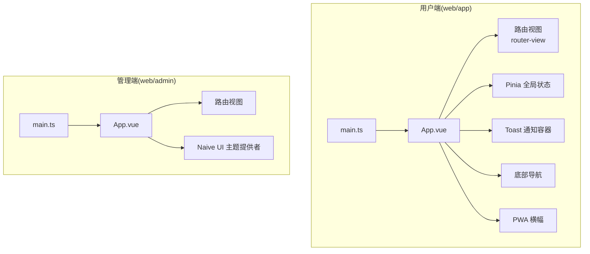
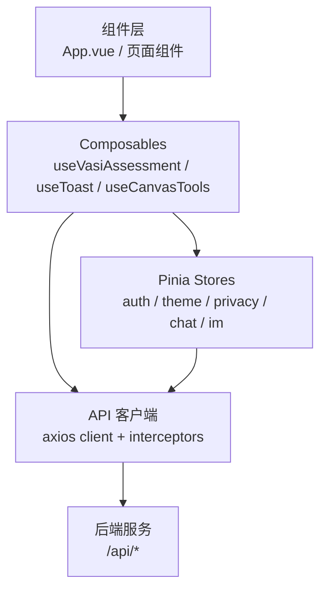
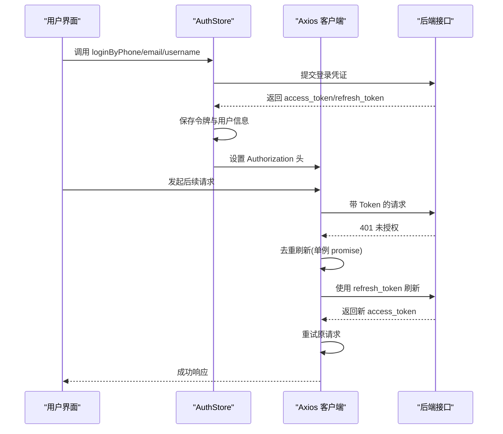
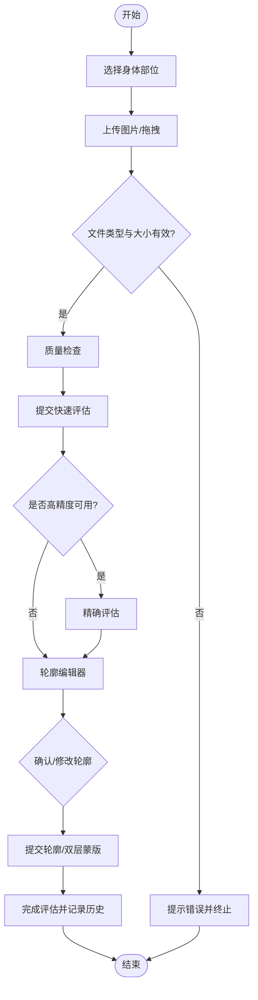
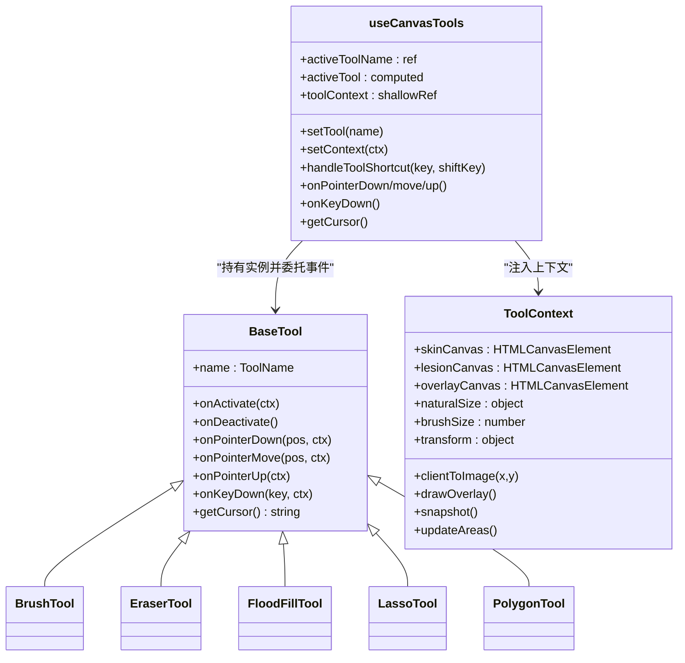
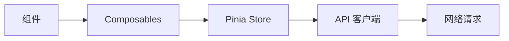

# 组件设计模式

<cite>
**本文引用的文件**   
- [web/app/src/main.ts](file://web/app/src/main.ts)
- [web/app/src/App.vue](file://web/app/src/App.vue)
- [web/admin/src/main.ts](file://web/admin/src/main.ts)
- [web/admin/src/App.vue](file://web/admin/src/App.vue)
- [web/app/src/types/index.ts](file://web/app/src/types/index.ts)
- [web/app/src/stores/auth.ts](file://web/app/src/stores/auth.ts)
- [web/admin/src/stores/auth.ts](file://web/admin/src/stores/auth.ts)
- [web/app/src/composables/useToast.ts](file://web/app/src/composables/useToast.ts)
- [web/app/src/composables/useVasiAssessment.ts](file://web/app/src/composables/useVasiAssessment.ts)
- [web/app/src/components/common/ToastContainer.vue](file://web/app/src/components/common/ToastContainer.vue)
- [web/app/src/api/client.ts](file://web/app/src/api/client.ts)
- [web/admin/src/composables/useCanvasTools.ts](file://web/admin/src/composables/useCanvasTools.ts)
- [web/admin/src/components/labeling/tools/BaseTool.ts](file://web/admin/src/components/labeling/tools/BaseTool.ts)
</cite>

## 目录
1. [简介](#简介)
2. [项目结构](#项目结构)
3. [核心组件与模式](#核心组件与模式)
4. [架构总览](#架构总览)
5. [详细组件分析](#详细组件分析)
6. [依赖关系分析](#依赖关系分析)
7. [性能考量](#性能考量)
8. [故障排查指南](#故障排查指南)
9. [结论](#结论)
10. [附录：测试与重构指南](#附录测试与重构指南)

## 简介
本文件面向 Subskin 前端（Vue 3 + TypeScript）的组件设计模式，聚焦以下主题：
- Vue 3 组合式 API 的使用模式与 Composables 复用策略
- Pinia 状态管理模式与跨模块数据流
- TypeScript 类型定义规范与前后端契约对齐
- 组件通信机制（Props/Events/Provide-Inject）
- 组件生命周期管理与错误处理策略
- 组件测试模式、性能优化技巧与代码组织规范
- 设计模式示例与重构指南

目标读者包括前端工程师、全栈开发者与维护者，旨在提供可落地的工程实践与最佳实践。

## 项目结构
Subskin 包含两个独立的前端应用：
- web/app：用户端应用，使用 Vue 3 + Vite + Tailwind + Pinia + Vue Router
- web/admin：管理后台，使用 Vue 3 + Naive UI + Pinia + Vue Router

入口与初始化：
- 用户端入口 main.ts 创建应用实例，注册 Pinia、Router，挂载根组件 App.vue
- 管理端入口 main.ts 创建应用实例，注册 Pinia、Router、Naive UI，挂载根组件 App.vue

图示来源
- [web/app/src/main.ts:1-11](file://web/app/src/main.ts#L1-L11)
- [web/app/src/App.vue:1-117](file://web/app/src/App.vue#L1-L117)
- [web/admin/src/main.ts:1-14](file://web/admin/src/main.ts#L1-L14)
- [web/admin/src/App.vue:1-23](file://web/admin/src/App.vue#L1-L23)

章节来源
- [web/app/src/main.ts:1-11](file://web/app/src/main.ts#L1-L11)
- [web/app/src/App.vue:1-117](file://web/app/src/App.vue#L1-L117)
- [web/admin/src/main.ts:1-14](file://web/admin/src/main.ts#L1-L14)
- [web/admin/src/App.vue:1-23](file://web/admin/src/App.vue#L1-L23)

## 核心组件与模式
- 组合式 API 与 Composables
  - useToast：全局消息提示，集中管理 toasts 列表与自动消失逻辑
  - useVasiAssessment：复杂业务编排（上传、质量检查、AI 评估、轮廓编辑、历史分页、草稿生成等），封装状态与方法，供页面级组件调用
  - useCanvasTools（管理端）：画布工具切换、上下文注入、快捷键绑定、指针事件分发
- Pinia 状态管理
  - 用户端 auth store：登录/注册、令牌刷新、用户信息缓存、文件 token 定时刷新、登出清理
  - 管理端 auth store：管理员登录、权限校验、路由跳转
- TypeScript 类型体系
  - types/index.ts：统一前后端数据结构（用户、帖子、评论、VASI 评估、集合等），保证强类型约束与一致性

章节来源
- [web/app/src/composables/useToast.ts:1-31](file://web/app/src/composables/useToast.ts#L1-L31)
- [web/app/src/composables/useVasiAssessment.ts:1-646](file://web/app/src/composables/useVasiAssessment.ts#L1-L646)
- [web/admin/src/composables/useCanvasTools.ts:1-127](file://web/admin/src/composables/useCanvasTools.ts#L1-L127)
- [web/app/src/stores/auth.ts:1-259](file://web/app/src/stores/auth.ts#L1-L259)
- [web/admin/src/stores/auth.ts:1-59](file://web/admin/src/stores/auth.ts#L1-L59)
- [web/app/src/types/index.ts:1-420](file://web/app/src/types/index.ts#L1-L420)

## 架构总览
整体采用“组件层 + Composables 层 + Store 层 + API 客户端”的分层架构：
- 组件层：负责 UI 渲染与交互，通过 Props/Events/Provide-Inject 进行通信
- Composables 层：封装可复用的业务逻辑与副作用（网络请求、定时器、事件监听等）
- Store 层：集中管理跨组件共享状态（认证、主题、IM、隐私等）
- API 层：Axios 客户端拦截器统一处理鉴权、刷新、错误

图示来源
- [web/app/src/App.vue:1-117](file://web/app/src/App.vue#L1-L117)
- [web/app/src/composables/useVasiAssessment.ts:1-646](file://web/app/src/composables/useVasiAssessment.ts#L1-L646)
- [web/app/src/stores/auth.ts:1-259](file://web/app/src/stores/auth.ts#L1-L259)
- [web/app/src/api/client.ts:1-84](file://web/app/src/api/client.ts#L1-L84)

## 详细组件分析

### 认证与令牌刷新流程（用户端）
该流程展示从登录到自动刷新令牌的完整链路，以及并发 401 的去重刷新策略。

图示来源
- [web/app/src/stores/auth.ts:1-259](file://web/app/src/stores/auth.ts#L1-L259)
- [web/app/src/api/client.ts:1-84](file://web/app/src/api/client.ts#L1-L84)

章节来源
- [web/app/src/stores/auth.ts:1-259](file://web/app/src/stores/auth.ts#L1-L259)
- [web/app/src/api/client.ts:1-84](file://web/app/src/api/client.ts#L1-L84)

### VASI 评估工作流（Composable）
该流程图展示了从选择部位、上传图片、质量检查、AI 评估、轮廓编辑到最终确认的关键步骤与分支。

图示来源
- [web/app/src/composables/useVasiAssessment.ts:1-646](file://web/app/src/composables/useVasiAssessment.ts#L1-L646)

章节来源
- [web/app/src/composables/useVasiAssessment.ts:1-646](file://web/app/src/composables/useVasiAssessment.ts#L1-L646)

### 画布工具管理器（管理端）
该图展示工具切换、上下文注入与事件分发的职责边界。

图示来源
- [web/admin/src/components/labeling/tools/BaseTool.ts:1-72](file://web/admin/src/components/labeling/tools/BaseTool.ts#L1-L72)
- [web/admin/src/composables/useCanvasTools.ts:1-127](file://web/admin/src/composables/useCanvasTools.ts#L1-L127)

章节来源
- [web/admin/src/components/labeling/tools/BaseTool.ts:1-72](file://web/admin/src/components/labeling/tools/BaseTool.ts#L1-L72)
- [web/admin/src/composables/useCanvasTools.ts:1-127](file://web/admin/src/composables/useCanvasTools.ts#L1-L127)

### 通知系统（Toast）
- 使用 ref 维护全局 toasts 列表
- 支持 success/warning/error/info 四种类型
- 自动定时移除，支持手动关闭
- 通过 Teleport 渲染至 body，避免层级问题

章节来源
- [web/app/src/composables/useToast.ts:1-31](file://web/app/src/composables/useToast.ts#L1-L31)
- [web/app/src/components/common/ToastContainer.vue:1-47](file://web/app/src/components/common/ToastContainer.vue#L1-L47)

## 依赖关系分析
- 组件对 Composables 的依赖：页面组件通过 import 引入 Composables，获取状态与方法
- Composables 对 Store 的依赖：如 useVasiAssessment 依赖 auth store 判断登录态
- Store 对 API 客户端的依赖：auth store 调用 api/auth 或 request 模块
- API 客户端对全局拦截器的依赖：统一处理鉴权、刷新、错误

图示来源
- [web/app/src/App.vue:1-117](file://web/app/src/App.vue#L1-L117)
- [web/app/src/composables/useVasiAssessment.ts:1-646](file://web/app/src/composables/useVasiAssessment.ts#L1-L646)
- [web/app/src/stores/auth.ts:1-259](file://web/app/src/stores/auth.ts#L1-L259)
- [web/app/src/api/client.ts:1-84](file://web/app/src/api/client.ts#L1-L84)

章节来源
- [web/app/src/App.vue:1-117](file://web/app/src/App.vue#L1-L117)
- [web/app/src/composables/useVasiAssessment.ts:1-646](file://web/app/src/composables/useVasiAssessment.ts#L1-L646)
- [web/app/src/stores/auth.ts:1-259](file://web/app/src/stores/auth.ts#L1-L259)
- [web/app/src/api/client.ts:1-84](file://web/app/src/api/client.ts#L1-L84)

## 性能考量
- 懒加载与按需导入：在点击事件中动态 import composables，减少首屏体积
- Keep-alive 缓存：对高频访问页面（如社区页）启用 keep-alive，避免重复渲染
- 浅引用与计算属性：使用 shallowRef 与 computed 降低不必要的响应式开销
- 防抖与节流：对频繁触发的事件（滚动、输入）进行节流；对搜索与提交进行防抖
- 图片与媒体优化：使用 FileReader 生成 data URL 提升预览稳定性；限制文件大小与类型
- 并发请求去重：401 刷新使用单例 promise，避免多次刷新造成竞态
- 分页与增量加载：历史记录支持分页与追加加载，减少一次性数据量

[本节为通用指导，不直接分析具体文件]

## 故障排查指南
- 401 未授权
  - 检查 localStorage 中是否存在 refresh_token
  - 观察 axios 拦截器是否进入刷新流程
  - 若刷新失败，将清除本地存储并强制刷新页面
- 文件上传失败
  - 确保 FormData 请求时删除 Content-Type 头，让浏览器自动设置 multipart/form-data
  - 检查文件大小与类型限制
- 令牌过期
  - 检查 _startFileTokenRefresher 是否启动，确保文件 token 定期刷新
  - 检查 tryRefreshToken 是否正确更新 access_token 与 refresh_token
- 通知不显示
  - 确认 ToastContainer 已挂载且 Teleport 目标存在
  - 检查 toasts 列表是否为空，remove 方法是否被调用

章节来源
- [web/app/src/api/client.ts:1-84](file://web/app/src/api/client.ts#L1-L84)
- [web/app/src/stores/auth.ts:1-259](file://web/app/src/stores/auth.ts#L1-L259)
- [web/app/src/components/common/ToastContainer.vue:1-47](file://web/app/src/components/common/ToastContainer.vue#L1-L47)

## 结论
Subskin 前端采用清晰的层次化架构与成熟的组合式模式，结合 Pinia 与 Axios 拦截器实现了稳定的状态管理与鉴权流程。通过 Composables 抽象复杂业务逻辑、TypeScript 强化类型安全、以及完善的错误处理与性能优化策略，项目具备良好的可维护性与扩展性。建议持续遵循本文档中的模式与规范，保持代码一致性与高质量。

[本节为总结，不直接分析具体文件]

## 附录：测试与重构指南
- 组件测试模式
  - 单元测试 Composables：模拟响应式状态与异步行为，验证方法输出与副作用
  - 集成测试 Store：模拟 API 响应，验证状态变更与持久化逻辑
  - 端到端测试关键流程：登录、上传、评估、历史分页
- 重构指南
  - 拆分大型 Composables：按职责拆分为更小的函数或子模块
  - 提取公共逻辑：如文件处理、时间格式化、颜色映射等
  - 统一错误处理：在 API 层与 Store 层集中处理异常，组件仅关注展示
  - 类型演进：逐步完善 types/index.ts，对齐后端字段变化，避免 any 类型滥用

[本节为通用指导，不直接分析具体文件]