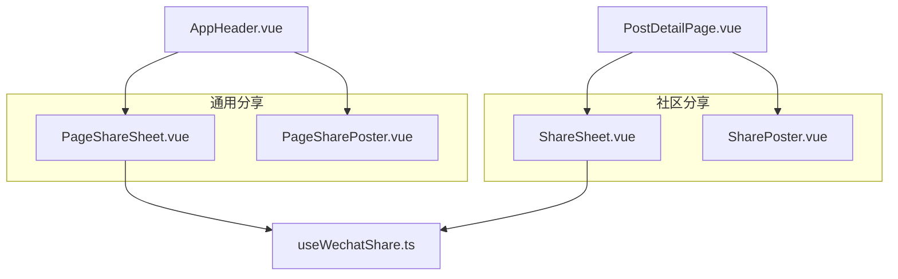
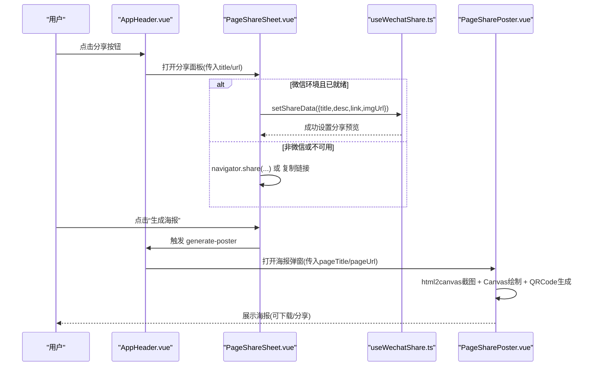
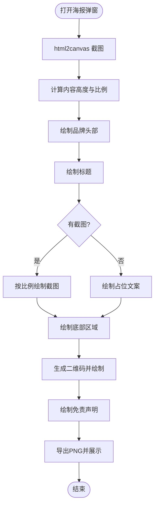
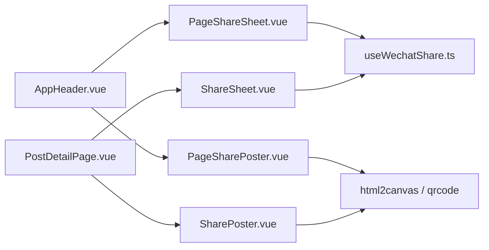

# 分享组件

<cite>
**本文引用的文件**
- [PageSharePoster.vue](file://web/app/src/components/common/PageSharePoster.vue)
- [PageShareSheet.vue](file://web/app/src/components/common/PageShareSheet.vue)
- [SharePoster.vue](file://web/app/src/components/community/SharePoster.vue)
- [ShareSheet.vue](file://web/app/src/components/community/ShareSheet.vue)
- [useWechatShare.ts](file://web/app/src/composables/useWechatShare.ts)
- [AppHeader.vue](file://web/app/src/components/layout/AppHeader.vue)
- [PostDetailPage.vue](file://web/app/src/views/PostDetailPage.vue)
</cite>

## 目录
1. [简介](#简介)
2. [项目结构](#项目结构)
3. [核心组件](#核心组件)
4. [架构总览](#架构总览)
5. [详细组件分析](#详细组件分析)
6. [依赖分析](#依赖分析)
7. [性能考虑](#性能考虑)
8. [故障排查指南](#故障排查指南)
9. [结论](#结论)
10. [附录：集成示例与最佳实践](#附录：集成示例与最佳实践)

## 简介
本文件面向 Subskin 项目的“分享”能力，聚焦以下两个关键页面组件及其协作关系：
- PageSharePoster：页面分享海报生成器。通过 Canvas 绘制、截图合成、二维码生成等能力，将当前页面或社区帖子渲染为可保存/分享的高清海报。
- PageShareSheet：分享面板。提供多种分享渠道（微信、朋友圈、微博、复制链接、生成海报等）的统一入口，并处理不同环境下的分享行为差异。

同时，社区场景提供了 SharePoster 与 ShareSheet，用于针对具体帖子的分享体验。

## 项目结构
分享相关的前端代码主要位于 web/app/src 下：
- 通用分享能力：components/common 下的 PageSharePoster.vue、PageShareSheet.vue
- 社区分享能力：components/community 下的 SharePoster.vue、ShareSheet.vue
- 微信分享 composable：composables/useWechatShare.ts
- 集成入口：layout/AppHeader.vue（全局分享）、views/PostDetailPage.vue（帖子详情分享）

**图示来源**
- [AppHeader.vue:178-190](file://web/app/src/components/layout/AppHeader.vue#L178-L190)
- [PostDetailPage.vue:439-440](file://web/app/src/views/PostDetailPage.vue#L439-L440)
- [PageShareSheet.vue:1-187](file://web/app/src/components/common/PageShareSheet.vue#L1-L187)
- [PageSharePoster.vue:1-376](file://web/app/src/components/common/PageSharePoster.vue#L1-L376)
- [ShareSheet.vue:1-185](file://web/app/src/components/community/ShareSheet.vue#L1-L185)
- [SharePoster.vue:1-552](file://web/app/src/components/community/SharePoster.vue#L1-L552)
- [useWechatShare.ts:1-77](file://web/app/src/composables/useWechatShare.ts#L1-L77)

**章节来源**
- [AppHeader.vue:178-190](file://web/app/src/components/layout/AppHeader.vue#L178-L190)
- [PostDetailPage.vue:439-440](file://web/app/src/views/PostDetailPage.vue#L439-L440)

## 核心组件
- PageSharePoster：负责将页面内容以 Canvas 方式绘制为海报，包含头部品牌区、正文截图/占位、底部二维码与免责声明；支持下载与 Web Share API 分享。
- PageShareSheet：统一分享入口，支持复制链接、打开微博分享页、微信分享（JSSDK）、朋友圈、以及触发海报生成。
- SharePoster：针对社区帖子生成海报，解析 Tiptap JSON 内容块，按标题、作者、时间、正文进行排版，并在底部生成帖子链接的二维码。
- ShareSheet：社区版分享面板，逻辑与通用版类似，但链接指向帖子详情页。
- useWechatShare：封装微信 JSSDK 初始化与分享数据设置，适配微信内浏览器环境。

**章节来源**
- [PageSharePoster.vue:60-376](file://web/app/src/components/common/PageSharePoster.vue#L60-L376)
- [PageShareSheet.vue:1-187](file://web/app/src/components/common/PageShareSheet.vue#L1-L187)
- [SharePoster.vue:61-552](file://web/app/src/components/community/SharePoster.vue#L61-L552)
- [ShareSheet.vue:1-185](file://web/app/src/components/community/ShareSheet.vue#L1-L185)
- [useWechatShare.ts:1-77](file://web/app/src/composables/useWechatShare.ts#L1-L77)

## 架构总览
分享功能由“入口面板 + 海报生成 + 渠道分发”三层组成：
- 入口面板：PageShareSheet / ShareSheet，负责收集分享上下文（标题、描述、URL），并根据环境选择合适渠道。
- 海报生成：PageSharePoster / SharePoster，使用 html2canvas 与 Canvas 绘制，结合 qrcode 生成二维码，输出 PNG 图片。
- 渠道分发：微信（JSSDK）、Web Share API、微博外链、复制链接等。

**图示来源**
- [AppHeader.vue:178-190](file://web/app/src/components/layout/AppHeader.vue#L178-L190)
- [PageShareSheet.vue:26-80](file://web/app/src/components/common/PageShareSheet.vue#L26-L80)
- [useWechatShare.ts:14-72](file://web/app/src/composables/useWechatShare.ts#L14-L72)
- [PageSharePoster.vue:97-338](file://web/app/src/components/common/PageSharePoster.vue#L97-L338)

## 详细组件分析

### PageSharePoster（页面海报生成器）
- 输入参数：visible、pageTitle、pageUrl
- 核心流程：
  - 监听 visible 变化，打开时自动开始生成，关闭时清理状态
  - 使用 html2canvas 对 main/#app 区域截图，计算内容高度与比例
  - 创建 Canvas，绘制品牌头部（渐变背景、Logo、标语、网址）
  - 绘制标题与截图（保持纵横比，居中裁剪）
  - 底部绘制二维码（基于 pageUrl），并添加免责声明
  - 导出为 dataURL，支持下载与 Web Share API 分享
- 兼容性与降级：
  - 微信环境提示长按保存
  - 不支持 Web Share API 时回退到复制链接
  - 截图失败时显示占位文案

**图示来源**
- [PageSharePoster.vue:97-338](file://web/app/src/components/common/PageSharePoster.vue#L97-L338)

**章节来源**
- [PageSharePoster.vue:60-376](file://web/app/src/components/common/PageSharePoster.vue#L60-L376)

### PageShareSheet（通用分享面板）
- 输入参数：visible、title、description、url
- 功能：
  - 复制链接：优先使用 Clipboard API，回退到 execCommand('copy')
  - 微信分享：在微信内通过 JSSDK 设置分享数据；未就绪时提示手动分享
  - 朋友圈：复用微信分享逻辑
  - 微博：打开官方分享外链
  - 生成海报：触发父级生成海报流程
- 交互设计：
  - 网格布局，图标+文字，移动端底部弹出，桌面端居中弹窗
  - 顶部标题栏与关闭按钮，底部取消按钮（移动端）

**章节来源**
- [PageShareSheet.vue:1-187](file://web/app/src/components/common/PageShareSheet.vue#L1-L187)

### SharePoster（社区帖子海报）
- 输入参数：visible、post（含 id/title/content/content_json/created_at/author/category/city）
- 核心流程：
  - 解析 Tiptap JSON 内容块，提取 heading/paragraph 文本与加粗标记
  - 绘制品牌头部（更大尺寸、装饰圆）
  - 绘制分类标签、标题、作者头像与昵称、城市、相对时间
  - 绘制正文内容块，支持换行与截断提示
  - 底部绘制帖子链接二维码与免责声明
  - 导出 PNG，支持下载与 Web Share API 分享（失败回退到分享 URL）
- 文本排版：
  - wrapText 函数实现按宽度逐字测量与换行，支持最大行数与省略号
  - 根据 heading level 调整字号与行高

**章节来源**
- [SharePoster.vue:61-552](file://web/app/src/components/community/SharePoster.vue#L61-L552)

### ShareSheet（社区分享面板）
- 输入参数：visible、post
- 功能：
  - 复制链接：拼接帖子 URL
  - 微信分享：设置分享数据（标题、摘要、链接、封面图）
  - 朋友圈：复用微信分享
  - 微博：打开外链
  - 生成海报：触发 SharePoster
- 交互与样式：与通用版一致

**章节来源**
- [ShareSheet.vue:1-185](file://web/app/src/components/community/ShareSheet.vue#L1-L185)

### useWechatShare（微信分享 composable）
- 职责：
  - 检测是否在微信内
  - 调用后端接口获取 JSSDK 配置并初始化
  - 提供 setShareData 更新“发送给朋友”和“朋友圈”的分享信息
- 关键点：
  - 仅在微信环境且 ready 后生效
  - 默认分享数据包含标题、描述、链接与封面图
  - 错误时记录日志，不影响主流程

**章节来源**
- [useWechatShare.ts:1-77](file://web/app/src/composables/useWechatShare.ts#L1-L77)

## 依赖分析
- 第三方库：
  - html2canvas：页面截图转 Canvas
  - qrcode：生成二维码 DataURL
  - weixin-js-sdk：微信 JSSDK 分享能力
- 内部依赖：
  - AppHeader.vue：全局分享入口，挂载 PageShareSheet/PageSharePoster
  - PostDetailPage.vue：帖子详情分享入口，挂载 ShareSheet/SharePoster
  - useWechatShare.ts：被两个 Sheet 复用

**图示来源**
- [AppHeader.vue:178-190](file://web/app/src/components/layout/AppHeader.vue#L178-L190)
- [PostDetailPage.vue:439-440](file://web/app/src/views/PostDetailPage.vue#L439-L440)
- [PageShareSheet.vue:1-187](file://web/app/src/components/common/PageShareSheet.vue#L1-L187)
- [PageSharePoster.vue:60-376](file://web/app/src/components/common/PageSharePoster.vue#L60-L376)
- [ShareSheet.vue:1-185](file://web/app/src/components/community/ShareSheet.vue#L1-L185)
- [SharePoster.vue:61-552](file://web/app/src/components/community/SharePoster.vue#L61-L552)
- [useWechatShare.ts:1-77](file://web/app/src/composables/useWechatShare.ts#L1-L77)

**章节来源**
- [AppHeader.vue:178-190](file://web/app/src/components/layout/AppHeader.vue#L178-L190)
- [PostDetailPage.vue:439-440](file://web/app/src/views/PostDetailPage.vue#L439-L440)

## 性能考虑
- 截图优化：
  - 限制截图高度上限，避免超大 DOM 导致内存溢出
  - 合理设置 scale 与 useCORS，减少重绘与跨域问题
- Canvas 绘制：
  - 控制字体与图形数量，避免过多复杂路径
  - 二维码尺寸适中，兼顾清晰度与体积
- 资源加载：
  - Logo 与外部图片需允许跨域，必要时使用代理或同源资源
- 分享体验：
  - 微信环境优先使用 JSSDK 设置分享预览，减少额外请求
  - 不支持 Web Share API 时快速回退到复制链接，降低等待时间

[本节为通用指导，不直接分析具体文件]

## 故障排查指南
- 海报生成失败：
  - 检查 html2canvas 是否报错（控制台警告/错误）
  - 确认页面元素可见且未被隐藏，DOM 尺寸正常
  - 若截图失败，查看是否回退到占位文案
- 二维码无法显示：
  - 检查 qrcode 生成是否抛出异常
  - 确认目标 URL 合法且可访问
- 微信分享无效：
  - 确认已在微信环境且 JSSDK 初始化成功
  - 检查后端 /api/wechat/jssdk-config 返回是否正确
  - 若未就绪，提示用户手动分享
- 复制链接失败：
  - 在非安全上下文（HTTP）可能受限，建议升级 HTTPS
  - 回退方案使用 textarea + execCommand('copy')

**章节来源**
- [PageSharePoster.vue:107-125](file://web/app/src/components/common/PageSharePoster.vue#L107-L125)
- [PageSharePoster.vue:301-313](file://web/app/src/components/common/PageSharePoster.vue#L301-L313)
- [PageShareSheet.vue:31-46](file://web/app/src/components/common/PageShareSheet.vue#L31-L46)
- [useWechatShare.ts:14-47](file://web/app/src/composables/useWechatShare.ts#L14-L47)

## 结论
Subskin 的分享组件通过“面板入口 + 海报生成 + 多渠道分发”的清晰分层，实现了跨平台一致的分享体验。通用组件适用于任意页面，社区组件则针对帖子内容进行深度定制。借助 html2canvas、qrcode 与微信 JSSDK，系统在兼容性、可用性与性能之间取得良好平衡。后续可进一步引入缓存策略与异步任务队列，提升大规模分享场景下的稳定性与响应速度。

[本节为总结性内容，不直接分析具体文件]

## 附录：集成示例与最佳实践
- 在应用头部分享：
  - 在 AppHeader 中引入 PageShareSheet 与 PageSharePoster，绑定 visible 状态与回调
  - 传递 title/url 给分享面板，触发海报生成时再打开海报弹窗
- 在帖子详情页分享：
  - 在 PostDetailPage 中引入 ShareSheet 与 SharePoster，绑定 post 数据
  - 点击分享打开面板，选择“生成海报”后切换到海报弹窗
- 最佳实践：
  - 始终提供复制链接作为兜底方案
  - 在微信环境优先使用 JSSDK 设置分享预览
  - 海报生成前确保页面元素可见，避免空截图
  - 对长内容使用截断提示，引导用户登录查看详情

**章节来源**
- [AppHeader.vue:178-190](file://web/app/src/components/layout/AppHeader.vue#L178-L190)
- [PostDetailPage.vue:439-440](file://web/app/src/views/PostDetailPage.vue#L439-L440)