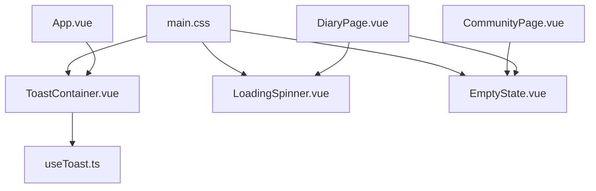
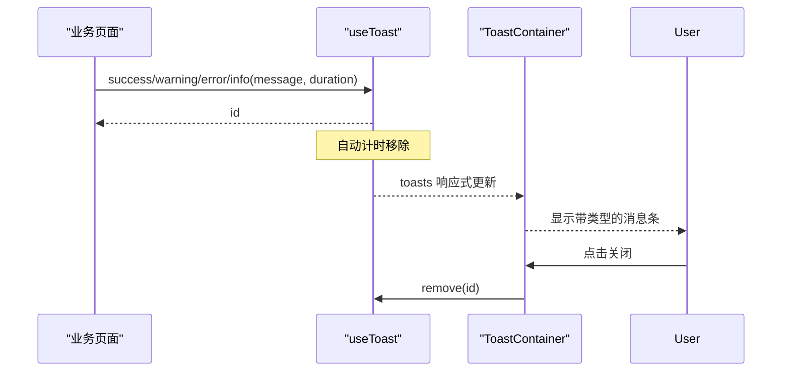
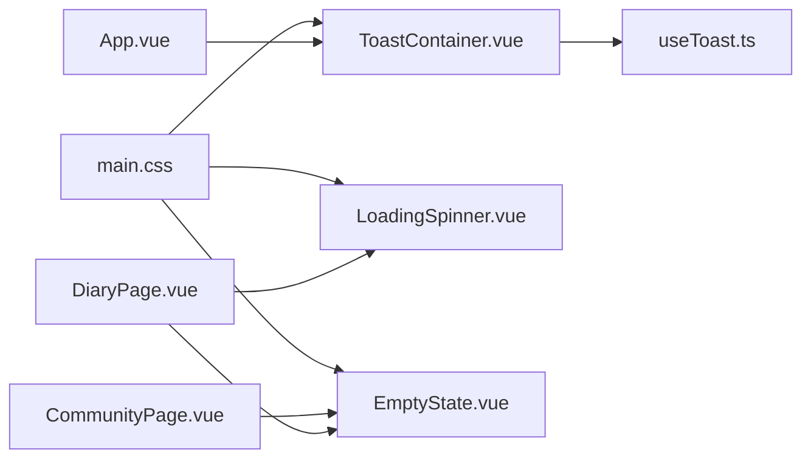

# 反馈组件

<cite>
**本文引用的文件**
- [LoadingSpinner.vue](file://web/app/src/components/common/LoadingSpinner.vue)
- [EmptyState.vue](file://web/app/src/components/common/EmptyState.vue)
- [ToastContainer.vue](file://web/app/src/components/common/ToastContainer.vue)
- [useToast.ts](file://web/app/src/composables/useToast.ts)
- [main.css](file://web/app/src/styles/main.css)
- [App.vue](file://web/app/src/App.vue)
- [DiaryPage.vue](file://web/app/src/views/DiaryPage.vue)
- [CommunityPage.vue](file://web/app/src/views/CommunityPage.vue)
</cite>

## 目录
1. [简介](#简介)
2. [项目结构](#项目结构)
3. [核心组件](#核心组件)
4. [架构总览](#架构总览)
5. [详细组件分析](#详细组件分析)
6. [依赖关系分析](#依赖关系分析)
7. [性能考量](#性能考量)
8. [故障排查指南](#故障排查指南)
9. [结论](#结论)
10. [附录：使用示例与最佳实践](#附录使用示例与最佳实践)

## 简介
本章节面向 Subskin 前端应用中的“用户反馈”类通用组件，涵盖三类关键能力：
- LoadingSpinner：统一的加载指示器，支持多种视觉变体（旋转、脉冲、骨架屏）。
- EmptyState：统一空状态占位提示，提供图标、标题、描述与可选操作按钮。
- ToastContainer + useToast：全局消息提示容器与状态管理，支持成功、警告、错误、信息四类消息及自动消失。

这些组件为页面在数据加载、无数据、操作结果等场景下提供一致的视觉与交互体验，并遵循项目的主题色体系与无障碍基础规范。

## 项目结构
反馈相关代码位于 web/app/src 下的 common 组件与 composables：
- 组件层：LoadingSpinner.vue、EmptyState.vue、ToastContainer.vue
- 状态层：useToast.ts（单例式 toast 状态）
- 样式层：main.css（主题变量、按钮、卡片等基础样式）
- 集成点：App.vue 挂载 ToastContainer；业务页面按需引入 LoadingSpinner 与 EmptyState

图表来源
- [App.vue:1-17](file://web/app/src/App.vue#L1-L17)
- [ToastContainer.vue:1-30](file://web/app/src/components/common/ToastContainer.vue#L1-L30)
- [useToast.ts:1-31](file://web/app/src/composables/useToast.ts#L1-L31)
- [LoadingSpinner.vue:1-48](file://web/app/src/components/common/LoadingSpinner.vue#L1-L48)
- [EmptyState.vue:1-37](file://web/app/src/components/common/EmptyState.vue#L1-L37)
- [main.css:1-213](file://web/app/src/styles/main.css#L1-L213)

章节来源
- [App.vue:1-17](file://web/app/src/App.vue#L1-L17)
- [main.css:1-213](file://web/app/src/styles/main.css#L1-L213)

## 核心组件
- LoadingSpinner：通过 props 控制显示类型与文案，内置三种变体，适配不同加载场景。
- EmptyState：通过 props 配置图标、标题、描述与操作按钮，用于无数据的兜底展示。
- ToastContainer：渲染来自 useToast 的消息列表，按类型着色，支持手动关闭与过渡动画。
- useToast：维护全局 toasts 数组，提供 show/success/warning/error/remove 等方法，支持自动消失。

章节来源
- [LoadingSpinner.vue:1-48](file://web/app/src/components/common/LoadingSpinner.vue#L1-L48)
- [EmptyState.vue:1-37](file://web/app/src/components/common/EmptyState.vue#L1-L37)
- [ToastContainer.vue:1-47](file://web/app/src/components/common/ToastContainer.vue#L1-L47)
- [useToast.ts:1-31](file://web/app/src/composables/useToast.ts#L1-L31)

## 架构总览
反馈组件采用“容器 + 状态”的轻量组合模式：
- 视图层：LoadingSpinner、EmptyState、ToastContainer 负责 UI 呈现与交互。
- 状态层：useToast 以模块级 ref 维护消息队列，供任意组件调用。
- 样式层：基于 Tailwind 与 CSS 变量，统一主题色、按钮、卡片等基础样式。
- 集成层：App.vue 全局挂载 ToastContainer，确保全应用可见。

图表来源
- [useToast.ts:12-30](file://web/app/src/composables/useToast.ts#L12-L30)
- [ToastContainer.vue:1-30](file://web/app/src/components/common/ToastContainer.vue#L1-L30)

## 详细组件分析

### LoadingSpinner 加载动画
- 设计目标：统一加载态，减少重复实现，提升一致性。
- 视觉规范：
  - spinner：中心旋转圆环，主色边框与顶部高亮，配合居中布局。
  - pulse：图标脉冲动画，适合等待或占位。
  - skeleton：骨架卡片网格，模拟内容区块，提升感知速度。
- 配置选项：
  - message：加载提示文案（默认中文提示）。
  - variant：'spinner' | 'pulse' | 'skeleton'（默认 spinner）。
  - skeletonCount：骨架卡片数量（仅 skeleton 变体有效，默认 6）。
- 动画效果：
  - 旋转：CSS 动画循环旋转。
  - 脉冲：CSS 动画透明度变化。
  - 骨架：CSS 动画闪烁占位。
- 无障碍建议：
  - 可结合 aria-live 区域播报加载开始/结束（由父组件控制）。
  - 避免在低对比度模式下降低可读性。
- 复杂度与性能：
  - 纯 DOM/CSS 动画，开销极低；骨架网格可根据 skeletonCount 线性扩展。
- 典型用法：
  - 列表首次加载、异步生成内容时显示。

章节来源
- [LoadingSpinner.vue:1-48](file://web/app/src/components/common/LoadingSpinner.vue#L1-L48)
- [main.css:1-213](file://web/app/src/styles/main.css#L1-L213)

### EmptyState 空状态提示
- 设计目标：统一无数据占位，引导用户下一步操作。
- 视觉规范：
  - 居中大图标 + 标题 + 可选描述 + 可选主按钮。
  - 颜色与间距遵循主题与排版规范。
- 配置选项：
  - icon：图标类名（默认编辑类图标）。
  - title：标题文案（默认“暂无内容”）。
  - description：补充说明（可选）。
  - actionLabel：操作按钮文案（可选）。
- 交互逻辑：
  - 点击按钮触发 action 事件，由父组件处理跳转或弹窗等。
- 无障碍建议：
  - 按钮具备可聚焦与键盘操作；必要时添加 aria-label。
- 复杂度与性能：
  - 静态渲染，无额外计算。
- 典型用法：
  - 社区动态为空、日记列表为空等场景。

章节来源
- [EmptyState.vue:1-37](file://web/app/src/components/common/EmptyState.vue#L1-L37)
- [CommunityPage.vue:497-503](file://web/app/src/views/CommunityPage.vue#L497-L503)
- [DiaryPage.vue:362-367](file://web/app/src/views/DiaryPage.vue#L362-L367)

### ToastContainer 消息提示容器
- 设计目标：集中渲染全局消息，提供一致的位置、样式与过渡动画。
- 视觉规范：
  - 固定定位右上角，最大宽度限制，垂直堆叠。
  - 根据类型映射背景、边框与文字颜色（成功/警告/错误/信息）。
  - 进入/离开动画：从右侧滑入与滑出，淡入淡出。
- 配置选项：
  - 由 useToast 传入 type/message/id，容器仅做渲染与关闭。
- 交互逻辑：
  - 点击 × 调用 remove(id) 立即移除。
  - 超时自动移除（由 useToast 控制）。
- 无障碍建议：
  - 可使用 aria-live="polite" 的区域包裹，便于读屏器播报新消息。
- 复杂度与性能：
  - 列表渲染开销与消息数量线性相关；合理设置自动消失时间避免堆积。
- 典型用法：
  - 表单提交成功/失败、分享成功、复制链接等即时反馈。

章节来源
- [ToastContainer.vue:1-47](file://web/app/src/components/common/ToastContainer.vue#L1-L47)
- [useToast.ts:1-31](file://web/app/src/composables/useToast.ts#L1-L31)

### useToast 消息状态管理
- 数据结构：
  - toasts：消息数组，每项包含 id、message、type。
  - nextId：自增 ID 生成器。
- API：
  - show(message, type, duration)：显示消息，支持自定义类型与时长（默认 3000ms）。
  - success/warning/error：便捷方法，默认 info。
  - remove(id)：手动移除指定消息。
- 生命周期：
  - 加入数组 -> 定时器 -> 自动过滤移除。
- 复杂度与性能：
  - 数组 push/filter 均为 O(n)，n 为当前消息数；建议合理设置 duration 与上限。
- 国际化与无障碍：
  - 当前 message 为字符串，建议在调用处传入本地化后的文案。
  - 可在容器外层增加 aria-live 区域以提升可访问性。

章节来源
- [useToast.ts:1-31](file://web/app/src/composables/useToast.ts#L1-L31)

## 依赖关系分析
- App.vue 全局挂载 ToastContainer，保证消息在全局可见。
- 各业务页面按需引入 LoadingSpinner 与 EmptyState，并在条件渲染中切换。
- main.css 提供主题变量与通用样式，被三个组件共同消费。

图表来源
- [App.vue:1-17](file://web/app/src/App.vue#L1-L17)
- [ToastContainer.vue:1-30](file://web/app/src/components/common/ToastContainer.vue#L1-L30)
- [useToast.ts:1-31](file://web/app/src/composables/useToast.ts#L1-L31)
- [LoadingSpinner.vue:1-48](file://web/app/src/components/common/LoadingSpinner.vue#L1-L48)
- [EmptyState.vue:1-37](file://web/app/src/components/common/EmptyState.vue#L1-L37)
- [main.css:1-213](file://web/app/src/styles/main.css#L1-L213)

章节来源
- [App.vue:1-17](file://web/app/src/App.vue#L1-L17)
- [main.css:1-213](file://web/app/src/styles/main.css#L1-L213)

## 性能考量
- 动画性能：
  - 使用 CSS transform/opacity 动画，GPU 加速友好；避免大量同时运行的复杂动画。
- 列表渲染：
  - Toast 列表随消息增长而增大，建议限制最大显示数量或在容器内滚动。
- 骨架屏：
  - skeletonCount 越大，DOM 节点越多；根据实际布局调整默认值。
- 内存与定时器：
  - useToast 使用 setTimeout 自动移除，注意长时间运行时的定时器清理（当前实现已自动清理）。

[本节为通用指导，不直接分析具体文件]

## 故障排查指南
- Toast 不显示：
  - 确认 App.vue 已挂载 ToastContainer。
  - 检查 useToast 是否被正确引入并调用。
- Toast 不消失：
  - 检查 duration 是否为 0 或未传入导致未设置定时器。
  - 检查是否有其他逻辑阻止了 remove。
- 样式异常：
  - 确认 main.css 已引入，Tailwind 构建正常。
  - 检查主题变量与暗色模式是否生效。
- 空状态不出现：
  - 检查数据是否为空的条件判断是否正确。
  - 确认 EmptyState 的 props 是否传对。
- 加载动画卡顿：
  - 减少 skeletonCount 或避免过多同时加载。
  - 检查是否存在阻塞主线程的操作。

章节来源
- [App.vue:1-17](file://web/app/src/App.vue#L1-L17)
- [useToast.ts:12-30](file://web/app/src/composables/useToast.ts#L12-L30)
- [ToastContainer.vue:1-47](file://web/app/src/components/common/ToastContainer.vue#L1-L47)
- [main.css:1-213](file://web/app/src/styles/main.css#L1-L213)

## 结论
Subskin 的反馈组件以简洁的 API 与一致的视觉语言，覆盖了加载、空态与消息提示三大高频场景。通过 LoadingSpinner、EmptyState、ToastContainer 与 useToast 的组合，既保证了跨页面的一致性，又提供了足够的灵活性以满足不同业务需求。建议在实际使用中：
- 统一文案风格与交互反馈时机。
- 合理使用 skeletonCount 与 toast duration 平衡性能与体验。
- 在需要时增强无障碍属性，提升可访问性。

[本节为总结性内容，不直接分析具体文件]

## 附录：使用示例与最佳实践

### 使用示例
- 在日记页展示加载与空状态：
  - 首次加载列表时显示 LoadingSpinner。
  - 当列表为空时显示 EmptyState，并提供引导文案。
- 在社区页展示空状态：
  - 当无同城分享或无内容时，显示 EmptyState，并可附带“发布分享”等操作。
- 全局消息提示：
  - 在分享成功、复制链接、上传失败等场景调用 useToast 的便捷方法。

章节来源
- [DiaryPage.vue:287-367](file://web/app/src/views/DiaryPage.vue#L287-L367)
- [CommunityPage.vue:497-503](file://web/app/src/views/CommunityPage.vue#L497-L503)
- [App.vue:26-47](file://web/app/src/App.vue#L26-L47)

### 最佳实践
- 视觉与主题：
  - 遵循 main.css 的主题变量与按钮样式，保持整体一致性。
- 动画与性能：
  - 优先使用 CSS 动画；避免在同一视口内同时启动过多动画。
  - 合理设置 skeletonCount 与 toast duration，防止性能抖动。
- 交互与可访问性：
  - 为按钮与可操作元素提供合适的尺寸与焦点样式。
  - 在适当位置添加 aria-live 区域，帮助读屏器播报重要状态变化。
- 国际化：
  - 将 message/title/description 等文案交由 i18n 管理，在调用处传入本地化文本。
- 错误处理：
  - 网络请求失败时使用 error 类型提示，并给出重试入口或帮助文案。
  - 对于关键路径的错误，考虑升级为模态提示而非仅 toast。

[本节为通用指导，不直接分析具体文件]